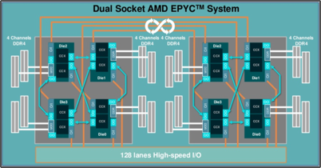
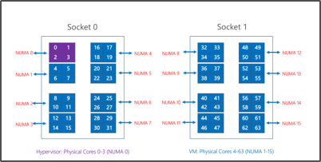

# HB-Series overview

Maximizing HPC application performance on AMD EPYC requires a thoughtful approach memory locality and process placement. Below, we outline the AMD EPYC architecture and our implementation of it on Azure for HPC applications. We will use the term “pNUMA” to refer to a physical NUMA domain, and “vNUMA” to refer to a virtualized NUMA domain.

Physically, a HB-series is 2 * 32-core EPYC 7551 CPUs for a total of 64 physical cores. These 64 cores are divided into 16 pNUMA domains (8 per socket), each of which is 4 cores and known as a “CPU Complex” (or “CCX”). Each CCX has its own L3 cache, which is how an OS will see a pNUMA/vNUMA boundary. A pair of adjacent CCXs shares access to 2-channels of physical DRAM (32 GB of DRAM in HB-series servers).

To provide room for the Azure hypervisor to operate without interfering with the VM, we reserve physical pNUMA domain 0 (the first CCX). We then assign pNUMA domains 1-15 (the remaining CCX units) for the VM. The VM will see:

`(15 vNUMA domains) * (4 cores/vNUMA) = 60` cores per VM

The VM, itself, doesn't know that pNUMA 0 wasn't given to it. The VM understands pNUMA 1-15 as vNUMA 0-14, with 7 vNUMA on vSocket 0 and 8 vNUMA on vSocket 1. While this is asymmetrical, your OS should boot and operate normally. Later in this guide, we instruct how best to run MPI applications on this asymmetric NUMA layout.

Process pinning will work on HB-series VMs because we expose the underlying silicon as-is to the guest VM. We strongly recommend process pinning for optimal performance and consistency.

More on AMD EPYC architecture at: https://bit.ly/2GpQIMb and https://bit.ly/2Epv3kC, and an HPC Tuning Guide for AMD EPYC Processors at: https://bit.ly/2T3AWZ9

Topology of EPYC 2P Server

Segregation of cores reserved for Azure Hypervisor and HB-series VM

## Hardware specifications

| HW Specifications                | HB-series VM                     |
|----------------------------------|----------------------------------|
| Cores                            | 60 (SMT disabled)                |
| CPU                              | AMD EPYC 7551*                   |
| CPU Frequency (non-AVX)          | ~2.55 GHz (single + all cores)   |
| Memory                           | 4 GB/core (240 total)            |
| Local Disk                       | 700 GB NVMe                      |
| Infiniband                       | 100 Gb EDR Mellanox ConnectX-5** |
| Network                          | 50 Gb Ethernet (40 Gb usable) Azure 2nd Gen SmartNIC*** |

## Software specifications

| SW Specifications           |HB-series VM           |
|-----------------------------|-----------------------|
| Max MPI Job Size            | 6000 cores  (100 VMSS) 12000 cores (200 VMSS)  |
| MPI Support                 | MVAPICH2, OpenMPI, MPICH, Platform MPI, Intel MPI  |
| Additional Frameworks       | Unified Communication X, libfabric, PGAS |
| Azure Storage Support       | Std + Premium (max 4 disks) |
| OS Support for SRIOV RDMA   | CentOS/RHEL 7.6+, SLES 12 SP4+, WinServer 2016+  |
| Azure CycleCloud Support    | Yes                         |
| Azure Batch Support         | Yes                         |

## Next steps

Learn more about [high-performance computing](https://docs.microsoft.com/azure/architecture/topics/high-performance-computing/) in Azure.