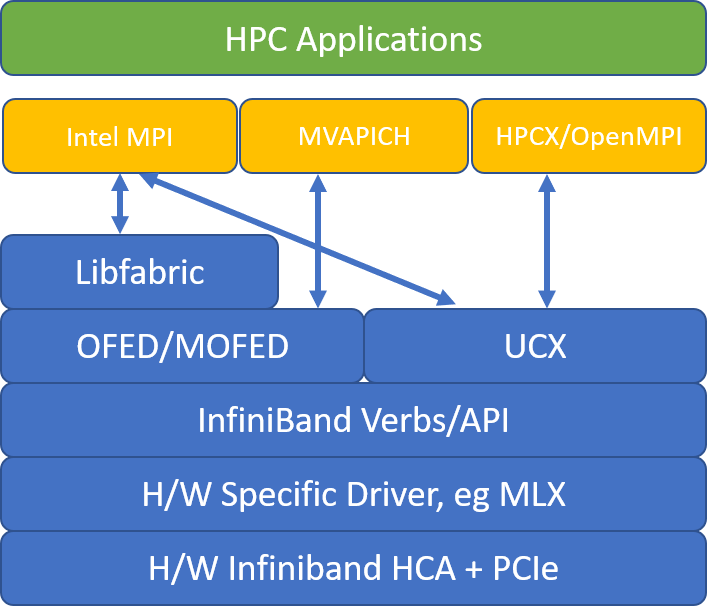

# Set up Message Passing Interface for HPC

The [Message Passing Interface (MPI)](https://en.wikipedia.org/wiki/Message_Passing_Interface) is an open library and de-facto standard for distributed memory parallelization. It is commonly used across many HPC workloads. HPC workloads on the [RDMA capable](../../sizes-hpc.md#rdma-capable-instances) [H-series](../../sizes-hpc.md) and [N-series](../../sizes-gpu.md) VMs can use MPI to communicate over the low latency and high bandwidth InfiniBand network.
- The SR-IOV enabled VM sizes on Azure allow almost any flavor of MPI to be used with Mellanox OFED.
- On non-SR-IOV enabled VMs, supported MPI implementations use the Microsoft Network Direct (ND) interface to communicate between VMs. Hence, only Microsoft MPI (MS-MPI) 2012 R2 or later and Intel MPI 5.x versions are supported. Later versions (2017, 2018) of the Intel MPI runtime library may or may not be compatible with the Azure RDMA drivers.

For SR-IOV enabled [RDMA capable VMs](../../sizes-hpc.md#rdma-capable-instances), [CentOS-HPC VM images](configure.md#centos-hpc-vm-images) version 7.6 and later are suitable. These VM images come optimized and pre-loaded with the OFED drivers for RDMA and various commonly used MPI libraries and scientific computing packages and are the easiest way to get started.

Though the examples here are for RHEL/CentOS, but the steps are general and can be used for any compatible Linux operating system such as Ubuntu (16.04, 18.04 19.04, 20.04) and SLES (12 SP4 and 15). More examples for setting up other MPI implementations on others distros is on the [azhpc-images repo](https://github.com/Azure/azhpc-images/blob/master/ubuntu/ubuntu-18.x/ubuntu-18.04-hpc/install_mpis.sh).

> [!NOTE]
> Running MPI jobs on SR-IOV enabled VMs with certain MPI libraries (such as Platform MPI) may require setting up of partition keys (p-keys) across a tenant for isolation and security. Follow the steps in the [Discover partition keys](#discover-partition-keys) section for details on determining the p-key values and setting them correctly for an MPI job with that MPI library.

> [!NOTE]
> The code snippets below are examples. We recommend using the latest stable versions of the packages, or referring to the [azhpc-images repo](https://github.com/Azure/azhpc-images/blob/master/ubuntu/ubuntu-18.x/ubuntu-18.04-hpc/install_mpis.sh).

## Choosing MPI library
If an HPC application recommends a particular MPI library, try that version first. If you have flexibility regarding which MPI you can choose, and you want the best performance, try HPC-X. Overall, the HPC-X MPI performs the best by using the UCX framework for the InfiniBand interface, and takes advantage of all the Mellanox InfiniBand hardware and software capabilities. Additionally, HPC-X and OpenMPI are ABI compatible, so you can dynamically run an HPC application with HPC-X that was built with OpenMPI. Similarly, Intel MPI, MVAPICH, and MPICH are ABI compatible.

The following figure illustrates the architecture for the popular MPI libraries.



## UCX

[Unified Communication X (UCX)](https://github.com/openucx/ucx) is a framework of communication APIs for HPC. It is optimized for MPI communication over InfiniBand and works with many MPI implementations such as OpenMPI and MPICH.

```bash
wget https://github.com/openucx/ucx/releases/download/v1.4.0/ucx-1.4.0.tar.gz
tar -xvf ucx-1.4.0.tar.gz
cd ucx-1.4.0
./configure --prefix=<ucx-install-path>
make -j 8 && make install
```

> [!NOTE]
> Recent builds of UCX have fixed an [issue](https://github.com/openucx/ucx/pull/5965) whereby the right InfiniBand interface is chosen in the presence of multiple NIC interfaces. More details [here](hb-hc-known-issues.md#accelerated-networking-on-hb-hc-hbv2-and-ndv2) on running MPI over InfiniBand when Accelerated Networking is enabled on the VM.

## HPC-X

The [HPC-X software toolkit](https://www.mellanox.com/products/hpc-x-toolkit) contains UCX and HCOLL and can be built against UCX.

```bash
HPCX_VERSION="v2.6.0"
HPCX_DOWNLOAD_URL=https://azhpcstor.blob.core.windows.net/azhpc-images-store/hpcx-v2.6.0-gcc-MLNX_OFED_LINUX-5.0-1.0.0.0-redhat7.7-x86_64.tbz
get --retry-connrefused --tries=3 --waitretry=5 $HPCX_DOWNLOAD_URL
tar -xvf hpcx-${HPCX_VERSION}-gcc-MLNX_OFED_LINUX-5.0-1.0.0.0-redhat7.7-x86_64.tbz
mv hpcx-${HPCX_VERSION}-gcc-MLNX_OFED_LINUX-5.0-1.0.0.0-redhat7.7-x86_64 ${INSTALL_PREFIX}
HPCX_PATH=${INSTALL_PREFIX}/hpcx-${HPCX_VERSION}-gcc-MLNX_OFED_LINUX-5.0-1.0.0.0-redhat7.7-x86_64
```

The following command illustrates some recommended mpirun arguments for HPC-X and OpenMPI.
```bash
mpirun -n $NPROCS --hostfile $HOSTFILE --map-by ppr:$NUMBER_PROCESSES_PER_NUMA:numa:pe=$NUMBER_THREADS_PER_PROCESS -report-bindings $MPI_EXECUTABLE
```
where:

|Parameter|Description                                        |
|---------|---------------------------------------------------|
|`NPROCS`	|Specifies the number of MPI processes. For example: `-n 16`.|
|`$HOSTFILE`|Specifies a file containing the hostname or IP address, to indicate the location of where the MPI processes will run. For example: `--hostfile hosts`.|
|`$NUMBER_PROCESSES_PER_NUMA`	|Specifies the number of MPI processes that will run in each NUMA domain. For example, to specify four MPI processes per NUMA, you use `--map-by ppr:4:numa:pe=1`.|
|`$NUMBER_THREADS_PER_PROCESS`	|Specifies the number of threads per MPI process. For example, to specify one MPI process and four threads per NUMA, you use `--map-by ppr:1:numa:pe=4`.|
|`-report-bindings`	|Prints MPI processes mapping to cores, which is useful to verify that your MPI process pinning is correct.|
|`$MPI_EXECUTABLE`	|Specifies the MPI executable built linking in MPI libraries. MPI compiler wrappers do this automatically. For example: `mpicc` or `mpif90`.|

An example of running the OSU latency microbenchmark is as follows:
```bash
${HPCX_PATH}mpirun -np 2 --map-by ppr:2:node -x UCX_TLS=rc ${HPCX_PATH}/ompi/tests/osu-micro-benchmarks-5.3.2/osu_latency
```

### Optimizing MPI collectives

MPI Collective communication primitives offer a flexible, portable way to implement group communication operations. They are widely used across various scientific parallel applications and have a significant impact on the overall application performance. Refer to the [TechCommunity article](https://techcommunity.microsoft.com/t5/azure-compute/optimizing-mpi-collective-communication-using-hpc-x-on-azurehpc/ba-p/1356740) for details on configuration parameters to optimize collective communication performance using HPC-X and HCOLL library for collective communication.

As an example, if you suspect your tightly coupled MPI application is doing an excessive amount of collective communication, you can try enabling hierarchical collectives (HCOLL). To enable those features, use the following parameters.
```bash
-mca coll_hcoll_enable 1 -x HCOLL_MAIN_IB=<MLX device>:<Port>
```

> [!NOTE] 
> With HPC-X 2.7.4+, it may be necessary to explicitly pass LD_LIBRARY_PATH if the UCX version on MOFED vs. that in HPC-X is different.

## OpenMPI

Install UCX as described above. HCOLL is part of the [HPC-X software toolkit](https://www.mellanox.com/products/hpc-x-toolkit) and does not requires special installation.

OpenMPI can be installed from the packages available in the repo.

```bash
sudo yum install –y openmpi
```

We recommend building a latest, stable release of OpenMPI with UCX.

```bash
OMPI_VERSION="4.0.3"
OMPI_DOWNLOAD_URL=https://download.open-mpi.org/release/open-mpi/v4.0/openmpi-${OMPI_VERSION}.tar.gz
wget --retry-connrefused --tries=3 --waitretry=5 $OMPI_DOWNLOAD_URL
tar -xvf openmpi-${OMPI_VERSION}.tar.gz
cd openmpi-${OMPI_VERSION}
./configure --prefix=${INSTALL_PREFIX}/openmpi-${OMPI_VERSION} --with-ucx=${UCX_PATH} --with-hcoll=${HCOLL_PATH} --enable-mpirun-prefix-by-default --with-platform=contrib/platform/mellanox/optimized && make -j$(nproc) && make install
```

For optimal performance, run OpenMPI with `ucx` and `hcoll`. Also see the example with [HPC-X](#hpc-x).

```bash
${INSTALL_PREFIX}/bin/mpirun -np 2 --map-by node --hostfile ~/hostfile -mca pml ucx --mca btl ^vader,tcp,openib -x UCX_NET_DEVICES=mlx5_0:1  -x UCX_IB_PKEY=0x0003  ./osu_latency
```

Check your partition key as mentioned above.

## Intel MPI

Download your choice of version of [Intel MPI](https://software.intel.com/mpi-library/choose-download). The Intel MPI 2019 release switched from the Open Fabrics Alliance (OFA) framework to the Open Fabrics Interfaces (OFI) framework, and currently supports libfabric. There are two providers for InfiniBand support: mlx and verbs.
Change the I_MPI_FABRICS environment variable depending on the version.
- Intel MPI 2019 and 2021: use `I_MPI_FABRICS=shm:ofi`, `I_MPI_OFI_PROVIDER=mlx`. The `mlx` provider uses UCX. Usage of verbs has been found to be unstable and less performant. See the [TechCommunity article](https://techcommunity.microsoft.com/t5/azure-compute/intelmpi-2019-on-azure-hpc-clusters/ba-p/1403149) for more details.
- Intel MPI 2018: use `I_MPI_FABRICS=shm:ofa`
- Intel MPI 2016: use `I_MPI_DAPL_PROVIDER=ofa-v2-ib0`

Here are some suggested mpirun arguments for Intel MPI 2019 update 5+.
```bash
export FI_PROVIDER=mlx
export I_MPI_DEBUG=5
export I_MPI_PIN_DOMAIN=numa

mpirun -n $NPROCS -f $HOSTFILE $MPI_EXECUTABLE
```
where:

|Parameter|Description                                        |
|---------|---------------------------------------------------|
|`FI_PROVIDER`	|Specifies which libfabric provider to use, which will affect the API, protocol, and network used. verbs is another option, but generally mlx gives you better performance.|
|`I_MPI_DEBUG`|Specifies the level of extra debug output, which can provide details about where processes are pinned, and which protocol and network are used.|
|`I_MPI_PIN_DOMAIN`	|Specifies how you want to pin your processes. For example, you can pin to cores, sockets, or NUMA domains. In this example, you set this environmental variable to numa, which means processes will be pinned to NUMA node domains.|

### Optimizing MPI collectives

There are some other options that you can try, especially if collective operations are consuming a significant amount of time. Intel MPI 2019 update 5+ supports the provide mlx and uses the UCX framework to communicate with InfiniBand. It also supports HCOLL.
```bash
export FI_PROVIDER=mlx
export I_MPI_COLL_EXTERNAL=1
```

### Non SR-IOV VMs

For non SR-IOV VMs, an example of downloading the 5.x runtime [free evaluation version](https://registrationcenter.intel.com/en/forms/?productid=1740) is as follows:
```bash
wget http://registrationcenter-download.intel.com/akdlm/irc_nas/tec/9278/l_mpi_p_5.1.3.223.tgz
```
For installation steps, see the [Intel MPI Library Installation Guide](https://registrationcenter-download.intel.com/akdlm/irc_nas/1718/INSTALL.html?lang=en&fileExt=.html).
Optionally, you may want to enable ptrace for non-root non-debugger processes (needed for the most recent versions of Intel MPI).
```bash
echo 0 | sudo tee /proc/sys/kernel/yama/ptrace_scope
```

### SUSE Linux
For SUSE Linux Enterprise Server VM image versions - SLES 12 SP3 for HPC, SLES 12 SP3 for HPC (Premium), SLES 12 SP1 for HPC, SLES 12 SP1 for HPC (Premium), SLES 12 SP4 and SLES 15, the RDMA drivers are installed and Intel MPI packages are distributed on the VM. Install Intel MPI by running the following command:
```bash
sudo rpm -v -i --nodeps /opt/intelMPI/intel_mpi_packages/*.rpm
```

## MVAPICH

The following is an example of building MVAPICH2. Note newer versions may be available than what is used below.
```bash
wget http://mvapich.cse.ohio-state.edu/download/mvapich/mv2/mvapich2-2.3.tar.gz
tar -xv mvapich2-2.3.tar.gz
cd mvapich2-2.3
./configure --prefix=${INSTALL_PREFIX}
make -j 8 && make install
```

An example of running the OSU latency microbenchmark is as follows:
```bash
${INSTALL_PREFIX}/bin/mpirun_rsh -np 2 -hostfile ~/hostfile MV2_CPU_MAPPING=48 ./osu_latency
```

The following list contains several recommended `mpirun` arguments.
```bash
export MV2_CPU_BINDING_POLICY=scatter
export MV2_CPU_BINDING_LEVEL=numanode
export MV2_SHOW_CPU_BINDING=1
export MV2_SHOW_HCA_BINDING=1

mpirun -n $NPROCS -f $HOSTFILE $MPI_EXECUTABLE
```
where:

|Parameter|Description                                        |
|---------|---------------------------------------------------|
|`MV2_CPU_BINDING_POLICY`	|Specifies which binding policy to use, which will affect how processes are pinned to core IDs. In this case, you specify scatter, so processes will be evenly scattered among the NUMA domains.|
|`MV2_CPU_BINDING_LEVEL`|Specifies where to pin processes. In this case, you set it to numanode, which means processes are pinned to units of NUMA domains.|
|`MV2_SHOW_CPU_BINDING`	|Specifies if you want to get debug information about where the processes are pinned.|
|`MV2_SHOW_HCA_BINDING`	|Specifies if you want to get debug information about which host channel adapter each process is using.|

## Platform MPI

Install required packages for Platform MPI Community Edition.

```bash
sudo yum install libstdc++.i686
sudo yum install glibc.i686
Download platform MPI at https://www.ibm.com/developerworks/downloads/im/mpi/index.html 
sudo ./platform_mpi-09.01.04.03r-ce.bin
```

Follow the installation process.

The following commands are examples of running MPI pingpong and allreduce using Platform MPI on HBv3 VMs using CentOS-HPC 7.6, 7.8, and 8.1 VM images.

```bash
/opt/ibm/platform_mpi/bin/mpirun -hostlist 10.0.0.8:1,10.0.0.9:1 -np 2 -e MPI_IB_PKEY=0x800a  -ibv  /home/jijos/mpi-benchmarks/IMB-MPI1 pingpong
/opt/ibm/platform_mpi/bin/mpirun -hostlist 10.0.0.8:120,10.0.0.9:120 -np 240 -e MPI_IB_PKEY=0x800a  -ibv  /home/jijos/mpi-benchmarks/IMB-MPI1 allreduce -npmin 240
```


## MPICH

Install UCX as described above. Build MPICH.

```bash
wget https://www.mpich.org/static/downloads/3.3/mpich-3.3.tar.gz
tar -xvf mpich-3.3.tar.gz
cd mpich-3.3
./configure --with-ucx=${UCX_PATH} --prefix=${INSTALL_PREFIX} --with-device=ch4:ucx
make -j 8 && make install
```

Running MPICH.

```bash
${INSTALL_PREFIX}/bin/mpiexec -n 2 -hostfile ~/hostfile -env UCX_IB_PKEY=0x0003 -bind-to hwthread ./osu_latency
```

Check your partition key as mentioned above.

## OSU MPI Benchmarks

Download [OSU MPI Benchmarks](http://mvapich.cse.ohio-state.edu/benchmarks/) and untar.

```bash
wget http://mvapich.cse.ohio-state.edu/download/mvapich/osu-micro-benchmarks-5.5.tar.gz
tar –xvf osu-micro-benchmarks-5.5.tar.gz
cd osu-micro-benchmarks-5.5
```

Build Benchmarks using a particular MPI library:

```bash
CC=<mpi-install-path/bin/mpicc>CXX=<mpi-install-path/bin/mpicxx> ./configure 
make
```

MPI Benchmarks are under `mpi/` folder.


## Discover partition keys

Discover partition keys (p-keys) for communicating with other VMs within the same tenant (Availability Set or Virtual Machine Scale Set).

```bash
/sys/class/infiniband/mlx5_0/ports/1/pkeys/0
/sys/class/infiniband/mlx5_0/ports/1/pkeys/1
```

The larger of the two is the tenant key that should be used with MPI. Example: If the following are the p-keys, 0x800b should be used with MPI.

```bash
cat /sys/class/infiniband/mlx5_0/ports/1/pkeys/0
0x800b
cat /sys/class/infiniband/mlx5_0/ports/1/pkeys/1
0x7fff
```

Use the partition other than default (0x7fff) partition key. UCX requires the MSB of p-key to be cleared. For example, set UCX_IB_PKEY as 0x000b for 0x800b.

Also note that as long as the tenant (Availability Set or Virtual Machine Scale Set) exists, the PKEYs remain the same. This is true even when nodes are added/deleted. New tenants get different PKEYs.


## Set up user limits for MPI

Set up user limits for MPI.

```bash
cat << EOF | sudo tee -a /etc/security/limits.conf
*               hard    memlock         unlimited
*               soft    memlock         unlimited
*               hard    nofile          65535
*               soft    nofile          65535
EOF
```

## Set up SSH keys for MPI

Set up SSH keys for MPI types that require it.

```bash
ssh-keygen -f /home/$USER/.ssh/id_rsa -t rsa -N ''
cat << EOF > /home/$USER/.ssh/config
Host *
    StrictHostKeyChecking no
EOF
cat /home/$USER/.ssh/id_rsa.pub >> /home/$USER/.ssh/authorized_keys
chmod 600 /home/$USER/.ssh/authorized_keys
chmod 644 /home/$USER/.ssh/config
```

The above syntax assumes a shared home directory, else .ssh directory must be copied to each node.

## Next steps

- Learn about the [InfiniBand enabled](../../sizes-hpc.md#rdma-capable-instances) [H-series](../../sizes-hpc.md) and [N-series](../../sizes-gpu.md) VMs
- Review the [HBv3-series overview](hbv3-series-overview.md) and [HC-series overview](hc-series-overview.md).
- Read about the latest announcements, HPC workload examples, and performance results at the [Azure Compute Tech Community Blogs](https://techcommunity.microsoft.com/t5/azure-compute/bg-p/AzureCompute).
- For a higher level architectural view of running HPC workloads, see [High Performance Computing (HPC) on Azure](/azure/architecture/topics/high-performance-computing/).
