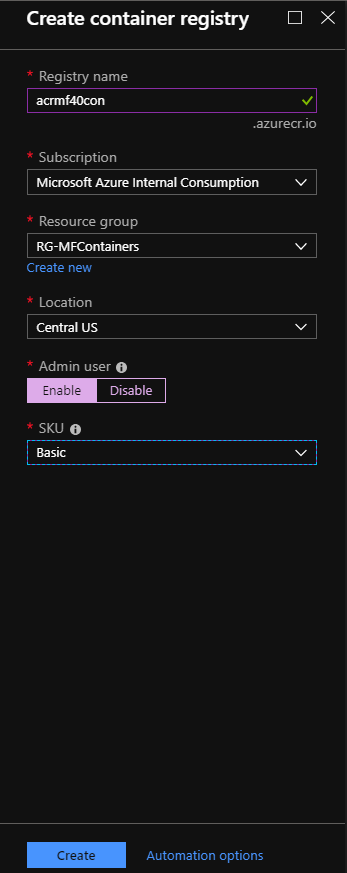
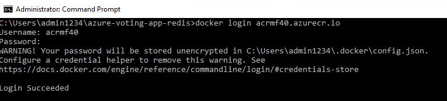
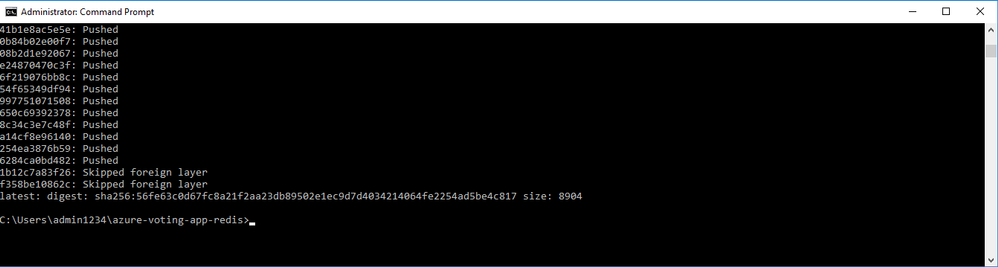
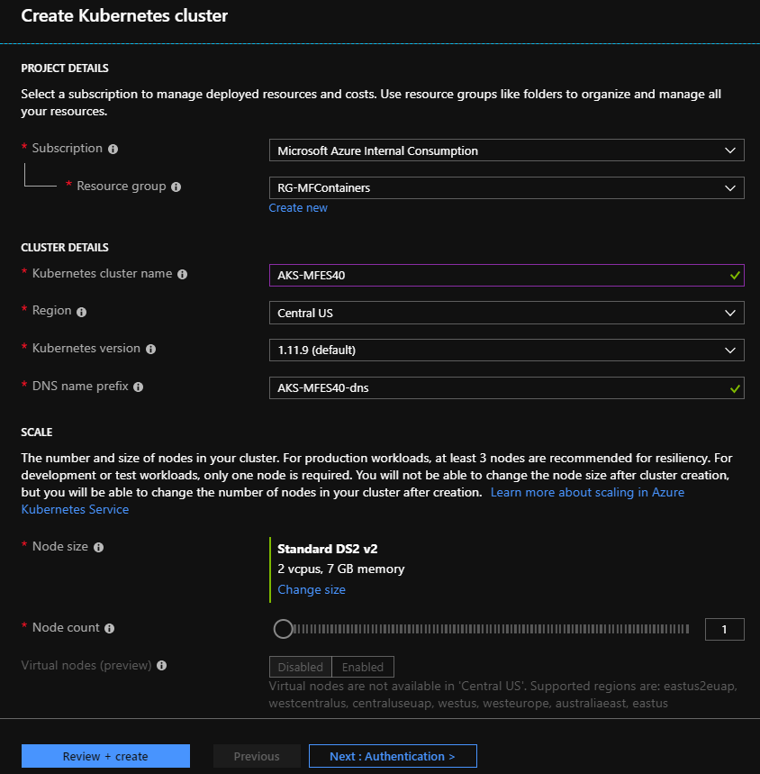
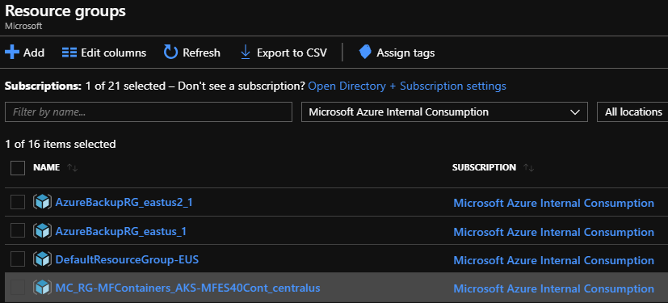
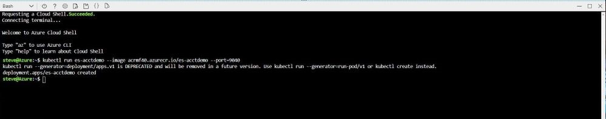
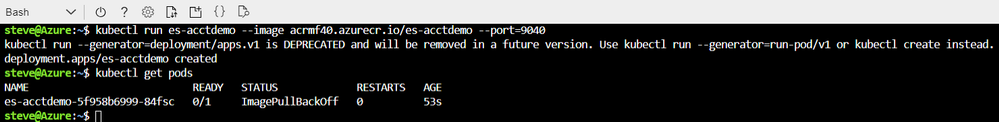

# Deploy Micro Focus Enterprise Server 5.0 to AKS

In another [article](./run-enterprise-server-container.md), I outlined the steps to run Micro Focus Enterprise Server 5.0 in a Docker container. As a follow up to that, I’d like to show you how to take it one step further and deploy that Docker image you created to Azure Kubernetes Service (AKS).

Azure Kubernetes Service is a managed orchestration service based on Kubernetes. It enables you to deploy, scale, and manage Docker containers (and other container-based applications) across a cluster of container hosts.

This is a three-step process. You need to:

1.  Create an Azure Container Registry to store your Docker image.

2.  Create an Azure Kubernetes cluster to run the Docker image.

3.  Run the application.

This enables you to scale out (and scale down) your mainframe modernization workloads in Azure, taking true advantage of the cloud platform.

Ready? Let’s get started!

## Create the Azure Container Registry

From the Azure portal, select **Create a Resource** in the top-left corner. From the Marketplace Dashboard, select **Containers,** then **Container Registry**. This takes you to the **Create container registry** pane where you need to fill in the **Registry name**, **Azure Subscription**, **Resource group**, and **Location**. The **Registry Name** needs to resolve, so it must be unique. Select the **Resource group** you used from the previous blog post and the same corresponding **Location**. Select **Enable** for **Admin user** and **Basic** for the **SKU**. Once you have everything filled in, select **Create**.

After the registry has been deployed, select **Go to Resource**. This takes you to the main blade for the Azure Container Registry. A nice feature here is the **Quick Start** menu option. Select it and you will see instructions for what needs to be done to push and pull images to and from the registry. Let’s go though these:

1.  **Install Docker** – You do not need to worry about this because it’s already done.

2.  **Run the “hello – world” base image** – Again, it’s not necessary, but feel free to try it out.

3.  **Log in to your container registry** – You need to do this from the virtual machine (VM). Copy the command to the clipboard or Notepad.

    For the registry I created, the command is: **docker login acrmf50.azurecr.io**

4.  **Push to your registry** – You need to do this for the Micro Focus image as well once you have logged into the VM.

5.  **Pull from your registry** – It’s not relevant for this walk-through, but good to know if you need to run another Docker image.

Before you leave the portal, you need to get the credentials for the registry so you can log in. Exit out of the **Quick Start** blade and select **Access Keys** from the Registry Menu. Copy the **Username** and one of the **Passwords** (there are two) to the clipboard or Notepad. You will need them later to log in.

Now that you know what needs to be done, log in to the VM.

## RDP to the virtual machine you used to create the Docker image

Since you already created the Docker image on a Windows 2016 Server, you need to log in to that VM. From this VM, you can push the image to the Azure Container Registry you just created. Navigate to the VM in the Azure portal, and then select **Overview** and then **Connect**. This connects you to the VM via remote desktop protocol (RDP). You need to use the credentials from when you created the VM.

## Log in and push the image to the registry

Once you have logged in, open a command prompt and initiate the following Docker commands:

-   **docker images** – this shows a list of all the currently installed images  on the VM. Take note of the **microfocus/es-acctdemo** because this is the one you will be working with.

-   **docker login acrmf50.azurecr.io** – The correct format here is *docker login \<registry name\>*. Substitute whatever name you used when you created the registry.

    -   You will need the **Username** and **Password** that you copied from the Azure portal. You should see something like the following image.

    

-   **docker tag microfocus/es-acctdemo acrmf50.azurecr.io/es-acctdemo** – This tags the appropriate image with the name of the repository. **NOTE**: If the name \<microfocus/es-acctdemo\> does not work, try using the full Image ID. After you have executed the command, type **docker images –no-trunc**. You should see something like the next image. Notice that the image is properly tagged.

    

-   **docker push acrmf50.azurecr.io/es-acctdemo** – This kicks off the actual push to your repository. Because the size is 15 GB, it takes a couple of  minutes to run. If everything goes right, you should see something like the  following image.

    

Now go back to the Azure portal, specifically to the **Repository**. In the menu for the **Repository**, select **Repositories**, and you should see **es-acctdemo** listed. Now create the AKS cluster.

## Create the Azure Kubernetes (AKS) cluster

From the Azure portal, select **Create a resource** and then **Containers / Kubernetes Service** from the **Marketplace** menu. Next, you need to fill out the **Create Kubernetes cluster** blade. Be sure to keep the cluster in the same region and resource group you have been using. You can accept the rest of the defaults except for the **Node count,** which only needs to be 1. When you are done, select **Review + create**.

When complete, the deployment will place the **Kubernetes Service** artifacts in the **Resource group** you selected on the blade. However, the actual cluster will have its own resource group created during the deployment. If you select **Resource groups** from the menu on the left, you can find it based on the naming convention. Here’s an image of mine – it’s the last one in the list.

**Run the image**

Now it’s time to pull the image and run it in AKS. The easiest way to do this from the Azure portal is to use the Cloud Shell. You will find the icon at the top right of the Azure portal. Note that for this walkthrough, I am using the Bash Shell.

Once the shell has loaded, type the following command:

**kubectl run es-acctdemo --image acrmf50.azurecr.io/es-acctdemo --port=9040**

This pulls the image from the **acrmf50.azurecr.io** Repository and loads it into AKS. It then runs the image with port 9040 open. You may recall this was the port you had open for your Docker image. You need that to access Enterprise Server.

Kubernetes should respond with a message that the deployment was created.

To see if the container is actually running, type: **kubectl get pods**.

You should see es-acctdemo as a running pod, as in the following image.

Congratulations! You are now running Enterprise Server in Azure Kubernetes Service. In the next article, I’ll show you how to access the Enterprise Server Administrative Console and also how to leverage Kubernetes to scale out your deployment.
