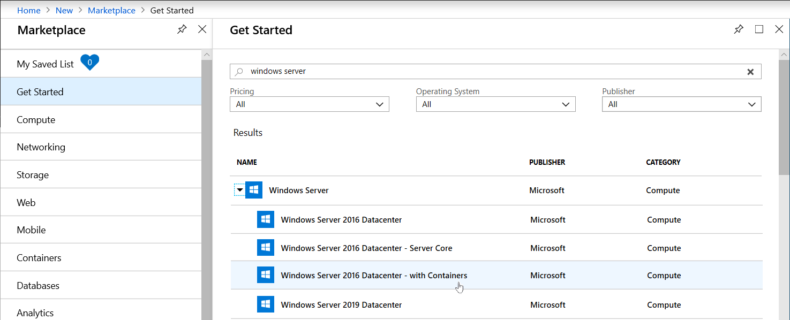
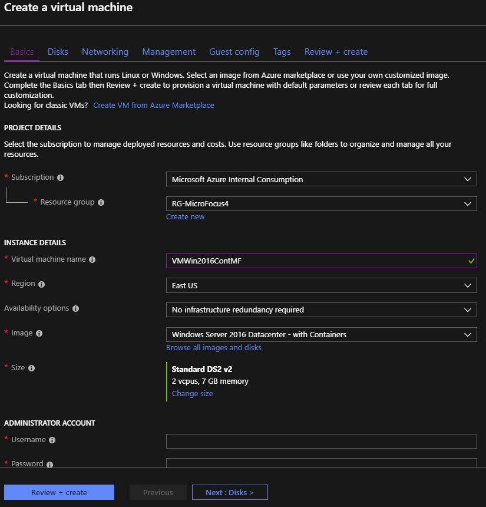
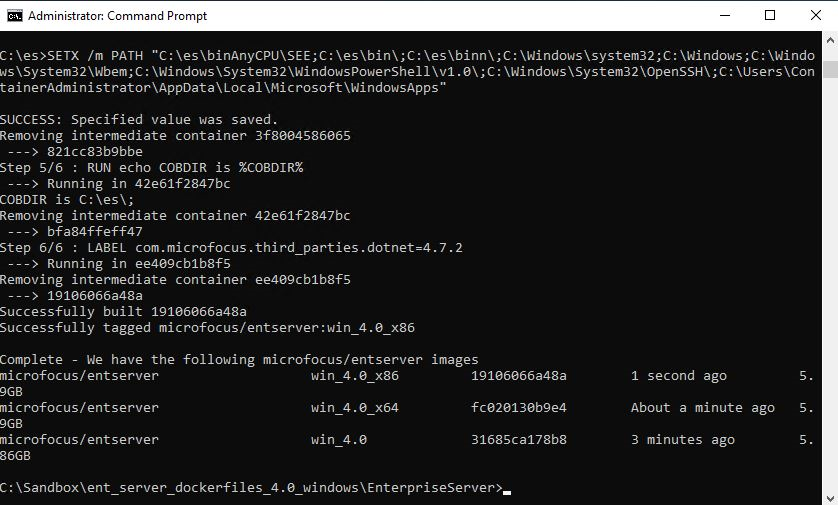
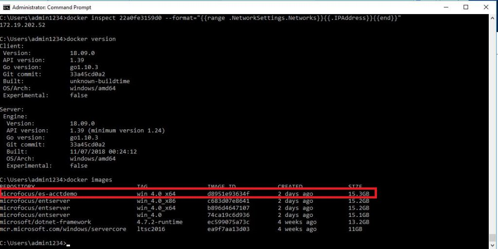
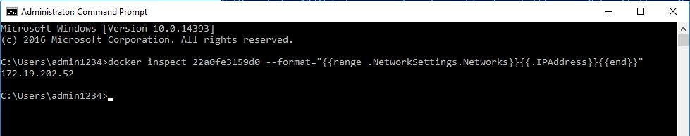
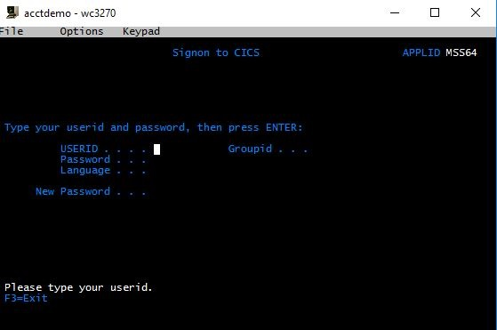
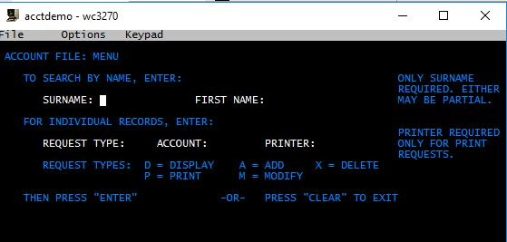
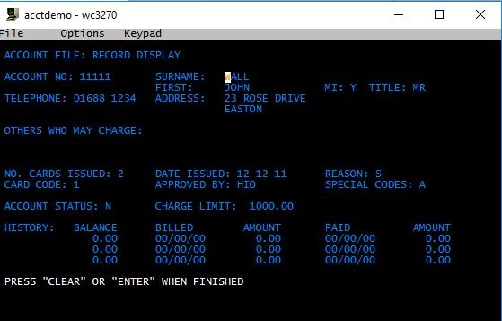
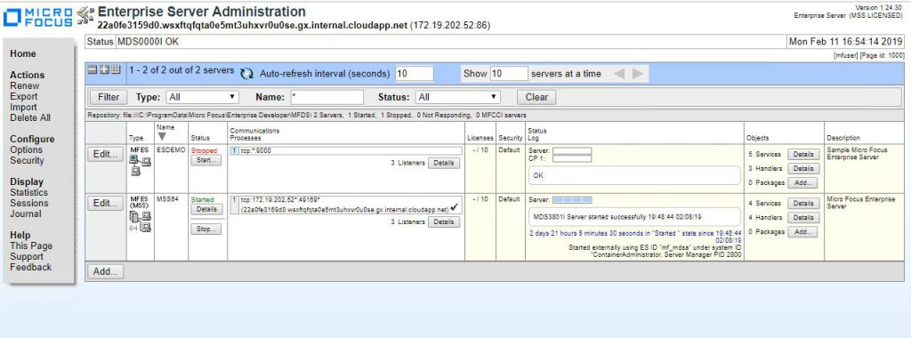

# Run Micro Focus Enterprise Server 5.0 in a Docker container on Azure

You can run Micro Focus Enterprise Server 5.0 in a Docker container on Azure. This tutorial shows you how. It uses the Windows CICS (Customer Information Control System) acctdemo demonstration for Enterprise Server.

Docker adds portability and isolation to applications. For example, you can export a Docker image from one Windows virtual machine (VM) to run on another, or from a repository to a Windows server with Docker. The Docker image runs in the new location with the same configuration—without having to install Enterprise Server. It’s part of the image. Licensing considerations still apply.

This tutorial installs the **Windows 2016 Datacenter with Containers** VM from the Azure Marketplace. This VM includes **Docker 18.09.0**. The steps that follow show you how to deploy the container, run it, and then connect to it with a 3270 emulator.

## Prerequisites

Before getting started, check out these prerequisites:

-   An Azure subscription. If you don't have one, create a [free account](https://azure.microsoft.com/free/?WT.mc_id=A261C142F) before you begin.

-   The Micro Focus software and a valid license (or trial license). If you're an existing Micro Focus customer, contact your Micro Focus representative. Otherwise, [request a trial](https://www.microfocus.com/products/enterprise-suite/enterprise-server/trial/).

    > [!Note] 
    > The Docker demonstration files are included with Enterprise Server 5.0. This tutorial uses ent\_server\_dockerfiles\_5.0\_windows.zip. Access it from the same place that you accessed the Enterprise Server installation file or go to *Micro Focus* to get started.

-   The documentation for [Enterprise Server and Enterprise Developer](https://www.microfocus.com/documentation/enterprise-developer/#%22).

## Create a VM

1.  Secure the media from the ent\_server\_dockerfiles\_5.0\_windows.zip file. Secure the ES-Docker-Prod-XXXXXXXX.mflic licensing file (required to build the Docker images).

2.  Create the VM. To do this, open Azure portal, select **Create a resource** from the top left menu, and filter by *windows server operating system*. In the results, select **Windows Server.** In the next screen, select **Windows Server 2016 Datacenter – with Containers**.

    

3.  To configure the properties for the VM, choose instance details:

    1.  Choose a VM size. For this tutorial, consider using a **Standard DS2\_v3** VM with 2 vCPUs and 16 GB of memory.

    2.  Select the **Region** and **Resource Group** to which you would like to deploy.

    3.  For **Availability options**, use the default setting.

    4.  For **Username**, type the administrator account you want to use and the password.

    5.  Make sure **port 3389 RDP** is open. Only this port needs to be publicly exposed, so you can sign in to the VM. Then, accept all the default values and click **Review + create**.

    

4.  Wait for the deployment to finish (a couple of minutes). A message states that your VM has been created.

5.  Select **Go to Resource** to go to the **Overview** blade for your VM.

6.  On the right, select **Connect**. The **Connect to virtual machine** options appear on the right.

7.  Select the **Download RDP File** button to download the remote desktop protocol (RDP) file that allows you to attach to the VM.

8.  After the file has finished downloading, open it and type in the username and password you created for the VM.

    > [!Note]    
    > Do not use your corporate credentials to sign in. (The RDP client assumes you may want to use these. You do not.)

9.  Select **More Choices**, then select your VM credentials.

At this point, the VM is running and attached via RDP. You're signed in and ready for the next step.

## Create a sandbox directory and upload the zip file

1.  Create a directory on the VM where you can upload the demo and license files. For example, **C:\\Sandbox**.

2.  Upload **ent\_server\_dockerfiles\_5.0\_windows.zip** and the **ES-Docker-Prod-XXXXXXXX.mflic** file to the directory you created.

3.  Extract the contents of the zip file to the **ent\_server\_dockerfiles\_5.0\_windows** directory created by the extract
    process. This directory includes a readme file (as .html and .txt file) and two subdirectories, **EnterpriseServer** and **Examples**.

4.  Copy **ES-Docker-Prod-XXXXXXXX.mflic** to the
    C:\\Sandbox\\ent\_server\_dockerfiles\_5.0\_windows\\EnterpriseServer and
    C:\\Sandbox\\ent\_server\_dockerfiles\_5.0\_windows\\Examples\\CICS
    directories.  
      
    > [!Note]
    > Make sure you copy the licensing file to both directories. They are required for the Docker build step to make sure the images are properly licensed.

## Check Docker version and create base image

> [!Important]  
> Creating the appropriate Docker image is a two-step process. First, create the Enterprise Server 5.0 base image. Then create another image for the x64 platform. Although you can create a x86 (32-bit) image, use the 64-bit image.

1.  Open a command prompt.

2.  Check that Docker is installed. At the command prompt, type: **docker version**  
    For example, the version was 18.09.0 when this was written.

3.  To change the directory, type:  
    **cd \\Sandbox\\ent\_server\_dockerfiles\_5.0\_windows\\EnterpriseServer**.

4.  Type **bld.bat IacceptEULA** to begin the build process for the initial base image. Wait a few minutes for this process to run. In the results, notice the two images that have been created—one for x64 and one for x86:

    

5.  To create the final image for the CICS demonstration, switch to the CICS directory by typing **cd\\Sandbox\\ent\_server\_dockerfiles\_5.0\_windows\\Examples\\CICS**.

6.  To create the image, type **bld.bat x64**. Wait a few minutes for the process to run and the message saying that the image was created.

7.  Type **docker images** to display a list of all of the Docker images installed on the VM. Make sure **microfocus/es-acctdemo** is one of them.

    

## Run the image

1.  To launch Enterprise Server 5.0 and the acctdemo application, at the command prompt type:

    ```
    **docker run -p 16002:86/tcp -p 16002:86/udp -p 9040-9050:9040-9050 -p 9000-9010:9000-9010 -ti --network="nat" --rm microfocus/es-acctdemo:win\_5.0\_x64
    ```

1.  Install a 3270 terminal emulator such as [x3270](http://x3270.bgp.nu/) and use it to attach, via port 9040, to the image that’s running.

2.  Get the IP address of the acctdemo container so Docker can act as a Dynamic Host Configuration Protocol (DHCP) server for the containers it manages:

    1.  Get the ID of the running container. Type **Docker ps** at the command prompt and note the ID (**22a0fe3159d0** in this example). Save it for the next step.

    2.  To get the IP address for the acctdemo container, use the container ID from the previous step as follows:

    ```
    docker inspect \<containerID\> --format="{{range.NetworkSettings.Networks}}{{.IPAddress}}{{end}}"
    ```

    For example:

    ```
    docker inspect 22a0fe3159d0 --format="{{range.NetworkSettings.Networks}}{{.IPAddress}}{{end}}"
    ```

4. Note the IP address for the acctdemo image. For example, the address in the following output is 172.19.202.52.

    

5. Mount the image using the emulator. Configure the emulator to use the address of the acctdemo image and port 9040. Here, it’s **172.19.202.52:9040**. Yours will be similar. The **Sign on to CICS** screen opens.

    

6. Sign in to the CICS Region by entering **SYSAD** for the **USERID** and **SYSAD** for the **Password**.

7. Clear the screen using the emulator’s keymap. For x3270, select the **Keymap** menu option.

8. To launch the acctdemo application, type **ACCT**. The initial screen for the application is displayed.

     

9. Experiment with display account types. For example, type **D** for the Request and **11111** for the **ACCOUNT**. Other account numbers to try are 22222, 33333, and so on.

    

10. To display the Enterprise Server Administration console, go to the command prompt and type **start http:172.19.202.52:86**.

    

That's it! Now you're running and managing a CICS application in a Docker container.

## Next steps

-   [Install Micro Focus Enterprise Server 5.0 and Enterprise Developer 5.0 on Azure](./set-up-micro-focus-azure.md)

-   [Mainframe application migration](/azure/architecture/cloud-adoption/infrastructure/mainframe-migration/application-strategies)
