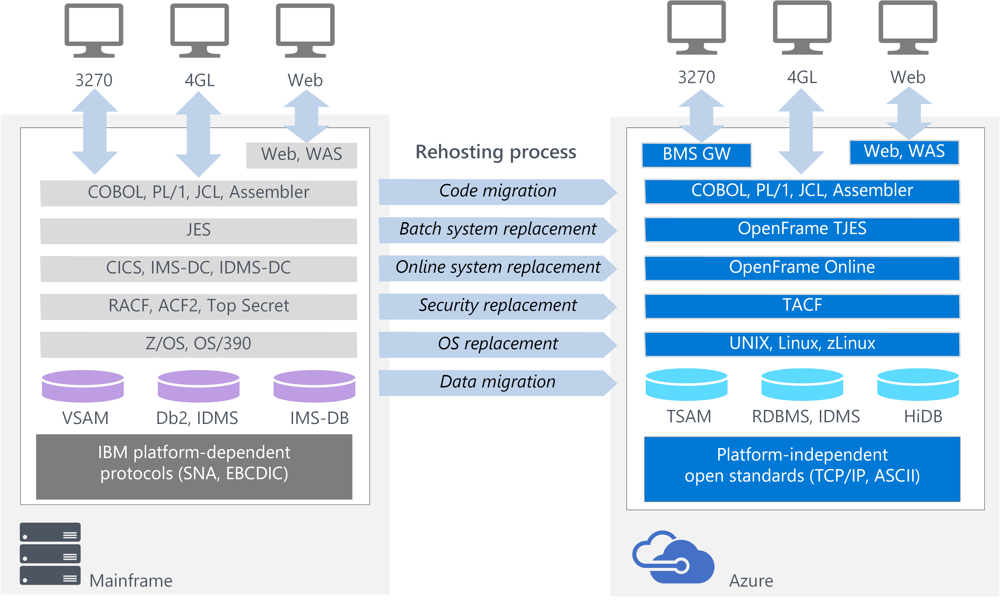
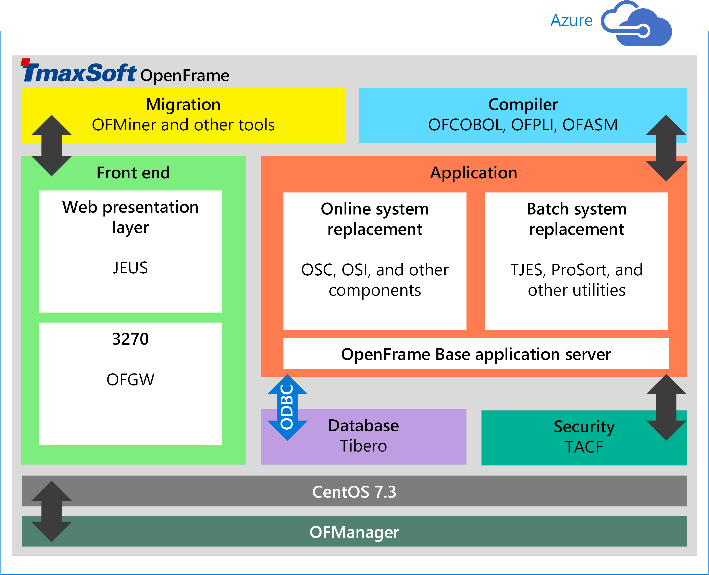

# Get started with TmaxSoft OpenFrame on Azure

Take your existing mainframe assets and move them to Microsoft Azure using TmaxSoft OpenFrame. This popular rehosting solution creates an emulation environment on Azure, enabling you to quickly migrate applications. No reformatting is required.

## OpenFrame rehosting environment

Set up an OpenFrame environment on Azure for development, demos, testing, or production workloads. As the following figure shows, OpenFrame includes multiple components that create the mainframe emulation environment on Azure. For example, OpenFrame online services replace the mainframe middleware such as IBM Customer Information Control System (CICS). OpenFrame Batch, with its TJES component, replaces the IBM mainframe’s Job Entry Subsystem (JES). 

> [!NOTE]
> To run the OpenFrame environment on Azure, you must have a valid product license or trial license from TmaxSoft.

## OpenFrame components

The following components are part of the OpenFrame environment on Azure:

- **Migration tools** including OFMiner, a solution that analyzes the mainframes assets and then migrates them to Azure.
- **Compilers**, including OFCOBOL, a compiler that interprets the mainframe’s COBOL programs; OFPLI, which interprets the mainframe’s PL/I programs; and OFASM, a compiler that interprets the mainframe’s assembler programs.
- **Front end** components, including Java Enterprise User Solution (JEUS ), a web application server that is certified for Java Enterprise Edition 6.OFGW, and the OpenFrame gateway component that provides a 3270 listener.
- **Application** environment. OpenFrame Base is the middleware that manages the entire system. OpenFrame Server Type C (OSC) replaces the mainframe’s middleware and IBM CICS.
- **Relational database**, such as Tibero (shown), Oracle Database, Microsoft SQL Server, IBM Db2, or MySQL. The OpenFrame applications use Open Database Connectivity (ODBC) protocol to communicate with the database.
- **Security** via TACF, a service module that controls user access to systems and resources. 
- **OFManager** is a solution that provides OpenFrame’s operation and management functions in the web environment.

## Next steps

- [Install TmaxSoft OpenFrame on Azure](./install-openframe-azure.md)
