# Install TmaxSoft OpenFrame on Azure

Learn how to set up an OpenFrame environment on Azure suitable for development, demos, testing, or production workloads. This tutorial walks you through each step.

OpenFrame includes multiple components that create the mainframe emulation environment on Azure. For example, OpenFrame online services replace the mainframe middleware such as IBM Customer Information Control System (CICS), and OpenFrame Batch, with its TJES component, replaces the IBM mainframe’s Job Entry Subsystem (JES).

OpenFrame works with any relational database, including Oracle Database, Microsoft SQL Server, IBM Db2, and MySQL. This installation of OpenFrame uses the TmaxSoft Tibero relational database. Both OpenFrame and Tibero run on a Linux operating system. This tutorial installs CentOS 7.3, although you can use other supported Linux distributions.The OpenFrame application server and the Tibero database are installed on one virtual machine (VM).

The tutorial steps you through the installation of the OpenFrame suite components. Some must be installed separately.

Main OpenFrame components:

- Required installation packages.
- Tibero database.
- Open Database Connectivity (ODBC) is used by applications in OpenFrame to communicate with the Tibero database.
- OpenFrame Base, the middleware that manages the entire system.
- OpenFrame Batch, the solution that replaces the mainframe’s batch systems.
- TACF, a service module that controls user access to systems and resources.
- ProSort, a sort tool for batch transactions.
- OFCOBOL, a compiler that interprets the mainframe’s COBOL programs.
- OFASM, a compiler that interprets the mainframe’s assembler programs.
- OpenFrame Server Type C (OSC ), the solution that replaces the mainframe’s middleware and IBM CICS.
- Java Enterprise User Solution (JEUS ), a web application server that is certified for Java Enterprise Edition 6.
- OFGW, the OpenFrame gateway component that provides a 3270 listener.
- OFManager, a solution that provides OpenFrame’s operation and management functions in the web environment.

Other required OpenFrame components:

- OSI, the solution that replaces the mainframe middleware and IMS DC.
- TJES, the solution that provides the mainframe’s JES environment.
- OFTSAM, the solution that enables (V)SAM files to be used in the open system.
- OFHiDB, the solution that replaces the mainframe’s IMS DB.
- OFPLI, a compiler that interprets the mainframe’s PL/I programs.
- PROTRIEVE, a solution that executes the mainframe language CA-Easytrieve.
- OFMiner, a solution that analyzes the mainframes assets and then migrates them to Azure.

## Architecture

The following figure provides an overview of the OpenFrame 7.0 architectural components installed in this tutorial:


## Azure system requirements

The following table lists the requirements for the installation on Azure.
<!-- markdownlint-disable MD033 -->

<table>
<thead>
    <tr><th>Requirement</th><th>Description</th></tr>
</thead>
<tbody>
<tr><td>Supported Linux distributions on Azure
</td>
<td>
Linux x86 2.6 (32-bit, 64-bit)<br/>
Red Hat 7.x<br/>
CentOS 7.x<br/>
</td>
</tr>
<tr><td>Hardware
</td>
<td>Cores: 2 (minimum)<br/>
Memory: 4 GB (minimum)<br/>
Swap space: 1 GB (minimum)<br/>
Hard disk: 100 GB (minimum)<br/>
</td>
</tr>
<tr><td>Optional software for Windows users
</td>
<td>PuTTY: Used in this guide to configure VM features<br/>
WinSCP: A popular SFTP client and FTP client you can use<br/>
Eclipse for Windows: A development platform supported by TmaxSoft<br/>
(Microsoft Visual Studio is not supported at this time)
</td>
</tr>
</tbody>
</table>

<!-- markdownlint-enable MD033 -->

## Prerequisites

Plan on spending a few days to assemble all the required software and complete all the manual processes.

Before getting started, do the following:

- Get the OpenFrame installation media from TmaxSoft. If you are an existing TmaxSoft customer, contact your TmaxSoft representative for a licensed copy. Otherwise, request a trial version from [TmaxSoft](https://www.tmaxsoft.com/contact/).

- Request the OpenFrame documentation by sending email to <support@tmaxsoft.com>.

- Get an Azure subscription if you don't already have one. You can also create a [free account](https://azure.microsoft.com/free/?WT.mc_id=A261C142F) before you begin.

- Optional. Set up a site-to-site VPN tunnel or a jumpbox that restricts access to the Azure VM to the permitted users in your organization. This step is not required, but it is a best practice.

## Set up a VM on Azure for OpenFrame and Tibero

You can set up the OpenFrame environment using various deployment patterns, but the following procedure shows how to deploy the OpenFrame application server and the Tibero database on one VM. In larger environments and for sizeable workloads, a best practice is to deploy the database separately on its own VM for better performance.

**To create a VM**

1. Go to the Azure portal at <https://portal.azure.com> and sign in to your account.

2. Click **Virtual machines**.

    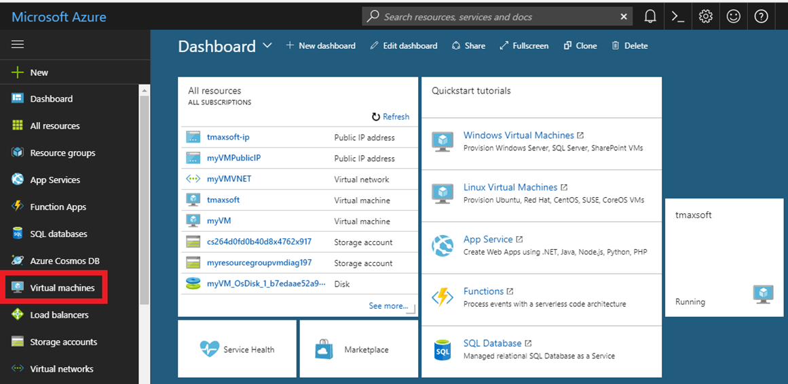

3. Click **Add**.

    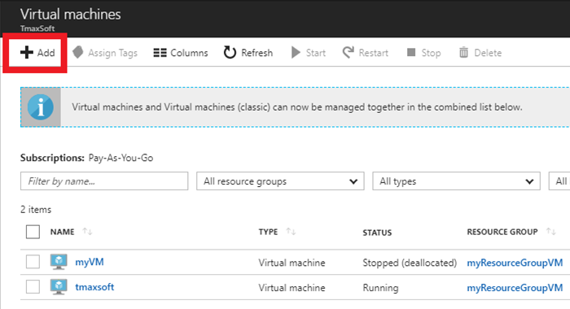

4. To the right of **Operating Systems**, click **More**.

     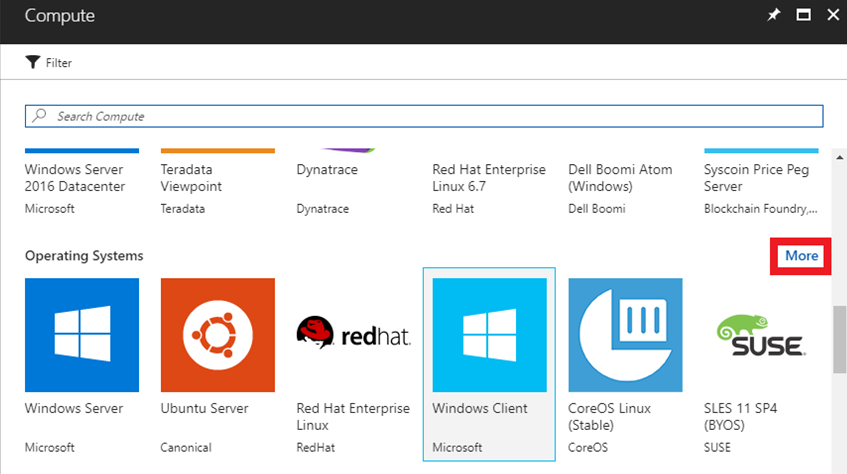

5. Click **CentOS-based 7.3** to follow this walk-through exactly, or you can choose another supported Linux distribution.

     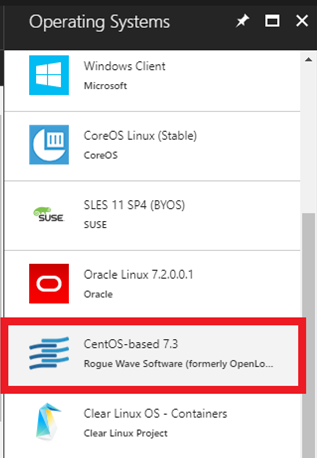

6. In the **Basics** settings, enter **Name**, **User name**, **Authentication type**, **Subscription** (Pay-As-You-Go is the AWS style of payment), and **Resource group** (use an existing one or create a TmaxSoft group).

7. When complete (including the public/private key pair for **Authentication type**), click **Submit**.

> [!NOTE]
> If using an SSH public key for **Authentication type**, see the steps in the next section to generate the public/private key pair, then resume the steps here.

### Generate a public/private key pair

If you are using a Windows operating system, you need PuTTYgen to generate a public/private key pair.

The public key can be freely shared, but the private key should be kept entirely secret and should never be shared with another party. After generating the keys, you must paste the **SSH public key** into the configuration—in effect, uploading it to the Linux VM. It is stored inside authorized\_keys within the \~/.ssh directory of the user account’s home directory. The Linux VM is then
able to recognize and validate the connection once you provide the associated **SSH private key** in the SSH client (in our case, PuTTY).

When giving new individuals access the VM: 

- Each new individual generates their own public/private keys using PuTTYgen.
- Individuals store their own private keys separately and send the public key information to the administrator of the VM.
- The administrator pastes the contents of the public key to the \~/.ssh/authorized\_keys file.
- The new individual connects via PuTTY.

**To generate a public/private key pair**

1.  Download PuTTYgen from <https://www.putty.org/> and install it using all the default settings.

2.  To open PuTTYgen, locate the PuTTY installation directory in C:\\Program Files\\PuTTY.

    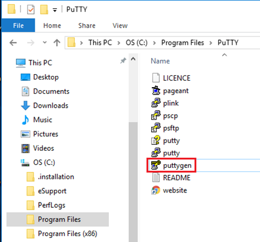

3.  Click **Generate**.

    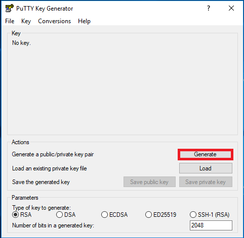

4.  After generation, save both the public key and private key. Paste the contents of the public key in the **SSH public key** section of the **Create virtual machine \> Basics** pane (shown in steps 6 and 7 in the previous section).

    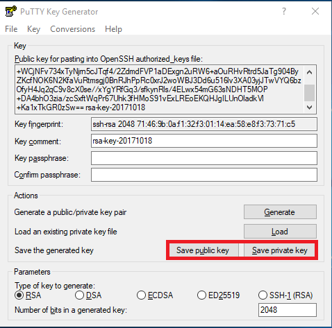

### Configure VM features

1. In Azure portal, in the **Choose a size** blade, choose the Linux machine hardware settings you want. The *minimum* requirements for installing both Tibero and OpenFrame are 2 CPUs and 4 GB RAM as shown in this example installation:

    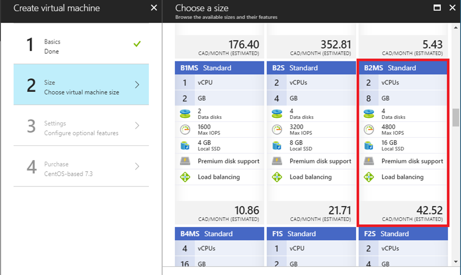

2. Click **3 Settings** and use the default settings to configure optional features.
3. Review your payment details.

    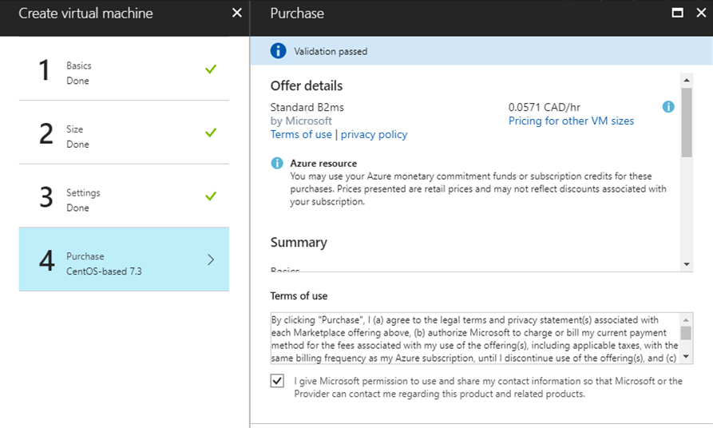

4. Submit your selections. Azure begins to deploy the VM. This process typically takes a few minutes.

5. When the VM is deployed, its dashboard is displayed, showing all the settings that were selected during the configuration. Make a note of the **Public IP address**.

    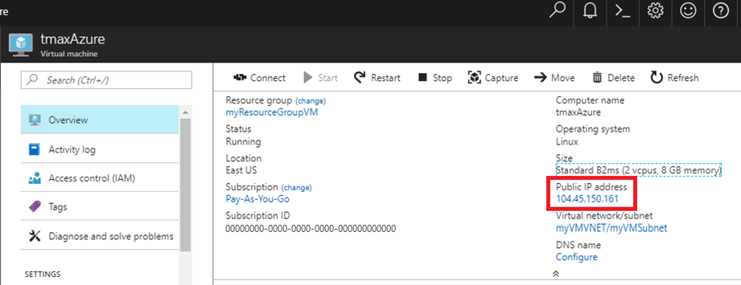

6. Open PuTTY.

7. For **Host Name**, type your username and the public IP address you copied. For example, **username\@publicip**.

    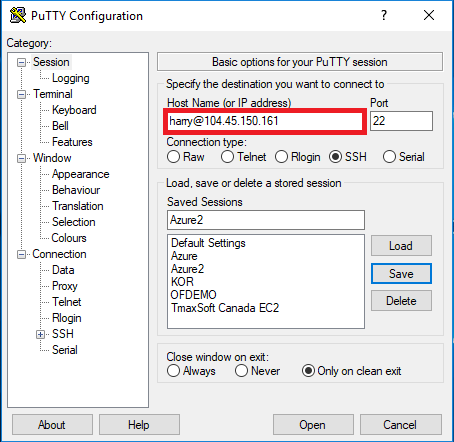

8. In the **Category** box, click **Connection \> SSH \> Auth**. Provide the path to your **private key** file.

    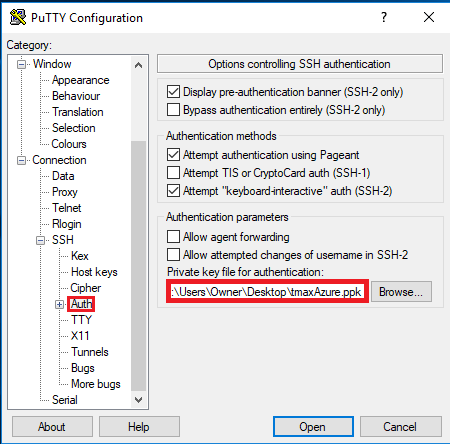

9. Click **Open** to launch the PuTTY window. If successful, you are connected to your new CentOS VM running on Azure.

10. To log on as root user, type **sudo bash**.

    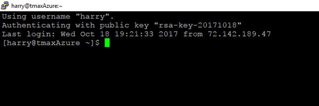

## Set up the environment and packages

Now that the VM is created and you are logged on, you must perform a few setup steps and install the required preinstallation packages.

1. Map the name **ofdemo** to the local IP address by using vi to edit the hosts file (`vi /etc/hosts`). Assuming our IP is 192.168.96.148 ofdemo, this is before the change:

    ```vi
    127.0.0.1   localhost localhost.localdomain localhost4 localhost4.localdomain4 
    ::1              localhost localhost.localdomain localhost6 localhost6.localdomain 
    <IP Address>    <your hostname>
    ```

     This is after the change:

    ```vi
    127.0.0.1   localhost localhost.localdomain localhost4 localhost4.localdomain4 
    ::1              localhost localhost.localdomain localhost6 localhost6.localdomain 
    192.168.96.148   ofdemo
    ```

2. Create groups and users:

    ```vi
    [root@ofdemo ~]# adduser -d /home/oframe7 oframe7 
    [root@ofdemo ~]# passwd oframe7
    ```

3. Change the password for user oframe7:

    ```vi
    New password: 
    Retype new password: 
    passwd: all authentication tokens updated successfully.
    ```

4. Update the kernel parameters in /etc/sysctl.conf:

    ```vi
    [root@ofdemo ~]# vi /etc/sysctl.conf
    kernel.shmall = 7294967296 
    kernel.sem = 10000 32000 10000 10000
    ```

5. Refresh the kernel parameters dynamically without reboot:

    ```vi
    [root@ofdemo ~]# /sbin/sysctl -p
    ```

6. Get the required packages: Make sure the server is connected to the Internet, download the following packages, and then install them:

     - dos2unix
     - glibc
     - glibc.i686 glibc.x86\_64
     - libaio
     - ncurses

          > [!NOTE]
          > After installing the ncurses package, create the following symbolic links:
         ```
         ln -s /usr/lib64/libncurses.so.5.9 /usr/lib/libtermcap.so
         ln -s /usr/lib64/libncurses.so.5.9 /usr/lib/libtermcap.so.2
         ```

     - gcc
     - gcc-c++
     - libaio-devel.x86\_64
     - strace
     - ltrace
     - gdb

7. In case of Java RPM installation, do the following:

```
root@ofdemo ~]# rpm -ivh jdk-7u79-linux-x64.rpm
[root@ofdemo ~]# vi .bash_profile

# JAVA ENV
export JAVA_HOME=/usr/java/jdk1.7.0_79/
export PATH=$JAVA_HOME/bin:$PATH
export CLASSPATH=$CLASSPATH:$JAVA_HOME/jre/lib/ext:$JAVA_HOME/lib/tools.jar

[root@ofdemo ~]# source /etc/profile
[root@ofdemo ~]# java –version

java version "1.7.0_79"
Java(TM) SE Runtime Environment (build 1.7.0_79-b15)
Java HotSpot(TM) 64-Bit Server VM (build 24.79-b02, mixed mode)

[root@ofdemo ~]# echo $JAVA_HOME /usr/java/jdk1.7.0_79/
```

## Install the Tibero database

Tibero provides the several key functions in the OpenFrame environment on Azure:

- Tibero is used as the OpenFrame internal data store for various system functions.
- VSAM files, including KSDS, RRDS, and ESDS, use the Tibero database internally for data storage.
- The TACF data repository is stored in Tibero.
- The OpenFrame catalog information is stored in Tibero.
- The Tibero database can be used as a replacement for IBM Db2 to store application data.

**To install Tibero**

1. Verify that the Tibero binary installer file is present and review the version number.
2. Copy the Tibero software to the Tibero user account (oframe). For example:

    ```
    [oframe7@ofdemo ~]$ tar -xzvf tibero6-bin-6_rel_FS04-linux64-121793-opt-tested.tar.gz 
    [oframe7@ofdemo ~]$ mv license.xml /opt/tmaxdb/tibero6/license/
    ```

3. Open .bash\_profile in vi (`vi .bash_profile`) and paste the following in it:

    ```
    # Tibero6 ENV
    export TB_HOME=/opt/tmaxdb/tibero6 
    export TB_SID=TVSAM export TB_PROF_DIR=$TB_HOME/bin/prof 
    export LD_LIBRARY_PATH=$TB_HOME/lib:$TB_HOME/client/lib:$LD_LIBRARY_PATH 
    export PATH=$TB_HOME/bin:$TB_HOME/client/bin:$PATH
    ```

4. To execute the bash profile, at the command prompt type:

    ```
    source .bash_profile
    ```

5. Generate the tip file (a configuration file for Tibero), then open it in vi. For example:

    ```
    [oframe7@ofdemo ~]$ sh $TB_HOME/config/gen_tip.sh
    [oframe7@ofdemo ~]$ vi $TB_HOME/config/$TB_SID.tip
    ```

6. Modify \$TB\_HOME/client/config/tbdsn.tbr and put 127.0.0.1 instead oflocalhost as shown:

    ```
    TVSAM=( 
    (INSTANCE=(HOST=127.0.0.1)
        (PT=8629)
    (DB_NAME=TVSAM)
          )
     )
    ```

7. Create the database. The following output appears:

    ```
    Change core dump dir to /opt/tmaxdb/tibero6/bin/prof.
    Listener port = 8629
    Tibero 6
    TmaxData Corporation Copyright (c) 2008-. All rights reserved.
    Tibero instance started up (NOMOUNT mode).
     /--------------------- newmount sql ------------------------/
    create database character set MSWIN949 national character set UTF16;
    /-----------------------------------------------------------/
    Database created.
    Change core dump dir to /opt/tmaxdb/tibero6/bin/prof.
    Listener port = 8629
    Tibero 6
    TmaxData Corporation Copyright (c) 2008-. All rights reserved.
    Tibero instance started up (NORMAL mode).
    /opt/tmaxdb/tibero6/bin/tbsvr
    ………………………..
    Creating agent table...
    Done.
    For details, check /opt/tmaxdb/tibero6/instance/TVSAM/log/system_init.log.
    ************************************************** 
    * Tibero Database TVSAM is created successfully on Fri Aug 12 19:10:43 UTC 2016.
    *     Tibero home directory ($TB_HOME) =
    *         /opt/tmaxdb/tibero6
    *     Tibero service ID ($TB_SID) = TVSAM
    *     Tibero binary path =
    *         /opt/tmaxdb/tibero6/bin:/opt/tmaxdb/tibero6/client/bin
    *     Initialization parameter file =
    *         /opt/tmaxdb/tibero6/config/TVSAM.tip
    * 
    * Make sure that you always set up environment variables $TB_HOME and
    * $TB_SID properly before you run Tibero.
     ******************************************************************************
    ```

8. To recycle Tibero, first shut it down using the `tbdown` command. For example:

    ```
    [oframe7@ofdemo ~]$$ tbdown 
    Tibero instance terminated (NORMAL mode).
    ```

9. Now boot Tibero using `tbboot`. For example:

    ```
    [oframe7@ofdemo ~]$ tbboot
    Change core dump dir to /opt/tmaxdb/tibero6/bin/prof. Listener port = 8629

    Tibero 6  
    TmaxData Corporation Copyright (c) 2008-. All rights reserved.
    Tibero instance started up (NORMAL mode).
    ```

10. To create a tablespace, access the database using SYS user (sys/tmax), then create the necessary tablespace for the default volume and TACF:

    ```
    [oframe7@ofdemo ~]$ tbsql tibero/tmax
    tbSQL 6  
    TmaxData Corporation Copyright (c) 2008-. All rights reserved.
    Connected to Tibero.
    ```

11. Now type the following SQL commands:

    ```
    SQL> create tablespace "DEFVOL" datafile 'DEFVOL.dbf' size 500M autoextend on; create tablespace "TACF00" datafile 'TACF00.dbf' size 500M autoextend on; create tablespace "OFM_REPOSITORY" datafile 'ofm_repository.dbf' size 300M autoextend on;
    SQL> Tablespace 'DEFVOL' created.
    SQL> Tablespace 'TACF00' created.
    SQL> Tablespace ' OFM_REPOSITORY ' created.
    SQL> SQL> Disconnected.
    ```

12. Boot Tibero and verify that the Tibero processes are running:

    ```
    [oframe7@ofdemo ~]$ tbboot 
    ps -ef | egrep tbsvr
    ```

Output:

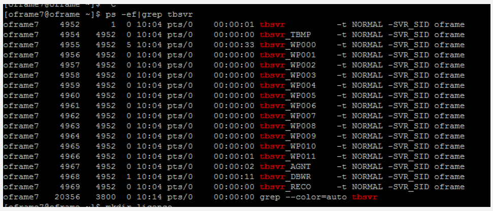

## Install ODBC

Applications in OpenFrame communicate with the Tibero database using the ODBC
API provided by the open-source unixODBC project.

To install ODBC:

1. Verify that the unixODBC-2.3.4.tar.gz installer file is present, or use the `wget unixODBC-2.3.4.tar.gz` command. For example:

     ```
     [oframe7@ofdemo ~]$ wget ftp://ftp.unixodbc.org/pub/unixODBC/unixODBC-2.3.4.tar.gz
     ```

2. Unzip the binary. For example:

     ```
     [oframe7@ofdemo ~]$ tar -zxvf unixODBC-2.3.4.tar.gz
     ```

3. Navigate to unixODBC-2.3.4 directory and generate the Makefile by using the checking machine information. For example:

     ```
     [oframe7@ofdemo unixODBC-2.3.4]$ ./configure --prefix=/opt/tmaxapp/unixODBC/ --sysconfdir=/opt/tmaxapp/unixODBC/etc
     ```

     By default, unixODBC is installed in /usr /local, so `--prefix` passes a value to change the location. Similarly, configuration files are installed in /etc by default, so `--sysconfdir` passes the value of the desired location.

4. Execute Makefile: `[oframe7@ofdemo unixODBC-2.3.4]$ make`

5. Copy the executable file in the program directory after compiling. For example:

     ```
     [oframe7@ofdemo unixODBC-2.3.4]$ make install
     ```

6. Use vi to edit the bash profile (`vi ~/.bash_profile`) and add the following:

     ```
     # UNIX ODBC ENV 
     export ODBC_HOME=$HOME/unixODBC 
     export PATH=$ODBC_HOME/bin:$PATH 
     export LD_LIBRARY_PATH=$ODBC_HOME/lib:$LD_LIBRARY_PATH 
     export ODBCINI=$HOME/unixODBC/etc/odbc.ini 
     export ODBCSYSINI=$HOME
     ```

7. Apply the ODBC. Edit the following files accordingly. For example:

     ```
     [oframe7@ofdemo unixODBC-2.3.4]$ source ~/.bash_profile

     [oframe7@ofdemo ~]$ cd

     [oframe7@ofdemo ~]$ odbcinst -j unixODBC 2.3.4
     DRIVERS............: /home/oframe7/odbcinst.ini
     SYSTEM DATA SOURCES: /home/oframe7/odbc.ini
     FILE DATA SOURCES..: /home/oframe7/ODBCDataSources
     USER DATA SOURCES..: /home/oframe7/unixODBC/etc/odbc.ini
     SQLULEN Size.......: 8
     SQLLEN Size........: 8
     SQLSETPOSIROW Size.: 8

     [oframe7@ofdemo ~]$ vi odbcinst.ini

     [Tibero]
     Description = Tibero ODBC driver for Tibero6
     Driver = /opt/tmaxdb/tibero6/client/lib/libtbodbc.so
     Setup = 
     FileUsage = 
     CPTimeout = 
     CPReuse = 
     Driver Logging = 7

     [ODBC]
     Trace = NO 
     TraceFile = /home/oframe7/odbc.log 
     ForceTrace = Yes 
     Pooling = No 
     DEBUG = 1

     [oframe7@ofdemo ~]$ vi odbc.ini

     [TVSAM]
     Description = Tibero ODBC driver for Tibero6 
     Driver = Tibero 
     DSN = TVSAM 
     SID = TVSAM 
     User = tibero 
     password = tmax
     ```

8. Create a symbolic link and validate the Tibero database connection:

     ```
     [oframe7@ofdemo ~]$ ln $ODBC_HOME/lib/libodbc.so $ODBC_HOME/lib/libodbc.so.1 [oframe7@ofdemo ~]$ ln $ODBC_HOME/lib/libodbcinst.so 
     $ODBC_HOME/lib/libodbcinst.so.1

     [oframe7@ofdemo lib]$ isql TVSAM tibero tmax
     ```

The following output is displayed:

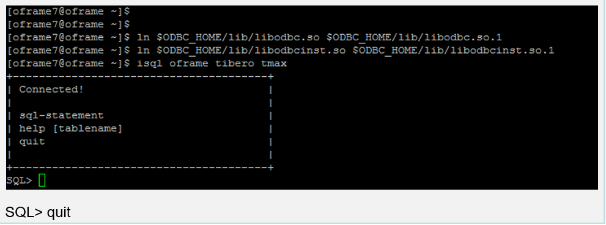

## Install OpenFrame Base

The Base application server is installed before the individual services that OpenFrame uses to manage the system on Azure, including the transaction handling server processes.

**To install OpenFrame Base**

1. Make sure the Tibero installation succeeded, then verify that the following OpenFrame\_Base7\_0\_Linux\_x86\_64.bin installer file and base.properties configuration file are present.

2. Update the bash profile with the following Tibero-specific information:

     ```bash
     alias ofhome='cd $OPENFRAME_HOME'
     alias ulog='cd $OPENFRAME_HOME/log/tmax/ulog'
     alias sysjcl='cd $OPENFRAME_HOME/volume_default/SYS1.JCLLIB'
     alias sysload='cd $OPENFRAME_HOME/volume_default/SYS1.LOADLIB'
     alias sysproc='cd $OPENFRAME_HOME/volume_default/SYS1.PROCLIB'
     alias oscsrc='cd $OPENFRAME_HOME/osc/oivp'
     alias osisrc='cd $OPENFRAME_HOME/osi/oivp'
     alias defvol='cd $OPENFRAME_HOME/volume_default'
     ```

3. Execute the bash profile:`[oframe7@ofdemo ~]$ . .bash_profile`
4. Ensure that the Tibero processes are running. For example:

     ```linux
     [oframe7@ofdemo ~]$ ps -ef|grep tbsvr
     ```

    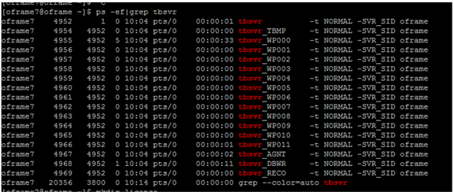

     > [!IMPORTANT]
     > Make sure you start Tibero before installation.

5. Generate license at [technet.tmaxsoft.com](https://technet.tmaxsoft.com/en/front/main/main.do) and PUT the OpenFrame Base, Batch, TACF, OSC licenses in the appropriate folder:

     ```
     [oframe7@ofdemo ~]$ cp license.dat /opt/tmaxapp/OpenFrame/core/license/
     [oframe7@ofdemo ~]$ cp lictjes.dat lictacf.dat licosc.dat $OPENFRAME_HOME/license/
     ```

6. Download the OpenFrame Base binary and base.properties files:

     ```
     [oframe7@ofdemo ~]$ vi base.properties
     OPENFRAME_HOME= <appropriate location for installation> ex. /opt/tmaxapp/OpenFrame TP_HOST_NAME=<your IP Hostname> ex. ofdemo 
     TP_HOST_IP=<your IP Address> ex. 192.168.96.148 
     TP_SHMKEY=63481 
     TP_TPORTNO=6623 
     TP_UNBLOCK_PORT=6291 
     TP_NODE_NAME=NODE1 
     TP_NODE_LIST=NODE1 
     MASCAT_NAME=SYS1.MASTER.ICFCAT 
     MASCAT_CREATE=YES 
     DEFAULT_VOLSER=DEFVOL 
     VOLADD_DEFINE=YES TSAM_USERNAME=tibero 
     TSAM_PASSWORD=tmax 
     TSAM_DATABASE=oframe 
     DATASET_SHMKEY=63211 
     DSLOCK_DATA=SYS1.DSLOCK.DATA 
     DSLOCK_LOG=SYS1.DSLOCK.LOG 
     DSLOCK_SEQ=dslock_seq.dat 
     DSLOCK_CREATE=YES 
     OPENFRAME_LICENSE_PATH=/opt/tmaxapp/license/OPENFRAME TMAX_LICENSE_PATH=/opt/tmaxapp/license/TMAX
     ```

7. Execute the installer using the base.properties file. For example:

    ```
    [oframe7@ofdemo ~]$ chmod a+x OpenFrame_Base7_0_Linux_x86_64.bin 
    [oframe7@ofdemo ~]$ ./OpenFrame_Base7_0_Linux_x86_64.bin -f base.properties
    ```

    When complete, the Installation Complete message is diplayed.

8. Verify the OpenFrame Base directory structure using the `ls -ltr` command. For example:

     ```
     [oframe7@ofdemo OpenFrame]$ ls -ltr
     total 44

     drwxrwxr-x. 4 oframe7 oframe7 61 Nov 30 16:57 UninstallerData 
     drwxrwxr-x. 2 oframe7 oframe7 4096 Nov 30 16:57 bin 
     drwxrwxr-x. 2 oframe7 oframe7 4096 Nov 30 16:57 cpm drwxrwxr-x. 2 oframe7 oframe7 4096 Nov 30 16:57 data 
     drwxrwxr-x. 2 oframe7 oframe7 4096 Nov 30 16:57 include 
     drwxrwxr-x. 2 oframe7 oframe7 8192 Nov 30 16:57 lib 
     drwxrwxr-x. 6 oframe7 oframe7 48 Nov 30 16:57 log 
     drwxrwxr-x. 2 oframe7 oframe7 6 Nov 30 16:57 profile 
     drwxrwxr-x. 7 oframe7 oframe7 62 Nov 30 16:57 sample 
     drwxrwxr-x. 2 oframe7 oframe7 6 Nov 30 16:57 schema 
     drwxrwxr-x. 2 oframe7 oframe7 6 Nov 30 16:57 temp 
     drwxrwxr-x. 3 oframe7 oframe7 16 Nov 30 16:57 shared 
     drwxrwxr-x. 2 oframe7 oframe7 4096 Nov 30 16:58 license 
     drwxrwxr-x. 23 oframe7 oframe7 4096 Nov 30 16:58 core 
     drwxrwxr-x. 2 oframe7 oframe7 4096 Nov 30 16:58 config 
     drwxrwxr-x. 2 oframe7 oframe7 4096 Nov 30 16:58 scripts 
     drwxrwxr-x. 2 oframe7 oframe7 25 Nov 30 16:58 volume_default
     ```

9. Start OpenFrame Base:

     ```
     [oframe7@ofdemo ~]$ cp /usr/lib/libtermcap.so.2 $TMAXDIR/lib
     Startup Tmax Server
     [oframe7@ofdemo ~]$ tmboot
     ```

     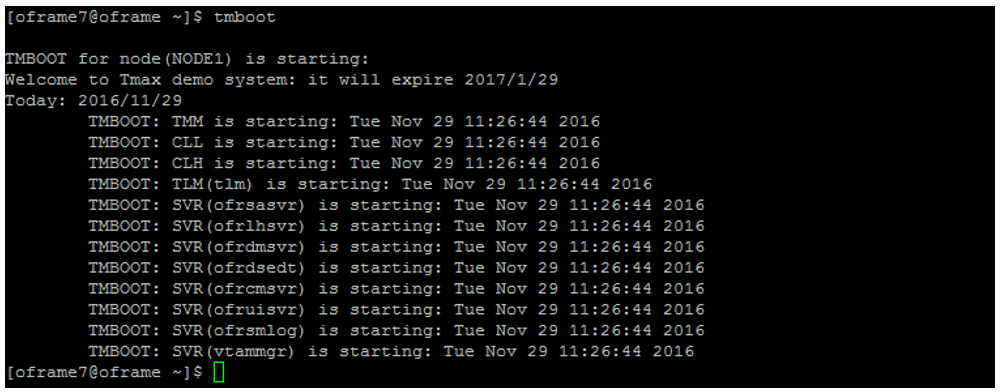

10. Verify the process status is ready using the tmadmin command in si. RDY is displayed in the **status** column for each of the processes:

     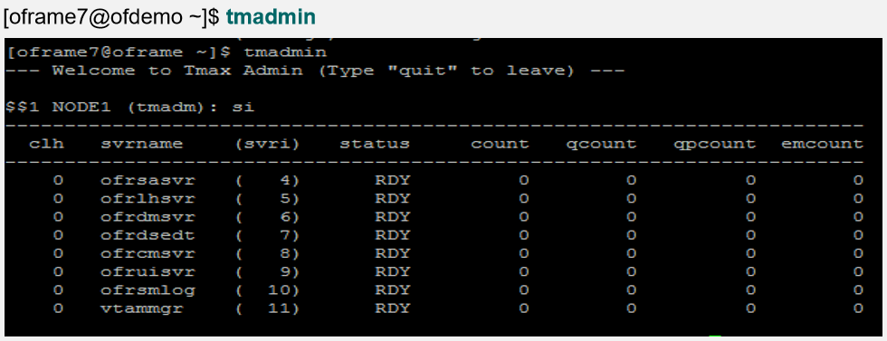

11. Shut down OpenFrame Base:

     ```
     [oframe7@ofdemo ~]$ tmdown 
     Do you really want to down whole Tmax? (y : n): y

     TMDOWN for node(NODE1) is starting: 
     TMDOWN: SERVER(ofrsasvr:36) downed: Wed Sep  7 15:37:21 2016 
     TMDOWN: SERVER(ofrdsedt:39) downed: Wed Sep  7 15:37:21 2016 
     TMDOWN: SERVER(vtammgr:43) downed: Wed Sep  7 15:37:21 2016 
     TMDOWN: SERVER(ofrcmsvr:40) downed: Wed Sep  7 15:37:21 2016 
     TMDOWN: SERVER(ofrdmsvr:38) downed: Wed Sep  7 15:37:21 2016 
     TMDOWN: SERVER(ofrlhsvr:37) downed: Wed Sep  7 15:37:21 2016 
     TMDOWN: SERVER(ofruisvr:41) downed: Wed Sep  7 15:37:21 2016 
     TMDOWN: SERVER(ofrsmlog:42) downed: Wed Sep  7 15:37:21 2016 
     TMDOWN: CLH downed: Wed Sep  7 15:37:21 2016 
     TMDOWN: CLL downed: Wed Sep  7 15:37:21 2016 
     TMDOWN: TLM downed: Wed Sep  7 15:37:21 2016 
     TMDOWN: TMM downed: Wed Sep  7 15:37:21 2016 
     TMDOWN: TMAX is down
     ```

## Install OpenFrame Batch

OpenFrame Batch consists of several components that simulate mainframe batch environments and is used to run batch jobs on Azure.

**To install Batch**

1. Make sure the base installation succeeded, then verify that the OpenFrame\_Batch7\_0\_Fix2\_MVS\_Linux\_x86\_64.bin installer file and batch.properties configuration file are present:

2. At the command prompt, type `vi batch.properties` to edit the batch.properties file using vi.

3. Modify the parameters as follows:

     ```
     OPENFRAME_HOME = /opt/tmaxapp/OpenFrame
     DEFAULT_VOLSER=DEFVOL 
     TP_NODE_NAME=NODE1 
     TP_NODE_LIST=NODE1 
     RESOURCE_SHMKEY=66991 
     #JOBQ_DATASET_CREATE=YES 
     #OUTPUTQ_DATASET_CREATE=YES 
     DEFAULT_JCLLIB_CREATE=YES 
     DEFAULT_PROCLIB_CREATE=YES 
     DEFAULT_USERLIB_CREATE=YES 
     TJES_USERNAME=tibero 
     TJES_PASSWORD=tmax 
     TJES_DATABASE=oframe 
     BATCH_TABLE_CREATE=YES
     ```

4. To execute the batch installer, at the command prompt type:

     ```
     ./OpenFrame_Batch7_0_Fix2_MVS_Linux_x86_64.bin -f batch.properties
     ```

5. When the installation is complete, start the installed OpenFrame suites by typing `tmboot` at the command prompt.

    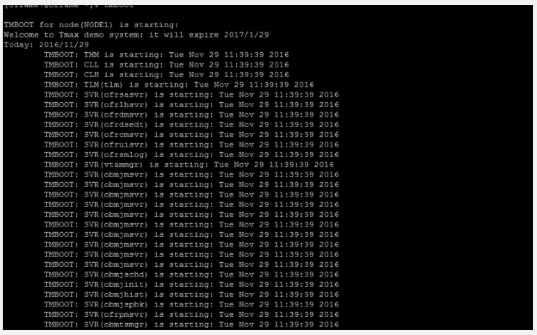

6. Type `tmadmin` at the command prompt to check the OpenFrame process.

    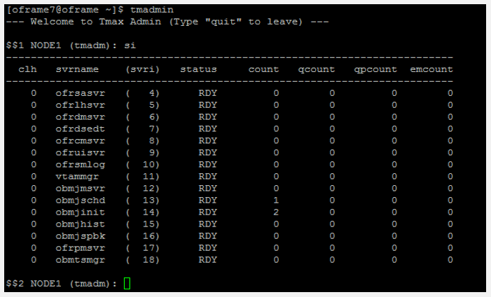

7. Execute the following commands:

     ```
     $$2 NODE1 (tmadm): quit 
     ADM quit for node (NODE1)
     ```

8. Use the `tmdown` command to start up and shut down Batch:

     ```
     [oframe7@ofdemo ~]$tmdown
     Do you really want to down whole Tmax? (y : n): y

     TMDOWN for node(NODE1) is starting: 
     TMDOWN: SERVER(ofrsasvr:36) downed: Wed Sep  7 16:01:46 2016 
     TMDOWN: SERVER(obmjmsvr:44) downed: Wed Sep  7 16:01:46 2016
     TMDOWN: SERVER(vtammgr: 43) downed: Wed Sep  7 16:01:46 2016 
     TMDOWN: SERVER(ofrcmsvr:40) downed: Wed Sep  7 16:01:46 2016 
     TMDOWN: SERVER(obmjmsvr:45) downed: Wed Sep  7 16:01:46 2016 
     TMDOWN: SERVER(obmjmsvr:46) downed: Wed Sep  7 16:01:46 2016 
     TMDOWN: SERVER(ofrdmsvr:38) downed: Wed Sep  7 16:01:46 2016 
     TMDOWN: SERVER(obmjmsvr:47) downed: Wed Sep  7 16:01:46 2016 
     TMDOWN: SERVER(ofrdsedt:39) downed: Wed Sep  7 16:01:46 2016 
     TMDOWN: SERVER(obmjschd:54) downed: Wed Sep  7 16:01:46 2016 
     TMDOWN: SERVER(obmjinit:55) downed: Wed Sep  7 16:01:46 2016 
     TMDOWN: SERVER(obmjmsvr:48) downed: Wed Sep  7 16:01:46 2016 
     TMDOWN: SERVER(obmjspbk:57) downed: Wed Sep  7 16:01:46 2016 
     TMDOWN: SERVER(obmjmsvr:49) downed: Wed Sep  7 16:01:46 2016 
     TMDOWN: SERVER(obmjmsvr:50) downed: Wed Sep  7 16:01:46 2016 
     TMDOWN: SERVER(obmjmsvr:51) downed: Wed Sep  7 16:01:46 2016 
     TMDOWN: SERVER(ofrlhsvr:37) downed: Wed Sep  7 16:01:46 2016 
     TMDOWN: SERVER(obmjmsvr:52) downed: Wed Sep  7 16:01:46 2016 
     TMDOWN: SERVER(obmjmsvr:53) downed: Wed Sep  7 16:01:46 2016 
     TMDOWN: SERVER(obmjhist:56) downed: Wed Sep  7 16:01:46 2016 
     TMDOWN: SERVER(ofruisvr:41) downed: Wed Sep  7 16:01:46 2016 
     TMDOWN: SERVER(obmtsmgr:59) downed: Wed Sep  7 16:01:46 2016 
     TMDOWN: SERVER(ofrpmsvr:58) downed: Wed Sep  7 16:01:46 2016 
     TMDOWN: SERVER(ofrsmlog:42) downed: Wed Sep  7 16:01:46 2016 
     TMDOWN: CLL downed: Wed Sep  7 16:01:46 2016 
     TMDOWN: TLM downed: Wed Sep  7 16:01:46 2016 
     TMDOWN: CLH downed: Wed Sep  7 16:01:46 2016 
     TMDOWN: TMM downed: Wed Sep  7 16:01:46 2016 
     TMDOWN: TMAX is down
     ```

## Install TACF

TACF Manager is an OpenFrame service module that controls user access to systems and resources through RACF security.

**To install TACF**

1. Verify that the OpenFrame\_Tacf7\_0\_Fix2\_Linux\_x86\_64.bin installer file and tacf.properties configuration file are present.
2. Make sure the Batch installation succeeded, then use vi to open the tacf.properties file (`vi tacf.properties`).
3. Modify the TACF parameters:

     ```
     OPENFRAME_HOME=/opt/tmaxapp/OpenFrame 
     USE_OS_AUTH=NO 
     TACF_USERNAME=tibero 
     TACF_PASSWORD=tmax 
     TACF_DATABASE=oframe 
     TACF_TABLESPACE=TACF00 
     TACF_TABLE_CREATE=YES
     ```

4. After completing TACF installer, apply the TACF environment variables. At the command prompt, type:

     ```
     source \~/.bash\_profile
     ```

5. Execute the TACF installer. At the command prompt, type:

     ```
     ./OpenFrame_Tacf7_0_Fix2_Linux_x86_64.bin -f tacf.properties
     ```

     The output looks something like this:

     ```
     Wed Dec 07 17:36:42 EDT 2016
     Free Memory: 18703 kB 
     Total Memory: 28800 kB

     4 Command Line Args: 
     0:  -f 1:  tacf.properties 
     2:  -m 
     3:  SILENT 
     java.class.path: 
     /tmp/install.dir.41422/InstallerData 
     /tmp/install.dir.41422/InstallerData/installer.zip 
     ZGUtil.CLASS_PATH: 
     /tmp/install.dir.41422/InstallerData 
     tmp/install.dir.41422/InstallerData/installer.zip 
     sun.boot.class.path: 
     /tmp/install.dir.41422/Linux/resource/jre/lib/resources.jar /tmp/install.dir.41422/Linux/resource/jre/lib/rt.jar /tmp/install.dir.41422/Linux/resource/jre/lib/sunrsasign.jar /tmp/install.dir.41422/Linux/resource/jre/lib/jsse.jar /tmp/install.dir.41422/Linux/resource/jre/lib/jce.jar /tmp/install.dir.41422/Linux/resource/jre/lib/charsets.jar /tmp/install.dir.41422/Linux/resource/jre/lib/jfr.jar /tmp/install.dir.41422/Linux/resource/jre/classes
     ```

6. At the command prompt, type `tmboot` to restart OpenFrame. The output looks something like this:

     ```
     TMBOOT for node(NODE1) is starting: 
     Welcome to Tmax demo system: it will expire 2016/11/4 
     Today: 2016/9/7 
     TMBOOT: TMM is starting: Wed Sep  7 17:48:53 2016 
     TMBOOT: CLL is starting: Wed Sep  7 17:48:53 2016 
     TMBOOT: CLH is starting: Wed Sep  7 17:48:53 2016 
     TMBOOT: TLM(tlm) is starting: Wed Sep  7 17:48:53 2016 
     TMBOOT: SVR(ofrsasvr) is starting: Wed Sep  7 17:48:53 2016 
     TMBOOT: SVR(ofrlhsvr) is starting: Wed Sep  7 17:48:53 2016 
     TMBOOT: SVR(ofrdmsvr) is starting: Wed Sep  7 17:48:53 2016 
     TMBOOT: SVR(ofrdsedt) is starting: Wed Sep  7 17:48:53 2016 
     TMBOOT: SVR(ofrcmsvr) is starting: Wed Sep  7 17:48:53 2016 
     TMBOOT: SVR(ofruisvr) is starting: Wed Sep  7 17:48:53 2016 
     TMBOOT: SVR(ofrsmlog) is starting: Wed Sep  7 17:48:53 2016 
     TMBOOT: SVR(vtammgr) is starting: Wed Sep  7 17:48:53 2016 
     TMBOOT: SVR(obmjmsvr) is starting: Wed Sep  7 17:48:53 2016 
     TMBOOT: SVR(obmjmsvr) is starting: Wed Sep  7 17:48:53 2016 
     TMBOOT: SVR(obmjmsvr) is starting: Wed Sep  7 17:48:53 2016 
     TMBOOT: SVR(obmjmsvr) is starting: Wed Sep  7 17:48:53 2016 
     TMBOOT: SVR(obmjmsvr) is starting: Wed Sep  7 17:48:53 2016 
     TMBOOT: SVR(obmjmsvr) is starting: Wed Sep  7 17:48:53 2016 
     TMBOOT: SVR(obmjmsvr) is starting: Wed Sep  7 17:48:53 2016 
     TMBOOT: SVR(obmjmsvr) is starting: Wed Sep  7 17:48:53 2016 
     TMBOOT: SVR(obmjmsvr) is starting: Wed Sep  7 17:48:53 2016 
     TMBOOT: SVR(obmjmsvr) is starting: Wed Sep  7 17:48:53 2016 
     TMBOOT: SVR(obmjschd) is starting: Wed Sep  7 17:48:53 2016 
     TMBOOT: SVR(obmjinit) is starting: Wed Sep  7 17:48:53 2016 
     TMBOOT: SVR(obmjhist) is starting: Wed Sep  7 17:48:53 2016 
     TMBOOT: SVR(obmjspbk) is starting: Wed Sep  7 17:48:53 2016 
     TMBOOT: SVR(ofrpmsvr) is starting: Wed Sep  7 17:48:53 2016 
     TMBOOT: SVR(obmtsmgr) is starting: Wed Sep  7 17:48:53 2016 
     TMBOOT: SVR(tmsvr) is starting: Wed Sep  7 17:48:53 2016
     ```

7. Verify that the process status is ready using `tmadmin` in the `si` command. For example:

     ```
     [oframe7\@ofdemo \~]\$ tmadmin
     ```

     In the **status** column, RDY appears:

    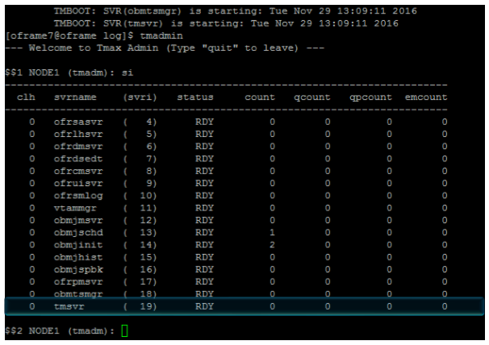

8. Execute the following commands:

     ```
     $$2 NODE1 (tmadm): quit 
     DM quit for node (NODE1)

     [oframe7@ofdemo ~]$ tacfmgr 
     Input USERNAME  : ROOT 
     Input PASSWORD  : SYS1

     TACFMGR: TACF MANAGER START!!!
     QUIT TACFMGR: TACF MANAGER END!!!

     [oframe7@ofdemo ~]$ tmdow
     ```

9. Shut the server down using the `tmdown` command. The output looks something like this:

     ```
     [oframe7@ofdemo ~]$ tmdown 
     Do you really want to down whole Tmax? (y : n): y

     TMDOWN for node(NODE1) is starting: 
     TMDOWN: SERVER(ofrlhsvr:37) downed: Wed Sep  7 17:50:50 2016 
     TMDOWN: SERVER(ofrdsedt:39) downed: Wed Sep  7 17:50:50 2016 
     TMDOWN: SERVER(obmjschd:54) downed: Wed Sep  7 17:50:50 2016 
     TMDOWN: SERVER(obmjmsvr:47) downed: Wed Sep  7 17:50:50 2016 
     TMDOWN: SERVER(obmjmsvr:48) downed: Wed Sep  7 17:50:50 2016 
     TMDOWN: SERVER(ofrdmsvr:38) downed: Wed Sep  7 17:50:50 2016 
     TMDOWN: SERVER(obmjmsvr:50) downed: Wed Sep  7 17:50:50 2016 
     TMDOWN: SERVER(obmjhist:56) downed: Wed Sep  7 17:50:50 2016 
     TMDOWN: SERVER(ofrsasvr:36) downed: Wed Sep  7 17:50:50 2016 
     TMDOWN: SERVER(ofrcmsvr:40) downed: Wed Sep  7 17:50:50 2016 
     TMDOWN: SERVER(obmjspbk:57) downed: Wed Sep  7 17:50:50 2016 
     TMDOWN: SERVER(tmsvr:60) downed: Wed Sep  7 17:50:50 2016 
     TMDOWN: SERVER(ofrpmsvr:58) downed: Wed Sep  7 17:50:50 2016 
     TMDOWN: SERVER(obmtsmgr:59) downed: Wed Sep  7 17:50:50 2016 
     TMDOWN: CLL downed: Wed Sep  7 17:50:50 2016 
     TMDOWN: CLH downed: Wed Sep  7 17:50:50 2016 
     TMDOWN: TLM downed: Wed Sep  7 17:50:50 2016 
     TMDOWN: TMM downed: Wed Sep  7 17:50:50 2016 
     TMDOWN: TMAX is down
     ```

## Install ProSort

ProSort is a utility used in batch transactions for sorting data.

**To install ProSort**

1. Make sure the Batch installation was successful, and then verify that the **prosort-bin-prosort\_2sp3-linux64-2123-opt.tar.gz** installer file is present.

2. Execute the installer using the properties file. At the command prompt, type:

     ```
     tar -zxvf prosort-bin-prosort\_2sp3-linux64-2123-opt.tar.gz
     ```

3. Move the prosort directory to the home location. At the command prompt, type:

     ```
     mv prosort /opt/tmaxapp/prosort
     ```

4. Create a license subdirectory and copy the license file there. For example:

     ```
     cd /opt/tmaxapp/prosort 
     mkdir license 
     cp /opt/tmaxsw/oflicense/prosort/license.xml /opt/tmaxapp/prosort/license
     ```

5. Open bash.profile in vi (`vi .bash_profile`) and update it as follows:

     ```bash
     #       PROSORT

     PROSORT_HOME=/opt/tmaxapp/prosort 
     PROSORT_SID=gbg 
     PATH=$PATH:$PROSORT_HOME/bin LD_LIBRARY_PATH=$PROSORT_HOME/lib:$LD_LIBRARY_PATH LIBPATH$PROSORT_HOME/lib:$LIBPATH 
     export PROSORT_HOME PROSORT_SID 
     PATH LD_LIBRARY_PATH LIBPATH 
     PATH=$PATH:$OPENFRAME_HOME/shbin 
     export PATH
     ```

6. To execute the bash profile, at the command prompt, type: `. .bash_profile`

7. Create the configuration file. For example:

     ```
     oframe@oframe7: cd /opt/tmaxapp/prosort/config 
     oframe@oframe7: ./gen_tip.sh 
     Using PROSORT_SID "gbg"
      /home/oframe7/prosort/config/gbg.tip generated
     ```

8. Create the symbolic link. For example:

     ```
     oframe@oframe7: cd /opt/tmaxapp/OpenFrame/util/ 
     oframe@oframe7home/oframe7/OpenFrame/util :  ln -s DFSORT SORT
     ```

9. Verify the ProSort installation by executing the `prosort -h` command. For example:

     ```
     oframe@oframe7: prosort -h

     Usage: prosort [options] [sort script files]
     options ------
     -h             Display this information 
     -v             Display version information 
     -s             Display state information 
     -j             Display profile information 
     -x             Use SyncSort compatible mode
     ```

## Install OFCOBOL

OFCOBOL is the OpenFrame compiler that interprets the mainframe’s COBOL programs. 

**To install OFCOBOL**

1. Make sure that the Batch/Online installation succeeded, then verify that the OpenFrame\_COBOL3\_0\_40\_Linux\_x86\_64.bin installer file is present.

2. To execute the OFCOBOL installer, at the command prompt, type:

     ```
      ./OpenFrame\_COBOL3\_0\_40\_Linux\_x86\_64.bin
     ```

3. Read the licensing agreement and press Enter to continue.

4. Accept the licensing agreement. When the installation is complete, the following appears:

     ```
     Choose Install Folder 
     --------------------
     Where would you like to install?
     Default Install Folder: /home/oframe7/OFCOBOL

     ENTER AN ABSOLUTE PATH, OR PRESS <ENTER> TO ACCEPT THE DEFAULT : /opt/tmaxapp/OFCOBOL

     INSTALL FOLDER IS: /opt/tmaxapp/OFCOBOL 
     IS THIS CORRECT? (Y/N): Y[oframe7@ofdemo ~]$ vi .bash_profile

     ============================================================================ Installing... 
     ------------
     [==================|==================|==================|==================] 
     [------------------|------------------|------------------|------------------]

     =============================================================================== Installation Complete 
     --------------------
     Congratulations. OpenFrame_COBOL has been successfully installed
     PRESS <ENTER> TO EXIT THE INSTALLER
     ```

5. Open the bash profile in vi (`vi .bash_profile`) and verify that is updated with OFCOBOL variables.
6. Execute the bash profile. At the command prompt, type:

     ```
      source ~/.bash_profile
     ```

7. Copy the OFCOBOL license to the installed folder. For example:
     ```
     mv licofcob.dat $OFCOB_HOME/license
     ```
8. Go to the OpenFrame tjclrun.conf configuration file and open it in vi. For example:
     ```
     [oframe7@ofdemo ~]$ cd $OPENFRAME_HOME/config 
     [oframe7@ofdemo ~]$ vi tjclrun.conf
     ```

   Here's the SYSLIB section before the change:
     ```
     [SYSLIB] BIN_PATH=${OPENFRAME_HOME}/bin:${OPENFRAME_HOME}/util:${COBDIR}/bin:/usr/local/bin:/bin LIB_PATH=${OPENFRAME_HOME}/lib:${OPENFRAME_HOME}/core/lib:${TB_HOME}/client/lib:${COBDIR}/lib:/ usr/lib:/lib:/lib/i686:/usr/local/lib:${PROSORT_HOME}/lib:/opt/FSUNbsort/lib
     ```
   Here's the SYSLIB section after the change:
     ```
     [SYSLIB] BIN_PATH=${OPENFRAME_HOME}/bin:${OPENFRAME_HOME}/util:${COBDIR}/bin:/usr/local/bin:/bin LIB_PATH=${OPENFRAME_HOME}/lib:${OPENFRAME_HOME}/core/lib:${TB_HOME}/client/lib:${COBDIR}/lib:/ usr/lib:/lib:/lib/i686:/usr/local/lib:${PROSORT_HOME}/lib:/opt/FSUNbsort/lib :${ODBC_HOME}/lib 
     :${OFCOB_HOME}/lib
     ```
9. Review the OpenFrame\_COBOL\_InstallLog.log file in vi and verify that there are no errors. For example:
     ```
     [oframe7@ofdemo ~]$ vi $OFCOB_HOME/UninstallerData/log/OpenFrame_COBOL_InstallLog.log 
     …….. 
     Summary 
     ------
     Installation: Successful. 
     131 Successes 
     0 Warnings 
     0 NonFatalErrors 
     0 FatalError
     ```
10. Use the `ofcob --version` command and review the version number to verify the installation. For example:

     ```
     [oframe7@ofdemo ~]$ ofcob --version 
     OpenFrame COBOL Compiler 3.0.54 
     CommitTag:: 645f3f6bf7fbe1c366a6557c55b96c48454f4bf
     ```

11. Reboot OpenFrame using the `tmdown/tmboot` command.

## Install OFASM

OFASM is the OpenFrame compiler that interprets the mainframe’s assembler programs.

**To install OFASM**

1. Make sure that the Batch/Online installation succeeded, then verify that the
    OpenFrame\_ASM3\_0\_Linux\_x86\_64.bin installer file is present.

2. Execute the installer. For example:

     ```
     [oframe7@ofdemo ~]$ ./OpenFrame_ASM3_0_Linux_x86_64.bin
     ```

3. Read the licensing agreement and press Enter to continue.
4. Accept the licensing agreement.
5. Verify the bash profile is updated with OFASM variables. For example:

     ```
     [oframe7@ofdemo ~]$ source .bash_profile
     [oframe7@ofdemo ~]$ ofasm --version 
     # TmaxSoft OpenFrameAssembler v3 r328 
     (3ff35168d34f6e2046b96415bbe374160fcb3a34)

     [oframe7@ofdemo OFASM]$ vi .bash_profile

     # OFASM ENV 
     export OFASM_HOME=/opt/tmaxapp/OFASM 
     export OFASM_MACLIB=$OFASM_HOME/maclib/free_macro 
     export PATH="${PATH}:$OFASM_HOME/bin:" 
     export LD_LIBRARY_PATH="./:$OFASM_HOME/lib:$LD_LIBRARY_PATH"
     ```

6. Open the OpenFrame tjclrun.conf configuration file in vi and edit it as follows:

     ```
     [oframe7@ofdemo ~]$ cd $OPENFRAME_HOME/config 
     [oframe7@ofdemo ~]$ vi tjclrun.conf
     ```

     Here is the [SYSLIB] section *before* the change:

     ```
     [SYSLIB] BIN_PATH=${OPENFRAME_HOME}/bin:${OPENFRAME_HOME}/util:${COBDIR}/bin:/usr/local/bin:/bi n:${OPENFRAME_HOME}/volume_default/SYS1.LOADLIB LIB_PATH=${OPENFRAME_HOME}/lib:${OPENFRAME_HOME}/core/lib:${TB_HOME}/client/lib:${CO BDIR}/lib:/usr/lib:/lib:/lib/i686:/usr/local/lib:${PROSORT_HOME}/lib:/opt/FSUNbsort/lib:${OFCOB_HOM E}/lib:${ODBC_HOME}/lib:${OFPLI_HOME}/lib
     ```

     Here is the [SYSLIB] section *after* the change:

     ```
     [SYSLIB] BIN_PATH=${OPENFRAME_HOME}/bin:${OPENFRAME_HOME}/util:${COBDIR}/bin:/usr/local/bin:/bi n:${OPENFRAME_HOME}/volume_default/SYS1.LOADLIB LIB_PATH=${OPENFRAME_HOME}/lib:${OPENFRAME_HOME}/core/lib:${TB_HOME}/client/lib:${CO BDIR}/lib:/usr/lib:/lib:/lib/i686:/usr/local/lib:${PROSORT_HOME}/lib:/opt/FSUNbsort/lib:${OFCOB_HOM E}/lib:${ODBC_HOME}/lib:${OFPLI_HOME}/lib:${OFASM_HOME}/lib
     ```

7. Open the OpenFrame\_ASM\_InstallLog.log file in vi and verify that there are no errors. For example:

     ```
     [oframe7@ofdemo ~]$ vi 
     $OFASM_HOME/UninstallerData/log/OpenFrame_ASM_InstallLog.log 
     …….. 
     Summary 
     ------

     Installation: Successful.

     55 Successes 
     0 Warnings 
     0 NonFatalErrors 
     0 FatalErrors
     ```

8. Reboot OpenFrame by issuing one of the following commands:

     ```
     tmdown / tmboot
     ```

     —or—

     ```
     oscdown / oscboot
     ```

## Install OSC

OSC is the OpenFrame environment similar to IBM CICS that supports high-speed OLTP transactions and other management functions.

**To install OSC**

1. Make sure the base installation succeeded, then verify that the OpenFrame\_OSC7\_0\_Fix2\_Linux\_x86\_64.bin installer file and osc.properties configuration file are present.
2. Edit the following parameters in the osc.properties file:
     ```
     OPENFRAME_HOME=/opt/tmaxapp/OpenFrame OSC_SYS_OSC_NCS_PATH=/opt/tmaxapp/OpenFrame/temp/OSC_NCS OSC_APP_OSC_TC_PATH=/opt/tmaxapp/OpenFrame/temp/OSC_TC
     ```

3. Execute the installer using the properties file as shown:

     ```
     [oframe7@ofdemo ~]$ chmod a+x OpenFrame_OSC7_0_Fix2_Linux_x86_64.bin [oframe7@ofdemo ~]$ ./OpenFrame_OSC7_0_Fix2_Linux_x86_64.bin -f osc.properties
     ```

     When finished, the "Installation Complete" message is displayed.

4. Verify that the bash profile is updated with OSC variables.
5. Review the OpenFrame\_OSC7\_0\_Fix2\_InstallLog.log file. It should look something like this:

     ```
     Summary 
     ------ 
     Installation: Successful.

     233 Successes
     0 Warnings
     0 NonFatalErrors
     0 FatalError
     ```

6. Use vi to open the ofsys.seq configuration file. For example:

     ```
     vi $OPENFRAME_HOME/config/ofsys.seq
     ```

7. In the \#BASE and \#BATCH sections, edit the parameters as shown.

     ```
     Before changes
     #BASE
     ofrsasvr
     ofrlhsvr
     ofrdmsvr
     ofrdsedt
     ofrcmsvr
     ofruisvr
     ofrsmlog
     vtammgr
     TPFMAGENT

     #BATCH 
     #BATCH#obmtsmgr
     #BATCH#ofrpmsvr
     #BATCH#obmjmsvr
     #BATCH#obmjschd
     #BATCH#obmjinit
     #BATCH#obmjhist
     #BATCH#obmjspbk
     #TACF #TACF#tmsvr

     After changes 	#BATCH
     #BASE          obmtsmgr 
     ofrsasvr       ofrpmsvr
     ofrlhsvr       obmjmsvr
     ofrdmsvr       obmjschd
     ofrdsedt       obmjinit
     ofrcmsvr       obmjhist
     ofruisvr       obmjspbk
     ofrsmlog
     vtammgr        #TACF
     TPFMAGENT      tmsvr
    ```

8. Copy the license file. For example:

     ```
     [oframe7@ofdemo ~]$ cp /home/oframe7/oflicense/ofonline/licosc.dat 

     $OPENFRAME_HOME/license

     [oframe7@ofdemo ~]$ cd $OPENFRAME_HOME/license 
     oframe@oframe7/OpenFrame/license / ls -l 
     -rwxr-xr-x. 1 oframe mqm 80 Sep 12 01:37 licosc.dat 
     -rwxr-xr-x. 1 oframe mqm 80 Sep  8 09:40 lictacf.dat 
     -rwxrwxr-x. 1 oframe mqm 80 Sep  3 11:54 lictjes.da
     ```

9. To start up and shut down OSC, initialize the CICS region shared memory by typing `osctdlinit OSCOIVP1` at the command prompt.

10. Run `oscboot` to boot up OSC. The output looks something like this:

     ```
     OSCBOOT : pre-processing       [ OK ]

     TMBOOT for node(NODE1) is starting: 
     Welcome to Tmax demo system: it will expire 2016/11/4 
     Today: 2016/9/12 
          TMBOOT: TMM is starting: Mon Sep 12 01:40:25 2016 
          TMBOOT: CLL is starting: Mon Sep 12 01:40:25 2016 
          TMBOOT: CLH is starting: Mon Sep 12 01:40:25 2016 
          TMBOOT: TLM(tlm) is starting: Mon Sep 12 01:40:25 2016 
     ```

11. To verify that the process status is ready, use the `tmadmin` command in si. All the processes should display RDY in the **status** column.

    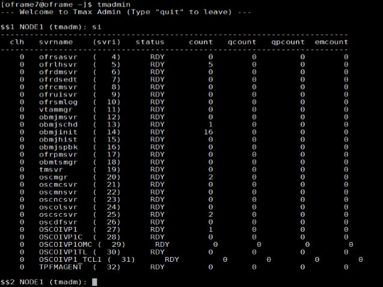

12. Shut OSC down using the `oscdown` command.

## Install JEUS

JEUS (Java Enterprise User Solution) provides the presentation layer of the OpenFrame web application server.

Before installing JEUS, install the Apache Ant package, which provides the libraries and command-line tools needed to install JEUS.

**To install Apache Ant**

1. Download Ant binary using the `wget` command. For example:

     ```
     wget http://apache.mirror.cdnetworks.com/ant/binaries/apacheant-1.9.7-bin.tar.gz
     ```

2. Use the `tar` utility to extract the binary file and move it to an appropriate location. For example:

     ```
     tar -xvzf apache-ant-1.9.7-bin.tar.gz
     ```

3. For efficiency, create a symbolic link:

     ```
     ln -s apache-ant-1.9.7 ant
     ```

4. Open the bash profile in vi (`vi .bash_profile`)and update it with the following variables:

     ```
     # Ant ENV
     export ANT_HOME=$HOME/ant 
     export PATH=$HOME/ant/bin:$PATH
     ```

5.  Apply the modified environment variable. For example:

     ```
     [oframe7\@ofdemo \~]\$ source \~/.bash\_profile
     ```

**To install JEUS**

1. Expand the installer using the `tar` utility. For example:

     ```
     [oframe7@ofdemo ~]$ tar -zxvf jeus704.tar.gz
     ```

2. Create a **jeus** folder (`mkdir jeus7`) and unzip the binary.
3. Change to the **setup** directory (or use the JEUS parameter for your own environment). For example:

     ```
     [oframe7@ofdemo ~]$ cd jeus7/setup/
     ```

4. Execute `ant clean-all` before performing the build. The output looks something like this:

     ```
     Buildfile: /home/oframe7jeus7/setup/build.xml

     clean-bin:
     delete-domain:
     [echo] Deleting a domain configuration: domain = jeus_domain
     delete-nodesxml:
     clean-config:
     clean-all:
     BUILD SUCCESSFUL
     Total time: 0 seconds
     ```

5.  Make a backup of the domain-config-template.properties file. For example:

     ```
     [oframe7@ofdemo ~]$ cp domain-config-template.properties domain-configtemplate.properties.bkp
     ```

6. Open the domain-config-template.properties file in vi:

     ```
     [oframe7\@ofdemo setup]\$ vi domain-config-template.properties
     ```

7. Change `jeus.password=jeusadmin nodename=Tmaxsoft` to `jeus.password=tmax1234 nodename=ofdemo`

8. Execute the `ant install` command to build JEUS.
9.  Update the .bash\_profile file with the JEUS variables as shown:

     ```
     # JEUS ENV 
     export JEUS_HOME=/opt/tmaxui/jeus7 PATH="/opt/tmaxui/jeus7/bin:/opt/tmaxui/jeus7/lib/system:/opt/tmaxui/jeus7/webserver/bin:$ {PATH}" 
     export PATH
     ```

10. Execute the bash profile. For example:

     ```
     [oframe7@ofdemo setup]$ . .bash_profile
     ```

11. *Optional*. Create an alias for easy shutdown and boot of JEUS components:

     ```     
     # JEUS alias

     alias dsboot='startDomainAdminServer -domain jeus_domain -u administrator -p jeusadmin'
     alias msboot='startManagedServer -domain jeus_domain -server server1 -u administrator -p jeusadmin' 
     alias msdown=‘jeusadmin -u administrator -p tmax1234 "stop-server server1“’ 
     alias dsdown=‘jeusadmin -domain jeus_domain -u administrator -p tmax1234 "local-shutdown“’
     ```

12. To verify the installation, start the domain admin server as shown:

     ```
     [oframe7@ofdemo ~]$ startDomainAdminServer -domain jeus_domain -u administrator -p jeusadmin
     ```

13. Verify by web logon using the syntax:

     ```
     http://<IP>:<port>/webadmin/login
     ```

     For example, <http://192.168.92.133:9736/webadmin/login.> The logon screen appears:
    
     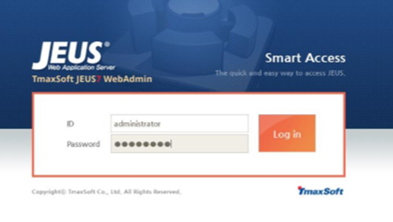

     > [!NOTE]
     > If you experience any issues with port security, open port 9736 or disable the firewall (`systemctl stop firewall`).

14. To change the hostname for server1, click **Lock & Edit**, then click **server1**. In the Server window, change the hostname as follows:

    1.  Change **Nodename** to **ofdemo**.
    2.  Click **OK** on the right side of the window.
    3.  Click **Apply changes** on the lower left side of the window and for description, enter *Hostname change*.

    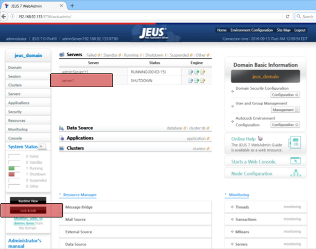

15. Verify that the configuration is successful in the confirmation screen.

    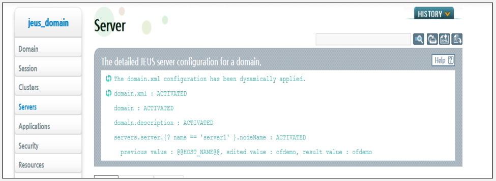

16. Start the managed server process “server1” using the following command:

     ```
     [oframe7@ofdemo ~]$ startManagedServer -domain jeus_domain -server server1 -u administrator -p jeusadmin
     ```

## Install OFGW

OFGW Is the OpenFrame gateway that supports communication between the 3270 terminal emulator and the OSI base and manages the sessions between the terminal emulator and OSI.

**To install OFGW**

1. Make sure that JEUS was installed successfully, then verify that the OFGW7\_0\_1\_Generic.bin installer file is present.
2. Execute the installer. For example:

     ```
     [oframe7@ofdemo ~]$ ./OFGW7_0_1_Generic.bin
     ````

3. Use the following locations for the corresponding prompts:
     -   JEUS Home directory
     -   JEUS Domain Name
     -   JEUS Server Name
     -   Tibero Driver
     -   Tmax Node ID ofdemo

4. Accept the rest of the defaults, then press Enter to exit the installer.

5. Verify that the URL for OFGW is working as expected:

     ```
     Type URL 
     http://192.168.92.133:8088/webterminal/ and press enter
      < IP >               :8088/webterminal/
     ```

     The following screen appears:

    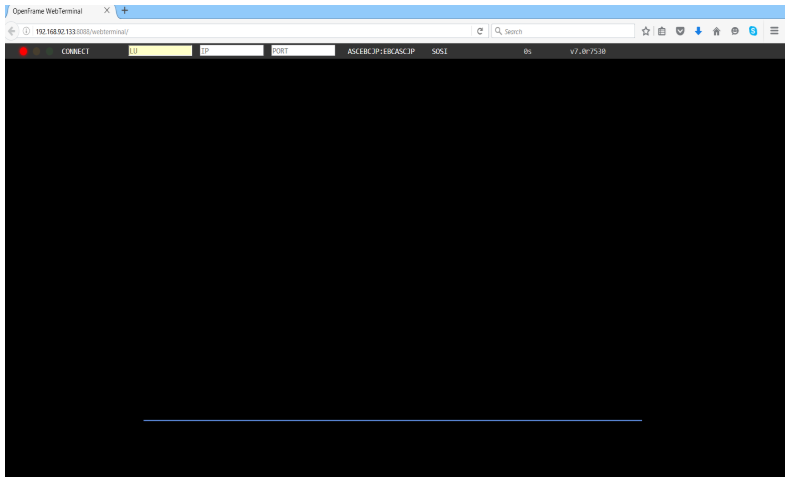

## Install OFManager

OFManager provides operation and management functions for OpenFrame in the web environment.

**To install OFManager**

1. Verify that the OFManager7\_Generic.bin installer file is present.
2. Execute the installer. For example:

     ```
     OFManager7_Generic.bin
     ```

3.  Press Enter to continue, then accept the license agreement.
4.  Choose the install folder.
5.  Accept the defaults.
6.  Choose Tibero as the database.
7.  Press Enter to exit the installer.
8.  Verify that the URL for OFManager is working as expected:

     ```
     Type URL http://192.168.92.133:8088/ofmanager and press enter <  IP >  : < PORT >  ofmanager Enter ID:   ROOT 
     Password: SYS1
     ```

The start screen appears:

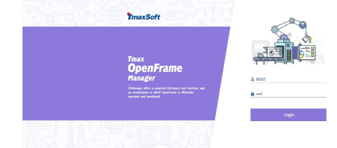

That completes the installation of the OpenFrame components.

## Next steps

If you are considering a mainframe migration, our expanding partner ecosystem is available to help you. For detailed guidance about choosing a partner solution, refer to the [Platform Modernization Alliance](https://www.platformmodernization.org/pages/mainframe.aspx).

-   [Get started with Azure](https://docs.microsoft.com/azure/)
-   [Host Integration Server (HIS) documentation](https://docs.microsoft.com/host-integration-server/)
-   [Azure Virtual Data Center Lift-and-Shift Guide](https://blogs.msdn.microsoft.com/azurecat/2018/03/12/new-whitepaper-azure-virtual-datacenter-lift-and-shift-guide/)
