# ASM Configuration on Oracle Linux Azure VM

This document presents the installation and configuration of Oracle ASM on Azure VM.

This guide details using the Azure CLI to deploy an Oracle 12c Database from the Marketplace gallery image.

Before you start, make sure that the Azure CLI has been installed. For more information, see [Azure CLI installation guide](https://docs.microsoft.com/cli/azure/install-azure-cli). 

## Log in to Azure 

Log in to your Azure subscription with the [az login](/cli/azure/#login) command and follow the on-screen directions.

```azurecli
az login
```

## Create a resource group

Create a resource group with the [az group create](/cli/azure/group#create) command. An Azure resource group is a logical container into which Azure resources are deployed and managed. 

The following example creates a resource group named `myResourceGroup` in the `westus` location.

```azurecli
az group create --name myResourceGroup --location westus
```

## Create virtual machine

Create a VM with the [az vm create](/cli/azure/vm#create) command. 

The following example creates a VM named `myVM` and creates SSH keys if they do not already exist in a default key location. To use a specific set of keys, use the `--ssh-key-value` option.  

```azurecli
az vm create --resource-group myResourceGroup --name myVM --image Oracle:Oracle-Database-Ee:12.1.0.2:latest --size Standard_DS2_v2 --generate-ssh-keys
```

When the VM has been created, the Azure CLI shows information similar to the following example: Take note of the `publicIpAddress`. This address is used to access the VM.

```azurecli
{
  "fqdns": "",
  "id": "/subscriptions/00000000-0000-0000-0000-000000000000/resourceGroups/myResourceGroup/providers/Microsoft.Compute/virtualMachines/myVM",
  "location": "westus",
  "macAddress": "00-0D-3A-36-2F-56",
  "powerState": "VM running",
  "privateIpAddress": "10.0.0.4",
  "publicIpAddress": "13.64.104.241",
  "resourceGroup": "myResourceGroup"
}
```

Add disks to be used for ASM configuration

```azurecli
az vm disk attach -g myResourceGroup --vm-name myVM --disk myDataDisk --new --size-gb 50
az vm disk attach -g myResourceGroup --vm-name myVM --disk myDataDisk2 --new --size-gb 50
az vm disk attach -g myResourceGroup --vm-name myVM --disk myDataDisk3 --new --size-gb 50
az vm disk attach -g myResourceGroup --vm-name myVM --disk myDataDisk4 --new --size-gb 50
```

## Connect to virtual machine

Use the following command to create an SSH session with the virtual machine. Replace the IP address with the `publicIpAddress` of your virtual machine.

```bash 
ssh <publicIpAddress>
```

## Install ASM

For more information, see [Oracle ASMLib Downloads for Oracle Linux 6](http://www.oracle.com/technetwork/server-storage/linux/asmlib/ol6-1709075.html).  

```bash
$ sudo su -
# yum list
```
The first you run yum list, it could take several minutes to load

```bash
# yum list | grep oracleasm
# yum -y install kmod-oracleasm.x86_64
# yum -y install oracleasm-support.x86_64
# wget http://download.oracle.com/otn_software/asmlib/oracleasmlib-2.0.12-1.el6.x86_64.rpm
# yum -y install oracleasmlib-2.0.12-1.el6.x86_64.rpm
# rm -f oracleasmlib-2.0.12-1.el6.x86_64.rpm
```
Verify ASM is installed
```bash
# rpm -qa |grep oracleasm
oracleasm-support-2.1.10-4.el6.x86_64
kmod-oracleasm-2.0.8-15.el6_9.x86_64
oracleasmlib-2.0.12-1.el6.x86_64
```

Add users and groups
```bash
# groupadd -g 54345 asmadmin
# groupadd -g 54346 asmdba
# groupadd -g 54347 asmoper
# useradd -u 3000 -g oinstall -G dba,asmadmin,asmdba,asmoper grid
# usermod -g oinstall -G dba,asmdba,asmadmin oracle
```
Verify users and groups
```bash
# id grid
uid=3000(grid) gid=54321(oinstall) groups=54321(oinstall),54322(dba),54345(asmadmin),54346(asmdba),54347(asmoper)
```
Create folder and change owner
```bash
# mkdir /u01/app/grid
# chown grid:oinstall /u01/app/grid
```

## Configure ASM

For this setup, the default user is set to "grid" and the default group is set to "asmadmin". Ensure that the oracle user is part of the asmadmin group.

```bash
# /usr/sbin/oracleasm configure -i
Configuring the Oracle ASM library driver.

This will configure the on-boot properties of the Oracle ASM library
driver.  The following questions will determine whether the driver is
loaded on boot and what permissions it will have.  The current values
will be shown in brackets ('[]').  Hitting <ENTER> without typing an
answer will keep that current value.  Ctrl-C will abort.

Default user to own the driver interface []: grid
Default group to own the driver interface []: asmadmin
Start Oracle ASM library driver on boot (y/n) [n]: y
Scan for Oracle ASM disks on boot (y/n) [y]: y
Writing Oracle ASM library driver configuration: done
```

View disk configuration
```bash
# cat /proc/partitions
```

Format disk
```bash
# fdisk /dev/sdc
Device contains neither a valid DOS partition table, nor Sun, SGI or OSF disklabel
Building a new DOS disklabel with disk identifier 0xf865c6ca.
Changes will remain in memory only, until you decide to write them.
After that, of course, the previous content won't be recoverable.

Warning: invalid flag 0x0000 of partition table 4 will be corrected by w(rite)

The device presents a logical sector size that is smaller than
the physical sector size. Aligning to a physical sector (or optimal
I/O) size boundary is recommended, or performance may be impacted.

WARNING: DOS-compatible mode is deprecated. It's strongly recommended to
         switch off the mode (command 'c') and change display units to
         sectors (command 'u').

Command (m for help): n
Command action
   e   extended
   p   primary partition (1-4)
p
Partition number (1-4): 1
First cylinder (1-6527, default 1):
Using default value 1
Last cylinder, +cylinders or +size{K,M,G} (1-6527, default 6527):
Using default value 6527

Command (m for help): w
The partition table has been altered!

Calling ioctl() to re-read partition table.
Syncing disks.
```
Repeat the step above for /dev/sdd /dev/sde and /dev/sdf

Check disk configuration

```bash
# cat /proc/partitions
major minor  #blocks  name

   8       16   14680064 sdb
   8       17   14678976 sdb1
   8       32   52428800 sdc
   8       33   52428096 sdc1
   8       48   52428800 sdd
   8       49   52428096 sdd1
   8       64   52428800 sde
   8       65   52428096 sde1
   8       80   52428800 sdf
   8       81   52428096 sdf1
   8        0   52428800 sda
   8        1     512000 sda1
   8        2   51915776 sda2
  11        0    1048575 sr0
```
Check ASM service status
```bash
# service oracleasm status
Checking if ASM is loaded: no
Checking if /dev/oracleasm is mounted: no
```

Start ASM service
```bash
# service oracleasm start
Initializing the Oracle ASMLib driver:                     [  OK  ]
Scanning the system for Oracle ASMLib disks:               [  OK  ]
```

Create ASM disks
```bash
# service oracleasm createdisk ASMSP /dev/sdc1
Marking disk "ASMSP" as an ASM disk:                       [  OK  ]

# service oracleasm createdisk DATA /dev/sdd1
Marking disk "DATA" as an ASM disk:                        [  OK  ]

# service oracleasm createdisk DATA1 /dev/sde1
Marking disk "DATA1" as an ASM disk:                       [  OK  ]

[root@kennyVM1 ~]# service oracleasm createdisk FRA /dev/sdf1
Marking disk "FRA" as an ASM disk:                         [  OK  ]
```

List ASM disks
```bash
# service oracleasm listdisks
ASMSP
DATA
DATA1
FRA
```

Change root, oracle, and grid passwords (are use later during installation)
```bash
# passwd oracle
# passwd grid
# passwd root
```

Change folder permission
```bash
# chmod -R 775 /opt
# chown grid:oinstall /opt
# chown oracle:oinstall /dev/sdc1
# chown oracle:oinstall /dev/sdd1
# chown oracle:oinstall /dev/sde1
# chown oracle:oinstall /dev/sdf1
# chmod 600 /dev/sdc1
# chmod 600 /dev/sdd1
# chmod 600 /dev/sde1
# chmod 600 /dev/sdf1
```

## Download grid software

[Oracle ASM download page](http://www.oracle.com/technetwork/database/enterprise-edition/downloads/database12c-linux-download-2240591.html). 

There should be two zip files to download under the title "Oracle Database 12c Release 1 Grid Infrastructure (12.1.0.2.0) for Linux x86-64"

Once these zips are download to your client machine, you can SCP (secure copy) to your VM

```bash
scp *.zip <publicIpAddress>:<folder>
```

Move the zip files to /opt folder and change owner of files
```bash
# mv <folder>/*.zip /opt
# cd /opt
# chown grid:oinstall linuxamd64_12102_grid_1of2.zip
# chown grid:oinstall linuxamd64_12102_grid_2of2.zip
```

Unzip files, install unzip utility if not already installed
```bash
# yum install unzip
# unzip linuxamd64_12102_grid_1of2.zip
# unzip linuxamd64_12102_grid_2of2.zip
```

Change permission
```bash
# chown -R grid:oinstall /opt/grid
```

Turn off the firewall
```bash
# service iptables status
# service iptables stop
```

Check available swap space, you need at lease 6 GB of swap space to install Grid
```bash
# swapon -s
```

If you have less than 6GB of swap space, you can add more swap space by using the followings
```bash
# dd if=/dev/zero of=/extraswap bs=1M count=6144
6144+0 records in
6144+0 records out
6442450944 bytes (6.4 GB) copied, 141.245 s, 45.6 MB/s

# mkswap /mnt/resource/extraswap
mkswap: /mnt/resource/extraswap: warning: don't erase bootbits sectors
        on whole disk. Use -f to force.
Setting up swapspace version 1, size = 6291452 KiB
no label, UUID=80bd7816-b3a2-4eec-a824-733209644fc5
# swapon /mnt/resource/extraswap

```
## Prepare the client and VM to run X11(For Windows client only)

Log in as root, edit the /etc/ssh/ssh_config file, change the setting of Forwardx11 to yes

```
#   ForwardX11 no
ForwardX11 yes

```
Download Putty and Xming onto your Windows machine

http://www.putty.org/
https://xming.en.softonic.com/


Once you install Putty, go to the folder and located puttygen.exe

For example: C:\Program Files\PuTTY, run puttygen.exe

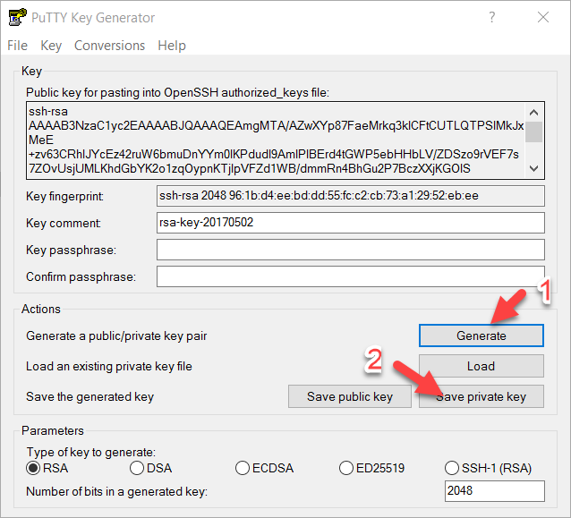

Click the Generate button to generate a key, copy the content of the key (Control-C), then click the Save private key, ignore the warning, and click ok.

Back to your VM
```bash
# sudo su - grid
$ mkdir .ssh (if not already created)
$ cd .ssh
```
create a file call authorized_keys and paste the content of the key to this file and save it.

Note: The key must contains ssh-rsa .... and must be in one line.

Start Putty, select SSH, then select Auth and browse the key you generated earlier.

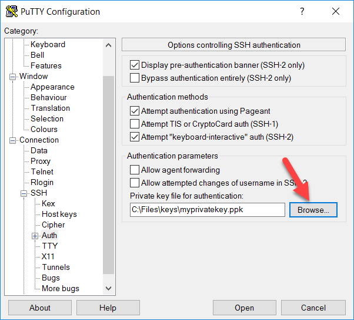

Select the X11 from the side menu and check the x11 box

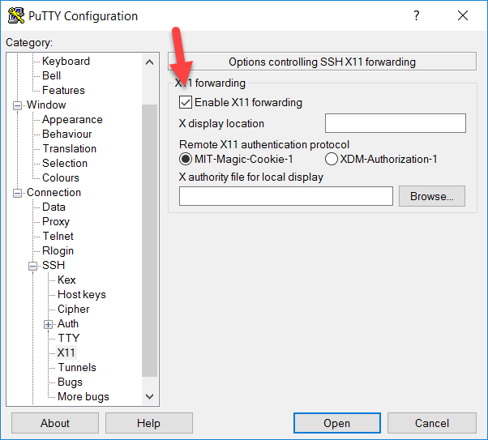

Click Session and enter the host information and click the Open button

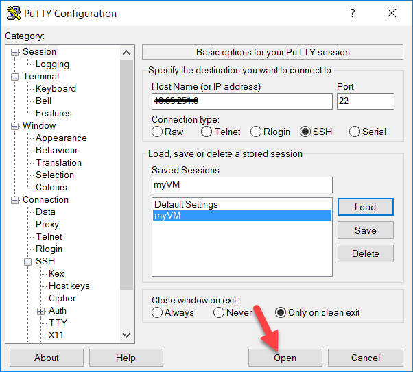

Log in as grid, you should be able to log in without prompt for a password. Note: make sure Xming is running prior to start the installation

```bash
$ cd /opt/grid
$ ./runInstaller
```
It may take a few minutes before the Oracle installer to start.
Select the "Install and Configure Oracle Grid Infrastructure for a Standalone Server", then click next

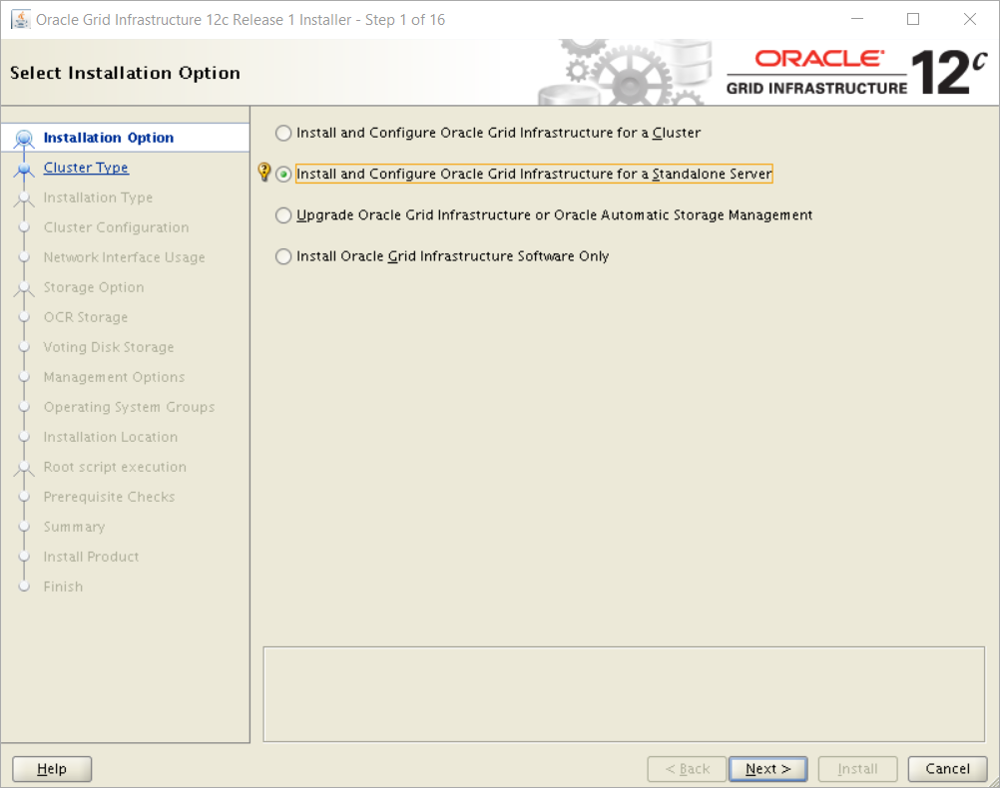

Select "English" or other language desired, click next to continue
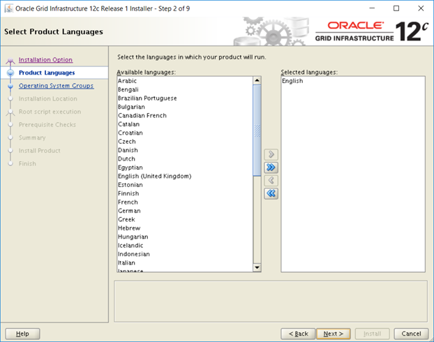

Enter the Disk group name and check the ORCLASMSP box, click next to continue
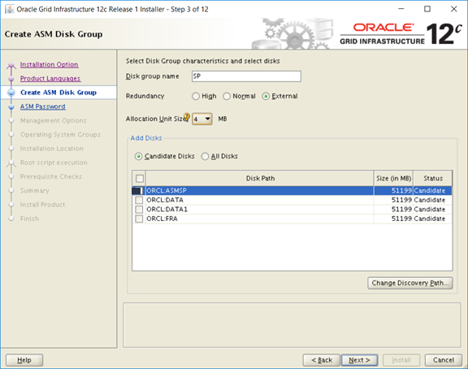

Select the option for the passwords and enter password/passwords, click next to continue
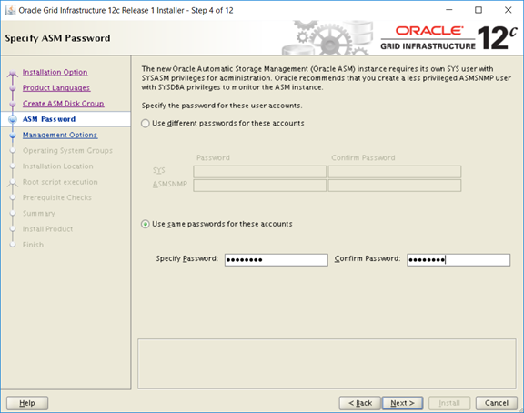

Register the Enterprise Manager (EM) Cloud Control (optional), click next to continue
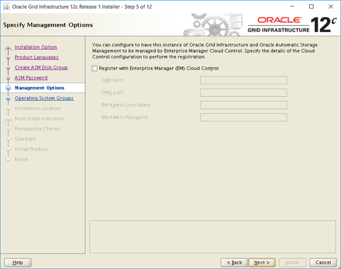

Use default setting, click next to continue


Use default setting, click next to continue

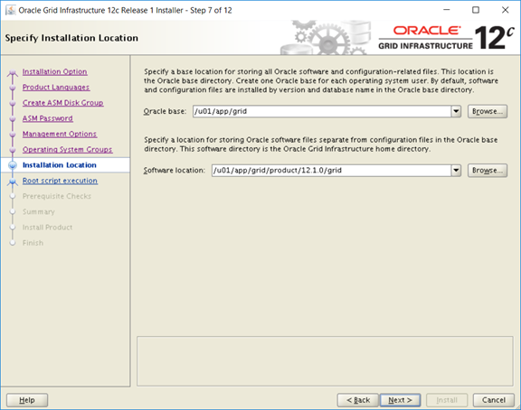

Enter the folder location, click next to continue

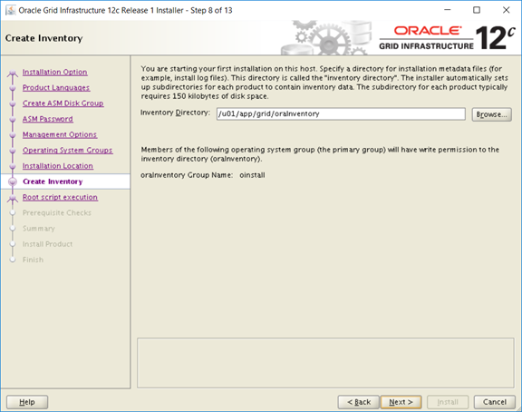

Check the box "Automatically run configuration scripts", enter password

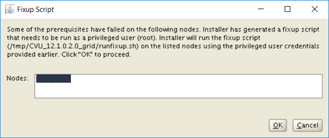

Perform Prerequisite checks, click the "Fix & Check Again" button
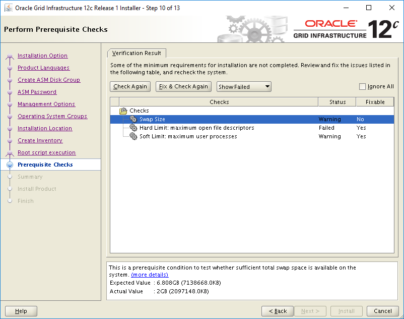

Click ok to continue
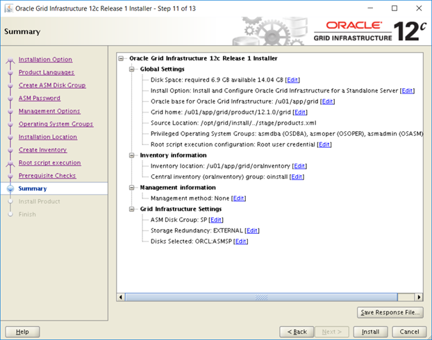

Screen showing summary of the install, click Install to continue


A dialog box shows up and click yes to continue


Click close to finished the installation


## Configure ASM

Start the ASM configuration Assistant

Log in as grid from your x11 session

```bash
$ cd /u01/app/grid/product/12.1.0/grid/bin
$ ./asmca
```
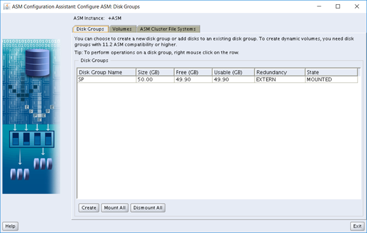

Click Create button, the click “Show advanced option”
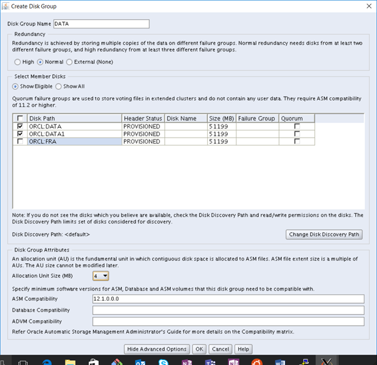

Enter the Disk Group Name, check the ORCL_DATA and ORCL_DATA1 boxes and change the Allocation Unit Size to 4, click OK to continue

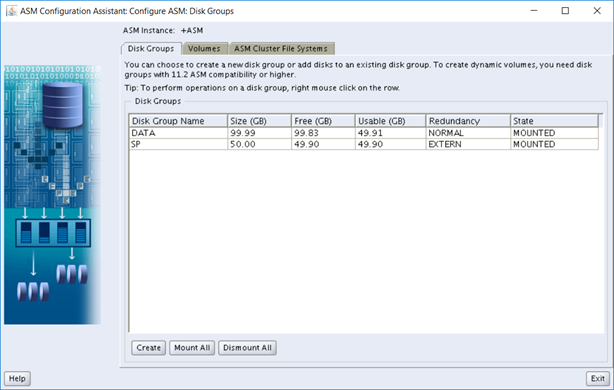

Click Create button, the click “Show advanced option”

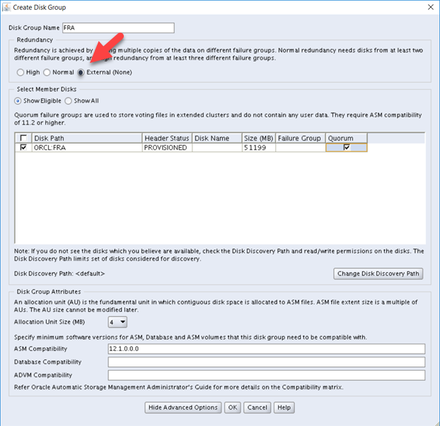

Enter the Disk Group Name, change setting from Normal to External, check the ORCL_FRA box and change the Allocation Unit Size to 4, click OK to continue

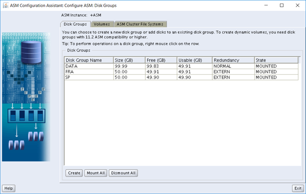
Click Exit button to exit

## Create Database

The Oracle software is already installed on the Marketplace image, so the next step is to install the database. the first step is running as the 'oracle' superuser and initialize the listener for logging:

```bash
$ su - oracle
Password:
$ cd /u01/app/oracle/product/12.1.0/dbhome_1/bin
$ ./dbca
```
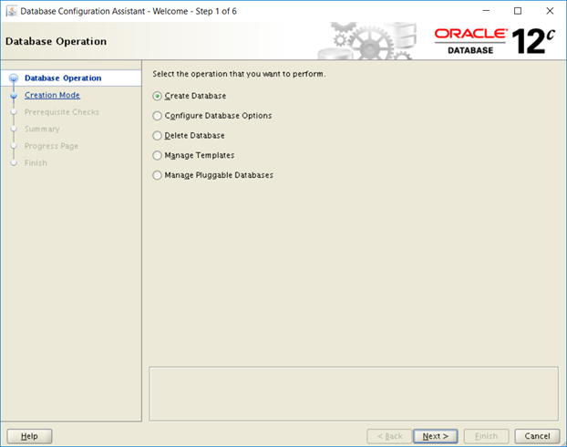

Select "Create Database", click next to continue

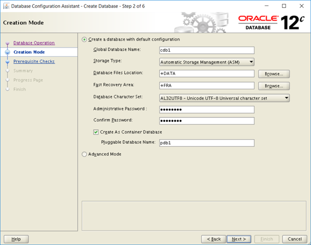

Enter the Database name and select Storage Type "Automatic Storage Management (ASM)

Select the Database Files Location and Fast Recovery Area

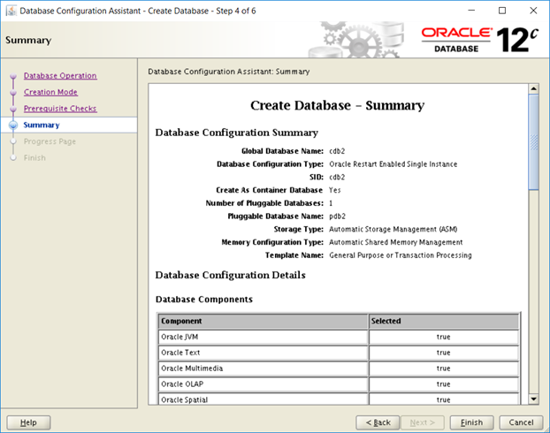

Review the summary, click "Finish" to begin installation.
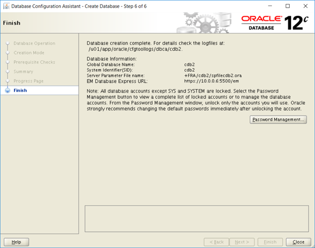
You may change the passwords (optional step)

This completes the installation and configuration of ASM on Oracle linux.

## Delete virtual machine

When no longer needed, the following command can be used to remove the Resource Group, VM, and all related resources.

```azurecli
az group delete --name myResourceGroup
```

## Next steps

[Create highly available virtual machines tutorial](../../linux/create-cli-complete.md)

[Explore VM deployment CLI samples](../../linux/cli-samples.md)
