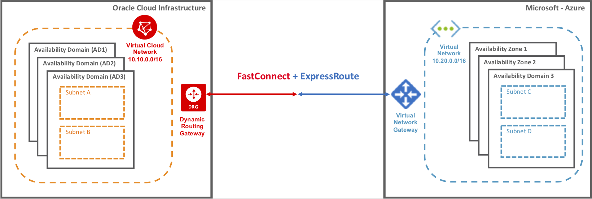
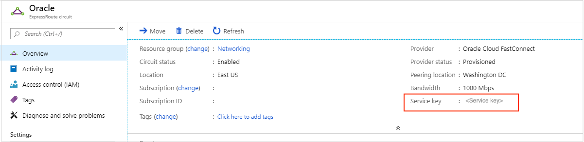
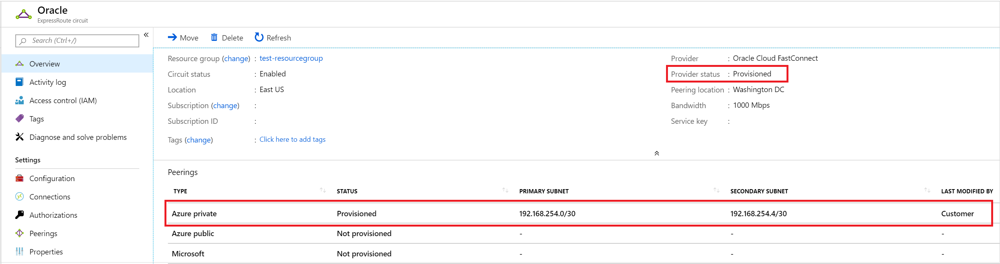
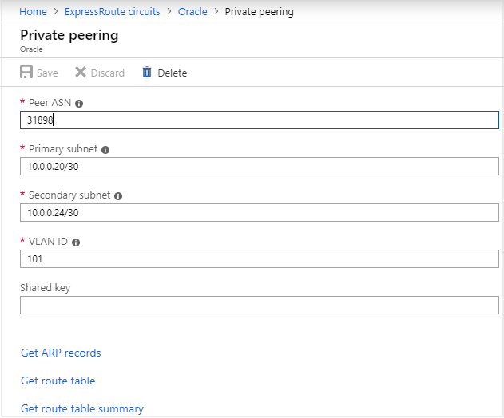

# Set up a direct interconnection between Azure and Oracle Cloud Infrastructure  

To create an [integrated multi-cloud experience](oracle-oci-overview.md), Microsoft and Oracle offer direct interconnection between Azure and Oracle Cloud Infrastructure (OCI) through [ExpressRoute](../../../expressroute/expressroute-introduction.md) and [FastConnect](https://docs.cloud.oracle.com/iaas/Content/Network/Concepts/fastconnectoverview.htm). Through the ExpressRoute and FastConnect interconnection, customers can experience low latency, high throughput, private direct connectivity between the two clouds.

> [!IMPORTANT]
> Oracle will certify these applications to run in Azure when using the Azure / Oracle Cloud interconnect solution by May 2020.
> * E-Business Suite
> * JD Edwards EnterpriseOne
> * PeopleSoft
> * Oracle Retail applications
> * Oracle Hyperion Financial Management

The following image shows a high-level overview of the interconnection:

## Prerequisites

* To establish connectivity between Azure and OCI, you must have an active Azure subscription and an active OCI tenancy.

* Connectivity is only possible where an Azure ExpressRoute peering location is in proximity to or in the same peering location as the OCI FastConnect. See [Region Availability](oracle-oci-overview.md#region-availability).

## Configure direct connectivity between ExpressRoute and FastConnect

1. Create a standard ExpressRoute circuit on your Azure subscription under a resource group. 
    * While creating the ExpressRoute, choose **Oracle Cloud FastConnect** as the service provider. To create an ExpressRoute circuit, see the [step-by-step guide](../../../expressroute/expressroute-howto-circuit-portal-resource-manager.md).
    * An Azure ExpressRoute circuit provides granular bandwidth options, whereas FastConnect supports 1, 2, 5, or 10 Gbps. Therefore, it is recommended to choose one of these matching bandwidth options under ExpressRoute.

    
1. Note down your ExpressRoute **Service key**. You need to provide the key while configuring your FastConnect circuit.

    

    > [!IMPORTANT]
    > You will be billed for ExpressRoute charges as soon as the ExpressRoute circuit is provisioned (even if the **Provider Status** is **Not Provisioned**).

1. Carve out two private IP address spaces of /30 each that do not overlap with your Azure virtual network or OCI virtual cloud network IP Address space. We will refer to the first IP address space as primary address space and the second IP address space as secondary address space. Note down the addresses, which you need when configuring your FastConnect circuit.
1. Create a Dynamic Routing Gateway (DRG). You will need this when creating your FastConnect circuit. For more information, see the [Dynamic Routing Gateway](https://docs.cloud.oracle.com/iaas/Content/Network/Tasks/managingDRGs.htm) documentation.
1. Create a FastConnect circuit under your Oracle tenant. For more information, see the [Oracle documentation](https://docs.cloud.oracle.com/iaas/Content/Network/Concepts/azure.htm).
  
    * Under FastConnect configuration, select **Microsoft Azure: ExpressRoute** as the provider.
    * Select the Dynamic Routing Gateway that you provisioned in the previous step.
    * Select the bandwidth to be provisioned. For optimal performance, the bandwidth must match the bandwidth selected when creating the ExpressRoute circuit.
    * In **Provider Service Key**, paste the ExpressRoute service key.
    * Use the first /30 private IP address space carved out in a previous step for the **Primary BGP IP Address** and the second /30 private IP address space for the **Secondary BGP IP** Address.
        * Assign the first useable address of the two ranges for the Oracle BGP IP Address (Primary and Secondary) and the second address to the customer BGP IP Address (from a FastConnect perspective). The first useable IP address is the second IP address in the /30 address space (the first IP address is reserved by Microsoft).
    * Click **Create**.
1. Complete linking the FastConnect to virtual cloud network under your Oracle tenant via Dynamic Routing Gateway, using Route Table.
1. Navigate to Azure and ensure that the **Provider Status** for your ExpressRoute circuit has changed to **Provisioned** and that a peering of type **Azure private** has been provisioned. This is a pre-requisite for the following steps.

    
1. Click on the **Azure private** peering. You will see the peering details have automatically been configured based on the information you entered when setting up your FastConnect circuit.

    

## Connect virtual network to ExpressRoute

1. Create a virtual network and virtual network gateway, if you haven't already. For details, see the [step-by-step guide](../../../expressroute/expressroute-howto-add-gateway-portal-resource-manager.md).
1. Set up the connection between the virtual network gateway and your ExpressRoute circuit by executing the [Terraform script](https://github.com/microsoft/azure-oracle/tree/master/InterConnect-2) or by executing the PowerShell command to [Configure ExpressRoute FastPath](../../../expressroute/expressroute-howto-linkvnet-arm.md#configure-expressroute-fastpath).

Once you have completed the network configuration, you can verify the validity of your configuration by clicking on **Get ARP Records** and **Get route table** under the ExpressRoute Private peering blade in the Azure portal.

## Automation

Microsoft has created Terraform scripts to enable automated deployment of the network interconnect. The Terraform scripts need to authenticate with Azure before execution, because they require adequate permissions on the Azure subscription. Authentication can be performed using an [Azure Active Directory service principal](../../../active-directory/develop/app-objects-and-service-principals.md#service-principal-object) or using the Azure CLI. For more information, see the [Terraform documentation](https://www.terraform.io/docs/providers/azurerm/auth/azure_cli.html).

The Terraform scripts and related documentation to deploy the inter-connect can be found in this [GitHub repository](https://aka.ms/azureociinterconnecttf).

## Monitoring

Installing agents on both the clouds, you can leverage Azure [Network Performance Monitor (NPM)](../../../expressroute/how-to-npm.md) to monitor the performance of the end-to-end network. NPM helps you to readily identify network issues, and helps eliminate them.

## Delete the interconnect link

To delete the interconnect, the following steps must be followed, in the specific order given. Failure to do so will result in a "failed state" ExpressRoute circuit.

1. Delete the ExpressRoute connection. Delete the connection by clicking the **Delete** icon on the page for your connection. For more information, see the [ExpressRoute documentation](../../../expressroute/expressroute-howto-linkvnet-portal-resource-manager.md#delete-a-connection-to-unlink-a-vnet).
1. Delete the Oracle FastConnect from the Oracle Cloud Console.
1. Once the Oracle FastConnect circuit has been deleted, you can delete the Azure ExpressRoute circuit.

At this point, the delete and deprovisioning process is complete.

## Next steps

* For more information about the cross-cloud connection between OCI and Azure, see the [Oracle documentation](https://docs.cloud.oracle.com/iaas/Content/Network/Concepts/azure.htm).
* Use [Terraform scripts](https://aka.ms/azureociinterconnecttf) to deploy infrastructure for targeted Oracle applications over Azure, and configure the network interconnect. 
