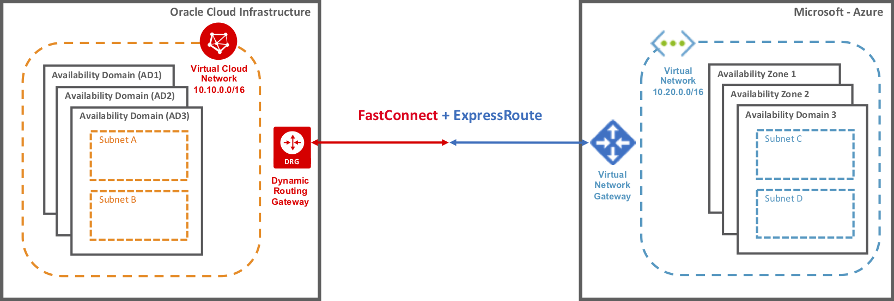

# Set up a cross-cloud network between Azure and Oracle Cloud Infrastructure  

This article describes how to configure the network interconnection between Oracle Cloud Infrastructure (OCI) and Microsoft Azure. To connect virtual networks in the two clouds, you connect an Azure ExpressRoute circuit to an OCI FastConnect circuit. Use this network as the foundation of your [cross-cloud Oracle application solution](oracle-oci-overview.md) (preview).
 
Peering the Azure and OCI virtual networks allows resources in the two virtual networks to communicate as if it they are in the same virtual network. This setup allows for secure, fast connectivity between the two clouds without the need for an intermediate service provider, which is generally needed for ExpressRoute and FastConnect circuits.

The following image shows a high-level overiew of the cross-cloud network:

> [!NOTE]
> * For some application scenarios, provisioning a separate ExpressRoute or FastConnect circuit is recommended to connect your on-premises network to Azure or OCI via a private connection. 
> 

## Terminology

Network concepts in Azure and OCI are similar, but different names might be used. The following table describes the terminology used in the two clouds.

| Component	| Azure	| Oracle |
|---|----|----|
| Virtual network |	virtual network | virtual cloud network |
| Direct private cloud connectivity | ExpressRoute private peering |FastConnect private virtual circuit |
| Gateway | VPN gateway	| dynamic routing gateway (DRG) |
| Security rules | network security groups (NSGs) | security lists |

## Prerequisites

* To establish connectivity between Azure and OCI, you must have an active Azure subscription and an active OCI tenancy.

* Connectivity is only possible where an Azure ExpressRoute peering location is in proximity to or in the same peering location as the OCI FastConnect. See [preview limitations](oracle-oci-overview.md#preview-limitations).

## Create virtual networks and gateways

To deploy a multi-cloud solution between OCI and Azure you must already have:

* An Azure virtual network with subnets and a VPN gateway. For sample steps, see the tutorial to [Create and manage a VPN gateway](../../../vpn-gateway/vpn-gateway-tutorial-create-gateway-powershell.md).

    * When provisioning a VPN gateway to connect your virtual network to an ExpressRoute circuit, you need to use the **UltraPerformance Gateway** SKU for high throughput. 
    * The gateway subnet that houses the gateway must have at least a /27 address space.

* An OCI virtual cloud network with subnets and an attached DRG. For instructions on how to set up your Oracle Cloud environment, see the [Oracle documentation](https://docs.cloud.oracle.com/iaas/Content/Network/Concepts/overview.htm). 

* No overlapping IP addresses between your OCI and Azure networks.

* Also carve out a private IP space of /29, which is non-overlapping to subnets in either your Azure virtual network or your OCI virtual cloud network. Careful planning must be done to ensure that the address space does not overlap. You will split the /29 IP space into two subnets of /30, which are used to set up the tunnel with OCI. 

## Enable network interconnection

You can enable the network interconnection by using the Azure portal and the OCI console. Below are the high-level steps to enable direct interconnection. For more details, see the [Oracle documentation](https://docs.cloud.oracle.com/iaas/Content/Network/Concepts/azure.htm).

1. Sign in to the [Azure portal](https://portal.azure.com).
1. Provision a standard-metered [Azure ExpressRoute](../../../expressroute/expressroute-howto-circuit-portal-resource-manager.md) circuit. 

    * In **Provider**, select **Oracle**.
    * In **Peering location**, select a peering location in close proximity to the OCI region that you are connecting to.
    * In **Bandwidth**, we recommend selecting a value also supported by FastConnect, currently 1, 2, 5, or 10 Gbps.
    * In **Location**, specify an Azure region that supports cross-cloud connectivity such as *East US*.
1. Once provisioned, view the properties of the circuit by selecting it. On the **Overview** page for your circuit, copy the **Service key** for your circuit.
1. Sign in to the OCI console.
1. Provision a [FastConnect private virtual circuit](https://docs.cloud.oracle.com/iaas/Content/Network/Concepts/fastconnectprovider.htm). 
    * Add **Microsoft Azure** as your provider.
    * In **Provider Service Key**, paste the ExpressRoute service key. 
    * Select the same geographic peering location that you selected while setting up the Azure ExpressRoute circuit.
    * Enter the primary BGP IP address space and the secondary BGP IP address space corresponding to the peering subnets entered on the Microsoft side. 
1. Create an [ExpressRoute peering](../../../expressroute/expressroute-howto-routing-portal-resource-manager.md) of type **Azure Private** and enter the primary and secondary /30 subnets. Similarly, on the OCI side, enter the primary BGP IP address space and the secondary BGP IP address space corresponding to the address space entered on the Microsoft side. 

After you complete these steps, within a few minutes, the private virtual circuit is provisioned automatically between the two clouds. 

## Verify the connection 

* For the ExpressRoute circuit, confirm that private peering is provisioned. View the status of a circuit by selecting it and viewing the Overview page in the Azure portal.

* For the FastConnect virtual circuit, confirm that its status is UP in the OCI console.

## Next steps

See the [Oracle documentation](https://docs.cloud.oracle.com/iaas/Content/Network/Concepts/azure.htm) for more information about creating and managing a cross-cloud connection between OCI and Azure.

 
