# Set up Oracle ASM on an Azure Linux virtual machine  

In this article, learn how to install and set up Oracle Automatic Storage Management (Oracle ASM) on an Oracle Linux virtual machine (VM) in Azure.

Before you begin, make sure that Azure CLI is installed. For more information, see [the Azure CLI installation guide](https://docs.microsoft.com/cli/azure/install-azure-cli).

## Prepare the environment

### Sign in to Azure 

In Azure CLI, to sign in to your Azure subscription, use the [az login](/cli/azure/#login) command. Then, follow the on-screen instructions.

```azurecli
az login
```

### Create a resource group

To create a resource group, use the [az group create](/cli/azure/group#create) command. An Azure resource group is a logical container in which Azure resources are deployed and managed. 

The following example creates a resource group named myResourceGroup in the westus location.

```azurecli
az group create --name myResourceGroup --location westus
```

### Create a VM

To create a VM to use with Oracle ASM, complete the following steps:

1. To create a virtual machine, use the [az vm create](/cli/azure/vm#create) command. 

   The following example creates a VM named myVM. It also creates SSH keys, if they do not already exist in a default key location. To use a specific set of keys, use the `--ssh-key-value` option.  

   ```azurecli
   az vm create --resource-group myResourceGroup --name myVM --image Oracle:Oracle-Database-Ee:12.1.0.2:latest --size Standard_DS2_v2 --generate-ssh-keys
   ```

   After you create the VM, Azure CLI displays information similar to the following example. Note the value for `publicIpAddress`. You use this address to access the VM.

   ```azurecli
   {
     "fqdns": "",
     "id": "/subscriptions/00000000-0000-0000-0000-000000000000/resourceGroups/myResourceGroup/providers/Microsoft.Compute/virtualMachines/myVM",
     "location": "westus",
     "macAddress": "00-0D-3A-36-2F-56",
     "powerState": "VM running",
     "privateIpAddress": "10.0.0.4",
     "publicIpAddress": "13.64.104.241",
     "resourceGroup": "myResourceGroup"
   }
   ```

2. Add disks to use for your Oracle ASM configuration:

   ```azurecli
   az vm disk attach -g myResourceGroup --vm-name myVM --disk myDataDisk --new --size-gb 50
   az vm disk attach -g myResourceGroup --vm-name myVM --disk myDataDisk2 --new --size-gb 50
   az vm disk attach -g myResourceGroup --vm-name myVM --disk myDataDisk3 --new --size-gb 50
   az vm disk attach -g myResourceGroup --vm-name myVM  --disk myDataDisk4 --new --size-gb 50
   ```

### Connect to the VM

To create an SSH session with the VM, use the following command. Replace the IP address with the `publicIpAddress` value for your VM.

```bash 
ssh <publicIpAddress>
```

## Install Oracle ASM

To install Oracle ASM, complete the following steps. 

For more information about installing Oracle ASM, see [Oracle ASMLib Downloads for Oracle Linux 6](http://www.oracle.com/technetwork/server-storage/linux/asmlib/ol6-1709075.html).  

1. Run `yum list`:

   ```bash
   $ sudo su -
   # yum list
   ```
   It might take several minutes for `yum list` to load the first time you run it.

2. Run these additional commands:

   ```bash
   # yum list | grep oracleasm
   # yum -y install kmod-oracleasm.x86_64
   # yum -y install oracleasm-support.x86_64
   # wget http://download.oracle.com/otn_software/asmlib/oracleasmlib-2.0.12-1.el6.x86_64.rpm
   # yum -y install oracleasmlib-2.0.12-1.el6.x86_64.rpm
   # rm -f oracleasmlib-2.0.12-1.el6.x86_64.rpm
   ```

3. Verify that Oracle ASM is installed:

   ```bash
   # rpm -qa |grep oracleasm
   oracleasm-support-2.1.10-4.el6.x86_64
   kmod-oracleasm-2.0.8-15.el6_9.x86_64
   oracleasmlib-2.0.12-1.el6.x86_64
   ```

4. Add users and groups:

   ```bash
   # groupadd -g 54345 asmadmin
   # groupadd -g 54346 asmdba
   # groupadd -g 54347 asmoper
   # useradd -u 3000 -g oinstall -G dba,asmadmin,asmdba,asmoper grid
   # usermod -g oinstall -G dba,asmdba,asmadmin oracle
   ```

5. Verify users and groups:

   ```bash
   # id grid
   uid=3000(grid) gid=54321(oinstall) groups=54321(oinstall),54322(dba),54345(asmadmin),54346(asmdba),54347(asmoper)
   ```

6. Create a folder and change the owner:

   ```bash
   # mkdir /u01/app/grid
   # chown grid:oinstall /u01/app/grid
   ```

## Set up Oracle ASM

For this tutorial, the default user is *grid* and the default group is *asmadmin*. Ensure that the *oracle* user is part of the asmadmin group. To set up your Oracle ASM installation, complete the following steps:

1. Set the Oracle ASM library driver:

   ```bash
   # /usr/sbin/oracleasm configure -i

   Configuring the Oracle ASM library driver.

   This will configure the on-boot properties of the Oracle ASM library
   driver. The following questions will determine whether the driver is
   loaded on boot and what permissions it will have. The current values
   will be shown in brackets ('[]'). Hitting <ENTER> without typing an
   answer will keep that current value. Ctrl-C will abort.

   Default user to own the driver interface []: grid
   Default group to own the driver interface []: asmadmin
   Start Oracle ASM library driver on boot (y/n) [n]: y
   Scan for Oracle ASM disks on boot (y/n) [y]: y
   Writing Oracle ASM library driver configuration: done
   ```

2. View the disk configuration:
   ```bash
   # cat /proc/partitions
   ```

3. Format the disk:

   ```bash
   # fdisk /dev/sdc
   Device contains not a valid DOS partition table, or Sun, SGI or OSF disklabel
   Building a new DOS disklabel with disk identifier 0xf865c6ca.
   Changes will remain in memory only, until you decide to write them.
   After that, of course, the previous content won't be recoverable.

   Warning: invalid flag 0x0000 of partition table 4 will be corrected by w(rite)

   The device presents a logical sector size that is smaller than
   the physical sector size. Aligning to a physical sector (or optimal
   I/O) size boundary is recommended, or performance may be impacted.

   WARNING: DOS-compatible mode is deprecated. It's strongly recommended to
           switch off the mode (command 'c') and change display units to
           sectors (command 'u').

   Command (m for help): n
   Command action
     e   extended
     p   primary partition (1-4)
   p
   Partition number (1-4): 1
   First cylinder (1-6527, default 1):
   Using default value 1
   Last cylinder, +cylinders or +size{K,M,G} (1-6527, default 6527):
   Using default value 6527

   Command (m for help): w
   The partition table has been altered!

   Calling ioctl() to re-read partition table.
   Syncing disks.
   ```

4. Repeat the preceding step for /dev/sdd, /dev/sde, and /dev/sdf.

5. Check the disk configuration:

   ```bash
   # cat /proc/partitions
   major minor  #blocks  name

     8       16   14680064 sdb
     8       17   14678976 sdb1
     8       32   52428800 sdc
     8       33   52428096 sdc1
     8       48   52428800 sdd
     8       49   52428096 sdd1
     8       64   52428800 sde
     8       65   52428096 sde1
     8       80   52428800 sdf
     8       81   52428096 sdf1
     8        0   52428800 sda
     8        1     512000 sda1
     8        2   51915776 sda2
     11        0    1048575 sr0
   ```

6. Check the Oracle ASM service status:

   ```bash
   # service oracleasm status
   Checking if ASM is loaded: no
   Checking if /dev/oracleasm is mounted: no
   ```

7. Start the Oracle ASM service:

   ```bash
   # service oracleasm start
   Initializing the Oracle ASMLib driver:                     [  OK  ]
   Scanning the system for Oracle ASMLib disks:               [  OK  ]
   ```

8. Create Oracle ASM disks:

   ```bash
   # service oracleasm createdisk ASMSP /dev/sdc1
   Marking disk "ASMSP" as an ASM disk:                       [  OK  ]

   # service oracleasm createdisk DATA /dev/sdd1
   Marking disk "DATA" as an ASM disk:                        [  OK  ]

   # service oracleasm createdisk DATA1 /dev/sde1
   Marking disk "DATA1" as an ASM disk:                       [  OK  ]

   # service oracleasm createdisk FRA /dev/sdf1
   Marking disk "FRA" as an ASM disk:                         [  OK  ]
   ```

9. List Oracle ASM disks:

   ```bash
   # service oracleasm listdisks
   ASMSP
   DATA
   DATA1
   FRA
   ```

10. Change the passwords for the root, oracle, and grid users. (You use the passwords later, during installation.)

    ```bash
    # passwd oracle
    # passwd grid
    # passwd root
    ```

11. Change the folder permission:

    ```bash
    # chmod -R 775 /opt
    # chown grid:oinstall /opt
    # chown oracle:oinstall /dev/sdc1
    # chown oracle:oinstall /dev/sdd1
    # chown oracle:oinstall /dev/sde1
    # chown oracle:oinstall /dev/sdf1
    # chmod 600 /dev/sdc1
    # chmod 600 /dev/sdd1
    # chmod 600 /dev/sde1
    # chmod 600 /dev/sdf1
    ```

## Download and prepare Oracle Grid Infrastructure

To download and prepare the Oracle Grid Infrastructure software, complete the following steps:

1. Download Oracle Grid Infrastructure from the [Oracle ASM download page](http://www.oracle.com/technetwork/database/enterprise-edition/downloads/database12c-linux-download-2240591.html). 

   Under the download titled **Oracle Database 12c Release 1 Grid Infrastructure (12.1.0.2.0) for Linux x86-64**, download the two .zip files.

2. After you download the .zip files to your client computer, you can use Secure Copy Protocol (SCP) to copy the files to your VM.

   ```bash
   scp *.zip <publicIpAddress>:<folder>
   ```

3. Move the .zip files to the /opt folder. Then, change the owner of the files:

   ```bash
   # mv <folder>/*.zip /opt
   # cd /opt
   # chown grid:oinstall linuxamd64_12102_grid_1of2.zip
   # chown grid:oinstall linuxamd64_12102_grid_2of2.zip
   ```
4. Unzip the files. (Install the Linux unzip tool if it's not already installed.)
   ```bash
   # yum install unzip
   # unzip linuxamd64_12102_grid_1of2.zip
   # unzip linuxamd64_12102_grid_2of2.zip
   ```
5. Change permission:
   ```bash
   # chown -R grid:oinstall /opt/grid
   ```
6. Turn off the firewall:
   ```bash
   # service iptables status
   # service iptables stop
   ```

7. Check available swap space. You need at least 6.8 GB of swap space to install Grid. Linux Azure VMs don't have swap enabled and configured by default.

We highly recommend that you use waagent to configure swap space so that it's always created on the ephemeral disk (temporary disk). For more information, see [How to add a swap file in Linux Azure virtual machines](https://support.microsoft.com/en-us/help/4010058/how-to-add-a-swap-file-in-linux-azure-virtual-machines).

## Prepare the client and VM to run x11 (for Windows clients only)
This is an optional step. You can skip this step if you are using a Linux client or already have x11 set up.

1. [Download PuTTY](http://www.putty.org/) and [download Xming](https://xming.en.softonic.com/) to your Windows computer.

2. After you install PuTTY, in the PuTTY folder (for example, C:\Program Files\PuTTY), run puttygen.exe (PuTTY Key Generator).

3. In PuTTY Key Generator:
   
   1. Generate a key by selecting the **Generate** button.
   2. Copy the contents of the key (Ctrl+C).
   3. Select the **Save private key** button.
   4. Ignore the warning that appears, and then select **OK**.

   

4. In your VM, run these commands:

   ```bash
   # sudo su - grid
   $ mkdir .ssh (if not already created)
   $ cd .ssh
   ```

5. Create a file named authorized_keys. Paste the contents of the key in this file, and then save the file.

   > [!NOTE]
   > The key must contain the string `ssh-rsa`. Also, the contents of the key must be a single line of text.
   >  

6. Start PuTTY. In the **Category** pane, go to **Connection** > **SSH** > **Auth**. In the **Private key file for authentication** box, browse to the key that you generated earlier.

   

7. In the **Category** pane, go to **Connection** > **SSH** > **X11**. Select the **Enable X11 forwarding** check box.

   

8. In the **Category** pane, go to **Session**. Enter the host information, and then select **Open**.

   

## Install Oracle Grid Infrastructure

To install Oracle Grid Infrastructure, complete the following steps:

1. Sign in as grid. (You should be able to sign in without being prompted for a password.) 

   > [!NOTE]
   > Make sure that Xming is running before you begin the installation.

   ```bash
   $ cd /opt/grid
   $ ./runInstaller
   ```

   Oracle Grid Infrastructure 12c Release 1 Installer opens. (It might take a few minutes for the  installer to start.)

2. On the **Select Installation Option** page, select **Install and Configure Oracle Grid Infrastructure for a Standalone Server**.

   

3. On the **Select Product Languages** page, select **English** or the language that you want.

   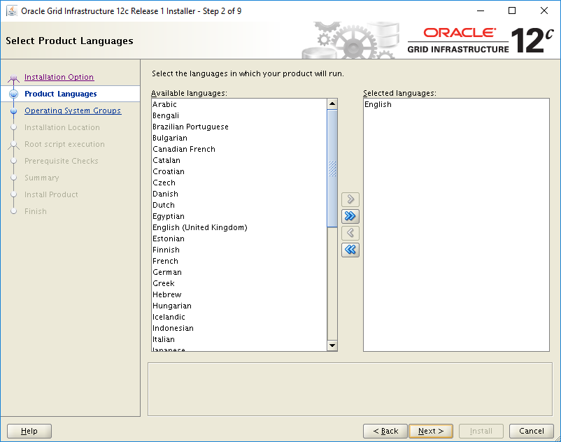

4. On the **Create ASM Disk Group** page:
   - Enter a name for the disk group.
   - Under **Redundancy**, select **External**.
   - Under **Allocation Unit Size**, select **4**.
   - Under **Add Disks**, select **ORCLASMSP**.

   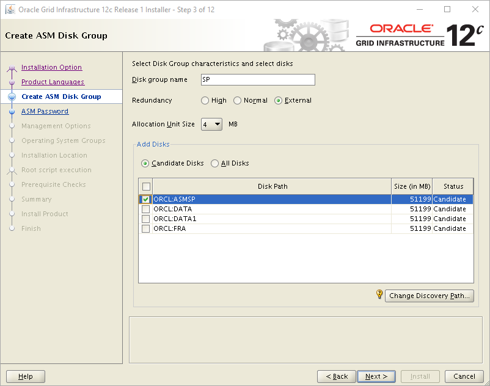

5. On the **Specify ASM Password** page, select the **Use same passwords for these accounts** option, and enter a password.

   

6. (Optional:) On the **Specify Management Options** page, select the **Register with Enterprise Manager (EM) Cloud Control** check box.

   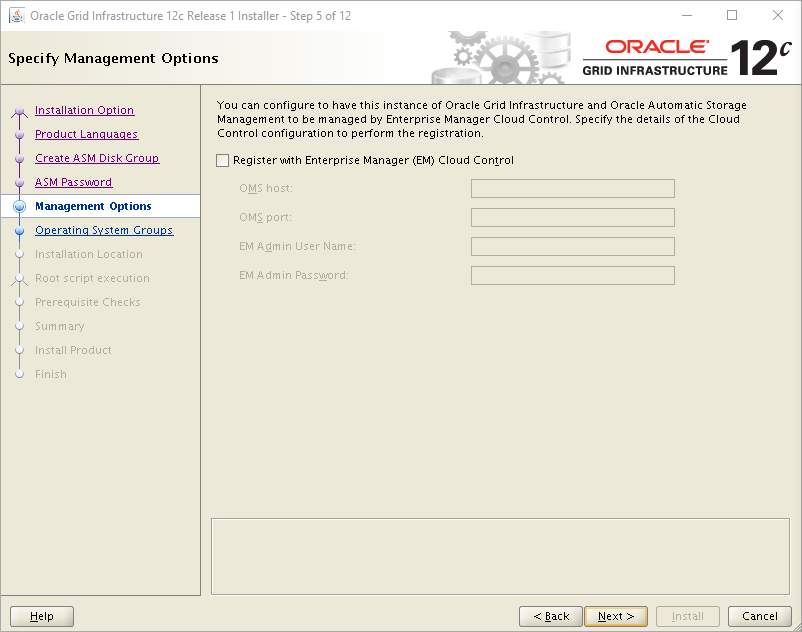

7. On the **Privileged Operating System Groups** page, use the default settings.

   

8. On the **Specify Installation Location** page, use the default settings.

   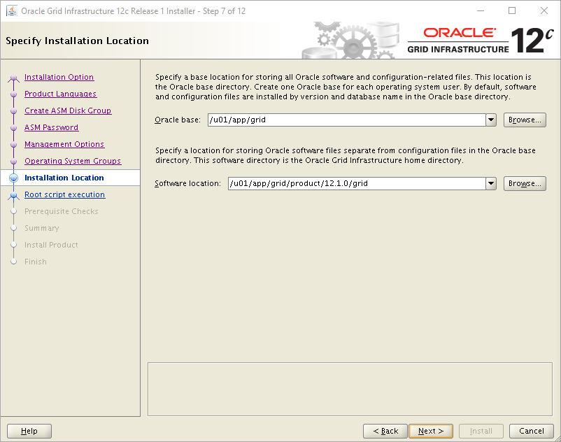

9. On the **Create Inventory** page, enter or browse to the folder location.

   

10. On the **Root script execution configuration** page, select the **Automatically run configuration scripts** check box. Then, select the **Use "root" user credential** option, and enter the root user password.

    

11. On the **Perform Prerequisite Checks** page, select **Fix & Check Again**.

    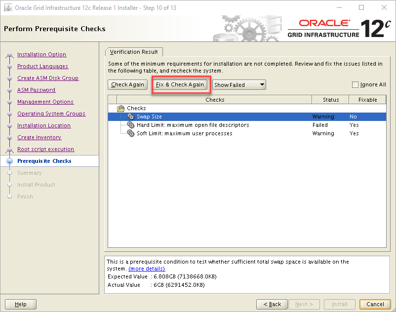

12. In the **Fixup Script** dilag box, select **OK**.

    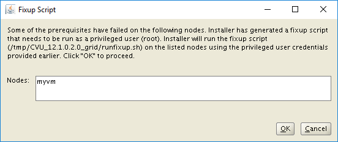

13. On the **Summary** page, review your selected settings, and then select **Install**.

    

14. A warning dialog box appears. Select **Yes** to continue.

    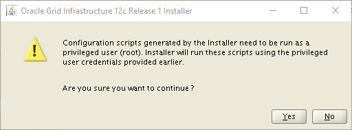

15. On the **Finish** page, select **Close** to finish the installation.

    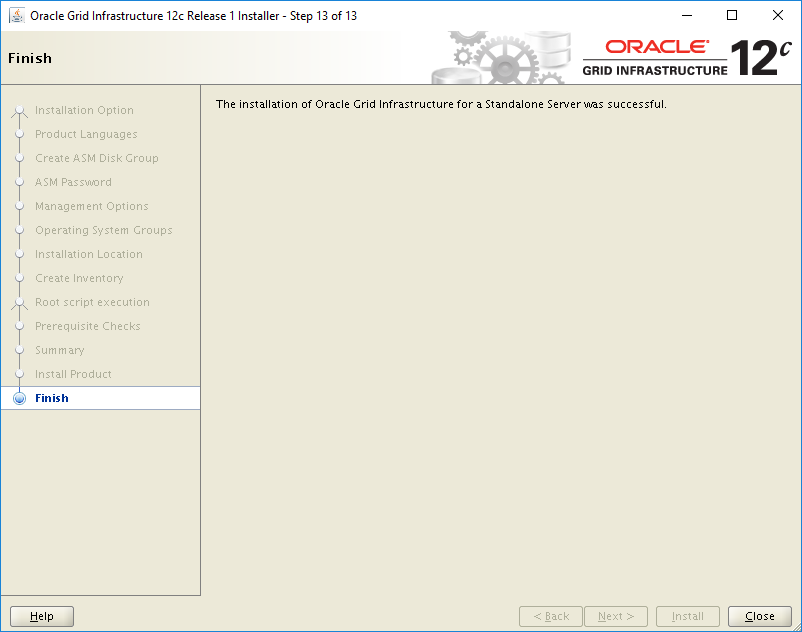

## Set up your Oracle ASM installation

To set up your Oracle ASM installation, complete the following steps:

1. Sign in as grid, from your X11 session:

   ```bash
   $ cd /u01/app/grid/product/12.1.0/grid/bin
   $ ./asmca
   ```

   Oracle ASM Configuration Assistant opens.

2. In the **Configure ASM: Disk Groups** dialog box, select the **Create** button, and then select **Show Advanced Options**.

   

3. In the **Create Disk Group** dialog box:

   - Enter the disk group name.
   - Under **Select Member Disks**, select **ORCL_DATA** and **ORCL_DATA1**.
   - Under **Allocation Unit Size**, select **4**.

   

4. In the **Configure ASM: Disk Groups** dialog box, select the **Create** button, and then select **Show Advanced Options**.

   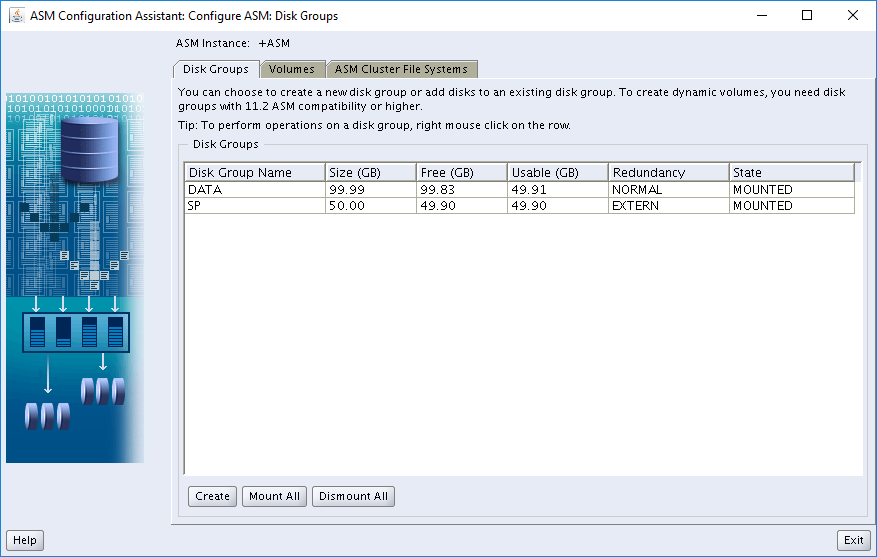

5. In the **Create Disk Group** dialog box:

   - Enter the disk group name.
   - Under **Redundancy**, select **External**.
   - Under **Select Member Disks**, select **ORCL_FRA**.
   - Under **Allocation Unit Size**, select **4**.

   

6. Select **Exit** to close ASM Configuration Assistant.

   

## Create the database

The Oracle software is already installed on the Azure Marketplace image. To install the database, complete the following steps:

1. Switch users to the Oracle superuser, and then initialize the listener for logging:

   ```bash
   $ su - oracle
   Password:
   $ cd /u01/app/oracle/product/12.1.0/dbhome_1/bin
   $ ./dbca
    ```
   Database Configuration Assistant opens.

2. On the **Database Operation** page, select **Create Database**.

   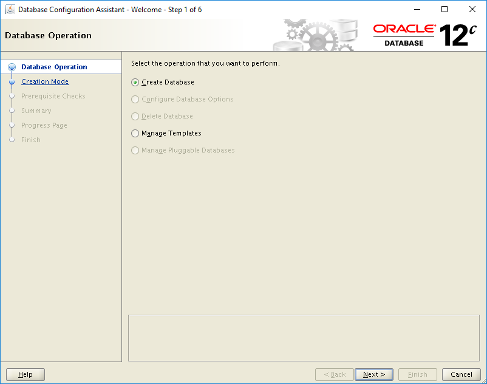
  
3. On the **Creation Mode** page:

   - Enter a name for the database.
   - For **Storage Type**, select **Automatic Storage Management (ASM)**.
   - For **Database Files Location**, browse to the folder that you want to use.
   - For **Fast Recovery Area**, browse to the folder that you want to use.

   

4. On the **Summary** page, review your selected settings, and then select **Finish** to create the database.

   

5. (Optional:) On the **Finish** page, to change the passwords, select **Password Management**.

   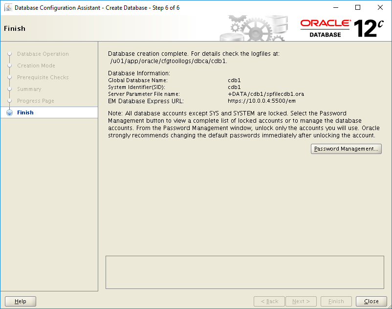


## Delete the VM

When you no longer need the VM, you can use the following command to remove the resource group, VM, and all related resources:

```azurecli
az group delete --name myResourceGroup
```

## Next steps

[Tutorial: Create highly available virtual machines](../../linux/create-cli-complete.md)

[Explore VM deployment Azure CLI samples](../../linux/cli-samples.md)
