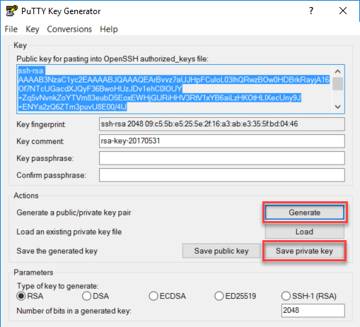
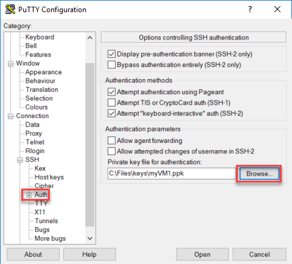
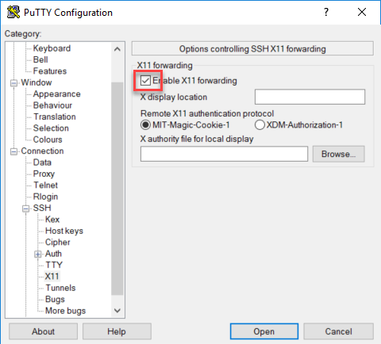
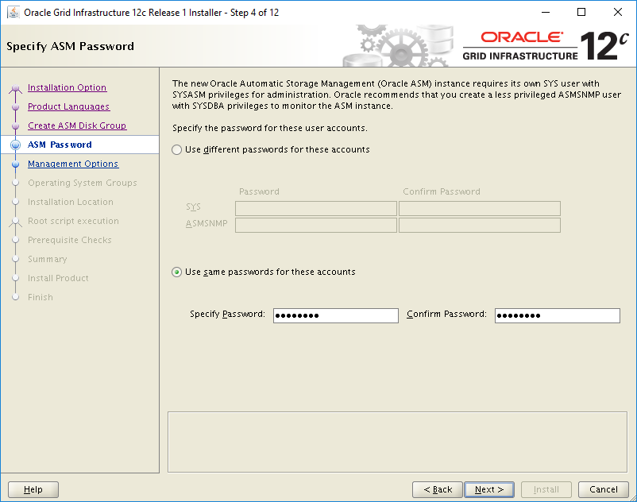
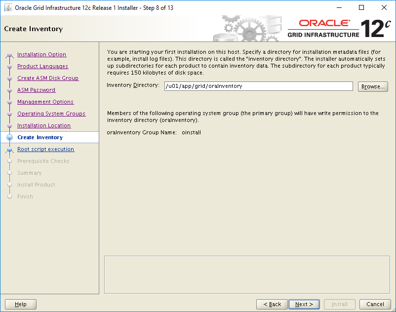
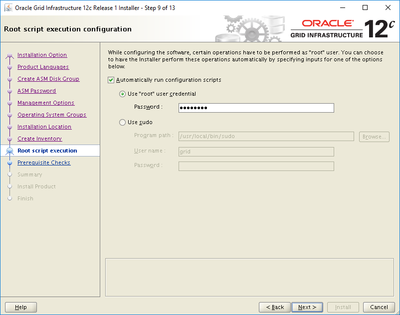
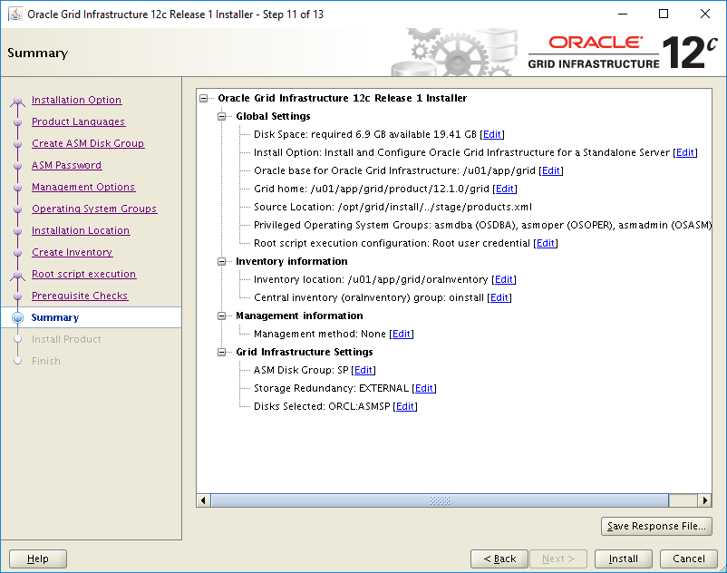
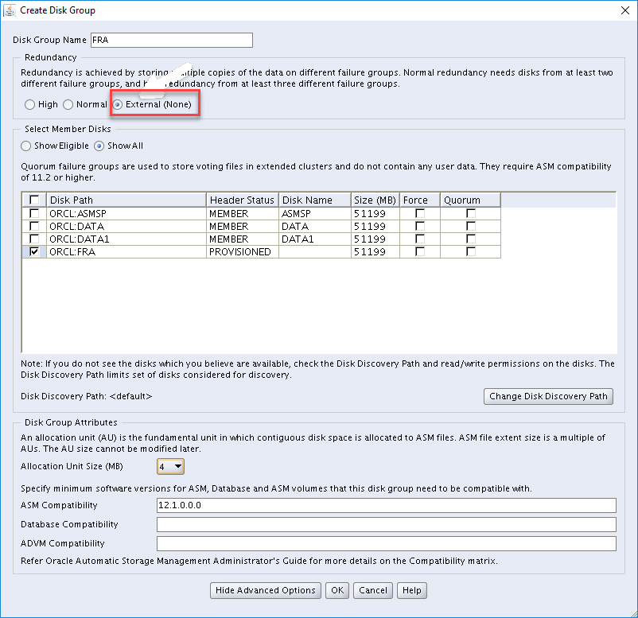
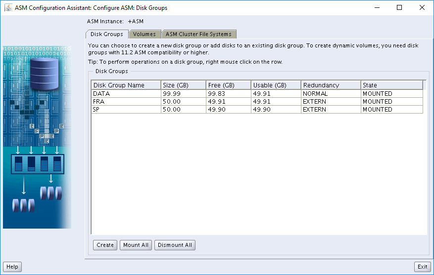

# Set up Oracle ASM on an Azure Linux virtual machine  

Azure virtual machines provide a fully configurable and flexible computing environment. This tutorial covers basic Azure virtual machine deployment combined with the installation and configuration of Oracle Automated Storage Management (ASM).  You learn how to:

> [!div class="checklist"]
> * Create and connect to an Oracle Database VM
> * Install and configure Oracle Automated Storage Management
> * Install and configure Oracle Grid infrastructure
> * Initialize an Oracle ASM installation
> * Create an Oracle DB managed by ASM


If you choose to install and use the CLI locally, this tutorial requires that you are running the Azure CLI version 2.0.4 or later. Run `az --version` to find the version. If you need to install or upgrade, see [Install Azure CLI]( /cli/azure/install-azure-cli). 

## Prepare the environment

### Create a resource group

To create a resource group, use the [az group create](/cli/azure/group) command. An Azure resource group is a logical container in which Azure resources are deployed and managed. In this example, a resource group named *myResourceGroup* in the *eastus* region.

```azurecli-interactive
az group create --name myResourceGroup --location eastus
```

### Create a VM

To create a virtual machine based on the Oracle Database image and configure it to use Oracle ASM, use the [az vm create](/cli/azure/vm) command. 

The following example creates a VM named myVM that is a Standard_DS2_v2 size with four attached data disks of 50 GB each. If they do not already exist in the default key location, it also creates SSH keys.  To use a specific set of keys, use the `--ssh-key-value` option.  

   ```azurecli-interactive
   az vm create --resource-group myResourceGroup \
    --name myVM \
    --image Oracle:Oracle-Database-Ee:12.1.0.2:latest \
    --size Standard_DS2_v2 \
    --generate-ssh-keys \
    --data-disk-sizes-gb 50 50 50 50
   ```

After you create the VM, Azure CLI displays information similar to the following example. Note the value for `publicIpAddress`. You use this address to access the VM.

   ```output
   {
     "fqdns": "",
     "id": "/subscriptions/00000000-0000-0000-0000-000000000000/resourceGroups/myResourceGroup/providers/Microsoft.Compute/virtualMachines/myVM",
     "location": "eastus",
     "macAddress": "00-0D-3A-36-2F-56",
     "powerState": "VM running",
     "privateIpAddress": "10.0.0.4",
     "publicIpAddress": "13.64.104.241",
     "resourceGroup": "myResourceGroup"
   }
   ```

### Connect to the VM

To create an SSH session with the VM and configure additional settings, use the following command. Replace the IP address with the `publicIpAddress` value for your VM.

```bash
ssh <publicIpAddress>
```

## Install Oracle ASM

To install Oracle ASM, complete the following steps. 

For more information about installing Oracle ASM, see [Oracle ASMLib Downloads for Oracle Linux 6](https://www.oracle.com/technetwork/server-storage/linux/asmlib/ol6-1709075.html).  

1. You need to login as root in order to continue with ASM installation:

   ```bash
   sudo su -
   ```
   
2. Run these additional commands to install Oracle ASM components:

   ```bash
    yum list | grep oracleasm 
    yum -y install kmod-oracleasm.x86_64 
    yum -y install oracleasm-support.x86_64 
    wget https://download.oracle.com/otn_software/asmlib/oracleasmlib-2.0.12-1.el6.x86_64.rpm 
    yum -y install oracleasmlib-2.0.12-1.el6.x86_64.rpm 
    rm -f oracleasmlib-2.0.12-1.el6.x86_64.rpm
   ```

3. Verify that Oracle ASM is installed:

   ```bash
   rpm -qa |grep oracleasm
   ```

    The output of this command should list the following components:

    ```bash
   oracleasm-support-2.1.10-4.el6.x86_64
   kmod-oracleasm-2.0.8-15.el6_9.x86_64
   oracleasmlib-2.0.12-1.el6.x86_64
    ```

4. ASM requires specific users and roles in order to function correctly. The following commands create the pre-requisite user accounts and groups: 

   ```bash
    groupadd -g 54345 asmadmin 
    groupadd -g 54346 asmdba 
    groupadd -g 54347 asmoper 
    useradd -u 3000 -g oinstall -G dba,asmadmin,asmdba,asmoper grid 
    usermod -g oinstall -G dba,asmdba,asmadmin oracle
   ```

5. Verify users and groups were created correctly:

   ```bash
   id grid
   ```

    The output of this command should list the following users and groups:

    ```bash
    uid=3000(grid) gid=54321(oinstall) groups=54321(oinstall),54322(dba),54345(asmadmin),54346(asmdba),54347(asmoper)
    ```
 
6. Create a folder for user *grid* and change the owner:

   ```bash
   mkdir /u01/app/grid 
   chown grid:oinstall /u01/app/grid
   ```

## Set up Oracle ASM

For this tutorial, the default user is *grid* and the default group is *asmadmin*. Ensure that the *oracle* user is part of the asmadmin group. To set up your Oracle ASM installation, complete the following steps:

1. Setting up the Oracle ASM library driver involves defining the default user (grid) and default group (asmadmin) as well as configuring the drive to start on boot (choose y) and to scan for disks on boot (choose y). You need to answer the prompts from the following command:

   ```bash
   /usr/sbin/oracleasm configure -i
   ```

   The output of this command should look similar to the following, stopping with prompts to be answered.

    ```output
   Configuring the Oracle ASM library driver.

   This will configure the on-boot properties of the Oracle ASM library
   driver. The following questions will determine whether the driver is
   loaded on boot and what permissions it will have. The current values
   will be shown in brackets ('[]'). Hitting <ENTER> without typing an
   answer will keep that current value. Ctrl-C will abort.

   Default user to own the driver interface []: grid
   Default group to own the driver interface []: asmadmin
   Start Oracle ASM library driver on boot (y/n) [n]: y
   Scan for Oracle ASM disks on boot (y/n) [y]: y
   Writing Oracle ASM library driver configuration: done
   ```

2. View the disk configuration:

   ```bash
   cat /proc/partitions
   ```

   The output of this command should look similar to the following listing of available disks

   ```output
   8       16   14680064 sdb
   8       17   14678976 sdb1
   8        0   52428800 sda
   8        1     512000 sda1
   8        2   51915776 sda2
   8       48   52428800 sdd
   8       64   52428800 sde
   8       80   52428800 sdf
   8       32   52428800 sdc
   11       0       1152 sr0
   ```

3. Format disk */dev/sdc* by running the following command and answering the prompts with:
   - *n* for new partition
   - *p* for primary partition
   - *1* to select the first partition
   - press `enter` for the default first cylinder
   - press `enter` for the default last cylinder
   - press *w* to write the changes to the partition table  

   ```bash
   fdisk /dev/sdc
   ```
   
   Using the answers provided above, the output for the `fdisk` command should look like the following:

   ```output
   Device contains not a valid DOS partition table, or Sun, SGI or OSF disklabel
   Building a new DOS disklabel with disk identifier 0xf865c6ca.
   Changes will remain in memory only, until you decide to write them.
   After that, of course, the previous content won't be recoverable.

   Warning: invalid flag 0x0000 of partition table 4 will be corrected by w(rite)

   The device presents a logical sector size that is smaller than
   the physical sector size. Aligning to a physical sector (or optimal
   I/O) size boundary is recommended, or performance may be impacted.

   WARNING: DOS-compatible mode is deprecated. It's strongly recommended to
           switch off the mode (command 'c') and change display units to
           sectors (command 'u').

   Command (m for help): n
   Command action
     e   extended
     p   primary partition (1-4)
   p
   Partition number (1-4): 1
   First cylinder (1-6527, default 1):
   Using default value 1
   Last cylinder, +cylinders or +size{K,M,G} (1-6527, default 6527):
   Using default value 6527

   Command (m for help): w
   The partition table has been altered!

   Calling ioctl() to re-read partition table.
   Syncing disks.
   ```

4. Repeat the preceding `fdisk` command for `/dev/sdd`, `/dev/sde`, and `/dev/sdf`.

5. Check the disk configuration:

   ```bash
   cat /proc/partitions
   ```

   The output of the command should look like the following:

   ```output
   major minor  #blocks  name

     8       16   14680064 sdb
     8       17   14678976 sdb1
     8       32   52428800 sdc
     8       33   52428096 sdc1
     8       48   52428800 sdd
     8       49   52428096 sdd1
     8       64   52428800 sde
     8       65   52428096 sde1
     8       80   52428800 sdf
     8       81   52428096 sdf1
     8        0   52428800 sda
     8        1     512000 sda1
     8        2   51915776 sda2
     11       0    1048575 sr0
   ```

6. Check the Oracle ASM service status and start the Oracle ASM service:

   ```bash
   service oracleasm status 
   service oracleasm start
   ```

   The output of the command should look like the following:

   ```output
   Checking if ASM is loaded: no
   Checking if /dev/oracleasm is mounted: no
   Initializing the Oracle ASMLib driver:                     [  OK  ]
   Scanning the system for Oracle ASMLib disks:               [  OK  ]
   ```

7. Create Oracle ASM disks:

   ```bash
   service oracleasm createdisk ASMSP /dev/sdc1 
   service oracleasm createdisk DATA /dev/sdd1 
   service oracleasm createdisk DATA1 /dev/sde1 
   service oracleasm createdisk FRA /dev/sdf1
   ```

   The output of the command should look like the following:

   ```output
   Marking disk "ASMSP" as an ASM disk:                       [  OK  ]
   Marking disk "DATA" as an ASM disk:                        [  OK  ]
   Marking disk "DATA1" as an ASM disk:                       [  OK  ]
   Marking disk "FRA" as an ASM disk:                         [  OK  ]
   ```

8. List Oracle ASM disks:

   ```bash
   service oracleasm listdisks
   ```

   The output of the command should list off the following Oracle ASM disks:

   ```output
    ASMSP
    DATA
    DATA1
    FRA
   ```

9. Change the passwords for the root, oracle, and grid users. **Make note of these new passwords** as you are using them later during the installation.

   ```bash
   passwd oracle 
   passwd grid 
   passwd root
   ```

10. Change the folder permission:

    ```bash
    chmod -R 775 /opt 
    chown grid:oinstall /opt 
    chown oracle:oinstall /dev/sdc1 
    chown oracle:oinstall /dev/sdd1 
    chown oracle:oinstall /dev/sde1 
    chown oracle:oinstall /dev/sdf1 
    chmod 600 /dev/sdc1 
    chmod 600 /dev/sdd1 
    chmod 600 /dev/sde1 
    chmod 600 /dev/sdf1
    ```

## Download and prepare Oracle Grid Infrastructure

To download and prepare the Oracle Grid Infrastructure software, complete the following steps:

1. Download Oracle Grid Infrastructure from the [Oracle ASM download page](https://www.oracle.com/technetwork/database/enterprise-edition/downloads/database12c-linux-download-2240591.html). 

   Under the download titled **Oracle Database 12c Release 1 Grid Infrastructure (12.1.0.2.0) for Linux x86-64**, download the two .zip files.

2. After you download the .zip files to your client computer, you can use Secure Copy Protocol (SCP) to copy the files to your VM:

   ```bash
   scp *.zip <publicIpAddress>:.
   ```

3. SSH back into your Oracle VM in Azure in order to move the .zip files into the /opt folder. Then, change the owner of the files:

   ```bash
   ssh <publicIPAddress>
   sudo mv ./*.zip /opt
   cd /opt
   sudo chown grid:oinstall linuxamd64_12102_grid_1of2.zip
   sudo chown grid:oinstall linuxamd64_12102_grid_2of2.zip
   ```

4. Unzip the files. (Install the Linux unzip tool if it's not already installed.)

   ```bash
   sudo yum install unzip
   sudo unzip linuxamd64_12102_grid_1of2.zip
   sudo unzip linuxamd64_12102_grid_2of2.zip
   ```

5. Change permission:

   ```bash
   sudo chown -R grid:oinstall /opt/grid
   ```

6. Update configured swap space. Oracle Grid components need at least 6.8 GB of swap space to install Grid. The default swap file size for Oracle Linux images in Azure is only 2048MB. You need to increase `ResourceDisk.SwapSizeMB` in the `/etc/waagent.conf` file and restart the WALinuxAgent service in order for the updated settings to take effect. Because it is a read-only file, you need to change file permissions to enable write access.

   ```bash
   sudo chmod 777 /etc/waagent.conf  
   vi /etc/waagent.conf
   ```

   Search for `ResourceDisk.SwapSizeMB` and change the value to **8192**. You will need to press `insert` to enter insert mode, type in the value of **8192** and then press `esc` to return to command mode. To write the changes and quit the file, type `:wq` and press `enter`.
   
   > [!NOTE]
   > We highly recommend that you always use `WALinuxAgent` to configure swap space so that it's always created on the local ephemeral disk (temporary disk) for best performance. For more information on, see [How to add a swap file in Linux Azure virtual machines](https://support.microsoft.com/en-us/help/4010058/how-to-add-a-swap-file-in-linux-azure-virtual-machines).

## Prepare your local client and VM to run x11
Configuring Oracle ASM requires a graphical interface to complete the install and configuration. We are using the x11 protocol to facilitate this installation. If you are using a client system (Mac or Linux) that already has X11 capabilities enabled and configured - you can skip this configuration and setup exclusive to Windows machines. 

1. [Download PuTTY](https://www.putty.org/) and [download Xming](https://xming.en.softonic.com/) to your Windows computer. You will need to complete the installation of both of these applications with the default values before proceeding.

2. After you install PuTTY, open a command prompt, change into the PuTTY folder (for example, C:\Program Files\PuTTY), and run `puttygen.exe` in order to generate a key.

3. In PuTTY Key Generator:
   
   1. Generate a key by selecting the `Generate` button.
   2. Copy the contents of the key (Ctrl+C).
   3. Select the `Save private key` button.
   4. Ignore the warning about securing the key with a passphrase, and then select `OK`.

   

4. In your VM, run these commands:

   ```bash
   sudo su - grid
   mkdir .ssh 
   cd .ssh
   ```

5. Create a file named `authorized_keys`. Paste the contents of the key in this file, and then save the file.

   > [!NOTE]
   > The key must contain the string `ssh-rsa`. Also, the contents of the key must be a single line of text.
   >  

6. On your client system, start PuTTY. In the **Category** pane, go to **Connection** > **SSH** > **Auth**. In the **Private key file for authentication** box, browse to the key that you generated earlier.

   

7. In the **Category** pane, go to **Connection** > **SSH** > **X11**. Select the **Enable X11 forwarding** check box.

   

8. In the **Category** pane, go to **Session**. Enter your Oracle ASM VM `<publicIPaddress>` in the host name dialog box, fill in a new `Saved Session` name and then click on `Save`.  Once saved, click on `open` to connect to your Oracle ASM virtual machine.  The first time you connect you are warned  the remote system is not cached in your registry. Click on `yes` to add it and continue.

   

## Install Oracle Grid Infrastructure

To install Oracle Grid Infrastructure, complete the following steps:

1. Sign in as **grid**. (You should be able to sign in without being prompted for a password.) 

   > [!NOTE]
   > If you are running Windows, make sure you have started Xming before you begin the installation.

   ```bash
   cd /opt/grid
   ./runInstaller
   ```

   Oracle Grid Infrastructure 12c Release 1 Installer opens. (It might take a few minutes for the  installer to start.)

2. On the **Select Installation Option** page, select **Install and Configure Oracle Grid Infrastructure for a Standalone Server**.

   

3. On the **Select Product Languages** page, ensure **English** or the language that you want is selected.  Click `next`.

4. On the **Create ASM Disk Group** page:
   - Enter a name for the disk group.
   - Under **Redundancy**, select **External**.
   - Under **Allocation Unit Size**, select **4**.
   - Under **Add Disks**, select **ORCLASMSP**.
   - Click `next`.

5. On the **Specify ASM Password** page, select the **Use same passwords for these accounts** option, and enter a password.

   

6. On the **Specify Management Options** page, you have the option to configure EM Cloud Control. We are skipping this option - click `next` to continue. 

7. On the **Privileged Operating System Groups** page, use the default settings. Click `next` to continue.

8. On the **Specify Installation Location** page, use the default settings. Click `next` to continue.

9. On the **Create Inventory** page, change the Inventory Directory to `/u01/app/grid/oraInventory`. Click `next` to continue.

   

10. On the **Root script execution configuration** page, select the **Automatically run configuration scripts** check box. Then, select the **Use "root" user credential** option, and enter the root user password.

    

11. On the **Perform Prerequisite Checks** page, the current setup will fail with errors. This is an expected behavior. Select `Fix & Check Again`.

12. In the **Fixup Script** dialog box, click `OK`.

13. On the **Summary** page, review your selected settings, and then click `Install`.

    

14. A warning dialog box appears informing you configuration scripts need to be run as a privileged user. Click `Yes` to continue.

15. On the **Finish** page, click `Close` to finish the installation.

## Set up your Oracle ASM installation

To set up your Oracle ASM installation, complete the following steps:

1. Ensure you are still signed in as **grid**, from your X11 session. You might need to hit `enter` to revive the terminal. Then launch the Oracle Automated Storage Management Configuration Assistant:

   ```bash
   cd /u01/app/grid/product/12.1.0/grid/bin
   ./asmca
   ```

   Oracle ASM Configuration Assistant opens.

2. In the **Configure ASM: Disk Groups** dialog box, click the `Create` button, and then click `Show Advanced Options`.

3. In the **Create Disk Group** dialog box:

   - Enter the disk group name **DATA**.
   - Under **Select Member Disks**, select **ORCL_DATA** and **ORCL_DATA1**.
   - Under **Allocation Unit Size**, select **4**.
   - Click `ok` to create the disk group.
   - Click `ok` to close the confirmation window.

   

4. In the **Configure ASM: Disk Groups** dialog box, click the `Create` button, and then click `Show Advanced Options`.

5. In the **Create Disk Group** dialog box:

   - Enter the disk group name **FRA**.
   - Under **Redundancy**, select **External (none)**.
   - Under **Select Member Disks**, select **ORCL_FRA**.
   - Under **Allocation Unit Size**, select **4**.
   - Click `ok` to create the disk group.
   - Click `ok` to close the confirmation window.

   

6. Select **Exit** to close ASM Configuration Assistant.

   

## Create the database

The Oracle database software is already installed on the Azure Marketplace image. To create a database, complete the following steps:

1. Switch users to the Oracle superuser, and then initialize the listener for logging:

   ```bash
   su - oracle
   cd /u01/app/oracle/product/12.1.0/dbhome_1/bin
   ./dbca
   ```

   Database Configuration Assistant opens.

2. On the **Database Operation** page, click `Create Database`.

3. On the **Creation Mode** page:

   - Enter a name for the database.
   - For **Storage Type**, ensure **Automatic Storage Management (ASM)** is selected.
   - For **Database Files Location**, use the default ASM suggested location.
   - For **Fast Recovery Area**, use the default ASM suggested location.
   - type in an **Administrative Password** and **confirm password**.
   - ensure `create as container database` is selected.
   - type in a `pluggable database name` value.

4. On the **Summary** page, review your selected settings, and then click `Finish` to create the database.

   

5. The Database has been created. On the **Finish** page, you have the option to unlock additional accounts to use this database and change the passwords. If you wish to do so, select **Password Management** - otherwise click on `close`.

## Delete the VM

You have successfully configured Oracle Automated Storage Management on the Oracle DB image from the Azure Marketplace.  When you no longer need this VM, you can use the following command to remove the resource group, VM, and all related resources:

```azurecli
az group delete --name myResourceGroup
```

## Next steps

[Tutorial: Configure Oracle DataGuard](configure-oracle-dataguard.md)

[Tutorial: Configure Oracle GoldenGate](Configure-oracle-golden-gate.md)

Review [Architect an Oracle DB](oracle-design.md)
