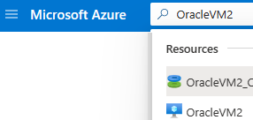
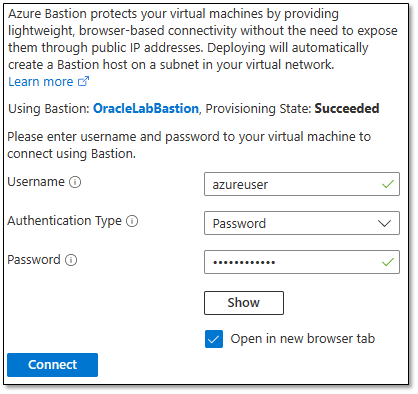

# Implement Oracle Data Guard on a Linux-based Azure virtual machine

**Applies to:** :heavy_check_mark: Linux VMs

You can use the Azure CLI to create and manage Azure resources from the command line or in scripts. This article describes how to use the Azure CLI to deploy an Oracle Database 19c Release 3 database from the Azure Marketplace image. This article then shows you, step by step, how to install and configure Data Guard on an Azure virtual machine (VM). To help secure the environment, no ports will be publicly accessible and an Azure Bastion instance will provide access to the Oracle VMs.

Before you start, make sure that the Azure CLI is installed. For more information, see the [Azure CLI installation guide](/cli/azure/install-azure-cli).

## Prepare the environment

### Assumptions

To install Oracle Data Guard, you need to create two Azure VMs on the same availability set:

- The primary VM (`OracleVM1`) has a running Oracle instance.
- The standby VM (`OracleVM2`) has the Oracle software installed only.

The Azure Marketplace image that you use to create the VMs is `Oracle:oracle-database-19-3:oracle-database-19-0904:latest`.

> [!NOTE]
> Be aware of versions that have reached end of life (EOL) and are no longer supported by Red Hat. Uploaded images that are at or beyond EOL will be supported on a basis of reasonable business effort. For more information, see the [Red Hat webpage for product lifecycles](https://access.redhat.com/product-life-cycles/?product=Red%20Hat%20Enterprise%20Linux,OpenShift%20Container%20Platform%204).

### Sign in to Azure

Sign in to your Azure subscription by using the [az login](/cli/azure/reference-index) command and follow the on-screen directions.

```azurecli
az login
```

### Set environment variables

Adjust the `LOCATION` variable for your environment:

```azurecli
LOCATION=eastus
RESOURCE_GROUP="Oracle-Lab"
VM_USERNAME="azureuser"
VM_PASSWORD="OracleLab123"
VNET_NAME="${RESOURCE_GROUP}VNet"
```

### Enable the Azure Bastion extension

Include the Azure Bastion extension in the Azure CLI:

```azurecli
az extension add \
  --name bastion
```

### Create a resource group

Create a resource group by using the [az group create](/cli/azure/group) command. An Azure resource group is a logical container in which Azure resources are deployed and managed.

```azurecli
az group create \
  --name $RESOURCE_GROUP \
  --location $LOCATION 
```

### Create a virtual network with two subnets

Create a virtual network where you'll connect all compute services. One subnet will host Azure Bastion, an Azure service that helps protect your databases from public access. The second subnet will host the two Oracle database VMs.  

Also, create a network security group that all services will reference to determine what ports are publicly exposed. Only port 443 will be exposed. The Azure Bastion service will open this port automatically when you create that service instance.

```azurecli
az network vnet create \
  --resource-group $RESOURCE_GROUP \
  --location $LOCATION \
  --name $VNET_NAME \
  --address-prefix "10.0.0.0/16" 
az network vnet subnet create \
  --resource-group $RESOURCE_GROUP \
  --name AzureBastionSubnet \
  --vnet-name $VNET_NAME \
  --address-prefixes 10.0.0.0/24
az network vnet subnet create \
  --resource-group $RESOURCE_GROUP \
  --name OracleSubnet \
  --vnet-name $VNET_NAME \
  --address-prefixes 10.0.1.0/24
az network nsg create \
  --name OracleVM-NSG \
  --resource-group $RESOURCE_GROUP \
  --location $LOCATION
```

### Create an availability set

Creating an availability set is optional, but we recommend it. For more information, see the [guidelines for Azure availability sets](/previous-versions/azure/virtual-machines/windows/infrastructure-example).

```azurecli
az vm availability-set create \
  --resource-group $RESOURCE_GROUP \
  --name OracleVMAvailabilitySet \
  --platform-fault-domain-count 2 \
  --platform-update-domain-count 2
```

### Create two virtual machines

Create two VMs by using the [az vm create](/cli/azure/vm) command. The following example creates VMs named `OracleVM1` and `OracleVM2`.

Create `OracleVM1` (primary):

```azurecli
az vm create \
  --resource-group $RESOURCE_GROUP \
  --name OracleVM1 \
  --availability-set OracleVMAvailabilitySet \
  --image Oracle:oracle-database-19-3:oracle-database-19-0904:latest \
  --size Standard_DS1_v2 \
  --authentication-type password \
  --admin-username $VM_USERNAME \
  --admin-password $VM_PASSWORD \
  --vnet-name $VNET_NAME \
  --subnet OracleSubnet \
  --nsg OracleVM-NSG \
  --os-disk-size-gb 32
```

Create `OracleVM2` (standby):

```azurecli
az vm create \
  --resource-group $RESOURCE_GROUP \
  --name OracleVM2 \
  --availability-set OracleVMAvailabilitySet \
  --image Oracle:oracle-database-19-3:oracle-database-19-0904:latest \
  --size Standard_DS1_v2 \
  --authentication-type password \
  --admin-username $VM_USERNAME \
  --admin-password $VM_PASSWORD \
  --vnet-name $VNET_NAME \
  --subnet OracleSubnet \
  --nsg OracleVM-NSG \
  --os-disk-size-gb 32
```

### Create the Azure Bastion service instance

Azure Bastion provides a secure tunnel to all services hosted within the virtual network. It serves as a jump box to eliminate direct access to your Oracle databases.

Create a public IP address to access the Azure Bastion service:

```azurecli
az network public-ip create \
  --resource-group $RESOURCE_GROUP \
  --name OracleLabBastionPublicIP \
  --sku Standard
```

Create the Azure Bastion service instance:

```azurecli
az network bastion create \
  --location $LOCATION \
  --name OracleLabBastion \
  --public-ip-address OracleLabBastionPublicIP \
  --resource-group $RESOURCE_GROUP \
  --vnet-name $VNET_NAME \
  --sku basic
```

### Connect to the virtual machine

Now, you'll access `OracleVM1` by using the Azure Bastion service from the [Azure portal](https://portal.azure.com).

In the search box at the top of the window, enter **OracleVM1**. In the list of results, select **OracleVM1** to open that VM.

:::image type="content" source="./media/configure-oracle-dataguard/search-oraclevm1.png" alt-text="Diagram showing the search box and the results for the first Oracle VM." lightbox="./media/configure-oracle-dataguard/search-oraclevm1.png":::


At the top of the pane, select **Connect** > **Bastion**.

:::image type="content" source="./media/configure-oracle-dataguard/connect-bastion.png" alt-text="Diagram showing the selections for connecting via Azure Bastion." lightbox="./media/configure-oracle-dataguard/connect-bastion.png":::

Enter the username and password, and then select the **Connect** button.


:::image type="content" source="./media/configure-oracle-dataguard/connect-bastion-credentials.png" alt-text="Diagram showing how to enter credentials to connect via Azure Bastion." lightbox="./media/configure-oracle-dataguard/connect-bastion-credentials.png":::


A new tab opens with a secure connection to your virtual machine, where the Oracle software is already installed from an Azure Marketplace image.

:::image type="content" source="./media/configure-oracle-dataguard/connect-bastion-browser-tab.png" alt-text="Diagram showing a connection via Azure Bastion in a browser." lightbox="./media/configure-oracle-dataguard/connect-bastion-browser-tab.png":::

### Configure OracleVM1 (primary)

Disable the firewall:

```bash
sudo systemctl stop firewalld
sudo systemctl disable firewalld
```

Set the `oracle` user password:

```bash
sudo passwd oracle
```

Enter the `azureuser` password: `OracleLab123`.

Change the `oracle` user password to `OracleLab123`. (Enter it again to verify.)

### Create the database on OracleVM1 (primary)

The Oracle software is already installed on the Azure Marketplace image, so the next step is to install the database.

Switch to the Oracle superuser:

```bash
sudo su - oracle
```

Create the database:

```bash
dbca -silent \
   -createDatabase \
   -datafileDestination /u01/app/oracle/cdb1 \
   -templateName General_Purpose.dbc \
   -gdbname cdb1 \
   -sid cdb1 \
   -responseFile NO_VALUE \
   -characterSet AL32UTF8 \
   -sysPassword OracleLab123 \
   -systemPassword OracleLab123 \
   -createAsContainerDatabase true \
   -numberOfPDBs 1 \
   -pdbName pdb1 \
   -pdbAdminPassword OracleLab123 \
   -databaseType MULTIPURPOSE \
   -automaticMemoryManagement false \
   -storageType FS
```

Outputs should look similar to the following response:

```output
Copying database files
1% complete
2% complete
8% complete
13% complete
19% complete
27% complete
Creating and starting Oracle instance
29% complete
32% complete
33% complete
34% complete
38% complete
42% complete
43% complete
45% complete
Completing Database Creation
48% complete
51% complete
53% complete
62% complete
70% complete
72% complete
Creating Pluggable Databases
78% complete
100% complete
Look at the log file "/u01/app/oracle/cfgtoollogs/dbca/cdb1/cdb1.log" for further details.
```

Set the `ORACLE_SID` and `ORACLE_HOME` variables:

```bash
$ ORACLE_HOME=/u01/app/oracle/product/19.0.0/dbhome_1; export ORACLE_HOME
$ ORACLE_SID=cdb1; export ORACLE_SID
```

Optionally, you can add `ORACLE_HOME` and `ORACLE_SID` to the */home/oracle/.bashrc* file, so that these settings are saved for future logins:

```bash
# add oracle home
export ORACLE_HOME= /u01/app/oracle/product/19.0.0/dbhome_1
# add oracle sid
export ORACLE_SID=cdb1
```

## Configure Data Guard

### Enable archive log mode on myVM1 (primary)

Enable log mode:

```bash
sqlplus / as sysdba
SQL> SELECT log_mode FROM v$database;
LOG_MODE
------------
NOARCHIVELOG
SQL> SHUTDOWN IMMEDIATE;
SQL> STARTUP MOUNT;
SQL> ALTER DATABASE ARCHIVELOG;
SQL> ALTER DATABASE OPEN;
```

Enable force logging, and make sure that at least one log file is present:

```bash
SQL> ALTER DATABASE FORCE LOGGING;
SQL> ALTER SYSTEM SWITCH LOGFILE;
```

Create standby redo logs, setting the same size and quantity as the primary database redo logs:

```bash
SQL> ALTER DATABASE ADD STANDBY LOGFILE ('/u01/app/oracle/cdb1/standby_redo01.log') SIZE 200M;
SQL> ALTER DATABASE ADD STANDBY LOGFILE ('/u01/app/oracle/cdb1/standby_redo02.log') SIZE 200M;
SQL> ALTER DATABASE ADD STANDBY LOGFILE ('/u01/app/oracle/cdb1/standby_redo03.log') SIZE 200M;
SQL> ALTER DATABASE ADD STANDBY LOGFILE ('/u01/app/oracle/cdb1/standby_redo04.log') SIZE 200M;
```

Turn on Flashback (which makes recovery a lot easier) and set `STANDBY_FILE_MANAGEMENT` to `AUTO`. Exit SQL*Plus after that.

```bash
SQL> ALTER SYSTEM SET db_recovery_file_dest_size=50G scope=both sid='*';
SQL> ALTER SYSTEM SET db_recovery_file_dest='/u01/app/oracle/cdb1' scope=both sid='*';
SQL> ALTER SYSTEM SET STANDBY_FILE_MANAGEMENT=AUTO SCOPE=BOTH;
SQL> ALTER SYSTEM SET STANDBY_FILE_MANAGEMENT=AUTO;
SQL> EXIT;
```

### Set up the service on OracleVM1 (primary)

Edit or create the *tnsnames.ora* file, which is in the *$ORACLE_HOME/network/admin* folder.

Add the following entries:

```bash
cdb1 =
  (DESCRIPTION =
    (ADDRESS_LIST =
      (ADDRESS = (PROTOCOL = TCP)(HOST = OracleVM1)(PORT = 1521))
    )
    (CONNECT_DATA =
      (SID = cdb1)
    )
  )
cdb1_stby =
  (DESCRIPTION =
    (ADDRESS_LIST =
      (ADDRESS = (PROTOCOL = TCP)(HOST = OracleVM2)(PORT = 1521))
    )
    (CONNECT_DATA =
      (SID = cdb1)
    )
  )
```

Edit or create the *listener.ora* file, which is in the *$ORACLE_HOME/network/admin* folder.

Add the following entries:

```bash
LISTENER =
  (DESCRIPTION_LIST =
    (DESCRIPTION =
      (ADDRESS = (PROTOCOL = TCP)(HOST = OracleVM1)(PORT = 1521))
      (ADDRESS = (PROTOCOL = IPC)(KEY = EXTPROC1521))
    )
  )
SID_LIST_LISTENER =
  (SID_LIST =
    (SID_DESC =
      (GLOBAL_DBNAME = cdb1_DGMGRL)
      (ORACLE_HOME = /u01/app/oracle/product/19.0.0/dbhome_1)
      (SID_NAME = cdb1)
    )
  )
ADR_BASE_LISTENER = /u01/app/oracle
```

Enable Data Guard Broker:

```bash
sqlplus / as sysdba
SQL> ALTER SYSTEM SET dg_broker_start=true;
SQL> CREATE pfile FROM spfile;
SQL> EXIT;
```

Copy the parameter file to the standby server:

```bash
scp -p $ORACLE_HOME/dbs/initcdb1.ora oracle@OracleVM2:$ORACLE_HOME/dbs/
```

Start the listener:

```bash
 lsnrctl stop
 lsnrctl start
```

### Set up the service on OracleVM2 (standby)

Return to the Azure portal. Search for **OracleVM2**, and then select the resource in the list of results.



At the top of the pane, select **Connect** > **Bastion**.

:::image type="content" source="./media/configure-oracle-dataguard/connect-bastion.png" alt-text="Diagram showing selections for connecting through Azure Bastion." lightbox="./media/configure-oracle-dataguard/connect-bastion.png":::


Enter the username and password, and then select the **Connect** button.



### Disable the firewall on OracleVM2 (standby)

```bash
sudo systemctl stop firewalld
sudo systemctl disable firewalld    
```

### Configure the environment for OracleVM1

Set the `oracle` user password:

```bash
sudo passwd oracle
```

Enter the `azureuser` password: `OracleLab123`.

Change the `oracle` user password to `OracleLab123`. (Enter it again to verify.)

Switch to the `oracle` superuser:

```bash
$ sudo su – oracle
```

Set the `ORACLE_SID` and `ORACLE_HOME` variables:

```bash
ORACLE_HOME=/u01/app/oracle/product/19.0.0/dbhome_1; export ORACLE_HOME
ORACLE_SID=cdb1; export ORACLE_SID
```

Optionally, you can add `ORACLE_HOME` and `ORACLE_SID` to the */home/oracle/.bashrc* file, so that these settings are saved for future logins:

```bash
# add oracle home
export ORACLE_HOME=/u01/app/oracle/product/19.0.0/dbhome_1
# add oracle sid
export ORACLE_SID=cdb1
```

Edit or create the *tnsnames.ora* file, which is in the *$ORACLE_HOME/network/admin* folder.

Add the following entries:

```bash
cdb1 =
  (DESCRIPTION =
    (ADDRESS_LIST =
      (ADDRESS = (PROTOCOL = TCP)(HOST = OracleVM1)(PORT = 1521))
    )
    (CONNECT_DATA =
      (SID = cdb1)
    )
  )
cdb1_stby =
  (DESCRIPTION =
    (ADDRESS_LIST =
      (ADDRESS = (PROTOCOL = TCP)(HOST = OracleVM2)(PORT = 1521))
    )
    (CONNECT_DATA =
      (SID = cdb1)
    )
  )
```

Edit or create the *listener.ora* file, which is in the *$ORACLE_HOME/network/admin* folder.

Add the following entries:

```bash
LISTENER =
  (DESCRIPTION_LIST =
    (DESCRIPTION =
      (ADDRESS = (PROTOCOL = TCP)(HOST = OracleVM2)(PORT = 1521))
      (ADDRESS = (PROTOCOL = IPC)(KEY = EXTPROC1521))
    )
  )
SID_LIST_LISTENER =
  (SID_LIST =
    (SID_DESC =
      (GLOBAL_DBNAME = cdb1_DGMGRL)
      (ORACLE_HOME = /u01/app/oracle/product/19.0.0/dbhome_1)
      (SID_NAME = cdb1)
    )
  )
ADR_BASE_LISTENER = /u01/app/oracle
```

Start the listener:

```bash
 lsnrctl stop
 lsnrctl start
```

### Restore the database to OracleVM2 (standby)

Create the parameter file */tmp/initcdb1_stby.ora* with the following contents:

```bash
*.db_name='cdb1'
```

Create folders:

```bash
$ mkdir -p /u01/app/oracle/cdb1
$ mkdir -p /u01/app/oracle/oradata/cdb1/pdbseed
$ mkdir -p /u01/app/oracle/oradata/cdb1/pdb1
$ mkdir -p /u01/app/oracle/fast_recovery_area/cdb1
$ mkdir -p /u01/app/oracle/admin/cdb1/adump
```

Create a password file:


```bash
$ orapwd file=/u01/app/oracle/product/19.0.0/dbhome_1/dbs/orapwcdb1 password=OracleLab123 entries=10 force=y
```

Start the database on `OracleVM2`:

```bash
 export ORACLE_SID=cdb1
 sqlplus / as sysdba
SQL> CREATE spfile from pfile;
SQL> STARTUP NOMOUNT PFILE='/tmp/initcdb1_stby.ora';
SQL> EXIT;
```

Restore the database by using the Oracle Recovery Manager (RMAN) tool:

```bash
$ rman TARGET sys/OracleLab123@cdb1 AUXILIARY sys/OracleLab123@cdb1_stby
```

Run the following commands in RMAN:

```bash
DUPLICATE TARGET DATABASE
  FOR STANDBY
  FROM ACTIVE DATABASE
  DORECOVER
  SPFILE
    SET db_unique_name='CDB1_STBY' COMMENT 'Is standby'
  NOFILENAMECHECK;
```

Messages similar to the following ones appear when the commands are completed:

```output
media recovery complete, elapsed time: 00:00:00
Finished recover at 29-JUN-22
Finished Duplicate Db at 29-JUN-22
```

Exit RMAN:

```bash
RMAN> EXIT;
```

Enable Data Guard Broker:

```bash
sqlplus / as sysdba
SQL> ALTER SYSTEM SET dg_broker_start=true;
SQL> EXIT;
```

### Configure Data Guard Broker on OracleVM1 (primary)

Start Data Guard Manager and log in by using SYS and a password. (Don't use OS authentication.)

```bash
$ dgmgrl sys/OracleLab123@cdb1
DGMGRL for Linux: Version 19.0.0.0 - 64bit Production
Copyright (c) 2000, 2013, Oracle. All rights reserved.
Welcome to DGMGRL, type "help" for information.
Connected as SYSDBA.
DGMGRL> CREATE CONFIGURATION my_dg_config AS PRIMARY DATABASE IS cdb1 CONNECT IDENTIFIER IS cdb1;
Configuration "my_dg_config" created with primary database "cdb1"
DGMGRL> ADD DATABASE cdb1_stby AS CONNECT IDENTIFIER IS cdb1_stby MAINTAINED AS PHYSICAL;
Database "cdb1_stby" added
DGMGRL> ENABLE CONFIGURATION;
Enabled.
```

Review the configuration:

```bash
DGMGRL> SHOW CONFIGURATION;
Configuration - my_dg_config
  Protection Mode: MaxPerformance
  Members:
  cdb1      - Primary database
  cdb1_stby - Physical standby database
Fast-Start Failover: DISABLED
Configuration Status:
SUCCESS   (status updated 26 seconds ago)
```

You've completed the Oracle Data Guard setup. The next section shows you how to test the connectivity and switch over.

### Connect the database from the client machine

Update the *tnsnames.ora* file on your client machine. This file is usually in *$ORACLE_HOME/network/admin*.

```bash
cdb1=
  (DESCRIPTION=
    (ADDRESS=
      (PROTOCOL=TCP)
      (HOST=OracleVM1)
      (PORT=1521)
    )
    (CONNECT_DATA=
      (SERVER=dedicated)
      (SERVICE_NAME=cdb1)
    )
  )
cdb1_stby=
  (DESCRIPTION=
    (ADDRESS=
      (PROTOCOL=TCP)
      (HOST=OracleVM2)
      (PORT=1521)
    )
    (CONNECT_DATA=
      (SERVER=dedicated)
      (SERVICE_NAME=cdb1_stby)
    )
  )
```

Start SQL*Plus:

```bash
$ sqlplus sys/OraPasswd1@cdb1
SQL*Plus: Release 19.0.0.0 Production on Wed May 10 14:18:31 2022
Copyright (c) 1982, 2016, Oracle.  All rights reserved.
Connected to:
Oracle Database 12c Enterprise Edition Release 19.0.0.0 - 64bit Production
With the Partitioning, OLAP, Advanced Analytics and Real Application Testing options
SQL>
```

## Test the Data Guard configuration

### Switch over the database on OracleVM1 (primary)

Switch from primary to standby (`cdb1` to `cdb1_stby`):

```bash
$ dgmgrl sys/OracleLab123@cdb1
DGMGRL for Linux: Version 19.0.0.0 - 64bit Production
Copyright (c) 2000, 2013, Oracle. All rights reserved.
Welcome to DGMGRL, type "help" for information.
Connected as SYSDBA.
DGMGRL> SWITCHOVER TO cdb1_stby;
Performing switchover NOW, please wait...
Operation requires a connection to instance "cdb1" on database "cdb1_stby"
Connecting to instance "cdb1"...
Connected as SYSDBA.
New primary database "cdb1_stby" is opening...
Operation requires start up of instance "cdb1" on database "cdb1"
Starting instance "cdb1"...
ORACLE instance started.
Database mounted.
Switchover succeeded, new primary is "cdb1_stby"
DGMGRL>
```

You can now connect to the standby database. Start SQL*Plus:

```bash
$ sqlplus sys/OracleLab123@cdb1_stby
SQL*Plus: Release 19.0.0.0 Production on Wed May 10 14:18:31 2022
Copyright (c) 1982, 2016, Oracle.  All rights reserved.
Connected to:
Oracle Database 19c Enterprise Edition Release 19.0.0.0 - 64bit Production
With the Partitioning, OLAP, Advanced Analytics and Real Application Testing options
SQL>
```

### Switch over the database on OracleVM2 (standby)

To switch over, run the following code on `OracleVM2`:

```bash
$ dgmgrl sys/OracleLab123@cdb1_stby
DGMGRL for Linux: Version 190.0.0.0 - 64bit Production
Copyright (c) 2000, 2013, Oracle. All rights reserved.
Welcome to DGMGRL, type "help" for information.
Connected as SYSDBA.
DGMGRL> SWITCHOVER TO cdb1;
Performing switchover NOW, please wait...
Operation requires a connection to instance "cdb1" on database "cdb1"
Connecting to instance "cdb1"...
Connected as SYSDBA.
New primary database "cdb1" is opening...
Operation requires start up of instance "cdb1" on database "cdb1_stby"
Starting instance "cdb1"...
ORACLE instance started.
Database mounted.
Switchover succeeded, new primary is "cdb1"
```

Once again, you should now be able to connect to the primary database. Start SQL*Plus:

```bash
$ sqlplus sys/OracleLab123@cdb1
SQL*Plus: Release 19.0.0.0 Production on Wed May 10 14:18:31 2022
Copyright (c) 1982, 2016, Oracle.  All rights reserved.
Connected to:
Oracle Database 19c Enterprise Edition Release 19.0.0.0 - 64bit Production
With the Partitioning, OLAP, Advanced Analytics and Real Application Testing options
SQL>
```

You've finished the installation and configuration of Data Guard on Oracle Linux.

## Delete the virtual machine

When you no longer need the VMs, you can use the following command to remove the resource group, the VMs, and all related resources:

```azurecli
az group delete --name $RESOURCE_GROUP
```

## Next steps

- [Tutorial: Create highly available virtual machines](../../linux/create-cli-complete.md)
- [Explore Azure CLI samples for VM deployment](https://github.com/Azure-Samples/azure-cli-samples/tree/master/virtual-machine)
