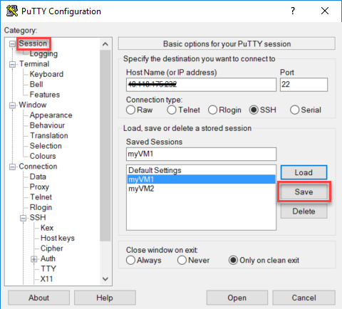
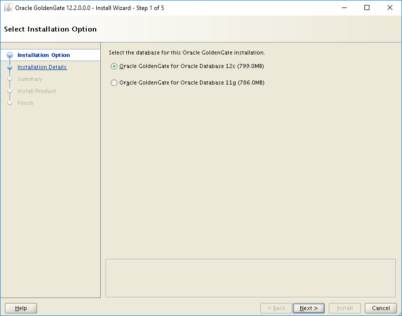
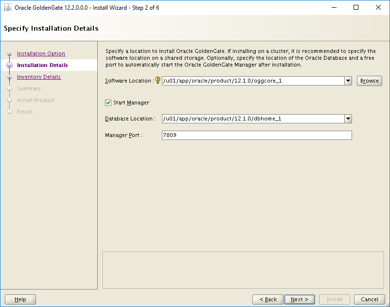
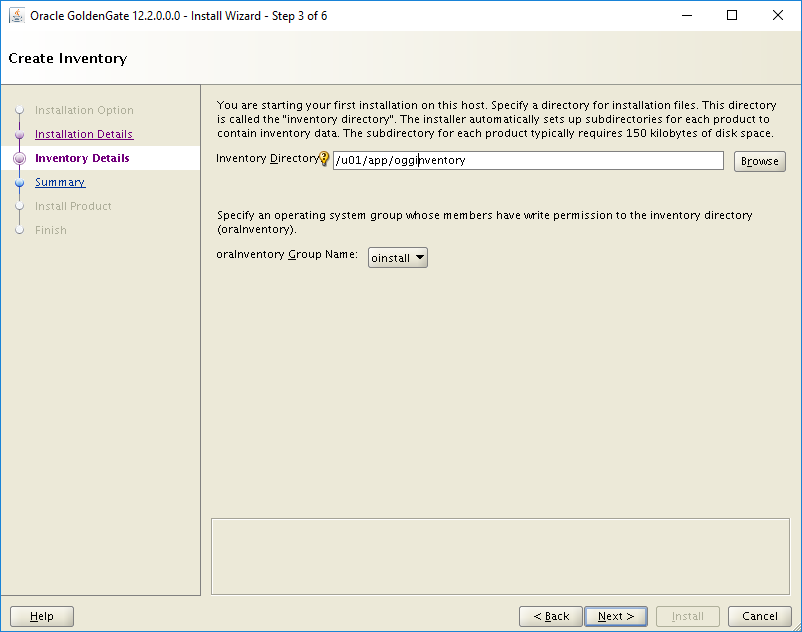
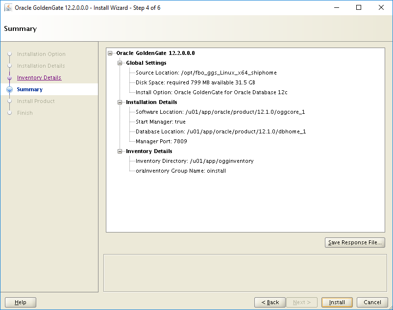
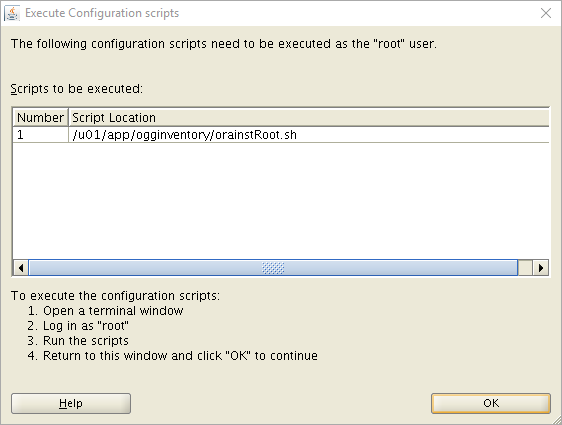
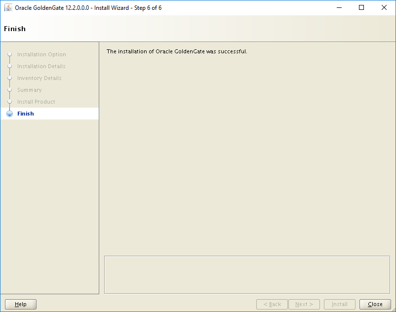

# Implement Oracle Golden Gate on an Azure Linux VM 

The Azure CLI is used to create and manage Azure resources from the command line or in scripts. This guide details how to use the Azure CLI to deploy an Oracle 12c database from the Azure Marketplace gallery image. 

This document shows you step-by-step how to create, install, and configure Oracle Golden Gate on an Azure VM.

Before you start, make sure that the Azure CLI has been installed. For more information, see [Azure CLI installation guide](https://docs.microsoft.com/cli/azure/install-azure-cli).

## Prepare the environment

To perform the Oracle Golden Gate installation, you need to create two Azure VMs on the same availability set. The Marketplace image you use to create the VMs is **Oracle:Oracle-Database-Ee:12.1.0.2:latest**.

You also need to be familiar with Unix editor vi and have a basic understanding of x11 (X Windows).

The following is a summary of the environment configuration:
> 
> |  | **Primary site** | **Replicate site** |
> | --- | --- | --- |
> | **Oracle release** |Oracle 12c Release 2 – (12.1.0.2) |Oracle 12c Release 2 – (12.1.0.2)|
> | **Machine name** |myVM1 |myVM2 |
> | **Operating system** |Oracle Linux 6.x |Oracle Linux 6.x |
> | **Oracle SID** |CDB1 |CDB1 |
> | **Replication schema** |TEST|TEST |
> | **Golden Gate owner/replicate** |C##GGADMIN |REPUSER |
> | **Golden Gate process** |EXTORA |REPORA|


### Sign in to Azure 

Sign in to your Azure subscription with the [az login](/cli/azure/reference-index) command. Then follow the on-screen directions.

```azurecli
az login
```

### Create a resource group

Create a resource group with the [az group create](/cli/azure/group) command. An Azure resource group is a logical container into which Azure resources are deployed and from which they can be managed. 

The following example creates a resource group named `myResourceGroup` in the `westus` location.

```azurecli
az group create --name myResourceGroup --location westus
```

### Create an availability set

The following step is optional but recommended. For more information, see [Azure availability sets guide](https://docs.microsoft.com/azure/virtual-machines/windows/infrastructure-availability-sets-guidelines).

```azurecli
az vm availability-set create \
    --resource-group myResourceGroup \
    --name myAvailabilitySet \
    --platform-fault-domain-count 2 \
    --platform-update-domain-count 2
```

### Create a virtual machine

Create a VM with the [az vm create](/cli/azure/vm) command. 

The following example creates two VMs named `myVM1` and `myVM2`. Create SSH keys if they do not already exist in a default key location. To use a specific set of keys, use the `--ssh-key-value` option.

#### Create myVM1 (primary):
```azurecli
az vm create \
     --resource-group myResourceGroup \
     --name myVM1 \
     --availability-set myAvailabilitySet \
     --image Oracle:Oracle-Database-Ee:12.1.0.2:latest \
     --size Standard_DS1_v2  \
     --generate-ssh-keys \
```

After the VM has been created, the Azure CLI shows information similar to the following example. (Take note of the `publicIpAddress`. This address is used to access the VM.)

```azurecli
{
  "fqdns": "",
  "id": "/subscriptions/00000000-0000-0000-0000-000000000000/resourceGroups/myResourceGroup/providers/Microsoft.Compute/virtualMachines/myVM",
  "location": "westus",
  "macAddress": "00-0D-3A-36-2F-56",
  "powerState": "VM running",
  "privateIpAddress": "10.0.0.4",
  "publicIpAddress": "13.64.104.241",
  "resourceGroup": "myResourceGroup"
}
```

#### Create myVM2 (replicate):
```azurecli
az vm create \
     --resource-group myResourceGroup \
     --name myVM2 \
     --availability-set myAvailabilitySet \
     --image Oracle:Oracle-Database-Ee:12.1.0.2:latest \
     --size Standard_DS1_v2  \
     --generate-ssh-keys \
```

Take note of the `publicIpAddress` as well after it has been created.

### Open the TCP port for connectivity

The next step is to configure external endpoints,  which enable you to access the Oracle database remotely. To configure the external endpoints, run the following commands.

#### Open the port for myVM1:

```azurecli
az network nsg rule create --resource-group myResourceGroup\
    --nsg-name myVm1NSG --name allow-oracle\
    --protocol tcp --direction inbound --priority 999 \
    --source-address-prefix '*' --source-port-range '*' \
    --destination-address-prefix '*' --destination-port-range 1521 --access allow
```

The results should look similar to the following response:

```bash
{
  "access": "Allow",
  "description": null,
  "destinationAddressPrefix": "*",
  "destinationPortRange": "1521",
  "direction": "Inbound",
  "etag": "W/\"bd77dcae-e5fd-4bd6-a632-26045b646414\"",
  "id": "/subscriptions/<subscription-id>/resourceGroups/myResourceGroup/providers/Microsoft.Network/networkSecurityGroups/myVmNSG/securityRules/allow-oracle",
  "name": "allow-oracle",
  "priority": 999,
  "protocol": "Tcp",
  "provisioningState": "Succeeded",
  "resourceGroup": "myResourceGroup",
  "sourceAddressPrefix": "*",
  "sourcePortRange": "*"
}
```

#### Open the port for myVM2:

```azurecli
az network nsg rule create --resource-group myResourceGroup\
    --nsg-name myVm2NSG --name allow-oracle\
    --protocol tcp --direction inbound --priority 999 \
    --source-address-prefix '*' --source-port-range '*' \
    --destination-address-prefix '*' --destination-port-range 1521 --access allow
```

### Connect to the virtual machine

Use the following command to create an SSH session with the virtual machine. Replace the IP address with the `publicIpAddress` of your virtual machine.

```bash 
ssh <publicIpAddress>
```

### Create the database on myVM1 (primary)

The Oracle software is already installed on the Marketplace image, so the next step is to install the database. 

Run the software as the 'oracle' superuser:

```bash
sudo su - oracle
```

Create the database:

```bash
$ dbca -silent \
   -createDatabase \
   -templateName General_Purpose.dbc \
   -gdbname cdb1 \
   -sid cdb1 \
   -responseFile NO_VALUE \
   -characterSet AL32UTF8 \
   -sysPassword OraPasswd1 \
   -systemPassword OraPasswd1 \
   -createAsContainerDatabase true \
   -numberOfPDBs 1 \
   -pdbName pdb1 \
   -pdbAdminPassword OraPasswd1 \
   -databaseType MULTIPURPOSE \
   -automaticMemoryManagement false \
   -storageType FS \
   -ignorePreReqs
```
Outputs should look similar to the following response:

```bash
Copying database files
1% complete
2% complete
8% complete
13% complete
19% complete
27% complete
Creating and starting Oracle instance
29% complete
32% complete
33% complete
34% complete
38% complete
42% complete
43% complete
45% complete
Completing Database Creation
48% complete
51% complete
53% complete
62% complete
70% complete
72% complete
Creating Pluggable Databases
78% complete
100% complete
Look at the log file "/u01/app/oracle/cfgtoollogs/dbca/cdb1/cdb1.log" for more details.
```

Set the ORACLE_SID and ORACLE_HOME variables.

```bash
$ ORACLE_HOME=/u01/app/oracle/product/12.1.0/dbhome_1; export ORACLE_HOME
$ ORACLE_SID=cdb1; export ORACLE_SID
$ LD_LIBRARY_PATH=ORACLE_HOME/lib; export LD_LIBRARY_PATH
```

Optionally, you can add ORACLE_HOME and ORACLE_SID to the .bashrc file, so that these settings are saved for future sign-ins:

```bash
# add oracle home
export ORACLE_HOME=/u01/app/oracle/product/12.1.0/dbhome_1
# add oracle sid
export ORACLE_SID=cdb1
# add Oracle library path
export LD_LIBRARY_PATH=$ORACLE_HOME/lib
```

### Start Oracle listener
```bash
$ lsnrctl start
```

### Create the database on myVM2 (replicate)

```bash
sudo su - oracle
```
Create the database:

```bash
$ dbca -silent \
   -createDatabase \
   -templateName General_Purpose.dbc \
   -gdbname cdb1 \
   -sid cdb1 \
   -responseFile NO_VALUE \
   -characterSet AL32UTF8 \
   -sysPassword OraPasswd1 \
   -systemPassword OraPasswd1 \
   -createAsContainerDatabase true \
   -numberOfPDBs 1 \
   -pdbName pdb1 \
   -pdbAdminPassword OraPasswd1 \
   -databaseType MULTIPURPOSE \
   -automaticMemoryManagement false \
   -storageType FS \
   -ignorePreReqs
```
Set the ORACLE_SID and ORACLE_HOME variables.

```bash
$ ORACLE_HOME=/u01/app/oracle/product/12.1.0/dbhome_1; export ORACLE_HOME
$ ORACLE_SID=cdb1; export ORACLE_SID
$ LD_LIBRARY_PATH=ORACLE_HOME/lib; export LD_LIBRARY_PATH
```

Optionally, you can added ORACLE_HOME and ORACLE_SID to the .bashrc file, so that these settings are saved for future sign-ins.

```bash
# add oracle home
export ORACLE_HOME=/u01/app/oracle/product/12.1.0/dbhome_1
# add oracle sid
export ORACLE_SID=cdb1
# add Oracle library path
export LD_LIBRARY_PATH=$ORACLE_HOME/lib
```

### Start Oracle listener
```bash
$ sudo su - oracle
$ lsnrctl start
```

## Configure Golden Gate 
To configure Golden Gate, take the steps in this section.

### Enable archive log mode on myVM1 (primary)

```bash
$ sqlplus / as sysdba
SQL> SELECT log_mode FROM v$database;

LOG_MODE
------------
NOARCHIVELOG

SQL> SHUTDOWN IMMEDIATE;
SQL> STARTUP MOUNT;
SQL> ALTER DATABASE ARCHIVELOG;
SQL> ALTER DATABASE OPEN;
```
Enable force logging, and make sure at least one log file is present.

```bash
SQL> ALTER DATABASE FORCE LOGGING;
SQL> ALTER SYSTEM SWITCH LOGFILE;
SQL> ALTER SYSTEM set enable_goldengate_replication=true;
SQL> ALTER PLUGGABLE DATABASE PDB1 OPEN;
SQL> ALTER SESSION SET CONTAINER=PDB1;
SQL> ALTER DATABASE ADD SUPPLEMENTAL LOG DATA;
SQL> EXIT;
```

### Download Golden Gate software
To download and prepare the Oracle Golden Gate software, complete the following steps:

1. Download the **fbo_ggs_Linux_x64_shiphome.zip** file from the [Oracle Golden Gate download page](https://www.oracle.com/technetwork/middleware/goldengate/downloads/index.html). Under the download title **Oracle GoldenGate 12.x.x.x for Oracle Linux x86-64**, there should be a set of .zip files to download.

2. After you download the .zip files to your client computer, use Secure Copy Protocol (SCP) to copy the files to your VM:

   ```bash
   $ scp fbo_ggs_Linux_x64_shiphome.zip <publicIpAddress>:<folder>
   ```

3. Move the .zip files to the **/opt** folder. Then change the owner of the files as follows:

   ```bash
   $ sudo su -
   # mv <folder>/*.zip /opt
   ```

4. Unzip the files (install the Linux unzip utility if it's not already installed):

   ```bash
   # yum install unzip
   # cd /opt
   # unzip fbo_ggs_Linux_x64_shiphome.zip
   ```

5. Change permission:

   ```bash
   # chown -R oracle:oinstall /opt/fbo_ggs_Linux_x64_shiphome
   ```

### Prepare the client and VM to run x11 (for Windows clients only)
This is an optional step. You can skip this step if you are using a Linux client or already have x11 setup.

1. Download PuTTY and Xming to your Windows computer:

   * [Download PuTTY](https://www.putty.org/)
   * [Download Xming](https://xming.en.softonic.com/)

2. After you install PuTTY, in the PuTTY folder (for example, C:\Program Files\PuTTY), run puttygen.exe (PuTTY Key Generator).

3. In PuTTY Key Generator:

   - To generate a key, select the **Generate** button.
   - Copy the contents of the key (**Ctrl+C**).
   - Select the **Save private key** button.
   - Ignore the warning that appears, and then select **OK**.

   

4. In your VM, run these commands:

   ```bash
   # sudo su - oracle
   $ mkdir .ssh (if not already created)
   $ cd .ssh
   ```

5. Create a file named **authorized_keys**. Paste the contents of the key in this file, and then save the file.

   > [!NOTE]
   > The key must contain the string `ssh-rsa`. Also, the contents of the key must be a single line of text.
   >  

6. Start PuTTY. In the **Category** pane, select **Connection** > **SSH** > **Auth**. In the **Private key file for authentication** box, browse to the key that you generated earlier.

   

7. In the **Category** pane, select **Connection** > **SSH** > **X11**. Then select the **Enable X11 forwarding** box.

   

8. In the **Category** pane, go to **Session**. Enter the host information, and then select **Open**.

   

### Install Golden Gate software

To install Oracle Golden Gate, complete the following steps:

1. Sign in as oracle. (You should be able to sign in without being prompted for a password.) Make sure that Xming is running before you begin the installation.
 
   ```bash
   $ cd /opt/fbo_ggs_Linux_x64_shiphome/Disk1
   $ ./runInstaller
   ```
2. Select 'Oracle GoldenGate for Oracle Database 12c'. Then select **Next** to continue.

   

3. Change the software location. Then select  the **Start Manager** box and enter the database location. Select **Next** to continue.

   

4. Change the inventory directory, and then select **Next** to continue.

   

5. On the **Summary** screen, select **Install** to continue.

   

6. You might be prompted to run a script as 'root'. If so, open a separate session, ssh to the VM, sudo to root, and then run the script. Select **OK** continue.

   

7. When the installation has finished, select **Close** to complete the process.

   

### Set up service on myVM1 (primary)

1. Create or update the tnsnames.ora file:

   ```bash
   $ cd $ORACLE_HOME/network/admin
   $ vi tnsnames.ora

   cdb1=
    (DESCRIPTION=
      (ADDRESS=
        (PROTOCOL=TCP)
        (HOST=localhost)
        (PORT=1521)
      )
      (CONNECT_DATA=
        (SERVER=dedicated)
        (SERVICE_NAME=cdb1)
      )
    )

   pdb1=
    (DESCRIPTION=
      (ADDRESS=
        (PROTOCOL=TCP)
        (HOST=localhost)
        (PORT=1521)
      )
      (CONNECT_DATA=
        (SERVER=dedicated)
        (SERVICE_NAME=pdb1)
      )
    )
   ```

2. Create the Golden Gate owner and user accounts.

   > [!NOTE]
   > The owner account must have C## prefix.
   >

    ```bash
    $ sqlplus / as sysdba
    SQL> CREATE USER C##GGADMIN identified by ggadmin;
    SQL> EXEC dbms_goldengate_auth.grant_admin_privilege('C##GGADMIN',container=>'ALL');
    SQL> GRANT DBA to C##GGADMIN container=all;
    SQL> connect C##GGADMIN/ggadmin
    SQL> ALTER SESSION SET CONTAINER=PDB1;
    SQL> EXIT;
    ```

3. Create the Golden Gate test user account:

   ```bash
   $ cd /u01/app/oracle/product/12.1.0/oggcore_1
   $ sqlplus system/OraPasswd1@pdb1
   SQL> CREATE USER test identified by test DEFAULT TABLESPACE USERS TEMPORARY TABLESPACE TEMP;
   SQL> GRANT connect, resource, dba TO test;
   SQL> ALTER USER test QUOTA 100M on USERS;
   SQL> connect test/test@pdb1
   SQL> @demo_ora_create
   SQL> @demo_ora_insert
   SQL> EXIT;
   ```

4. Configure the extract parameter file.

   Start the Golden gate command-line interface (ggsci):

   ```bash
   $ sudo su - oracle
   $ cd /u01/app/oracle/product/12.1.0/oggcore_1
   $ ./ggsci
   GGSCI> DBLOGIN USERID test@pdb1, PASSWORD test
   Successfully logged into database  pdb1
   GGSCI>  ADD SCHEMATRANDATA pdb1.test
   2017-05-23 15:44:25  INFO    OGG-01788  SCHEMATRANDATA has been added on schema test.
   2017-05-23 15:44:25  INFO    OGG-01976  SCHEMATRANDATA for scheduling columns has been added on schema test.

   GGSCI> EDIT PARAMS EXTORA
   ```
5. Add the following to the EXTRACT parameter file (by using vi commands). Press Esc key, ':wq!' to save file. 

   ```bash
   EXTRACT EXTORA
   USERID C##GGADMIN, PASSWORD ggadmin
   RMTHOST 10.0.0.5, MGRPORT 7809
   RMTTRAIL ./dirdat/rt  
   DDL INCLUDE MAPPED
   DDLOPTIONS REPORT 
   LOGALLSUPCOLS
   UPDATERECORDFORMAT COMPACT
   TABLE pdb1.test.TCUSTMER;
   TABLE pdb1.test.TCUSTORD;
   ```
6. Register extract--integrated extract:

   ```bash
   $ cd /u01/app/oracle/product/12.1.0/oggcore_1
   $ ./ggsci

   GGSCI> dblogin userid C##GGADMIN, password ggadmin
   Successfully logged into database CDB$ROOT.

   GGSCI> REGISTER EXTRACT EXTORA DATABASE CONTAINER(pdb1)

   2017-05-23 15:58:34  INFO    OGG-02003  Extract EXTORA successfully registered with database at SCN 1821260.

   GGSCI> exit
   ```
7. Set up extract checkpoints and start real-time extract:

   ```bash
   $ ./ggsci
   GGSCI>  ADD EXTRACT EXTORA, INTEGRATED TRANLOG, BEGIN NOW
   EXTRACT (Integrated) added.

   GGSCI>  ADD RMTTRAIL ./dirdat/rt, EXTRACT EXTORA, MEGABYTES 10
   RMTTRAIL added.

   GGSCI>  START EXTRACT EXTORA

   Sending START request to MANAGER ...
   EXTRACT EXTORA starting

   GGSCI > info all

   Program     Status      Group       Lag at Chkpt  Time Since Chkpt

   MANAGER     RUNNING
   EXTRACT     RUNNING     EXTORA      00:00:11      00:00:04
   ```
   In this step, you find the starting SCN, which will be used later, in a different section:

   ```bash
   $ sqlplus / as sysdba
   SQL> alter session set container = pdb1;
   SQL> SELECT current_scn from v$database;
   CURRENT_SCN
   -----------
      1857887
   SQL> EXIT;
   ```

   ```bash
   $ ./ggsci
   GGSCI> EDIT PARAMS INITEXT
   ```

   ```bash
   EXTRACT INITEXT
   USERID C##GGADMIN, PASSWORD ggadmin
   RMTHOST 10.0.0.5, MGRPORT 7809
   RMTTASK REPLICAT, GROUP INITREP
   TABLE pdb1.test.*, SQLPREDICATE 'AS OF SCN 1857887'; 
   ```

   ```bash
   GGSCI> ADD EXTRACT INITEXT, SOURCEISTABLE
   ```

### Set up service on myVM2 (replicate)


1. Create or update the tnsnames.ora file:

   ```bash
   $ cd $ORACLE_HOME/network/admin
   $ vi tnsnames.ora

   cdb1=
    (DESCRIPTION=
      (ADDRESS=
        (PROTOCOL=TCP)
        (HOST=localhost)
        (PORT=1521)
      )
      (CONNECT_DATA=
        (SERVER=dedicated)
        (SERVICE_NAME=cdb1)
      )
    )

   pdb1=
    (DESCRIPTION=
      (ADDRESS=
        (PROTOCOL=TCP)
        (HOST=localhost)
        (PORT=1521)
      )
      (CONNECT_DATA=
        (SERVER=dedicated)
        (SERVICE_NAME=pdb1)
      )
    )
   ```

2. Create a replicate account:

   ```bash
   $ sqlplus / as sysdba
   SQL> alter session set container = pdb1;
   SQL> create user repuser identified by rep_pass container=current;
   SQL> grant dba to repuser;
   SQL> exec dbms_goldengate_auth.grant_admin_privilege('REPUSER',container=>'PDB1');
   SQL> connect repuser/rep_pass@pdb1 
   SQL> EXIT;
   ```

3. Create a Golden Gate test user account:

   ```bash
   $ cd /u01/app/oracle/product/12.1.0/oggcore_1
   $ sqlplus system/OraPasswd1@pdb1
   SQL> CREATE USER test identified by test DEFAULT TABLESPACE USERS TEMPORARY TABLESPACE TEMP;
   SQL> GRANT connect, resource, dba TO test;
   SQL> ALTER USER test QUOTA 100M on USERS;
   SQL> connect test/test@pdb1
   SQL> @demo_ora_create
   SQL> EXIT;
   ```

4. REPLICAT parameter file to replicate changes: 

   ```bash
   $ cd /u01/app/oracle/product/12.1.0/oggcore_1
   $ ./ggsci
   GGSCI> EDIT PARAMS REPORA  
   ```
   Content of REPORA parameter file:

   ```bash
   REPLICAT REPORA
   ASSUMETARGETDEFS
   DISCARDFILE ./dirrpt/repora.dsc, PURGE, MEGABYTES 100
   DDL INCLUDE MAPPED
   DDLOPTIONS REPORT
   DBOPTIONS INTEGRATEDPARAMS(parallelism 6)
   USERID repuser@pdb1, PASSWORD rep_pass
   MAP pdb1.test.*, TARGET pdb1.test.*;
   ```

5. Set up a replicate checkpoint:

   ```bash
   GGSCI> ADD REPLICAT REPORA, INTEGRATED, EXTTRAIL ./dirdat/rt
   GGSCI> EDIT PARAMS INITREP

   ```

   ```bash
   REPLICAT INITREP
   ASSUMETARGETDEFS
   DISCARDFILE ./dirrpt/tcustmer.dsc, APPEND
   USERID repuser@pdb1, PASSWORD rep_pass
   MAP pdb1.test.*, TARGET pdb1.test.*;   
   ```

   ```bash
   GGSCI> ADD REPLICAT INITREP, SPECIALRUN
   ```

### Set up the replication (myVM1 and myVM2)

#### 1. Set up the replication on myVM2 (replicate)

  ```bash
  $ cd /u01/app/oracle/product/12.1.0/oggcore_1
  $ ./ggsci
  GGSCI> EDIT PARAMS MGR
  ```
Update the file with the following:

  ```bash
  PORT 7809
  ACCESSRULE, PROG *, IPADDR *, ALLOW
  ```
Then restart the Manager service:

  ```bash
  GGSCI> STOP MGR
  GGSCI> START MGR
  GGSCI> EXIT
  ```

#### 2. Set up the replication on myVM1 (primary)

Start the initial load and check for errors:

```bash
$ cd /u01/app/oracle/product/12.1.0/oggcore_1
$ ./ggsci
GGSCI> START EXTRACT INITEXT
GGSCI> VIEW REPORT INITEXT
```
#### 3. Set up the replication on myVM2 (replicate)

Change the SCN number with the number you obtained before:

  ```bash
  $ cd /u01/app/oracle/product/12.1.0/oggcore_1
  $ ./ggsci
  START REPLICAT REPORA, AFTERCSN 1857887
  ```
The replication has begun, and you can test it by inserting new records to TEST tables.


### View job status and troubleshooting

#### View reports
To view reports on myVM1, run the following commands:

  ```bash
  GGSCI> VIEW REPORT EXTORA 
  ```
 
To view reports on myVM2, run the following commands:

  ```bash
  GGSCI> VIEW REPORT REPORA
  ```

#### View status and history
To view status and history on myVM1, run the following commands:

  ```bash
  GGSCI> dblogin userid c##ggadmin, password ggadmin 
  GGSCI> INFO EXTRACT EXTORA, DETAIL
  ```

To view status and history on myVM2, run the following commands:

  ```bash
  GGSCI> dblogin userid repuser@pdb1 password rep_pass 
  GGSCI> INFO REP REPORA, DETAIL
  ```
This completes the installation and configuration of Golden Gate on Oracle linux.


## Delete the virtual machine

When it's no longer needed, the following command can be used to remove the resource group, VM, and all related resources.

```azurecli
az group delete --name myResourceGroup
```

## Next steps

[Create highly available virtual machines tutorial](../../linux/create-cli-complete.md)

[Explore VM deployment CLI samples](../../linux/cli-samples.md)
