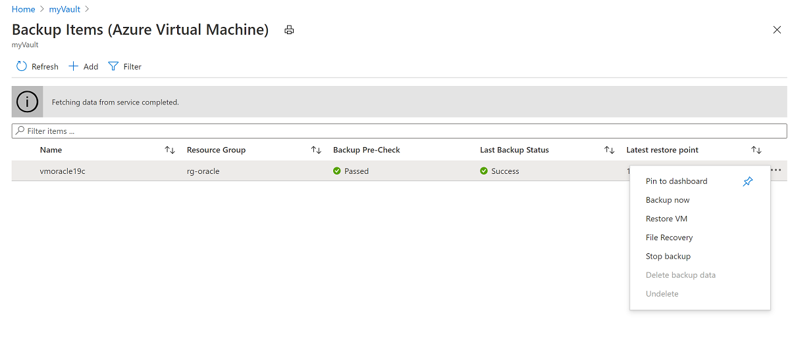
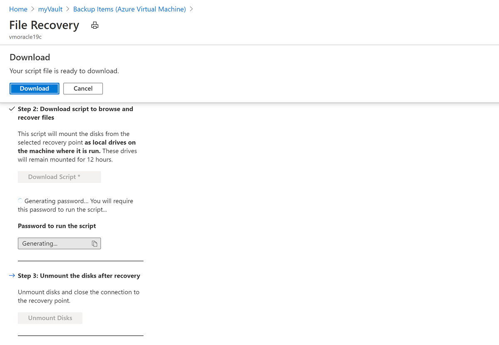

# Back up and recover an Oracle Database 19c database on an Azure Linux VM using Azure Backup

This article demonstrates the use of Azure Backup to take disk snapshots of the VM disks, which include the database files and fast recovery area. Using Azure Backup you can take full disk snapshots suitable as backups, which are stored in [Recovery Services Vault](../../../backup/backup-azure-recovery-services-vault-overview.md).  Azure Backup also provides application-consistent backups, which ensure additional fixes aren't required to restore the data. Restoring application-consistent data reduces the restoration time, allowing you to quickly return to a running state.

> [!div class="checklist"]
>
> * Back up the database with application-consistent backup
> * Restore and recover the database from a recovery point
> * Restore the VM from from a recovery point

[!INCLUDE [azure-cli-prepare-your-environment.md](../../../../includes/azure-cli-prepare-your-environment.md)]

To perform the backup and recovery process, you must first create a Linux VM that has an installed instance of Oracle Database 19c. The Marketplace image currently used to create the VM is  **Oracle:oracle-database-19-3:oracle-database-19-0904:latest**. Follow the steps in the [Oracle create database quickstart](./oracle-database-quick-create.md) to create an Oracle database to complete this tutorial.


## Prepare the environment

To prepare the environment, complete these steps:

1. Connect to the VM.
1. Prepare the database.

### Connect to the VM

1. To create a Secure Shell (SSH) session with the VM, use the following command. Replace the IP address and the host name combination with the `<publicIpAddress>` value for your VM.
    
   ```bash
   ssh azureuser@<publicIpAddress>
   ```
   
1. Switch to the *root* user:

   ```bash
   sudo su -
   ```
    
1. Add the oracle user to the */etc/sudoers* file:

   ```bash
   echo "oracle   ALL=(ALL)      NOPASSWD: ALL" >> /etc/sudoers
   ```

### Prepare the database

This step assumes that you have an Oracle instance (*test*) that is running on a VM named *vmoracle19c*.

1. Switch user to the *oracle* user:
 
   ```bash
    sudo su - oracle
    ```
    
2. Before you connect, you need to set the environment variable ORACLE_SID:
    
    ```bash
    export ORACLE_SID=test;
    ```

    You should also add the ORACLE_SID variable to the `oracle` users `.bashrc` file for future sign-ins using the following command:

    ```bash
    echo "export ORACLE_SID=test" >> ~oracle/.bashrc
    ```
    
3. Start the Oracle listener if it's not already running:

    ```output
    $ lsnrctl start
    ```

    The output should look similar to the following example:

    ```bash
    LSNRCTL for Linux: Version 19.0.0.0.0 - Production on 18-SEP-2020 03:23:49

    Copyright (c) 1991, 2019, Oracle.  All rights reserved.

    Starting /u01/app/oracle/product/19.0.0/dbhome_1/bin/tnslsnr: please wait...

    TNSLSNR for Linux: Version 19.0.0.0.0 - Production
    System parameter file is /u01/app/oracle/product/19.0.0/dbhome_1/network/admin/listener.ora
    Log messages written to /u01/app/oracle/diag/tnslsnr/vmoracle19c/listener/alert/log.xml
    Listening on: (DESCRIPTION=(ADDRESS=(PROTOCOL=tcp)(HOST=vmoracle19c.eastus.cloudapp.azure.com)(PORT=1521)))
    Listening on: (DESCRIPTION=(ADDRESS=(PROTOCOL=ipc)(KEY=EXTPROC1521)))

    Connecting to (DESCRIPTION=(ADDRESS=(PROTOCOL=TCP)(HOST=vmoracle19c.eastus.cloudapp.azure.com)(PORT=1521)))
    STATUS of the LISTENER
    ------------------------
    Alias                     LISTENER
    Version                   TNSLSNR for Linux: Version 19.0.0.0.0 - Production
    Start Date                18-SEP-2020 03:23:49
    Uptime                    0 days 0 hr. 0 min. 0 sec
    Trace Level               off
    Security                  ON: Local OS Authentication
    SNMP                      OFF
    Listener Parameter File   /u01/app/oracle/product/19.0.0/dbhome_1/network/admin/listener.ora
    Listener Log File         /u01/app/oracle/diag/tnslsnr/vmoracle19c/listener/alert/log.xml
    Listening Endpoints Summary...
     (DESCRIPTION=(ADDRESS=(PROTOCOL=tcp)(HOST=vmoracle19c.eastus.cloudapp.azure.com)(PORT=1521)))
    (DESCRIPTION=(ADDRESS=(PROTOCOL=ipc)(KEY=EXTPROC1521)))
    The listener supports no services
    The command completed successfully
    ```

4.  Create the Fast Recovery Area (FRA) location:

    ```bash
    mkdir /u02/fast_recovery_area
    ```

5.  Connect to the database:

    ```bash
    SQL> sqlplus / as sysdba
    ```

6.  Start the database if it's not already running:

    ```bash
    SQL> startup
    ```

7.  Set database environment variables for fast recovery area:

    ```bash
    SQL> alter system set db_recovery_file_dest_size=4096M scope=both;
    SQL> alter system set db_recovery_file_dest='/u02/fast_recovery_area' scope=both;
    ```
    
8.  Make sure the database is in archive log mode to enable online backups.

    Check the log archive status first:

    ```bash
    SQL> SELECT log_mode FROM v$database;

    LOG_MODE
    ------------
    NOARCHIVELOG
    ```

    If it's in NOARCHIVELOG mode, run the following commands:

    ```bash
    SQL> SHUTDOWN IMMEDIATE;
    SQL> STARTUP MOUNT;
    SQL> ALTER DATABASE ARCHIVELOG;
    SQL> ALTER DATABASE OPEN;
    SQL> ALTER SYSTEM SWITCH LOGFILE;
    ```

9.  Create a table to test the backup and restore operations:

    ```bash
    SQL> create user scott identified by tiger quota 100M on users;
    SQL> grant create session, create table to scott;
    connect scott/tiger
    SQL> create table scott_table(col1 number, col2 varchar2(50));
    SQL> insert into scott_table VALUES(1,'Line 1');
    SQL> commit;
    SQL> quit
    ```

10. Configure RMAN to back up to the Fast Recovery Area located on the VM disk:

    ```bash
    $ rman target /
    RMAN> configure snapshot controlfile name to '/u02/fast_recovery_area/snapcf_ev.f';
    RMAN> configure channel 1 device type disk format '/u02/fast_recovery_area/%d/Full_%d_%U_%T_%s';
    RMAN> configure channel 2 device type disk format '/u02/fast_recovery_area/%d/Full_%d_%U_%T_%s'; 
    ```

11. Confirm the configuration change details:

    ```bash
    RMAN> show all;
    ```    

12.  Now run the backup. The following command will take a full database backup, including archive logfiles, as a backupset in compressed format:

     ```bash
     RMAN> backup as compressed backupset database plus archivelog;
     ```

## Using Azure Backup (Preview)

The Azure Backup service provides simple, secure, and cost-effective solutions to back up your data and recover it from the Microsoft Azure cloud. Azure Backup provides independent and isolated backups to guard against accidental destruction of original data. Backups are stored in a Recovery Services vault with built-in management of recovery points. Configuration and scalability are simple, backups are optimized, and you can easily restore as needed.

Azure Backup service provides a [framework](../../../backup/backup-azure-linux-app-consistent.md) to achieve application consistency during backups of Windows and Linux VMs for various applications like Oracle, MySQL, Mongo DB and PostGreSQL. This involves invoking a pre-script (to quiesce the applications) before taking a snapshot of disks and calling post-script (commands to unfreeze the applications) after the snapshot is completed, to return the applications to the normal mode. While sample pre-scripts and post-scripts are provided on GitHub, the creation and maintenance of these scripts is your responsibility.

Now Azure Backup is providing an enhanced pre-scripts and post-script framework (**which is currently in preview**), where the Azure Backup service will provide packaged pre-scripts and post-scripts for selected applications. Azure Backup users just need to name the application and then Azure VM backup will automatically invoke the relevant pre-post scripts. The packaged pre-scripts and post-scripts will be maintained by the Azure Backup team and so users can be assured of the support, ownership, and validity of these scripts. Currently, the supported applications for the enhanced framework are *Oracle* and *MySQL*.

In this section, you will use Azure Backup enhanced framework to take application-consistent snapshots of your running VM and Oracle database. The database will be placed into backup mode allowing a transactionally consistent online backup to occur while Azure Backup takes a snapshot of the VM disks. The snapshot will be a full copy of the storage and not an incremental or Copy on Write snapshot, so it is an effective medium to restore your database from. The advantage of using Azure Backup application-consistent snapshots is that they are extremely fast to take no matter how large your database is, and a snapshot can be used for restore operations as soon as it is taken, without having to wait for it to be transferred to the Recovery Services vault.

To use Azure Backup to back up the database, complete these steps:

1. Prepare the environment for an application-consistent backup.
1. Set up application-consistent backups.
1. Trigger an application-consistent backup of the VM.

### Prepare the environment for an application-consistent backup

1. Switch to the *root* user:

   ```bash
   sudo su -
   ```

1. Create new backup user:

   ```bash
   useradd -G backupdba azbackup
   ```
   
2. Set up the backup user environment:

   ```bash
   echo "export ORACLE_SID=test" >> ~azbackup/.bashrc
   echo export ORACLE_HOME=/u01/app/oracle/product/19.0.0/dbhome_1 >> ~azbackup/.bashrc
   echo export PATH='$ORACLE_HOME'/bin:'$PATH' >> ~azbackup/.bashrc
   ```
   
3. Set up external authentication for the new backup user. The backup user needs to be able to access the database using external authentication, so as not to be challenged by a password.

   First, switch back to the *oracle* user:

   ```bash
   su - oracle
   ```

   Log in to the database using sqlplus and check the default settings for external authentication:
   
   ```bash
   sqlplus / as sysdba
   SQL> show parameter os_authent_prefix
   SQL> show parameter remote_os_authent
   ```
   
   The output should look like this example: 

   ```output
   NAME                                 TYPE        VALUE
   ------------------------------------ ----------- ------------------------------
   os_authent_prefix                    string      ops$
   remote_os_authent                    boolean     FALSE
   ```

   Now, create a database user *azbackup* authenticated externally and grant sysbackup privilege:
   
   ```bash
   SQL> CREATE USER ops$azbackup IDENTIFIED EXTERNALLY;
   SQL> GRANT CREATE SESSION, ALTER SESSION, SYSBACKUP TO ops$azbackup;
   ```

   > [!IMPORTANT] 
   > If you receive error `ORA-46953: The password file is not in the 12.2 format.`  when you run the `GRANT` statement, follow these steps to migrate the orapwd file to 12.2 format:
   >
   > 1. Exit sqlplus.
   > 1. Move the password file with the old format to a new name.
   > 1. Migrate the password file.
   > 1. Remove the old file.
   > 1. Run the following command:
   >
   >    ```bash
   >    mv $ORACLE_HOME/dbs/orapwtest $ORACLE_HOME/dbs/orapwtest.tmp
   >    orapwd file=$ORACLE_HOME/dbs/orapwtest input_file=$ORACLE_HOME/dbs/orapwtest.tmp
   >    rm $ORACLE_HOME/dbs/orapwtest.tmp
   >    ```
   >
   > 1. Rerun the `GRANT` operation in sqlplus.
   >
   
4. Create a stored procedure to log backup messages to the database alert log:

   ```bash
   sqlplus / as sysdba
   SQL> GRANT EXECUTE ON DBMS_SYSTEM TO SYSBACKUP;
   SQL> CREATE PROCEDURE sysbackup.azmessage(in_msg IN VARCHAR2)
   AS
     v_timestamp     VARCHAR2(32);
   BEGIN
     SELECT TO_CHAR(SYSDATE, 'YYYY-MM-DD HH24:MI:SS')
     INTO v_timestamp FROM DUAL;
     DBMS_OUTPUT.PUT_LINE(v_timestamp || ' - ' || in_msg);
     SYS.DBMS_SYSTEM.KSDWRT(SYS.DBMS_SYSTEM.ALERT_FILE, in_msg);
   END azmessage;
   /
   SQL> SHOW ERRORS
   SQL> QUIT
   ```
   
### Set up application-consistent backups  

1. Switch to the *root* user:

   ```bash
   sudo su -
   ```

2. Check for "etc/azure" folder. If that is not present, create the application-consistent backup working directory:

   ```bash
   if [ ! -d "/etc/azure" ]; then
      sudo mkdir /etc/azure
   fi
   ```

3. Check for "workload.conf" within the folder. If that is not present, create a file in the */etc/azure* directory called *workload.conf* with the following contents, which must begin with `[workload]`. If the file is already present, then just edit the fields such that it matches the following content. Otherwise, the following command will create the file and populate the contents:

   ```bash
   echo "[workload]
   workload_name = oracle
   command_path = /u01/app/oracle/product/19.0.0/dbhome_1/bin/
   timeout = 90
   linux_user = azbackup" > /etc/azure/workload.conf
   ```

### Trigger an application-consistent backup of the VM

# [Portal](#tab/azure-portal)

1.  In the Azure portal, go to your resource group **rg-oracle** and click on your Virtual Machine **vmoracle19c**.

2.  On the **Backup** blade, create a new **Recovery Services Vault** in the resource group **rg-oracle** with the name **myVault**.
    For **Choose backup policy**, use **(new) DailyPolicy**. If you want to change the backup frequency or retention range select **Create a new policy** instead.

    

3.  To continue, click **Enable Backup**.

    > [!IMPORTANT]
    > After you click **Enable backup**, the backup process doesn't start until the scheduled time expires. To set up an immediate backup, complete the next step.

4. From the resource group page, click on your newly created Recovery Services Vault **myVault**. Hint: You may need to refresh the page to see it.

5.  On the **myVault - Backup items** blade, under **BACKUP ITEM COUNT**, select the backup item count.

    

6.  On the **Backup Items (Azure Virtual Machine)** blade, on the right side of the page, click the ellipsis (**...**) button, and then click **Backup now**.

    

7.  Accept the default Retain Backup Till value and click the **OK** button. Wait for the backup process to finish. 

    To view the status of the backup job, click **Backup Jobs**.

    

    The status of the backup job appears in the following image:

    
    
    Note that while it only takes seconds to execute the snapshot it can take some time to transfer it to the vault, and the backup job is not completed until the transfer is finished.

8. For an application-consistent backup, address any errors in the log file. The log file is located at /var/log/azure/Microsoft.Azure.RecoveryServices.VMSnapshotLinux/extension.log.

# [Azure CLI](#tab/azure-cli)

1. Create a Recovery services vault:

   ```azurecli
   az backup vault create --location eastus --name myVault --resource-group rg-oracle
   ```

2. Enable backup protection for the VM:

   ```azurecli
   az backup protection enable-for-vm \
      --resource-group rg-oracle \
      --vault-name myVault \
      --vm vmoracle19c \
      --policy-name DefaultPolicy
   ```

3. Trigger a backup to run now rather than waiting for the backup to trigger at the default schedule (5 AM UTC): 

   ```azurecli
   az backup protection backup-now \
      --resource-group rg-oracle \
      --vault-name myVault \
      --backup-management-type AzureIaasVM \
      --container-name vmoracle19c \
      --item-name vmoracle19c 
   ```

   You can monitor the progress of the backup job using `az backup job list` and `az backup job show`.

---

## Recovery

To recover the database, complete these steps:

1. Remove the database files.
1. Generate a restore script from the Recovery Services vault.
1. Mount the restore point.
1. Perform recovery.

### Remove the database files 

Later in this article, you'll learn how to test the recovery process. Before you can test the recovery process, you have to remove the database files.

1.  Shut down the Oracle instance:

    ```bash
    sqlplus / as sysdba
    SQL> shutdown abort
    ORACLE instance shut down.
    ```

2.  Remove the datafiles and backups:

    ```bash
    sudo su - oracle
    cd /u02/oradata/TEST
    rm -f *.dbf
    cd /u02/fast_recovery_area
    rm -f *
    ```

### Generate a restore script from the Recovery Services vault

# [Portal](#tab/azure-portal)

1. In the Azure portal, search for the *myVault* Recovery Services vaults item and select it.

    

2. On the **Overview** blade, select **Backup items** and the select **Azure Virtual Machine**, which should have anon-zero Backup Item Count listed.

    

3. On the Backups Items (Azure Virtual Machines) page, your VM **vmoracle19c** is listed. Click the ellipsis on the right to bring up the menu and select **File Recovery**.

    

4. On the **File Recovery (Preview)** pane, click **Download Script**. Then, save the download (.py) file to a folder on the client computer. A password is generated to the run the script. Copy the password to a file for use later. 

    

5. Copy the .py file to the VM.

    The following example shows how you to use a secure copy (scp) command to move the file to the VM. You also can copy the contents to the clipboard, and then paste the contents in a new file that is set up on the VM.

    > [!IMPORTANT]
    > In the following example, ensure that you update the IP address and folder values. The values must map to the folder where the file is saved.
    >

    ```bash
    $ scp vmoracle19c_xxxxxx_xxxxxx_xxxxxx.py azureuser@<publicIpAddress>:/tmp
    ```

# [Azure CLI](#tab/azure-cli)

To list recovery points for your VM, use az backup recovery point list. In this example, we select the most recent recovery point for the VM named myVM that's protected in myRecoveryServicesVault:

```azurecli
   az backup recoverypoint list \
      --resource-group rg-oracle \
      --vault-name myVault \
      --backup-management-type AzureIaasVM \
      --container-name vmoracle19c \
      --item-name vmoracle19c \
      --query [0].name \
      --output tsv
```

To obtain the script that connects, or mounts, the recovery point to your VM, use az backup restore files mount-rp. The following example obtains the script for the VM named myVM that's protected in myRecoveryServicesVault.

Replace myRecoveryPointName with the name of the recovery point that you obtained in the preceding command:

```azurecli
   az backup restore files mount-rp \
      --resource-group rg-oracle \
      --vault-name myVault \
      --container-name vmoracle19c \
      --item-name vmoracle19c \
      --rp-name myRecoveryPointName
```

The script is downloaded and a password is displayed, as in the following example:

```bash
   File downloaded: vmoracle19c_eus_4598131610710119312_456133188157_6931c635931f402eb543ee554e1cf06f102c6fc513d933.py. Use password c4487e40c760d29
```

Copy the .py file to the VM.

The following example shows how you to use a secure copy (scp) command to move the file to the VM. You also can copy the contents to the clipboard, and then paste the contents in a new file that is set up on the VM.

> [!IMPORTANT]
> In the following example, ensure that you update the IP address and folder values. The values must map to the folder where the file is saved.
>

```bash
$ scp vmoracle19c_xxxxxx_xxxxxx_xxxxxx.py azureuser@<publicIpAddress>:/tmp
```
---

### Mount the restore point

1. Create a restore mount point and copy the script to it.

    In the following example, create a */restore* directory for the snapshot to mount to, move the file to the directory, and change the file so that it's owned by the root user and made executable.

    ```bash 
    ssh azureuser@<publicIpAddress>
    sudo su -
    mkdir /restore
    chmod 777 /restore
    cd /restore
    cp /tmp/vmoracle19c_xxxxxx_xxxxxx_xxxxxx.py /restore
    chmod 755 /restore/vmoracle19c_xxxxxx_xxxxxx_xxxxxx.py
    ```
    
    Now execute the script to restore the backup. You will be asked to supply the password generated in Azure portal. 
  
   ```bash
    ./vmoracle19c_xxxxxx_xxxxxx_xxxxxx.py
    ```

    The following example shows what you should see after you run the preceding script. When you're prompted to continue, enter **Y**.

    ```output
    Microsoft Azure VM Backup - File Recovery
    ______________________________________________
    Please enter the password as shown on the portal to securely connect to the recovery point. : b1ad68e16dfafc6

    Connecting to recovery point using ISCSI service...

    Connection succeeded!

    Please wait while we attach volumes of the recovery point to this machine...

    ************ Volumes of the recovery point and their mount paths on this machine ************

    Sr.No.  |  Disk  |  Volume  |  MountPath

    1)  | /dev/sdc  |  /dev/sdc1  |  /restore/vmoracle19c-20201215123912/Volume1

    2)  | /dev/sdd  |  /dev/sdd1  |  /restore/vmoracle19c-20201215123912/Volume2

    3)  | /dev/sdd  |  /dev/sdd2  |  /restore/vmoracle19c-20201215123912/Volume3

    4)  | /dev/sdd  |  /dev/sdd15  |  /restore/vmoracle19c-20201215123912/Volume5

    The following partitions failed to mount since the OS couldn't identify the filesystem.

    ************ Volumes from unknown filesystem ************

    Sr.No.  |  Disk  |  Volume  |  Partition Type

    1)  | /dev/sdb  |  /dev/sdb14  |  BIOS Boot partition

    Please refer to '/restore/vmoracle19c-2020XXXXXXXXXX/Scripts/MicrosoftAzureBackupILRLogFile.log' for more details.

    ************ Open File Explorer to browse for files. ************

    After recovery, remove the disks and close the connection to the recovery point by clicking the 'Unmount Disks' button from the portal or by using the relevant unmount command in case of powershell or CLI.

    After unmounting disks, run the script with the parameter 'clean' to remove the mount paths of the recovery point from this machine.

    Please enter 'q/Q' to exit...
    ```

2. Access to the mounted volumes is confirmed.

    To exit, enter **q**, and then search for the mounted volumes. To create a list of the added volumes, at a command prompt, enter **df -h**.
    
    ```
    [root@vmoracle19c restore]# df -h
    Filesystem      Size  Used Avail Use% Mounted on
    devtmpfs        3.8G     0  3.8G   0% /dev
    tmpfs           3.8G     0  3.8G   0% /dev/shm
    tmpfs           3.8G   17M  3.8G   1% /run
    tmpfs           3.8G     0  3.8G   0% /sys/fs/cgroup
    /dev/sdd2        30G  9.6G   18G  36% /
    /dev/sdb1       126G  736M  119G   1% /u02
    /dev/sda1       497M  199M  298M  41% /boot
    /dev/sda15      495M  9.7M  486M   2% /boot/efi
    tmpfs           771M     0  771M   0% /run/user/54322
    /dev/sdc1       126G  2.9G  117G   3% /restore/vmoracle19c-20201215123912/Volume1
    /dev/sdd1       497M  199M  298M  41% /restore/vmoracle19c-20201215123912/Volume2
    /dev/sdd2        30G  9.6G   18G  36% /restore/vmoracle19c-20201215123912/Volume3
    /dev/sdd15      495M  9.7M  486M   2% /restore/vmoracle19c-20201215123912/Volume5
    ```

### Perform recovery

1. Copy the missing backup files back to the fast recovery area:

    ```bash
    cd /restore/vmoracle19c-2020XXXXXXXXXX/Volume1/fast_recovery_area/TEST
    cp * /u02/fast_recovery_area/TEST
    cd /u02/fast_recovery_area/TEST
    chown -R oracle:oinstall *
    ```

2. The following commands use RMAN to restore the missing datafiles and recover the database:

    ```bash
    sudo su - oracle
    rman target /
    RMAN> startup mount;
    RMAN> restore database;
    RMAN> recover database;
    RMAN> alter database open;
    ```
    
3. Check the database content has been fully recovered:

    ```bash
    RMAN> SELECT * FROM scott.scott_table;
    ```

4. Unmount the restore point.

   ```bash
   umount /restore/vmoracle19c-20210107110037/Volume*
   ```

    In the Azure portal, on the **File Recovery (Preview)** blade, click **Unmount Disks**.

    
    
    You can also unmount the recovery volumes by running the python script again with the **-clean** option.

## Restore the entire VM

Instead of restoring the deleted files from the Recovery Services vaults, you can restore the entire VM.

To restore the entire VM, complete these steps:

1. Stop and delete vmoracle19c.
1. Recover the VM.
1. Set the public IP address.
1. Connect to the VM.
1. Start the database to mount stage and perform recovery.

### Stop and delete vmoracle19c

# [Portal](#tab/azure-portal)

1. In the Azure portal, go to the **vmoracle19c** Virtual Machine, and then select **Stop**.

1. When the Virtual Machine is no longer running, select **Delete** and then **Yes**.

   

# [Azure CLI](#tab/azure-cli)

1. Stop and deallocate the VM:

    ```azurecli
    az vm deallocate --resource-group rg-oracle --name vmoracle19c
    ```

2. Delete the VM. Enter 'y' when prompted:

    ```azurecli
    az vm delete --resource-group rg-oracle --name vmoracle19c
    ```

---

### Recover the VM

# [Portal](#tab/azure-portal)

1. Create a storage account for staging in the Azure portal.

   1. In the Azure portal, select **+ Create a resource** and search for and select **Storage Account**.
    
      
    
    
   1. In the Create storage account page, choose your existing resource group **rg-oracle**, name your storage account **oracrestore** and choose **Storage V2 (generalpurpose v2)** for Account Kind. Change Replication to **Locally-redundant storage (LRS)** and set Performance to **Standard**. Ensure that Location is set to the same region as all your other resources in the resource group. 
    
      
   
   1. Click on Review + Create and then click Create.

2. In the Azure portal, search for the *myVault* Recovery Services vaults item and click on it.

    
    
3.  On the **Overview** blade, select **Backup items** and the select **Azure Virtual Machine**, which should have anon-zero Backup Item Count listed.

    

4.  On the Backups Items (Azure Virtual Machines), page your VM **vmoracle19c** is listed. Click on the VM name.

    

5.  On the **vmoracle19c** blade, choose a restore point that has a consistency type of **Application Consistent** and click the ellipsis (**...**) on the right to bring up the menu.  From the menu click **Restore VM**.

    

6.  On the **Restore Virtual Machine** blade, choose **Create New** and **Create New Virtual Machine**. Enter the virtual machine name **vmoracle19c** and choose the VNet **vmoracle19cVNET**, the subnet will be automatically populated for you based on your VNet selection. The restore VM process requires an Azure storage account in the same resource group and region. You can choose the storage account **orarestore** you setup earlier.

    

7.  To restore the VM, click the **Restore** button.

8.  To view the status of the restore process, click **Jobs**, and then click **Backup Jobs**.

    

    Click on the **In Progress** restore operation to show the status of the restore process:

    

# [Azure CLI](#tab/azure-cli)

To set up your storage account and file share, run the following commands in Azure CLI.

1. Create the storage account in the same resource group and location as your VM:

   ```azurecli
   az storage account create -n orarestore -g rg-oracle -l eastus --sku Standard_LRS
   ```

2. Retrieve the list of recovery points available. 

   ```azurecli
   az backup recoverypoint list \
      --resource-group rg-oracle \
      --vault-name myVault \
      --backup-management-type AzureIaasVM \
      --container-name vmoracle19c \
      --item-name vmoracle19c \
      --query [0].name \
      --output tsv
   ```

3. Restore the recovery point to the storage account. Substitute `<myRecoveryPointName>` with a recovery point from the list generated in the previous step:

   ```azurecli
   az backup restore restore-disks \
      --resource-group rg-oracle \
      --vault-name myVault \
      --container-name vmoracle19c \
      --item-name vmoracle19c \
      --storage-account orarestore \
      --rp-name <myRecoveryPointName> \
      --target-resource-group rg-oracle
   ```

4. Retrieve the restore job details. The following command gets more details for the triggered restored job, including its name, which is needed to retrieve the template URI. 

   ```azurecli
   az backup job list \
       --resource-group rg-oracle \
       --vault-name myVault \
       --output table
   ```

   The output will look similar to this `(Note down the name of the restore job)`:

   ```output
   Name                                  Operation        Status     Item Name    Start Time UTC                    Duration
   ------------------------------------  ---------------  ---------  -----------  --------------------------------  --------------
   c009747a-0d2e-4ac9-9632-f695bf874693  Restore          Completed  vmoracle19c  2021-01-10T21:46:07.506223+00:00  0:03:06.634177
   6b779c98-f57a-4db1-b829-9e8eab454a52  Backup           Completed  vmoracle19c  2021-01-07T10:11:15.784531+00:00  0:21:13.220616
   502bc7ae-d429-4f0f-b78e-51d41b7582fc  ConfigureBackup  Completed  vmoracle19c  2021-01-07T09:43:55.298755+00:00  0:00:30.839674
   ```

5. Retrieve the details of the URI to use for recreating the VM. Substitute the restore job name from the previous step for `<RestoreJobName>`.

    ```azurecli
      az backup job show \
        -v myVault \
        -g rg-oracle \
        -n <RestoreJobName> \
        --query properties.extendedInfo.propertyBag
    ```

   Output is similar to this:

   ```output
   {
   "Config Blob Container Name": "vmoracle19c-75aefd4b34c64dd39fdcd3db579783f2",
   "Config Blob Name": "config-vmoracle19c-c009747a-0d2e-4ac9-9632-f695bf874693.json",
   "Config Blob Uri": "https://orarestore.blob.core.windows.net/vmoracle19c-75aefd4b34c64dd39fdcd3db579783f2/config-vmoracle19c-c009747a-0d2e-4ac9-9632-f695bf874693.json",
   "Job Type": "Recover disks",
   "Recovery point time ": "1/7/2021 10:11:19 AM",
   "Target Storage Account Name": "orarestore",
   "Target resource group": "rg-oracle",
   "Template Blob Uri": "https://orarestore.blob.core.windows.net/vmoracle19c-75aefd4b34c64dd39fdcd3db579783f2/azuredeployc009747a-0d2e-4ac9-9632-f695bf874693.json"
   }
   ```

   The template name, which is at the end of Template Blob Uri, which in this example is `azuredeployc009747a-0d2e-4ac9-9632-f695bf874693.json`, and the Blob container name, which is `vmoracle19c-75aefd4b34c64dd39fdcd3db579783f2` are listed. 

   Use these values in the following command to assign variables in preparation for creating the VM. A SAS key is generated for the storage container with 30-minutes duration.  


   ```azurecli
   expiretime=$(date -u -d "30 minutes" '+%Y-%m-%dT%H:%MZ')
   connection=$(az storage account show-connection-string \
    --resource-group rg-oracle \
    --name orarestore \
    --query connectionString)
   token=$(az storage blob generate-sas \
    --container-name <ContainerName> \
    --name <TemplateName> \
    --expiry $expiretime \
    --permissions r \
    --output tsv \
    --connection-string $connection)
   url=$(az storage blob url \
    --container-name <ContainerName> \
    --name <TemplateName> \
    --connection-string $connection \
    --output tsv)
   ```

   Now deploy the template to create the VM.

   ```azurecli
   az deployment group create \
      --resource-group rg-oracle \
      --template-uri $url?$token
   ```

   You will be prompted to provide a name for the VM.

---

### Set the public IP address

After the VM is restored, you should reassign the original IP address to the new VM.

# [Portal](#tab/azure-portal)

1.  In the Azure portal, go to your Virtual Machine **vmoracle19c**. You will notice it has been assigned a new public IP and NIC similar to vmoracle19c-nic-XXXXXXXXXXXX, but does not have a DNS address. When the original VM was deleted its public IP and NIC are retained and the next steps will reattach them to the new VM.

    

2.  Stop the VM

    

3.  Go to **Networking**

    

4.  Click on **Attach network interface**, choose the original NIC **vmoracle19cVMNic, which the original public IP address is still associated to, and click **OK**

    

5.  Now you must detach the NIC that was created with the VM restore operation as it is configured as the primary interface. Click on **Detach network interface** and choose the new NIC similar to **vmoracle19c-nic-XXXXXXXXXXXX**, then click **OK**

    
    
    Your recreated VM will now have the original NIC, which is associated with the original IP address and Network Security Group rules
    
    
    
6.  Go back to the **Overview** and click **Start** 

# [Azure CLI](#tab/azure-cli)

1. Stop and deallocate the VM:

   ```azurecli
   az vm deallocate --resource-group rg-oracle --name vmoracle19c
   ```

2. List the current, restore generated VM NIC

   ```azurecli
   az vm nic list --resource-group rg-oracle --vm-name vmoracle19c
   ```

   The output will look similar to this, which lists the restore generated NIC name as `vmoracle19cRestoredNICc2e8a8a4fc3f47259719d5523cd32dcf`

   ```output
   {
    "id": "/subscriptions/xxxxxxxx-xxxx-xxxx-xxxx-xxxxxxxx/resourceGroups/rg-oracle/providers/Microsoft.Network/networkInterfaces/vmoracle19cRestoredNICc2e8a8a4fc3f47259719d5523cd32dcf",
    "primary": true,
    "resourceGroup": "rg-oracle"
   }
   ```

3. Attach original NIC, which should have a name of `<VMName>VMNic`, in this case `vmoracle19cVMNic`. The original Public IP address is still attached to this NIC and will be restored to the VM when the NIC is reattached. 

   ```azurecli
   az vm nic add --nics vmoracle19cVMNic --resource-group rg-oracle --vm-name vmoracle19c
   ```

4. Detach the restore generated NIC

   ```azurecli
   az vm nic remove --nics vmoracle19cRestoredNICc2e8a8a4fc3f47259719d5523cd32dcf --resource-group rg-oracle --vm-name vmoracle19c
   ```

5. Start the VM:

   ```azurecli
   az vm start --resource-group rg-oracle --name vmoracle19c
   ```

---

### Connect to the VM

To connect to the VM, use the following script:

```azurecli
ssh <publicIpAddress>
```

### Start the database to mount stage and perform recovery

1. You may find that the instance is running as the auto start has attempted to start the database on VM boot. However the database requires recovery and is likely to be at mount stage only, so a preparatory shutdown is run first.

    ```bash
    $ sudo su - oracle
    $ sqlplus / as sysdba
    SQL> shutdown immediate
    SQL> startup mount
    SQL> recover automatic database;
    SQL> alter database open;
    ```
    
1. Check the database content has been recovered:

    ```bash
    SQL> select * from scott.scott_table;
    ```

The backup and recovery of the Oracle Database 19c database on an Azure Linux VM is now finished.

## Delete the VM

When you no longer need the VM, you can use the following command to remove the resource group, the VM, and all related resources:

```azurecli
az group delete --name rg-oracle
```

## Next steps

[Tutorial: Create highly available VMs](../../linux/create-cli-complete.md)

[Explore VM deployment Azure CLI samples](https://github.com/Azure-Samples/azure-cli-samples/tree/master/virtual-machine)