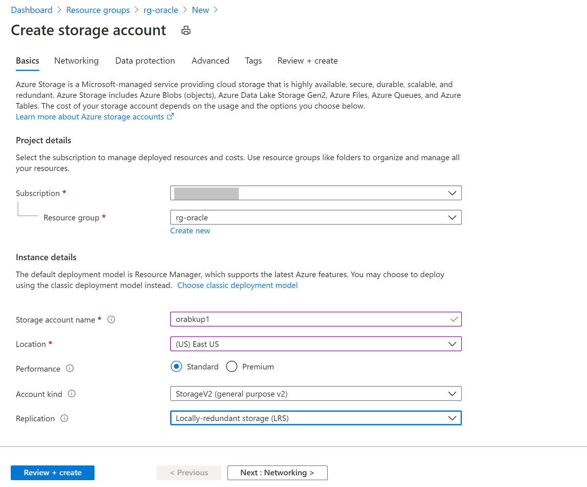
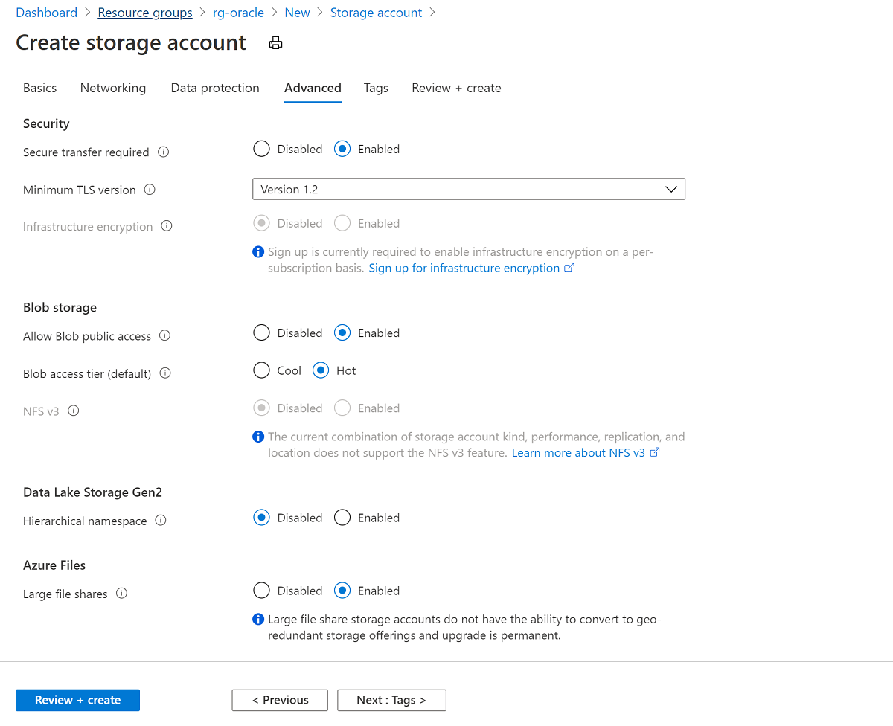
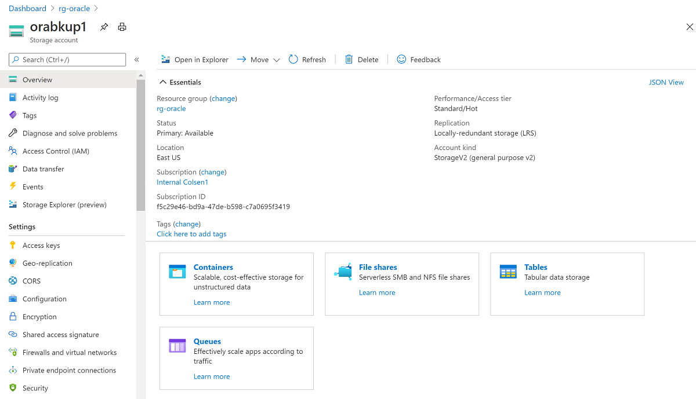
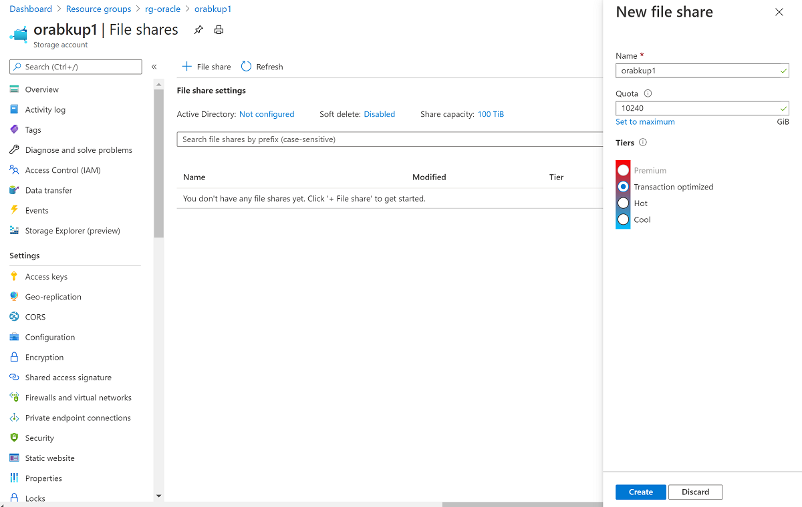
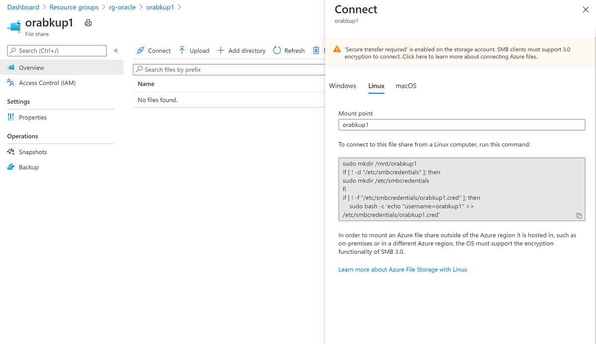

# Back up and recover Oracle Database on an Azure Linux VM by using Azure Files

**Applies to:** :heavy_check_mark: Linux VMs

This article demonstrates the use of Azure Files as a medium to back up and restore an Oracle database running on an Azure virtual machine (VM). The steps in this article have been tested against Oracle 12.1 and later.

In this article, you use Oracle Recovery Manager (RMAN) to back up the database to an Azure file share mounted to a VM via the Server Message Block (SMB) protocol. Using Azure Files for backup media is cost-effective and performant. However, for very large databases, Azure Backup provides a better solution.

[!INCLUDE [azure-cli-prepare-your-environment.md](~/reusable-content/azure-cli/azure-cli-prepare-your-environment.md)]

- To perform the backup and recovery process, you must first create a Linux VM that has an installed instance of Oracle Database. We recommend using Oracle 12.x or later.

- Create an Oracle Database instance by following the steps in [Create an Oracle Database instance in an Azure VM](./oracle-database-quick-create.md).

## Prepare the database environment

1. To create a Secure Shell (SSH) session with the VM, use the following command. Replace `<publicIpAddress>` with the public address value for your VM.

   ```bash
   ssh azureuser@<publicIpAddress>
   ```

2. Switch to the root user:

   ```bash
   sudo su -
   ```

3. Add the `oracle` user to the */etc/sudoers* file:

   ```bash
   echo "oracle   ALL=(ALL)      NOPASSWD: ALL" >> /etc/sudoers
   ```

4. This step assumes that you have an Oracle instance (test) that's running on a VM named *vmoracle19c*.

   Switch to the `oracle` user:

   ```bash
   sudo su - oracle
   ```

5. Before you connect, set the environment variable `ORACLE_SID`:

    ```bash
    export ORACLE_SID=test;
    ```

   You should also add the `ORACLE_SID` variable to the `oracle` user's *.bashrc* file for future sign-ins by using the following command:

    ```bash
    echo "export ORACLE_SID=test" >> ~oracle/.bashrc
    ```

6. Start the Oracle listener if it isn't already running:

   ```bash
   lsnrctl start
   ```

    The output should look similar to the following example:

    ```bash
    LSNRCTL for Linux: Version 19.0.0.0.0 - Production on 18-SEP-2020 03:23:49

    Copyright (c) 1991, 2019, Oracle.  All rights reserved.

    Starting /u01/app/oracle/product/19.0.0/dbhome_1/bin/tnslsnr: please wait...

    TNSLSNR for Linux: Version 19.0.0.0.0 - Production
    System parameter file is /u01/app/oracle/product/19.0.0/dbhome_1/network/admin/listener.ora
    Log messages written to /u01/app/oracle/diag/tnslsnr/vmoracle19c/listener/alert/log.xml
    Listening on: (DESCRIPTION=(ADDRESS=(PROTOCOL=tcp)(HOST=vmoracle19c.eastus.cloudapp.azure.com)(PORT=1521)))
    Listening on: (DESCRIPTION=(ADDRESS=(PROTOCOL=ipc)(KEY=EXTPROC1521)))

    Connecting to (DESCRIPTION=(ADDRESS=(PROTOCOL=TCP)(HOST=vmoracle19c.eastus.cloudapp.azure.com)(PORT=1521)))
    STATUS of the LISTENER
    ------------------------
    Alias                     LISTENER
    Version                   TNSLSNR for Linux: Version 19.0.0.0.0 - Production
    Start Date                18-SEP-2020 03:23:49
    Uptime                    0 days 0 hr. 0 min. 0 sec
    Trace Level               off
    Security                  ON: Local OS Authentication
    SNMP                      OFF
    Listener Parameter File   /u01/app/oracle/product/19.0.0/dbhome_1/network/admin/listener.ora
    Listener Log File         /u01/app/oracle/diag/tnslsnr/vmoracle19c/listener/alert/log.xml
    Listening Endpoints Summary...
     (DESCRIPTION=(ADDRESS=(PROTOCOL=tcp)(HOST=vmoracle19c.eastus.cloudapp.azure.com)(PORT=1521)))
    (DESCRIPTION=(ADDRESS=(PROTOCOL=ipc)(KEY=EXTPROC1521)))
    The listener supports no services
    The command completed successfully
    ```

7. Create the location for the fast recovery area:

    ```bash
    mkdir /u02/fast_recovery_area
    ```

8. Connect to the database:

    ```bash
    sqlplus / as sysdba
    ```

9. Start the database if it isn't already running:

    ```bash
    SQL> startup
    ```

10. Set database environment variables for the fast recovery area:

    ```bash
    SQL> alter system set db_recovery_file_dest_size=4096M scope=both;
    SQL> alter system set db_recovery_file_dest='/u02/fast_recovery_area' scope=both;
    ```

11. Make sure the database is in `ARCHIVELOG` mode to enable online backups.

    Check the log archive status:

    ```bash
    SQL> SELECT log_mode FROM v$database;

    LOG_MODE
    ------------
    NOARCHIVELOG
    ```

    If the log archive is in `NOARCHIVELOG` mode, run the following commands in SQL Plus:

    ```bash
    SQL> SHUTDOWN IMMEDIATE;
    SQL> STARTUP MOUNT;
    SQL> ALTER DATABASE ARCHIVELOG;
    SQL> ALTER DATABASE OPEN;
    SQL> ALTER SYSTEM SWITCH LOGFILE;
    ```

12. Create a table to test the backup and restore operations:

    ```bash
    SQL> create user scott identified by tiger quota 100M on users;
    SQL> grant create session, create table to scott;
    SQL> connect scott/tiger
    SQL> create table scott_table(col1 number, col2 varchar2(50));
    SQL> insert into scott_table VALUES(1,'Line 1');
    SQL> commit;
    SQL> quit
    ```

## Back up to Azure Files

To back up to Azure Files, complete these steps:

1. [Set up Azure Files](#set-up-azure-files).
1. [Mount the Azure file share to your VM](#mount-the-azure-file-share-to-your-vm).
1. [Back up the database](#back-up-the-database).
1. [Restore and recover the database](#restore-and-recover-the-database).

### Set up Azure Files

In this section, you back up the Oracle database to Azure Files by using Oracle RMAN. Azure file shares are fully managed file shares that stay in the cloud. You can access them by using either the SMB protocol or the Network File System (NFS) protocol.

The following procedures cover creating a file share that uses the SMB protocol to mount to your VM. For information about how to mount by using NFS, see [Create an NFS share](../../../storage/files/storage-files-how-to-create-nfs-shares.md).

When you're mounting the Azure file share, use the `cache=none` option to disable caching of file share data. To ensure that the `oracle` user owns the files created in the share, set the `uid=oracle` and `gid=oinstall` options.

# [Portal](#tab/azure-portal)

Set up your storage account:

1. In the Azure portal, select **+ Create a resource**, and then search for and select **Storage Account**.

    

2. On the **Create storage account** pane:
   1. For **Resource group**, select your existing resource group, **rg-oracle**.
   1. For **Storage account name**, enter **oracbkup1**.
   1. Ensure that **Location** is set to the same region as all your other resources in the resource group.
   1. Set **Performance** to **Standard**.
   1. For **Account kind**, select **StorageV2 (general purpose v2)**.
   1. For **Replication**, select **Locally-redundant storage (LRS)**.

    

3. Select the **Advanced** tab. Under **Azure Files**, set **Large file shares** to **Enabled**. Select **Review + Create**, and then select **Create**.

    

4. When the storage account is created, go to the resource and select **File shares**.

    

5. Select **+ File share**, and then on the **New file share** panel:
   1. For **Name**, enter **orabkup1**.
   1. Set **Quota** to **10240** gibibytes (GiB).

      The quota reflects an upper boundary that the file share can grow to. Because you're using standard storage in this example, resources are pay-as-you-go and not provisioned. So, setting the quota to 10 tebibytes (TiB) won't incur costs beyond what you use. If your backup strategy requires more storage, set the quota to an appropriate level to hold all backups.
   1. Under **Tiers**, select **Transaction optimized**.
   1. Select **Create**.

    

6. When the file share is created, select **orabkup1** on the **File share settings** pane.
7. Select the **Connect** tab to open the **Connect** panel, and then select the **Linux** tab. Copy the provided commands to mount the file share by using the SMB protocol.

    

# [Azure CLI](#tab/azure-cli)

To set up your storage account and file share, run the following commands:

1. Create the storage account in the same resource group and location as your VM:

   ```azurecli
   az storage account create -n orabackup1 -g rg-oracle -l eastus --sku Standard_LRS --enable-large-file-share
   ```

2. Create a file share in the storage account with a quota of 10 TiB:

   ```azurecli
   az storage share create --account-name orabackup1 --name orabackup --quota 10240
   ```

3. Retrieve the storage account's primary key (`key1` value). You'll need when you mount the file share to your VM.

   ```azurecli
   az storage account keys list --resource-group rg-oracle --account-name orabackup1
   ```

---

### Mount the Azure file share to your VM

1. Create the mount point:

   ```bash
   sudo mkdir /mnt/orabackup
   ```

2. Set up credentials:

   ```bash
   if [ ! -d "/etc/smbcredentials" ]; then
    sudo mkdir /etc/smbcredentials
   fi
   ```

3. Run the following command. Substitute `<Your Storage Account Key1>` with the storage account key that you retrieved earlier.

   ```bash
   if [ ! -f "/etc/smbcredentials/orabackup1.cred" ]; then
     sudo bash -c 'echo "username=orabackup1" >> /etc/smbcredentials/orabackup1.cred'
     sudo bash -c 'echo "password=<Your Storage Account Key1>" >> /etc/smbcredentials/orabackup1.cred'
   fi
   ```

4. Change permissions on the credentials file:

   ```bash
   sudo chmod 600 /etc/smbcredentials/orabackup1.cred
   ```

5. Add the mount to the */etc/fstab* file:

   ```bash
   sudo bash -c 'echo "//orabackup1.file.core.windows.net/orabackup /mnt/orabackup cifs nofail,vers=3.0,credentials=/etc/smbcredentials/orabackup1.cred,dir_mode=0777,file_mode=0777,serverino,cache=none,uid=oracle,gid=oinstall" >> /etc/fstab'
   ```

6. Run the commands to mount the Azure file share by using the SMB protocol:

   ```bash
   sudo mount -t cifs //orabackup1.file.core.windows.net/orabackup /mnt/orabackup -o vers=3.0,credentials=/etc/smbcredentials/orabackup1.cred,dir_mode=0777,file_mode=0777,serverino,cache=none,uid=oracle,gid=oinstall
   ```

   If you get an error similar to the following example, the Common Internet File System (CIFS) package might not be installed on your Linux host:

   ```output
   mount: wrong fs type, bad option, bad superblock on //orabackup1.file.core.windows.net/orabackup
   ```

   To check if the CIFS package is installed, run the following command:

   ```bash
   sudo rpm -qa|grep cifs-utils
   ```

   If the command returns no output, install the CIFS package by using the following command. Then rerun the `mount` command to mount the Azure file share.

   ```bash
   sudo yum install cifs-utils
   ```

7. Check that the file share is mounted properly by using the following command:

   ```bash
   df -h
   ```

   The output should look similar to this example:

   ```output
   $ df -h
   Filesystem                                    Size  Used Avail Use% Mounted on
   devtmpfs                                      3.3G     0  3.3G   0% /dev
   tmpfs                                         3.3G     0  3.3G   0% /dev/shm
   tmpfs                                         3.3G   17M  3.3G   1% /run
   tmpfs                                         3.3G     0  3.3G   0% /sys/fs/cgroup
   /dev/sda2                                      30G  9.1G   19G  34% /
   /dev/sdc1                                      59G  2.7G   53G   5% /u02
   /dev/sda1                                     497M  199M  298M  41% /boot
   /dev/sda15                                    495M  9.7M  486M   2% /boot/efi
   tmpfs                                         671M     0  671M   0% /run/user/54321
   /dev/sdb1                                      14G  2.1G   11G  16% /mnt/resource
   tmpfs                                         671M     0  671M   0% /run/user/54322
   //orabackup1.file.core.windows.net/orabackup   10T     0   10T   0% /mnt/orabackup
   ```

### Back up the database

In this section, you use Oracle RMAN to take a full backup of the database and archive logs. You then write the backup as a backup set to the Azure file share that you mounted earlier.

1. Configure RMAN to back up to the Azure Files mount point:

    ```bash
    rman target /
    RMAN> configure snapshot controlfile name to '/mnt/orabkup/snapcf_ev.f';
    RMAN> configure channel 1 device type disk format '/mnt/orabkup/%d/Full_%d_%U_%T_%s';
    RMAN> configure channel 2 device type disk format '/mnt/orabkup/%d/Full_%d_%U_%T_%s';
    ```

2. In this example, you're limiting the size of RMAN backup pieces to 4 GiB. However, the RMAN backup `maxpiecesize` value can go up to 4 TiB, which is the file size limit for Azure standard file shares and premium file shares. For more information, see [Azure Files scalability and performance targets](../../../storage/files/storage-files-scale-targets.md).

    ```bash
    RMAN> configure channel device type disk maxpiecesize 4000G;
    ```

3. Confirm the configuration change details:

    ```bash
    RMAN> show all;
    ```

4. Run the backup. The following command takes a full database backup, including archive log files, as a backup set in compressed format:

    ```bash
    RMAN> backup as compressed backupset database plus archivelog;
    ```

You've now backed up the database online by using Oracle RMAN, with the backup located in Azure Files. Because you're storing the backups in Azure Files, you can access them from other VMs if you need to clone the database.

Although using RMAN and Azure Files for database backup has many advantages, backup and restore time is linked to the size of the database. For very large databases, these operations can take considerable time.

An alternative is to use application-consistent VM backups through Azure Backup. This mechanism uses snapshot technology to perform fast backups irrespective of database size. Integration with a Recovery Services vault provides cloud storage of your Oracle Database backups, so you can access them from other VMs and other Azure regions.

### Restore and recover the database

1. Shut down the Oracle instance:

    ```bash
    sqlplus / as sysdba
    SQL> shutdown abort
    ORACLE instance shut down.
    ```

2. Remove the database datafiles:

    ```bash
    cd /u02/oradata/TEST
    rm -f *.dbf
    ```

3. The following commands use RMAN to restore the missing datafiles and recover the database:

    ```bash
    rman target /
    RMAN> startup mount;
    RMAN> restore database;
    RMAN> recover database;
    RMAN> alter database open;
    ```

4. Check that the database content is fully recovered:

    ```bash
    RMAN> SELECT * FROM scott.scott_table;
    ```

The backup and recovery of the Oracle Database 19c database on an Azure Linux VM are now finished.

## Delete the VM

When you no longer need the VM, you can use the following command to remove the resource group, the VM, and all related resources:

```azurecli
az group delete --name rg-oracle
```

## Next steps

[Create highly available VMs](../../linux/create-cli-complete.md)

[Explore Azure CLI samples for VM deployment](https://github.com/Azure-Samples/azure-cli-samples/tree/master/virtual-machine)
