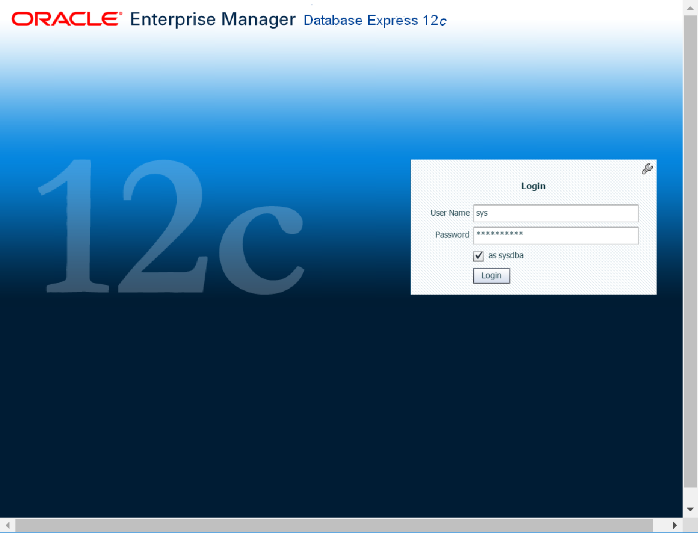

# Create an Oracle Database in an Azure VM

This guide details using the Azure CLI to deploy an Azure virtual machine from the [Oracle marketplace gallery image](https://azuremarketplace.microsoft.com/marketplace/apps/Oracle.OracleDatabase12102EnterpriseEdition?tab=Overview) in order to create an Oracle 12c database. Once the server is deployed, you will connect via SSH in order to configure the Oracle database. 

If you don't have an Azure subscription, create a [free account](https://azure.microsoft.com/free/?WT.mc_id=A261C142F) before you begin.

If you choose to install and use the CLI locally, this quickstart requires that you are running the Azure CLI version 2.0.4 or later. Run `az --version` to find the version. If you need to install or upgrade, see [Install Azure CLI]( /cli/azure/install-azure-cli).

## Create a resource group

Create a resource group with the [az group create](/cli/azure/group) command. An Azure resource group is a logical container into which Azure resources are deployed and managed. 

The following example creates a resource group named *myResourceGroup* in the *eastus* location.

```azurecli-interactive
az group create --name myResourceGroup --location eastus
```

## Create virtual machine

To create a virtual machine (VM), use the [az vm create](/cli/azure/vm) command. 

The following example creates a VM named `myVM`. It also creates SSH keys, if they do not already exist in a default key location. To use a specific set of keys, use the `--ssh-key-value` option.  

```azurecli-interactive 
az vm create \
    --resource-group myResourceGroup \
    --name myVM \
    --image Oracle:Oracle-Database-Ee:12.1.0.2:latest \
    --size Standard_DS2_v2 \
    --admin-username azureuser \
    --generate-ssh-keys
```

After you create the VM, Azure CLI displays information similar to the following example. Note the value for `publicIpAddress`. You use this address to access the VM.

```output
{
  "fqdns": "",
  "id": "/subscriptions/{snip}/resourceGroups/myResourceGroup/providers/Microsoft.Compute/virtualMachines/myVM",
  "location": "westus",
  "macAddress": "00-0D-3A-36-2F-56",
  "powerState": "VM running",
  "privateIpAddress": "10.0.0.4",
  "publicIpAddress": "13.64.104.241",
  "resourceGroup": "myResourceGroup"
}
```

## Connect to the VM

To create an SSH session with the VM, use the following command. Replace the IP address with the `publicIpAddress` value for your VM.

```bash
ssh azureuser@<publicIpAddress>
```

## Create the database

The Oracle software is already installed on the Marketplace image. Create a sample database as follows. 

1.  Switch to the *oracle* superuser, then initialize the listener for logging:

    ```bash
    $ sudo -su oracle
    $ lsnrctl start
    ```

    The output is similar to the following:

    ```output
    Copyright (c) 1991, 2014, Oracle.  All rights reserved.

    Starting /u01/app/oracle/product/12.1.0/dbhome_1/bin/tnslsnr: please wait...

    TNSLSNR for Linux: Version 12.1.0.2.0 - Production
    Log messages written to /u01/app/oracle/diag/tnslsnr/myVM/listener/alert/log.xml
    Listening on: (DESCRIPTION=(ADDRESS=(PROTOCOL=tcp)(HOST=myVM.twltkue3xvsujaz1bvlrhfuiwf.dx.internal.cloudapp.net)(PORT=1521)))

    Connecting to (ADDRESS=(PROTOCOL=tcp)(HOST=)(PORT=1521))
    STATUS of the LISTENER
    ------------------------
    Alias                     LISTENER
    Version                   TNSLSNR for Linux: Version 12.1.0.2.0 - Production
    Start Date                23-MAR-2017 15:32:08
    Uptime                    0 days 0 hr. 0 min. 0 sec
    Trace Level               off
    Security                  ON: Local OS Authentication
    SNMP                      OFF
    Listener Log File         /u01/app/oracle/diag/tnslsnr/myVM/listener/alert/log.xml
    Listening Endpoints Summary...
    (DESCRIPTION=(ADDRESS=(PROTOCOL=tcp)(HOST=myVM.twltkue3xvsujaz1bvlrhfuiwf.dx.internal.cloudapp.net)(PORT=1521)))
    The listener supports no services
    The command completed successfully
    ```

2.  Create the database:

    ```bash
    dbca -silent \
           -createDatabase \
           -templateName General_Purpose.dbc \
           -gdbname cdb1 \
           -sid cdb1 \
           -responseFile NO_VALUE \
           -characterSet AL32UTF8 \
           -sysPassword OraPasswd1 \
           -systemPassword OraPasswd1 \
           -createAsContainerDatabase true \
           -numberOfPDBs 1 \
           -pdbName pdb1 \
           -pdbAdminPassword OraPasswd1 \
           -databaseType MULTIPURPOSE \
           -automaticMemoryManagement false \
           -storageType FS \
           -ignorePreReqs
    ```

    It takes a few minutes to create the database.

3. Set Oracle variables

Before you connect, you need to set two environment variables: *ORACLE_HOME* and *ORACLE_SID*.

```bash
ORACLE_HOME=/u01/app/oracle/product/12.1.0/dbhome_1; export ORACLE_HOME
ORACLE_SID=cdb1; export ORACLE_SID
```

You also can add ORACLE_HOME and ORACLE_SID variables to the .bashrc file. This would save the environment variables for future sign-ins. Confirm the following statements have been added to the `~/.bashrc` file using editor of your choice.

```bash
# Add ORACLE_HOME. 
export ORACLE_HOME=/u01/app/oracle/product/12.1.0/dbhome_1 
# Add ORACLE_SID. 
export ORACLE_SID=cdb1 
```

## Oracle EM Express connectivity

For a GUI management tool that you can use to explore the database, set up Oracle EM Express. To connect to Oracle EM Express, you must first set up the port in Oracle. 

1. Connect to your database using sqlplus:

    ```bash
    sqlplus / as sysdba
    ```

2. Once connected, set the port 5502 for EM Express

    ```bash
    exec DBMS_XDB_CONFIG.SETHTTPSPORT(5502);
    ```

3. Open the container PDB1 if not already opened, but first check the status:

    ```bash
    select con_id, name, open_mode from v$pdbs;
    ```

    The output is similar to the following:

    ```output
      CON_ID NAME                           OPEN_MODE 
      ----------- ------------------------- ---------- 
      2           PDB$SEED                  READ ONLY 
      3           PDB1                      MOUNT
    ```

4. If the OPEN_MODE for `PDB1` is not READ WRITE, then run the followings commands to open PDB1:

   ```bash
    alter session set container=pdb1;
    alter database open;
   ```

You need to type `quit` to end the sqlplus session and type `exit` to logout of the oracle user.

## Automate database startup and shutdown

The Oracle database by default doesn't automatically start when you restart the VM. To set up the Oracle database to start automatically, first sign in as root. Then, create and update some system files.

1. Sign on as root

    ```bash
    sudo su -
    ```

2.  Using your favorite editor, edit the file `/etc/oratab` and change the default `N` to `Y`:

    ```bash
    cdb1:/u01/app/oracle/product/12.1.0/dbhome_1:Y
    ```

3.  Create a file named `/etc/init.d/dbora` and paste the following contents:

    ```bash
    #!/bin/sh
    # chkconfig: 345 99 10
    # Description: Oracle auto start-stop script.
    #
    # Set ORA_HOME to be equivalent to $ORACLE_HOME.
    ORA_HOME=/u01/app/oracle/product/12.1.0/dbhome_1
    ORA_OWNER=oracle

    case "$1" in
    'start')
        # Start the Oracle databases:
        # The following command assumes that the Oracle sign-in
        # will not prompt the user for any values.
        # Remove "&" if you don't want startup as a background process.
        su - $ORA_OWNER -c "$ORA_HOME/bin/dbstart $ORA_HOME" &
        touch /var/lock/subsys/dbora
        ;;

    'stop')
        # Stop the Oracle databases:
        # The following command assumes that the Oracle sign-in
        # will not prompt the user for any values.
        su - $ORA_OWNER -c "$ORA_HOME/bin/dbshut $ORA_HOME" &
        rm -f /var/lock/subsys/dbora
        ;;
    esac
    ```

4.  Change permissions on files with *chmod* as follows:

    ```bash
    chgrp dba /etc/init.d/dbora
    chmod 750 /etc/init.d/dbora
    ```

5.  Create symbolic links for startup and shutdown as follows:

    ```bash
    ln -s /etc/init.d/dbora /etc/rc.d/rc0.d/K01dbora
    ln -s /etc/init.d/dbora /etc/rc.d/rc3.d/S99dbora
    ln -s /etc/init.d/dbora /etc/rc.d/rc5.d/S99dbora
    ```

6.  To test your changes, restart the VM:

    ```bash
    reboot
    ```

## Open ports for connectivity

The final task is to configure some external endpoints. To set up the Azure Network Security Group that protects the VM, first exit your SSH session in the VM (should have been kicked out of SSH when rebooting in previous step). 

1.  To open the endpoint that you use to access the Oracle database remotely, create a Network Security Group rule with [az network nsg rule create](/cli/azure/network/nsg/rule) as follows: 

    ```azurecli-interactive
    az network nsg rule create \
        --resource-group myResourceGroup\
        --nsg-name myVmNSG \
        --name allow-oracle \
        --protocol tcp \
        --priority 1001 \
        --destination-port-range 1521
    ```

2.  To open the endpoint that you use to access Oracle EM Express remotely, create a Network Security Group rule with [az network nsg rule create](/cli/azure/network/nsg/rule) as follows:

    ```azurecli-interactive
    az network nsg rule create \
        --resource-group myResourceGroup \
        --nsg-name myVmNSG \
        --name allow-oracle-EM \
        --protocol tcp \
        --priority 1002 \
        --destination-port-range 5502
    ```

3. If needed, obtain the public IP address of your VM again with [az network public-ip show](/cli/azure/network/public-ip) as follows:

    ```azurecli-interactive
    az network public-ip show \
        --resource-group myResourceGroup \
        --name myVMPublicIP \
        --query [ipAddress] \
        --output tsv
    ```

4.  Connect EM Express from your browser. Make sure your browser is compatible with EM Express (Flash install is required): 

    ```https
    https://<VM ip address or hostname>:5502/em
    ```

You can log in by using the **SYS** account, and check the **as sysdba** checkbox. Use the password **OraPasswd1** that you set during installation. 



## Clean up resources

Once you have finished exploring your first Oracle database on Azure and the VM is no longer needed, you can use the [az group delete](/cli/azure/group) command to remove the resource group, VM, and all related resources.

```azurecli-interactive
az group delete --name myResourceGroup
```

## Next steps

Learn about other [Oracle solutions on Azure](oracle-considerations.md). 

Try the [Installing and Configuring Oracle Automated Storage Management](configure-oracle-asm.md) tutorial.
