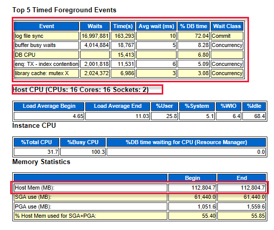
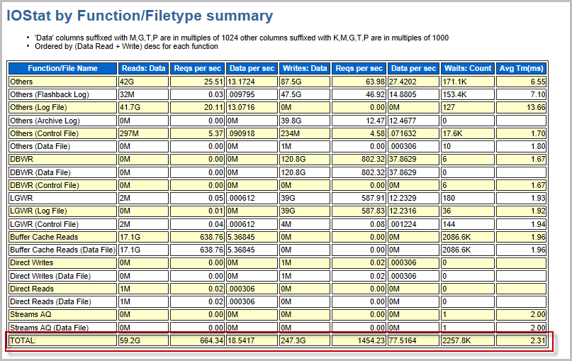
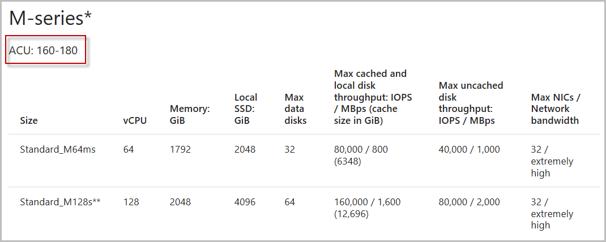
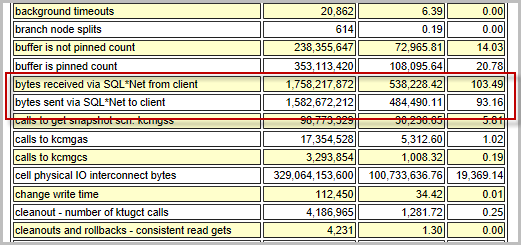
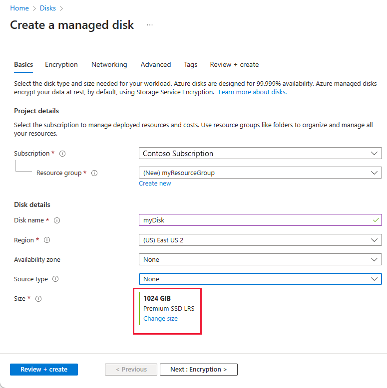
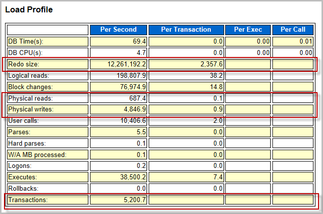
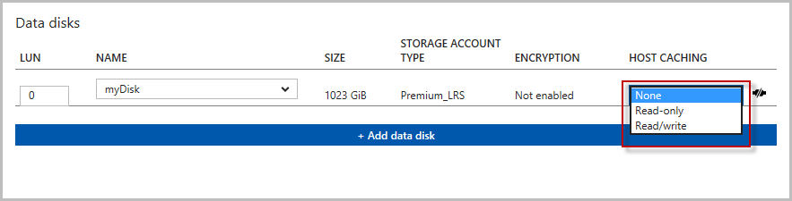
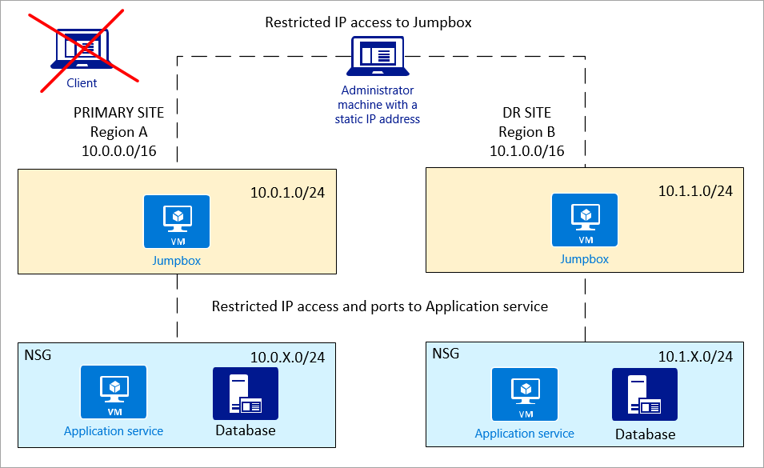

# Design and implement an Oracle database in Azure

## Assumptions

- You're planning to migrate an Oracle database from on-premises to Azure.
- You have the [Diagnostics Pack](https://docs.oracle.com/cd/E11857_01/license.111/e11987/database_management.htm) for the Oracle Database you're looking to migrate
- You have an understanding of the various metrics in Oracle AWR reports.
- You have a baseline understanding of application performance and platform utilization.

## Goals

- Understand how to optimize your Oracle deployment in Azure.
- Explore performance tuning options for an Oracle database in an Azure environment.

## The differences between an on-premises and Azure implementation 

Following are some important things to keep in mind when you're migrating on-premises applications to Azure. 

One important difference is that in an Azure implementation, resources such as VMs, disks, and virtual networks are shared among other clients. In addition, resources can be throttled based on the requirements. Instead of focusing on avoiding failing (MTBF), Azure is more focused on surviving the failure (MTTR).

The following table lists some of the differences between an on-premises implementation and an Azure implementation of an Oracle database.

> 
> |  | **On-premises implementation** | **Azure implementation** |
> | --- | --- | --- |
> | **Networking** |LAN/WAN  |SDN (software-defined networking)|
> | **Security group** |IP/port restriction tools |[Network Security Group (NSG)](https://azure.microsoft.com/blog/network-security-groups) |
> | **Resilience** |MTBF (mean time between failures) |MTTR (mean time to recovery)|
> | **Planned maintenance** |Patching/upgrades|[Availability sets](https://docs.microsoft.com/azure/virtual-machines/windows/infrastructure-availability-sets-guidelines) (patching/upgrades managed by Azure) |
> | **Resource** |Dedicated  |Shared with other clients|
> | **Regions** |Datacenters |[Region pairs](https://docs.microsoft.com/azure/virtual-machines/windows/regions#region-pairs)|
> | **Storage** |SAN/physical disks |[Azure-managed storage](https://azure.microsoft.com/pricing/details/managed-disks/?v=17.23h)|
> | **Scale** |Vertical scale |Horizontal scale|


### Requirements

- Determine the database size and growth rate.
- Determine the IOPS requirements, which you can estimate based on Oracle AWR reports or other network monitoring tools.

## Configuration options

There are four potential areas that you can tune to improve performance in an Azure environment:

- Virtual machine size
- Network throughput
- Disk types and configurations
- Disk cache settings

### Generate an AWR report

If you have an existing an Oracle database and are planning to migrate to Azure, you have several options. If you have the [Diagnostics Pack](https://www.oracle.com/technetwork/oem/pdf/511880.pdf) for your Oracle instances, you can run the Oracle AWR report to get the metrics (IOPS, Mbps, GiBs, and so on). Then choose the VM based on the metrics that you collected. Or you can contact your infrastructure team to get similar information.

You might consider running your AWR report during both regular and peak workloads, so you can compare. Based on these reports, you can size the VMs based on either the average workload or the maximum workload.

Following is an example of how to generate an AWR report (Generate your AWR reports using your Oracle Enterprise Manager, if your current install has one):

```bash
$ sqlplus / as sysdba
SQL> EXEC DBMS_WORKLOAD_REPOSITORY.CREATE_SNAPSHOT;
SQL> @?/rdbms/admin/awrrpt.sql
```

### Key metrics

Following are the metrics that you can obtain from the AWR report:

- Total number of cores
- CPU clock speed
- Total memory in GB
- CPU utilization
- Peak data transfer rate
- Rate of I/O changes (read/write)
- Redo log rate (MBPs)
- Network throughput
- Network latency rate (low/high)
- Database size in GB
- Bytes received via SQL*Net from/to client

### Virtual machine size

#### 1. Estimate VM size based on CPU, memory, and I/O usage from the AWR report

One thing you might look at is the top five timed foreground events that indicate where the system bottlenecks are.

For example, in the following diagram, the log file sync is at the top. It indicates the number of waits that are required before the LGWR writes the log buffer to the redo log file. These results indicate that better performing storage or disks are required. In addition, the diagram also shows the number of CPU (cores) and the amount of memory.



The following diagram shows the total I/O of read and write. There were 59 GB read and 247.3 GB written during the time of the report.



#### 2. Choose a VM

Based on the information that you collected from the AWR report, the next step is to choose a VM of a similar size that meets your requirements. You can find a list of available VMs in the article [Memory optimized](../../linux/sizes-memory.md).

#### 3. Fine-tune the VM sizing with a similar VM series based on the ACU

After you've chosen the VM, pay attention to the ACU for the VM. You might choose a different VM based on the ACU value that better suits your requirements. For more information, see [Azure compute unit](https://docs.microsoft.com/azure/virtual-machines/windows/acu).



### Network throughput

The following diagram shows the relation between throughput and IOPS:


The total network throughput is estimated based on the following information:
- SQL*Net traffic
- MBps x number of servers (outbound stream such as Oracle Data Guard)
- Other factors, such as application replication



Based on your network bandwidth requirements, there are various gateway types for you to choose from. These include basic, VpnGw, and Azure ExpressRoute. For more information, see the [VPN gateway pricing page](https://azure.microsoft.com/pricing/details/vpn-gateway/?v=17.23h).

**Recommendations**

- Network latency is higher compared to an on-premises deployment. Reducing network round trips can greatly improve performance.
- To reduce round-trips, consolidate applications that have high transactions or “chatty” apps on the same virtual machine.
- Use Virtual Machines with [Accelerated Networking](https://docs.microsoft.com/azure/virtual-network/create-vm-accelerated-networking-cli) for better network performance.
- For certain Linux distrubutions, consider enabling [TRIM/UNMAP support](https://docs.microsoft.com/azure/virtual-machines/linux/configure-lvm#trimunmap-support).
- Install [Oracle Enterprise Manager](https://www.oracle.com/technetwork/oem/enterprise-manager/overview/index.html) on a separate Virtual Machine.
- Huge pages are not enabled on linux by default. Consider enabling huge pages and set `use_large_pages = ONLY` on the Oracle DB. This may help increase performance. More information can be found [here](https://docs.oracle.com/en/database/oracle/oracle-database/12.2/refrn/USE_LARGE_PAGES.html#GUID-1B0F4D27-8222-439E-A01D-E50758C88390).

### Disk types and configurations

- *Default OS disks*: These disk types offer persistent data and caching. They are optimized for OS access at startup, and aren't designed for either transactional or data warehouse (analytical) workloads.

- *Unmanaged disks*: With these disk types, you manage the storage accounts that store the virtual hard disk (VHD) files that correspond to your VM disks. VHD files are stored as page blobs in Azure storage accounts.

- *Managed disks*: Azure manages the storage accounts that you use for your VM disks. You specify the disk type (premium or standard) and the size of the disk that you need. Azure creates and manages the disk for you.

- *Premium storage disks*: These disk types are best suited for production workloads. Premium storage supports VM disks that can be attached to specific size-series VMs, such as DS, DSv2, GS, and F series VMs. The premium disk comes with different sizes, and you can choose between disks ranging from 32 GB to 4,096 GB. Each disk size has its own performance specifications. Depending on your application requirements, you can attach one or more disks to your VM.

When you create a new managed disk from the portal, you can choose the **Account type** for the type of disk you want to use. 
Keep in mind that not all available disks are shown in the drop-down menu. After you choose a particular VM size, the menu shows only the available premium storage SKUs that are based on that VM size.



After you configure your storage on a VM, you might want to load test the disks before creating a database. Knowing the I/O rate in terms of both latency and throughput can help you determine if the VMs support the expected throughput with latency targets.

There are a number of tools for application load testing, such as Oracle Orion, Sysbench, and Fio.

Run the load test again after you've deployed an Oracle database. Start your regular and peak workloads, and the results show you the baseline of your environment.

It might be more important to size the storage based on the IOPS rate rather than the storage size. For example, if the required IOPS is 5,000, but you only need 200 GB, you might still get the P30 class premium disk even though it comes with more than 200 GB of storage.

The IOPS rate can be obtained from the AWR report. It's determined by the redo log, physical reads, and writes rate.



For example, the redo size is 12,200,000 bytes per second, which is equal to 11.63 MBPs.
The IOPS is 12,200,000 / 2,358 = 5,174.

After you have a clear picture of the I/O requirements, you can choose a combination of drives that are best suited to meet those requirements.

**Recommendations**

- For data tablespace, spread the I/O workload across a number of disks by using managed storage or Oracle ASM.
- As the I/O block size increases for read-intensive and write-intensive operations, add more data disks.
- Increase the block size for large sequential processes.
- Use data compression to reduce I/O (for both data and indexes).
- Separate redo logs, system, and temps, and undo TS on separate data disks.
- Don't put any application files on default OS disks (/dev/sda). These disks aren't optimized for fast VM boot times, and they might not provide good performance for your application.
- When using M-Series VMs on Premium storage, enable [Write Accelerator](https://docs.microsoft.com/azure/virtual-machines/linux/how-to-enable-write-accelerator) on redo logs disk.

### Disk cache settings

There are three options for host caching:

- *ReadOnly*: All requests are cached for future reads. All writes are persisted directly to Azure Blob storage.

- *ReadWrite*: This is a “read-ahead” algorithm. The reads and writes are cached for future reads. Non-write-through writes are persisted to the local cache first. It also provides the lowest disk latency for light workloads. Using ReadWrite cache with an application that does not handle persisting the required data can lead to data loss, if the VM crashes.

- *None* (disabled): By using this option, you can bypass the cache. All the data is transferred to disk and persisted to Azure Storage. This method gives you the highest I/O rate for I/O intensive workloads. You also need to take “transaction cost” into consideration.

**Recommendations**

To maximize the throughput, we recommend that you start with **None** for host caching. For Premium Storage, keep in mind that you must disable the "barriers" when you mount the file system with the **ReadOnly** or **None** options. Update the /etc/fstab file with the UUID to the disks.



- For OS disks, use default **Read/Write** caching.
- For SYSTEM, TEMP, and UNDO use **None** for caching.
- For DATA, use **None** for caching. But if your database is read-only or read-intensive, use **Read-only** caching.

After your data disk setting is saved, you can't change the host cache setting unless you unmount the drive at the OS level and then remount it after you've made the change.

## Security

After you have set up and configured your Azure environment, the next step is to secure your network. Here are some recommendations:

- *NSG policy*: NSG can be defined by a subnet or NIC. It's simpler to control access at the subnet level, both for security and force routing for things like application firewalls.

- *Jumpbox*: For more secure access, administrators should not directly connect to the application service or database. A jumpbox is used as a media between the administrator machine and Azure resources.


    The administrator machine should offer IP-restricted access to the jumpbox only. The jumpbox should have access to the application and database.

- *Private network* (subnets): We recommend that you have the application service and database on separate subnets, so better control can be set by NSG policy.


## Additional reading

- [Configure Oracle ASM](configure-oracle-asm.md)
- [Configure Oracle Data Guard](configure-oracle-dataguard.md)
- [Configure Oracle Golden Gate](configure-oracle-golden-gate.md)
- [Oracle backup and recovery](oracle-backup-recovery.md)

## Next steps

- [Tutorial: Create highly available VMs](../../linux/create-cli-complete.md)
- [Explore VM deployment Azure CLI samples](../../linux/cli-samples.md)
