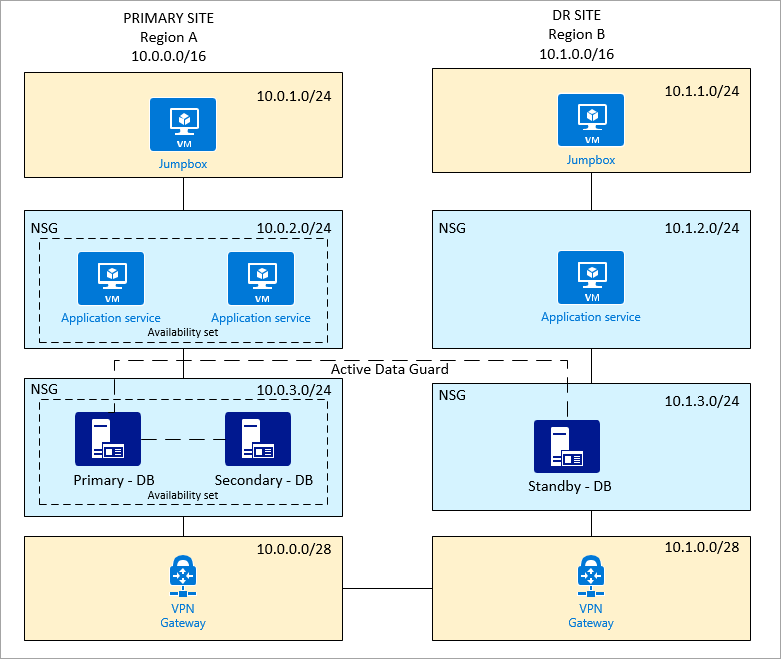
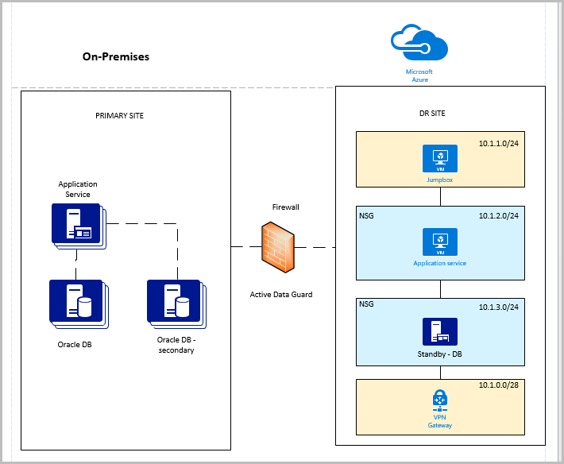
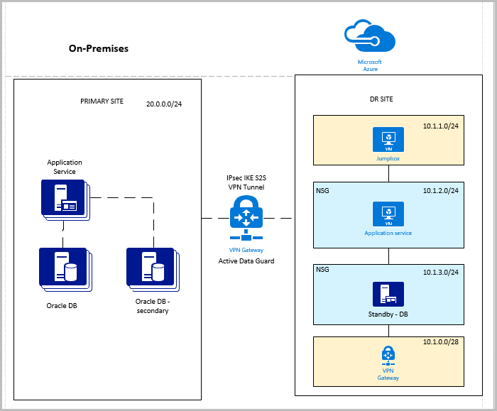

# Disaster recovery for an Oracle Database 12c database in an Azure environment

## Assumptions

- You have an understanding of Oracle Data Guard design and Azure environments.

## Goals
- Design the topology and configuration that meet your disaster recovery (DR) requirements.

## Scenario 1: Primary and DR sites on Azure

A customer has an Oracle database set up on the primary site. A DR site is in a different region. The customer uses Oracle Data Guard for quick recovery between these sites. The primary site also has a secondary database for reporting and other uses. 

### Topology

Here is a summary of the Azure setup:

- Two sites (a primary site and a DR site)
- Two virtual networks
- Two Oracle databases with Data Guard (primary and standby)
- Two Oracle databases with Golden Gate or Data Guard (primary site only)
- Two application services, one primary and one on the DR site
- An *availability set,* which is used for database and application service on the primary site
- One jumpbox on each site, which restricts access to the private network and only allows sign-in by an administrator
- A jumpbox, application service, database, and VPN gateway on separate subnets
- NSG enforced on application and database subnets

## Scenario 2: Primary site on-premises and DR site on Azure

A customer has an on-premises Oracle database setup (primary site). A DR site is on Azure. Oracle Data Guard is used for quick recovery between these sites. The primary site also has a secondary database for reporting and other uses. 

There are two approaches for this setup.

### Approach 1: Direct connections between on-premises and Azure, requiring open TCP ports on the firewall 

We don't recommend direct connections because they expose the TCP ports to the outside world.

#### Topology

Following is a summary of the Azure setup:

- One DR site 
- One virtual network
- One Oracle database with Data Guard (active)
- One application service on the DR site
- One jumpbox, which restricts access to the private network and only allows sign-in by an administrator
- A jumpbox, application service, database, and VPN gateway on separate subnets
- NSG enforced on application and database subnets
- An NSG policy/rule to allow inbound TCP port 1521 (or a user-defined port)
- An NSG policy/rule to restrict only the IP address/addresses on-premises (DB or application) to access the virtual network

### Approach 2: Site-to-site VPN
Site-to-site VPN is a better approach. For more information about setting up a VPN, see [Create a virtual network with a Site-to-Site VPN connection using CLI](https://docs.microsoft.com/azure/vpn-gateway/vpn-gateway-howto-site-to-site-resource-manager-cli).

#### Topology

Following is a summary of the Azure setup:

- One DR site 
- One virtual network 
- One Oracle database with Data Guard (active)
- One application service on the DR site
- One jumpbox, which restricts access to the private network and only allows sign-in by an administrator
- A jumpbox, application service, database, and VPN gateway are on separate subnets
- NSG enforced on application and database subnets
- Site-to-site VPN connection between on-premises and Azure

## Additional reading

- [Design and implement an Oracle database on Azure](oracle-design.md)
- [Configure Oracle Data Guard](configure-oracle-dataguard.md)
- [Configure Oracle Golden Gate](configure-oracle-golden-gate.md)
- [Oracle backup and recovery](oracle-backup-recovery.md)

## Next steps

- [Tutorial: Create highly available VMs](../../linux/create-cli-complete.md)
- [Explore VM deployment Azure CLI samples](../../linux/cli-samples.md)
