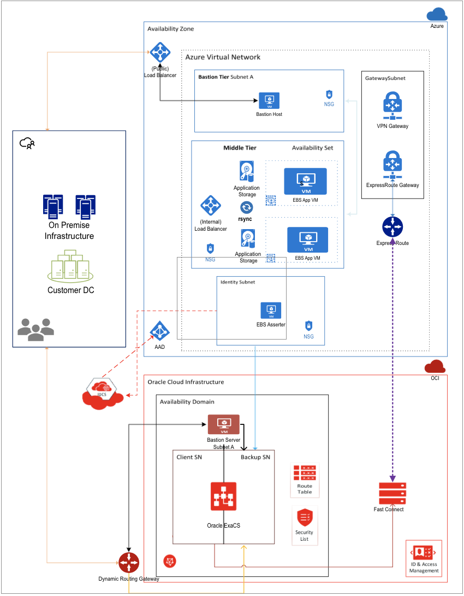
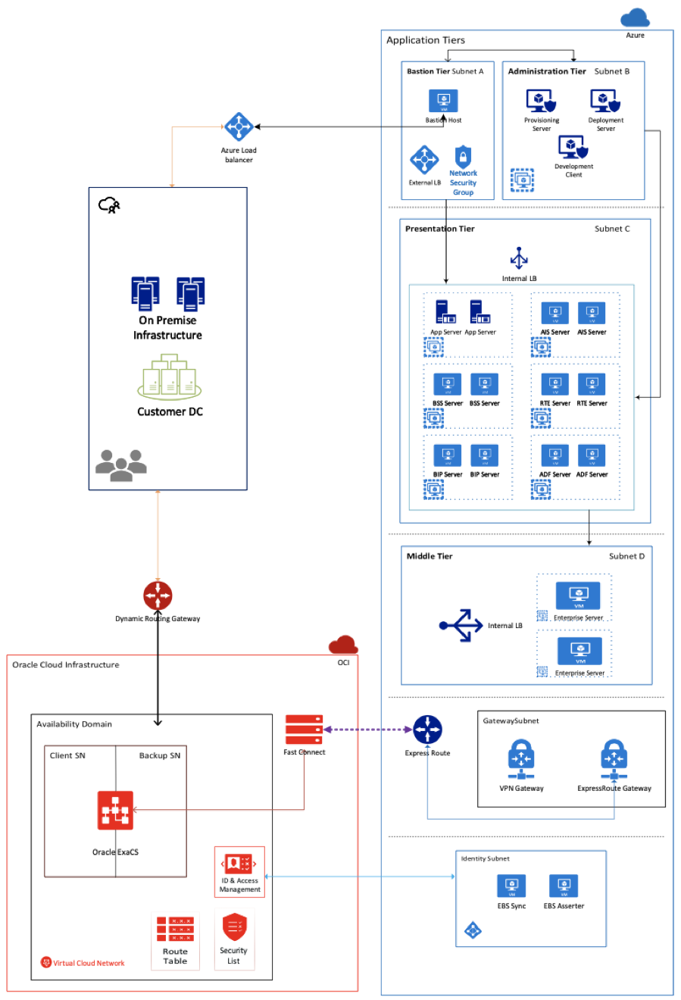

# Architectures to deploy Oracle applications that connect Azure and OCI

Microsoft and Oracle have worked together to enable customers to deploy Oracle applications such as Oracle E-Business Suite, JD Edwards EnterpriseOne, PeopleSoft, and Retail Merchandising System (RMS) in the cloud. With the introduction of the private network inter-connectivity between Microsoft Azure and Oracle Cloud Infrastructure (OCI), Oracle applications can now be deployed on Azure with their back-end databases in OCI. Oracle applications can also be integrated with Azure Active Directory, allowing you to set up single sign-on so that users can sign into the Oracle application using their Azure AD credentials. For an overview, see [Oracle application solutions integrating Microsoft Azure and Oracle Cloud Infrastructure](oracle-oci-overview.md).

OCI offers multiple Oracle database options for Oracle applications, including DBaaS, Exadata Cloud Service, Oracle RAC, and Infrastructure-as-a-Service (IaaS). Currently, Autonomous Database is not a supported back-end for Oracle applications. 

There are [multiple options](oracle-overview.md) for deploying Oracle applications in Azure, including in a high availability and secure manner. Azure also offers [Oracle database VM images](oracle-vm-solutions.md) that you can deploy if you choose to run your Oracle applications entirely on Azure. 

The following sections outline architecture recommendations by both Microsoft and Oracle to deploy Oracle E-Business Suite and JD Edwards EnterpriseOne in a cross-cloud configuration. Microsoft and Oracle have tested these applications in the cross-cloud setup and confirmed that the performance meets standards set by Oracle for these applications.

## Architecture considerations

Oracle applications are made up of multiple services, which can be hosted on the same or multiple virtual machines in Azure and OCI. 

Application instances can be set up with private or public endpoints. Microsoft and Oracle recommend setting up a *bastion host VM* with a public IP address in a separate subnet for management of the application. Then, assign only private IP addresses to the other machines, including the database tier. 

When setting up an application in the cross-cloud architecture, planning is required to ensure that the IP address space in the Azure virtual network does not overlap the private IP address space in the OCI virtual cloud network. A bastion host may also be deployed in the virtual cloud network in OCI to manage the database tier.

## E-Business Suite

Oracle E-Business Suite (EBS) is a suite of applications including Supply Chain Management (SCM) and Customer Relationship Management (CRM). To take advantage of OCI’s managed database portfolio, EBS can be deployed using the cross-cloud interconnect between Microsoft Azure and OCI. In this configuration, the presentation and application tiers run in Azure and the database tier in OCI. See the following architecture diagram:

The following is a description of the different components:

- **Bastion host** - The bastion host is an optional component that you can use as a jump server to access the application and database instances. The bastion host VM can have a public IP address assigned to it, although the recommendation is to set up an ExpressRoute connection or site-to-site VPN with your on-premises network for secure access. Additionally, only SSH (port 22, Linux) or RDP (port 3389, Windows Server) should be opened for incoming traffic. For high availability, deploy a bastion host in two availability zones or in a single availability set.
- **Application tier** - The application tier is isolated in its own subnet. There are multiple virtual machines set up for fault tolerance and easy patch management. These VMs can be backed by shared storage, which is offered by Azure NetApp Files (ANF) and Ultra SSDs. This allows for easier deployment of patches without downtime. The machines in the application tier should be fronted by an internal load balancer so that requests to the EBS application tier are processed even if one machine in the tier is offline due to a fault.
- **Load balancer** - *Need to add details on external and internal load balancing and any app gateways that we’re using*
- **Database tier** - This tier is separated into its own subnet. It is recommended to add network security groups that only permit traffic from the application tier to the database tier on the Oracle-specific database port 1521. 

  Microsoft and Oracle recommend a high availability setup. High availability can be achieved by  setting up two Oracle databases in two availability zones with Oracle Data Guard, or using Oracle Database Exadata Cloud Service in OCI. When using Oracle Database Exadata Cloud Service, your database is deployed in two subnets. 

## JD Edwards EnterpriseOne

Oracle's JD Edwards EnterpriseOne is an integrated applications suite of comprehensive enterprise resource planning software. It is a multi-tiered application that can be set up with either an Oracle or SQL Server database back-end. This section discusses details on deploying JD Edwards EnterpriseOne with an Oracle database back-end in OCI.

In the following recommended architecture, the administration, presentation, and middle tiers are deployed to the virtual network in Azure. The database is deployed in the virtual cloud network in OCI.

As with E-Business Suite, you can set up an optional bastion tier. Use the bastion VM host as a jump server to access the application and database instances. 

 
The architecture can also be adapted for deployment entirely on Azure with a highly available Oracle database configured using Oracle Data Guard and databases in two availability zones in a region.

## Next steps

Use [Terraform deployment templates](https://github.com/microsoft/project-ashburn) to set up Oracle apps in Azure and establish cross-cloud connectivity with OCI. 

For more information and whitepapers about OCI, see the [Oracle Cloud](https://docs.cloud.oracle.com/iaas/Content/home.htm) documentation.
