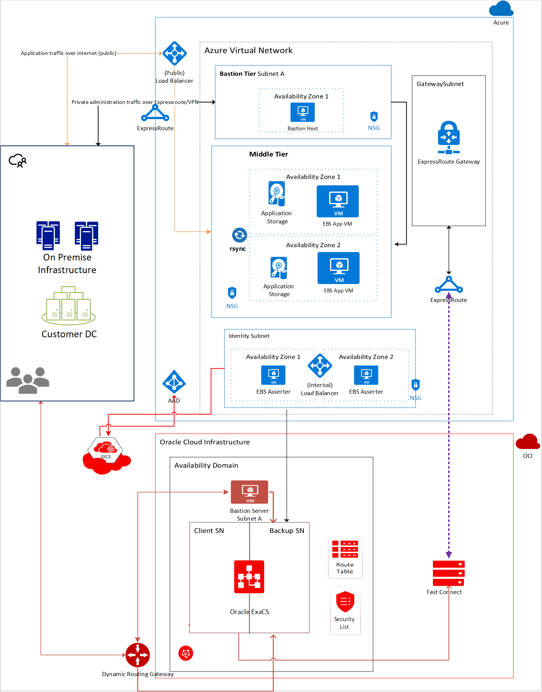
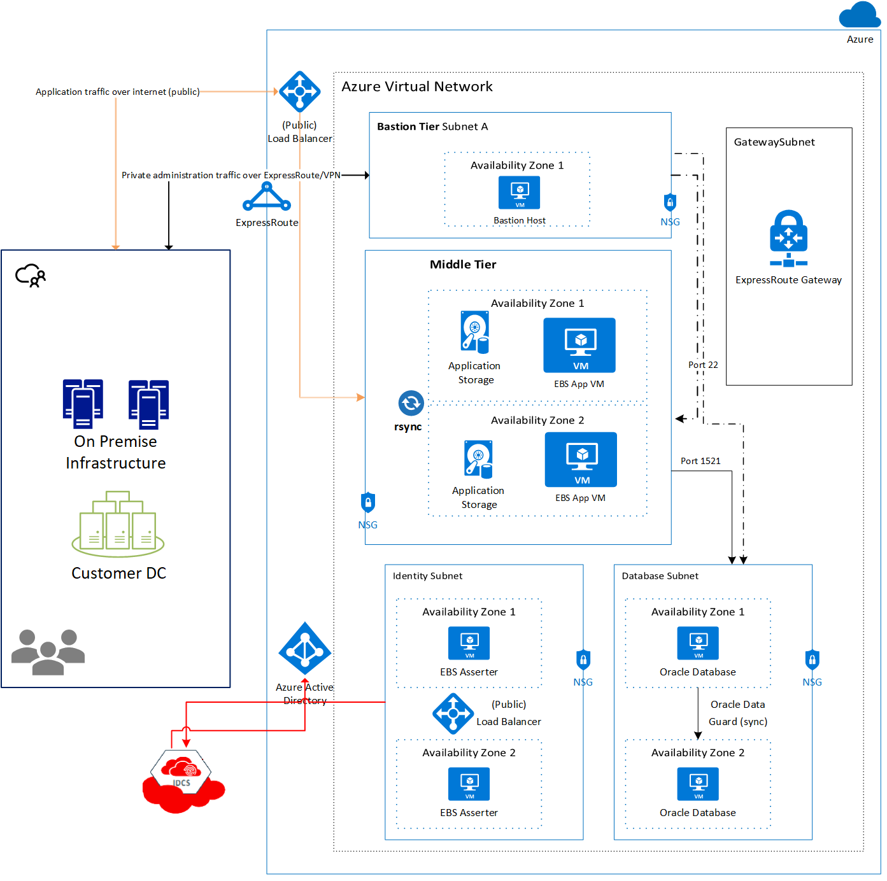
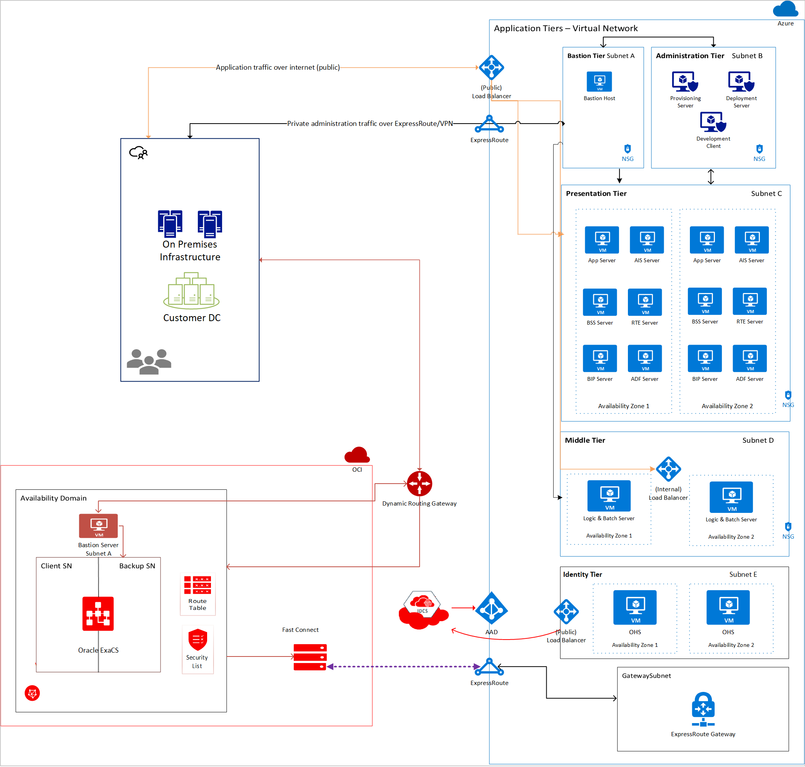
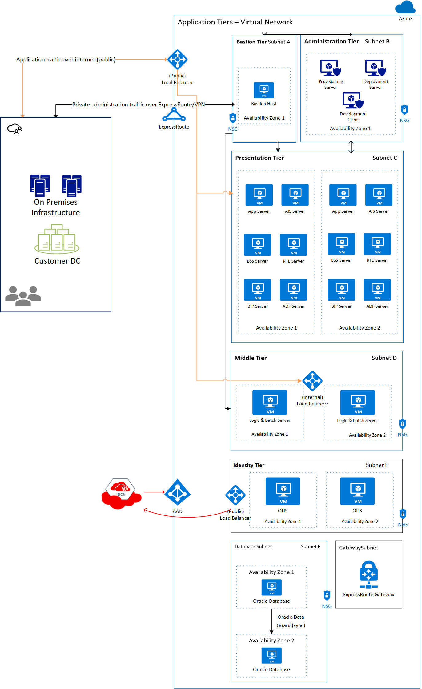
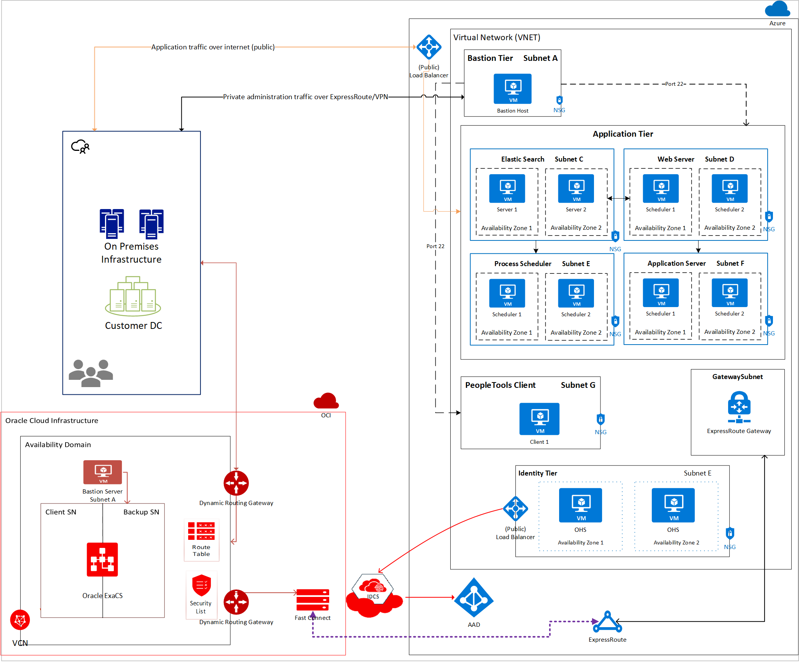
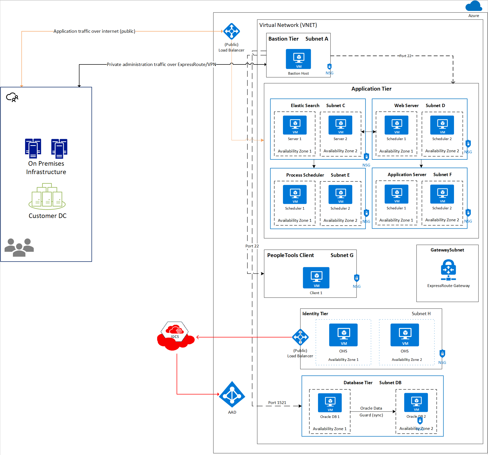

# Architectures to deploy Oracle applications on Azure

Microsoft and Oracle have worked together to enable customers to deploy Oracle applications such as Oracle E-Business Suite, JD Edwards EnterpriseOne, and PeopleSoft in the cloud. With the introduction of the preview [private network interconnectivity](configure-azure-oci-networking.md) between Microsoft Azure and Oracle Cloud Infrastructure (OCI), Oracle applications can now be deployed on Azure with their back-end databases in Azure or OCI. Oracle applications can also be integrated with Azure Active Directory, allowing you to set up single sign-on so that users can sign into the Oracle application using their Azure Active Directory (Azure AD) credentials.

OCI offers multiple Oracle database options for Oracle applications, including DBaaS, Exadata Cloud Service, Oracle RAC, and Infrastructure-as-a-Service (IaaS). Currently, Autonomous Database is not a supported back-end for Oracle applications.

There are [multiple options](oracle-overview.md) for deploying Oracle applications in Azure, including in a highly available and secure manner. Azure also offers [Oracle database VM images](oracle-vm-solutions.md) that you can deploy if you choose to run your Oracle applications entirely on Azure.

The following sections outline architecture recommendations by both Microsoft and Oracle to deploy Oracle E-Business Suite, JD Edwards EnterpriseOne, and PeopleSoft in a cross-cloud configuration or entirely in Azure. Microsoft and Oracle have tested these applications and confirmed that the performance meets standards set by Oracle for these applications.

## Architecture considerations

Oracle applications are made up of multiple services, which can be hosted on the same or multiple virtual machines in Azure and optionally in OCI. 

Application instances can be set up with private or public endpoints. Microsoft and Oracle recommend setting up a *bastion host VM* with a public IP address in a separate subnet for management of the application. Then, assign only private IP addresses to the other machines, including the database tier. 

When setting up an application in a cross-cloud architecture, planning is required to ensure that the IP address space in the Azure virtual network does not overlap the private IP address space in the OCI virtual cloud network.

For added security, set up network security groups at a subnet level to ensure only traffic on specific ports and IP addresses is permitted. For example, machines in the middle tier should only receive traffic from within the virtual network. No external traffic should reach the middle tier machines directly.

For high availability, you can set up redundant instances of the different servers in the same availability set or different availability zones. Availability zones allow you to achieve a 99.99% uptime SLA, while availability sets allow you to achieve a 99.95% uptime SLA in-region. Sample architectures shown in this article are deployed across two availability zones.

When deploying an application using the cross-cloud interconnect, you may continue to use an existing ExpressRoute circuit to connect your Azure environment to your on-premises network. However, you need a separate ExpressRoute circuit for the interconnect to OCI than the one connecting to your on-premises network.

## E-Business Suite

Oracle E-Business Suite (EBS) is a suite of applications including Supply Chain Management (SCM) and Customer Relationship Management (CRM). To take advantage of OCI’s managed database portfolio, EBS can be deployed using the cross-cloud interconnect between Microsoft Azure and OCI. In this configuration, the presentation and application tiers run in Azure and the database tier in OCI, as illustrated in the following architecture diagram (Figure 1).

*Figure 1: E-Business Suite cross-cloud architecture* 

In this architecture, the virtual network in Azure is connected to a virtual cloud network in OCI using the cross-cloud interconnect. The application tier is set up in Azure, whereas the database is set up in OCI. It is recommended to deploy each component to its own subnet with network security groups to allow traffic only from specific subnets on specific ports.

The architecture can also be adapted for deployment entirely on Azure with highly available Oracle databases configured using Oracle Data Guard in two availability zones in a region. The following diagram (Figure 2) is an example of this architectural pattern:

*Figure 2: E-Business Suite Azure-only architecture*

The following sections describe the different components at a high level.

[!INCLUDE [virtual-machines-oracle-applications-bastion](../../../../includes/virtual-machines-oracle-applications-bastion.md)]

### Application (middle) tier

The application tier is isolated in its own subnet. There are multiple virtual machines set up for fault tolerance and easy patch management. These VMs can be backed by shared storage, which is offered by Azure NetApp Files and Ultra SSDs. This configuration allows for easier deployment of patches without downtime. The machines in the application tier should be fronted by a public load balancer so that requests to the EBS application tier are processed even if one machine in the tier is offline due to a fault.

### Load balancer

An Azure load balancer allows you to distribute traffic across multiple instances of your workload to ensure high availability. In this case, a public load balancer is set up, because users are allowed to access the EBS application over the web. The load balancer distributes the load to both machines in the middle tier. For added security, allow traffic only from users accessing the system from your corporate network using a site-to-site VPN or ExpressRoute and network security groups.

### Database tier

This tier hosts the Oracle database and is separated into its own subnet. It is recommended to add network security groups that only permit traffic from the application tier to the database tier on the Oracle-specific database port 1521.

Microsoft and Oracle recommend a high availability setup. High availability in Azure can be achieved by setting up two Oracle databases in two availability zones with Oracle Data Guard, or by using Oracle Database Exadata Cloud Service in OCI. When using Oracle Database Exadata Cloud Service, your database is deployed in two subnets. You may also setup Oracle Database in VMs in OCI in two availability domains with Oracle Data Guard.

### Identity tier

The identity tier contains the EBS Asserter VM. EBS Asserter allows you to synchronize identities from Oracle Identity Cloud Service (IDCS) and Azure AD. The EBS Asserter is needed because EBS does not support single sign-on protocols like SAML 2.0 or OpenID Connect. The EBS Asserter consumes the OpenID connect token (generated by IDCS), validates it, and then creates a session for the user in EBS. 

While this architecture shows IDCS integration, Azure AD unified access and single sign-on also can be enabled with Oracle Access Manager with Oracle Internet Directory or Oracle Unified Directory. For more information, see the whitepapers on [Deploying Oracle EBS with IDCS Integration](https://cloud.oracle.com/iaas/whitepapers/deploy_ebusiness_suite_across_oci_azure_sso_idcs.pdf) or [Deploying Oracle EBS with OAM Integration](https://cloud.oracle.com/iaas/whitepapers/deploy_ebusiness_suite_across_oci_azure_sso_oam.pdf).

For high availability, it is recommended that you deploy redundant servers of the EBS Asserter across multiple availability zones with a load balancer in front of it.

Once your infrastructure is setup, E-Business Suite can be installed by following the installation guide provided by Oracle.

## JD Edwards EnterpriseOne

Oracle's JD Edwards EnterpriseOne is an integrated applications suite of comprehensive enterprise resource planning software. It is a multi-tiered application that can be set up with either an Oracle or SQL Server database backend. This section discusses details on deploying JD Edwards EnterpriseOne with an Oracle database back-end either in OCI or in Azure.

In the following recommended architecture (Figure 3), the administration, presentation, and middle tiers are deployed to the virtual network in Azure. The database is deployed in a virtual cloud network in OCI.

As with E-Business Suite, you can set up an optional bastion tier for secure administrative purposes. Use the bastion VM host as a jump server to access the application and database instances.

*Figure 3: JD Edwards EnterpriseOne cross-cloud architecture*

In this architecture, the virtual network in Azure is connected to the virtual cloud network in OCI using the cross-cloud interconnect. The application tier is set up in Azure, whereas the database is set up in OCI. It is recommended to deploy each component to its own subnet with network security groups to allow traffic only from specific subnets on specific ports.

The architecture can also be adapted for deployment entirely on Azure with highly available Oracle databases configured using Oracle Data Guard in two availability zones in a region. The following diagram (Figure 4) is an example of this architectural pattern:

*Figure 4: JD Edwards EnterpriseOne Azure-only architecture*

The following sections describe the different components at a high level.

[!INCLUDE [virtual-machines-oracle-applications-bastion](../../../../includes/virtual-machines-oracle-applications-bastion.md)]

### Administrative tier

As the name suggests, this tier is used for administrative tasks. You can carve out a separate subnet for the administrative tier. The services and servers in this tier are primarily used for installation and administration of the application. Hence, single instances of these servers are sufficient. Redundant instances are not required for the high availability of your application.

The components of this tier are as follows:
    
 - **Provisioning server** - This server is used for end-to-end deployment of the different components of the application. It communicates with the instances in the other tiers, including the instances in the database tier, over port 22. It hosts the Server Manager Console for JD Edwards EnterpriseOne.
 - **Deployment server** - This server is primarily required for the installation of JD Edwards EnterpriseOne. During the installation process, this server acts as the central repository for required files and installation packages. The software is distributed or deployed to other servers and clients from this server.
 - **Development client** - This server contains components that run in a web browser as well as native applications.

### Presentation tier

This tier contains various components such as Application Interface Services (AIS), Application Development Framework (ADF), and Java Application Servers (JAS). The servers in this tier communicate with the servers in the middle tier. They are fronted by a load balancer that routes traffic to the necessary server based on the port number and URL that the traffic is received on. It is recommended that you deploy multiple instances of each server type for high availability.

The following are the components in this tier:
    
- **Application Interface Services (AIS)** - The AIS server provides the communication interface between JD Edwards EnterpriseOne mobile enterprise applications and JD Edwards EnterpriseOne.
- **Java Application Server (JAS)** - The JAS receives requests from the load balancer and passes it to the middle tier to execute complicated tasks. The JAS has the ability to execute simple business logic.
- **BI Publisher Server (BIP)** - This server presents reports based on the data collected by the JD Edwards EnterpriseOne application. You can design and control how the report presents the data based on different templates.
- **Business Services Server (BSS)** -  The BSS enables information exchange and interoperability with other Oracle applications.
- **Real-Time Events Server (RTE)** - The RTE Server allows you to set up notifications to external systems about transactions occurring in the JDE EnterpriseOne system. It uses a subscriber model and allows third-party systems to subscribe to events. To load balance requests to both RTE servers, ensure that the servers are in a cluster.
- **Application Development Framework (ADF) Server** - The ADF server is used to run JD Edwards EnterpriseOne applications developed with Oracle ADF. This is deployed on an Oracle WebLogic server with ADF runtime.

### Middle tier

The middle tier contains the logic server and batch server. In this case, both servers are installed on the same virtual machine. However, for production scenarios, it is recommended that you deploy logic server and batch server on separate servers. Multiple servers are deployed in the middle tier across two availability zones for higher availability. An Azure load balancer should be created and these servers should be placed in its backend pool to ensure that both servers are active and processing requests.

The servers in the middle tier receive requests from the servers in the presentation tier and the public load balancer only. Network security group rules must be set up to deny traffic from any address other than the presentation tier subnet and the load balancer. An NSG rule can also be set up to allow traffic on port 22 from the bastion host for management purposes. You may be able to use the public load balancer to load balance requests between the VMs in the middle tier.

The following two components are in the middle tier:

- **Logic server** - Contain the business logic or business functions.
- **Batch server** - Used for batch processing

[!INCLUDE [virtual-machines-oracle-applications-database](../../../../includes/virtual-machines-oracle-applications-database.md)]

[!INCLUDE [virtual-machines-oracle-applications-identity](../../../../includes/virtual-machines-oracle-applications-identity.md)]

## PeopleSoft

Oracle's PeopleSoft application suite contains software for human resources and financial management. The application suite is multi-tiered and applications include human resource management systems (HRMS), customer relationship management (CRM), financials and supply chain management (FSCM), and enterprise performance management (EPM).

It is recommended that each tier of the software suite be deployed in its own subnet. An Oracle database or Microsoft SQL Server is required as the backend database for the application. This section discusses details on deploying PeopleSoft with an Oracle database backend.

The following is a canonical architecture for deploying the PeopleSoft application suite in a cross-cloud architecture (Figure 5).

*Figure 5: PeopleSoft cross-cloud architecture*

In this sample architecture, the virtual network in Azure is connected to the virtual cloud network in OCI using the cross-cloud interconnect. The application tier is set up in Azure, whereas the database is set up in OCI. It is recommended to deploy each component to its own subnet with network security groups to allow traffic only from specific subnets on specific ports.

The architecture can also be adapted for deployment entirely on Azure with highly available Oracle databases configured using Oracle Data Guard in two availability zones in a region. The following diagram (Figure 6) is an example of this architectural pattern:

*Figure 6: PeopleSoft Azure-only architecture*

The following sections describe the different components at a high level.

[!INCLUDE [virtual-machines-oracle-applications-bastion](../../../../includes/virtual-machines-oracle-applications-bastion.md)]

### Application tier

The application tier contains instances of the PeopleSoft application servers, PeopleSoft web servers, elastic search, and PeopleSoft Process Scheduler. An Azure load balancer is set up to accept requests from users which are routed to the appropriate server in the application tier.

For high availability, consider setting up redundant instances of each server in the application tier across different availability zones. The Azure load balancer can be set up with multiple back-end pools to direct each request to the right server.

### PeopleTools Client

The PeopleTools Client is used to perform administration activities, such as development, migration, and upgrade. Because the PeopleTools Client is not required for achieving high availability of your application, redundant servers of PeopleTools Client are not needed.

[!INCLUDE [virtual-machines-oracle-applications-database](../../../../includes/virtual-machines-oracle-applications-database.md)]

[!INCLUDE [virtual-machines-oracle-applications-identity](../../../../includes/virtual-machines-oracle-applications-identity.md)]

## Next steps

Use [Terraform scripts](https://github.com/microsoft/azure-oracle) to set up Oracle apps in Azure and establish cross-cloud connectivity with OCI.

For more information and whitepapers about OCI, see the [Oracle Cloud](https://docs.cloud.oracle.com/iaas/Content/home.htm) documentation.
