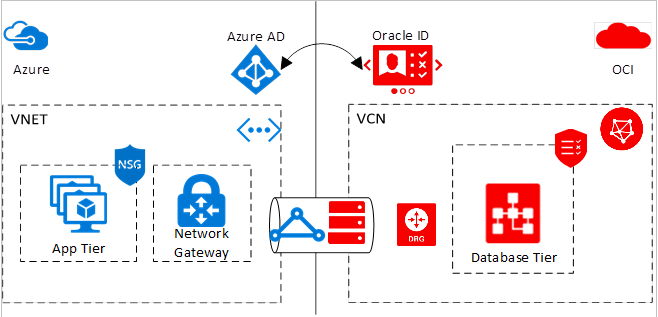

# Oracle application solutions integrating Microsoft Azure and Oracle Cloud Infrastructure

Microsoft and Oracle have partnered to provide low latency, high throughput cross-cloud connectivity, allowing you to take advantage of the best of both clouds. 

Using this cross-cloud connectivity, you can partition a multi-tier application to run your database tier on Oracle Cloud Infrastructure (OCI), and the application and other tiers on Microsoft Azure. The experience is similar to running the entire solution stack in a single cloud. 

If you are interested in running your middleware, including WebLogic Server, on Azure infrastructure, but have the Oracle database running within OCI, see [WebLogic Server Azure Applications](oracle-weblogic.md).

If you are interested in deploying Oracle solutions entirely on Azure infrastructure, see [Oracle VM images and their deployment on Microsoft Azure](oracle-vm-solutions.md).

## Scenario overview

Cross-cloud connectivity provides a solution for you to run Oracle’s industry-leading applications, and your own custom applications, on Azure virtual machines while enjoying the benefits of hosted database services in OCI. 

As of May 2020, the following applications are certified in a cross-cloud configuration:

* E-Business Suite
* JD Edwards EnterpriseOne
* PeopleSoft
* Oracle Retail applications
* Oracle Hyperion Financial Management

The following diagram is a high-level overview of the connected solution. For simplicity, the diagram shows only an application tier and a data tier. Depending on the application architecture, your solution could include additional tiers such as a WebLogic Server cluster or web tier in Azure. For more information, see the following sections.

## Region Availability 

Cross-cloud connectivity is limited to the following regions:
* Azure East US (EastUS) & OCI Ashburn, VA (US East)
* Azure UK South (UKSouth) & OCI London (UK South)
* Azure Canada Central (CanadaCentral) & OCI Toronto (Canada Southeast)
* Azure West Europe (WestEurope) & OCI Amsterdam (Netherlands Northwest)
* Azure Japan East (JapanEast) & OCI Tokyo (Japan East)

## Networking

Enterprise customers often choose to diversify and deploy workloads over multiple clouds for various business and operational reasons. To diversify, customers interconnect cloud networks using the internet, IPSec VPN, or using the cloud provider’s direct connectivity solution via your on-premises network. Interconnecting cloud networks can require significant investments in time, money, design, procurement, installation, testing, and operations. 

To address these customer challenges, Oracle and Microsoft have enabled an integrated multi-cloud experience. Cross-cloud networking is established by connecting an [ExpressRoute](../../../expressroute/expressroute-introduction.md) circuit in Microsoft Azure with a [FastConnect](https://docs.cloud.oracle.com/iaas/Content/Network/Concepts/fastconnectoverview.htm) circuit in OCI. This connectivity is possible where an Azure ExpressRoute peering location is in proximity to or in the same peering location as the OCI FastConnect. This setup allows for secure, fast connectivity between the two clouds without the need for an intermediate service provider.

Using ExpressRoute and FastConnect, customers can peer a virtual network in Azure with a virtual cloud network in OCI, provided that the private IP address space does not overlap. Peering the two networks allows a resource in the virtual network to communicate to a resource in the OCI virtual cloud network as if they are both in the same network.

## Network security

Network security is a crucial component of any enterprise application, and is central to this multi-cloud solution. Any traffic going over ExpressRoute and FastConnect passes over a private network. This configuration allows for secure communication between an Azure virtual network and an Oracle virtual cloud network. You don't need to provide a public IP address to any virtual machines in Azure. Similarly, you don't need an internet gateway in OCI. All communication happens via the private IP address of the machines.

Additionally, you can set up [security lists](https://docs.cloud.oracle.com/iaas/Content/Network/Concepts/securitylists.htm) on your OCI virtual cloud network and  security rules (attached to Azure [network security groups](../../../virtual-network/security-overview.md)). Use these rules to control the traffic flowing between machines in the virtual networks. Network security rules can be added at a machine level, at a subnet level, as well as at the virtual network level.

The [WebLogic Server Azure Applications](oracle-weblogic.md) each create a network security group pre-configured to work with WebLogic Server's port configurations.
 
## Identity

Identity is one of the core pillars of the partnership between Microsoft and Oracle. Significant work has been done to integrate [Oracle Identity Cloud Service](https://docs.oracle.com/en/cloud/paas/identity-cloud/index.html) (IDCS) with [Azure Active Directory](../../../active-directory/index.yml) (Azure AD). Azure AD is Microsoft’s cloud-based identity and access management service. Your users can sign in and access various resources with help from Azure AD. Azure AD also allows you to manage your users and their permissions.

Currently, this integration allows you to manage in one central location, which is Azure Active Directory. Azure AD synchronizes any changes in the directory with the corresponding Oracle directory and is used for single sign-on to cross-cloud Oracle solutions.

## Next steps

Get started with a [cross-cloud network](configure-azure-oci-networking.md) between Azure and OCI. 

For more information and whitepapers about OCI, see the [Oracle Cloud](https://docs.cloud.oracle.com/iaas/Content/home.htm) documentation.
