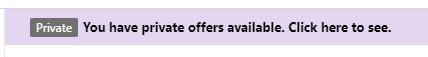

# Red Hat Enterprise Linux Bring-Your-Own-Subscription Gold Images in Azure
Red Hat Enterprise Linux (RHEL) images are available in Azure via a pay-as-you-go (PAYG) or bring-your-own-subscription (Red Hat Gold Image) model. This document provides an overview of the Red Hat Gold Images in Azure.

## Important points to consider

- The Red Hat Gold Images provided in this program are production-ready RHEL images similar the RHEL PAYG images in the Azure Gallery/Marketplace. The registration process to obtain the images is in preview.

- The images follow our current policies described in [Red Hat Enterprise Linux images on Azure](./redhat-images.md)

- Standard support policies apply to VMs created from these images

- The VMs provisioned from Red Hat Gold Images do not carry RHEL fees associated with RHEL PAYG images

- The images are unentitled, so you must use subscription-manager to register and subscribe the VMs to get updates from Red Hat directly

- It is currently not possible to dynamically switch between BYOS and PAYG billing models for Linux images. Redeploying the VM from the respective image is required to switch the billing model

- Azure Disk Encryption (ADE) is supported on these Red Hat Gold Images. ADE support is currently in preview. You must register with Red Hat using subscription-manager before configuring ADE. Once registered, to configure ADE refer to: [Enable Azure Disk Encryption for Linux IaaS VMs](https://docs.microsoft.com/azure/virtual-machines/linux/disk-encryption-overview)

- While the images won’t change (beyond standard updates and patches), the registration process is in preview and the flow will be further improved to streamline the process

- You have full control of the VMs already provisioned from these images or its snapshots regardless of the final implementation

## Requirements and conditions to access the Red Hat Gold Images

1. Get familiar with the [Red Hat Cloud Access program](https://www.redhat.com/en/technologies/cloud-computing/cloud-access) terms and enable your Red Hat subscriptions for Cloud Access at [Red Hat Subscription Manager](https://access.redhat.com/management/cloud). You will need to have on hand the Azure subscription(s) that are going to be registered for Cloud Access.

1. If you have enabled Red Hat subscriptions for Cloud Access that meet the proper eligibility requirements, your Azure subscription(s) will be automatically be enabled for Gold Image access.

### Expected time for image access

Upon completing the Cloud Access enablement steps, Red Hat will validate your eligibility for the Red Hat Gold Images. If validation is successful, you will receive access to the Gold Images within three hours.

## Use the Red Hat Gold Images from the Azure portal

1. After your Azure subscription receives access to Red Hat Gold images, you can locate them in the [Azure portal](https://portal.azure.com) by navigating to **Create a Resource** and then **See all**.

1. At the top of the page, you will see that you have private offers.

    

1. You can click on the purple link or scroll down to the bottom of the page to see your private offers.

1. The rest of provisioning in the UI will be no different to any other existing Red Hat image. Choose your RHEL version and follow the prompts to provision your VM. This process will also let you accept the terms of the image at the final step.

>[!NOTE]
>These steps so far will not enable your Red Hat Gold Image image for programmatic deployment – an additional step will be required as described in the “Additional Information” section below.

The rest of this document focuses on the CLI method to provision and accept terms on the image. The UI and CLI are fully interchangeable as far as the final result (a provisioned RHEL Gold Image VM) is concerned.

## Use the Red Hat Gold Images from the Azure CLI
The following set of instructions will walk you through the initial deployment process for a RHEL VM using the Azure CLI. These instructions assume that you have the [Azure CLI installed](https://docs.microsoft.com/cli/azure/install-azure-cli).

>[!IMPORTANT]
>Make sure you use all lowercase letters in the publisher, offer, plan, and image references for all the following commands

1. Check that you are in your desired subscription:
    ```azurecli
    az account show -o=json
    ```

1. Create a resource group for your Red Hat Gold Image VM:
    ```azurecli
    az group create --name <name> --location <location>
    ```

1. Accept the image terms:
    ```azurecli
    az vm image terms accept --publisher redhat --offer rhel-byos --plan <SKU value here> -o=jsonc

    # Example:
    az vm image terms accept --publisher redhat --offer rhel-byos --plan rhel-lvm75 -o=jsonc

    OR

    az vm image terms accept --urn RedHat:rhel-byos:rhel-lvm8:8.0.20190620
    ```
    >[!NOTE]
    >These terms need to be accepted *once per Azure subscription, per image SKU*.

1. (Optional) Validate your VM deployment with the following command :
    ```azurecli
    az vm create -n <VM name> -g <resource group name> --image <image urn> --validate

    # Example:
    az vm create -n rhel-byos-vm -g rhel-byos-group --image RedHat:rhel-byos:rhel-lvm75:7.5.20190620
    ```

1. Provision your VM by running the same command as above without the `--validate` argument:
    ```azurecli
    az vm create -n <VM name> -g <resource group name> --image <image urn> --validate
    ```

1. SSH into your VM and verify that you have an unentitled image. To do this, run `sudo yum repolist` (for RHEL 8 use `sudo dnf repolist`). The output will ask you to use subscription-manager to register the VM with Red Hat.

>[!NOTE]
>On RHEL 8 `dnf` and `yum` are interchangeable, more about this in the [RHEL 8 Admin Guide](https://access.redhat.com/documentation/en-us/red_hat_enterprise_linux/8/html/configuring_basic_system_settings/installing-software-with-yum_configuring-basic-system-settings).


## Use the Red Hat Gold Images from the Azure PowerShell Cmdlet
The following is an example script. You should replace the Resource Group, location, VM name, login information, and other variables with the configuration of your choosing. Publisher and plan information must be lowercase.
```powershell-interactive
    # Variables for common values
    $resourceGroup = "testbyos"
    $location = "canadaeast"
    $vmName = "test01"

    # Define user name and blank password
    $securePassword = ConvertTo-SecureString 'Desjardinslab1!' -AsPlainText -Force
    $cred = New-Object System.Management.Automation.PSCredential("azureuser",$securePassword)
    Get-AzureRmMarketplaceTerms -Publisher RedHat -Product rhel-byos -Name rhel-lvm75 | SetAzureRmMarketplaceTerms -Accept
    
    # Create a resource group
    New-AzureRmResourceGroup -Name $resourceGroup -Location $location
    
    # Create a subnet configuration
    $subnetConfig = New-AzureRmVirtualNetworkSubnetConfig -Name mySubnet -AddressPrefix 192.168.1.0/24

    # Create a virtual network
    $vnet = New-AzureRmVirtualNetwork -ResourceGroupName $resourceGroup -Location
    $location `-Name MYvNET -AddressPrefix 192.168.0.0/16 -Subnet $subnetConfig

    # Create a public IP address and specify a DNS name
    $pip = New-AzureRmPublicIpAddress -ResourceGroupName $resourceGroup -Location
    $location `-Name "mypublicdns$(Get-Random)" -AllocationMethod Static -IdleTimeoutInMinutes 4
    
    # Create an inbound network security group rule for port 22
    $nsgRuleSSH = New-AzureRmNetworkSecurityRuleConfig -Name
    myNetworkSecurityGroupRuleSSH -Protocol Tcp `
    -Direction Inbound -Priority 1000 -SourceAddressPrefix * -SourcePortRange * -
    DestinationAddressPrefix * `-DestinationPortRange 22 -Access Allow

    # Create a network security group
    $nsg = New-AzureRmNetworkSecurityGroup -ResourceGroupName $resourceGroup -Location
    $location `-Name myNetworkSecurityGroup -SecurityRules $nsgRuleSSH

    # Create a virtual network card and associate with public IP address and NSG
    $nic = New-AzureRmNetworkInterface -Name myNic -ResourceGroupName $resourceGroup -
    Location $location `-SubnetId $vnet.Subnets[0].Id -PublicIpAddressId $pip.Id -NetworkSecurityGroupId $nsg.Id

    # Create a virtual machine configuration
    $vmConfig = New-AzureRmVMConfig -VMName $vmName -VMSize Standard_D3_v2 |
    Set-AzureRmVMOperatingSystem -Linux -ComputerName $vmName -Credential $cred |
    Set-AzureRmVMSourceImage -PublisherName redhat -Offer rhel-byos -Skus rhel-lvm75 -Version latest | Add-     AzureRmVMNetworkInterface -Id $nic.Id
    Set-AzureRmVMPlan -VM $vmConfig -Publisher redhat -Product rhel-byos -Name "rhel-lvm75"
 
    # Configure SSH Keys
    #$sshPublicKey = Get-Content "$env:USERPROFILE\.ssh\id_rsa.pub"
    #Add-AzureRmVMSshPublicKey -VM $vmconfig -KeyData $sshPublicKey -Path "/home/azureuser/.ssh/authorized_keys"
    
    # Create a virtual machine
    New-AzureRmVM -ResourceGroupName $resourceGroup -Location $location -VM $vmConfig
```

## Additional information
- If you attempt to provision a VM on a subscription that is not enabled for this offer, you will get the following error and you should contact Microsoft or Red Hat to enable your subscription.
    ```
    "Offer with PublisherId: redhat, OfferId: rhel-byos, PlanId: rhel-lvm75 is private and can not be purchased by subscriptionId: GUID"
    ```

- If you create a snapshot from the RHEL BYOS image AND publish the image in [Shared Image Gallery](https://docs.microsoft.com/azure/virtual-machines/linux/shared-image-galleries), you will need to provide plan information that matches the original source of the snapshot. For example, the command might look like (note the plan parameters in the final line):
    ```azurecli
    az vm create –image \
    "/subscriptions/GUID/resourceGroups/GroupName/providers/Microsoft.Compute/galleries/GalleryName/images/ImageName/versions/1.0.0" \
    -g AnotherGroupName --location EastUS2 -n VMName \
    --plan-publisher redhat --plan-product rhel-byos --plan-name rhel-lvm75
    ```

- If you are using automation to provision VMs from the RHEL BYOS images, you will need to provide plan parameters similar to what was shown above. For example, if you are using Terraform, you would provide the plan information in a [plan block](https://www.terraform.io/docs/providers/azurerm/r/virtual_machine.html#plan).

## Next steps
* Step-by-step guides and program details for Cloud Access are available in the [Red Hat Cloud Access documentation.](https://access.redhat.com/documentation/en-us/red_hat_subscription_management/1/html/red_hat_cloud_access_reference_guide/index)
* Learn more about the [Azure Red Hat Update Infrastructure](./redhat-rhui.md).
* To learn more about the Red Hat images in Azure, go to the [documentation page](./redhat-images.md).
* Information on Red Hat support policies for all versions of RHEL can be found on the [Red Hat Enterprise Linux Life Cycle](https://access.redhat.com/support/policy/updates/errata) page.
