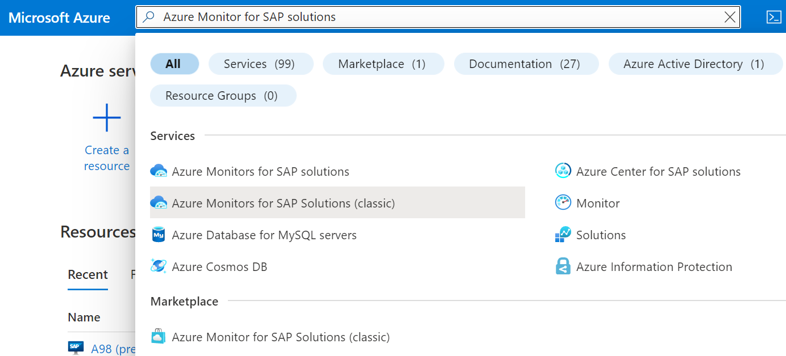
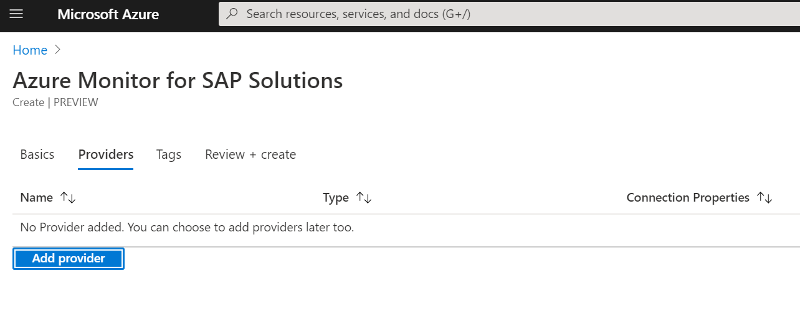
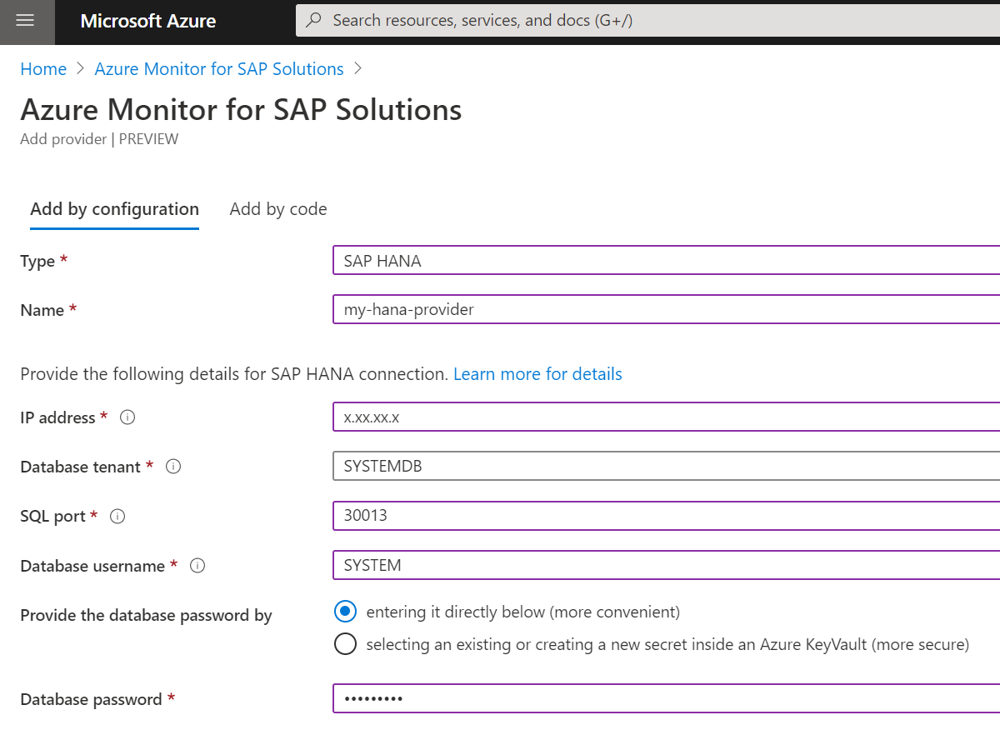
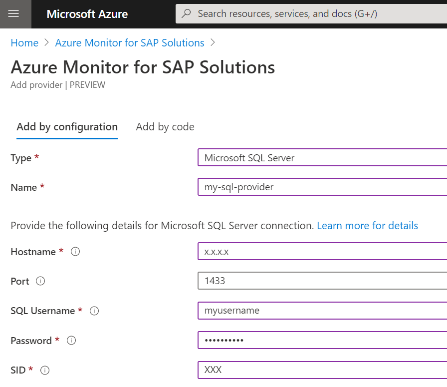

# Deploy Azure Monitor for SAP solutions with Azure portal

Azure Monitor for SAP Solutions (AMS) resources can be created through the [Azure portal](https://azure.microsoft.com/en-us/features/azure-portal). This method provides a browser-based user interface to deploy Azure Monitor for SAP solutions and configure providers.

## Sign in to Azure portal

Sign in to the Azure portal at https://portal.azure.com

## Create monitoring resource

1. Select **Azure Monitor for SAP Solutions** from the **Azure Marketplace**.




2. In the **Basics** tab, provide required values. If applicable, you can use an existing Log Analytics workspace.

> [!NOTE]
>  Ensure that the systems you want to monitor are reachable from within the selected virtual network.


> [!IMPORTANT]
> Selecting **Share** for Data sharing with Microsoft  enables our support teams get more
visibility and provider improved support.

## Configure providers

### SAP HANA provider 

1. Select the **Provider** tab to add the providers you want to configure. You can add multiple providers one after another or add them after deploying the monitoring resource. 




2. Select **Add provider** and choose **SAP HANA** from the drop down. 

3. Insert the Private IP for the HANA server.

4. Insert the name pf the Database tenant you want to use. You can choose any tenant however we recommend using SYSTEMDB as it enables monitoring for wider areas. 

5. Insert SQL port number associated with your HANA database. The port number should be in the format of
*3(Instance#)13* or *3(instance#)15*. 

6. Insert the Database username you want to use. Ensure that database user has the **monitoring** and **catalog read** roles assigned. 

7. When finished, select **Add provider**. Continue to add additional providers as needed or select **Review + create** to complete the deployment.



### High-availability cluster (Pacemaker) provider

1. Choose **High-availability cluster (Pacemaker)** from the drop down. 
> [!IMPORTANT]
> To configure the High-availability cluster (Pacemaker) provider, ensure that ha_cluster_provider is installed in each node. For more information see [HA cluster exporter](https://github.com/ClusterLabs/ha_cluster_exporter#installation)


 2. Enter the Prometheus endpoint in the form of http://IP:9664/metrics. 
 
3. Enter the System ID (SID), hostname and cluster name

4. When finished, select **Add provider**. Continue to add additional providers as needed or select **Review + create** to complete the deployment.


### Microsoft SQL Server provider

1. Prior to adding the Microsoft SQL Server provider, you should run the following script in SQL Server Management Studio to create a user with the appropriate permissions needed to configure the provider.

```sql
USE [<Database to monitor>]
DROP USER [AMS]
GO
USE [master]
DROP USER [AMS]
DROP LOGIN [AMS]
GO
CREATE LOGIN [AMS] WITH PASSWORD=N'<password>', DEFAULT_DATABASE=[<Database to monitor>], DEFAULT_LANGUAGE=[us_english], CHECK_EXPIRATION=OFF, CHECK_POLICY=OFF
CREATE USER AMS FOR LOGIN AMS
ALTER ROLE [db_datareader] ADD MEMBER [AMS]
ALTER ROLE [db_denydatawriter] ADD MEMBER [AMS]
GRANT CONNECT TO AMS
GRANT VIEW SERVER STATE TO AMS
GRANT VIEW SERVER STATE TO AMS
GRANT VIEW ANY DEFINITION TO AMS
GRANT EXEC ON xp_readerrorlog TO AMS
GO
USE [<Database to monitor>]
CREATE USER [AMS] FOR LOGIN [AMS]
ALTER ROLE [db_datareader] ADD MEMBER [AMS]
ALTER ROLE [db_denydatawriter] ADD MEMBER [AMS]
GO
``` 

2. Select **Add provider** and choose **Microsoft SQL Server** from the drop down. 

3. Fill out the fields using information associated with your Microsoft SQL Server. 

4. When finished, select **Add provider**. Continue to add additional providers as needed or select **Review + create** to complete the deployment.




## What's next

Learn more about [Azure Monitor for SAP Solutions](azure-monitor-overview.md)
