# Enterprise Scale for SAP Automation Framework Deployment - Hands on Lab

## Scenario

For this workshop we will be using the cloud shell in Azure portal to deploy the Control Plane infrastructure. Then, we will be using the Deployer VM to deploy the remaining infrastructure and the SAP HANA configurations. There is a feature-locked branch based on the Automation Framework that will enable us to follow this scenario. This is the
**sap-level-up** branch.

### Lab Outline

During this lab you will perform the following tasks

1. Deploy the Control Plane (Deployer Infrastructure & Library)
2. Deploy the Workload Zone (Landscape, System)
3. Download/Upload BOM
4. Configure standard and SAP specific OS settings
5. Install HANA DB
6. Install SCS server
7. Load HANA DB
8. Install Primary Application Server

## Introduction

The SAP on Azure Deployment Automation Framework is an open-source solution that can be used to deploy SAP Infrastructures and install SAP applications in Azure. You can create infrastructure for SAP landscapes based on SAP HANA and NetWeaver with AnyDB on any of the SAP-supported operating system versions and deploy them into any Azure region.

There are three main steps of an SAP deployment on Azure with the automation framework.

1. Preparing the region. This step deploys components to support the SAP automation framework in a specified Azure region. Some parts of this step are:
   1. Creating the deployment environment
   2. Creating shared storage for Terraform state files
   3. Creating shared storage for SAP installation media

2. Preparing the workload zone. This step deploys the workload zone components, such as the virtual network and key vaults.

3. Deploying the system. This step includes the infrastructure for the SAP system.

While there are several workflows to deploying the deployment automation, we will be focusing on one workflow for ease of deployment i.e. a SAP-S4HANA standalone environment deployed using bash. During the course of the lab we will describe the general hierarchy and different phases of the deployment.

### Environment Overview

The SAP on Azure Deployment Automation Framework has two main components:

- Deployment infrastructure (control plane)
- SAP Infrastructure (SAP Workload)

The dependency between the control plane and the application plane is illustrated in the diagram below:


The framework uses Terraform for infrastructure deployment, and Ansible for the operating system and application configuration. A logical segration of the control plane and workload zone are depicted below with an explanation of the configuration following the diagram

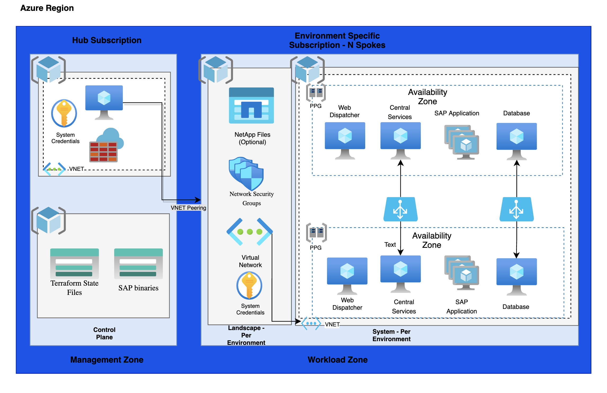

#### Management Zone

 The management zone houses the control plane infrastructure from which other environments will be deployed. Once the management zone is deployed, it rarely needs to be redeployed, if ever.

 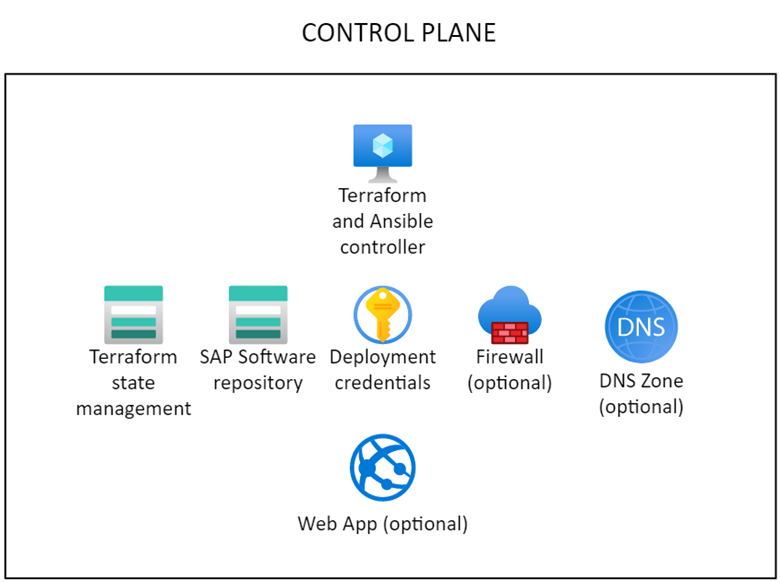

**Deployer:**
The deployer is the execution engine of the SAP automation framework. It is a pre-configured virtual machine (VM) that is used for executing Terraform and Ansible commands.

**Library:**
The SAP Library provides the persistent storage of the Terraform state files and the downloaded SAP installation media for the control plane.

The configuration of the deployer and library is performed in a Terraform tfvars variable file.

#### Workload Zone

An SAP application typically has multiple deployment tiers. For example, you might have development, quality assurance, and production tiers. The SAP deployment automation framework refers to these tiers as workload zones.


**Landscape:**
The Landscape contains the Networking for the SAP VMs, including Route Tables, NSGs, and Virtual Network. The Landscape provides the opportunity to divide deployments into different environments (Dev,Test, Prod)

**System:**
The system deployment consists of the virtual machines that will be running the SAP application, including the web, app and database tiers.

## Hands On Lab

### Task 0: Repository, Downloads and Tooling

The GitHub repository can be found at the link below:

[Azure/sap-hana: Tools to create, monitor and maintain SAP landscapes in
Azure. (github.com)](https://github.com/Azure/sap-hana)

When working with the code, kindly ensure that we change the branch from master to **sap-level-up**:

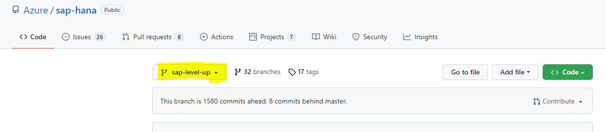

You will need an SSH client to connect to the Deployer. Use any SSH client that you feel comfortable with.

#### Review the Azure Subscription Quota

Please ensure that your Microsoft Azure Subscription has a sufficient core quote for DdSV4 & EdsV4 family SKU in the elected region. About 50 cores each available for VM family should suffice.

### Task 1: Cloud Shell Setup

- Go to [Azure Cloud Shell](https://shell.azure.com)
- Run the following command:

  ```shell
  az login
  ```

    Follow the instructions displayed to authenticate. You should see the following screen upon successful authentication:

    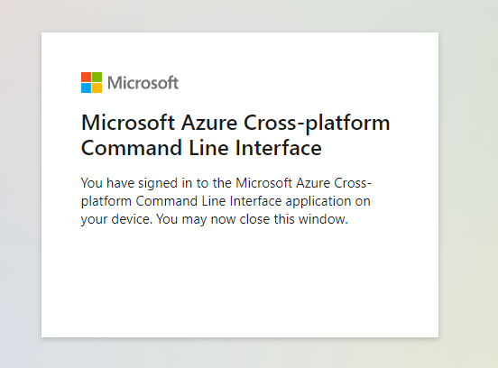

- If you want to change your active subscription to a subscription where you would like to execute the lab steps, kindly run:
  
  ```shell
    az account set -s <Subscription ID>
  ```

- Validate that the switch to the active subscription worked by
running one of the following commands:

    ```shell
    az account list --query "[?isDefault]"
    ** or **
    az  account list -o table | grep True
    ```

- Create the required folders and clone the git repository for setting up our execution environment by executing the following commands:

    ```shell
        mkdir -p ~/Azure_SAP_Automated_Deployment

        cd ~/Azure_SAP_Automated_Deployment
        
        git clone https://github.com/Azure/sap-hana.git \
            --single-branch --branch=sap-level-up
        
        cd ~/Azure_SAP_Automated_Deployment/sap-hana
        
        git status -v
    ```

- We can validate the versions of terraform, az cli and jq on cloudshell by running the following command:

   ```shell
    ./util/check_workstation.sh
   ```

    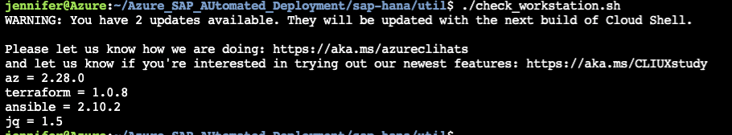

- The below versions are supported for the automation:
  - az = 2.28.0
  - terraform >= 1.0.3
  - ansible = 2.10.2
  - jq = 1.5

    If you do not have at least version 1.0.8 for Terraform, please upgrade using the instructions [here](https://www.terraform.io/upgrade-guides/0-12.html)

### Task 2: SPN Creation

*Per Microsoft security guidelines, there will be no screenshots of this task.*

- The SAP Deployment Frameworks uses Service Principals when doing the deployment. You can create the Service Principal for the Control Plane deployment using the following steps using an account with permissions to create Service Principals:
    > *When choosing the name for your service principal, ensure that the name is unique within your Azure tenant*
    >
    > *The service-principal needs contributor and user access administrator permissions*

    ```shell
        az ad sp create-for-rbac --role="Contributor" \
        --scopes="/subscriptions/<subscriptionID>" \
        --name="<environment>-Deployment-Account"
    ```

- After running this command, you will have output that is populated with actual values, like the following:

    ```json
        {
            "appId": "<AppID>",
            "displayName": "<environment>-Deployment-Account ",
            "name": "<AppID>,
            "password": "<AppSecret>",
            "tenant": "<Tenant ID>"
        }
    ```

- Record the details to a notepad/similar as these details are key for the next steps. The pertinent fields are:
  - *appId*
  - *password*
  - *Tenant*

- For your reference, here is the mapping between the output above and the parameters that you will need to populate later for the automation commands:

    | **Parameter Input name** | **Output from above** |
    |--------------------------|-----------------------|
    | spn_id               | appId           |
    | spn_secret           | password       |
    | tenant_id            | tenant         |

- Once the data has been gathered, assign the "*User Access Administrator*" role to the SPN by running the following command:

    ```shell
        az role assignment create --assignee <appId> \
        --role "User Access Administrator"
    ```

### Task 3: Copy the WORKSPACES folder and view the configuration files

**Note:** *You should always treat the sap-hana repository as
read-only* and work in a copy of the **WORKSPACES** folder where you will make your configuration edits. That way, you will not be editing the branch you are in and can keep your configurations stable if the repository is updated.

- In the Cloud Shell, type the following commands to copy the sample configurations to a local workspace directory:

    ```shell
        cd ~/Azure_SAP_Automated_Deployment

        cp -Rp ./sap-hana/deploy/samples/WORKSPACES ./
    ```

    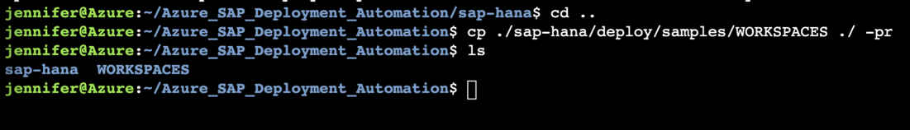

- VS Code is available in cloudshell and is accessible via running ```code .``` (Note: There is a period at the end of the command)
    
    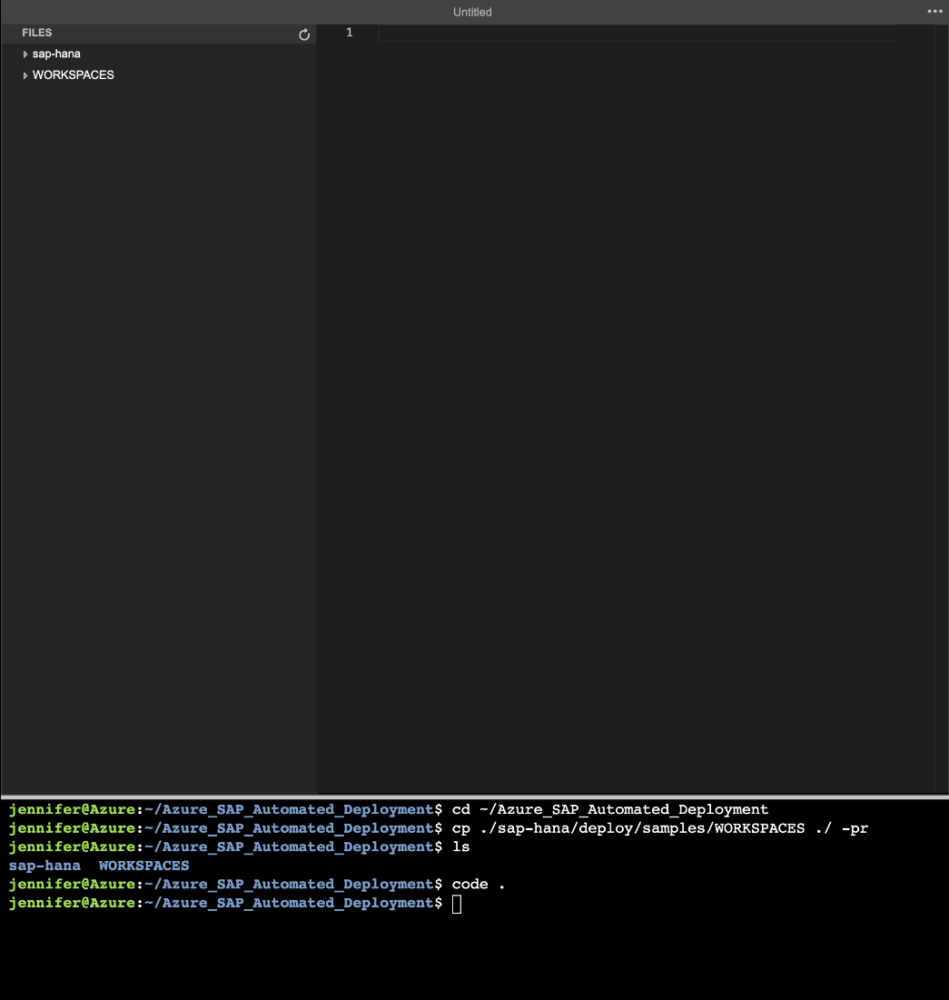

- Expanding the **WORKSPACES** directory, you will see 5 sub folders:
  - *DEPLOYER*,
  - *LANDSCAPE*,
  - *LIBRARY*,
  - *SYSTEM*,
  - *BOMS*

  Expand each of these folders to find regional deployment
  configuration files similar to the below screenshot:
  
  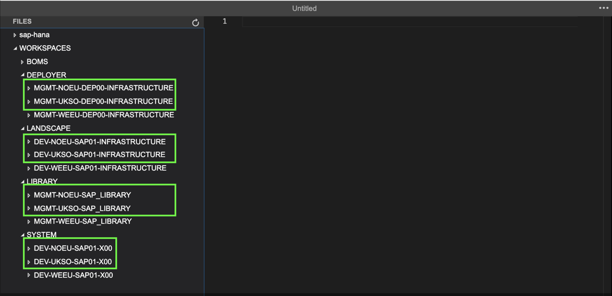

- We have mapped different Azure region with 4-character code (Upper Case) and subsequent folders inside WORKSPACES folder has been created to represent deployment in those respective regions. Please find the below table for reference

    | Region Name        | Region Code |
    |--------------------|-------------|
    | Australia East     | AUEA        |
    | Canada Central     | CACE        |
    | Central US         | CEUS        |
    | East US            | EAUS        |
    | North Europe       | NOEU        |
    | South Africa North | SANO        |
    | Southeast Asia     | SOEA        |
    | UK South           | UKSO        |
    | West US 2          | WES2        |

- If you drill down into each regional sub folder, you will see the Terraform variable files that are used for configuration. Snippet of the **DEPLOYER** Terraform variable file below.
  
  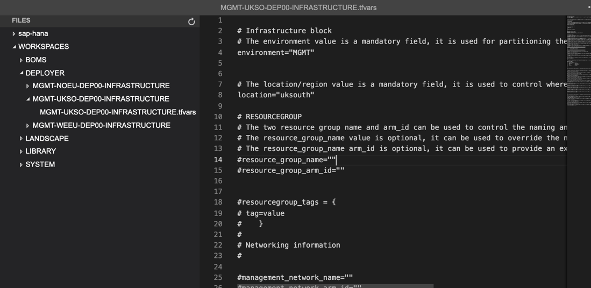

- There are no edits necessary for the Terraform variable files this is informational only so that you can view them and know where to make edits for future deployments.

### Task 4: Control plane deployment

- We will use the **prepare_region** script in order to deploy the Deployer and Library. These deployment pieces make up the
control plane for a chosen "Automation Region".

- The deployment will go through cycles of deploying the infrastructure, refreshing the state, and uploading the Terraform state files to the Library storage account. All of these steps are packaged into a single deployment script. The script needs to know the location of the configuration file for Deployer and Library, as well as a few parameters that will be shown below

  For example, we want to choose North Europe as the deployment location. The region code can be found in the earlier section as NOEU. Then, the sample Deployer configuration file MGMT-NOEU-DEP00-INFRASTRUCTURE.tfvars is located in the *~/Azure_SAP_Automated_Deployment/WORKSPACES/DEPLOYER/MGMT-NOEU-DEP00-INFRASTRUCTURE* folder.

  The sample SAP Library configuration file MGMT-NOEU-SAP_LIBRARY.tfvars is located in the *~/Azure_SAP_Automated_Deployment/WORKSPACES/LIBRARY/MGMT-NOEU-SAP_LIBRARY* folder.

- Running the command below will create the Deployer, the SAP Library and add the Service Principal details to the deployment key vault.

    ```shell
    cd ~/Azure_SAP_Automated_Deployment/WORKSPACES

    subscriptionID=<subscriptionID>
    appId=<appID>
    spn_secret=<password>
    tenant_id=<tenant>

    export DEPLOYMENT_REPO_PATH="${HOME}/Azure_SAP_Automated_Deployment/sap-hana/"
    export ARM_SUBSCRIPTION_ID="${subscriptionID}"

    ${DEPLOYMENT_REPO_PATH}/deploy/scripts/prepare_region.sh                                                     \
        --deployer_parameter_file DEPLOYER/MGMT-NOEU-DEP00-INFRASTRUCTURE/MGMT-NOEU-DEP00-INFRASTRUCTURE.tfvars  \
        --library_parameter_file LIBRARY/MGMT-NOEU-SAP_LIBRARY/MGMT-NOEU-SAP_LIBRARY.tfvars                      \
        --subscription $subscriptionID                                                                           \
        --spn_id $appID                                                                                          \
        --spn_secret "$spn_secret"                                                                               \ 
        --tenant_id $tenant
    ```

> If you run into authentication issues, you can run *az logout* to logout and clear token-cache and then run *az login* to re-authenticate.

- The Automation will run the Terraform Initialize and Plan operations.

  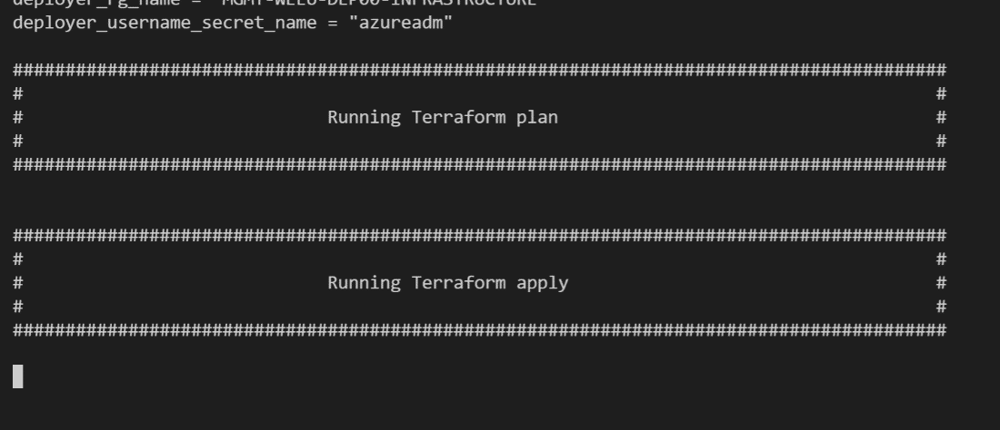

- The deployment of the deployer may run between 15 and 20 min. You should see the progress of the deployment such as below:

  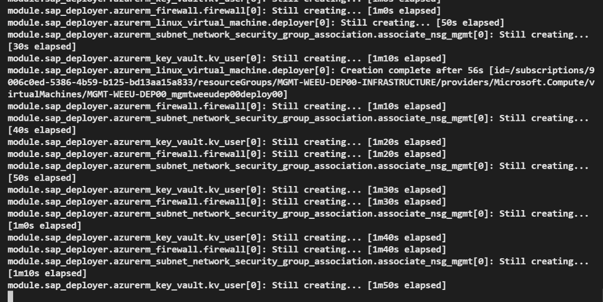

- When the entire deployment is complete, go to the Azure portal and you should see two new resource groups *MGMT-[region]-DEP00-INFRASTRUCTURE* and *MGMT-[region]-SAP_LIBRARY*. These represent the deployer infrastructure and the library respectively.

    Deployer resource group

    

    Library resource group

    

    You will find that the terraform state has been migrated to the storage account whose name contains 'tfstate'. With the storage account, we have a container also named 'tfstate'. You should see the Deployer and Library state files in there:
    
    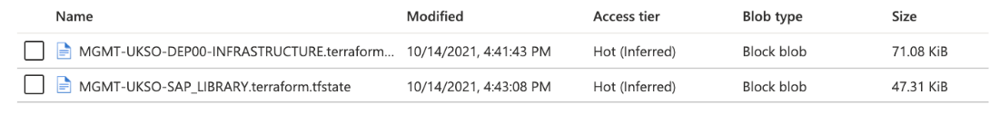

#### Common issues and solutions

If you get the following error for the Deployer module deployment, ensure that you have navigated to the WORKSPACES directory:
  
  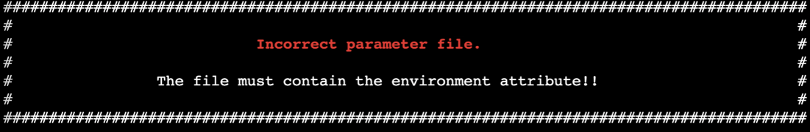

If you get the following error for the Deployer deployment, this is transient, and you can simply rerun the exact same command, prepare_region.sh
  
  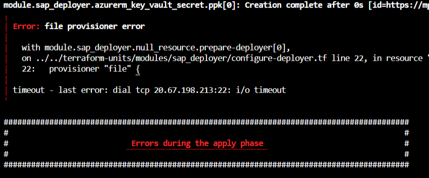

If you run into authentication issues directly after running the prepare_region script, please execute:

```shell
az logout

az login
```

If you execute az logout, then you must export your session variables again

### Task 5: Connecting to the Deployer VM

Ensure that you can connect to your deployer machine as we will be deploying the rest of the infrastructure from that machine

- In your Azure subscription, look for the key vault which starts with "**MGMT[Region]DEP00user**". This will be found in the Deployer resource group.

- Once in the key vault, click on the secrets section
  
  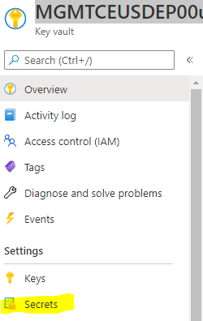

- We should have a secret for the SSH key with the following pattern: "**MGMT-[Region]-DEP00-sshkey**"

- Click on the SSH Key secret and on the next screen Click on the current version to access the secret key

- Copy the private ssh key
  
  

- Open Notepad and paste the secret value. Copy the file to,    "C:\\Users\\\[your alias\]\\.ssh". Save the file without any extension. As an example, you can save the file as "deployer_ssh":
    
    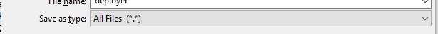

- You can now connect to the deployer VM via any SSH client using the public IP address from earlier section and the SSH key we downloaded now.
  >If using Putty, the SSH key file needs to be converted via PuttyGen
  >
  >The default username is *azureadm*

- Once connected to the deployer VM, you can now provision the workload zone

---
> [!IMPORTANT] > The rest of the tasks need to be executed on the Deployer
---

### Task 6: SAP software acquisition and BOM

> **Note** This step requires a valid SAP user account (SAP-User or S-User account) with software download privileges.

The Automation Framework gives you tools to download the SAP Bill Of Materials (BOM). The downloaded files will be stored in the sapbits storage account in the SAP Library. The idea is that the sap library will act as the archive for all sap media requirements for a project.

The BOM itself mimics the SAP maintenance planner in that we have the relevant product ids and the package download URLs. Once the BOM is processed, during SAP system configuration the Deployer reads the BOM and downloads files from the storage account to the SCS Server for Installation.

A sample extract of a BOM file is provided below:

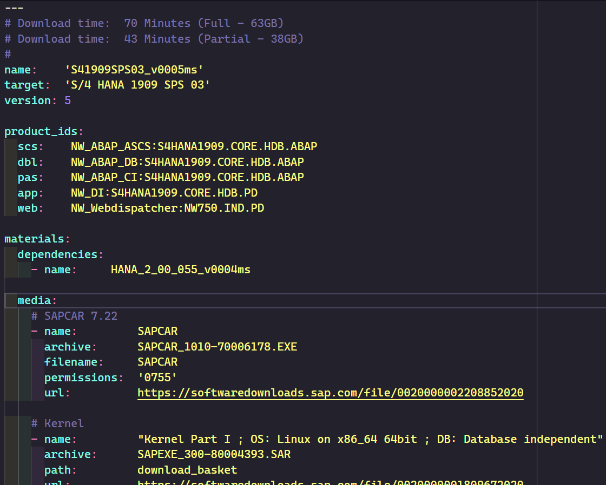

- Starting the activity would need us to configure your deployer key vault secrets. For this example configuration, the resource group is MGMT-NOEU-DEP00-INFRASTRUCTURE and the deployer key vault name would contain *MGMTNOEUDEP00user* in the name.

- Add a secret with the username for your SAP user account. Replace [keyvault-name] with the name of your deployer key vault. Also replace [sap-username] with your SAP username.

  ```shell
    az keyvault secret set --name "S-Username" --vault-name "<keyvault-name>" --value "<sap-username>";
  ```

- Add a secret with the password for your SAP user account. Replace [keyvault-name] with the name of your deployer key vault. Also replace [sap-password] with your SAP password.

  ```shell
    az keyvault secret set --name "S-Password" --vault-name "<keyvault-name>" --value "<sap-password>";
  ```

- Next, configure your SAP parameters file for the download process. Then, download the SAP software using Ansible playbooks. Execute the following commands:

  ```shell
    cd ~/Azure_SAP_Automated_Deployment/WORKSPACES/BOMS

    vi sap-parameters.yaml
  ```

  - In the sapbits_location_base_path parameter, input the storage account name of the sapbits storage account
  - In the kv_name parameter, enter the name of the Deployer resource group key vault
  - Your file should look similar to this:
    
    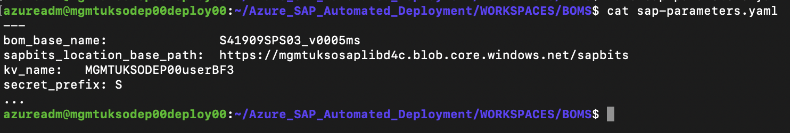

- Then, execute the Ansible playbooks. One way you can execute the playbooks is to use the validator test menu:
  - Run the validator test menu script.
  
    ```shell
        ~/Azure_SAP_Automated_Deployment/sap-hana/deploy/ansible/validator_test_menu.sh
    ```

    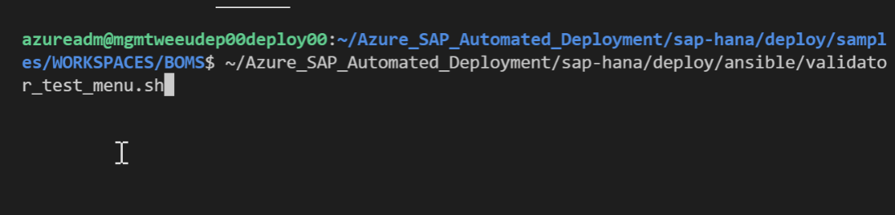
  
  - Select which playbooks you would like to execute.
  
    ```shell
      1) BoM Downloader
      2) BoM Uploader
      3) Quit
      Please select playbook:
    ```

    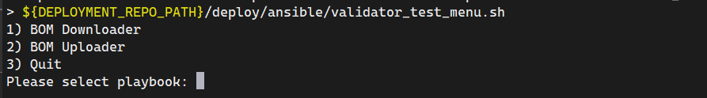

  - Selecting playbook#1 will download the relevant files to the
    deployer VM
    
    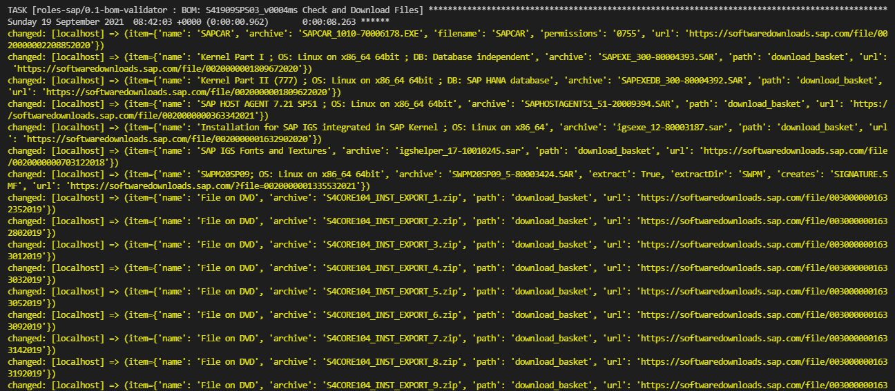

  - Once step #1 completes successfully, then running step #2 uploads the files to the sapbits container in the saplibrary storage account:
    
    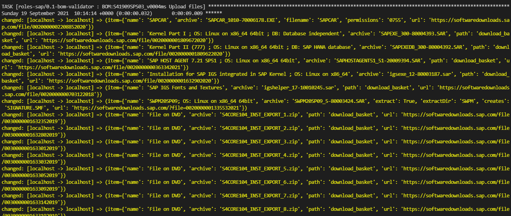

  - Once the upload the is complete, the sapbits container in the saplibrary storage account should look like the below sample screenshots and should have the media for proceeding with installation:
    
    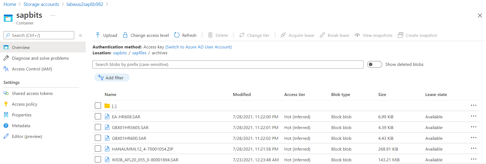

### Task 7: Collect information required for Workload Zone deployment

Once the prepare_region script finishes, you would see that the terraform state file has been moved to a remote backend (azurerm). All the secrets needed to connect to deployer VM are available in a Keyvault provisioned in the Deployer resource group.

- In order to complete the next steps, we would need to collect the following information in a text editor:

  - The name of the Terraform state file storage account in the Library resource group.
    - Following from the example above, the resource group would be *MGMT-NOEU-SAP_LIBRARY*.
    - The name of the storage account would contain *mgmtnoeutfstate*.

  - The name of deployer state file blob, this can be found under Library resource group
    - Library resource group -> state storage account -> containers -> tfstate -> Copy the **name** of the Deployer state file.
    - Following from the example above, the name of the blob will be: *MGMT-NOEU-DEP00-INFRASTRUCTURE.terraform.tfstate*
  
  - The name of the Key Vault in the Deployer resource group.
    - From the example above, the Deployer resource group will be: *MGMT-NOEU-DEP00-INFRASTRUCTURE*
    - The name of the Key Vault in the Deployer resource group will contain: *MGMTNOEUDEP00user*

- The Public IP address of the Deployer VM
  > Deployer resource group -> Deployer VM -> copy Public IP Address
  
### Task 8: Deploy the Workload Zone Prep

Connect to your Deployer VM for the following steps.

- You will find that the repo has been copied to it.

- Navigate into the *Azure_SAP_Automated_Deployment* folder in your home directory.

- Use the following command to remove the existing WORKSPACES folder. We will copy the examples from the repository in a later step

    ```shell
        rm -rf WORKSPACES
    ```

- Navigated to the sap-hana folder and checkout the *sap-level-up* branch.
  
  ```shell
    cd ~/Azure_SAP_Automated_Deployment/sap-hana/

    git checkout sap-level-up
  ```

    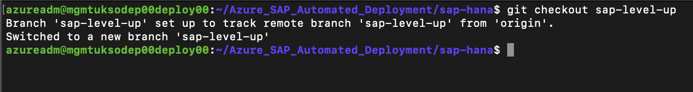

- Copy the sample configuration files from the repository

    ```shell
        cd ~/Azure_SAP_Automated_Deployment/

        cp -Rp ./sap-hana/deploy/samples/WORKSPACES ./
    ```

    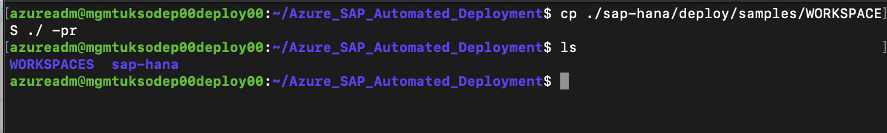

### Task 9: Deploy the Workload Zone

An SAP application typically has multiple development tiers. For example, you might have development, quality assurance, and production tiers. The SAP deployment automation framework refers to these tiers as workload zones.

You can use workload zones in multiple Azure regions. Each workload zone then has its own Azure Virtual Network (Azure VNet)

The following services are provided by the SAP workload zone:

- Azure Virtual Network, including subnets and network security groups.
- Azure Key Vault, for system credentials.
- Storage account for boot diagnostics
- Storage account for cloud witnesses

The workload zones are typically deployed in spokes in a hub and spoke architecture. They may be in their own subscriptions.

Supports the Private DNS from the Control Plane.

- On the Deployer VM, navigate to the *Azure_SAP_Automated_Deployment* folder.
  
  ```shell
    cd ~/Azure_SAP_Automated_Deployment/WORKSPACES/LANDSCAPE/DEV-XXXX-SAP01-INFRASTRUCTURE

    From the example region northeurope, the folder will look like:
    cd ~/Azure_SAP_Automated_Deployment/WORKSPACES/LANDSCAPE/DEV-NOEU-SAP01-INFRASTRUCTURE

  ```

    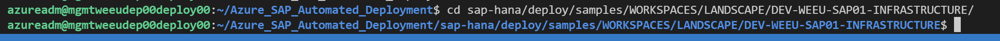

- Open the workload zone configuration file and change the network logical name to match the network name.

  

- The details we collected in **Step-5** will be needed here. These are:
  - name of the tfstate storage account
  - name of the blob which is the deployer tfstate file
  - name of the keyvault in deployer resource group

- Run the following command to kickoff deployment of workload zone:

    ```shell
    cd ~/Azure_SAP_Automated_Deployment/WORKSPACES/LANDSCAPE/DEV-NOEU-SAP01-INFRASTRUCTURE

    subscriptionID=<subscriptionID>
    appId=<appID>
    spn_secret=<password>
    tenant_id=<tenant>
    keyvault=<keyvaultName>
    storageaccount=<storageaccountName>
    statefile_subscription=<subscriptionID>

        ${DEPLOYMENT_REPO_PATH}/deploy/scripts/install_workloadzone.sh                         \
        --parameter_file ./DEV-NOEU-SAP01-INFRASTRUCTURE.tfvars                                \
        --deployer_environment MGMT                                                            \
        --deployer_tfstate_key MGMT-NOEU-DEP00-INFRASTRUCTURE.terraform.tfstate                \
        --storageaccountname $storageaccount                                                   \
        --vault $keyvault                                                                      \
        --state_subscription $statefile_subscription                                           \
        --subscription $subscriptionID                                                         \
        --spn_id $appID                                                                        \
        --spn_secret "$spn_secret"                                                             \
        --tenant_id $tenant
    ```

    The workload zone deployment should kick in automatically

    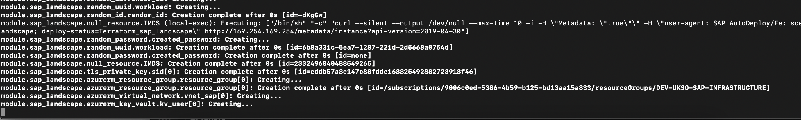

- Once the workload zone deployment is finished, you should see the resource group in the Azure portal.
  
  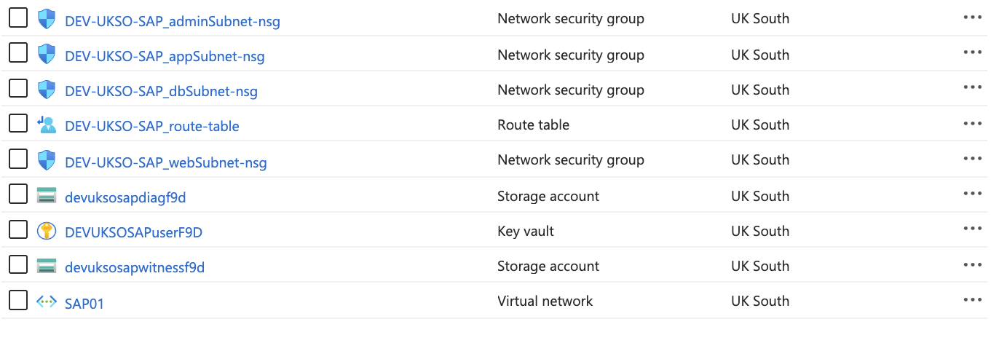

### Task 10: Deploy the SAP system infrastructure

Once the Landscape is complete, you can deploy the SAP system infrastructure resources. The SAP system creates your virtual machines (VMs), and supporting components for your SAP application.

The SAP system deploys:

- The application tier, which deploys the VMs and their disks.
- The SAP central services tier, which deploys a customer-defined number of VMs and an Azure Standard Load Balancer.
- The web dispatcher tier
- The database tier, which deploys database VMs and their disks and a Standard Azure Load Balancer. You can run HANA databases or AnyDB databases in this tier.

- Running the command below will deploy the SAP System.

  ```shell
    cd ~/Azure_SAP_Automated_Deployment/WORKSPACES/SYSTEM/DEV-XXXX-SAP01-X00

    ${DEPLOYMENT_REPO_PATH}/deploy/scripts/installer.sh  \
        --parameterfile DEV-XXXX-SAP01-X00.tfvars        \
        --type sap_system                                \
        --auto-approve
  ```
  
  Adopting to our example above for northeurope:

  ```shell
        cd ~/Azure_SAP_Automated_Deployment/WORKSPACES/SYSTEM/DEV-NOEU-SAP01-X00

        ${DEPLOYMENT_REPO_PATH}/deploy/scripts/installer.sh  \
        --parameter_file DEV-NOEU-SAP01-X00.tfvars           \
        --type sap_system
  ```

- You should the system Resource Group (Abridged) in the portal:
    
    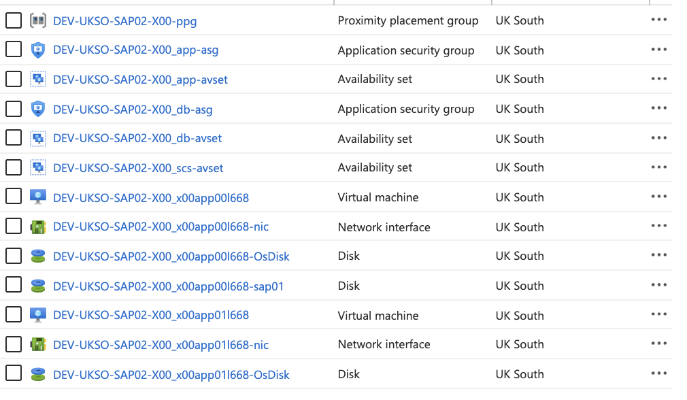

### Task 11: Customizing Naming Conventions

The SAP deployment automation framework on Azure uses standard naming conventions. Consistent naming helps the automation framework run correctly with Terraform. Review the standard terms, area paths, variable names before you begin your deployment.

Standard naming helps you deploy the automation framework smoothly. For example, consistent naming you to:

- Deploy the SAP virtual network infrastructure into any supported Azure region.
- Do multiple deployments with partitioned virtual networks.
- Deploy the SAP system deployment unit into any SAP virtual network.
- Run regular and high availability (HA) instances side-by-side.
- Do disaster recovery and fall forward behavior.

If necessary, you can also configure custom names using the related Terraform module.

The Terraform module sap_namegenerator defines the names of all resources that the automation framework deploys. The module is located at *'../../../deploy/terraform/terraform-units/modules/sap_namegenerator/'* in the repository. You can manage and change all resource names from this module.

There are multiple files within the module for:

- Virtual machine (VM) and computer names (vm.tf)
- Resource groups (resourcegroup.tf)
- Key vaults (keyvault.tf)
- Resource suffixes (variables_local.tf)

### Task 12: SAP Installation

SAP Installation will be carried out via Ansible playbooks. Navigate to the system deployment folder

```shell
cd ~/Azure_ SAP_Automated_Deployment/WORKSPACES/SYSTEM/DEV-NOEU-SAP01-X00/
```

Make sure you have the following files in the system folder:

- sap-parameters.yaml
- SID_host.yaml

For a standalone SAP S/4HANA system we have 8 playbooks to execute in sequence. Which can be triggered from a test menu. This a test harness which allows us to execute the playbooks.

1. OS Config
2. SAP Specific OS Config
3. BoM processing
4. HANA DB Install
5. SCS Install
6. DB Load
7. PAS Install
8. APP Install (Optional)

We can trigger the execution of the playbooks by running the following command:

  ```shell
    ${DEPLOYMENT_REPO_PATH}/deploy/ansible/test_menu.sh
  ```

#### 12-1: OS Config

Selecting this playbook does the generic OS configuration setup on all the machines
    
    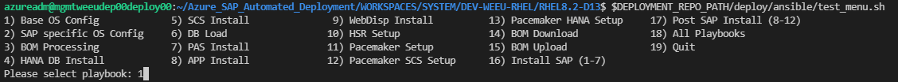
    
    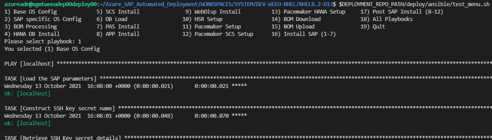

At the end you will see the screen like below
    
    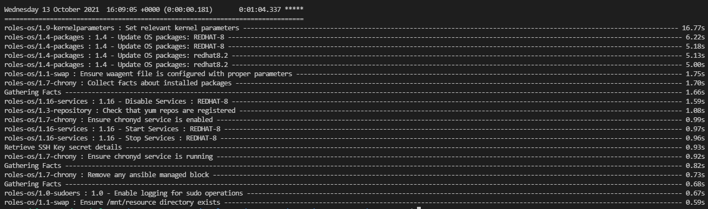

#### 12-2: SAP Specific OS config

Selecting this playbook does the SAP specific OS configuration setup on all the
machines
    
    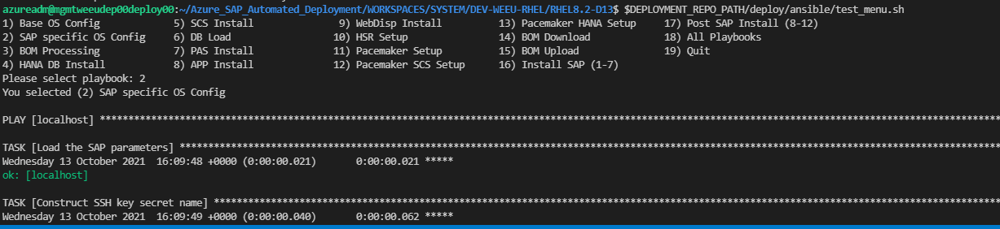
    
    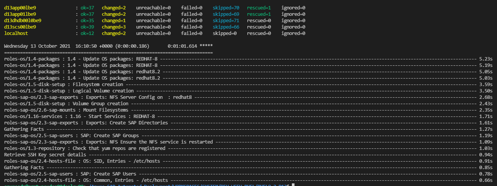

#### 12-3: BoM Processing

Selecting this playbook, downloads the SAP software to the scs node.
    
    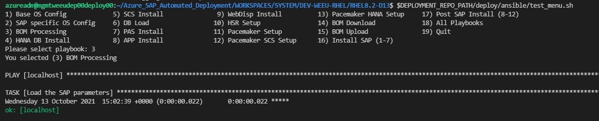
    
    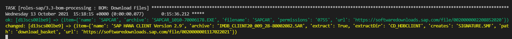

#### 12-4: HANA DB Install

The password of user DBUser may only consist of alphanumeric characters and the special characters #, $, @ and \_. The first character must not be a digit or an underscore

Before you install HANA please check the secret DEV-WEEU-SAP-\<SID>-sap-password
inside workload zone keyvault have the value not starting with a digit.

  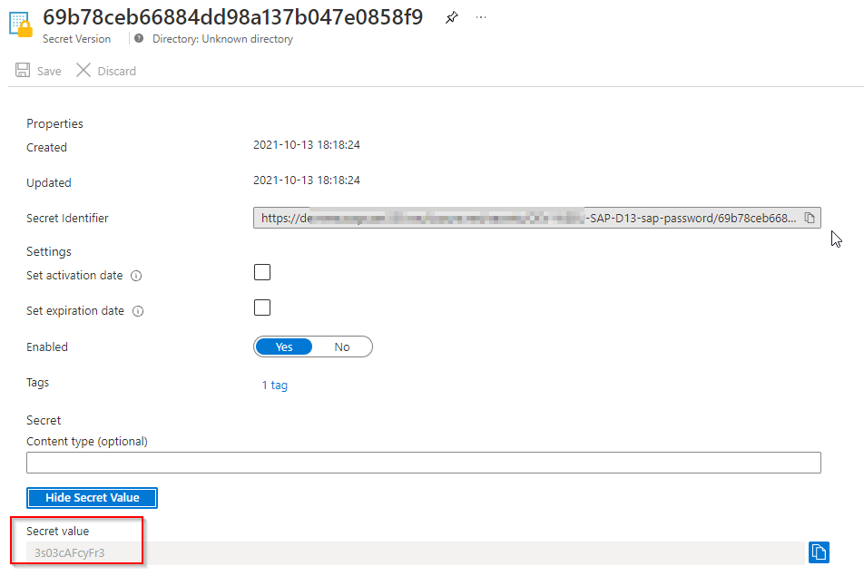

So, if the value looks like above i.e starting with a number, we need to change it.

  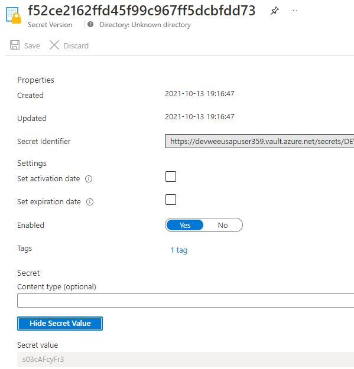

Triggering the playbook will initiate HANA install on the DB node
  
  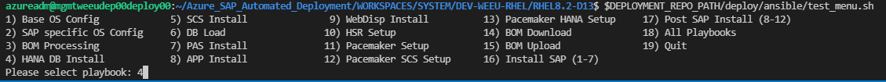

  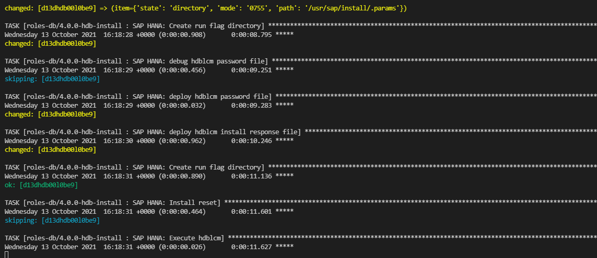

  

#### 12-5: SCS Install
  
This triggers the central services installation
  
  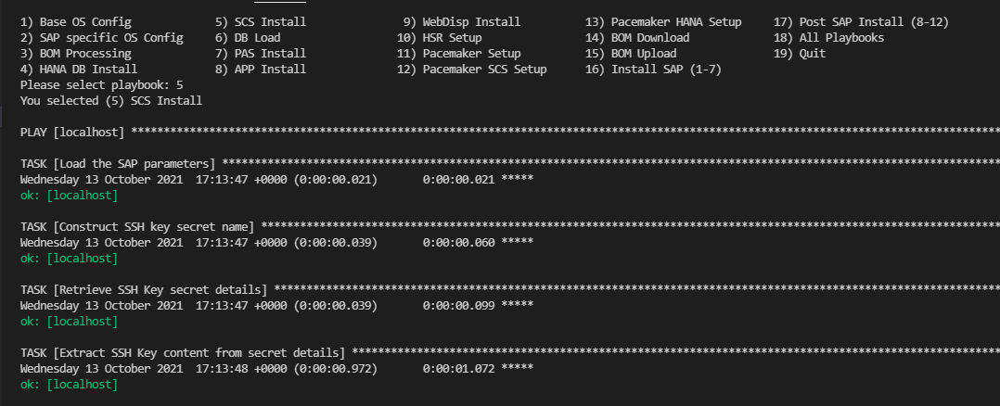
  
  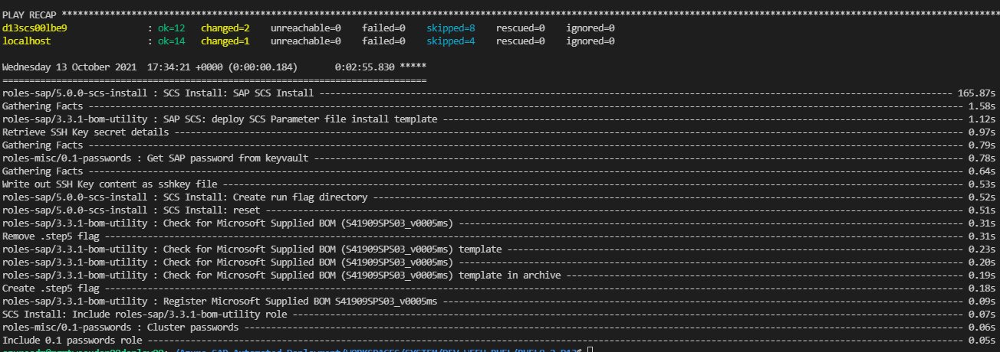

#### 12-6: DB Load

Triggers DB load for the previously installed HANA database from PAS server.
  
  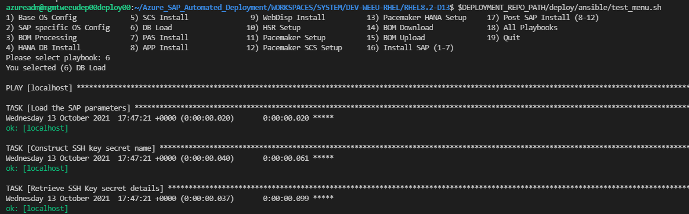

  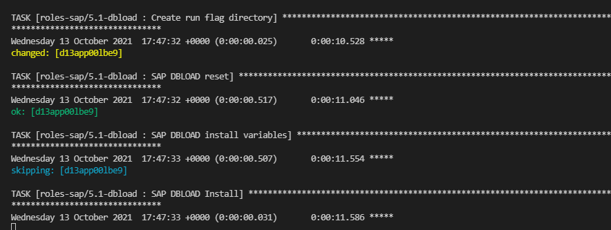

  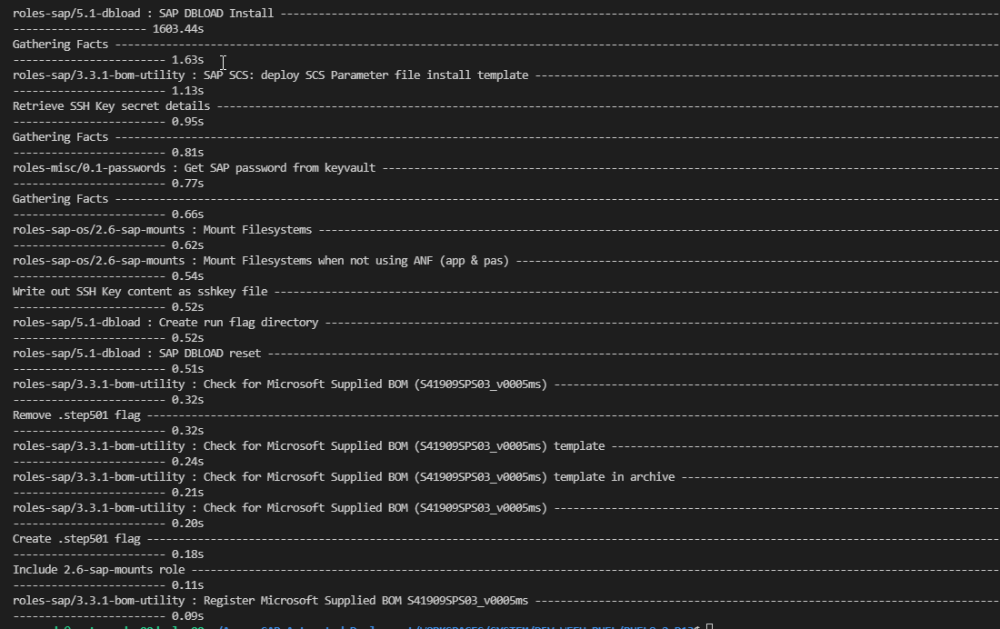

#### 12-7: PAS Install

Triggers PAS installation
  
  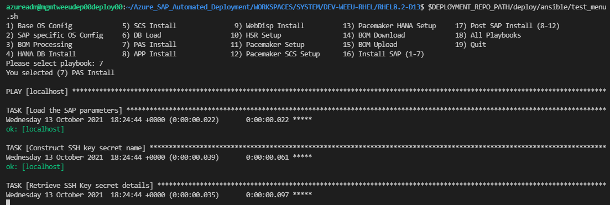

  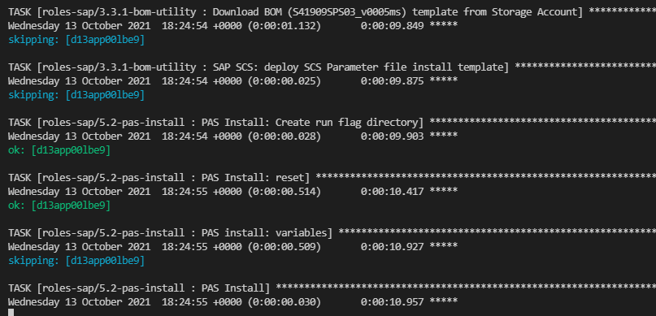
  
  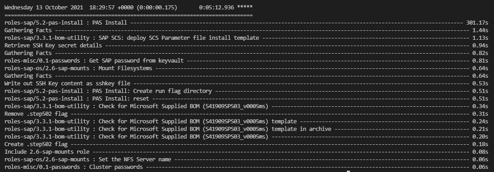

#### 12-8: APP Install

Triggers app server installation.
  
  

  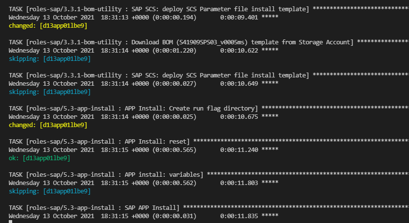

  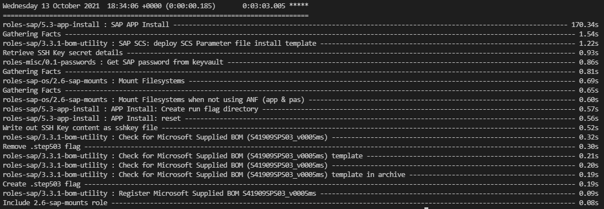

---

**Congratulations!** You now have deployed and configured a stand-alone HANA system.

---

---

### SAP Installation clean-up

You may perform this task outside of the lab but please be sure to do so as the *infrastructure can be quite expensive - do not delay!*

Follow the below steps in sequence to remove the entire SAP infrastructure you have deployed earlier:

1. Remove SAP system infrastructure resources
2. Remove Workload Zone (a.k.a Landscape)
3. Remove Control Plane

>Please also note that removal of of SAP infra-Resources and workload zone steps should be executed from the deployer VM and the removal of the control plane needs to be executed from the cloudshell

So, let’s start cleaning up Azure resources (for 1 and 2 as mentioned above) from your Deployer VM

Before you start executing remover script make sure you have logged into your Azure account and are in the appropriate subscription to execute the steps

#### Removal of SAP infra resources

- Navigate to the DEV-NOEU-SAP01-X00 subfolder inside SYSTEM folder and execute the below command from there
  
  ```shell
    cd ~/Azure_SAP_Automated_Deployment/WORKSPACES/SYSTEM/DEV-NOEU-SAP01-X00

    ${DEPLOYMENT_REPO_PATH}/deploy/scripts/remover.sh          \
          --parameter_file DEV-NOEU-SAP01-X00.tfvars           \
          --type sap_system
  ```

#### Removal of SAP workload resources

- Navigate to the DEV-XXXX-SAP01-INFRASTRUCTURE sub-folder inside LANDSCAPE folder and execute the below command from there

  ```shell
    cd ~/Azure_SAP_Automated_Deployment/WORKSPACES/LANDSCAPE/DEV-NOEU-SAP01-INFRASTRUCTURE

    ${DEPLOYMENT_REPO_PATH}/deploy/scripts/remover.sh          \
          --parameter_file DEV-NOEU-SAP01-INFRASTRUCTURE.tfvars           \
          --type sap_landscape
  ```

#### Removal of Control Plane

- Now go to [cloudshell](https://shell.azure.com)

- Before you start executing remover script make sure you have logged into your Azure account and are in the appropriate subscription to execute the steps

- Navigate to the WORKSPACES folder 
  
  ```shell
    cd ~/Azure_SAP_Automated_Deployment/WORKSPACES/
  ```

- Export the below two environment variables

  ```shell
    export DEPLOYMENT_REPO_PATH=~/Azure_SAP_Automated_Deployment/sap-hana

    export ARM_SUBSCRIPTION_ID=<subscriptionID>
  ```

- Run the below command:

  ```shell
    ${DEPLOYMENT_REPO_PATH}/deploy/scripts/remove_region.sh                                                  \
    --deployer_parameter_file DEPLOYER/MGMT-NOEU-DEP00-INFRASTRUCTURE/MGMT-NOEU-DEP00-INFRASTRUCTURE.tfvars  \
    --library_parameter_file LIBRARY/MGMT-NOEU-SAP_LIBRARY/MGMT-NOEU-SAP_LIBRARY.tfvars
  ```

  **Congratulation!** You have cleaned up all resources.

---

# Thank you
