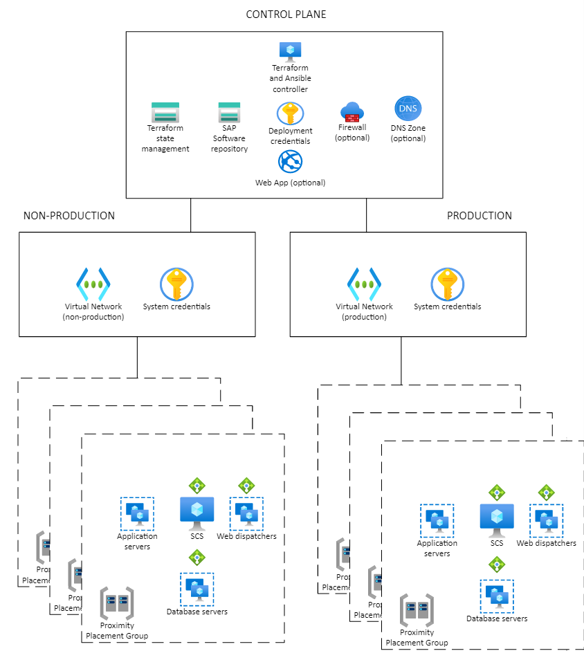

# Enterprise scale for SAP Automation Framework deployment - hands-on lab


This tutorial shows how to do enterprise scaling for deployments of the [SAP automation framework on Azure](automation-deployment-framework.md). This example uses Azure Cloud Shell to deploy the control plane infrastructure. The deployer virtual machine (VM) creates the remaining infrastructure and SAP HANA configurations. There's a feature-locked branch in the [GitHub repository for the automation framework](https://github.com/Azure/sap-hana/), named `sap-level-up`, for use with this tutorial.

During this lab, you will perform the following tasks

> [!div class="checklist"]
> * Deploy the Control Plane (Deployer Infrastructure & Library)
> * Deploy the Workload Zone (Landscape, System)
> * Download/Upload BOM
> * Configure standard and SAP-specific OS settings
> * Install HANA DB
> * Install SCS server
> * Load HANA DB
> * Install Primary Application Server

There are three main steps of an SAP deployment on Azure with the automation framework.

1. Preparing the region. This step deploys components to support the SAP automation framework in a specified Azure region. Some parts of this step are:
   1. Creating the deployment environment
   2. Creating shared storage for Terraform state files
   3. Creating shared storage for SAP installation media

2. Preparing the workload zone. This step deploys the workload zone components, such as the virtual network and key vaults.

3. Deploying the system. This step includes the infrastructure for the SAP system.

There are several workflows in the deployment automation process. However, this tutorial focuses on one workflow for ease of deployment. You can deploy this workflow,  the SAP-S4HANA standalone environment, using Bash. The tutorial describes the general hierarchy and different phases of the deployment.
### Environment overview

The SAP on Azure Deployment Automation Framework has two main components:

- Deployment infrastructure (control plane)
- SAP Infrastructure (SAP Workload)

The following diagram shows the dependency between the control plane and the application plane.



The framework uses Terraform for infrastructure deployment, and Ansible for the operating system and application configuration. The following diagram shows the logical separation of the control plane and workload zone.

automation-tutorial type="content" source="media/automation-deployment-framework/automation-diagram-full.png" alt-text="Diagram SAP Deployment Automation Environment Diagram.":::

#### Management zone

The management zone contains the control plane infrastructure from which other environments are deployed. Once the management zone is deployed, you rarely, if ever, need to redeploy.

automation-tutorial type="content" source="./media/automation-deployment-framework/control-plane.png" alt-text="Diagram Control Plane.":::

The **Deployer** is the execution engine of the SAP automation framework. This  pre-configured virtual machine (VM) is used for executing Terraform and Ansible commands.

The **SAP Library** provides the persistent storage for the Terraform state files and the downloaded SAP installation media for the control plane.

You configure the deployer and library in a Terraform `.tfvars` variable file. See [configuring the control plane](automation-configure-control-plane.md)

#### Workload zone

An SAP application typically has multiple deployment tiers. For example, you might have development, quality assurance, and production tiers. The SAP deployment automation framework refers to these tiers as workload zones.

automation-tutorial type="content" source="./media/automation-deployment-framework/workload-zone.png" alt-text="Workload zone.":::

The **SAP Workload zone** contains the networking and shared components for the SAP VMs. These components include route tables, network security groups, and virtual networks (VNets). The Landscape provides the opportunity to divide deployments into different environments. See [configuring the workload zone](automation-configure-workload-zone.md)

The system deployment consists of the virtual machines that will be running the SAP application, including the web, app, and database tiers. See [configuring the SAP system](automation-configure-system.md)

## Hands-On lab

### Prerequisites

The [SAP deployment automation framework repository](https://github.com/Azure/sap-hana) is available on GitHub.

> [!IMPORTANT]
> Before you begin, make sure to change from the default branch to **sap-level-up**.

You will need an SSH client to connect to the Deployer. Use any SSH client that you feel comfortable with.

#### Review the Azure Subscription quota

Ensure that your Microsoft Azure Subscription has a sufficient core quote for DdSV4 & EdsV4 family SKU in the elected region. About 50 cores each available for VM family should suffice.

#### S.User account for SAP software download

A valid SAP user account (SAP-User or S-User account) with software download privileges is required to download the SAP software.

## Set up Cloud Shell

1. Go to [Azure Cloud Shell](https://shell.azure.com)

1. Log in to your Azure account.

  ```cloudshell-interactive
  az login
  ```

    1. Authenticate your login. Don't close the window until you're prompted.

    1. Optionally, change your active subscription.
  
```cloudshell-interactive
az account set -s <Subscription ID>
```

    Validate that your active subscription changed:

```cloudshell-interactive
az account list --query "[?isDefault]"
 ```
    **or**

```cloudshell-interactive
az  account list -o table | grep True
```

1. Create the required deployment folder.

1. Go to the new folder.

1. Clone the GitHub repository.

1. Go to the repository folder.

1. Check your Git status.


```cloudshell-interactive
mkdir -p ~/Azure_SAP_Automated_Deployment

cd ~/Azure_SAP_Automated_Deployment

git clone https://github.com/Azure/sap-hana.git \
    --single-branch --branch=sap-level-up

cd ~/Azure_SAP_Automated_Deployment/sap-hana

git status -v
```

1. Validate your versions of Terraform, the Azure Command-Line Interface (Azure CLI), and the JSON processor.

```shell
./util/check_workstation.sh
```


To run the automation framework, update to the following versions.

1. `az` version 2.28.0 or higher

1. `terraform` version 1.0.8 or higher. [Upgrade using the Terraform instructions](https://www.terraform.io/upgrade-guides/0-12.html) as necessary.

1. `ansible` version 2.10.2

    
## Create service principal

The SAP automation deployment framework uses service principals for deployment. Create a service principal for your control plane deployment as follows. Make sure to use an account with permissions to create service principals.

> [!NOTE] 
> When choosing the name for your service principal, ensure that the name is unique within your Azure tenant.


Give the service principal contributor and user access administrator permissions.

```cloudshell-interactive
az ad sp create-for-rbac --role="Contributor" \
  --scopes="/subscriptions/<subscriptionID>" \
  --name="<environment>-Deployment-Account"
```

1. Review the output. For example:

```json
{
    "appId": "<AppID>",
    "displayName": "<environment>-Deployment-Account ",
    "name": "<AppID>,
    "password": "<AppSecret>",
    "tenant": "<Tenant ID>"
}
```

1. Copy down the output details. Make sure to save the values for the following fields: `appId`, `password`, and `Tenant`.

The output maps to the following parameters. You use these parameters in later steps, with automation commands.

| **Parameter input name** | **Output name** |
|--------------------------|-----------------|
| `spn_id`                 | `appId`         |
| `spn_secret`             | `password`      |
| `tenant_id`              | `tenant`        |

1. Assign the **User Access Administrator** role to the service principal.

```shell
az role assignment create --assignee <appId> \
  --role "User Access Administrator"
```

## View configuration files

>[!IMPORTANT]
> Always treat the GitHub repository as read-only. Work in a copy of the `WORKSPACES` folder to make configuration changes. This method keeps the configuration stable if the repository changes.

1. Copy the sample configurations to a local workspace directory:

```shell
cd ~/Azure_SAP_Automated_Deployment

cp -Rp ./sap-hana/deploy/samples/WORKSPACES ./
```

1. Open VS Code from Cloud Shell 

```cloudshell-interactive
code .
```

1. Expand the **WORKSPACES** directory. There are five sub-folders: **DEPLOYER**, **LANDSCAPE**, **LIBRARY**, **SYSTEM**, and **BOMS**.

Expand each of these folders to find regional deployment configuration files.

Find the appropriate four-character code that corresponds to the Azure region you're using.

| Region Name        | Region Code |
|--------------------|-------------|
| Australia East     | AUEA        |
| Canada Central     | CACE        |
| Central US         | CEUS        |
| East US            | EAUS        |
| North Europe       | NOEU        |
| South Africa North | SANO        |
| Southeast Asia     | SOEA        |
| UK South           | UKSO        |
| West US 2          | WES2        |

Find the Terraform variable files in the appropriate sub-folder. For example, the **DEPLOYER** terraform variable file might look like:

```bash
# The environment value is a mandatory field, it is used for partitioning the environments, for example (PROD and NP)
environment="MGMT"
# The location/region value is a mandatory field, it is used to control where the resources are deployed
location="westeurope"

# management_network_address_space is the address space for management virtual network
management_network_address_space="10.10.20.0/25"
# management_subnet_address_prefix is the address prefix for the management subnet
management_subnet_address_prefix="10.10.20.64/28"
# management_firewall_subnet_address_prefix is the address prefix for the firewall subnet
management_firewall_subnet_address_prefix="10.10.20.0/26"

deployer_enable_public_ip=true
firewall_deployment=true
```


1. Note the Terraform variable file locations for future edits during deployment.

## Deploy control plane

Use the *prepare_region* script to deploy the Deployer and Library. These deployment pieces make up the
control plane for a chosen automation area.

- The deployment goes through cycles of deploying the infrastructure, refreshing the state, and uploading the Terraform state files to the Library storage account. All of these steps are packaged into a single deployment script. The script needs to know the location of the configuration file for the Deployer and Library, and some other parameters as follows.

For example, choose **North Europe** as the deployment location, with the four-character name `NOEU` as previously described. The sample deployer configuration file `MGMT-NOEU-DEP00-INFRASTRUCTURE.tfvars` is in the `*~/Azure_SAP_Automated_Deployment/WORKSPACES/DEPLOYER/MGMT-NOEU-DEP00-INFRASTRUCTURE*` folder.

The sample SAP Library configuration file `MGMT-NOEU-SAP_LIBRARY.tfvars` is in the `*~/Azure_SAP_Automated_Deployment/WORKSPACES/LIBRARY/MGMT-NOEU-SAP_LIBRARY*` folder.

1. Create the Deployer and the SAP Library. Also add the Service Principal details to the deployment key vault.

```shell
cd ~/Azure_SAP_Automated_Deployment/WORKSPACES

subscriptionID=<subscriptionID>
appId=<appID>
spn_secret=<password>
tenant_id=<tenant>

export DEPLOYMENT_REPO_PATH="${HOME}/Azure_SAP_Automated_Deployment/sap-hana/"
export ARM_SUBSCRIPTION_ID="${subscriptionID}"

${DEPLOYMENT_REPO_PATH}/deploy/scripts/prepare_region.sh                                                     \
    --deployer_parameter_file DEPLOYER/MGMT-NOEU-DEP00-INFRASTRUCTURE/MGMT-NOEU-DEP00-INFRASTRUCTURE.tfvars  \
    --library_parameter_file LIBRARY/MGMT-NOEU-SAP_LIBRARY/MGMT-NOEU-SAP_LIBRARY.tfvars                      \
    --subscription $subscriptionID                                                                           \
    --spn_id $appID                                                                                          \
    --spn_secret "$spn_secret"                                                                               \ 
    --tenant_id $tenant
```

1. If you run into authentication issues,  run `az logout` to logout. Clear `token-cache`, then run `az login` to reauthenticate.

1. Wait for the automation framework to run the Terraform operations, `plan` and `apply`.

The deployment of the deployer might run for about 15-20 minutes.

1. Go to the [Azure portal](https://portal.azure.com).  

1. Select **Resource groups**. Look for new resource groups for the deployer infrastructure and library. For example `MGMT-[region]-DEP00-INFRASTRUCTURE` and `MGMT-[region]-SAP_LIBRARY`.

1. The contents of the Deployer and SAP Library resource group are shown below.

automation-tutorial type="content" source="media/automation-tutorial/deployer-resource-group.png" alt-text="Deployer resources":::
    
automation-tutorial type="content" source="media/automation-hol/sap-library-resource-group.png" alt-text="Library resources":::

The Terraform state file is now in the storage account whose name contains 'tfstate'. The storage account has a container named 'tfstate' with the deployer and library state files. Below is a listing of the contents of the 'tfstate' container after a successful control plane deployment.
    
automation-tutorial type="content" source="media/automation-hol/terraform-state-files.png" alt-text="Control plane tfstate files":::

### Common issues and solutions

If you get the following error for the deployer module creation, make sure that you're in the **WORKSPACES** directory when you run the script:
  
```text
Incorrect parameter file.
The file must contain the environment attribute!!
```

The following error is transient. Rerun the same command, `prepare_region.sh`.
  
 ```text
Error: file provisioner error
..
timeout - last error: dial tcp
```


If you have authentication issues directly after running the script `prepare_region.sh`, run:

```shell
az logout

az login
```

## Connect to deployer VM

After preparing the region, the Terraform state file moves to a remote backend, `azurerm`. All secrets for connecting to the deployer VM are available in a key vault within the deployer's resource group.

Make sure you can connect to your deployer VM:

1. Sign in to the [Azure portal](https://portal.azure.com).

1. Select or search for **Key vaults**.

1. On the **Key vault** page, find the deployer key vault. The name starts with `MGMT[Region]DEP00user`. Filter by the **Resource group** if necessary.

1. On the key vault's menu, select **Secrets** under **Settings**.

1. On the secret's page, select the current version. Then, copy the **Secret value**.

1. Open a plain text editor. Copy in the secret value. 
 
1. Save the file where you keep SSH keys. For example, `C:\\Users\\<your-username>\\.ssh`.
 
1. Save the file. If you're prompted to **Save as type**, select **All files** if **SSH** isn't an option. For example, use `deployer.ssh`.

1. Connect to the deployer VM through any SSH client. Use the public IP address you noted earlier, and the SSH key you just downloaded. If you're using PuTTY, convert the SSH key file first using PuTTYGen. 

> [!NOTE] 
>The default username is *azureadm*

- Once connected to the deployer VM, you can now provision the workload zone


> [!IMPORTANT]
> The rest of the tasks need to be executed on the Deployer

## Get SAP software using the BoM

The Automation Framework gives you tools to download the SAP Bill Of Materials (BOM). The SAP library acts as the archive for all media required to deploy SAP.

The SAP Bill of Materials (BOM) mimics the SAP maintenance planner. There are relevant product identifiers and apackage of download URLs. The deployer VM reads the processed BOM and downloads files from the storage account to SAP Central Services (SCS) for installation.

A sample extract of a BOM file looks like:

```yaml

---
name:    'S41909SPS03_v0005ms'
target:  'S/4 HANA 1909 SPS 03'
version: 6

product_ids:
  dbl:       NW_ABAP_DB:S4HANA1909.CORE.HDB.ABAP
  scs:       NW_ABAP_ASCS:S4HANA1909.CORE.HDB.ABAP
  scs_ha:    NW_ABAP_ASCS:S4HANA1909.CORE.HDB.ABAPHA
  pas:       NW_ABAP_CI:S4HANA1909.CORE.HDB.ABAP
  pas_ha:    NW_ABAP_CI:S4HANA1909.CORE.HDB.ABAPHA
  app:       NW_DI:S4HANA1909.CORE.HDB.PD
  app_ha:    NW_DI:S4HANA1909.CORE.HDB.ABAPHA
  web:       NW_Webdispatcher:NW750.IND.PD
  ers:       NW_ERS:S4HANA1909.CORE.HDB.ABAP
  ers_ha:    NW_ERS:S4HANA1909.CORE.HDB.ABAPHA

materials:
  dependencies:
    - name:     HANA_2_00_055_v0004ms

  media:
    # SAPCAR 7.22
    - name:         SAPCAR
      archive:      SAPCAR_1010-70006178.EXE
      checksum:     dff45f8df953ef09dc560ea2689e53d46a14788d5d184834bb56544d342d7b
      filename:     SAPCAR
      permissions:  '0755'
      url:          https://softwaredownloads.sap.com/file/0020000002208852020

    # Kernel
    - name:         "Kernel Part I ; OS: Linux on x86_64 64bit ; DB: Database independent"
```


For this example configuration, the resource group is `MGMT-NOEU-DEP00-INFRASTRUCTURE`. The deployer key vault name would contain `MGMTNOEUDEP00user` in the name. You use this information to configure your deployer's key vault secrets.

1. Add a secret with the username for your SAP user account. Replace `<keyvault-name>` with the name of your deployer key vault. Also replace `<sap-username>` with your SAP username.

```shell
az keyvault secret set --name "S-Username" --vault-name "<keyvault-name>" --value "<sap-username>";
```

1. Add a secret with the password for your SAP user account. Replace `<keyvault-name>` with your deployer key vault name, and `<sap-password>` with your SAP password.

```shell
az keyvault secret set --name "S-Password" --vault-name "<keyvault-name>" --value "<sap-password>";
```

- Next, configure your SAP parameters file for the download process. Then, download the SAP software using Ansible playbooks. Execute the following commands:

```shell
cd ~/Azure_SAP_Automated_Deployment/WORKSPACES/BOMS

vi sap-parameters.yaml
```
  
In the `kv_name parameter`, enter the name of the deployer resource group key vault
  
  Your file should look similar to this:

```yaml

bom_base_name:                 S41909SPS03_v0006ms
kv_name:                       PERMWEEUDEP00user56F 

```
    
1. Execute the Ansible playbooks. One way you can execute the playbooks is to use the validator test menu.
  - Run the validator test menu script.
  
    ```shell
        ~/Azure_SAP_Automated_Deployment/sap-hana/deploy/ansible/validator_test_menu.sh
    ```
  
1. Select which playbooks to execute.
  
```shell
1) BoM Downloader
3) Quit
Please select playbook:
```

  Select the playbook `1) BOM Downloader` to download the SAP Software described in the BoM file into the storage account.
    
  1. Check that the `sapbits` container has all your media for installation.
    
## Collect workload zone information

Collect the following information in a text editor:

  - The name of the Terraform state file storage account in the Library resource group.
    - Following from the example above, the resource group would be *MGMT-NOEU-SAP_LIBRARY*.
    - The name of the storage account would contain *mgmtnoeutfstate*.

  - The name of deployer state file, this can be found under Library resource group
    - Library resource group -> state storage account -> containers -> tfstate -> Copy the **name** of the Deployer state file.
    - Following from the example above, the name of the blob will be: *MGMT-NOEU-DEP00-INFRASTRUCTURE.terraform.tfstate*
  
The Public IP address of the Deployer VM. Go to your deployer's resource group, open the deployer VM, and copy the public IP address.
  
## Prepare the Workload Zone deployment

Connect to your deployer VM for the following steps. A copy of the repo is now there.

1. Go into the *Azure_SAP_Automated_Deployment* folder in your home directory.

1. Remove the existing **WORKSPACES** folder. You'll copy in the examples later.

```shell
rm -rf WORKSPACES
```

1. Go to the **sap-hana** folder. Check out the **sap-level-up** branch.
  
```shell
cd ~/Azure_SAP_Automated_Deployment/sap-hana/

git checkout sap-level-up
```


1. Copy the sample configuration files from the repository.

```shell
cd ~/Azure_SAP_Automated_Deployment/

cp -Rp ./sap-hana/deploy/samples/WORKSPACES ./
```

## Deploy the workload zone

1. On the deployer VM, navigate to the `Azure_SAP_Automated_Deployment` folder.
  
```shell
  cd ~/Azure_SAP_Automated_Deployment/WORKSPACES/LANDSCAPE/DEV-XXXX-SAP01-INFRASTRUCTURE
```

From the example region 'northeurope', the folder will look like:

```shell
cd ~/Azure_SAP_Automated_Deployment/WORKSPACES/LANDSCAPE/DEV-NOEU-SAP01-INFRASTRUCTURE
```
   
1. Open the workload zone configuration file and change the network logical name to match the network name.

- The details we collected in **Step-5** will be needed here. These are:
  - name of the deployer tfstate file (found in the tfstate container)
  - name of the tfstate storage account

1. Start deployment of the workload zone:

```shell
cd ~/Azure_SAP_Automated_Deployment/WORKSPACES/LANDSCAPE/DEV-NOEU-SAP01-INFRASTRUCTURE

subscriptionID=<subscriptionID>
appId=<appID>
spn_secret=<password>
tenant_id=<tenant>
storageaccount=<storageaccountName>
statefile_subscription=<subscriptionID>

    ${DEPLOYMENT_REPO_PATH}/deploy/scripts/install_workloadzone.sh          \
    --parameter_file ./DEV-NOEU-SAP01-INFRASTRUCTURE.tfvars                 \
    --deployer_environment MGMT                                             \
    --deployer_tfstate_key MGMT-NOEU-DEP00-INFRASTRUCTURE.terraform.tfstate \
    --storageaccountname $storageaccount                                    \
    --state_subscription $statefile_subscription                            \
    --subscription $subscriptionID                                          \
    --spn_id $appID                                                         \
    --spn_secret $spn_secret                                                \
    --tenant_id $tenant
```

The workload zone deployment should start automatically.

1. Wait for the deployment to finish. The new resource group appears in the Azure portal.

## Deploy SAP system infrastructure

Once the Workload zone is complete, you can deploy the SAP system infrastructure resources. The SAP system creates your VMs and supporting components for your SAP application.

The SAP system deploys:

- The database tier, which deploys database VMs and their disks and an Standard Azure Load Balancer. You can run HANA databases or AnyDB databases in this tier.
- The SCS tier, which deploys a customer-defined number of VMs and an Azure Standard Load Balancer.
- The application tier, which deploys the VMs and their disks.
- The web dispatcher tier.

1. Deploy the SAP system.

```shell
cd ~/Azure_SAP_Automated_Deployment/WORKSPACES/SYSTEM/DEV-XXXX-SAP01-X00

${DEPLOYMENT_REPO_PATH}/deploy/scripts/installer.sh \
  --parameterfile DEV-XXXX-SAP01-X00.tfvars         \
  --type sap_system                                 \
  --auto-approve
```
  
  The deployment command for the `northeurope` example will look like:

```shell
cd ~/Azure_SAP_Automated_Deployment/WORKSPACES/SYSTEM/DEV-NOEU-SAP01-X00

${DEPLOYMENT_REPO_PATH}/deploy/scripts/installer.sh  \
  --parameter_file DEV-NOEU-SAP01-X00.tfvars         \
  --type sap_system                                  \
  --auto-approve
```

1. Check that the system resource group is now in the Azure portal.

## SAP installation

The SAP installation happens through Ansible playbooks. 
1. Navigate to the system deployment folder:

```shell
cd ~/Azure_ SAP_Automated_Deployment/WORKSPACES/SYSTEM/DEV-NOEU-SAP01-X00/
```

Make sure you have the following files in the current folder: `sap-parameters.yaml` and `SID_host.yaml`.

For a standalone SAP S/4HANA system, there are eight playbooks to execute in sequence. You can trigger the following playbooks from using a menu system. 

1. Trigger the playbooks to execute.

### Playbook: OS Config

Selecting this playbook does the generic OS configuration setup on all the machines, this includes configuring of software repositories, packages, services and so on.

### Playbook: SAP-Specific OS config

Selecting this playbook does the SAP OS configuration setup on all the machines, this includes creation of volume groups, file systems, configuring of software repositories, packages, services.

### Playbook: BoM Processing

Selecting this playbook, downloads the SAP software to the scs node.
    
### Playbook: HANA DB Install

This playbook will install the HANA database instances.
### Playbook: SCS Install
  
This playbook triggers the SCS installation.
### Playbook: DB Load

Triggers DB load for the previously installed HANA database from PAS server.

### Playbook: PAS Install

Triggers PAS installation
  
### Playbook: APP Install

Triggers app server installation.

You've now deployed and configured a stand-alone HANA system.

## Clean up installation

> [!NOTE]
> It's important to clean up your SAP installation from this tutorial after you're done. Otherwise, you continue to incur costs related to the resources.

To remove the entire SAP infrastructure you deployed, you need to:

1. Remove the SAP system infrastructure resources
2. Remove all workload zones (the Landscape)
3. Remove the control plane

Execute the removal of your SAP infrastructure resources and workload zones from the deployer VM. Execute the removal of the control plane from Cloud Shell.

Before you begin, log in to your Azure account. Then, check that you're in the correct subscription.

### Remove SAP infrastructure

Navigate to the `DEV-NOEU-SAP01-X00` subfolder inside the `SYSTEM` folder. Then, run this command:
  
```shell
cd ~/Azure_SAP_Automated_Deployment/WORKSPACES/SYSTEM/DEV-NOEU-SAP01-X00

${DEPLOYMENT_REPO_PATH}/deploy/scripts/remover.sh          \
      --parameter_file DEV-NOEU-SAP01-X00.tfvars           \
      --type sap_system
```

### Remove SAP workload zone

Navigate to the `DEV-XXXX-SAP01-INFRASTRUCTURE` subfolder inside the `LANDSCAPE` folder. Then, execute the following command.

```shell
cd ~/Azure_SAP_Automated_Deployment/WORKSPACES/LANDSCAPE/DEV-NOEU-SAP01-INFRASTRUCTURE

${DEPLOYMENT_REPO_PATH}/deploy/scripts/remover.sh          \
      --parameter_file DEV-NOEU-SAP01-INFRASTRUCTURE.tfvars           \
      --type sap_landscape
```

### Remove control plane

1. Sign in to [Cloud Shell](https://shell.azure.com).

1. Go to the `WORKSPACES` folder.
  
```shell
  cd ~/Azure_SAP_Automated_Deployment/WORKSPACES/
```

1. Export the following two environment variables.

```shell
export DEPLOYMENT_REPO_PATH=~/Azure_SAP_Automated_Deployment/sap-hana

export ARM_SUBSCRIPTION_ID=<subscriptionID>
```

1. Run the following command.

```shell
${DEPLOYMENT_REPO_PATH}/deploy/scripts/remove_region.sh                                                    \
  --deployer_parameter_file DEPLOYER/MGMT-NOEU-DEP00-INFRASTRUCTURE/MGMT-NOEU-DEP00-INFRASTRUCTURE.tfvars  \
  --library_parameter_file LIBRARY/MGMT-NOEU-SAP_LIBRARY/MGMT-NOEU-SAP_LIBRARY.tfvars
```

1. Verify that all resources are now cleaned up.


## Next steps

> [!div class="nextstepaction"]
> [Configure control plane](automation-configure-control-plane.md)


