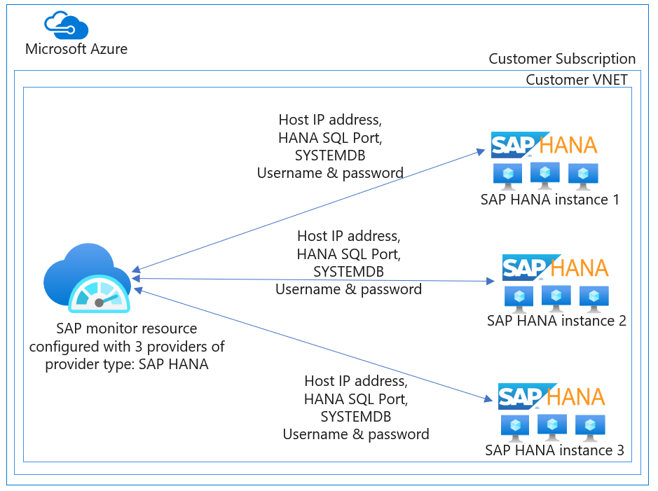

# Azure monitor for SAP solutions providers (preview)

## Overview  

In the context of Azure Monitor for SAP Solutions, a *provider type* refers to a specific *provider*. For example *SAP HANA*, which is configured for a specific component within the SAP landscape, like SAP HANA database. A provider contains the connection information for the corresponding component and helps to collect telemetry data from that component. One Azure Monitor for SAP Solutions resource (also known as SAP monitor resource) can be configured with multiple providers of the same provider type or multiple providers of multiple provider types.
   
Customers can choose to configure different provider types to enable data collection from corresponding component in their SAP landscape. For Example, customers can configure one provider for SAP HANA provider type, another provider for High-availability cluster provider type and so on.  

Customers can also choose to configure multiple providers of a specific provider type to reuse the same SAP monitor resource and associated managed group. Lean more about managed resource group. 
For public preview, the following provider types are supported:   
- SAP NetWeaver
- SAP HANA
- Microsoft SQL Server
- High-availability cluster
- Operating System

Customers are recommended to configure at least one provider from the available provider types at the time of deploying the SAP Monitor resource. By configuring a provider, customers initiate data collection from the corresponding component for which the provider is configured.   

If customers don't configure any providers at the time of deploying SAP monitor resource, although the SAP monitor resource will be successfully deployed, no telemetry data will be collected. Customers have an option to add providers after deployment through SAP monitor resource within Azure portal. Customers can add or delete providers from the SAP monitor resource at any time.

## Provider type: SAP NetWeaver

Customers can configure one or more providers of provider type SAP NetWeaver to enable data collection from SAP NetWeaver layer. AMS NetWeaver provider leverages the existing [SAPControl webservice](https://www.sap.com/documents/2016/09/0a40e60d-8b7c-0010-82c7-eda71af511fa.html) interface to retrieve the appropriate telemetry information.

For the current release, below are the standard out-of-box SOAP web methods invoked by AMS.

In public preview, customers can expect to see the following data with the SAP NetWeaver provider: 
- System and instance availability
- Work process utilization
- Queue utilization
- Enqueue lock statistics.

## Provider type: SAP HANA

Customers can configure one or more providers of provider type *SAP HANA* to enable data collection from SAP HANA database. The SAP HANA provider connects to the SAP HANA database over SQL port, pulls telemetry data from the database, and pushes it to the Log Analytics workspace in the customer subscription. The SAP HANA provider collects data every 1 minute from the SAP HANA database.  

In public preview, customers can expect to see the following data with SAP HANA provider: Underlying infrastructure utilization, SAP HANA Host status, SAP HANA System Replication, and SAP HANA Backup telemetry data. 
To configure SAP HANA provider, Host IP address, HANA SQL port number, and SYSTEMDB username and password are required. Customers are recommended to configure SAP HANA provider against SYSTEMDB, however more providers can be configured against other database tenants.

## Provider type: Microsoft SQL server

Customers can configure one or more providers of provider type *Microsoft SQL Server* to enable data collection from [SQL Server on Virtual Machines](https://azure.microsoft.com/services/virtual-machines/sql-server/). SQL Server provider connects to Microsoft SQL Server over the SQL port, pulls telemetry data from the database, and pushes it to the Log Analytics workspace in the customer subscription. The SQL Server must be configured for SQL authentication and a SQL Server login, with the SAP DB as the default database for the provider, must be created. SQL Server provider collects data between every 60 seconds up to every hour from SQL server.  

In public preview, customers can expect to see the following data with SQL Server provider: underlying infrastructure utilization, top SQL statements, top largest table, problems recorded in the SQL Server error logs, blocking processes and others.  

To configure Microsoft SQL Server provider, the SAP System ID, the Host IP address, SQL Server port number and the SQL Server login name and password are required.

## Provider type: High-availability cluster
Customers can configure one or more providers of provider type *High-availability cluster* to enable data collection from Pacemaker cluster within the SAP landscape. The High-availability cluster provider connects to Pacemaker,  using [ha_cluster_exporter](https://github.com/ClusterLabs/ha_cluster_exporter) endpoint, pulls telemetry data from the database and pushes it to Log Analytics workspace in the customer subscription. High-availability cluster provider collects data every 60 seconds from Pacemaker.  

In public preview, customers can expect to see the following data with High-availability cluster provider:   
 - Cluster status represented as roll-up of node and resource status 
 - [others](https://github.com/ClusterLabs/ha_cluster_exporter/blob/master/doc/metrics.md) 

To configure a High-availability cluster provider, two primary steps are involved:

1. Install [ha_cluster_exporter](https://github.com/ClusterLabs/ha_cluster_exporter) in *each* node within the Pacemaker cluster.

   You have two options for installing ha_cluster_exporter:
   
   - Use Azure Automation scripts to deploy a High-availability cluster. The scripts install [ha_cluster_exporter](https://github.com/ClusterLabs/ha_cluster_exporter) on each cluster node.  
   - Do a [manual installation](https://github.com/ClusterLabs/ha_cluster_exporter#manual-clone--build). 

2. Configure a High-availability cluster provider for *each* node within the Pacemaker cluster.

   To configure the High-availability cluster provider, the following information is required:
   
   - **Name**. A name for this provider. It should be unique for this Azure Monitor for SAP solutions instance.
   - **Prometheus Endpoint**. http\://\<servername or ip address\>:9664/metrics.
   - **SID**. For SAP systems, use the SAP SID. For other systems (for example, NFS clusters), use a three-character name for the cluster. The SID must be distinct from other clusters that are monitored.   
   - **Cluster name**. The cluster name used when creating the cluster. The cluster name can be found in the cluster property `cluster-name`.
   - **Hostname**. The Linux hostname of the VM.  

## Provider type: OS (Linux)
Customers can configure one or more providers of provider type OS (Linux) to enable data collection from BareMetal or VM Node. The OS (Linux) provider connects to BareMetal or VM Nodes, using [Node_Exporter](https://github.com/prometheus/node_exporter) endpoint, pulls telemetry data from the Nodes and pushes it to Log Analytics workspace in the customer subscription. OS (Linux) provider collects data every 60 seconds for most of the metrics from Nodes. 

In Public preview, customers can expect to see the following data with OS (Linux) provider: 
   - CPU Usage, CPU Usage by Process 
   - Disk Utilization, I/O Read & Write 
   - Memory Distribution, Memory Usage, Swap Memory Usage 
   - Network Usage, Network Inbound & outbound Traffic Details. 

To configure an OS (Linux) provider, two primary steps are involved:
1. Install [Node_Exporter](https://github.com/prometheus/node_exporter) on each BareMetal or VM Nodes.
   You have two options for installing [Node_exporter](https://github.com/prometheus/node_exporter): 
      - For Automation installation with Ansible use [Node_Exporter](https://github.com/prometheus/node_exporter) on each BareMetal or VM Nodes to install OS (Linux) Provider.  
      - Do a [manual installation](https://prometheus.io/docs/guides/node-exporter/).

2. Configure a OS (Linux) Provider for each BareMetal or VM Node Instance in your environment. 
   To configure the OS (Linux) Provider, the following information is required: 
      - Name. A name for this provider. It should be unique for this Azure Monitor for SAP solutions instance. 
      - Node Exporter Endpoint. Usually http://<servername or ip address>:9100/metrics 

> [!NOTE]
> 9100 is a Port Exposed for Node_Exporter Endpoint.

> [!Warning]
> Ensure Node Exporter keeps running after node reboot. 

## Next steps

- Refer [onboarding steps](./azure-monitor-sap-quickstart.md) and create your first Azure Monitor for SAP solutions resource.
- Do you have questions about Azure Monitor for SAP Solutions? Check the [FAQ](./azure-monitor-faq.md) section
