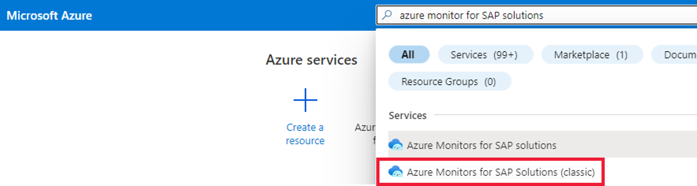

# Deploy Azure Monitor for SAP solutions by using the Azure portal (preview)

[!INCLUDE [Azure Monitor for SAP solutions public preview notice](./includes/preview-azure-monitor.md)]

In this article, we'll walk through deploying Azure Monitor for SAP solutions (AMS) from the [Azure portal](https://azure.microsoft.com/features/azure-portal). Using the portal's browser-based interface, we'll deploy AMS and configure providers.

This content applies to both versions of the service, AMS and AMS (classic).
## Sign in to the portal

Sign in to the [Azure portal](https://portal.azure.com).

## Create a monitoring resource

###### For Azure Monitor for SAP solutions

1. In Azure **Search**, select **Azure Monitor for SAP solutions**.

    

2. On the **Basics** tab, provide the required values. If applicable, you can use an existing Log Analytics workspace.
 

    

###### For Azure Monitor for SAP solutions (classic)

1. In Azure **Marketplace** or **Search**, select **Azure Monitor for SAP solutions (classic)**.

  

2. On the **Basics** tab, provide the required values. If applicable, you can use an existing Log Analytics workspace.

   :::image type="content" source="./media/azure-monitor-sap/azure-monitor-quickstart-2.png" alt-text="Screenshot that shows configuration options on the Basics tab." lightbox="./media/azure-monitor-sap/azure-monitor-quickstart-2.png":::

   When you're selecting a virtual network, ensure that the systems you want to monitor are reachable from within that virtual network. 

   > [!IMPORTANT]
   > Selecting **Share** for **Share data with Microsoft support** enables our support teams to help you with troubleshooting. This feature is available only for Azure Monitor for SAP solutions (classic)

## Next steps

Learn more about Azure Monitor for SAP solutions.

> [!div class="nextstepaction"]
> [Configure AMS Providers](configure-netweaver-azure-monitor-sap-solutions.md)
