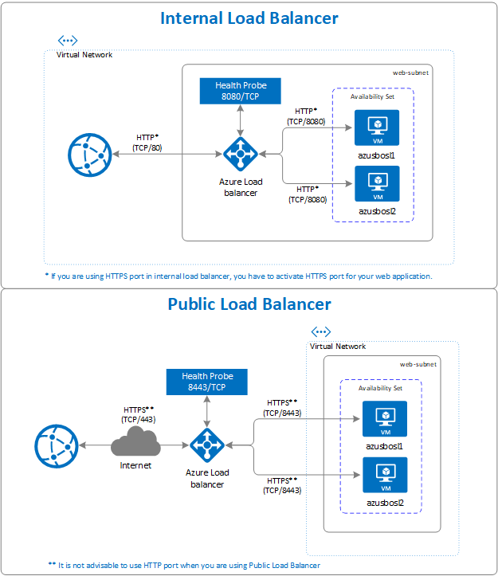

# SAP BusinessObjects BI Platform on Azure for Linux

This section demonstrate on how to deploy SAP BOBI Platform on Azure for Linux. In this illustration (shown below), two Azure Virtual Machines are provisioned with Azure Managed Premium SSD as its install directory, Azure Database for MySQL as CMS database, and Azure NetApp Files for File Repository Server shared across both the servers. The default Tomcat Java Web Application and BI Platform Application are installed together on both Virtual Machines. For load balancing, Azure Application Gateway is used to load balance incoming user request and perform SSL offloading

This type of architecture is effective for small deployment or non-production environment. For Production or large scale deployment, you can have a separate host for Web Application and can as well have multiple BOBI Application hosts allowing server to process more information.


In this example, below product version and file system layout is used

- SAP BusinessObjects Platform 4.3
- SUSE Linux Enterprise Server 12 SP5
- Azure Database for MySQL (Version: 8.0.15)
- MySQL C API Connector - libmysqlclient (Version: 6.1.11)

| File System        | Description                                                                                                               | Size (GB)             | Owner  | Group  | Storage                    |
|--------------------|---------------------------------------------------------------------------------------------------------------------------|-----------------------|--------|--------|----------------------------|
| /usr/sap           | The  file system for installation of SAP BOBI instance, default Tomcat Web Application and database drivers (if required) | SAP Sizing Guidelines | bl1adm | sapsys | Managed Premium Disk - SSD |
| /usr/sap/frsinput  | The mount directory is for the shared files between all BOBI hosts which will be used as Input File Repository Directory  | Business Need         | bl1adm | sapsys | Azure NetApp Files         |
| /usr/sap/frsoutput | The mount directory is for the shared files between all BOBI hosts which will be used as Output File Repository Directory | Business Need         | bl1adm | sapsys | Azure NetApp Files         |

## Deploy Linux Virtual Machine via Azure Portal

In this section, we will create two Azure Virtual Machines (VMs) with Linux Operating System (OS) image for SAP BOBI Platform. The high level steps to create Virtual Machines are as follows -

1. Create a [Resource Group](../../../azure-resource-manager/management/manage-resource-groups-portal.md#create-resource-groups)

2. Create a [Virtual Network](../../../virtual-network/quick-create-portal.md#create-a-virtual-network).

   - You cannot use single subnet for all the Azure Services in SAP BI Platform deployment. Based on SAP BI Platform architecture, you need to create multiple subnets. In this deployment, we will create three subnets - Application Subnet, File Repository Store Subnet and Application Gateway Subnet.
   - In Azure, Application Gateway and Azure NetApp Files always need to be on separate subnet. Refer [Azure Application Gateway](../../../application-gateway/configuration-overview.md) configuration article and [Guidelines for Azure NetApp Files Network Planning](../../../azure-netapp-files/azure-netapp-files-network-topologies.md) for more details.

3. Create an Availability Set.

   - If you have multiple hosts for SAP BI Platform and to achieve availability for each tier (Web, Storage, Management, Processing) in SAP BI Platform, you have to define multiple availability sets.

4. Create Virtual Machine 1 **(azusbosl1).**

   - You can either use custom image or choose an image from Azure Marketplace. Refer [Deploying a VM from the Azure Marketplace for SAP](deployment-guide.md#scenario-1-deploying-a-vm-from-the-azure-marketplace-for-sap) or [Deploying a VM with a custom image for SAP](deployment-guide.md#scenario-2-deploying-a-vm-with-a-custom-image-for-sap) based on your need.

5. Create Virtual Machine 2 **(azusbosl2).**
6. Add one Premium SSD disk. It will be used as SAP BOBI Installation directory.

## Provision Azure NetApp Files

Before you proceed with the set up for Azure NetApp Files, familiarize yourself with the Azure [NetApp Files documentation](../../../azure-netapp-files/azure-netapp-files-introduction.md).

Azure NetApp Files is available in several [Azure regions](https://azure.microsoft.com/global-infrastructure/services/?products=netapp). Check to see whether your selected Azure region offers Azure NetApp Files.

For information about the availability of Azure NetApp Files by Azure region, see [Azure NetApp Files Availability by Azure Region](https://azure.microsoft.com/global-infrastructure/services/?products=netapp&regions=all).

Before you deploy Azure NetApp Files, request onboarding to Azure NetApp Files by going to [Register for Azure NetApp Files instructions](../../../azure-netapp-files/azure-netapp-files-register.md).

### Deploy Azure NetApp Files resources

The following instructions assume that you've already deployed your [Azure virtual network](../../../virtual-network/virtual-networks-overview.md). The Azure NetApp Files resources and VMs, where the Azure NetApp Files resources will be mounted, must be deployed in the same Azure virtual network or in peered Azure virtual networks.

1. If you haven't already deployed the resources, request [onboarding to Azure NetApp Files](../../../azure-netapp-files/azure-netapp-files-register.md).

2. Create a NetApp account in your selected Azure region by following the instructions in [Create a NetApp account](../../../azure-netapp-files/azure-netapp-files-create-netapp-account.md).

3. Set up an Azure NetApp Files capacity pool by following the instructions in [Set up an Azure NetApp Files capacity pool](../../../azure-netapp-files/azure-netapp-files-set-up-capacity-pool.md).

   - The SAP BI Platform architecture presented in this article uses a single Azure NetApp Files capacity pool at the *Premium* Service level. For SAP BI File Repository Server on Azure, we recommend using an Azure NetApp Files *Premium* or *Ultra* [service Level](../../../azure-netapp-files/azure-netapp-files-service-levels.md).

4. Delegate a subnet to Azure NetApp Files, as described in the instructions in [Delegate a subnet to Azure NetApp Files](../../../azure-netapp-files/azure-netapp-files-delegate-subnet.md).

5. Deploy Azure NetApp Files volumes by following the instructions in [Create an NFS volume for Azure NetApp Files](../../../azure-netapp-files/azure-netapp-files-create-volumes.md).

   ANF volume can be deployed as NFSv3 and NFSv4.1, as both protocol are supported for SAP BOBI Platform. Deploy the volumes in the designated Azure NetApp Files subnet. The IP addresses of the Azure NetApp Volumes are assigned automatically.

Keep in mind that the Azure NetApp Files resources and the Azure VMs must be in the same Azure virtual network or in peered Azure virtual networks. For example, azusbobi-frsinput, azusbobi-frsoutput are the volume names and nfs://10.31.2.4/azusbobi-frsinput, nfs://10.31.2.4/azusbobi-frsoutput are the file paths for the Azure NetApp Files Volumes.

- Volume azusbobi-frsinput (nfs://10.31.2.4/azusbobi-frsinput)
- Volume azusbobi-frsoutput (nfs://10.31.2.4/azusbobi-frsoutput)

### Important considerations

As you are creating your Azure NetApp Files for SAP HANA Scale-up systems, be aware of the following consideration:

1. The minimum capacity pool is 4 tebibytes (TiB).
2. The minimum volume size is 100 gibibytes (GiB).
3. Azure NetApp Files and all virtual machines where the Azure NetApp Files volumes will be mounted must be in the same Azure virtual network or in [peered virtual networks](../../../virtual-network/virtual-network-peering-overview.md) in the same region. Azure NetApp Files access over VNET peering in the same region is supported now. Azure NetApp access over global peering is not yet supported.
4. The selected virtual network must have a subnet that is delegated to Azure NetApp Files.
5. With the Azure NetApp Files [export policy](../../../azure-netapp-files/azure-netapp-files-configure-export-policy.md), you can control the allowed clients, the access type (read-write, read only, and so on).
6. The Azure NetApp Files feature is not zone-aware yet. Currently, the feature is not deployed in all availability zones in an Azure region. Be aware of the potential latency implications in some Azure regions.
7. Azure NetApp Files volumes can be deployed as NFSv3 or NFSv4.1 volumes. Both protocols are supported for the SAP BI Platform Applications.

## Configure File Systems on Linux Servers

The steps in this section use the following prefixes:

**[A]**: The step applies to all hosts

### Format and Mount SAP File System

1. **[A]** List all attached disk

    ```bash
    sudo lsblk
    NAME   MAJ:MIN RM  SIZE RO TYPE MOUNTPOINT
    sda      8:0    0   30G  0 disk
    ├─sda1   8:1    0    2M  0 part
    ├─sda2   8:2    0  512M  0 part /boot/efi
    ├─sda3   8:3    0    1G  0 part /boot
    └─sda4   8:4    0 28.5G  0 part /
    sdb      8:16   0   32G  0 disk
    └─sdb1   8:17   0   32G  0 part /mnt
    sdc      8:32   0  128G  0 disk
    sr0     11:0    1  628K  0 rom  
    # Premium SSD of 128 GB is attached to Virtual Machine, whose device name is sdc
    ```

2. **[A]** Format block device for /usr/sap

    ```bash
    sudo mkfs.xfs /dev/sdc
    ```

3. **[A]** Create mount directory

    ```bash
    sudo mkdir -p /usr/sap
    ```

4. **[A]** Get UUID of block device

    ```bash
    sudo blkid

    #It will display information about block device. Copy UUID of the formatted block device

    /dev/sdc: UUID="0eb5f6f8-fa77-42a6-b22d-7a9472b4dd1b" TYPE="xfs"
    ```

5. **[A]** Maintain file system mount entry in /etc/fstab

    ```bash
    sudo echo "UUID=0eb5f6f8-fa77-42a6-b22d-7a9472b4dd1b /usr/sap xfs defaults,nofail 0 2" >> /etc/fstab
    ```

6. **[A]** Mount file system

    ```bash
    sudo mount -a

    sudo df -h

    Filesystem                     Size  Used Avail Use% Mounted on
    devtmpfs                       7.9G  8.0K  7.9G   1% /dev
    tmpfs                          7.9G   82M  7.8G   2% /run
    tmpfs                          7.9G     0  7.9G   0% /sys/fs/cgroup
    /dev/sda4                       29G  1.8G   27G   6% /
    tmpfs                          1.6G     0  1.6G   0% /run/user/1000
    /dev/sda3                     1014M   87M  928M   9% /boot
    /dev/sda2                      512M  1.1M  511M   1% /boot/efi
    /dev/sdb1                       32G   49M   30G   1% /mnt
    /dev/sdc                       128G   29G  100G  23% /usr/sap
    ```

### Mount Azure NetApp Files Volume

1. **[A]** Create mount directories

   ```bash
   sudo mkdir -p /usr/sap/frsinput
   sudo mkdir -p /usr/sap/frsoutput
   ```

2. **[A]** Configure Client OS to support NFSv4.1 Mount **(Only applicable if using NFSv4.1)**

   If you are using Azure NetApp Files volumes with NFSv4.1 protocol. Perform the configuration on all VMs, where Azure NetApp Files NFSv4.1 volumes will be mounted

   **Verify NFS domain settings**

   Make sure that the domain is configured as the default Azure NetApp Files domain, i.e.  **defaultv4iddomain.com** and the mapping is set to **nobody**.

   ```bash
   sudo cat /etc/idmapd.conf
   # Example
   [General]
   Domain = defaultv4iddomain.com
   [Mapping]
   Nobody-User = nobody
   Nobody-Group = nobody
   ```

   > [!Important]
   >
   > Make sure to set the NFS domain in /etc/idmapd.conf on the VM to match the default domain configuration on Azure NetApp Files: **defaultv4iddomain.com**. If there's a mismatch between the domain configuration on the NFS client (i.e. the VM) and the NFS server, i.e. the Azure NetApp configuration, then the permissions for files on Azure NetApp volumes that are mounted on the VMs will be displayed as nobody.

   Verify `nfs4_disable_idmapping`. It should be set to **Y**. To create the directory structure where `nfs4_disable_idmapping` is located, execute the mount command. You won't be able to manually create the directory under /sys/modules, because access is reserved for the kernel / drivers.

   ```bash
   # Check nfs4_disable_idmapping
   cat /sys/module/nfs/parameters/nfs4_disable_idmapping

   # If you need to set nfs4_disable_idmapping to Y
   mkdir /mnt/tmp
   mount -t nfs -o sec=sys,vers=4.1 10.31.2.4:/azusbobi-frsinput /mnt/tmp
   umount /mnt/tmp

   echo "Y" > /sys/module/nfs/parameters/nfs4_disable_idmapping

   # Make the configuration permanent
   echo "options nfs nfs4_disable_idmapping=Y" >> /etc/modprobe.d/nfs.conf
   ```

3. **[A]** Add mount entries

   If using NFSv3

   ```bash
   sudo echo "10.31.2.4:/azusbobi-frsinput /usr/sap/frsinput  nfs   rw,hard,rsize=65536,wsize=65536,vers=3" >> /etc/fstab
   sudo echo "10.31.2.4:/azusbobi-frsoutput /usr/sap/frsoutput  nfs   rw,hard,rsize=65536,wsize=65536,vers=3" >> /etc/fstab
   ```

   If using NFSv4.1

   ```bash
   sudo echo "10.31.2.4:/azusbobi-frsinput /usr/sap/frsinput  nfs   rw,hard,rsize=65536,wsize=65536,vers=4.1,sec=sys" >> /etc/fstab
   sudo echo "10.31.2.4:/azusbobi-frsoutput /usr/sap/frsoutput  nfs   rw,hard,rsize=65536,wsize=65536,vers=4.1,sec=sys" >> /etc/fstab
   ```

4. **[A]** Mount NFS volumes

   ```bash
   sudo mount -a

   sudo df -h

   Filesystem                     Size  Used Avail Use% Mounted on
   devtmpfs                       7.9G  8.0K  7.9G   1% /dev
   tmpfs                          7.9G   82M  7.8G   2% /run
   tmpfs                          7.9G     0  7.9G   0% /sys/fs/cgroup
   /dev/sda4                       29G  1.8G   27G   6% /
   tmpfs                          1.6G     0  1.6G   0% /run/user/1000
   /dev/sda3                     1014M   87M  928M   9% /boot
   /dev/sda2                      512M  1.1M  511M   1% /boot/efi
   /dev/sdb1                       32G   49M   30G   1% /mnt
   /dev/sdc                       128G   29G  100G  23% /usr/sap
   10.31.2.4:/azusbobi-frsinput   101T   18G  100T   1% /usr/sap/frsinput
   10.31.2.4:/azusbobi-frsoutput  100T  512K  100T   1% /usr/sap/frsoutput
   ```

## Configure CMS Database (Azure DB for MySQL)

This section provide details on how to provision Azure Database for MySQL using Azure Portal. It also provide instructions on how to create CMS and Audit Databases for SAP BOBI Platform, and a user account which can access the database(s).

This guidelines are applicable only if you are using Azure DB for MySQL. For other database(s), refer SAP or database specific documentation for instructions.

### Create an Azure Database for MySQL

Login to Azure Portal and follow the steps mentioned in this [Quick start Guide of Azure Database for MySQL](../../../mysql/quickstart-create-mysql-server-database-using-azure-portal.md#create-an-azure-database-for-mysql-server). Few points to note while provisioning Azure Database for MySQL -

1. Select the same region for Azure Database for MySQL where your SAP BI Platform application servers are running.

2. Choose a supported DB version based on [Product Availability Matrix (PAM) for SAP BI](https://support.sap.com/pam) specific to your SAP BusinessObjects version. Follow same compatibility guidelines as that of MySQL AB in SAP PAM

3. In “compute+storage”, select **Configure server** and select the appropriate pricing tier based on you sizing output.

4. **Storage Auto-growth** is enabled by default. Keep in mind that [Storage](../../../mysql/concepts-pricing-tiers.md#storage) can only be scaled-up, not down.

5. By default, **Backup Retention Period** is 7 days but you can [optionally configure](../../../mysql/howto-restore-server-portal.md#set-backup-configuration) it up to 35 days.

6. Backups of Azure Database for MySQL are locally redundant by default, so if you want server backups in geo-redundant storage, select **Geographically Redundant** from **Backup Redundancy Options**.

> [!NOTE]
> Changing the [Backup Redundancy Options](../../../mysql/concepts-backup.md#backup-redundancy-options) after server creation is not supported.

### Configure Connection Security

By default the server created is protected with a firewall and is not accessible publicly. To provide access to the virtual network where SAP BI Platform application servers are running, follow below steps -  

1. Go to server resources in the Azure Portal and select **Connection security** from left side menu for your server resource.
2. Select **Yes** to **Allow access to Azure services**.
3. Under VNET rules, click **Adding existing virtual network**. Select the virtual network and subnet of SAP BI Platform application server. Also you need to provide access to Jump box or other servers from where you can connect [MySQL Workbench](../../../mysql/connect-workbench.md) to Azure Database for MySQL. MySQL Workbench will be used to create CMS and Audit database
4. Once virtual networks are added, click on **Save**.

### Create CMS and Audit Database

1. Download and install MySQL workbench from [MySQL website](https://dev.mysql.com/downloads/workbench/). Make sure you install MySQL workbench on the jump server which can access Azure Database for MySQL.

2. Connect to server by using MySQL Workbench. Follow the instruction mentioned in this [article](../../../mysql/connect-workbench.md#get-connection-information). If the connection test is successful, you will get below message -

   

3. In SQL query tab, run below query to create schema for CMS and Audit database.

   ```sql
   # Here cmsbl1 is the database name of CMS database. You can provide the name you want for CMS database.
   CREATE SCHEMA `cmsbl1` DEFAULT CHARACTER SET utf8;

   # auditbl1 is the database name of Audit database. You can provide the name you want for CMS database.
   CREATE SCHEMA `auditbl1` DEFAULT CHARACTER SET utf8;

4. Create user account to connect to schema

   ```sql
   # Create a user that can connect from any host, use the '%' wildcard as a host part
   CREATE USER 'cmsadmin'@'%' IDENTIFIED BY 'password';
   CREATE USER 'auditadmin'@'%' IDENTIFIED BY 'password';

   # Grant all privileges to a user account over a specific database:
   GRANT ALL PRIVILEGES ON cmsbl1.* TO 'cmsadmin'@'%' WITH GRANT OPTION;
   GRANT ALL PRIVILEGES ON auditbl1.* TO 'auditadmin'@'%' WITH GRANT OPTION;

   # Following any updates to the user privileges, be sure to save the changes by issuing the FLUSH PRIVILEGES
   FLUSH PRIVILEGES;
   ```

5. To check the privileges and roles of MySQL user account

   ```sql
   USE sys;
   SHOW GRANTS for 'cmsadmin'@'%';
   +------------------------------------------------------------------------+
   | Grants for cmsadmin@%                                                  |
   +------------------------------------------------------------------------+
   | GRANT USAGE ON *.* TO `cmsadmin`@`%`                                   |
   | GRANT ALL PRIVILEGES ON `cmsbl1`.* TO `cmsadmin`@`%` WITH GRANT OPTION |
   +------------------------------------------------------------------------+

   USE sys;
   SHOW GRANTS FOR 'auditadmin'@'%';
   +----------------------------------------------------------------------------+
   | Grants for auditadmin@%                                                    |
   +----------------------------------------------------------------------------+
   | GRANT USAGE ON *.* TO `auditadmin`@`%`                                     |
   | GRANT ALL PRIVILEGES ON `auditbl1`.* TO `auditadmin`@`%` WITH GRANT OPTION |
   +----------------------------------------------------------------------------+
   ```

### Install MySQL C API Connector (libmysqlclient) on Linux Server

For SAP BOBI Application server to access database, it requires database client/drivers. MySQL C API Connector for Linux has to be used to access CMS and Audit databases. ODBC connection to CMS database is not supported. This section provide instructions on how to setup MySQL C API Connector on Linux.

1. Check [MySQL drivers and management tools compatible with Azure Database for MySQL](../../../mysql/concepts-compatibility.md) article which describes the drivers that are compatible with Azure Database for MySQL. You need to check for driver **MySQL Connector/C (libmysqlclient)** in the article.

2. Click on this [driver link.](https://downloads.mysql.com/archives/c-c/)

3. Select the operating system and download the shared component rpm package of MySQL Connector. In this example, mysql-connector-c-shared-6.1.11 connector version is used.

4. Install the connector in all SAP BOBI Application instance.

   ```bash
   # Install rpm package
   SLES: sudo zypper install <package>.rpm
   RHEL: sudo yum install <package>.rpm
   ```

5. Check the path of libmysqlclient.so

   ```bash
   # Find the location of libmysqlclient.so file
   whereis libmysqlclient

   # sample output
   libmysqlclient: /usr/lib64/libmysqlclient.so
   ```

6. Set LD_LIBRARY_PATH to point to `/usr/lib64` directory for user account that will be used for installation.

   ```bash
   # This configuration is for bash shell. If you are using any other shell for sidadm, kindly set environment variable accordingly.
   vi /home/bl1adm/.bashrc

   export LD_LIBRARY_PATH=/usr/lib64
   ```

## Server Preparation

The steps in this section use the following prefixes:

**[A]**: The step applies to all hosts.

1. **[A]** Based on the flavor of Linux (SLES or RHEL), there are some kernel parameters to be set and libraries to be installed. Refer to **System requirements** section in [Business Intelligence Platform Installation Guide for Unix](https://help.sap.com/viewer/65018c09dbe04052b082e6fc4ab60030/4.3/en-US).

2. **[A]** Ensure the time zone on your machine is set correctly. Refer [Additional Unix and Linux requirements section](https://help.sap.com/viewer/65018c09dbe04052b082e6fc4ab60030/4.3/en-US/46b143336e041014910aba7db0e91070.html) in Installation Guide.

3. **[A]** Create user account (**bl1**adm) and group (sapsys) under which the software's background processes can run. Use this account to perform the installation and run the software. The account does not require root privileges.

4. **[A]** Set user account (**bl1**adm) environment to use a supported UTF-8 locale and ensure that your console software supports UTF-8 character sets. To ensure that your operating system uses the correct locale, set the LC_ALL and LANG environment variables to your preferred locale in your login environment.

   ```bash
   # This configuration is for bash shell. If you are using any other shell for sidadm, kindly set environment variable accordingly.
   vi /home/bl1adm/.bashrc

   export LANG=en_US.utf8
   export LC_ALL=en_US.utf8
   ```

5. **[A]** Configure user account (**bl1**adm) ulimit to unlimited.

   ```bash
   root@azusbosl1:~> ulimit -f unlimited bl1adm
   root@azusbosl1:~> ulimit -u unlimited bl1adm

   root@azusbosl1:~> su - bl1adm
   bl1adm@azusbosl1:~> ulimit -a

   core file size          (blocks, -c) unlimited
   data seg size           (kbytes, -d) unlimited
   scheduling priority             (-e) 0
   file size               (blocks, -f) unlimited
   pending signals                 (-i) 63936
   max locked memory       (kbytes, -l) 64
   max memory size         (kbytes, -m) unlimited
   open files                      (-n) 1024
   pipe size            (512 bytes, -p) 8
   POSIX message queues     (bytes, -q) 819200
   real-time priority              (-r) 0
   stack size              (kbytes, -s) 8192
   cpu time               (seconds, -t) unlimited
   max user processes              (-u) unlimited
   virtual memory          (kbytes, -v) unlimited
   file locks                      (-x) unlimited
   ```

6. Download and extract media for SAP BusinessObjects BI Platform from SAP Service Marketplace.

## Installation

Check locale for user account **bl1**adm on the server

```bash
bl1adm@azusbosl1:~> locale
LANG=en_US.utf8
LC_ALL=en_US.utf8
```

Navigate to media of SAP BusinessObjects BI Platform and run below command with **bl1**adm user -

```bash
./setup.sh -InstallDir /usr/sap/BL1
```

Follow Installation Guide for Unix in [SAP BusinessObjects Business Intelligence Platform](https://help.sap.com/viewer/product/SAP_BUSINESSOBJECTS_BUSINESS_INTELLIGENCE_PLATFORM) help portal specific to the version you want to install. Few points to note while installing SAP BI Platform

- On **Configure Product Registration** screen, you can either download temporary license key for SAP BusinessObjects Solutions from SAP Note [1288121](https://launchpad.support.sap.com/#/notes/1288121) or can generate license key in SAP Service Marketplace

- On **Select Install Type** screen, select **Full** installation on first server (azusbosl1). On other server (azusbosl2) select **Custom / Expand** which will expand the existing BOBI setup.

- On **Select Default or Existing Database** screen, select **configure an existing database** which will prompt you select CMS and Audit database. Select **MySQL** for CMS Database type and Audit Database type.

  You can also select No auditing database, if you don’t want to configure auditing during installation.

- Select appropriate options on **Select Java Web Application Server screen** based on your SAP BOBI architecture. In this example, we have selected option 1 which installs tomcat server on the same SAP BOBI Platform.

- Enter CMS database information in **Configure CMS Repository Database - MySQL**. Example input for CMS database information for Linux installation. Azure Database for MySQL is used on default port 3306
  
  

- (Optional) Enter Audit database information in **Configure Audit Repository Database - MySQL**. Example input for Audit database information for Linux installation.

  

- Follow the instructions and enter required inputs to complete the installation.

For multi-instance deployment, run the installation setup on second host (azusbosl2). During **Select Install Type** screen, select **Custom / Expand** which will expand the existing BOBI setup.

In Azure database for MySQL offering, a gateway is used to redirect the connections to server instances. After the connection is established, the MySQL client displays the version of MySQL set in the gateway, not the actual version running on your MySQL server instance. To determine the version of your MySQL server instance, use the `SELECT VERSION();` command at the MySQL prompt. Due to this you will find different database version in Central Management Console (CMC) which is basically the version being set in the gateway. Refer [Supported Azure Database for MySQL server versions](../../../mysql/concepts-supported-versions.md) for more details.


```sql
# Run direct query to the database using MySQL Workbench

select version();

+-----------+
| version() |
+-----------+
| 8.0.15    |
+-----------+
```

## Post Installation

### Tomcat Clustering - Session Replication

Tomcat supports clustering of two or more application servers for session replication and failover. SAP BOBI platform sessions are serialized, a user session can fail-over seamlessly to another instance of Tomcat, even when an application server fails.

For example, if a user is connected to an web server that fails while the user is navigating a folder hierarchy in SAP BI application. With a correctly configured cluster, the user may continue navigating the folder hierarchy without being redirected to the login page.

In SAP Note [2808640](https://launchpad.support.sap.com/#/notes/2808640), steps to configure tomcat clustering is provided using multicast. But in Azure, multicast is not supported. So to make Tomcat cluster work in Azure, you must use [StaticMembershipInterceptor](https://tomcat.apache.org/tomcat-8.0-doc/config/cluster-interceptor.html#Static_Membership) (SAP Note [2764907](https://launchpad.support.sap.com/#/notes/2764907)). Check [Tomcat Clustering using Static Membership for SAP BusinessObjects BI Platform](https://blogs.sap.com/2020/09/04/sap-on-azure-tomcat-clustering-using-static-membership-for-sap-businessobjects-bi-platform/) on SAP blog.

### Load Balancing Web Tier of SAP BI Platform

In SAP BOBI multi-instance deployment, Java Web Application servers (web tier) are running on two or more hosts. To distribute user load evenly across web servers, you can use a load balancer between end users and web servers. In Azure, you can either use Azure Load Balancer or Azure Application Gateway to manage traffic to your web application servers. Details about each offering is explained below.

#### Azure Load Balancer (Network-based Load Balancer)

[Azure Load Balancer](../../../load-balancer/load-balancer-overview.md) is a high performance, low latency layer 4 (TCP, UDP) load balancer that distributes traffic among healthy Virtual Machines. A load balancer health probe monitors a given port on each VM and only distributes traffic to an operational Virtual Machine(s). You can either choose a public load balancer or internal load balancer, depending on whether you want SAP BI Platform accessible from internet or not. It is zone redundant, ensuring high-availability across Availability Zones.

Refer Internal Load Balancer section in below figure where web application server runs on port 8080 (Default Tomcat HTTP Port) which will be monitored by health probe. So any incoming request that comes from end users will get redirected to the web application servers (azusbosl1 or azusbosl2) in the backend pool. Load balancer doesn’t support TLS/SSL Termination (a.k.a. SSL Offloading), so if you want to enable TLS/SSL on web server for SAP BI Platform, you have to apply SSL certificate on all web servers and load balance the traffic using HTTPS port using Azure Load Balancer.

> [!NOTE]
> When VMs without public IP addresses are placed in the backend pool of internal (no public IP address) Standard Azure load balancer, there will be no outbound internet connectivity, unless additional configuration is performed to allow routing to public end points. For details on how to achieve outbound connectivity see [Public endpoint connectivity for Virtual Machines using Azure Standard Load Balancer in SAP high-availability scenarios](high-availability-guide-standard-load-balancer-outbound-connections.md).



#### Azure Application Gateway (Web Application Load Balancer)

[Azure Application Gateway (AGW)](../../../application-gateway/overview.md) provide Application Delivery Controller (ADC) as a service which is used to help application to direct user traffic to one or more web application servers. It offer various layer 7 load balancing capabilities like TLS/SSL Offloading, Web Application Firewall (WAF), Cookie-based session affinity and others for your applications.

In SAP BI Platform, application gateway directs application web traffic to the specified resources in a backend pool - azusbosl1 or azusbos2. You assign a listeners to ports, create rules and add resources to a backend pool. In below figure, application gateway with private frontend IP address (10.31.3.20) act as entry point for the users, handles incoming TLS/SSL (HTTPS - TCP/443) connections, decrypt the TLS/SSL and passing on the unencrypted request (HTTP - TCP/8080) to the servers in the backend pool. With in-built TLS/SSL termination feature, we just need to maintain one SSL certificate on application gateway which simplifies operations.


To configure Application Gateway for SAP BOBI Web Server, you can refer [Load Balancing SAP BOBI Web Servers using Azure Application Gateway](https://blogs.sap.com/2020/09/17/sap-on-azure-load-balancing-web-application-servers-for-sap-bobi-using-azure-application-gateway/) on SAP blog.

> [!NOTE]
> We recommend to use Azure Application Gateway to load balance the traffic to web server as it provide feature likes like SSL offloading, Centralize SSL management to reduce encryption and decryption overhead on server, Round-Robin algorithm to distribute traffic, Web Application Firewall (WAF) capabilities, high-availability etc.

### SAP BusinessObjects BI Platform - Backup and Restore

Backup and Restore is a process of creating periodic copies of data and applications to separate location so that it can be restored or recovered to previous state if the original data or applications are lost or damaged. It is also an essential component of any business disaster recovery strategy.

To develop the comprehensive backup and restore strategy for SAP BOBI Platform, identify the components that can lead to system downtime or disruption in the application. In SAP BOBI Platform, backup of following components are vital to protect the application.

- SAP BOBI Installation Directory (Managed Premium Disks)
- File Repository Server (Azure NetApp Files or Azure Premium Files)
- CMS Database (Azure Database for MySQL or Database on Azure VM)

Following section describes how to implement backup and restore strategy for each component on SAP BOBI Platform.

#### Backup & Restore for SAP BOBI Installation Directory

In Azure, the simplest way to backup application servers and all the attached disks is by using [Azure Backup](../../../backup/backup-overview.md) Service. It provides independent and isolated backups to guard unintended destruction of the data on your VMs. Backups are stored in a Recovery Services vault with built-in management of recovery points. Configuration and scaling are simple, backups are optimized and can be restored easily when needed.

As part of backup process, snapshot is taken and the data is transferred to the Recovery Service vault with no impact on production workloads. The snapshot provides different level of consistency as described in [Snapshot Consistency](../../../backup/backup-azure-vms-introduction.md#snapshot-consistency) article. You can also choose to back up subset of the data disks in VM by using selective disks backup and restore functionality. For more information, refer [Azure VM Backup](../../../backup/backup-azure-vms-introduction.md) document and [FAQs - Back up Azure VMs](../../../backup/backup-azure-vm-backup-faq.md).

#### Backup & Restore for File Repository Server

For **Azure NetApp Files**, you can create on-demand snapshots and schedule automatic snapshot by using snapshot policies. Snapshot copies provide a point-in-time copy of your ANF volume. For more details, refer [Manage snapshots by using Azure NetApp Files](../../../azure-netapp-files/azure-netapp-files-manage-snapshots.md).

**Azure Files** backup is integrated with native [Azure Backup](../../../backup/backup-overview.md) Service which centralize the backup and restore function along with VMs backup and simplifies operation work. For more information, refer [Azure File Share backup](../../../backup/azure-file-share-backup-overview.md) and [FAQs - Back up Azure Files](../../../backup/backup-azure-files-faq.md).

#### Backup & Restore for CMS Database

Azure Database of MySQL is Database-as-a-Service (DBaaS) offering in Azure, which automatically creates server backups and stores them in user configured locally redundant or geo-redundant storage. Azure Database of MySQL takes backups of the data files and the transaction log. Depending on the supported maximum storage size, it either take full and differential backups (4 TB max storage servers) or snapshot backup (up to 16 TB max storage servers). These backups allow you to restore a server at any point-in-time within your configured backup retention period. The default backup retention period is 7 days, which you can [optionally configure it](../../../mysql/howto-restore-server-portal.md#set-backup-configuration) up to 3 days. All backups are encrypted using AES 256-bit encryption.

These backup files are not user-exposed and cannot be exported. These backups can only be used for restore operations in Azure Database for MySQL. You can use [mysqldump](../../../mysql/concepts-migrate-dump-restore.md) to copy a database. For more information, refer [Backup and restore in Azure Database for MySQL](../../../mysql/concepts-backup.md).

For database installed on Virtual Machines, you can use standard backup tools or [Azure Backup](../../../backup/sap-hana-db-about.md) for HANA Database. Also if the Azure Services and tools do not meet your requirement, you can use other backup tools or script to create disks backup.

## SAP BusinessObjects BI Platform Reliability

SAP BusinessObjects BI Platform comprises of different tiers which are optimized for specific tasks and operations. When component from any one tier goes down, SAP BOBI application will either become inaccessible or certain functionality of the application won’t work. So one need to make sure that each tier is designed to be reliable, so application can function without any business disruption.

To make application reliable, one has to make sure that each tier in SAP BOBI Platform is both resilient and available. Achieving reliable application requires a lot of considerations like business case, managing technical environment, operational measures, technical and configuration aspects etc.

This section focuses on the following options for SAP BOBI Platform -

- **High Availability:** A high available platform has at least two of everything within Azure region so that the application is functional if one of the server goes down.
- **Disaster Recovery:** It a process of restoring your application functionality in case of catastrophic loss like entire Azure Region goes down due to some natural disaster.

Implementation of this solution vary based on the nature of the system setup in Azure. So customer needs to tailor High Availability and Disaster Recovery solution based on their business requirement.

### High Availability

High Availability refers to a set of technologies that can minimize IT disruptions by providing business continuity of application/services through redundant, fault-tolerant, or failover-protected components inside the same data center. In our case, the data centers resides within one Azure region. The article [High-availability Architecture and Scenarios for SAP](sap-high-availability-architecture-scenarios.md) will provide you initial insight on different high availability techniques and recommendation offered on Azure for SAP Applications and will compliment the instructions in this section.

Based on the sizing result of SAP BOBI Platform, you need to design the landscape and determine the distribution of BI components across Azure Virtual Machines and subnets. The level of redundancy in the distributed architecture depends on the business required RTO and RPO. As SAP BOBI Platform comprises of different tiers, you make sure that the component in each tier is designed to achieve redundancy so that if one component fails, there is little to no disruption to your SAP BOBI application. For example,

- Redundant Application Servers like BI Application Servers and Web Server
- Unique Components like CMS Database, File Repository Server, Load Balancer

Following section describes how to achieve high availability on each component of SAP BOBI Platform.

#### High Availability for Application Servers

For BI and Web Application Servers whether they are installed separately or together, doesn’t need a specific high availability solution. You can achieve high availability by redundancy i.e. configure multiple instance of BI and Web Servers in various Azure Virtual Machines.

To reduce the impact of downtime due to one or more events, it is recommended to follow below high availability practice for your BI and Web Application Servers running on multiple Virtual Machines.

- Use Availability Zones to protect datacenter failures.
- Configure multiple Virtual Machines in an Availability Set for redundancy.
- Use Managed Disks for VMs in an Availability Set.
- Configure each application tier into separate Availability Sets.

For more information, check [Manage the availability of Linux virtual machines](../../manage-availability.md)

#### High Availability for CMS Database

If you are using Azure Database as a Service (DBaaS) service for CMS database, high availability framework is provided by default. You just need to select the region and service inherent high availability, redundancy and resiliency capabilities to mitigate database downtime from planned and unplanned outages, without requiring you to configure any additional components. For more details on the SLA for supported DBaaS offering on Azure for SAP BI Platform, check [High availability in Azure Database for MySQL](../../../mysql/concepts-high-availability.md) and [High availability for Azure SQL Database](../../../azure-sql/database/high-availability-sla.md)

For other DBMS deployment for CMS database, refer to [DBMS deployment guides for SAP Workload](dbms_guide_general.md) which provide insight on different DBMS deployment and its approach to attain high availability.

#### High Availability for File Repository Server

File Repository Server (FRS) refers to the disk directories where contents like reports, universes, and connections are stored which are used by all application servers of that system. So you must make sure that it is highly available.

On Azure, you can either choose [Azure Premium Files](../../../storage/files/storage-files-introduction.md) or [Azure NetApp Files](../../../azure-netapp-files/azure-netapp-files-introduction.md) for file share which is designed to be highly available and highly durable in nature. For more information, refer [Redundancy](https://docs.microsoft.com/en-us/azure/storage/files/storage-files-planning#redundancy) section for Azure Files.

> [!NOTE]
> SMB Protocol for Azure Files is generally available, but NFS Protocol support for Azure Files is currently in preview. For more details, refer [NFS 4.1 support for Azure Files is now in preview](https://azure.microsoft.com/en-us/blog/nfs-41-support-for-azure-files-is-now-in-preview/)

As this File share service is not available in all region, make sure you refer [Products available by region](https://azure.microsoft.com/en-us/global-infrastructure/services/) site to find out up-to-date information. If the service is not available in your region, you can create NFS sever from which you can share the file system to SAP BOBI application. But you will also need to consider it’s high availability.

#### High Availability for Load Balancer

To distribute traffic across web server, you can either use Azure Load Balancer or Azure Application Gateway. The redundancy for either of the load balancer can be achieved based on the SKU you choose for deployment.

- For Azure Load Balancer, redundancy can be achieved by configuring Standard Load Balancer frontend as zone-redundant. For more information, refer [Standard Load Balancer and Availability Zones](../../../load-balancer/load-balancer-standard-availability-zones.md)
- For Application Gateway, high availability can be achieved based on the type of tier selected during deployment.
  - v1 SKU supports high-availability scenarios when you've deployed two or more instances. Azure distributes these instances across update and fault domains to ensure that instances don't all fail at the same time. So with this SKU, redundancy can be achieved within the zone
  - v2 SKU automatically ensures that new instances are spread across fault domains and update domains. If you choose zone redundancy, the newest instances are also spread across availability zones to offer zonal failure resiliency. For more details refer [Autoscaling and Zone-redundant Application Gateway v2](../../../application-gateway/application-gateway-autoscaling-zone-redundant.md)

#### Reference High Availability Architecture for SAP BusinessObjects BI Platform

The below reference architecture describe the setup of SAP BOBI Platform using availability set which provide VMs redundancy and availability within the zone. The architecture showcases the use of different Azure Services like Azure Application Gateway, Azure NetApp Files and Azure Database for MySQL for SAP BOBI Platform which offers built-in redundancy which reduces the complexity of managing different high availability solutions.

In below figure, the incoming traffic (HTTPS - TCP/443) is load balanced using Azure Application Gateway v1 SKU which is highly available when deployed on two or instances. Multiple instance of web server, management servers and processing servers are deployed in separate Virtual Machines to achieve redundancy and each tier is deployed in separate Availability Sets. Azure NetApp Files has built-in redundancy within data center, so your ANF volumes for File Repository Server will be highly available. CMS Database is provisioned on Azure Database for MySQL (DBaaS) which has inherent high availability, refer [High availability in Azure Database for MySQL](../../../mysql/concepts-high-availability.md) for more details.


The above architectures provide insight on how SAP BOBI deployment on Azure can be done, but it does not cover all possible configuration options for SAP BOBI Platform on Azure. Customer can tailor their deployment based on business requirement, by choosing different products/services for different components (Load Balancer, File Repository Server, DBMS).

In several Azure Regions, Availability Zones are offered which means it has independent supply of power source, cooling and network. This enables customer to deploy application across two or three availability zones. For customer who wants to achieve high availability across AZs can deploy SAP BOBI Platform across availability zones, making sure that each component in the application is zone redundant.

### Disaster Recovery

The instruction in this section explains the strategy to provide disaster recovery protection for SAP BOBI Platform. It complements the [Disaster Recovery for SAP](../../../site-recovery/site-recovery-sap.md) document, which represent the primary resources for overall SAP disaster recovery approach.

#### Reference Disaster Recovery Architecture for SAP BusinessObjects BI Platform

This reference architecture is running multi-instance deployment of SAP BOBI Platform with redundant application servers. For disaster recovery, you must be able to fail over all tier to a secondary region. Each tier uses a different strategy to provide disaster recovery protection.


#### Load Balancer

Load Balancer is used to distribute traffic across Web Application Servers of SAP BOBI Platform. To achieve DR for Azure Application Gateway, implement parallel setup of application gateway on secondary region.

#### Virtual Machines running Web and BI Application Servers

Azure Site Recovery service can be used to replicate Virtual Machines running Web and BI Application Servers on the secondary region. It replicates the servers on the secondary region so that when disasters and outages occur you can easily fail over to your replicated environment and continue working

#### File Repository Servers

- **Azure NetApp Files** provides NFS and SMB volumes, so any file based copy tool can be used to replicate data between Azure regions. For more information on how to copy ANF volume in another region, refer [FAQs About Azure NetApp Files](../../../azure-netapp-files/azure-netapp-files-faqs.md#how-do-i-create-a-copy-of-an-azure-netapp-files-volume-in-another-azure-region)

  You can also utilize Azure NetApp Files Cross Region Replication which is currently in [preview](https://azure.microsoft.com/en-us/blog/azure-netapp-files-cross-region-replication-and-new-enhancements-in-preview/), which leverages NetApp SnapMirror® technology therefore, only changed blocks are sent over the network in a compressed, efficient format. This proprietary technology minimizes the amount of data required to replicate across the regions, therefore saving data transfer costs. It also shortens the replication time so you can achieve a smaller Restore Point Objective (RPO). Refer [Requirements and considerations for using cross-region replication](../../../azure-netapp-files/cross-region-replication-requirements-considerations.md) for more information.

- **Azure Premium Files** only support locally redundant (LRS) and zone redundant storage (ZRS). For Azure Premium Files DR strategy, you can use [AzCopy](../../../storage/common/storage-use-azcopy-v10.md) or [Azure PowerShell](https://docs.microsoft.com/en-us/powershell/module/az.storage/) to copy your files to another storage account in a different region. For more details, refer [Disaster recovery and storage account failover](../../../storage/common/storage-disaster-recovery-guidance.md)

#### CMS Database

Azure Database for MySQL provides multiple option to recover database in case of disaster. Choose appropriate option that works for your business.

- Enable cross-region read replicas to enhance your business continuity and disaster recovery planning. You can replicate from source server to up to five replicas. Read replicas are updated asynchronously using MySQL's binary log replication technology. Replicas are new servers that you manage similar to regular Azure Database for MySQL servers. Learn more about read replicas, available regions, restrictions and how to fail over from the [read replicas concepts article](../../../mysql/concepts-read-replicas.md).

- Use Azure Database for MySQL's geo-restore feature that restores the server using geo-redundant backups. These backups are accessible even when the region your server is hosted in is offline. You can restore from these backups to any other region and bring your server back online.

  > [!NOTE]
  > Geo-restore is only possible if you provisioned the server with geo-redundant backup storage. Changing the **Backup Redundancy Options** after server creation is not supported. Refer [Backup Redundancy](../../../mysql/concepts-backup.md#backup-redundancy-options) article for more information.

Following is the recommendation for disaster recovery of each tier used in this example.

| SAP BOBI Platform Tiers   | Recommendation                                                                                           |
|---------------------------|----------------------------------------------------------------------------------------------------------|
| Azure Application Gateway | Parallel setup of Application Gateway on Secondary Region                                                |
| Web Application Servers   | Replicate by using Site Recovery                                                                         |
| BI Application Servers    | Replicate by using Site Recovery                                                                         |
| Azure NetApp Files        | File based copy tool to replicate data to Secondary Region **or** ANF Cross Region Replication (Preview) |
| Azure Database for MySQL  | Cross region read replicas **or** Restore backup from geo-redundant backups.                             |

## Next Steps

- [Set up disaster recovery for a multi-tier SAP app deployment](../../../site-recovery/site-recovery-sap.md)
- [Azure Virtual Machines planning and implementation for SAP](planning-guide.md)
- [Azure Virtual Machines deployment for SAP](deployment-guide.md)
- [Azure Virtual Machines DBMS deployment for SAP](dbms-guide.md)