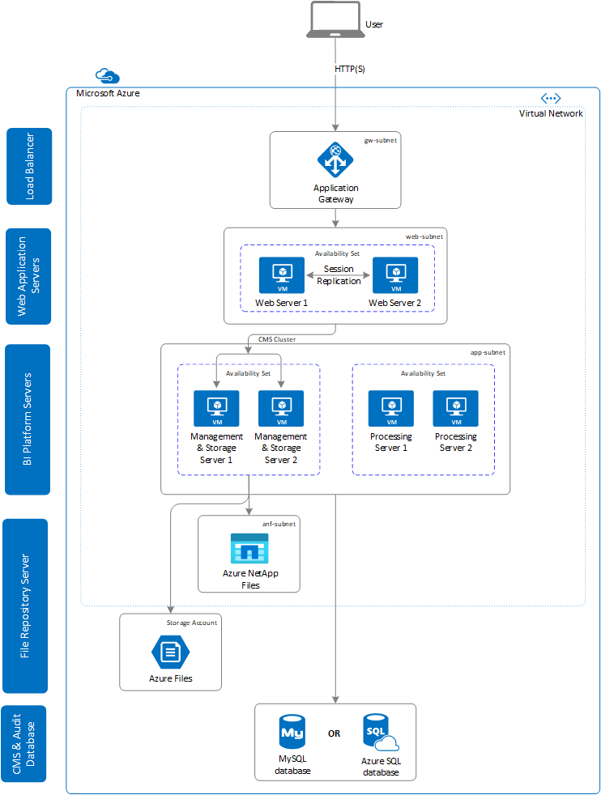

# SAP BusinessObjects Business Intelligence Platform on Azure Virtual Machines

## Overview

The purpose of this guide is to provide guidelines for planning, deploying and configuring SAP BusinessObjects Business Intelligence Platform, aka SAP BOBI Platform on Azure. This guide is intended to cover common Azure services and features that are relevant for SAP BOBI Platform. This guide is not an exhaustive list of all possible configuration options. It covers solutions common to typical deployment scenarios.

This guide is not intended to replace the standard SAP BusinessObjects Business Intelligence Platform installation and administration guides, operating system, or any relational database management system (RDBMS) documentation.

## Plan and Implement SAP BusinessObjects BI Platform on Azure

Microsoft Azure offers wide range of services including compute, storage, networking, and many others for businesses to build their applications without lengthy procurement cycles. Azure virtual machines provide companies to deploy different SAP applications like SAP NetWeaver based applications, SAP Hybris, SAP BusinessObjects BI Platform into Azure, further enhancing their reliability and availability based on business need. Azure also supports the cross-premises connectivity, which enables companies to integrate Azure virtual machines into their on-premise domains, their private clouds and their SAP system landscape.

This document provides guidance on planning and implementation consideration for SAP BusinessObjects BI Platform on Azure. It complements the SAP installation documentation and SAP Notes which represent the primary resources for installations and deployments of SAP BOBI.

### Architecture Overview

SAP BusinessObjects BI Platform is a self-contained system that can exist on a single Azure virtual machine or can be scaled up into a cluster of many Azure Virtual Machines that run different components. SAP BOBI Platform consist of six conceptual tiers: Client Tier, Web Tier, Management Tier, Storage Tier, Processing Tier and Data Tier. (For more details on each tier, refer Administrator Guide in [SAP BusinessObjects Business Intelligence Platform](https://help.sap.com/viewer/product/SAP_BUSINESSOBJECTS_BUSINESS_INTELLIGENCE_PLATFORM/4.3/en-US) help portal). Below is the high level details on each tier -

- **Client Tier:** It contains all desktop client applications that interact with the BI platform to provide a variety of reporting, analytic, and administrative capabilities.
- **Web Tier:** It contains web applications deployed to a JAVA web application servers. Web applications provides BI Platform functionality to end users through a web browsers.
- **Management Tier:** It co-ordinates and control all the components that make up the BI Platform. It comprises the Central Management Server (CMS) and the Event Server and associated services
- **Storage Tier:** It is responsible for handling files, such as documents and reports. It also handles report caching to save system resources when user access reports.
- **Processing Tier:** It analyzes data, and produce reports and other output types. This is the only tier that accesses the databases that contains report data.
- **Data Tier:** It consists of the database servers hosting the CMS system databases and Auditing Data Store.

The SAP BI Platform consists of collection of servers running on one or more hosts. It is essential that you choose the correct deployment strategy based on the sizing, business need and type of environment. For small installation like development or test, you can use a single Azure Virtual Machine for web application server, database server and all BI Platform servers. In case you are using Database-as-a-Service (DBaaS) offering from Azure, database server will run separately from other components. For medium and large installation, you can have servers running on multiple Azure virtual machines.

In below figure, architecture of large scale deployment of SAP BOBI Platform on Azure virtual machines is shown, where each component (web application, BI application) is distributed and placed behind availability set which can sustain failover in case of service disruption.

#### Architecture Details

- Load Balancer

  In SAP BOBI multi-instance deployment, Web application servers (or web tier) are running on two or more hosts. To distribute user load evenly across web servers, you can use a load balancer between end users and web servers. In Azure, you can either use [Azure Load Balancer](../../../load-balancer/load-balancer-overview.md) or [Azure Application Gateway](../../../application-gateway/overview.md) to manage traffic to your web servers.

- Web Application Servers

  The web server hosts the web applications of SAP BOBI Platform like CMC and BI Launch Pad. To achieve high availability for web server, you must deploy at least two web application servers to manage redundancy and load balancing. In Azure, this web application servers can be placed either in availability sets or availability zones for better availability.

  Tomcat is the default web application for SAP BI Platform and to achieve high availability for tomcat, you can enable session replication using [Static Membership Interceptor](https://tomcat.apache.org/tomcat-9.0-doc/config/cluster-membership.html#Static_Membership_Attributes) in Azure which ensure that user can access SAP BI web application even when tomcat service is disrupted.

  > [!Important]
  > By default Tomcat uses multicast IP and Port for clustering which is not supported on Azure (SAP Note [2764907](https://launchpad.support.sap.com/#/notes/2764907)).

- BI Platform Servers

  BI Platform servers comprises of all the services that are part of SAP BOBI application (management tier, processing tier and storage tier). When a web server receive a request, it detect each BI platform server (specifically, all CMS servers in a cluster) and automatically load balance their requests. In case if one of the BI Platform host fails, web server automatically send requests to other host.

  To achieve high availability or redundancy for BI Platform, you must deploy the application in at least two Azure virtual machines. Based on the sizing, you can scale your BI Platform to run on more Azure virtual machines.

- File Repository Server (FRS)

  File Repository Server contains all reports and other BI documents that has been created. In multi-instance deployment, BI Platform servers are running on multiple virtual machine and each of this VMs should have access to this reports and other BI documents. For this, a filesystem needs to be shared across all BI platform servers.

  In Azure, you can either use [Azure Premium Files](../../../storage/files/storage-files-introduction.md) or [Azure NetApp Files](../../..azure-netapp-files/azure-netapp-files-introduction.md) for File Repository Server. Both of this Azure services has built-in redundancy.

- CMS & Audit Database
  
  SAP BOBI Platform requires a database to store its system data, which is referred as CMS database. It is used to store BI platform information, such as user, server, folder, document, configuration, and authentication details.

  Azure offers [MySQL Database](https://azure.microsoft.com/en-us/services/mysql/) and [Azure SQL database](https://azure.microsoft.com/en-us/services/sql-database/) Database-as-a-Service (DBaaS) offering which can be used for CMS database and Audit database. As this being a PaaS offering, customer do not have to worry about operation, availability and maintenance of the databases. Customer can also choose their own database for CMS and Audit repository based on their business need.

## Support Matrix

This section describes supportability of different SAP BOBI component like SAP BusinessObjects BI Platform version, Operating System and Databases in Azure.

### SAP BusinessObjects BI Platform

Azure Infrastructure as a Service (IaaS) enables you to deploy and configure SAP BusinessObjects BI Platform on Azure Compute. It supports following version of SAP BOBI Platform -

- SAP BusinessObjects BI Platform 4.3
- SAP BusinessObjects BI Platform 4.2 SP04+
- SAP BusinessObjects BI Platform 4.1 SP05+

The SAP BI Platform runs on different operating system and databases. Supportability of SAP BOBI platform between Operating System and Database version can be found in [Product Availability Matrix](https://apps.support.sap.com/sap/support/pam) for SAP BOBI.

### Operating System

Azure supports below operating systems for SAP BusinessObjects BI Platform deployment.

- Microsoft Windows Server
- SUSE Linux Enterprise Server (SLES)
- Red Hat Enterprise Linux (RHEL)
- Oracle Linux (OL)

The version for Windows, SUSE Linux Enterprise Server, Red Hat Enterprise Linux and Oracle Linux that are listed in [Product Availability Matrix (PAM) for SAP BusinessObjects BI Platform](https://support.sap.com/pam) are supported as long as they are compatible to run on Azure Infrastructure.

### Databases

The BI Platform needs database server for CMS system databases and Auditing Data store which can be installed on any supported databases version listed in [Product Availability Matrix (PAM) for SAP BOBI](https://support.sap.com/pam) which includes

- Microsoft SQL Server

- [Azure SQL Database](https://azure.microsoft.com/en-us/services/sql-database/) (Supported database only for SAP BOBI Platform on Windows)

  It is a fully managed SQL Server database engine, based on the latest stable Enterprise Edition of SQL Server. It handles most of the database management functions such as upgrading, patching, and monitoring without user involvement. With Azure SQL Database, you can create a highly available and high-performance data storage layer for the applications and solutions in Azure. For more details, check [Azure SQL Database](../../../azure-sql/azure-sql-iaas-vs-paas-what-is-overview.md) documentation.

- [Azure Database for MySQL](https://azure.microsoft.com/en-us/services/mysql/) (Follow same compatibility guidelines as that of MySQL AB in SAP PAM)

  It is a relational database service service powered by the MySQL community edition. It's a fully managed Database-as-a-Service (DBaaS) offering that can handle mission-critical workloads with predictable performance and dynamic scalability. It has built-in high availability, automatic backups, software patching, automatic failure detection and point-in-time restore for up to 35 days, which can substantially reduces operation tasks. For more details, check [Azure Database for MySQL](../../../mysql/overview.md) documentation.

- SAP HANA

- SAP ASE

- IBM DB2

- Oracle (For version and restriction, check SAP Note [2039619](https://launchpad.support.sap.com/#/notes/2039619))

- MaxDB

This document illustrates the guidelines on how to deploy **SAP BOBI Platform on Windows with Azure SQL Database** and **SAP BOBI Platform on Linux with Azure Database for MySQL** in Azure. It is also our recommended approach for running SAP BusinessObjects BI Platform Platform on Azure.

## Sizing

Sizing is a process of determining the hardware requirement to run the application efficiently. For SAP BOBI Platform, sizing needs to be done using SAP sizing tool called [Quick Sizer](https://www.sap.com/about/benchmark/sizing.quick-sizer.html#quick-sizer). The tool provides the SAPS based on the input, which then needs to be mapped to certified Azure virtual machines types for SAP. SAP Note [1928533](https://launchpad.support.sap.com/#/notes/1928533) provides the list of supported SAP products and Azure VM types along with SAPS. For more details on Sizing, refer to [SAP BI Sizing Guide](https://wiki.scn.sap.com/wiki/display/BOBJ/Sizing+and+Deploying+SAP+BusinessObjects+BI+4.x+Platform+and+Add-Ons).

For storage need for SAP BOBI Platform, Azure offer different [Managed Disks](../../managed-disks-overview.md). For SAP BOBI Installation directory it is recommended to use Premium SSD Managed Disk and for the database running on virtual machines, follow the guidance provided in [DBMS deployment for SAP workload](./dbms_guide_general.md).

Azure supports two DBaaS offering for SAP BOBI Platform data tier - [Azure SQL Database](https://azure.microsoft.com/en-us/services/sql-database) (BI Application running on Windows) and [Azure Database for MySQL](https://azure.microsoft.com/en-us/services/mysql) (BI Application running on Linux and Windows). So based on the sizing result, you can choose purchasing model that best fits your need.

> [!Tip]
> Consider 800 SAPS = 1 vCPU, while mapping the SAPS result of SAP BOBI Platform database tier to Azure Database-as-a-Service (Azure SQL Database or Azure Database for MySQL).

### Sizing Models for Azure SQL Database

Azure SQL Database offers the following three purchasing models:

- vCore-based

  It let you choose the number of vCores, amount of memory, and the amount and speed of storage. The vCore-based purchasing model also allows you to use [Azure Hybrid Benefit for SQL Server](https://azure.microsoft.com/pricing/hybrid-benefit/) to gain cost savings. This model is suited for customer who value flexibility, control and transparency.

  There are three [Service Tier Options](../../../azure-sql/database/service-tiers-vcore.md#service-tiers) being offered in vCore model that include - General Purpose, Business Critical and Hyperscale. The service tier generally defines the storage architecture, space and I/O limits, and business continuity options related to availability and disaster recovery. Below is high level details on each service tier option -

  1. **General Purpose** service tier is best suited for Business workloads. It offers budget-oriented, balanced and scalable compute and storage options. For more information, refer [Resource options and limits](../../../azure-sql/database/resource-limits-vcore-single-databases.md#general-purpose---provisioned-compute---gen5).
  2. **Business Critical** service tier offers business applications the highest resilience to failures by using several isolated replicas, and provides the highest I/O performance per database replica. For more information, refer [Resource options and limits](../../../azure-sql/database/resource-limits-vcore-single-databases.md#business-critical---provisioned-compute---gen5).
  3. **Hyperscale** service tier is best for business workloads with highly scalable storage and read-scale requirements. It offers higher resilience to failures by allowing configuration of more than one isolated database replica. For more information, refer [Resource options and limits](../../../azure-sql/database/resource-limits-vcore-single-databases.md#hyperscale---provisioned-compute---gen5).

- DTU-based

  The DTU-based purchasing model offers a blend of compute, memory and I/O resources in three service tiers, to support light and heavy database workloads. Compute sizes within each tier provide a different mix of these resources, to which you can add additional storage resources. It is best suited for customers who want simple, pre-configure resource options.

  [Service Tiers](../../../azure-sql/database/service-tiers-dtu.md#compare-the-dtu-based-service-tiers) in the DTU-based purchase model are differentiated by a range of compute sizes with a fixed amount of included storage, fixed retention period of backups and fixed price.

- Serverless

  The serverless model automatically scales compute based on workload demand, and bills for the amount of compute used per second. The serverless compute tier also automatically pauses databases during inactive periods when only storage is billed, and automatically resumes databases when activity returns. For more information, refer [Resource options and limits](../../../azure-sql/database/resource-limits-vcore-single-databases.md#general-purpose---serverless-compute---gen5).
  
  It is more suitable for intermittent, unpredictable usage with lower average compute utilization over time. So this model can be use for non-production SAP BOBI deployment.

> [!Note]
> For SAP BOBI, it's convenient to use vCore based model and choose either General Purpose or Business Critical service tier based on the business need.

### Sizing Models for Azure Database for MySQL

Azure Database for MySQL comes with below three different pricing tiers and are differentiated by the amount of compute in vCores that can be provisioned, memory per vCore, and the storage technology used to store the date. Below is the high level details on the options and for more details on different attributes, refer [Pricing Tier](../../../mysql/concepts-pricing-tiers.md) for Azure Database for MySQL.

- Basic

  It is used for the target workloads that require light compute and I/O performance.

- General Purpose

  It is suited for most business workloads that require balanced compute and memory with scalable I/O throughput.

- Memory Optimized

  For high-performance database workloads that require in-memory performance for faster transaction processing and higher concurrency.

> [!Note]
> For SAP BOBI, it is convenient to use General Purpose or Memory Optimized pricing tier based on the business workload.

## Azure Resources

### Choosing Regions

An Azure region is a one or a collection of data-centers that contains the hardware and infrastructure that runs and hosts different Azure Services. This infrastructure includes large number of nodes that function as compute nodes or storage nodes, or run network functionality. Not all region offers the same services.

SAP BI Platform contains different components which might requires specific VM types, Storage types (like Azure Files or Azure NetApp Files) or Database as a Service (DBaaS) offering for its data tier which might not be available in certain regions. You can find out the exact information on VM types, Azure Storage types or, other Azure Services in [Products available by region](https://azure.microsoft.com/en-us/global-infrastructure/services/) site. If you are already running your SAP Systems on Azure, probably you have your region identified but you need to first investigate that the necessary services are available in those regions to finalize the architecture of SAP BI Platform.

### Availability Zones

Availability Zones are physically separate locations within an Azure region. Each Availability Zone is made up of one or more datacenters equipped with independent power, cooling, and networking.

To attain high availability on each tier for SAP BI Platform, you can distribute VMs across Availability Zone by implementing high availability framework which can give you the best SLA in Azure. For Virtual Machine SLA in Azure, check the latest version of [Virtual Machine SLAs](https://azure.microsoft.com/support/legal/sla/virtual-machines/).

For data tier, Azure Database as a Service (DBaaS) service provides high availability framework by default, so you need not to worry about Availability Zone. You just need to select the region and service inherent high availability, redundancy and resiliency capabilities to mitigate database downtime from planned and unplanned outages, without requiring you to configure any additional components. For more details on the SLA for supported DBaaS offering on Azure for SAP BI Platform, check [High availability in Azure Database for MySQL](../../../mysql/concepts-high-availability.md) and [High availability for Azure SQL Database](../../../azure-sql/database/high-availability-sla.md).

### Availability Sets

Availability set is a logical grouping capability for isolating Virtual Machine (VM) resources from each other on being deployed. Azure makes sure that the VMs you place within an Availability Set run across multiple physical servers, compute racks, storage units and network switches. If a hardware or software failure happens, only a subset of your VMs are impacted and your overall solution stays operational. So when Azure virtual machines are placed in Availability sets, Azure Fabric Controller distributes the VMs over different [Fault](planning-guide.md#fault-domains) and [Upgrade](planning-guide.md#upgrade-domains) domain so as to prevent all VMs from being shutdown in case of infrastructure maintenance or failure within one Fault domain.

SAP BI Platform contains many different components (Web Application, BI Application, Database) and while designing the architecture you have to make sure that each of this component is resilient in case of any disruption. This can be achieved by placing Azure virtual machines of each component within availability sets. Keep in mind, when you try to mix various VMs of different VM families within one availability set, you may encounter problems that prevent you to include a certain VM type into such availability set. So have separate availability set for Web Application, BI Application for SAP BI Platform as highlighted in Architecture Overview.

Also the number of update and fault domains that can be used by an Azure Availability Set within an Azure Scale unit is finite. So if you keep adding VMs to a single availability set, two or more VMs will eventually end up in the same fault or update domain. For more information, see the [Azure Availability Sets](planning-guide.md#azure-availability-sets) section of the Azure virtual machines planning and implementation for SAP document.

To understand the concept of Azure availability sets and the way availability sets relate to Fault and Upgrade Domains, read [this article](../../manage-availability.md).

> [!Important]
>
> The concepts of Azure Availability Zones and Azure availability sets are mutually exclusive. That means, you can either deploy a pair or multiple VMs into a specific Availability Zone or an Azure availability set. But not both.

### Virtual Machines

Azure Virtual Machine is a service offering that enables you to deploy custom images to Azure as Infrastructure-as-a-Service (IaaS) instances. It simplifies maintaining and operating applications by providing on-demand compute and storage to host, scale, and manage web application and connected applications.

Microsoft Azure offers varieties of virtual machines (VMs) for all your application needs but for SAP workload, Azure has narrowed down the selection to different VM families that are suitable for SAP workload and SAP HANA workload more specifically. For more insight, check [What SAP software is supported for Azure deployments](sap-supported-product-on-azure.md).

Based on the SAP BI Platform sizing, you need to map your requirement to Azure Virtual Machine which are supported in Azure for SAP product. SAP Note [1928533](https://launchpad.support.sap.com/#/notes/1928533) is a good starting point that list out supported Azure VM types for SAP Products on Windows and Linux. Also a point to keep in mind that beyond the selection of purely supported VM types, you also need to check whether those VM types are available in specific region based on the site [Products available by region](https://azure.microsoft.com/global-infrastructure/services/). For choosing the pricing model, you can refer to [Azure virtual machines for SAP workload](planning-guide.md#azure-virtual-machines-for-sap-workload)

### Storage

Azure Storage is a Azure-managed cloud service that provides storage which is highly available, secure, durable, scalable and redundant. Some of the storage types are not or of limited usable for SAP scenarios. Whereas, several Azure Storage types are well suited or optimized for specific SAP workload scenarios. Refer [Azure Storage types for SAP Workload](planning-guide-storage.md) for more information, as it highlights different storage options that are suited for SAP.

Azure Storage has different Storage types available for customer scenarios and details regarding the same can be read in the article [What disk types are available in Azure?](../../disks-types.md) SAP BOBI Platform uses following Azure Storage to build the application -

- Azure Managed Disks

  It is a block-level storage volumes that are managed by Azure which is used for SAP BOBI Platform application servers and databases (when installed on Azure virtual machines). There are different types of [Azure Managed Disks](../../managed-disks-overview.md) available, but it is recommended to use [Premium SSDs](../../disks-types.md#premium-ssd) for SAP BOBI Platform application and database.

  In below example, Premium SSDs are used for BOBI Platform installation directory, and database data and log volumes if separate database is installed on Azure Virtual Machine. As CMS and Audit databases are typically small and it doesn’t have the same storage performance requirements as that of other SAP OLTP/OLAP databases.

- Azure Premium Files or Azure NetApp Files

  In SAP BOBI Platform, File Repository Server (FRS) refers to the disk directories where contents like reports, universes, and connections are stored which are used by all application servers of that system. [Azure Premium Files](../../../storage/files/storage-files-introduction.md) or [Azure NetApp Files](../../../azure-netapp-files/azure-netapp-files-introduction.md) storage can be used as a shared file systems for SAP BOBI applications FRS. As this storage offering is not available all regions, refer [Products available by region](https://azure.microsoft.com/en-us/global-infrastructure/services/) site to find out up-to-date information.

  If the service is not available in your region, you can create NFS sever from which you can share the file system to SAP BOBI application. But you will also need to consider it’s high availability.

### Networking

SAP BOBI is a reporting and analytics BI platform that doesn’t hold any business data. So the system is usually connected to other database servers from where it fetches all the data and provide insight to users. Microsoft Azure provides a network infrastructure, which allows the mapping of all scenarios which can be realized with SAP BI Platform like connecting to on-premise system, systems in different virtual network and others. For more information check [Microsoft Azure Networking for SAP Workload](planning-guide.md#microsoft-azure-networking).

For Database-as-a-Service offering, any newly created database (Azure SQL Database or Azure Database for MySQL) has a firewall that blocks all external connections. To allow access to the DBaaS service from BI Platform virtual machines, you need to specify one or more server-level firewall rules to enable access to your DBaaS server. For more information refer, [Firewall rules](../../../mysql/concepts-firewall-rules.md) for Azure Database for MySQL and [Network Access Controls](../../../azure-sql/database/network-access-controls-overview.md) section for Azure SQL database.

## Next Steps

- [SAP BusinessObjects BI Platform Deployment on Linux](bobi-deployment-guide-linux.md)
- [Azure Virtual Machines planning and implementation for SAP](planning-guide.md)
- [Azure Virtual Machines deployment for SAP](deployment-guide.md)
- [Azure Virtual Machines DBMS deployment for SAP](dbms-guide.md)