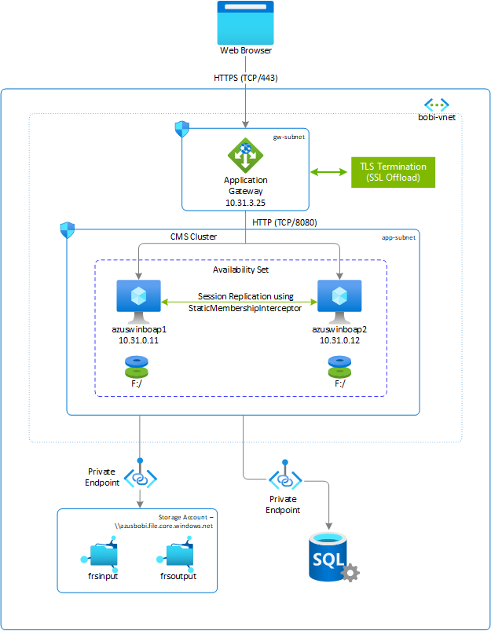
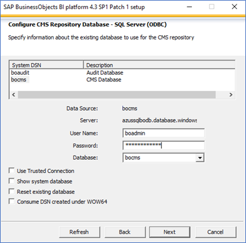
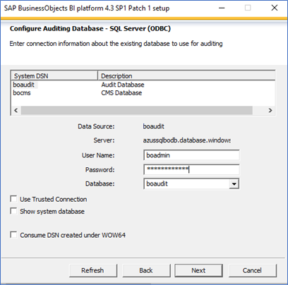
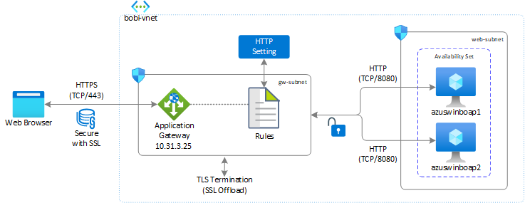

# SAP BusinessObjects BI platform deployment guide for Windows on Azure

This article describes the strategy to deploy SAP BusinessObjects BI Platform on Azure for Windows. In this example, two virtual machines with Premium SSD-managed disks as their install directory are configured. Azure SQL database (PaaS offering) is used for Central management service (CMS) and audit database, and Azure Premium Files (SMB protocol) as file store that is shared across both virtual machines. The default Tomcat Java web application and BI platform application are installed together on both virtual machines. To load balance the user requests, Azure Application Gateway is used, which has native TLS/SSL offloading capabilities.

This type of architecture is effective for small deployment or non-production environment. For Production or large-scale deployment, you should separate hosts for Web Application and can have multiple BOBI applications hosts allowing server to process more information.



In this example, below product version and file system layout is used

- SAP BusinessObjects Platform 4.3 SP01 Patch 1
- Windows Server 2019
- Azure SQL database (Version: 12.0.2000.8)
- Microsoft ODBC driver - msodbcsql.msi (Version: 13.1)

| File System        | Description                                                                                                               | Size (GB)             | Required Access  | Storage                    |
|--------------------|---------------------------------------------------------------------------------------------------------------------------|-----------------------|---------------|----------------------------|
| F:          | The  file system for installation of SAP BOBI instance, default Tomcat Web Application, and database drivers (if necessary) | SAP Sizing Guidelines | Local administrative privileges | Managed Premium Disk - SSD |
| \\\azusbobi.file.core.windows.net\frsinput  | The mount directory is for the shared files across all BOBI hosts that will be used as Input Filestore directory | Business Need         | Local administrative privileges | Azure NetApp Files         |
| \\\azusbobi.file.core.windows.net\frsoutput | The mount directory is for the shared files across all BOBI hosts that will be used as Output Filestore directory | Business Need         | Local administrative privileges | Azure NetApp Files         |

## Deploy Windows virtual machine via Azure portal

In this section, we'll create two virtual machines (VMs) with Windows operating system (OS) image for SAP BOBI Platform. The high-level steps to create Virtual Machines are as follows -

1. Create a [Resource Group](../../../azure-resource-manager/management/manage-resource-groups-portal.md#create-resource-groups)

2. Create a [Virtual Network](../../../virtual-network/quick-create-portal.md#create-a-virtual-network).

   - Don't use single subnet for all Azure services in SAP BI Platform deployment. Based on SAP BI Platform architecture, you may need to create multiple subnets. In this deployment, we'll create two subnets - BI Application Subnet, and Application Gateway Subnet.
   - Follow SAP Note [2276646](https://launchpad.support.sap.com/#/notes/2276646) to identify ports for SAP BusinessObjects BI Platform communication across different components.
   - Azure SQL Database communicates over port 1433. So outbound traffic over port 1433 should be allowed from your SAP BOBI application servers.
   - In Azure, Application Gateway needs to be on separate subnet. Check [Azure Application Gateway](../../../application-gateway/configuration-overview.md) article for more details.
   - In case, if you are using Azure NetApp Files for file store instead of Azure Files, you need to create a separate subnet for Azure NetApp Files. Check [Guidelines for Azure NetApp Files Network Planning](../../../azure-netapp-files/azure-netapp-files-network-topologies.md) article for more details.

3. Create an Availability Set.

   - To achieve redundancy for each tier in multi-instance deployment, place virtual machines for each tier in an availability set. Make sure you separate the availability sets for each tier based on your architecture.

4. Create Virtual Machine 1 **(azuswinboap1).**

   - You can either use custom image or choose an image from Azure Marketplace. Refer to [Deploying a VM from the Azure Marketplace for SAP](deployment-guide.md) or [Deploying a VM with a custom image for SAP](deployment-guide.md) based on your need.

5. Create Virtual Machine 2 **(azuswinboap2).**
6. Add one Premium SSD disk. It will be used as SAP BOBI Installation directory.

## Provision Azure premium files

Before you continue with the setup for Azure Files, familiarize yourself with the [Azure Files](https://docs.microsoft.com/azure/storage/files/storage-files-introduction) documentation.

Azure Files offers standard file shares hosted on hard disk-based (HDD-based) hardware, and premium file shares hosted on solid-state disk-based (SSD-based) hardware. For SAP BusinessObjects file store, we recommend using Azure premium files.

Azure premium file shares are available with local and zone redundancy in a subset of regions. To find out if premium file shares are currently available in your region, see the [products available by region](https://azure.microsoft.com/global-infrastructure/services/?products=storage) page for Azure. For information about regions that support ZRS, see [Azure storage redundancy](https://docs.microsoft.com/azure/storage/common/storage-redundancy?toc=/azure/storage/files/toc.json).

### Deploy Azure files storage account and NFS shares

Azure file shares are deployed into storage accounts, which are top-level objects that represent a shared pool of storage. This pool of storage can be used to deploy multiple file shares. Azure supports multiple types of storage accounts for different storage scenarios customers may have, but for SAP BusinessObjects file store you need to create **FileStorage** storage account. It allows you to deploy Azure file shares on premium solid-state disk-based (SSD-based) hardware.

> [!NOTE]
> FileStorage accounts can only be used to store Azure file shares, no other storage resources (blob, containers, queues, tables, etc.) can be deployed in a FileStorage account.

The storage account will be accessed via [private end point](../../../storage/files/storage-files-networking-endpoints.md), deployed in the same virtual network of SAP BOBI Platform. With this setup, the traffic form your SAP system never leaves the virtual network security boundaries. SAP systems often contain sensitive and business critical data and staying within the boundaries of the virtual network is important security consideration for many customers.

If you need to access the storage account from different virtual network, then you can use [Azure VNET peering](../../../virtual-network/virtual-network-peering-overview.md).

#### Azure files storage account

1. To create storage account via Azure portal, **Create a resource** > **Storage** > **Storage account**.

2. On **Basics** tab, complete all required fields to create a storage account.

   a. Select **Subscription**, **Resource group**, and **Region**.

   b. Enter the **Storage account name** (for example, **azusbobi**). This name must be globally unique, but otherwise can provide any name you want.

   c. Select **Premium** as performance tier, and **FileStorage** as account kind.

   d. For Replication label, choose redundancy level. Select **Locally redundant storage (LRS)**.

   For Premium FileStorage, local-redundant storage (LRS) and zone-redundant storage (ZRS) are the only options available. So based on your deployment strategy (availability set or availability zone), choose the appropriate redundancy level. For more information, See [Azure storage redundancy](../../../storage/common/storage-redundancy.md).

   e. Select Next.

3. On **Networking** tab, select [private endpoint](../../../storage/files/storage-files-networking-endpoints.md) as connectivity method. Refer [Azure Files networking considerations](../../../storage/files/storage-files-networking-overview.md) for detailed information.

   a. Select **Add** in the private endpoint section.

   b. Select **Subscription**, **Resource group**, and **Location**.

   c. Enter the **Name** of private endpoint (for example, azusbobi-pe).

   d. Select **file** in **storage sub-resource**.

   e. In **Networking** section, select the **Virtual network** and **Subnet** on which SAP BusinessObjects BI application is deployed.

   f. Accept the **default (yes)** for **Integrate with private DNS zone**.

   g. Select your **private DNS zone** from the drop-down.

   h. Select **OK**, to go back to the Networking tab in create storage account.

4. On the **Data protection** tab, configure the soft-delete policy for Azure file shares in your storage account. By default, soft-delete functionality is turned off. To learn more about soft delete, see [How to prevent accidental deletion of Azure file shares](../../../storage/files/storage-files-prevent-file-share-deletion.md).

5. On the **Advanced** tab, check different security options.

   **Secure transfer required** filed indicates whether the storage account requires encryption in transit for communication to the storage account. If you require SMB 2.1 support, you must disable this field. For SAP BusinessObjects BI platform, keep it **default (enabled)**.

6. Continue and create the storage account.

For details on how to create storage account, see [Create FileStorage Storage Account](../../../storage/files/storage-how-to-create-file-share.md).

#### Create Azure file Shares

Next step is to create Azure Files in the storage account. Azure files use a provisioned model for premium file shares. In a provisioned business model, you proactively specify to the Azure Files service what your storage requirements are, rather than being billed based on what you use. To understand more on this model, see [Provisioned model](../../../storage/files/understanding-billing.md#provisioned-model). In this example, we create two Azure Files - frsinput (256 GB) and frsoutput (256 GB) for SAP BOBI file store.

Navigate to storage account **azusbobi** > **File shares**

1. Select **New File share**.
2. Enter the **Name** of the file share (for example, frsinput, frsouput)
3. Insert the required file share size in **Provisioned capacity** (for example, 256 GB)
4. Choose **SMB** as **Protocol**.
5. Select **Create**.

## Configure data disk on Windows virtual machine

The steps in this section use the following prefixes:

**[A]**: The step applies to all hosts

### Initialize a new data disk

SAP BusinessObjects BI application requires a partition on which its binaries can be installed. You can install SAP BOBI application on the operating system partition (C: ), but ensure to have enough space for the deployment and the operating system. It's recommended that you have at least 2 GB available for temporary files and web applications. With all this consideration, it's advisable to separate SAP BOBI installation binaries in separate partition.

In this example, SAP BOBI application will be installed on a separate partition (F: ). Initialize the premium SSD disk that you've attached during virtual machine provisioning.

1. **[A]** In case, no data disk is attached to virtual machine (azuswinboap1 and azuswinboap2), follow the steps mentioned in [Add a disk disk](../../windows/attach-managed-disk-portal.md#add-a-data-disk) to attach a new managed data disk.
2. **[A]** After managed disk is attached to virtual machine, initialize the disk by following the steps mentioned in [Initialize a new data disk](../../windows/attach-managed-disk-portal.md#initialize-a-new-data-disk) document.

### Mount Azure Premium Files

To use Azure files as file store you must mount it, which means assigning it a drive letter or mount point path.

1. **[A]** To mount Azure file share, follow the steps described in [Mount the Azure file share](../../../storage/files/storage-how-to-use-files-windows.md#mount-the-azure-file-share) document.

To mount Azure file share on windows server, ensure port 445 is open. The SMB protocol requires TCP port 445 to be open; connections will fail if port 445 is blocked. You can check if the firewall is blocking port 445 with the `Test-NetConnection` cmdlet mentioned in the [troubleshooting](../../../storage/files/storage-troubleshoot-windows-file-connection-problems.md#cause-1-port-445-is-blocked) guide.

## Configure CMS database - Azure SQL

This section provides details on how to provision Azure SQL using Azure portal. It also provides instructions on how to create the CMS and the Audit database for SAP BOBI platform and a user account to access the database.

The guidelines are applicable only if you’re using Azure SQL (DBaaS offering on Azure). For other database(s), refer to SAP or database-specific documentation for instructions.

### Create SQL database server

Azure SQL database offers different deployment options - single database, elastic pool, and database server. For SAP BOBI, we need two databases (CMS and Audit). So, instead of creating two single databases, you can create a SQL database server that can manage the group of single databases and elastic pools.  Following are the steps to create SQL database server -

1. Browse to the [Select SQL Deployment option](https://portal.azure.com/#create/Microsoft.AzureSQL) page.
2. Under **SQL databases**, change **Resource type** to **Database server**, and select **Create**.
3. On **Basics** tab, complete all required fields to **Create SQL Database Server**.

   a. Select the **Subscription** and **Resource group** under **Project details**.

   b. Enter **Server name** (for example, azussqlbodb). The server name must be globally unique, but otherwise can provide any name you want.

   c. Select the **Location**.

   d. Enter **Server admin login** (for example, boadmin) and **Password**.

4. On the **Networking** tab, change **Allow Azure services and resources to access this server** to **No** under **Firewall rules**.
5. On **Additional settings**, keep the default settings.
6. Continue and create **SQL Database Server**.

In the next step, create the CMS and the audit databases in the SQL database server (azussqlbodb.database.windows.net).

### Create the CMS and the audit database

After provisioning SQL database server, browse to the resource **azussqlbodb** and then follow below steps to create CMS and audit databases.

1. On azussqlbodb **Overview** page, select **Create database**.
2. On **Basics** tab, complete all required fields -

   a. Enter **Database name** (for example, bocms or boaudit).

   b. On **Compute + storage** option, select **Configure database** and choose the appropriate model based on your sizing result. Refer [Sizing models for Azure SQL database](businessobjects-deployment-guide.md#sizing-models-for-azure-sql-database) to get insight on the options.
3. On the **Networking** tab, select [private endpoint](../../../private-link/tutorial-private-endpoint-sql-portal.md) for connectivity method. The private endpoint will be used to access Azure SQL database within the configured virtual network.

   a. Select **Add private endpoint**.

   b. Select **Subscription**, **Resource group**, and **Location**.

   c. Enter the **Name** of private endpoint (for example, azusbodb-pe).

   e. Select **SqlServer** in **Target sub-resource**.

   f. In **Networking** section, select the **Virtual network** and **Subnet** on which SAP BusinessObjects BI application is deployed.

   g. Accept the **default (yes)** for **Integrate with private DNS zone**.

   h. Select your **private DNS zone** from the drop-down.

   i. Select **OK**, to go back to the Networking tab in create SQL database.
4. On **Additional settings** tab, change the **Collation** to **SQL_Latin1_General_CP850_BIN2**.
5. Continue and create CMS database.

Similarly, you can create **Audit** database (for example, boaudit).

### Download and install ODBC driver

For SAP BOBI application servers to access CMS or audit database, it requires database client/drivers. Microsoft ODBC driver is used to access CMS and Audit databases running on Azure SQL database. This section provides instructions on how to download and set up ODBC driver on Windows. 

1. Refer to **CMS + Audit repository support by OS** section in [Product Availability Matrix (PAM) for SAP BusinessObjects BI Platform](https://support.sap.com/pam) to find out the database connectors that are compatible with Azure SQL database.
2. Download ODBC driver version from the [link](https://docs.microsoft.com/sql/connect/odbc/windows/release-notes-odbc-sql-server-windows?view=sql-server-ver15&preserve-view=true). In this example, we're downloading ODBC driver [13.1](https://docs.microsoft.com/sql/connect/odbc/windows/release-notes-odbc-sql-server-windows?view=sql-server-ver15#131&preserve-view=true).
3. Install the ODBC driver on all BI servers (azuswinboap1 and azuswinboap2).
4. After installing driver in **azuswinboap1**, navigate to **Start** > **Windows Administrative Tools** > **ODBC Data Sources (64-bit)**.  
5. Navigate to **System DSN** tab. 
6. Select **Add** to create connection to CMS database.
7. Select **ODBC Driver 13 for SQL Server**, and select **Finish**.
8. Enter the information of your CMS database like below and select **Next**.
   - **Name:** *name of database created in section Create CMS and audit database* (for example, bocms or boaudit)
   - **Description:** *description to describe the data source* (for example, CMS database or Audit database)
   - **Server:** *name of SQL server created in section Create SQL database server* (for example, azussqlbodb.database.windows.net)
9. Select “**With SQL server authentication using a login ID and password entered by user**” to verify authenticity to SQL server. Enter the user credential that has been created at the time of Azure SQL database server creation (for example, boadmin) and select **Next**.
10. **Change the default database** to **bocms** and keep everything else as default. Select **Next**.
11. Check **Use strong encryption for data** and keep everything else as default. Select **Finish**.
12. Data source to CMS database has been created and now you can select **Test Data Source** to validate the connection to CMS database from BI application. It should be completed successfully. If it fails, [troubleshoot](../../../azure-sql/database/troubleshoot-common-errors-issues.md) the connectivity issue.

>[!Note]
>Azure SQL Database communicates over port 1433. So outbound traffic over port 1433 should be allowed from your SAP BOBI application servers.

Repeat the same above steps to create connection for audit database on server azuswinboap1. Similarly install and configure both ODBC data sources (bocms and boaudit) on all BI application servers (azuswinboap2). 

## Server preparation

Follow the latest guide by SAP to prepare servers for the installation of BI platform. For most up-to-date information, refer to Preparation section in [Business Intelligence Platform Installation Guide for Windows](https://help.sap.com/viewer/df8899896b364f6c880112f52e4d06c8/4.3.1/en-US/46b0d1a26e041014910aba7db0e91070.html).

## Installation

To install the BI platform on a Windows host, sign in with user that has local administrative privileges.

Navigate to the media of SAP BusinsessObjects BI Platform and run `setup.exe`.

Follow [SAP Business Intelligence Platform Installation Guide for Windows](https://help.sap.com/viewer/df8899896b364f6c880112f52e4d06c8/4.3.1/en-US/46ae62456e041014910aba7db0e91070.html), specific to your version. Few points to not while installing SAP BOBI platform on Windows. 

- On **Configure Destination Folder** screen, provide the destination folder where you would like to install BI platform. (for example, F:\SAP BusinessObjects\). 

- On **Configure Product Registration** screen, you can either use a temporary license key for SAP BusinessObjects Solutions from SAP Note [1288121](https://launchpad.support.sap.com/#/notes/1288121), or can generate license key in SAP Service Marketplace.

- On **Select Install Type** screen, select **Full** installation on first server (azuswinboap1), and for other server (azuswinboap2) select **Custom / Expand**, which will expand the existing BOBI setup.

- On **Select Default or Existing Database** screen, select **configure an existing database**, which will prompt you to select CMS and Audit database. Select **Microsoft SQL Server using ODBC** for CMS Database type and Audit Database type.

  You can also select No auditing database, if you don’t want to configure auditing during installation.

- Select appropriate options on **Select Java Web Application Server screen** based on your SAP BOBI architecture. In this example, we have selected option 1, which installs tomcat server on the same SAP BOBI Platform.

- Enter CMS database information in **Configure CMS Repository Database - SQL Server (ODBC)**. Example input for CMS database information for Windows installation.
  
  

- (Optional) Enter Audit database information in **Configure Audit Repository Database - SQL Server (ODBC)**. Example input for Audit database information for Windows installation.
  
  

- Follow the instructions and enter required inputs to complete the installation.

For multi-instance deployment, run the installation setup on second host (azuswinboap2). During **Select Install Type** screen, select **Custom / Expand** which will expand the existing BOBI setup. Check out SAP blog on [SAP BusinessObjects Business Intelligence Platform Setup with Azure SQL DB](https://blogs.sap.com/2020/06/19/sap-on-azure-sap-businessobjects-business-intelligence-platform-setup-with-azure-sql-db-managed-paas-database/)

> [!IMPORTANT]
> The database engine version numbers for SQL Server and Azure SQL Database are not comparable with each other, and rather are internal build numbers for these separate products. The database engine for Azure SQL Database is based on the same code base as the SQL Server database engine. Most importantly, the database engine in Azure SQL Database always has the newest SQL database engine bits. Version 12 of Azure SQL Database is newer than version 15 of SQL Server.

To find out the current Azure SQL database version, you can either check in the settings of Central Management Console (CMC) or you can run below query using [sqlcmd](https://docs.microsoft.com/sql/tools/sqlcmd-utility?view=sql-server-ver15&preserve-view=true) or [SQL Server Management Studio (SSMS)](https://docs.microsoft.com/sql/ssms/sql-server-management-studio-ssms?view=sql-server-ver15&preserve-view=true). The alignment of SQL versions to default compatibility can be found in [database compatibility level](https://docs.microsoft.com/sql/t-sql/statements/alter-database-transact-sql-compatibility-level?view=sql-server-ver15&preserve-view=true) article.


```sql
1> select @@version as version;
2> go
version
------------------------------------------------------------------------------------------
Microsoft SQL Azure (RTM) - 12.0.2000.8
        Feb 20 2021 17:51:58
        Copyright (C) 2019 Microsoft Corporation

(1 rows affected)

1> select name, compatibility_level from sys.databases;
2> go
name                                                                  compatibility_level
--------------------------------------------------------------------- -------------------
master                                                                                150
bocms                                                                                 150
boaudit                                                                               150

(3 rows affected)
```

## Post installation

After multi-instance installation of SAP BOBI Platform, additional post configuration steps need to be performed to support application high availability.

### Configuring cluster name

In multi-instance deployment of SAP BOBI Platform, you want to run several CMS servers together in a cluster. A cluster consists of two or more CMS servers working together against a common CMS system database. If a node that is running on CMS fails, a node with another CMS will continue to service BI platform requests. By default in SAP BOBI platform, a cluster name reflects the hostname of the first CMS that you install. 

To configure the cluster name on windows, follow the instruction mentioned in [SAP Business Intelligence Platform Administrator Guide](https://help.sap.com/viewer/2e167338c1b24da9b2a94e68efd79c42/4.3.1/en-US). After configuring the cluster name, follow SAP Note [1660440](https://launchpad.support.sap.com/#/notes/1660440) to set default system entry on the CMC or BI Launchpad sign in page. 

### Configure input and output filestore location to Azure Premium Files

Filestore refers to the disk directories where the actual SAP BusinessObjects files are. The default location of file repository server for SAP BOBI platform is located in the local installation directory. In multi-instance deployment, it's important to set up filestore on a shared storage like Azure Premium Files or Azure NetApp Files so it can be accessed from all storage tier servers.

1. If not created, follow the instruction provided in above section > **Provision Azure Premium Files** to create and mount Azure Premium Files.

   > [!Tip]
   > Choose the storage redundancy for Azure Premium Files (LRS or ZRS) based on your virtual machines deployment (availability set or availability zone).

2. Follow SAP Note [2512660](https://launchpad.support.sap.com/#/notes/0002512660) to change the path of file repository (Input and Output).

### Tomcat clustering - session replication

Tomcat supports clustering of two or more application servers for session replication and failover. SAP BOBI platform sessions are serialized, a user session can fail over seamlessly to another instance of tomcat, even when an application server fails. For example, if a user is connected to a web server that fails while the user is navigating a folder hierarchy in SAP BI application. On a correctly configured cluster, the user may continue navigating the folder hierarchy without being redirected to sign in page.

In SAP Note [2808640](https://launchpad.support.sap.com/#/notes/2808640), steps to configure tomcat clustering is provided using multicast. But in Azure, multicast isn't supported. So to make Tomcat cluster work in Azure, you must use [StaticMembershipInterceptor](https://tomcat.apache.org/tomcat-8.0-doc/config/cluster-interceptor.html#Static_Membership) (SAP Note [2764907](https://launchpad.support.sap.com/#/notes/2764907)). Check [Tomcat Clustering using Static Membership for SAP BusinessObjects BI Platform](https://blogs.sap.com/2020/09/04/sap-on-azure-tomcat-clustering-using-static-membership-for-sap-businessobjects-bi-platform/) on SAP blog to set up tomcat cluster in Azure.

### Load-balancing web tier of SAP BI platform

In SAP BOBI multi-instance deployment, Java Web Application servers (web tier) are running on two or more hosts. To distribute user load evenly across web servers, you can use a load balancer between end users and web servers. In Azure, you can either use Azure Load Balancer or Azure Application Gateway to manage traffic to your web application servers. Details about each offering are explained in following section.

1. [Azure Load Balancer](../../../load-balancer/load-balancer-overview.md) is a high performance, low latency layer 4 (TCP, UDP) load balancer that distributes traffic among healthy Virtual Machines. A load balancer health probe monitors a given port on each VM and only distributes traffic to an operational Virtual Machine(s). You can either choose a public load balancer or internal load balancer depending on whether you want SAP BI Platform accessible from internet or not. Its zone redundant, ensuring high-availability across Availability Zones.

   Refer to Internal Load Balancer section in below figure where web application server runs on port 8080 (default Tomcat HTTP Port), which will be monitored by health probe. So any incoming request that comes from end users will get redirected to the web application servers (azuswinboap1 or azuswinboap2) in the backend pool. Load balancer doesn’t support TLS/SSL Termination (also known as TLS/SSL Offloading). If you're using Azure load balancer to distribute traffic across web servers, we recommend using Standard Load Balancer.

   > [!NOTE]
   > When VMs without public IP addresses are placed in the backend pool of internal (no public IP address) Standard Azure load balancer, there will be no outbound internet connectivity, unless additional configuration is performed to allow routing to public end points. For details on how to achieve outbound connectivity see [Public endpoint connectivity for Virtual Machines using Azure Standard Load Balancer in SAP high-availability scenarios](high-availability-guide-standard-load-balancer-outbound-connections.md).

   

2. [Azure Application Gateway](../../../application-gateway/overview.md) provide Application Delivery Controller (ADC) as a service, which is used to help application to direct user traffic to one or more web application servers. It offers various layer 7 load-balancing capabilities like TLS/SSL Offloading, Web Application Firewall (WAF), Cookie-based session affinity and others for your applications.

   In SAP BI Platform, application gateway directs application web traffic to the specified resources in a backend pool - azuswinboap1 or azuswinboap2. You assign a listener to port, create rules, and add resources to a backend pool. In below figure, application gateway with private frontend IP address (10.31.3.25) act as entry point for the users, handles incoming TLS/SSL (HTTPS - TCP/443) connections, decrypt the TLS/SSL and pass the request (HTTP - TCP/8080) to the servers in the backend pool. With in-built TLS/SSL termination feature, we just need to maintain one TLS/SSL certificate on application gateway, which simplifies operations.

   

   To configure Application Gateway for SAP BOBI Web Server, you can refer to [Load Balancing SAP BOBI Web Servers using Azure Application Gateway](https://blogs.sap.com/2020/09/17/sap-on-azure-load-balancing-web-application-servers-for-sap-bobi-using-azure-application-gateway/) on SAP blog.

   > [!NOTE]
   > We recommend to use Azure Application Gateway to load balance the traffic to web server as it provide feature likes like SSL offloading, Centralize SSL management to reduce encryption and decryption overhead on server, Round-Robin algorithm to distribute traffic, Web Application Firewall (WAF) capabilities, high-availability and so on.

## SAP BusinessObjects BI Platform reliability on Azure

SAP BusinessObjects BI Platform includes different tiers, which are optimized for specific tasks and operations. When a component from any one tier becomes unavailable, SAP BOBI application will either become inaccessible or certain functionality of the application won’t work. So one need to make sure that each tier is designed to be reliable to keep application operational without any business disruption.

This guide will explore how features native to Azure in combination with SAP BOBI platform configuration improves the availability of SAP deployment. This section focuses on the following options for SAP BOBI Platform reliability on Azure -

- **Back up and Restore:** It's a process of creating periodic copies of data and applications to separate location. So it can be restored or recovered to previous state if the original data or applications are lost or damaged.

- **High Availability:** A high available platform has at least two of everything within Azure region to keep the application operational if one of the servers becomes unavailable.
- **Disaster Recovery:** It's a process of restoring your application functionality if there are any catastrophic loss like entire Azure Region becomes unavailable because of some natural disaster.

Implementation of this solution varies based on the nature of the system setup in Azure. So customer needs to tailor their backup/restore, high availability and disaster recovery solution based on their business requirement.

## Back-up and restore

Backup and Restore is a process of creating periodic copies of data and applications to separate location. So it can be restored or recovered to previous state if the original data or applications are lost or damaged. It's also an essential component of any business disaster recovery strategy. These backups enable application and database restore to a point-in-time within the configured retention period.

To develop comprehensive backup and restore strategy for SAP BOBI Platform, identify the components that lead to system downtime or disruption in the application. In SAP BOBI Platform, backup of following components are vital to protect the application.

- SAP BOBI Installation Directory (Managed Premium Disks)
- Filestore (Azure Premium Files or Azure NetApp Files for distributed install)
- CMS and Audit database (Azure SQL database, Azure database for MySQL or database on Azure virtual machine)

Following section describes how to implement backup and restore strategy for each component on SAP BOBI Platform.

### Backup & restore for SAP BOBI installation directory

In Azure, the simplest way to back up virtual machines including all the attached disks is by using [Azure VM backup](https://docs.microsoft.com/azure/backup/backup-azure-vms-introduction) Service. It provides an independent and isolated backup to guard unintended destruction of the data on your VMs. Backups are stored in a Recovery Services vault with built-in management of recovery points. Configuration and scaling are simple, backups are optimized and can be restored easily when needed.

As part of backup process snapshot is taken, and the data is transferred to the Recovery Service vault with no effect on production workloads. The snapshot provides different level of consistency as described in [Snapshot Consistency](../../../backup/backup-azure-vms-introduction.md#snapshot-consistency) article. Azure backup also offers side-by-side support for backup of managed disks using [Azure Disk backup](https://docs.microsoft.com/azure/backup/disk-backup-overview) in addition to [Azure VM backup](https://docs.microsoft.com/azure/backup/backup-azure-vms-introduction) solution. It is useful when you need consistent backups of virtual machines once a day and more frequent backups of OS disks, or a specific data disk that are crash consistent. For more information, see [Azure VM Backup](../../../backup/backup-azure-vms-introduction.md), [Azure Disk backup](../../../backup/disk-backup-overview.md), and [FAQs - Backup Azure VMs](../../../backup/backup-azure-vm-backup-faq.yml).

### Backup & restore for filestore

Based on your deployment, filestore of SAP BOBI platform can be on Azure NetApp Files or Azure Files. Choose from the following options for backup and restore based on the storage you use for filestore.

1. For **Azure NetApp Files**, you can create an on-demand snapshots and schedule automatic snapshot by using snapshot policies. Snapshot copies provide a point-in-time copy of your ANF volume. For more information, see [Manage snapshots by using Azure NetApp Files](../../../azure-netapp-files/azure-netapp-files-manage-snapshots.md).
2. **Azure Files** backup is integrated with native [Azure Backup](../../../backup/backup-overview.md) service, which centralizes the backup and restore function along with VMs backup and simplifies operation work. For more information, see [Azure File Share backup](../../../backup/azure-file-share-backup-overview.md) and [FAQs - Back up Azure Files](../../../backup/backup-azure-files-faq.yml).

If you have created separate NFS server, make sure you implement the back and restore strategy for the same.

### Backup & restore for CMS and Audit database

For SAP BOBI Platform running on Windows virtual machines, the CMS and audit database can run on any of the supported databases as described in the [support matrix](businessobjects-deployment-guide.md#support-matrix) of SAP BusinessObjects BI platform planning and implementation guide on Azure. So it's important that you adopt the backup and restore strategy based on the database used for CMS and audit data store.

1. **Azure SQL database** use SQL server technology to create [full backups](https://docs.microsoft.com/sql/relational-databases/backup-restore/full-database-backups-sql-server?view=sql-server-ver15&preserve-view=true) every week, [differential backups](https://docs.microsoft.com/sql/relational-databases/backup-restore/differential-backups-sql-server?view=sql-server-ver15&preserve-view=true) every 12-24 hours, and [transaction log](https://docs.microsoft.com/sql/relational-databases/backup-restore/transaction-log-backups-sql-server?view=sql-server-ver15&preserve-view=true) backups every 5 to 10 minutes. The frequency of transaction log backups is based on the compute size and the amount of database activity. User can choose an option to configure backup storage redundancy between locally redundant, zone-redundant, or geo-redundant storage blobs. Storage redundancy mechanisms store multiple copies of your data to protect from planned and unplanned events, including transient hardware failure, network or power outages, or massive natural disasters. By default, Azure SQL database stores backup in geo-redundant [storage blobs](../../../storage/common/storage-redundancy.md) that are replicated to a [paired region](../../../best-practices-availability-paired-regions.md). It can be changed based on the business requirement to either locally redundant or zone-redundant storage blobs. For more up-to-date information on Azure SQL database backup scheduling, retention and storage consumption, see [Automated backups - Azure SQL Database & SQL Managed Instance](../../../azure-sql/database/automated-backups-overview.md)

2. **Azure Database of MySQL** automatically creates server backups and stores in user configured locally redundant or geo-redundant storage. Azure Database of MySQL takes backups of the data files and the transaction log. Depending on the supported maximum storage size, it either takes full and differential backups (4-TB max storage servers) or snapshot backup (up to 16-TB max storage servers). These backups allow you to restore a server at any point-in-time within your configured backup retention period. The default backup retention period is seven days, which you can [optionally configure it](../../../mysql/howto-restore-server-portal.md#set-backup-configuration) up to 35 days. All backups are encrypted using AES 256-bit encryption. These backup files aren't user-exposed and cannot be exported. These backups can only be used for restore operations in Azure Database for MySQL. You can use [mysqldump](../../../mysql/concepts-migrate-dump-restore.md) to copy a database. For more information, see [Backup and restore in Azure Database for MySQL](../../../mysql/concepts-backup.md).

3. For database installed on Azure virtual machine, you can use standard backup tools or [Azure Backup](../../../backup/sap-hana-db-about.md) service for supported databases. Also if the Azure Services and tools don't meet your requirement, you can use supported third-party backup tools that provide an agent for backup and recovery of all SAP BOBI platform component.

## High availability

High Availability refers to a set of technologies that can minimize IT disruptions by providing business continuity of application/services through redundant, fault-tolerant, or failover-protected components inside the same data center. In our case, the data centers are within one Azure region. The article [High-availability Architecture and Scenarios for SAP](sap-high-availability-architecture-scenarios.md) provide insight on different high availability techniques and recommendation offered on Azure for SAP Applications, which compliment the instructions in this section.

Based on the sizing result of SAP BOBI Platform, you need to design the landscape and determine the distribution of BI components across Azure Virtual Machines and subnets. The level of redundancy in the distributed architecture depends on the business required Recovery Time Objective (RTO) and Recovery Point Objective (RPO). SAP BOBI Platform includes different tiers and components on each tier should be designed to achieve redundancy. So that if one component fails, there's little to no disruption to your SAP BOBI application. For example,

- Redundant Application Servers like BI Application Servers and Web Server
- Unique Components like CMS Database, Filestore, Load Balancer

Following section describes how to achieve high availability on each component of SAP BOBI Platform.

### High availability for application servers

For BI and Web Application Servers whether they're installed separately or together, doesn’t need a specific high availability solution. You can achieve high availability by redundancy, that is by configuring multiple instances of BI and web servers in various Azure virtual machines. You can deploy this virtual machine in either [Availability sets](sap-high-availability-architecture-scenarios.md#multiple-instances-of-virtual-machines-in-the-same-availability-set) or [Availability zones](sap-high-availability-architecture-scenarios.md#azure-availability-zones) based on business required RTO. For deployment across Availability Zones, make sure all other components in SAP BOBI Platform are designed to be zone redundant as well.

Currently not all Azure regions offer availability zones, so you need to adopt the deployment strategy based on your region. The Azure regions that offer zones are listed in [Azure Availability Zones](../../../availability-zones/az-overview.md).

> [!Important]
> The concepts of Azure Availability Zones and Azure availability sets are mutually exclusive. That means, you can either deploy a pair or multiple VMs into a specific Availability Zone or an Azure availability set. But not both.

### High availability for CMS database

If you're using Azure Database as a Service (DBaaS) service for CMS and audit database, locally redundant high availability framework is provided by default. You just need to select the region and service inherent high availability, redundancy, and resiliency capabilities without requiring you to configure any additional components. If the deployment strategy for SAP BOBI Platform is across Availability Zone, then you need to make sure you achieve zone redundancy for your CMS and audit databases. For more information on high availability offering for supported DBaaS offering in Azure, see [High availability for Azure SQL Database](../../../azure-sql/database/high-availability-sla.md) and [High availability in Azure Database for MySQL](../../../mysql/concepts-high-availability.md). 

For other DBMS deployment for CMS database refer to [DBMS deployment guides for SAP Workload](dbms_guide_general.md) that provides insight on different DBMS deployment and its approach to achieve high availability.

### High availability for filestore

Filestore refers to the disk directories where contents like reports, universes, and connections are stored. It's being shared across all application servers of that system. So you must make sure that it's highly available, alongside with other SAP BOBI platform components.

For SAP BOBI Platform running on Windows, you can either choose [Azure Premium Files](../../../storage/files/storage-files-introduction.md) or [Azure NetApp Files](../../../azure-netapp-files/azure-netapp-files-introduction.md) for filestore, which is designed to be highly available and highly durable in nature. Azure Premium files support zone redundant storage, which can be useful for cross zone deployment of SAP BOBI Platform. For more information, see [Redundancy](../../../storage/files/storage-files-planning.md#redundancy) section for Azure Files.

As the file share service isn't available in all region, make sure you refer to [Products available by region](https://azure.microsoft.com/en-us/global-infrastructure/services/) site to find out up-to-date information. If the service isn't available in your region, you can create NFS server from which you can share the file system to SAP BOBI application. But you'll also need to consider its high availability.

### High availability for load balancer

To distribute traffic across web server, you can either use Azure Load Balancer or Azure Application Gateway. The redundancy for either of the load balancer can be achieved based on the SKU you choose for deployment.

1. For Azure Load Balancer, redundancy can be achieved by configuring Standard Load Balancer frontend as zone-redundant. For more information, see [Standard Load Balancer and Availability Zones](../../../load-balancer/load-balancer-standard-availability-zones.md)
2. For Application Gateway, high availability can be achieved based on the type of tier selected during deployment.
   1. v1 SKU supports high-availability scenarios when you've deployed two or more instances. Azure distributes these instances across update and fault domains to ensure that instances don't all fail at the same time. So with this SKU, redundancy can be achieved within the zone.
   2. v2 SKU automatically ensures that new instances are spread across fault domains and update domains. If you choose zone redundancy, the newest instances are also spread across availability zones to offer zonal failure resiliency. For more details, refer [Autoscaling and Zone-redundant Application Gateway v2](../../../application-gateway/application-gateway-autoscaling-zone-redundant.md)

### Reference high availability architecture for SAP BusinessObjects BI platform

Below reference architecture describe the setup of SAP BOBI Platform across availability zones running on Windows server. The architecture showcases the use of different Azure Services like Azure Application Gateway, Azure Premium Files (Filestore), and Azure SQL database (CMS and audit database) for SAP BOBI Platform that offers built-in zone redundancy, which reduces the complexity of managing different high availability solutions.

In below figure, the incoming traffic (HTTPS - TCP/443) is load balanced using Azure Application Gateway v2 SKU, which spans across multiple Availability Zones. The application gateway distributes the user request across web servers, which are distributed across availability zones. The web server forward the request to management and processing server instances that are deployed in separate virtual machines across availability zones. Azure Premium Files with zone redundant storage are attached via private link to management and storage tier virtual machines to access the contents like reports, universe, and connections. The application access CMS and audit database running on zone redundant Azure SQL database (DBaaS) which replicate databases across multiple physical locations within Azure region.


The above architecture provides insight on how SAP BOBI deployment on Azure can be done. But it doesn't cover all possible configuration options for SAP BOBI Platform on Azure. Customer can tailor their deployment based on the business requirement, by choosing different products/services for components like Load Balancer, File Repository Server, and DBMS.

In case availability zones are not available in your selected region, you can deploy Azure virtual machines in availability sets. Azure makes sure of the VMs you place within an availability set run across multiple physical servers, compute racks, storage units, and network switches. So if there is hardware or software failure, only a subset of your VMs is affected and the overall solution stays operational.

## Disaster recovery

The instruction in this section explains the strategy to provide disaster recovery protection for SAP BOBI Platform. It complements the [Disaster Recovery for SAP](../../../site-recovery/site-recovery-sap.md) document, which represents the primary resources for overall SAP disaster recovery approach. For SAP BusinessObjects BI platform refer to SAP Note [2056228](https://launchpad.support.sap.com/#/notes/2056228), which describe below methods to implement DR environment safely.

 1. Fully or selectively using Lifecycle Management (LCM) or federation to promote/distribute the content from primary system.
 2. Periodically copying over the CMS and FRS contents.

In this guide, we'll talk about second option to implement DR environment. It won't cover an exhaustive list of all possible configuration options for disaster recovery, but covers solution that feature native Azure services in combination with SAP BOBI Platform configuration.

>[!Important]
>Availability of each component in SAP BusinessObjects BI Platform should be factored in secondary region and entire disaster recovery strategy must be thoroughly tested.

### Reference disaster recovery architecture for SAP BusinessObjects BI platform

This reference architecture is running multi-instance deployment of SAP BOBI Platform with redundant application servers. For disaster recovery, you should fail over all the components of SAP BOBI platform to a secondary region. In below figure, Azure Premium Files is used as filestore, Azure SQL database as CMS/audit repository, and Azure Application Gateway to load balance traffic. The strategy to achieve diaster recovery protection for each component is different, which is described in details in following section.


### Load balancer

Load Balancer is used to distribute traffic across Web Application Servers of SAP BOBI Platform. On Azure, you can either use Azure Load Balancer or Azure Application Gateway to load balance the traffic across web servers. To achieve DR for the load balancer services, you need to implement another Azure Load Balancer or Azure Application Gateway on secondary region. To keep same URL after DR failover you need to change the entry in DNS, pointing to the load-balancing service running on the secondary region.

### Virtual machines running web and BI application servers

[Azure Site Recovery](../../../site-recovery/site-recovery-overview.md) service can be used to replicate Virtual Machines running Web and BI Application Servers on the secondary region. It replicates the servers and all it's attached managed disk to the secondary region so that when disasters and outages occur you can easily fail over to your replicated environment and continue working. To start replicating all the SAP application virtual machines to the Azure disaster recovery data center, follow the guidance in [Replicate a virtual machine to Azure](../../../site-recovery/azure-to-azure-tutorial-enable-replication.md).

### Filestore

Filestore is a disk directory where the actual files like reports, BI documents are stored. It's important that all the files in the filestore are in sync to DR region. Based on the type of file share service you use for SAP BOBI Platform running on windows, necessary DR strategy needs to adopted to sync the content.

- **Azure premium files** only support locally redundant (LRS) and zone redundant storage (ZRS). For Azure Premium Files DR strategy, you can use [AzCopy](../../../storage/common/storage-use-azcopy-v10.md) or [Azure PowerShell](https://docs.microsoft.com/powershell/module/az.storage/?view=azps-5.8.0&preserve-view=true) to copy your files to another storage account in a different region. For more information, see [Disaster recovery and storage account failover](../../../storage/common/storage-disaster-recovery-guidance.md)

- **Azure NetApp Files** provides NFS and SMB volumes, so any file-based copy tool can be used to replicate data between Azure regions. For more information on how to copy ANF volume in another region, see [FAQs About Azure NetApp Files](../../../azure-netapp-files/azure-netapp-files-faqs.md#how-do-i-create-a-copy-of-an-azure-netapp-files-volume-in-another-azure-region)

  You can use Azure NetApp Files Cross Region Replication, which is currently in [preview](https://azure.microsoft.com/en-us/blog/azure-netapp-files-cross-region-replication-and-new-enhancements-in-preview/) that uses NetApp SnapMirror® technology. So only changed blocks are sent over the network in a compressed, efficient format. This proprietary technology minimizes the amount of data required to replicate across the regions, which saves data transfer costs. It also shortens the replication time so you can achieve a smaller Restore Point Objective (RPO). For more information, see [Requirements and considerations for using cross-region replication](../../../azure-netapp-files/cross-region-replication-requirements-considerations.md).

### CMS database

The CMS and audit database in the DR region must be a copy of the databases running in primary region. Based on the database type it's important to copy the database to DR region based on business required RTO and RPO. This section describes, different options available for each Database-as-a-Service (DBaaS) service in Azure, supported for SAP BOBI application running on windows.

#### Azure SQL database

For [Azure SQL Database](../../../azure-sql/database/business-continuity-high-availability-disaster-recover-hadr-overview.md) DR strategy, there are two options available to copy the database to the secondary region. Both recovery option offers different level of RTO and RPO. For more information on the RTO and RPO for each recovery option, see [Recover a database to existing server](../../../azure-sql/database/business-continuity-high-availability-disaster-recover-hadr-overview.md#recover-a-database-to-the-existing-server).

1. [Geo-redundant database backup restore](../../../azure-sql/database/recovery-using-backups.md#geo-restore)

   By default, Azure SQL database store data in geo-redundant [storage blobs](../../../storage/common/storage-redundancy.md) that are replicated to [paired region](../../../best-practices-availability-paired-regions.md). For a SQL Database, the backup storage redundancy can be configured at the time of CMS and audit database creation or can be updated for an existing database; the changes made to an existing database apply to future backups only. You can restore a database on any Azure SQL database in any Azure region from the most recent geo-replicated backups. Geo-restore uses a geo-replicated backup as its source. But there's a delay between when a backup is taken and when it is geo-replicated to an Azure blob in a different region. As a result, the restored database can be up to one hour behind the original database.

   >[!Important]
   >Geo-restore is available for Azure SQL databases configured with geo-redundant [backup storage](../../../azure-sql/database/automated-backups-overview.md#backup-storage-redundancy).

2. [Geo-replication](../../../azure-sql/database/active-geo-replication-overview.md) or an [autofailover group](../../../azure-sql/database/auto-failover-group-overview.md)

   Geo-replication is an Azure SQL Database feature that allows you to create readable secondary databases of individual databases on a server in the same or different region. If geo-replication is enabled for CMS and audit database, the application can initiate failover to a secondary database in a different Azure region. Geo-replication is enabled for individual databases, but to enable transparent and coordinated failover of multiple databases (CMS and audit) for SAP BOBI application, it's advisable to use auto failover group. It provides the group semantics on top of active geo-replication, which means the entire Azure SQL server (all databases) is replicated to other region instead of individual databases. Check the capabilities table that [Compare geo-replication with failover groups](../../../azure-sql/database/business-continuity-high-availability-disaster-recover-hadr-overview.md#compare-geo-replication-with-failover-groups).

   Auto failover groups provide read-write and read-only listener end-points that remain unchanged during failover. The read-write endpoint can be maintained as listener in ODBC connection entry for CMS and audit database. So whether you use manual or automatic failover activation, failover switches all secondary databases in the group to primary. After the database failover is completed, the DNS record is automatically updated to redirect the endpoints to the new region. So the application will be automatically connected to CMS database as read-write end-points is maintained as listener in ODBC connection.

   In figure below, auto failover group for Azure SQL server (azussqlbodb) running on East US 2 region is replicated to East US secondary region (DR site). The read/write listener endpoint is maintained as a listener in ODBC connection for BI application server running on Windows. After failover, the endpoint will remain same and no manual intervention is required to connect BI application to Azure SQL database on secondary region.

   

   This option provides a lower RTO and RPO than option 1. For more information about this option, see [Use auto failover groups to enable transparent and coordinated failover of multiple databases](../../../azure-sql/database/auto-failover-group-overview.md)

#### Azure database for MySQL

Azure Database for MySQL provides multiple options to recover database  if there are any disaster. Choose appropriate option that works for your business.

1. Enable cross-region read replicas to enhance your business continuity and disaster recovery planning. You can replicate from source server to up to five replicas. Read replicas are updated asynchronously using MySQL's binary log replication technology. Replicas are new servers that you manage similar to regular Azure Database for MySQL servers. Learn more about read replicas, available regions, restrictions and how to fail over from the [read replicas concepts article](../../../mysql/concepts-read-replicas.md).

2. Use Azure Database for MySQL's geo-restore feature that restores the server using geo-redundant backups. These backups are accessible even when the region on which your server is hosted is offline. You can restore from these backups to any other region and bring your server back online.

  > [!Important]
  > Geo-restore is only possible if you provisioned the server with geo-redundant backup storage. Changing the **Backup Redundancy Options** after server creation is not supported. For more information, see [Backup Redundancy](../../../mysql/concepts-backup.md#backup-redundancy-options) article.

Following is the recommendation for disaster recovery of each tier used in this example.

| SAP BOBI Platform Tiers                          | Recommendation                                               |
| ------------------------------------------------ | ------------------------------------------------------------ |
| Azure Application Gateway or Azure Load Balancer | Parallel setup of Application Gateway on Secondary Region    |
| Web Application Servers                          | Replicate by using Site Recovery                             |
| BI Application Servers                           | Replicate by using Site Recovery                             |
| Azure Premium Files                              | AzCopy **or** Azure PowerShell                               |
| Azure NetApp Files                               | File based copy tool to replicate data to Secondary Region **or** ANF Cross Region Replication (Preview) |
| Azure SQL database                               | Geo-replication/auto-failover groups **or** Geo-restore.     |
| Azure Database for MySQL                         | Cross region read replicas **or** Restore backup from geo-redundant backups. |
## Next steps

- [Set up disaster recovery for a multi-tier SAP app deployment](../../../site-recovery/site-recovery-sap.md)
- [Azure Virtual Machines planning and implementation for SAP](planning-guide.md)
- [Azure Virtual Machines deployment for SAP](deployment-guide.md)
- [Azure Virtual Machines DBMS deployment for SAP](./dbms_guide_general.md)
