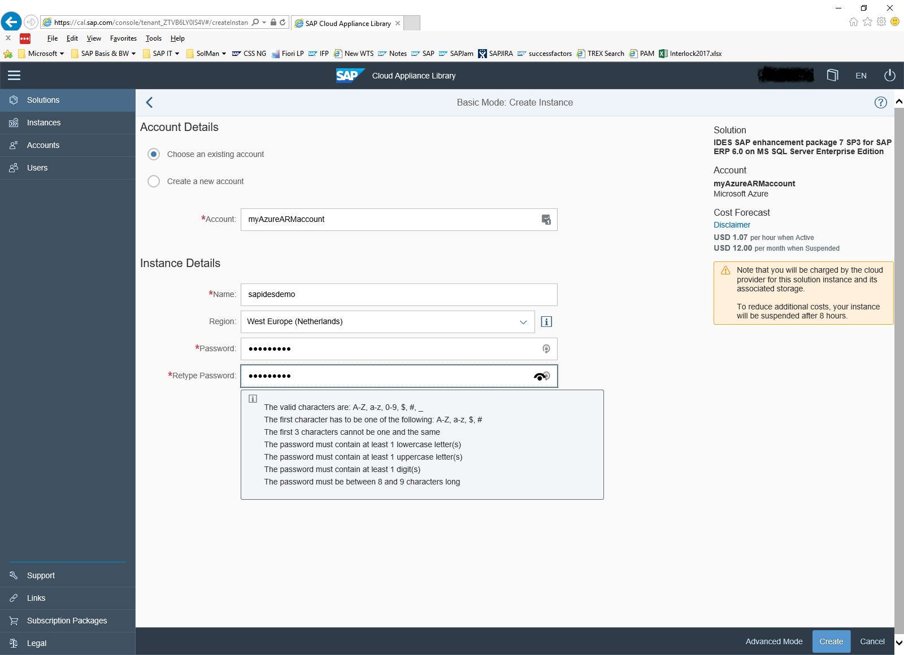
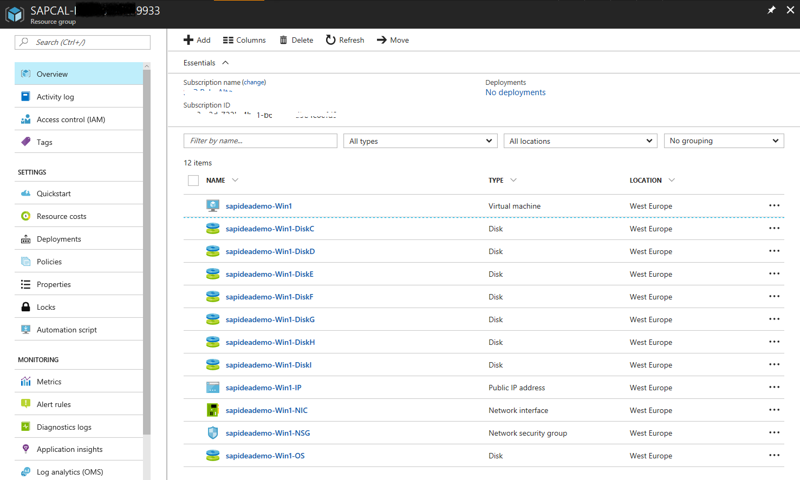
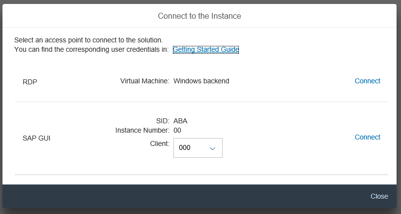

# Deploy SAP IDES EHP7 SP3 for SAP ERP 6.0 on Azure
This article describes how to deploy an SAP IDES system running with SQL Server and the Windows operating system on Azure via the SAP Cloud Appliance Library (SAP CAL) 3.0. The screenshots show the step-by-step process. To deploy a different solution, follow the same steps.

To start with the SAP CAL, go to the [SAP Cloud Appliance Library](https://cal.sap.com/) website. SAP also has a blog about the new [SAP Cloud Appliance Library 3.0](https://scn.sap.com/community/cloud-appliance-library/blog/2016/05/27/sap-cloud-appliance-library-30-came-with-a-new-user-experience). 

> [!NOTE]
> As of May 29, 2017, you can use the Azure Resource Manager deployment model in addition to the less-preferred classic deployment model to deploy the SAP CAL. We recommend that you use the new Resource Manager deployment model and disregard the classic deployment model.

If you already created an SAP CAL account that uses the classic model, *you need to create another SAP CAL account*. This account needs to exclusively deploy into Azure by using the Resource Manager model.

After you sign in to the SAP CAL, the first page usually leads you to the **Solutions** page. The solutions offered on the SAP CAL are steadily increasing, so you might need to scroll quite a bit to find the solution you want. The highlighted Windows-based SAP IDES solution that is available exclusively on Azure demonstrates the deployment process:

### Create an account in the SAP CAL
1. To sign in to the SAP CAL for the first time, use your SAP S-User or other user registered with SAP. Then define an SAP CAL account that is used by the SAP CAL to deploy appliances on Azure. In the account definition, you need to:

    a. Select the deployment model on Azure (Resource Manager or classic).

    b. Enter your Azure subscription. An SAP CAL account can be assigned to one subscription only. If you need more than one subscription, you need to create another SAP CAL account.
    
    c. Give the SAP CAL permission to deploy into your Azure subscription.

   > [!NOTE]
   >  The next steps show how to create an SAP CAL account for Resource Manager deployments. If you already have an SAP CAL account that is linked to the classic deployment model, you *need* to follow these steps to create a new SAP CAL account. The new SAP CAL account needs to deploy in the Resource Manager model.

1. To create a new SAP CAL account, the **Accounts** page shows two choices for Azure: 

    a. **Microsoft Azure (classic)** is the classic deployment model and is no longer preferred.

    b. **Microsoft Azure** is the new Resource Manager deployment model.

    

    To deploy in the Resource Manager model, select **Microsoft Azure**.

    

1. Enter the Azure **Subscription ID** that can be found on the Azure portal. 

    

1. To authorize the SAP CAL to deploy into the Azure subscription you defined, click **Authorize**. The following page appears in the browser tab:

    

1. If more than one user is listed, choose the Microsoft account that is linked to be the coadministrator of the Azure subscription you selected. The following page appears in the browser tab:

    

1. Click **Accept**. If the authorization is successful, the SAP CAL account definition displays again. After a short time, a message confirms that the authorization process was successful.

1. To assign the newly created SAP CAL account to your user, enter your **User ID** in the text box on the right and click **Add**. 

    

1. To associate your account with the user that you use to sign in to the SAP CAL, click **Review**. 

1. To create the association between your user and the newly created SAP CAL account, click **Create**.

    

You successfully created an SAP CAL account that is able to:

- Use the Resource Manager deployment model.
- Deploy SAP systems into your Azure subscription.

> [!NOTE]
> Before you can deploy the SAP IDES solution based on Windows and SQL Server, you might need to sign up for an SAP CAL subscription. Otherwise, the solution might show up as **Locked** on the overview page.

### Deploy a solution
1. After you set up an SAP CAL account, select **The SAP IDES solution on Windows and SQL Server** solution. Click **Create Instance**, and confirm the usage and terms conditions. 

1. On the **Basic Mode: Create Instance** page, you need to:

    a. Enter an instance **Name**.

    b. Select an Azure **Region**. You might need an SAP CAL subscription to get multiple Azure regions offered.

    c.  Enter the master **Password** for the solution, as shown:

    

1. Click **Create**. After some time, depending on the size and complexity of the solution (the SAP CAL provides an estimate), the status is shown as active and ready for use: 

    

1. To find the resource group and all its objects that were created by the SAP CAL, go to the Azure portal. The virtual machine can be found starting with the same instance name that was given in the SAP CAL.

    

1. On the SAP CAL portal, go to the deployed instances and click **Connect**. The following pop-up window appears: 

    

1. Before you can use one of the options to connect to the deployed systems, click **Getting Started Guide**. The documentation names the users for each of the connectivity methods. The passwords for those users are set to the master password you defined at the beginning of the deployment process. In the documentation, other more functional users are listed with their passwords, which you can use to sign in to the deployed system.

    

Within a few hours, a healthy SAP IDES system is deployed in Azure.

If you bought an SAP CAL subscription, SAP fully supports deployments through the SAP CAL on Azure. The support queue is BC-VCM-CAL.

