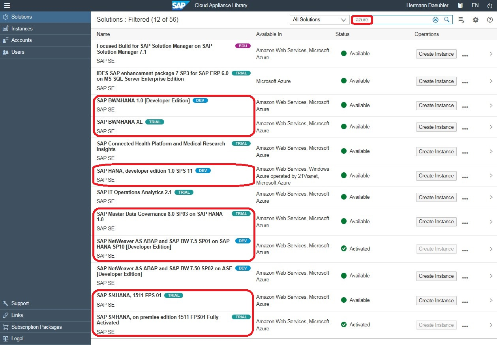
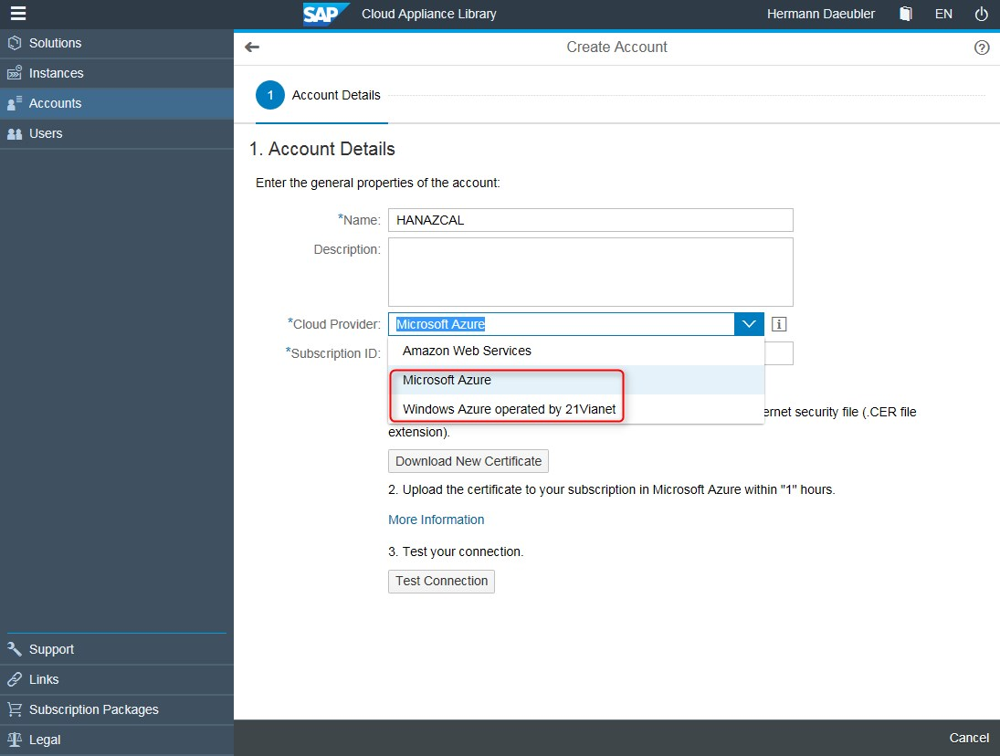
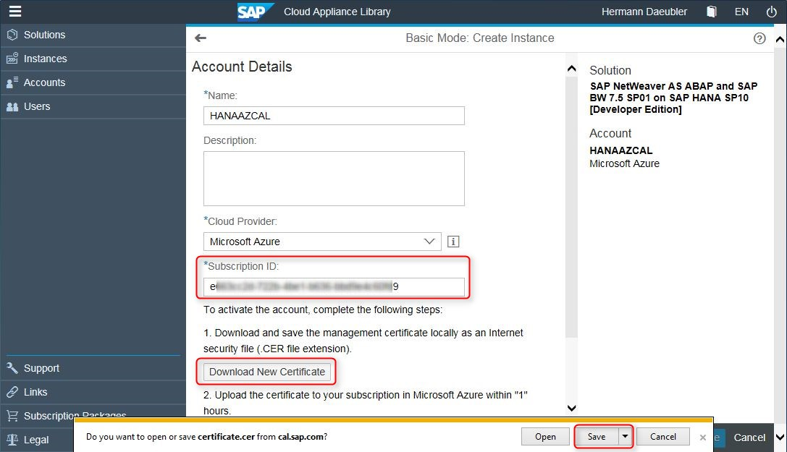
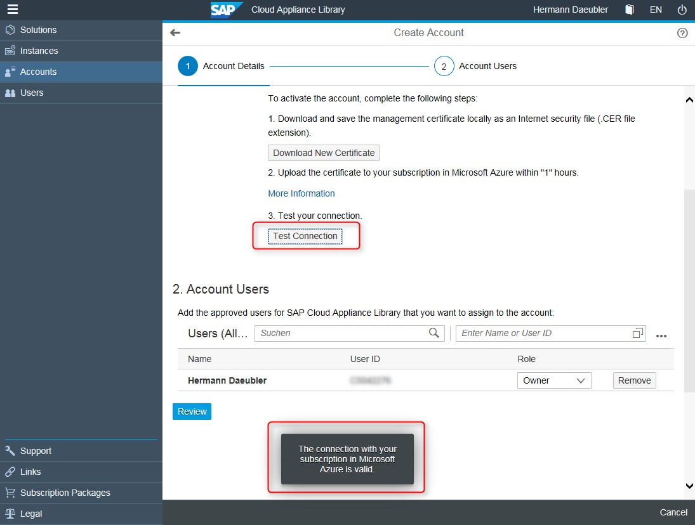
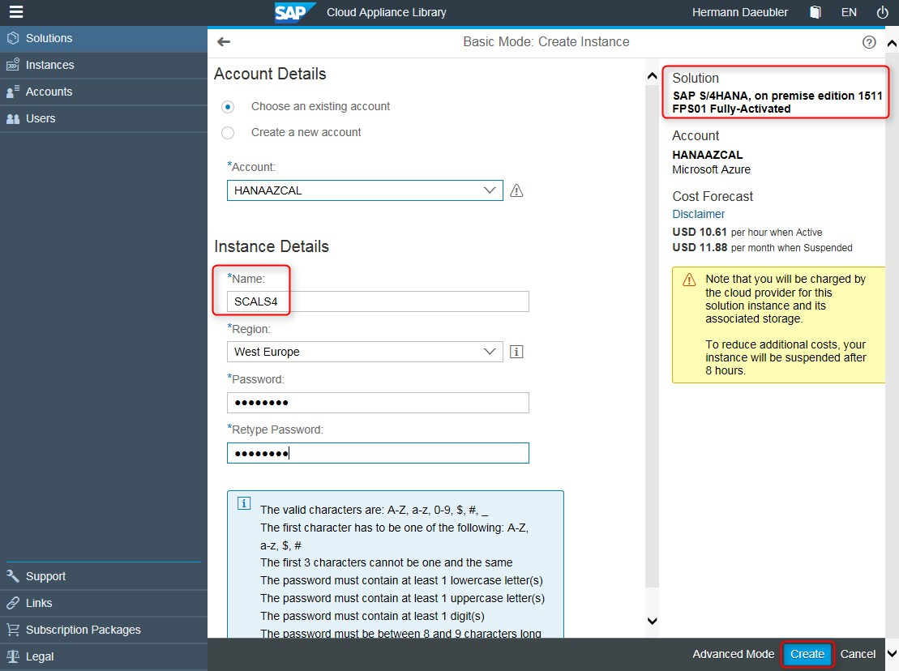
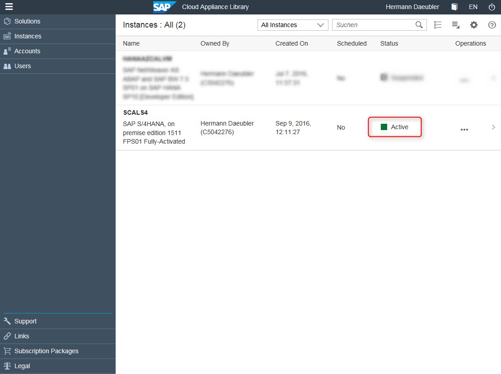
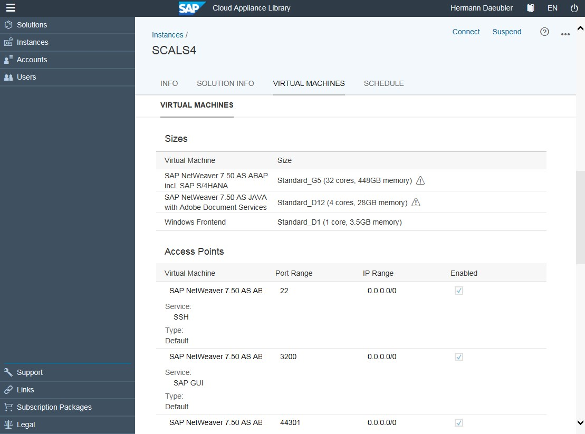
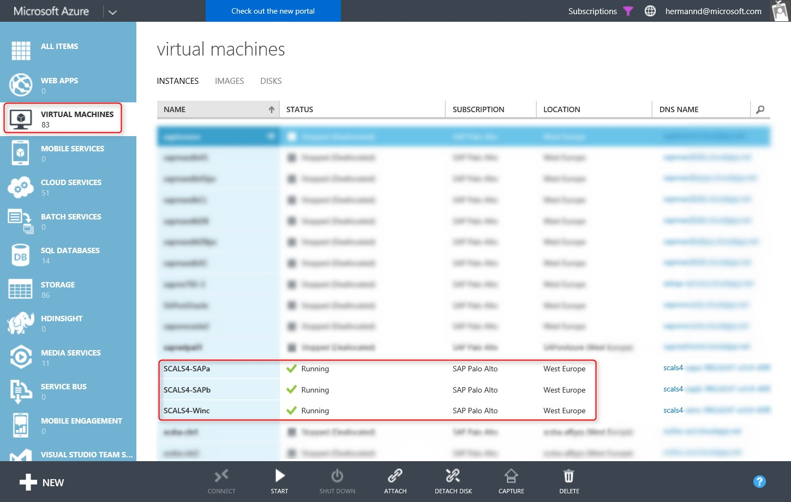
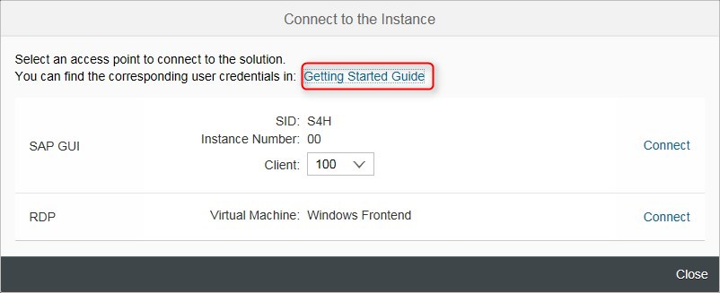
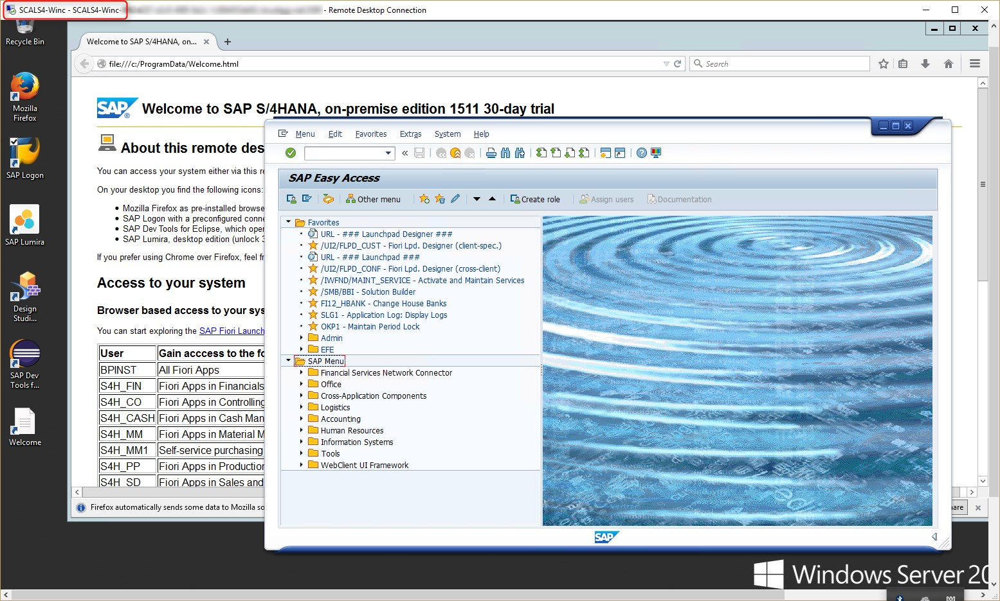

# Deploy SAP S/4HANA or BW/4HANA on Microsoft Azure
This article describes how to deploy S/4HANA on Microsoft Azure by using SAP Cloud Appliance Library (SAP CAL) 3.0. Deploying other SAP HANA-based solutions, like BW/4HANA, works the same way from a process perspective. You just select a different solution.

> [!NOTE]
For more information about the SAP Cloud Appliance Library, see the [home page of their site](https://cal.sap.com/). There is also a blog from SAP about [SAP Cloud Appliance Library 3.0](http://scn.sap.com/community/cloud-appliance-library/blog/2016/05/27/sap-cloud-appliance-library-30-came-with-a-new-user-experience).

## Step-by-step process to deploy the solution

The following screenshots show how to deploy S/4HANA on Azure. The process works the same way for other solutions, like BW/4HANA.

The first screenshot shows all SAP CAL HANA-based solutions available on Azure. Notice **SAP S/4HANA on-premises edition** at the bottom.

First, create a new SAP CAL account. In **Accounts**, you see two choices for Azure: Microsoft Azure, and an Azure option operated by 21Vianet. For this example, choose **Microsoft Azure**.

Then, enter the Azure subscription ID that can be found on the Azure portal. Afterward, download an Azure management certificate.

> [!NOTE]
To find your Azure subscription ID, you should use the Azure classic portal, not the more recent Azure portal. This is because SAP CAL isn't adapted yet for the new model, and still requires the classic portal to work with management certificates.

The following screenshot shows the classic portal. From **SETTINGS**, select the **SUBSCRIPTIONS** tab to find the subscription ID to be entered in the SAP CAL Accounts window.

From **SETTINGS**, switch to the **MANAGEMENT CERTIFICATES** tab. Upload a management certificate to give SAP CAL the permissions
to create virtual machines within a customer subscription. (You are uploading the management certificate that was downloaded before from SAP CAL.)

A dialog box pops up for you to select the downloaded certificate file.

After the certificate is uploaded, the connection between SAP CAL and the Azure subscription can be tested within SAP CAL. A message should pop up that indicates that the connection is valid.

Next, select a solution that should be deployed, and create an instance.
Enter an instance name, choose an Azure region, and define the
master password for the solution.

After some time, depending on the size and complexity of the solution (an estimate is provided by SAP CAL), the solution is shown as active and ready for use.

You can see some details of the solution, such as which kind of VMs were deployed. In this case, three Azure VMs of different sizes and purpose were created.

In the Azure classic portal, these virtual machines can be found starting with the same instance name that was given in SAP CAL.

Now it's possible to connect to the solution by using the connect button in the SAP CAL portal. The dialog box contains a link to a user guide that describes all the default credentials to work with the solution.

Another option is to sign in to the client Windows VM, and start the pre-configured SAP GUI, for example.

