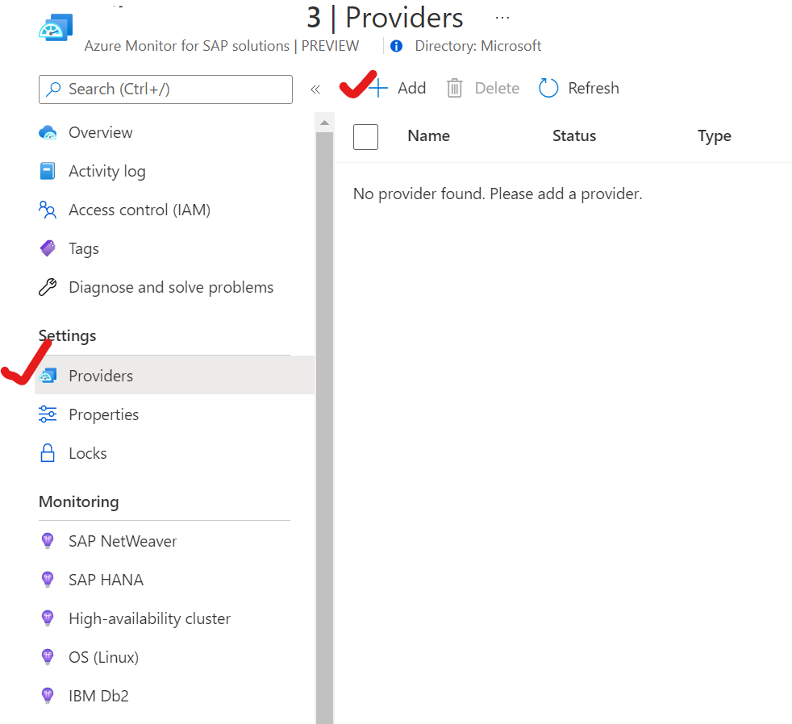
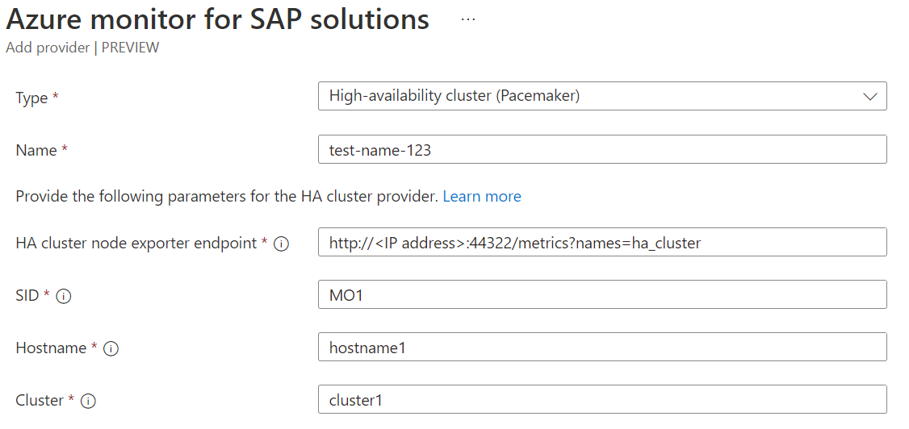

# Create High Availability cluster provider for Azure Monitor for SAP solutions (preview)

[!INCLUDE [Azure Monitor for SAP solutions public preview notice](./includes/preview-azure-monitor.md)]

This article explains how to create a High Availability (HA) Pacemaker cluster provider for Azure Monitor for SAP solutions (AMS). This content applies to both AMS and AMS (classic) versions.

## Install HA agent

Before adding providers for HA (Pacemaker) clusters, install the appropriate agent for your environment in each cluster node.

For SUSE-based clusters, install **ha_cluster_provider** in each node. For more information, see [the HA cluster exporter installation guide](https://github.com/ClusterLabs/ha_cluster_exporter#installation). Supported SUSE versions include SLES for SAP 12 SP3 and above.

For RHEL-based clusters, install **performance co-pilot (PCP)** and the **pcp-pmda-hacluster** sub package in each node.For more information, see the [PCP HACLUSTER agent installation guide](https://access.redhat.com/articles/6139852). Supported RHEL versions include 8.2, 8.4 and above.

For RHEL-based pacemaker clusters, also install [PMProxy](https://access.redhat.com/articles/6139852) in each node.

## Create provider for AMS

1. Sign in to the [Azure portal](https://portal.azure.com).
1. Go to the AMS service. 
1. Open your AMS resource.
1. In the resource's menu, under **Settings**, select **Providers**.
1. Select **Add** to add a new provider.

  

6. For **Type**, select **High-availability cluster (Pacemaker)**.
1. Configure providers for each node of the cluster by entering the endpoint URL for **HA Cluster Exporter Endpoint**. 
    1. For SUSE-based clusters, enter `http://<'IP address'> :9664/metrics`. 
    1. For RHEL-based clusters, enter `http://<'IP address'>:44322/metrics?names=ha_cluster`.
1. Enter the system identifiers, host names, and cluster names. For the system identifier, enter a unique SAP system identifier for each cluster. For the hostname, the value refers to an actual hostname in the VM. Use `hostname -s` for SUSE- and RHEL-based clusters.
1. Select **Add provider** to save.
1. Continue to add more providers as needed.
1. Select **Review + create** to review the settings.
1. Select **Create** to finish creating the resource.

###### For SUSE based cluster

  

###### For RHEL based cluster

  
