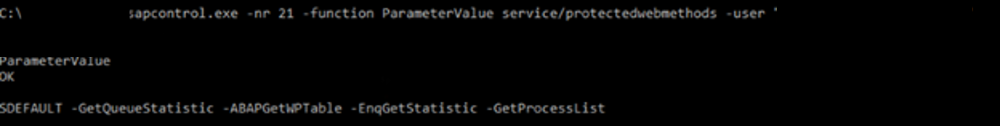

# Configure SAP NetWeaver for Azure Monitor for SAP solutions (preview)

[!INCLUDE [Azure Monitor for SAP solutions public preview notice](./includes/preview-azure-monitor.md)]

This article explains how to configure SAP NetWeaver for use with Azure Monitor for SAP solutions (AMS). You can use SAP NetWeaver with both versions of the service, AMS and AMS (classic).
The SAP start service provides multiple services, including monitoring the SAP system. AMS and AMS (classic) use **SAPControl**, which is a SOAP web service interface that exposes these capabilities. The **SAPControl** interface [differentiates between protected and unprotected web service methods](https://wiki.scn.sap.com/wiki/display/SI/Protected+web+methods+of+sapstartsrv). It's necessary to unprotect some methods to use AMS with NetWeaver.

## Configure NetWeaver for AMS


### Unprotect methods for metrics

To fetch specific metrics, you need to unprotect some methods in each SAP system:

1. Open an SAP GUI connection to the SAP server.

1. Sign in with an administrative account.

1. Execute transaction **RZ10**.

1. Select the appropriate profile (`_DEFAULT.PFL_`).

1. Select **Extended Maintenance**  &gt;  **Change**.

1. Select the profile parameter `service/protectedwebmethods`.

1. Modify the following:

    `service/protectedwebmethods`
    
    `SDEFAULT -GetQueueStatistic -ABAPGetWPTable -EnqGetStatistic -GetProcessList`

1. Select **Copy**.

1. Select **Profile** &gt; **Save** to save the changes.

1. Restart the **SAPStartSRV** service on each instance in the SAP system. Restarting the services doesn't restart the entire system. This process only restarts **SAPStartSRV** (on Windows) or the daemon process (in Unix or Linux).

    1. On Windows systems, use the SAP Microsoft Management Console (MMC) or SAP Management Console (MC) to restart the service. Right-click each instance. Then, choose **All Tasks** &gt; **Restart Service**.
    
    1. On Linux systems, use the following commands to restart the host. Replace `<instance number` with your SAP system's instance number.
    
    `RestartService`
    
    `sapcontrol -nr <instance number> -function RestartService`
    
You must restart the **SAPStartSRV** service on each instance of your SAP system to unprotect the **SAPControl** web methods. The read-only SOAP API is required for the NetWeaver provider to fetch metric data from your SAP system. If you don't unprotect these methods, there will be empty or missing visualizations in the NetWeaver metric workbook.


### Check updated rules

After you restart the SAP service, check that your updated rules are applied to each instance. 

1. Log in to the SAP system as `sidadm`.

1. Run the following command. Replace `<instance number>` with your system's instance number.

    `sapcontrol -nr <instance number>; -function ParameterValue service/protectedwebmethods`

1. Log in as another user.

1. Run the following command. Again, replace `<instance number>` with your system's instance number. Also replace `<admin user>` with your administrator username, and `<admin password>` with the password.

    `sapcontrol -nr <instance number> -function ParameterValue service/protectedwebmethods -user "<admin user>" "<admin password>"`

1. Review the output, which should look like the following sample output:




Repeat these steps for each instance profile.

To validate the rules, run a test query against the web methods. Replace the `<hostname>` with your hostname, `<instance number>` with your SAP instance number, and the method name with the appropriate method.

  ```powershell
  $SAPHostName = "<hostname>"
  
  $InstanceNumber = "<instance number>"
  
  $Function = "ABAPGetWPTable"
  
  [System.Net.ServicePointManager]::ServerCertificateValidationCallback = {$true}
      
  $sapcntrluri = "https://" + $SAPHostName + ":5" + $InstanceNumber + "14/?wsdl"
      
  $sapcntrl = New-WebServiceProxy -uri $sapcntrluri -namespace WebServiceProxy -class sapcntrl
      
  $FunctionObject = New-Object ($sapcntrl.GetType().NameSpace + ".$Function")
      
  $sapcntrl.$Function($FunctionObject)
 ```


### Set up RFC metrics

For AS ABAP applications only, you can set up the NetWeaver RFC metrics.

Create or upload the following role in the SAP NW ABAP system. AMS requires this role to connect to SAP. The role uses least privilege access.

1. Log in to your SAP system.
1. Download and unzip [Z_AMS_NETWEAVER_MONITORING.zip](https://github.com/Azure/Azure-Monitor-for-SAP-solutions-preview/files/8710130/Z_AMS_NETWEAVER_MONITORING.zip).
1. Use the transaction code **PFCG** &gt; **Role Upload**.
1. Upload the **Z_AMS_NETWEAVER_MONITORING.SAP** file from the ZIP file.
1. Select **Execute** to generate the role.
1. Exit the SAP system.

Create and authorize a new RFC user.

1. Log in to the SAP system.
1. Create an RFC user.
1. Assign the role **Z_AMS_NETWEAVER_MONITORING** to the user. This is the role that you uploaded in the previous section.

Enable **SMON** to monitor the system performance.

1. Enable the **SDF/SMON** snapshot service for your system.
1. Configure **SDF/SMON** metrics to be aggregated every minute.
1. Make sure the version of **ST-PI** is **SAPK-74005INSTPI**. 
1. Turn on daily monitoring. For instructions, see [SAP Note 2651881](https://userapps.support.sap.com/sap/support/knowledge/en/2651881).
1. It's recommended to schedule **SDF/SMON** as a background job in your target SAP client each minute. Log in to SAP and use **TCODE /SDF/SMON** to configure the setting.


Enable SAP Internet Communication Framework (ICF):

1. Log in to the SAP system.
1. Go to transaction code **SICF**.
1. Go to the service path `/default_host/sap/bc/soap/`.
1. Activate the services **wsdl**, **wsdl11** and **RFC**.

It's also recommended to check that you enabled the ICF ports.

1. Log in to the SAP service.
1. Right-click the ping service and choose **Test Service**. SAP starts your default browser.
1. Navigate to the ping service using the configured port.
1. If the port can't be reached, or the test fails, open the port in the SAP VM.
    1. For Linux, run the following commands. Replace `<your port>` with your configured port.
    
        `sudo firewall-cmd --permanent --zone=public --add-port=<your port>/TCP `
    
        `sudo firewall-cmd --reload `

    1. For Windows, open Windows Defender Firewall from the Start menu. Select **Advanced settings** in the side menu, then select **Inbound Rules**. To open a port, select **New Rule**. Add your port and set the protocol to TCP.

### Add NetWeaver provider

To add the NetWeaver provider:

1. Sign in to the [Azure portal](https://portal.azure.com).
1. Go to the AMS service page.
1. Select **Create** to open the resource creation page.
1. Enter information for the **Basics** tab.
1. Select the **Providers** tab. Then, select **Add provider**.
1. Configure the new provider:
    1. For **Type**, select **SAP NetWeaver**.
    1. For **System ID (SID)**, enter the three-character SAP system identifier.
    1. For **Application Server**, enter the IP address or the fully qualified domain name (FQDN) of the SAP NetWeaver system to monitor. For example, `sapservername.contoso.com` where `sapservername` is the hostname and  `contoso.com` is the domain. 
1. Save your changes.

If you're using a hostname, make sure there's connectivity from the virtual network that you used to create the AMS resource.

- For **Instance number**, specify the instance number of SAP NetWeaver (00-99)
- For **Host file entries**, provide the DNS mappings for all SAP VMs associated with the SID.

Enter all SAP application servers and ASCS host file entries in **Host file entries**.

 Enter host file mappings in comma-separated format. The expected format for each entry is IP address, FQDN, hostname.
 
 For example: **192.X.X.X sapservername.contoso.com sapservername,192.X.X.X sapservername2.contoso.com sapservername2**

 To determine all SAP hostnames associated with the SID, log in to the SAP system using the `sidadm` user. Then, run the following command:

 `/usr/sap/hostctrl/exe/sapcontrol -nr <instancenumber>  -function GetSystemInstanceList`

Make sure that host file entries are provided for all hostnames that the command returns. 

- For **SAP client ID**, provide the SAP client identifier.
- For **SAP HTTP Port**, enter the port that your ICF is running. For example, 8110.
- For **SAP username**, enter the name of the user that you created to connect to the SAP system.
- For **SAP password**, enter the password for the user.


## Configure NetWeaver for AMS (classic)


To fetch specific metrics, you need to unprotect some methods for the current release. Follow these steps for each SAP system:

1. Open an SAP GUI connection to the SAP server.
2. Sign in by using an administrative account.
3. Execute transaction RZ10.
4. Select the appropriate profile (*DEFAULT.PFL*).
5. Select **Extended Maintenance** > **Change**. 
6. Select the profile parameter "service/protectedwebmethods" and modify to have the following value, then click Copy:  

   ```service/protectedwebmethods instruction
      SDEFAULT -GetQueueStatistic -ABAPGetWPTable -EnqGetStatistic -GetProcessList

7. Go back and select **Profile** > **Save**.
8. After saving the changes for this parameter, restart the SAPStartSRV service on each of the instances in the SAP system. (Restarting the services will not restart the SAP system; it will only restart the SAPStartSRV service (in Windows) or daemon process (in Unix/Linux)).

   8a. On Windows systems, this can be done in a single window using the SAP Microsoft Management Console (MMC) / SAP Management Console(MC).  Right-click on each instance and choose All Tasks -> Restart Service.


  
    


   8b. On Linux systems, use the below command where NN is the SAP instance number to restart the host which is logged into.
   
   ```RestartService
   sapcontrol -nr <NN> -function RestartService
   ```
9. Once the SAP service is restarted, check to ensure the updated web method protection exclusion rules have been applied for each instance by running the following command: 

**Logged as \<sidadm\>** 
   `sapcontrol -nr <NN> -function ParameterValue service/protectedwebmethods`

**Logged as different user** 
   `sapcontrol -nr <NN> -function ParameterValue service/protectedwebmethods -user "<adminUser>" "<adminPassword>"`

   The output should look like :-
  

10. To conclude and validate, run a test query against web methods to validate (replace the hostname , instance number and, method name ) 
    
    Use the below PowerShell script 

    ```Powershell command to test unprotect method 
    $SAPHostName = "<hostname>"
    $InstanceNumber = "<instancenumber>"
    $Function = "ABAPGetWPTable"
    [System.Net.ServicePointManager]::ServerCertificateValidationCallback = {$true}
    $sapcntrluri = "https://" + $SAPHostName + ":5" + $InstanceNumber + "14/?wsdl"
    $sapcntrl = New-WebServiceProxy -uri $sapcntrluri -namespace WebServiceProxy -class sapcntrl
    $FunctionObject = New-Object ($sapcntrl.GetType().NameSpace + ".$Function")
    $sapcntrl.$Function($FunctionObject)
    ```
11. **Repeat Steps 3-10 for each instance profile**.

>[!Important] 
>It is critical that the sapstartsrv service is restarted on each instance of the SAP system for the SAPControl web methods to be unprotected.  These read-only SOAP API are required for the NetWeaver provider to fetch metric data from the SAP System and failure to unprotect these methods will lead to empty or missing visualizations on the NetWeaver metric workbook.
   
>[!Tip]
> Use an access control list (ACL) to filter the access to a server port. For more information, see [this SAP note](https://launchpad.support.sap.com/#/notes/1495075).

To install the NetWeaver provider in the Azure portal:

1. Make sure you've completed the earlier steps and restarted the server.

1. Sign in to the Azure portal. 

1. Go to the **Azure Monitor for SAP solutions** service.

1. Select **Create** to add a new AMS resource.

1. Select **Add provider**.

   1. For **Type**, select **SAP NetWeaver**.

   1. For **Hostname**, enter the host name of the SAP system.

   1. For **Subdomain**, enter a subdomain if applicable.

   1. For **Instance No**, enter the instance number that corresponds to the host name you entered. 

   1. For **SID**, enter the system ID.

1. Select **Add provider** to save your changes. 

1. Continue to add more providers as needed.

1. Select **Review + create** to review the deployment.

1. Select **Create** to finish creating the resource.


If the SAP application servers (VMs) are part of a network domain, such as an Azure Active Directory (Azure AD) managed domain, you must provide the corresponding subdomain. The AMS collector VM exists inside the virtual network, and isn't joined to the domain. AMS can't resolve the hostname of instances inside the SAP system unless the hostname is an FQDN. If you don't provide the subdomain, there will be missing or incomplete visualizations in the NetWeaver workbook.

For example, if the hostname of the SAP system has an FQDN of `myhost.mycompany.contoso.com`:

- The hostname is `myhost`
- The subdomain is `mycompany.contoso.com`

When the NetWeaver provider invokes the **GetSystemInstanceList** API on the SAP system, SAP returns the hostnames of all instances in the system. The collect VM uses this list to make more API calls to fetch metrics for each instances features. For example, ABAP, J2EE, MESSAGESERVER, ENQUE, ENQREP, and more. If you specify the subdomain, the collect VM uses the subdomain to build the FQDN of each instance in the system.

Don't specify an IP address for the hostname if your SAP system is part of network domain.
