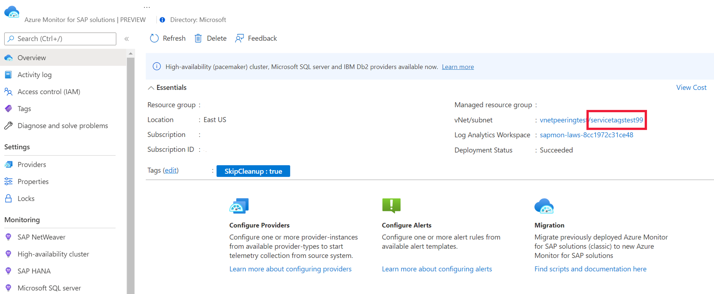

# Set up network for Azure monitor for SAP solutions (preview)

[!INCLUDE [Azure Monitor for SAP solutions public preview notice](./includes/preview-azure-monitor.md)]

Before you can deploy Azure Monitor for SAP solutions (AMS), you need to configure an Azure virtual network with all necessary settings.

## Configure new subnet

> [!IMPORTANT]
> The following steps apply to both *current* and *classic* versions of AMS.

Create a [new subnet with an **IPv4/28** block or larger](../../../azure-functions/functions-networking-options.md#subnets). Then, make sure there's network connectivity between the new subnet and any target systems that you want to monitor. 

You'll use this new subnet to host Azure Functions, which is the telemetry collection engine for AMS. For more information, see how to [integrate your app with an Azure virtual network](../../../app-service/overview-vnet-integration.md).

## Configure outbound internet access

> [!IMPORTANT]
> The following steps only apply to the *current* version of AMS, and not the *classic* version.

In many use cases, you might choose to restrict or block outbound internet access to your SAP network environment. However, AMS requires network connectivity between the [subnet that you configured](#configure-new-subnet) and the systems that you want to monitor. Before you deploy an AMS resource, you need to configure outbound internet access or the deployment will fail.

There are multiple methods to address restricted or blocked outbound internet access. Choose the method that works best for your use case:

- [Use the **Route All** feature in Azure functions](#use-route-all)
- [Use service tags with a network security group (NSG) in your virtual network](#use-service-tags)
- [Use a private endpoint for your subnet](#use-private-endpoint)

### Use Route All

**Route All** is a [standard feature of virtual network integration](../../../azure-functions/functions-networking-options.md#virtual-network-integration) in Azure Functions, which is deployed as part of AMS. Enabling or disabling this setting only impacts traffic from Azure Functions. This setting doesn't impact any other incoming or outgoing traffic within your virtual network. 

You can configure the **Route All** setting when you create an AMS resource through the Azure portal. If your SAP environment doesn't allow outbound internet access, disable **Route All**. If your SAP environment allows outbound internet access, keep the default setting to enable **Route All**.

> [!NOTE]
> You can only use this option before you deploy an AMS resource. It's not possible to change the **Route All** setting after you create the AMS resource.

### Use service tags

If you use NSGs, you can create AMS-related [virtual network service tags](../../../virtual-network/service-tags-overview.md) to allow appropriate traffic flow for your deployment. A service tag represents a group of IP address prefixes from a given Azure service. 

> [!NOTE]
> You can use this option after you've deployed an AMS resource.

1. Find the subnet associated with your AMS managed resource group:
      1. Sign in to the [Azure portal](https://portal.azure.com).
      1. Search for or select the AMS service.
      1. On the **Overview** page for AMS, select your AMS resource.
      1. On the managed resource group's page, select the Azure Functions app.
      1. On the app's page, select the **Networking** tab. Then, select **VNET Integration**. 
      1. Review and note the subnet details. You'll need the subnet's IP address to create rules in the next step. 
1. Select the subnet's name to find the associated NSG. Note the NSG's information.
3. Set new NSG rules for outbound network traffic:   
      1. Go to the NSG resource in the Azure portal.    
      1. On the NSG's menu, under **Settings**, select **Outbound security rules**.
      1. Select the **Add** button to add the following new rules:        

| **Priority** | **Name**                 | **Port** | **Protocol** | **Source** | **Destination**      | **Action** |
|--------------|--------------------------|----------|--------------|------------|----------------------|------------|
| 450          | allow_monitor            | 443      | TCP          |            | AzureMonitor         | Allow      |
| 501          | allow_keyVault           | 443      | TCP          |            | AzureKeyVault        | Allow      |
| 550          | allow_storage            | 443      | TCP          |            | Storage              | Allow      |
| 600          | allow_azure_controlplane | 443      | Any          |            | AzureResourceManager | Allow      |
| 660          | deny_internet            | Any      | Any          | Any        | Internet             | Deny       |

  AMS subnet IP refers to Ip of subnet associated with AMS resource  
  

For the rules that you create, **allow_vnet** must have a lower priority than **deny_internet**. All other rules also need to have a lower priority than **allow_vnet**. However, the remaining order of these other rules is interchangeable.
        
### Use private endpoint
You can enable a private endpoint by creating a new subnet in the same virtual network as the system that you want to monitor. No other resources can use this subnet, so it's not possible to use the same subnet as Azure Functions for your private endpoint.
To create a private endpoint for AMS:

1. [Create a new subnet](../../../virtual-network/virtual-network-manage-subnet.md#add-a-subnet) in the same virtual network as the SAP system that you're monitoring.
1. In the Azure portal, go to your AMS resource.
1. On the **Overview** page for the AMS resource, select the **Managed resource group**.
A private endpoint connection needs to be created for the following resources inside the managed resource group: 
    1. Key-vault, 
    2. Storage-account, and 
    3. Log-analytics workspace

 
###### Key Vault

Only 1 private endpoint is required for all the key vault resources (secrets, certificates, and keys). Once a private endpoint is created for key vault, the vault resources cannot be accessed from systems outside the given vnet. 

1. On the key vault resource's menu, under **Settings**, select **Networking**. 
1. Select the **Private endpoint connections** tab.
1. Select **Create** to open the endpoint creation page.
1. On the **Basics** tab, enter or select all required information.
1. On the **Resource** tab, enter or select all required information. For the key vault resource, there's only one sub-resource available, the vault.
1. On the **Virtual Network** tab, select the virtual network and the subnet that you created specifically for the endpoint. It's not possible to use the same subnet as the Azure Functions app.
1. On the **DNS** tab, for **Integrate with private DNS zone**, select **Yes**. If necessary, add tags.
1. Select **Review + create** to create the private endpoint.
1. On the **Networking** page again, select the **Firewalls and virtual networks** tab.
    1. For **Allow access from**, select **Allow public access from all networks**.
    1. Select **Apply** to save the changes.
 
### Create storage endpoint

It's necessary to create a separate private endpoint for each Azure Storage account resource, including the queue, table, storage blob, and file. If you create a private endpoint for the storage queue, it's not possible to access the resource from systems outside of the virtual networking, including the Azure portal. However, other resources in the same storage account are accessible.

Repeat the following process for each type of storage sub-resource (table, queue, blob, and file):

1. On the storage account's menu, under **Settings**, select **Networking**. 
1. Select the **Private endpoint connections** tab.
1. Select **Create** to open the endpoint creation page.
1. On the **Basics** tab, enter or select all required information.
1. On the **Resource** tab, enter or select all required information. For the **Target sub-resource**, select one of the sub-resource types (table, queue, blob, or file). 
1. On the **Virtual Network** tab, select the virtual network and the subnet that you created specifically for the endpoint. It's not possible to use the same subnet as the Azure Functions app.
1. On the **DNS** tab, for **Integrate with private DNS zone**, select **Yes**. If necessary, add tags.
1. Select **Review + create** to create the private endpoint.
1. On the **Networking** page again, select the **Firewalls and virtual networks** tab.
    1. For **Allow access from**, select **Allow public access from all networks**.
    1. Select **Apply** to save the changes.

### Create log analytics endpoint

It's not possible to create a private endpoint directly for a Log Analytics workspace. To enable a private endpoint for this resource, you can connect the resource to an [Azure Monitor Private Link Scope (AMPLS)](../../../azure-monitor/logs/private-link-security.md). Then, you can create a private endpoint for the AMPLS resource.

If possible, create the private endpoint before you allow any system to access the Log Analytics workspace through a public endpoint. Otherwise, you'll need to restart the Function App before you can access the Log Analytics workspace through the private endpoint.

1. Go to the Log Analytics workspace in the Azure portal.
1. In the resource menu, under **Settings**, select **Network isolation**.
1. Select **Add** to create a new AMPLS setting.
1. Select the appropriate scope for the endpoint. Then, select **Apply**.
To enable private endpoint for Azure Monitor Private Link Scope, go to Private Endpoint connections tab under configure. 

1. Select the **Private endpoint connections** tab.
1. Select **Create** to open the endpoint creation page.
1. On the **Basics** tab, enter or select all required information.
1. On the **Resource** tab, enter or select all required information.
1. On the **Virtual Network** tab, select the virtual network and the subnet that you created specifically for the endpoint. It's not possible to use the same subnet as the Azure Functions app.
1. On the **DNS** tab, for **Integrate with private DNS zone**, select **Yes**. If necessary, add tags.
1. Select **Review + create** to create the private endpoint.
1. Go to the Log Analytics workspace in the Azure portal.
1. In the resource's menu, under **Settings**, select **Network Isolation**.
1. Under **Virtual networks access configuration**:
    1. Set **Accept data ingestion from public networks not connected through a Private Link Scope** to **No**. This setting disables data ingestion from any system outside the virtual network.
    1. Set **Accept queries from public networks not connected through a Private Link Scope** to **Yes**. This setting allows workbooks to display data.
1. Select **Save**.

If you enable a private endpoint after any system accessed the Log Analytics workspace through a public endpoint, restart the Function App before moving forward. Otherwise, you can't access the Log Analytics workspace through the private endpoint.

1. Go to the AMS resource in the Azure portal.
1. On the **Overview** page, select the name of the **Managed resource group**.
1. On the managed resource group's page, select the **Function App**.
1. On the Function App's **Overview** page, select **Restart**.

Next, find and note important IP address ranges.

1. Find the AMS resource's IP address range.
    1. Go to the AMS resource in the Azure portal.
    1. On the resource's **Overview** page, select the **vNet/subnet** to go to the virtual network.
    1. Note the IPv4 address range, which belongs to the source system.
1. Find the IP address range for the key vault and storage account.
    1. Go to the resource group that contains the AMS resource in the Azure portal.
    1. On the **Overview** page, note the **Private endpoint** in the resource group.
    1. In the resource group's menu, under **Settings**, select **DNS configuration**.
    1. On the **DNS configuration** page, note the **IP addresses** for the private endpoint.    

    1. For Log analytics private endpoint: Go to the private endpoint created for Azure Monitor Private Link Scope resource.         
    
        

1. On the private endpoint's menu, under **Settings**, select **DNS configuration**.
1. On the **DNS configuration** page, note the associated IP addresses.
1. Go to the AMS resource in the Azure portal.
1. On the **Overview** page, select the **vNet/subnet** to go to that resource.
1. On the virtual network page, select the subnet that you used to create the AMS resource.

1. Go to the NSG resource in the Azure portal.
1. In the NSG menu, under **Settings**, select **Outbound security rules**.
The below image contains the required security rules for AMS resource to work. 

| Priority | Description |
| -------- | ------------- |
| 550 | Allow the source IP for making calls to source system to be monitored. |
| 600 | Allow the source IP for making calls AzureResourceManager service tag. |
| 650 | Allow the source IP to access key-vault resource using private endpoint IP. |
| 700 | Allow the source IP to access storage-account resources using private endpoint IP. (Include IPs for each of storage account sub resources: table, queue, file, and blob)  |
| 800 | Allow the source IP to access log-analytics workspace resource using private endpoint IP.  |
