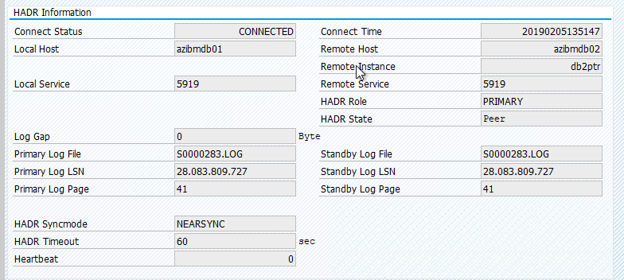

[1928533]:https://launchpad.support.sap.com/#/notes/1928533
[2015553]:https://launchpad.support.sap.com/#/notes/2015553
[2178632]:https://launchpad.support.sap.com/#/notes/2178632
[2191498]:https://launchpad.support.sap.com/#/notes/2191498
[2243692]:https://launchpad.support.sap.com/#/notes/2243692
[1984787]:https://launchpad.support.sap.com/#/notes/1984787
[1999351]:https://launchpad.support.sap.com/#/notes/1999351
[2233094]:https://launchpad.support.sap.com/#/notes/2233094
[1612105]:https://launchpad.support.sap.com/#/notes/1612105

[sles-for-sap-bp]:https://www.suse.com/documentation/sles-for-sap-12/
[db2-hadr-11.1]:https://www.ibm.com/support/knowledgecenter/en/SSEPGG_11.1.0/com.ibm.db2.luw.admin.ha.doc/doc/c0011267.html
[db2-hadr-10.5]:https://www.ibm.com/support/knowledgecenter/en/SSEPGG_10.5.0/com.ibm.db2.luw.admin.ha.doc/doc/c0011267.html
[dbms-db2]:https://docs.microsoft.com/azure/virtual-machines/workloads/sap/dbms_guide_ibm
[sles-pacemaker]:https://docs.microsoft.com/azure/virtual-machines/workloads/sap/high-availability-guide-suse-pacemaker
[sap-instfind]:https://help.sap.com/viewer/9e41ead9f54e44c1ae1a1094b0f80712/ALL/en-US/576f5c1808de4d1abecbd6e503c9ba42.html
[nfs-ha]:https://docs.microsoft.com/azure/virtual-machines/workloads/sap/high-availability-guide-suse-nfs
[sles-ha-guide]:https://www.suse.com/releasenotes/x86_64/SLE-HA/12-SP3/
[ascs-ha]:https://docs.microsoft.com/azure/virtual-machines/workloads/sap/high-availability-guide-suse

[dbms-guide]:dbms-guide.md
[deployment-guide]:deployment-guide.md
[planning-guide]:planning-guide.md
[azr-sap-plancheck]:https://docs.microsoft.com/azure/virtual-machines/workloads/sap/sap-deployment-checklist

# High availability of IBM Db2 LUW on Azure VMs on SUSE Linux Enterprise Server with Pacemaker

IBM Db2 for Linux, UNIX, and Windows (LUW) in [high availability and disaster recovery (HADR) configuration](https://www.ibm.com/support/knowledgecenter/en/SSEPGG_10.5.0/com.ibm.db2.luw.admin.ha.doc/doc/c0011267.html) consists of one node that runs a primary database instance and at least one node that runs a secondary database instance. Changes to the primary database instance are replicated to a secondary database instance synchronously or asynchronously, depending on your configuration. 

This article describes how to deploy and configure the Azure virtual machines (VMs), install the cluster framework, and install the IBM Db2 LUW with HADR configuration. 

The article doesn't cover how to install and configure IBM Db2 LUW with HADR or SAP software installation. To help you accomplish these tasks, we provide references to SAP and IBM installation manuals. This article focuses on parts that are specific to the Azure environment. 

The supported IBM Db2 versions are 10.5 and later, as documented in SAP note [1928533].

Before you begin an installation, see the following SAP notes and documentation:

| SAP note | Description |
| --- | --- |
| [1928533] | SAP applications on Azure: Supported products and Azure VM types |
| [2015553] | SAP on Azure: Support prerequisites |
| [2178632] | Key monitoring metrics for SAP on Azure |
| [2191498] | SAP on Linux with Azure: Enhanced monitoring |
| [2243692] | Linux on Azure (IaaS) VM: SAP license issues |
| [1984787] | SUSE LINUX Enterprise Server 12: Installation notes |
| [1999351] | Troubleshooting enhanced Azure monitoring for SAP |
| [2233094] | DB6: SAP applications on Azure that use IBM Db2 for Linux, UNIX, and Windows - additional information |
| [1612105] | DB6: FAQ on Db2 with HADR |

| Documentation | 
| --- |
| [SAP Community Wiki](https://wiki.scn.sap.com/wiki/display/HOME/SAPonLinuxNotes): Has all of the required SAP Notes for Linux |
| [Azure Virtual Machines planning and implementation for SAP on Linux][planning-guide] guide |
| [Azure Virtual Machines deployment for SAP on Linux][deployment-guide] (this article) |
| [Azure Virtual Machines database management system(DBMS) deployment for SAP on Linux][dbms-guide] guide |
| [SAP workload on Azure planning and deployment checklist][azr-sap-plancheck] |
| [SUSE Linux Enterprise Server for SAP Applications 12 SP3 best practices guides][sles-for-sap-bp] |
| [SUSE Linux Enterprise High Availability Extension 12 SP3][sles-ha-guide] |
| [IBM Db2 Azure Virtual Machines DBMS deployment for SAP workload][dbms-db2] |
| [IBM Db2 HADR 11.1][db2-hadr-11.1] |
| [IBM Db2 HADR R 10.5][db2-hadr-10.5] |

## Overview
To achieve high availability, IBM Db2 LUW with HADR is installed on at least two Azure virtual machines, which are deployed in an [Azure availability set](https://docs.microsoft.com/azure/virtual-machines/windows/tutorial-availability-sets) or across [Azure Availability Zones](https://docs.microsoft.com/azure/virtual-machines/workloads/sap/sap-ha-availability-zones). 

The following graphics display a setup of two database server Azure VMs. Both database server Azure VMs have their own storage attached and are up and running. In HADR, one database instance in one of the Azure VMs has the role of the primary instance. All clients are connected to this primary instance. All changes in database transactions are persisted locally in the Db2 transaction log. As the transaction log records are persisted locally, the records are transferred via TCP/IP to the database instance on the second database server, the standby server, or standby instance. The standby instance updates the local database by rolling forward the transferred transaction log records. In this way, the standby server is kept in sync with the primary server.

HADR is only a replication functionality. It has no failure detection and no automatic takeover or failover facilities. A takeover or transfer to the standby server must be initiated manually by a database administrator. To achieve an automatic takeover and failure detection, you can use the Linux Pacemaker clustering feature. Pacemaker monitors the two database server instances. When the primary database server instance crashes, Pacemaker initiates an *automatic* HADR takeover by the standby server. Pacemaker also ensures that the virtual IP address is assigned to the new primary server.

To have SAP application servers connect to primary database, you need a virtual host name and a virtual IP address. In the event of a failover, the SAP application servers will connect to new primary database instance. In an Azure environment, an [Azure load balancer](https://microsoft.sharepoint.com/teams/WAG/AzureNetworking/Wiki/Load%20Balancing.aspx) is required to use a virtual IP address in the way that's required for HADR of IBM Db2. 

To help you fully understand how IBM Db2 LUW with HADR and Pacemaker fits into a highly available SAP system setup, the following image presents an overview of a highly available setup of an SAP system based on IBM Db2 database. This article covers only IBM Db2, but it provides references to other articles about how to set up other components of an SAP system.

### High-level overview of the required steps
To deploy an IBM Db2 configuration, you need to follow these steps:

  + Plan your environment.
  + Deploy the VMs.
  + Update SUSE Linux and configure file systems.
  + Install and configure Pacemaker.
  + Install [highly available NFS][nfs-ha].
  + Install [ASCS/ERS on a separate cluster][ascs-ha].
  + Install IBM Db2 database with Distributed/High Availability option (SWPM).
  + Install and create a secondary database node and instance, and configure HADR.
  + Confirm that HADR is working.
  + Apply the Pacemaker configuration to control IBM Db2.
  + Configure Azure Load Balancer.
  + Install primary and dialog application servers.
  + Check and adapt the configuration of SAP application servers.
  + Perform failover and takeover tests.

## Plan Azure infrastructure for hosting IBM Db2 LUW with HADR

Complete the planning process before you execute the deployment. Planning builds the foundation for deploying a configuration of Db2 with HADR in Azure. Key elements that need to be part of planning for IMB Db2 LUW (database part of SAP environment) are listed in the following table:

| Topic | Short description |
| --- | --- |
| Define Azure resource groups | Resource groups where you deploy VM, VNet, Azure Load Balancer, and other resources. Can be existing or new. |
| Virtual network / Subnet definition | Where VMs for IBM Db2 and Azure Load Balancer are being deployed. Can be existing or newly created. |
| Virtual machines hosting IBM Db2 LUW | VM size, storage, networking, IP address. |
| Virtual host name and virtual IP for IBM Db2 database| The virtual IP or host name that's used for connection of SAP application servers. **db-virt-hostname**, **db-virt-ip**. |
| Azure fencing | Azure fencing or SBD fencing (highly recommended). Method to avoid split brain situations is prevented. |
| SBD VM | SBD virtual machine size, storage, network. |
| Azure Load Balancer | Usage of Basic or Standard (recommended), probe port for Db2 database (our recommendation 62500) **probe-port**. |
| Name resolution| How name resolution works in the environment. DNS service is highly recommended. Local hosts file can be used. |
	
For more information about Linux Pacemaker in Azure, see [Set up Pacemaker on SUSE Linux Enterprise Server in Azure](https://docs.microsoft.com/azure/virtual-machines/workloads/sap/high-availability-guide-suse-pacemaker).

## Deployment on SUSE Linux

The resource agent for IBM Db2 LUW is included in SUSE Linux Enterprise Server for SAP Applications. For the setup that's described in this document, you must use SUSE Linux Server for SAP Applications. The Azure Marketplace contains an image for SUSE Enterprise Server for SAP Applications 12 that you can use to deploy new Azure virtual machines. Be aware of the various support or service models that are offered by SUSE through the Azure Marketplace when you choose a VM image in the Azure VM Marketplace. 

### Hosts: DNS updates
Make a list of all host names, including virtual host names, and update your DNS servers to enable proper IP address to host-name resolution. If a DNS server doesn't exist or you can't update and create DNS entries, you need to use the local host files of the individual VMs that are participating in this scenario. If you're using host files entries, make sure that the entries are applied to all VMs in the SAP system environment. However, we recommend that you use your DNS that, ideally, extends into Azure

### Manual deployment

Make sure that the selected OS is supported by IBM/SAP for IBM Db2 LUW. The list of supported OS versions for Azure VMs and Db2 releases is available in SAP note [1928533]. The list of OS releases by individual Db2 release is available in the SAP Product Availability Matrix. We highly recommend a minimum of SLES 12 SP3 because of Azure-related performance improvements in this or later SUSE Linux versions.

1. Create or select a resource group.
1. Create or select a virtual network and subnet.
1. Create an Azure availability set or deploy an availability zone.
    + For the availability set, set the maximum update domains to 2.
1. Create Virtual Machine 1.
    + Use SLES for SAP image in the Azure Marketplace.
    + Select the Azure availability set you created in step 3, or select Availability Zone.
1.  Create Virtual Machine 2.
    + Use SLES for SAP image in the Azure Marketplace.
    + Select the Azure availability set you in created in step 3, or select Availability Zone (not the same zone as in step 3).
1. Add data disks to the VMs, and then check the recommendation of a file system setup in the article [IBM Db2 Azure Virtual Machines DBMS deployment for SAP workload][dbms-db2].

## Create the Pacemaker cluster
	
To create a basic Pacemaker cluster for this IBM Db2 server, see [Set up Pacemaker on SUSE Linux Enterprise Server in Azure][sles-pacemaker]. 

## Install the IBM Db2 LUW and SAP environment

Before you start the installation of an SAP environment based on IBM Db2 LUW, review the following documentation:

+ Azure documentation
+ SAP documentation
+ IBM documentation

Links to this documentation are provided in the introductory section of this article.

Check the SAP installation manuals about installing NetWeaver-based applications on IBM Db2 LUW.

You can find the guides on the SAP Help portal by using the [SAP Installation Guide Finder][sap-instfind].

You can reduce the number of guides displayed in the portal by setting the following filters:

- I want to: "Install a new system"
- My Database: "IBM Db2 for Linux, Unix, and Windows"
- Additional filters for SAP NetWeaver versions, stack configuration, or operating system

### Installation hints for setting up IBM Db2 LUW with HADR

To set up the primary IBM Db2 LUW database instance:

- Use the high availability or distributed option.
- Install the SAP ASCS/ERS and Database instance.
- Take a backup of the newly installed database.

> [!IMPORTANT] 
> Write down the "Database Communication port" that's set during installation. It must be the same port number for both database instances

To set up the Standby database server by using the SAP homogeneous system copy procedure, execute these steps:

1. Select the **System copy** option > **Target systems** > **Distributed** > **Database instance**.
1. As a copy method, select **Homogeneous System** so that you can use backup to restore a backup on the standby server instance.
1. When you reach the exit step to restore the database for homogeneous system copy, exit the installer. Restore the database from a backup of the primary host. All subsequent installation phases have already been executed on the primary database server.
1. Set up HADR for IBM Db2.

   > [!NOTE]
   > For installation and configuration that's specific to Azure and Pacemaker: During the installation procedure through SAP Software Provisioning Manager, there is an explicit question about high availability for IBM Db2 LUW:
   >+ Do not select **IBM Db2 pureScale**.
   >+ Do not select **Install IBM Tivoli System Automation for Multiplatforms**.
   >+ Do not select **Generate cluster configuration files**.

   When you use an SBD device for Linux Pacemaker, set the following Db2 HADR parameters:
   + HADR peer window duration (seconds) (HADR_PEER_WINDOW) = 300  
   + HADR timeout value (HADR_TIMEOUT) = 60

   When you use an Azure Pacemaker fencing agent, set the following parameters:
   + HADR peer window duration (seconds) (HADR_PEER_WINDOW) = 900  
   + HADR timeout value (HADR_TIMEOUT) = 60

We recommend the preceding parameters based on initial failover/takeover testing. It is mandatory that you test for proper functionality of failover and takeover with these parameter settings. Because individual configurations can vary, the parameters might require adjustment. 

> [!IMPORTANT]
> Specific to IBM Db2 with HADR configuration with normal startup: The secondary or standby database instance must be up and running before you can start the primary database instance.

For demonstration purposes and the procedures described in this article, the database SID is **PTR**.

#### IBM Db2 HADR check
After you've configured HADR and the status is PEER and CONNECTED on the primary and standby nodes, perform the following check:

<pre><code>
Execute command as db2&lt;sid&gt; db2pd -hadr -db &lt;SID&gt;

#Primary output:
# Database Member 0 -- Database PTR -- Active -- Up 1 days 01:51:38 -- Date 2019-02-06-15.35.28.505451
# 
#                             <b>HADR_ROLE = PRIMARY
#                           REPLAY_TYPE = PHYSICAL
#                         HADR_SYNCMODE = NEARSYNC
#                            STANDBY_ID = 1
#                         LOG_STREAM_ID = 0
#                            HADR_STATE = PEER
#                            HADR_FLAGS = TCP_PROTOCOL
#                   PRIMARY_MEMBER_HOST = azibmdb02
#                      PRIMARY_INSTANCE = db2ptr
#                        PRIMARY_MEMBER = 0
#                   STANDBY_MEMBER_HOST = azibmdb01
#                      STANDBY_INSTANCE = db2ptr
#                        STANDBY_MEMBER = 0
#                   HADR_CONNECT_STATUS = CONNECTED</b>
#              HADR_CONNECT_STATUS_TIME = 02/05/2019 13:51:47.170561 (1549374707)
#           HEARTBEAT_INTERVAL(seconds) = 15
#                      HEARTBEAT_MISSED = 0
#                    HEARTBEAT_EXPECTED = 6137
#                 HADR_TIMEOUT(seconds) = 60
#         TIME_SINCE_LAST_RECV(seconds) = 13
#              PEER_WAIT_LIMIT(seconds) = 0
#            LOG_HADR_WAIT_CUR(seconds) = 0.000
#     LOG_HADR_WAIT_RECENT_AVG(seconds) = 0.000025
#    LOG_HADR_WAIT_ACCUMULATED(seconds) = 434.595
#                   LOG_HADR_WAIT_COUNT = 223713
# SOCK_SEND_BUF_REQUESTED,ACTUAL(bytes) = 0, 46080
# SOCK_RECV_BUF_REQUESTED,ACTUAL(bytes) = 0, 374400
#             PRIMARY_LOG_FILE,PAGE,POS = S0000280.LOG, 15571, 27902548040
#             STANDBY_LOG_FILE,PAGE,POS = S0000280.LOG, 15571, 27902548040
#                   HADR_LOG_GAP(bytes) = 0
#      STANDBY_REPLAY_LOG_FILE,PAGE,POS = S0000280.LOG, 15571, 27902548040
#        STANDBY_RECV_REPLAY_GAP(bytes) = 0
#                      PRIMARY_LOG_TIME = 02/06/2019 15:34:39.000000 (1549467279)
#                      STANDBY_LOG_TIME = 02/06/2019 15:34:39.000000 (1549467279)
#               STANDBY_REPLAY_LOG_TIME = 02/06/2019 15:34:39.000000 (1549467279)
#          STANDBY_RECV_BUF_SIZE(pages) = 2048
#              STANDBY_RECV_BUF_PERCENT = 0
#            STANDBY_SPOOL_LIMIT(pages) = 0
#                 STANDBY_SPOOL_PERCENT = NULL
#                    STANDBY_ERROR_TIME = NULL
#                  PEER_WINDOW(seconds) = 300
#                       PEER_WINDOW_END = 02/06/2019 15:40:25.000000 (1549467625)
#              READS_ON_STANDBY_ENABLED = N

#Secondary output:
# Database Member 0 -- Database PTR -- Standby -- Up 1 days 01:46:43 -- Date 2019-02-06-15.38.25.644168
# 
#                             <b>HADR_ROLE = STANDBY
#                           REPLAY_TYPE = PHYSICAL
#                         HADR_SYNCMODE = NEARSYNC
#                            STANDBY_ID = 0
#                         LOG_STREAM_ID = 0
#                            HADR_STATE = PEER
#                            HADR_FLAGS = TCP_PROTOCOL
#                   PRIMARY_MEMBER_HOST = azibmdb02
#                      PRIMARY_INSTANCE = db2ptr
#                        PRIMARY_MEMBER = 0
#                   STANDBY_MEMBER_HOST = azibmdb01
#                      STANDBY_INSTANCE = db2ptr
#                        STANDBY_MEMBER = 0
#                   HADR_CONNECT_STATUS = CONNECTED</b>
#              HADR_CONNECT_STATUS_TIME = 02/05/2019 13:51:47.205067 (1549374707)
#           HEARTBEAT_INTERVAL(seconds) = 15
#                      HEARTBEAT_MISSED = 0
#                    HEARTBEAT_EXPECTED = 6186
#                 HADR_TIMEOUT(seconds) = 60
#         TIME_SINCE_LAST_RECV(seconds) = 5
#              PEER_WAIT_LIMIT(seconds) = 0
#            LOG_HADR_WAIT_CUR(seconds) = 0.000
#     LOG_HADR_WAIT_RECENT_AVG(seconds) = 0.000023
#    LOG_HADR_WAIT_ACCUMULATED(seconds) = 434.595
#                   LOG_HADR_WAIT_COUNT = 223725
# SOCK_SEND_BUF_REQUESTED,ACTUAL(bytes) = 0, 46080
# SOCK_RECV_BUF_REQUESTED,ACTUAL(bytes) = 0, 372480
#             PRIMARY_LOG_FILE,PAGE,POS = S0000280.LOG, 15574, 27902562173
#             STANDBY_LOG_FILE,PAGE,POS = S0000280.LOG, 15574, 27902562173
#                   HADR_LOG_GAP(bytes) = 0
#      STANDBY_REPLAY_LOG_FILE,PAGE,POS = S0000280.LOG, 15574, 27902562173
#        STANDBY_RECV_REPLAY_GAP(bytes) = 155
#                      PRIMARY_LOG_TIME = 02/06/2019 15:37:34.000000 (1549467454)
#                      STANDBY_LOG_TIME = 02/06/2019 15:37:34.000000 (1549467454)
#               STANDBY_REPLAY_LOG_TIME = 02/06/2019 15:37:34.000000 (1549467454)
#          STANDBY_RECV_BUF_SIZE(pages) = 2048
#              STANDBY_RECV_BUF_PERCENT = 0
#            STANDBY_SPOOL_LIMIT(pages) = 0
#                 STANDBY_SPOOL_PERCENT = NULL
#                    STANDBY_ERROR_TIME = NULL
#                  PEER_WINDOW(seconds) = 300
#                       PEER_WINDOW_END = 02/06/2019 15:43:19.000000 (1549467799)
#              READS_ON_STANDBY_ENABLED = N
</code></pre>

## Db2 Pacemaker configuration

When you use Pacemaker for automatic failover in the event of a node failure, you need to configure your Db2 instances and Pacemaker accordingly. This section describes this type of configuration.

The following items are prefixed with either:

- **[A]**: Applicable to all nodes
- **[1]**: Applicable only to node 1 
- **[2]**: Applicable only to node 2

**[A]** Prerequisites for Pacemaker configuration:
1. Shut down both database servers with user db2\<sid> with db2stop.
1. Change the shell environment for db2\<sid> user to */bin/ksh*. We recommend that you use the Yast tool. 

### Pacemaker configuration

**[1]** IBM Db2 HADR-specific Pacemaker configuration:
<pre><code># Put Pacemaker into maintenance mode
sudo crm configure property maintenance-mode=true
</code></pre>

**[1]** Create IBM Db2 resources:
<pre><code># Replace **bold strings** with your instance name db2sid, database SID, and virtual IP address/Azure Load Balancer.

sudo crm configure primitive rsc_Db2_db2ptr_<b>PTR</b> db2 \
        params instance="<b>db2ptr</b>" dblist="<b>PTR</b>" \
        op start interval="0" timeout="130" \
        op stop interval="0" timeout="120" \
        op promote interval="0" timeout="120" \
        op demote interval="0" timeout="120" \
        op monitor interval="30" timeout="60" \
        op monitor interval="31" role="Master" timeout="60"

# Configure virtual IP - same as Azure Load Balancer IP
sudo crm configure primitive rsc_ip_db2ptr_<b>PTR</b> IPaddr2 \
        op monitor interval="10s" timeout="20s" \
        params ip="<b>10.100.0.10</b>"

# Configure probe port for Azure load Balancer
sudo crm configure primitive rsc_nc_db2ptr_<b>PTR</b> anything \
        params binfile="/usr/bin/nc" cmdline_options="-l -k <b>62500</b>" \
        op monitor timeout="20s" interval="10" depth="0"

sudo crm configure group g_ip_db2ptr_<b>PTR</b> rsc_ip_db2ptr_<b>PTR</b> rsc_nc_db2ptr_<b>PTR</b>

sudo crm configure ms msl_Db2_db2ptr_<b>PTR</b> rsc_Db2_db2ptr_<b>PTR</b> \
        meta target-role="Started" notify="true"

sudo crm configure colocation col_db2_db2ptr_<b>PTR</b> inf: g_ip_db2ptr_<b>PTR</b>:Started msl_Db2_db2ptr_<b>PTR</b>:Master

sudo crm configure order ord_db2_ip_db2ptr_<b>PTR</b> inf: msl_Db2_db2ptr_<b>PTR</b>:promote g_ip_db2ptr_<b>PTR</b>:start

sudo crm configure rsc_defaults resource-stickiness=1000
sudo crm configure rsc_defaults migration-threshold=5000
</code></pre>

**[1]** Start IBM Db2 resources:
* Put Pacemaker out of maintenance mode.
<pre><code># Put Pacemaker out of maintenance-mode - that start IBM Db2
sudo crm configure property maintenance-mode=false</pre></code>

**[1]** Make sure that the cluster status is OK and that all of the resources are started. It's not important which node the resources are running on.
<pre><code>sudo crm status</code>

# 2 nodes configured
# 5 resources configured

# Online: [ azibmdb01 azibmdb02 ]

# Full list of resources:

#  stonith-sbd    (stonith:external/sbd): Started azibmdb02
#  Resource Group: g_ip_db2ptr_PTR
#      rsc_ip_db2ptr_PTR  (ocf::heartbeat:IPaddr2):       Started azibmdb02
#      rsc_nc_db2ptr_PTR  (ocf::heartbeat:anything):      Started azibmdb02
#  Master/Slave Set: msl_Db2_db2ptr_PTR [rsc_Db2_db2ptr_PTR]
#      Masters: [ azibmdb02 ]
#      Slaves: [ azibmdb01 ]
</pre>

> [!IMPORTANT]
> You must manage the Pacemaker clustered Db2 instance by using Pacemaker tools. If you use db2 commands such as db2stop, Pacemaker detects the action as a failure of resource. If you're performing maintenance, you can put the nodes or resources in maintenance mode. Pacemaker suspends  monitoring resources, and you can then use normal db2 administration commands.

### Configure Azure Load Balancer
To configure Azure Load Balancer, we recommend that you use the [Azure Standard Load Balancer SKU](https://docs.microsoft.com/azure/load-balancer/load-balancer-standard-overview) and then do the following;

1. Create a front-end IP pool:

   a. In the Azure portal, open the Azure Load Balancer, select **frontend IP pool**, and then select **Add**.

   b. Enter the name of the new front-end IP pool (for example, **Db2-connection**).

   c. Set the **Assignment** to **Static**, and enter the IP address **Virtual-IP** defined at the beginning.

   d. Select **OK**.

   e. After the new front-end IP pool is created, note the pool IP address.

1. Create a back-end pool:

   a. In the Azure portal, open the Azure Load Balancer, select **backend pools**, and then select **Add**.

   b. Enter the name of the new back-end pool (for example, **Db2-backend**).

   c. Select **Add a virtual machine**.

   d. Select the availability set or the virtual machines hosting IBM Db2 database created in the preceding step.

   e. Select the virtual machines of the IBM Db2 cluster.

   f. Select **OK**.

1. Create a health probe:

   a. In the Azure portal, open the Azure Load Balancer, select **health probes**, and select **Add**.

   b. Enter the name of the new health probe (for example, **Db2-hp**).

   c. Select **TCP** as the protocol and port **62500**. Keep the **Interval** value set to **5**, and keep the **Unhealthy threshold** value set to **2**.

   d. Select **OK**.

1. Create the load-balancing rules:

   a. In the Azure portal, open the Azure Load Balancer, select **Load balancing rules**, and then select **Add**.

   b. Enter the name of the new Load Balancer rule (for example, **Db2-SID**).

   c. Select the front-end IP address, the back-end pool, and the health probe that you created earlier (for example, **Db2-frontend**).

   d. Keep the **Protocol** set to **TCP**, and enter port *Database Communication port*.

   e. Increase the **idle timeout** to 30 minutes.

   f. Make sure to **enable Floating IP**.

   g. Select **OK**.

### Make changes to SAP profiles to use virtual IP for connection
To connect to the primary instance of the HADR configuration, the SAP application layer needs to use the virtual IP address that you defined and configured for the Azure Load Balancer. The following changes are required:

/sapmnt/\<SID>/profile/DEFAULT.PFL
<pre><code>SAPDBHOST = db-virt-hostname
j2ee/dbhost = db-virt-hostname
</code></pre>

/sapmnt/\<SID>/global/db6/db2cli.ini
<pre><code>Hostname=db-virt-hostname
</code></pre>

## Install primary and dialog application servers

When you install primary and dialog application servers against an Db2 HADR configuration, use the virtual host name that you picked for the configuration. 

If you performed the installation before you created the Db2 HADR configuration, make the changes as described in the preceding section and as follows for SAP Java stacks.

### ABAP+Java or Java stack systems JDBC URL check

Use the J2EE Config tool to check or update the JDBC URL. Because the J2EE Config tool is a graphical tool, you need to have X server installed:
 
1. Sign in to the primary application server of the J2EE instance and execute:
	 `sudo /usr/sap/*SID*/*Instance*/j2ee/configtool/configtool.sh`
1. In the left frame, choose **security store**.
1. In the right frame, choose the key jdbc/pool/\<SAPSID>/url.
1. Change the host name in the JDBC URL to the virtual host name.
	 `jdbc:db2://db-virt-hostname:5912/TSP:deferPrepares=0`
1. Select **Add**.
1. To save your changes, select the disk icon at the upper left.
1. Close the configuration tool.
1. Restart the Java instance.

## Configure log archiving for HADR setup
To configure the Db2 log archiving for HADR setup, we recommend that you configure both the primary and the standby database to have automatic log retrieval capability from all log archive locations. Both the primary and standby database must be able to retrieve log archive files from all the log archive locations to which either one of the database instances might archive log files. 

The log archiving is performed only by the primary database. If you change the HADR roles of the database servers or if a failure occurs, the new primary database is responsible for log archiving. If you've set up multiple log archive locations, your logs might be archived twice. In the event of a local or remote catch-up, you might also have to manually copy the archived logs from the old primary server to the active log location of the new primary server.

We recommend configuring a common NFS share where logs are written from both nodes. The NFS share has to be highly available. 

You can use existing highly available NFS shares for transports or a profile directory. For more information, see:

- [High availability for NFS on Azure VMs on SUSE Linux Enterprise Server][nfs-ha] 
- [High availability for SAP NetWeaver on Azure VMs on SUSE Linux Enterprise Server with Azure NetApp Files for SAP Applications](https://docs.microsoft.com/azure/virtual-machines/workloads/sap/high-availability-guide-suse-netapp-files)
- [Azure NetApp Files](https://docs.microsoft.com/azure/azure-netapp-files/azure-netapp-files-introduction) (to create NFS shares)

## Test the cluster setup

This section describes how you can test your Db2 HADR setup. *Every test assumes that you are logged in as user root* and the IBM Db2 primary is running on the *azibmdb01* virtual machine.

The initial status for all test cases is explained here: (crm_mon -r  or crm status)

- **crm status** is a snapshot of Pacemaker status at execution time 
- **crm_mon -r** is continuous output of Pacemaker status

<pre><code>2 nodes configured
5 resources configured

Online: [ azibmdb01 azibmdb02 ]

Full list of resources:

stonith-sbd     (stonith:external/sbd): Started azibmdb02
 Resource Group: g_ip_db2ptr_PTR
     rsc_ip_db2ptr_PTR  (ocf::heartbeat:IPaddr2):       Stopped
     rsc_nc_db2ptr_PTR  (ocf::heartbeat:anything):      Stopped
 Master/Slave Set: msl_Db2_db2ptr_PTR [rsc_Db2_db2ptr_PTR]
     rsc_Db2_db2ptr_PTR      (ocf::heartbeat:db2):   Promoting azibmdb01
     Slaves: [ azibmdb02 ]
</code></pre>

The original status in an SAP system is documented in Transaction DBACOCKPIT > Configuration > Overview, as shown in the following image:

### Test takeover of IBM Db2

> [!IMPORTANT] 
> Before you start the test, make sure that:
> * Pacemaker doesn't have any failed actions (crm status).
> * There are no location constraints (leftovers of migration test)
> * The IBM Db2 HADR synchronization is working. Check with user db2\<sid> <pre><code>db2pd -hadr -db \<DBSID></code></pre>

Migrate the node that's running the primary Db2 database by executing following command:
<pre><code>crm resource migrate msl_<b>Db2_db2ptr_PTR</b> azibmdb02</code></pre>

After the migration is done, the crm status output looks like:
<pre><code>2 nodes configured
5 resources configured

Online: [ azibmdb01 azibmdb02 ]

Full list of resources:

stonith-sbd     (stonith:external/sbd): Started azibmdb02
 Resource Group: g_ip_db2ptr_PTR
     rsc_ip_db2ptr_PTR  (ocf::heartbeat:IPaddr2):       Started azibmdb02
     rsc_nc_db2ptr_PTR  (ocf::heartbeat:anything):      Started azibmdb02
 Master/Slave Set: msl_Db2_db2ptr_PTR [rsc_Db2_db2ptr_PTR]
     Masters: [ azibmdb02 ]
     Slaves: [ azibmdb01 ]
</code></pre>

The original status in an SAP system is documented in Transaction DBACOCKPIT > Configuration > Overview, as shown in the following image:

Resource migration with "crm resource migrate" creates location constraints. Location constraints should be deleted. If location constraints are not deleted, the resource cannot fail back or you can experience unwanted takeovers. 

Migrate the resource back to *azibmdb01* and clear the location constraints
<pre><code>crm resource migrate msl_<b>Db2_db2ptr_PTR</b> azibmdb01
crm resource clear msl_<b>Db2_db2ptr_PTR</b>
</code></pre>

- **crm resource migrate \<res_name> <host>:** Creates location constraints and can cause issues with takeover
- **crm resource clear \<res_name>**: Clears location constraints
- **crm resource cleanup \<res_name>**: Clears all errors of the resource

### Test the fencing agent

In this case, we test SBD fencing, which we recommend that you do when you use SUSE Linux.

<pre><code>
azibmdb01:~ # ps -ef|grep sbd
root       2374      1  0 Feb05 ?        00:00:17 sbd: inquisitor
root       2378   2374  0 Feb05 ?        00:00:40 sbd: watcher: /dev/disk/by-id/scsi-36001405fbbaab35ee77412dacb77ae36 - slot: 0 - uuid: 27cad13a-0bce-4115-891f-43b22cfabe65
root       2379   2374  0 Feb05 ?        00:01:51 sbd: watcher: Pacemaker
root       2380   2374  0 Feb05 ?        00:00:18 sbd: watcher: Cluster

azibmdb01:~ # kill -9 2374
</code></pre>

Cluster node *azibmdb01* should be rebooted. The IBM Db2 primary HADR role is going to be moved to *azibmdb02*. When *azibmdb01* is back online, the Db2 instance is going to move in the role of a secondary database instance. 

If the Pacemaker service doesn't start automatically on the rebooted former primary, be sure to start it manually with:

<code><pre>sudo service pacemaker start</code></pre>

### Test a manual takeover

You can test a manual takeover by stopping the Pacemaker service on *azibmdb01* node:
<pre><code>service pacemaker stop</code></pre>

status on *azibmdb02*
<pre><code>
2 nodes configured
5 resources configured

Online: [ azibmdb02 ]
OFFLINE: [ azibmdb01 ]

Full list of resources:

stonith-sbd     (stonith:external/sbd): Started azibmdb02
 Resource Group: g_ip_db2ptr_PTR
     rsc_ip_db2ptr_PTR  (ocf::heartbeat:IPaddr2):       Started azibmdb02
     rsc_nc_db2ptr_PTR  (ocf::heartbeat:anything):      Started azibmdb02
 Master/Slave Set: msl_Db2_db2ptr_PTR [rsc_Db2_db2ptr_PTR]
     Masters: [ azibmdb02 ]
     Stopped: [ azibmdb01 ]
</code></pre>

After the failover, you can start the service again on *azibmdb01*.
<pre><code>service pacemaker start</code></pre>

### Kill the Db2 process on the node that runs the HADR primary database

<pre><code>#Kill main db2 process - db2sysc
azibmdb01:~ # ps -ef|grep db2s
db2ptr    34598  34596  8 14:21 ?        00:00:07 db2sysc 0

azibmdb01:~ # kill -9 34598
</code></pre>

The Db2 instance is going to fail, and Pacemaker will report following status:

<pre><code>
2 nodes configured
5 resources configured

Online: [ azibmdb01 azibmdb02 ]

Full list of resources:

 stonith-sbd    (stonith:external/sbd): Started azibmdb01
 Resource Group: g_ip_db2ptr_PTR
     rsc_ip_db2ptr_PTR  (ocf::heartbeat:IPaddr2):       Stopped
     rsc_nc_db2ptr_PTR  (ocf::heartbeat:anything):      Stopped
 Master/Slave Set: msl_Db2_db2ptr_PTR [rsc_Db2_db2ptr_PTR]
     Slaves: [ azibmdb02 ]
     Stopped: [ azibmdb01 ]

Failed Actions:
* rsc_Db2_db2ptr_PTR_demote_0 on azibmdb01 'unknown error' (1): call=157, status=complete, exitreason='',
    last-rc-change='Tue Feb 12 14:28:19 2019', queued=40ms, exec=223ms

</code></pre>

Pacemaker will restart the Db2 primary database instance on the same node, or it will fail over to the node that's running the secondary database instance and an error is reported.

<pre><code>2 nodes configured
5 resources configured

Online: [ azibmdb01 azibmdb02 ]

Full list of resources:

 stonith-sbd    (stonith:external/sbd): Started azibmdb01
 Resource Group: g_ip_db2ptr_PTR
     rsc_ip_db2ptr_PTR  (ocf::heartbeat:IPaddr2):       Started azibmdb01
     rsc_nc_db2ptr_PTR  (ocf::heartbeat:anything):      Started azibmdb01
 Master/Slave Set: msl_Db2_db2ptr_PTR [rsc_Db2_db2ptr_PTR]
     Masters: [ azibmdb01 ]
     Slaves: [ azibmdb02 ]

Failed Actions:
* rsc_Db2_db2ptr_PTR_demote_0 on azibmdb01 'unknown error' (1): call=157, status=complete, exitreason='',
    last-rc-change='Tue Feb 12 14:28:19 2019', queued=40ms, exec=223ms
</code></pre>

### Kill the Db2 process on the node that runs the secondary database instance

<pre><code>azibmdb02:~ # ps -ef|grep db2s
db2ptr    65250  65248  0 Feb11 ?        00:09:27 db2sysc 0

azibmdb02:~ # kill -9</code></pre>

The node gets into failed stated and error reported
<pre><code>2 nodes configured
5 resources configured

Online: [ azibmdb01 azibmdb02 ]

Full list of resources:

 stonith-sbd    (stonith:external/sbd): Started azibmdb01
 Resource Group: g_ip_db2ptr_PTR
     rsc_ip_db2ptr_PTR  (ocf::heartbeat:IPaddr2):       Started azibmdb01
     rsc_nc_db2ptr_PTR  (ocf::heartbeat:anything):      Started azibmdb01
 Master/Slave Set: msl_Db2_db2ptr_PTR [rsc_Db2_db2ptr_PTR]
     rsc_Db2_db2ptr_PTR      (ocf::heartbeat:db2):   FAILED azibmdb02
     Masters: [ azibmdb01 ]

Failed Actions:
* rsc_Db2_db2ptr_PTR_monitor_30000 on azibmdb02 'not running' (7): call=144, status=complete, exitreason='',
last-rc-change='Tue Feb 12 14:36:59 2019', queued=0ms, exec=0ms</code></pre>

The Db2 instance gets restarted in the secondary role it had assigned before.

<pre><code>2 nodes configured
5 resources configured

Online: [ azibmdb01 azibmdb02 ]

Full list of resources:

stonith-sbd     (stonith:external/sbd): Started azibmdb01
 Resource Group: g_ip_db2ptr_PTR
     rsc_ip_db2ptr_PTR  (ocf::heartbeat:IPaddr2):       Started azibmdb01
     rsc_nc_db2ptr_PTR  (ocf::heartbeat:anything):      Started azibmdb01
 Master/Slave Set: msl_Db2_db2ptr_PTR [rsc_Db2_db2ptr_PTR]
     Masters: [ azibmdb01 ]
     Slaves: [ azibmdb02 ]

Failed Actions:
* rsc_Db2_db2ptr_PTR_monitor_30000 on azibmdb02 'not running' (7): call=144, status=complete, exitreason='',
    last-rc-change='Tue Feb 12 14:36:59 2019', queued=0ms, exec=0ms</code></pre>

### Stop DB via db2stop force on the node that runs the HADR primary database instance

<pre><code>2 nodes configured
5 resources configured

Online: [ azibmdb01 azibmdb02 ]

Full list of resources:

stonith-sbd     (stonith:external/sbd): Started azibmdb01
 Resource Group: g_ip_db2ptr_PTR
     rsc_ip_db2ptr_PTR  (ocf::heartbeat:IPaddr2):       Started azibmdb01
     rsc_nc_db2ptr_PTR  (ocf::heartbeat:anything):      Started azibmdb01
 Master/Slave Set: msl_Db2_db2ptr_PTR [rsc_Db2_db2ptr_PTR]
     Masters: [ azibmdb01 ]
     Slaves: [ azibmdb02 ]</code></pre>

As user db2\<sid> execute command db2stop force:
<pre><code>azibmdb01:~ # su - db2ptr
azibmdb01:db2ptr> db2stop force</code></pre>

Failure detected
<pre><code>2 nodes configured
5 resources configured

Online: [ azibmdb01 azibmdb02 ]

Full list of resources:

 stonith-sbd    (stonith:external/sbd): Started azibmdb01
 Resource Group: g_ip_db2ptr_PTR
     rsc_ip_db2ptr_PTR  (ocf::heartbeat:IPaddr2):       Stopped
     rsc_nc_db2ptr_PTR  (ocf::heartbeat:anything):      Stopped
 Master/Slave Set: msl_Db2_db2ptr_PTR [rsc_Db2_db2ptr_PTR]
     rsc_Db2_db2ptr_PTR      (ocf::heartbeat:db2):   FAILED azibmdb01
     Slaves: [ azibmdb02 ]

Failed Actions:
* rsc_Db2_db2ptr_PTR_demote_0 on azibmdb01 'unknown error' (1): call=201, status=complete, exitreason='',
    last-rc-change='Tue Feb 12 14:45:25 2019', queued=1ms, exec=150ms</code></pre>

The Db2 HADR secondary database instance got promoted into the primary role
<pre><code> nodes configured
5 resources configured

Online: [ azibmdb01 azibmdb02 ]

Full list of resources:

stonith-sbd     (stonith:external/sbd): Started azibmdb01
 Resource Group: g_ip_db2ptr_PTR
     rsc_ip_db2ptr_PTR  (ocf::heartbeat:IPaddr2):       Started azibmdb02
     rsc_nc_db2ptr_PTR  (ocf::heartbeat:anything):      Started azibmdb02
 Master/Slave Set: msl_Db2_db2ptr_PTR [rsc_Db2_db2ptr_PTR]
     Masters: [ azibmdb02 ]
     Stopped: [ azibmdb01 ]

Failed Actions:
* rsc_Db2_db2ptr_PTR_start_0 on azibmdb01 'unknown error' (1): call=205, stat
us=complete, exitreason='',
    last-rc-change='Tue Feb 12 14:45:27 2019', queued=0ms, exec=865ms</pre></code>

### Crash VM with restart on the node that runs the HADR primary database instance

<pre><code>#Linux kernel panic - with OS restart
azibmdb01:~ # echo b > /proc/sysrq-trigger</code></pre>

Pacemaker will promote the secondary instance to the primary instance role. The old primary instance will move into the secondary role after the VM and all services are fully restored after the VM reboot:

<pre><code> nodes configured
5 resources configured

Online: [ azibmdb01 azibmdb02 ]

Full list of resources:

stonith-sbd     (stonith:external/sbd): Started azibmdb02
 Resource Group: g_ip_db2ptr_PTR
     rsc_ip_db2ptr_PTR  (ocf::heartbeat:IPaddr2):       Started azibmdb01
     rsc_nc_db2ptr_PTR  (ocf::heartbeat:anything):      Started azibmdb01
 Master/Slave Set: msl_Db2_db2ptr_PTR [rsc_Db2_db2ptr_PTR]
     Masters: [ azibmdb01 ]
     Slaves: [ azibmdb02 ]</code></pre>

### Crash the VM that runs the HADR primary database instance with "halt"

<pre><code>#Linux kernel panic - halts OS
azibmdb01:~ # echo b > /proc/sysrq-trigger</code></pre>

In such a case, Pacemaker will detect that the node that's running the primary database instance isn't responding.

<pre><code>2 nodes configured
5 resources configured

Node azibmdb01: UNCLEAN (online)
Online: [ azibmdb02 ]

Full list of resources:

stonith-sbd     (stonith:external/sbd): Started azibmdb02
 Resource Group: g_ip_db2ptr_PTR
     rsc_ip_db2ptr_PTR  (ocf::heartbeat:IPaddr2):       Started azibmdb01
     rsc_nc_db2ptr_PTR  (ocf::heartbeat:anything):      Started azibmdb01
 Master/Slave Set: msl_Db2_db2ptr_PTR [rsc_Db2_db2ptr_PTR]
     Masters: [ azibmdb01 ]
     Slaves: [ azibmdb02 ]</code></pre>

The next step is to check for a *Split brain* situation. After the surviving node has determined that the node that last ran the primary database instance is down, a failover of resources is executed.
<pre><code>2 nodes configured
5 resources configured

Online: [ azibmdb02 ]
OFFLINE: [ azibmdb01 ]

Full list of resources:

stonith-sbd     (stonith:external/sbd): Started azibmdb02
 Resource Group: g_ip_db2ptr_PTR
     rsc_ip_db2ptr_PTR  (ocf::heartbeat:IPaddr2):       Started azibmdb02
     rsc_nc_db2ptr_PTR  (ocf::heartbeat:anything):      Started azibmdb02
 Master/Slave Set: msl_Db2_db2ptr_PTR [rsc_Db2_db2ptr_PTR]
     Masters: [ azibmdb02 ]
     Stopped: [ azibmdb01 ] </code></pre>

In the event of a "halting" of the node, the failed node has to be restarted via Azure Management tools (in the Azure portal, PowerShell, or the Azure CLI). After the failed node is back online, it starts the Db2 instance into the secondary role.

<pre><code>2 nodes configured
5 resources configured

Online: [ azibmdb01 azibmdb02 ]

Full list of resources:

stonith-sbd     (stonith:external/sbd): Started azibmdb02
 Resource Group: g_ip_db2ptr_PTR
     rsc_ip_db2ptr_PTR  (ocf::heartbeat:IPaddr2):       Started azibmdb02
     rsc_nc_db2ptr_PTR  (ocf::heartbeat:anything):      Started azibmdb02
 Master/Slave Set: msl_Db2_db2ptr_PTR [rsc_Db2_db2ptr_PTR]
     Masters: [ azibmdb02 ]
     Slaves: [ azibmdb01 ]</code></pre>

## Next steps
- [High-availability architecture and scenarios for SAP NetWeaver](https://docs.microsoft.com/azure/virtual-machines/workloads/sap/sap-high-availability-architecture-scenarios)
- [Set up Pacemaker on SUSE Linux Enterprise Server in Azure](https://docs.microsoft.com/azure/virtual-machines/workloads/sap/high-availability-guide-suse-pacemaker)

     

