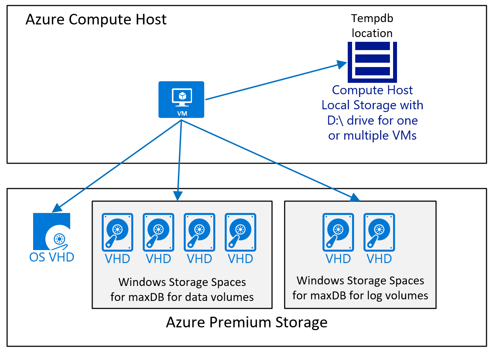
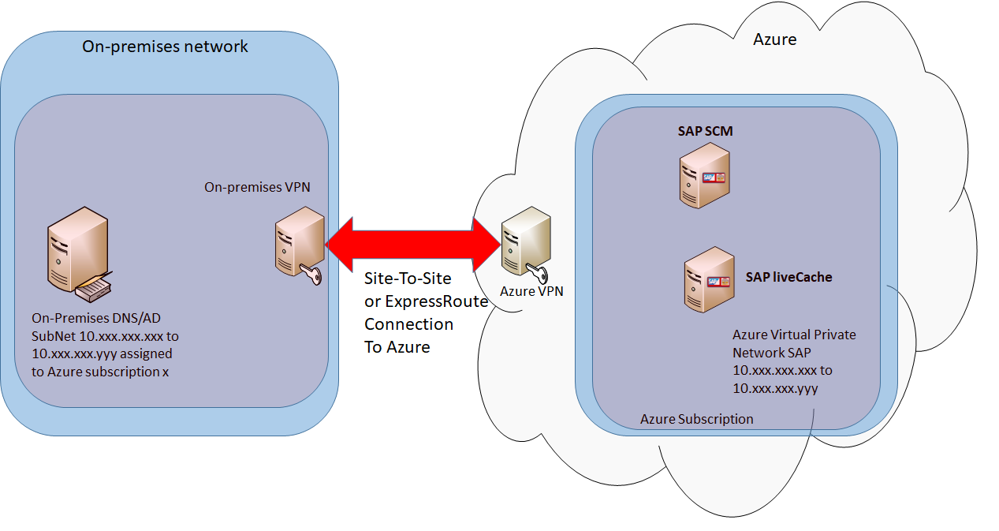
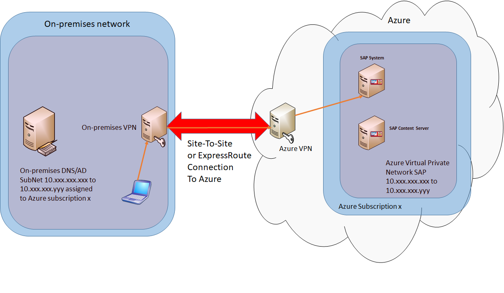

# SAP MaxDB, liveCache, and Content Server deployment on Azure VMs

[767598]:https://launchpad.support.sap.com/#/notes/767598
[773830]:https://launchpad.support.sap.com/#/notes/773830
[826037]:https://launchpad.support.sap.com/#/notes/826037
[965908]:https://launchpad.support.sap.com/#/notes/965908
[1031096]:https://launchpad.support.sap.com/#/notes/1031096
[1114181]:https://launchpad.support.sap.com/#/notes/1114181
[1139904]:https://launchpad.support.sap.com/#/notes/1139904
[1173395]:https://launchpad.support.sap.com/#/notes/1173395
[1245200]:https://launchpad.support.sap.com/#/notes/1245200
[1409604]:https://launchpad.support.sap.com/#/notes/1409604
[1558958]:https://launchpad.support.sap.com/#/notes/1558958
[1585981]:https://launchpad.support.sap.com/#/notes/1585981
[1588316]:https://launchpad.support.sap.com/#/notes/1588316
[1590719]:https://launchpad.support.sap.com/#/notes/1590719
[1597355]:https://launchpad.support.sap.com/#/notes/1597355
[1605680]:https://launchpad.support.sap.com/#/notes/1605680
[1619720]:https://launchpad.support.sap.com/#/notes/1619720
[1619726]:https://launchpad.support.sap.com/#/notes/1619726
[1619967]:https://launchpad.support.sap.com/#/notes/1619967
[1750510]:https://launchpad.support.sap.com/#/notes/1750510
[1752266]:https://launchpad.support.sap.com/#/notes/1752266
[1757924]:https://launchpad.support.sap.com/#/notes/1757924
[1757928]:https://launchpad.support.sap.com/#/notes/1757928
[1758182]:https://launchpad.support.sap.com/#/notes/1758182
[1758496]:https://launchpad.support.sap.com/#/notes/1758496
[1772688]:https://launchpad.support.sap.com/#/notes/1772688
[1814258]:https://launchpad.support.sap.com/#/notes/1814258
[1882376]:https://launchpad.support.sap.com/#/notes/1882376
[1909114]:https://launchpad.support.sap.com/#/notes/1909114
[1922555]:https://launchpad.support.sap.com/#/notes/1922555
[1928533]:https://launchpad.support.sap.com/#/notes/1928533
[1941500]:https://launchpad.support.sap.com/#/notes/1941500
[1956005]:https://launchpad.support.sap.com/#/notes/1956005
[1973241]:https://launchpad.support.sap.com/#/notes/1973241
[1984787]:https://launchpad.support.sap.com/#/notes/1984787
[1999351]:https://launchpad.support.sap.com/#/notes/1999351
[2002167]:https://launchpad.support.sap.com/#/notes/2002167
[2015553]:https://launchpad.support.sap.com/#/notes/2015553
[2039619]:https://launchpad.support.sap.com/#/notes/2039619
[2069760]:https://launchpad.support.sap.com/#/notes/2069760
[2121797]:https://launchpad.support.sap.com/#/notes/2121797
[2134316]:https://launchpad.support.sap.com/#/notes/2134316
[2171857]:https://launchpad.support.sap.com/#/notes/2171857
[2178632]:https://launchpad.support.sap.com/#/notes/2178632
[2191498]:https://launchpad.support.sap.com/#/notes/2191498
[2233094]:https://launchpad.support.sap.com/#/notes/2233094
[2243692]:https://launchpad.support.sap.com/#/notes/2243692

[azure-cli]:../../../cli-install-nodejs.md
[azure-portal]:https://portal.azure.com
[azure-ps]:/powershell/azureps-cmdlets-docs
[azure-quickstart-templates-github]:https://github.com/Azure/azure-quickstart-templates
[azure-script-ps]:https://go.microsoft.com/fwlink/p/?LinkID=395017
[azure-resource-manager/management/azure-subscription-service-limits]:../../../azure-resource-manager/management/azure-subscription-service-limits.md
[azure-resource-manager/management/azure-subscription-service-limits-subscription]:../../../azure-resource-manager/management/azure-subscription-service-limits.md#subscription-limits

[dbms-guide]:dbms-guide.md 
[dbms-guide-2.1]:dbms-guide.md#c7abf1f0-c927-4a7c-9c1d-c7b5b3b7212f 
[dbms-guide-2.2]:dbms-guide.md#c8e566f9-21b7-4457-9f7f-126036971a91 
[dbms-guide-2.3]:dbms-guide.md#10b041ef-c177-498a-93ed-44b3441ab152 
[dbms-guide-2]:dbms-guide.md#65fa79d6-a85f-47ee-890b-22e794f51a64 
[dbms-guide-3]:dbms-guide.md#871dfc27-e509-4222-9370-ab1de77021c3 
[dbms-guide-5.5.1]:dbms-guide.md#0fef0e79-d3fe-4ae2-85af-73666a6f7268 
[dbms-guide-5.5.2]:dbms-guide.md#f9071eff-9d72-4f47-9da4-1852d782087b 
[dbms-guide-5.6]:dbms-guide.md#1b353e38-21b3-4310-aeb6-a77e7c8e81c8 
[dbms-guide-5.8]:dbms-guide.md#9053f720-6f3b-4483-904d-15dc54141e30 
[dbms-guide-5]:dbms-guide.md#3264829e-075e-4d25-966e-a49dad878737 
[dbms-guide-8.4.1]:dbms-guide.md#b48cfe3b-48e9-4f5b-a783-1d29155bd573 
[dbms-guide-8.4.2]:dbms-guide.md#23c78d3b-ca5a-4e72-8a24-645d141a3f5d 
[dbms-guide-8.4.3]:dbms-guide.md#77cd2fbb-307e-4cbf-a65f-745553f72d2c 
[dbms-guide-8.4.4]:dbms-guide.md#f77c1436-9ad8-44fb-a331-8671342de818 
[dbms-guide-900-sap-cache-server-on-premises]:dbms-guide.md#642f746c-e4d4-489d-bf63-73e80177a0a8
[dbms-guide-managed-disks]:dbms-guide.md#f42c6cb5-d563-484d-9667-b07ae51bce29

[dbms-guide-figure-100]:media/virtual-machines-shared-sap-dbms-guide/100_storage_account_types.png
[dbms-guide-figure-200]:media/virtual-machines-shared-sap-dbms-guide/200-ha-set-for-dbms-ha.png
[dbms-guide-figure-300]:media/virtual-machines-shared-sap-dbms-guide/300-reference-config-iaas.png
[dbms-guide-figure-400]:media/virtual-machines-shared-sap-dbms-guide/400-sql-2012-backup-to-blob-storage.png
[dbms-guide-figure-500]:media/virtual-machines-shared-sap-dbms-guide/500-sql-2012-backup-to-blob-storage-different-containers.png
[dbms-guide-figure-600]:media/virtual-machines-shared-sap-dbms-guide/600-iaas-maxdb.png
[dbms-guide-figure-700]:media/virtual-machines-shared-sap-dbms-guide/700-livecach-prod.png
[dbms-guide-figure-800]:media/virtual-machines-shared-sap-dbms-guide/800-azure-vm-sap-content-server.png
[dbms-guide-figure-900]:media/dbms_maxdb_deployment_guide/900-sap-cache-server-on-premises.png

[deployment-guide]:deployment-guide.md 
[deployment-guide-2.2]:deployment-guide.md#42ee2bdb-1efc-4ec7-ab31-fe4c22769b94 
[deployment-guide-3.1.2]:deployment-guide.md#3688666f-281f-425b-a312-a77e7db2dfab 
[deployment-guide-3.2]:deployment-guide.md#db477013-9060-4602-9ad4-b0316f8bb281 
[deployment-guide-3.3]:deployment-guide.md#54a1fc6d-24fd-4feb-9c57-ac588a55dff2 
[deployment-guide-3.4]:deployment-guide.md#a9a60133-a763-4de8-8986-ac0fa33aa8c1 
[deployment-guide-3]:deployment-guide.md#b3253ee3-d63b-4d74-a49b-185e76c4088e 
[deployment-guide-4.1]:deployment-guide.md#604bcec2-8b6e-48d2-a944-61b0f5dee2f7 
[deployment-guide-4.2]:deployment-guide.md#7ccf6c3e-97ae-4a7a-9c75-e82c37beb18e 
[deployment-guide-4.3]:deployment-guide.md#31d9ecd6-b136-4c73-b61e-da4a29bbc9cc 
[deployment-guide-4.4.2]:deployment-guide.md#6889ff12-eaaf-4f3c-97e1-7c9edc7f7542 
[deployment-guide-4.4]:deployment-guide.md#c7cbb0dc-52a4-49db-8e03-83e7edc2927d 
[deployment-guide-4.5.1]:deployment-guide.md#987cf279-d713-4b4c-8143-6b11589bb9d4 
[deployment-guide-4.5.2]:deployment-guide.md#408f3779-f422-4413-82f8-c57a23b4fc2f 
[deployment-guide-4.5]:deployment-guide.md#d98edcd3-f2a1-49f7-b26a-07448ceb60ca 
[deployment-guide-5.1]:deployment-guide.md#bb61ce92-8c5c-461f-8c53-39f5e5ed91f2 
[deployment-guide-5.2]:deployment-guide.md#e2d592ff-b4ea-4a53-a91a-e5521edb6cd1
[deployment-guide-5.3]:deployment-guide.md#fe25a7da-4e4e-4388-8907-8abc2d33cfd8 

[deployment-guide-configure-monitoring-scenario-1]:deployment-guide.md#ec323ac3-1de9-4c3a-b770-4ff701def65b 
[deployment-guide-configure-proxy]:deployment-guide.md#baccae00-6f79-4307-ade4-40292ce4e02d 
[deployment-guide-figure-100]:media/virtual-machines-shared-sap-deployment-guide/100-deploy-vm-image.png
[deployment-guide-figure-1000]:media/virtual-machines-shared-sap-deployment-guide/1000-service-properties.png
[deployment-guide-figure-11]:deployment-guide.md#figure-11
[deployment-guide-figure-1100]:media/virtual-machines-shared-sap-deployment-guide/1100-azperflib.png
[deployment-guide-figure-1200]:media/virtual-machines-shared-sap-deployment-guide/1200-cmd-test-login.png
[deployment-guide-figure-1300]:media/virtual-machines-shared-sap-deployment-guide/1300-cmd-test-executed.png
[deployment-guide-figure-14]:deployment-guide.md#figure-14
[deployment-guide-figure-1400]:media/virtual-machines-shared-sap-deployment-guide/1400-azperflib-error-servicenotstarted.png
[deployment-guide-figure-300]:media/virtual-machines-shared-sap-deployment-guide/300-deploy-private-image.png
[deployment-guide-figure-400]:media/virtual-machines-shared-sap-deployment-guide/400-deploy-using-disk.png
[deployment-guide-figure-5]:deployment-guide.md#figure-5
[deployment-guide-figure-50]:media/virtual-machines-shared-sap-deployment-guide/50-forced-tunneling-suse.png
[deployment-guide-figure-500]:media/virtual-machines-shared-sap-deployment-guide/500-install-powershell.png
[deployment-guide-figure-6]:deployment-guide.md#figure-6
[deployment-guide-figure-600]:media/virtual-machines-shared-sap-deployment-guide/600-powershell-version.png
[deployment-guide-figure-7]:deployment-guide.md#figure-7
[deployment-guide-figure-700]:media/virtual-machines-shared-sap-deployment-guide/700-install-powershell-installed.png
[deployment-guide-figure-760]:media/virtual-machines-shared-sap-deployment-guide/760-azure-cli-version.png
[deployment-guide-figure-900]:media/virtual-machines-shared-sap-deployment-guide/900-cmd-update-executed.png
[deployment-guide-figure-azure-cli-installed]:deployment-guide.md#402488e5-f9bb-4b29-8063-1c5f52a892d0
[deployment-guide-figure-azure-cli-version]:deployment-guide.md#0ad010e6-f9b5-4c21-9c09-bb2e5efb3fda
[deployment-guide-install-vm-agent-windows]:deployment-guide.md#b2db5c9a-a076-42c6-9835-16945868e866
[deployment-guide-troubleshooting-chapter]:deployment-guide.md#564adb4f-5c95-4041-9616-6635e83a810b

[deploy-template-cli]:../../../resource-group-template-deploy-cli.md
[deploy-template-portal]:../../../resource-group-template-deploy-portal.md
[deploy-template-powershell]:../../../resource-group-template-deploy.md

[dr-guide-classic]:https://go.microsoft.com/fwlink/?LinkID=521971

[getting-started]:get-started.md
[getting-started-dbms]:get-started.md#1343ffe1-8021-4ce6-a08d-3a1553a4db82
[getting-started-deployment]:get-started.md#6aadadd2-76b5-46d8-8713-e8d63630e955
[getting-started-planning]:get-started.md#3da0389e-708b-4e82-b2a2-e92f132df89c

[getting-started-windows-classic]:../../virtual-machines-windows-classic-sap-get-started.md
[getting-started-windows-classic-dbms]:../../virtual-machines-windows-classic-sap-get-started.md#c5b77a14-f6b4-44e9-acab-4d28ff72a930
[getting-started-windows-classic-deployment]:../../virtual-machines-windows-classic-sap-get-started.md#f84ea6ce-bbb4-41f7-9965-34d31b0098ea
[getting-started-windows-classic-dr]:../../virtual-machines-windows-classic-sap-get-started.md#cff10b4a-01a5-4dc3-94b6-afb8e55757d3
[getting-started-windows-classic-ha-sios]:../../virtual-machines-windows-classic-sap-get-started.md#4bb7512c-0fa0-4227-9853-4004281b1037
[getting-started-windows-classic-planning]:../../virtual-machines-windows-classic-sap-get-started.md#f2a5e9d8-49e4-419e-9900-af783173481c

[ha-guide-classic]:https://go.microsoft.com/fwlink/?LinkId=613056

[install-extension-cli]:virtual-machines-linux-enable-aem.md

[Logo_Linux]:media/virtual-machines-shared-sap-shared/Linux.png
[Logo_Windows]:media/virtual-machines-shared-sap-shared/Windows.png

[msdn-set-azurermvmaemextension]:https://msdn.microsoft.com/library/azure/mt670598.aspx

[planning-guide]:planning-guide.md 
[planning-guide-1.2]:planning-guide.md#e55d1e22-c2c8-460b-9897-64622a34fdff 
[planning-guide-11]:planning-guide.md#7cf991a1-badd-40a9-944e-7baae842a058 
[planning-guide-11.4.1]:planning-guide.md#5d9d36f9-9058-435d-8367-5ad05f00de77 
[planning-guide-11.5]:planning-guide.md#4e165b58-74ca-474f-a7f4-5e695a93204f 
[planning-guide-2.1]:planning-guide.md#1625df66-4cc6-4d60-9202-de8a0b77f803 
[planning-guide-2.2]:planning-guide.md#f5b3b18c-302c-4bd8-9ab2-c388f1ab3d10 
[planning-guide-3.1]:planning-guide.md#be80d1b9-a463-4845-bd35-f4cebdb5424a 
[planning-guide-3.2.1]:planning-guide.md#df49dc09-141b-4f34-a4a2-990913b30358 
[planning-guide-3.2.2]:planning-guide.md#fc1ac8b2-e54a-487c-8581-d3cc6625e560 
[planning-guide-3.2.3]:planning-guide.md#18810088-f9be-4c97-958a-27996255c665 
[planning-guide-3.2]:planning-guide.md#8d8ad4b8-6093-4b91-ac36-ea56d80dbf77 
[planning-guide-3.3.2]:planning-guide.md#ff5ad0f9-f7f4-4022-9102-af07aef3bc92 
[planning-guide-5.1.1]:planning-guide.md#4d175f1b-7353-4137-9d2f-817683c26e53 
[planning-guide-5.1.2]:planning-guide.md#e18f7839-c0e2-4385-b1e6-4538453a285c 
[planning-guide-5.2.1]:planning-guide.md#1b287330-944b-495d-9ea7-94b83aff73ef 
[planning-guide-5.2.2]:planning-guide.md#57f32b1c-0cba-4e57-ab6e-c39fe22b6ec3 
[planning-guide-5.2]:planning-guide.md#6ffb9f41-a292-40bf-9e70-8204448559e7 
[planning-guide-5.3.1]:planning-guide.md#6e835de8-40b1-4b71-9f18-d45b20959b79 
[planning-guide-5.3.2]:planning-guide.md#a43e40e6-1acc-4633-9816-8f095d5a7b6a 
[planning-guide-5.4.2]:planning-guide.md#9789b076-2011-4afa-b2fe-b07a8aba58a1 
[planning-guide-5.5.1]:planning-guide.md#4efec401-91e0-40c0-8e64-f2dceadff646 
[planning-guide-5.5.3]:planning-guide.md#17e0d543-7e8c-4160-a7da-dd7117a1ad9d 
[planning-guide-7.1]:planning-guide.md#3e9c3690-da67-421a-bc3f-12c520d99a30 
[planning-guide-7]:planning-guide.md#96a77628-a05e-475d-9df3-fb82217e8f14 
[planning-guide-9.1]:planning-guide.md#6f0a47f3-a289-4090-a053-2521618a28c3 
[planning-guide-azure-premium-storage]:planning-guide.md#ff5ad0f9-f7f4-4022-9102-af07aef3bc92 

[planning-guide-figure-100]:media/virtual-machines-shared-sap-planning-guide/100-single-vm-in-azure.png
[planning-guide-figure-1300]:media/virtual-machines-shared-sap-planning-guide/1300-ref-config-iaas-for-sap.png
[planning-guide-figure-1400]:media/virtual-machines-shared-sap-planning-guide/1400-attach-detach-disks.png
[planning-guide-figure-1600]:media/virtual-machines-shared-sap-planning-guide/1600-firewall-port-rule.png
[planning-guide-figure-1700]:media/virtual-machines-shared-sap-planning-guide/1700-single-vm-demo.png
[planning-guide-figure-1900]:media/virtual-machines-shared-sap-planning-guide/1900-vm-set-vnet.png
[planning-guide-figure-200]:media/virtual-machines-shared-sap-planning-guide/200-multiple-vms-in-azure.png
[planning-guide-figure-2100]:media/virtual-machines-shared-sap-planning-guide/2100-s2s.png
[planning-guide-figure-2200]:media/virtual-machines-shared-sap-planning-guide/2200-network-printing.png
[planning-guide-figure-2300]:media/virtual-machines-shared-sap-planning-guide/2300-sapgui-stms.png
[planning-guide-figure-2400]:media/virtual-machines-shared-sap-planning-guide/2400-vm-extension-overview.png
[planning-guide-figure-2500]:media/virtual-machines-shared-sap-planning-guide/2500-vm-extension-details.png
[planning-guide-figure-2600]:media/virtual-machines-shared-sap-planning-guide/2600-sap-router-connection.png
[planning-guide-figure-2700]:media/virtual-machines-shared-sap-planning-guide/2700-exposed-sap-portal.png
[planning-guide-figure-2800]:media/virtual-machines-shared-sap-planning-guide/2800-endpoint-config.png
[planning-guide-figure-2900]:media/virtual-machines-shared-sap-planning-guide/2900-azure-ha-sap-ha.png
[planning-guide-figure-300]:media/virtual-machines-shared-sap-planning-guide/300-vpn-s2s.png
[planning-guide-figure-3000]:media/virtual-machines-shared-sap-planning-guide/3000-sap-ha-on-azure.png
[planning-guide-figure-3200]:media/virtual-machines-shared-sap-planning-guide/3200-sap-ha-with-sql.png
[planning-guide-figure-400]:media/virtual-machines-shared-sap-planning-guide/400-vm-services.png
[planning-guide-figure-600]:media/virtual-machines-shared-sap-planning-guide/600-s2s-details.png
[planning-guide-figure-700]:media/virtual-machines-shared-sap-planning-guide/700-decision-tree-deploy-to-azure.png
[planning-guide-figure-800]:media/virtual-machines-shared-sap-planning-guide/800-portal-vm-overview.png
[planning-guide-microsoft-azure-networking]:planning-guide.md#61678387-8868-435d-9f8c-450b2424f5bd 
[planning-guide-storage-microsoft-azure-storage-and-data-disks]:planning-guide.md#a72afa26-4bf4-4a25-8cf7-855d6032157f 

[resource-group-authoring-templates]:../../../resource-group-authoring-templates.md
[resource-group-overview]:../../../azure-resource-manager/management/overview.md
[resource-groups-networking]:../../../networking/networking-overview.md
[sap-pam]:https://support.sap.com/pam 
[sap-templates-2-tier-marketplace-image]:https://portal.azure.com/#create/Microsoft.Template/uri/https%3A%2F%2Fraw.githubusercontent.com%2FAzure%2Fazure-quickstart-templates%2Fmaster%2Fsap-2-tier-marketplace-image%2Fazuredeploy.json
[sap-templates-2-tier-os-disk]:https://portal.azure.com/#create/Microsoft.Template/uri/https%3A%2F%2Fraw.githubusercontent.com%2FAzure%2Fazure-quickstart-templates%2Fmaster%2Fsap-2-tier-user-disk%2Fazuredeploy.json
[sap-templates-2-tier-user-image]:https://portal.azure.com/#create/Microsoft.Template/uri/https%3A%2F%2Fraw.githubusercontent.com%2FAzure%2Fazure-quickstart-templates%2Fmaster%2Fsap-2-tier-user-image%2Fazuredeploy.json
[sap-templates-3-tier-marketplace-image]:https://portal.azure.com/#create/Microsoft.Template/uri/https%3A%2F%2Fraw.githubusercontent.com%2FAzure%2Fazure-quickstart-templates%2Fmaster%2Fsap-3-tier-marketplace-image%2Fazuredeploy.json
[sap-templates-3-tier-user-image]:https://portal.azure.com/#create/Microsoft.Template/uri/https%3A%2F%2Fraw.githubusercontent.com%2FAzure%2Fazure-quickstart-templates%2Fmaster%2Fsap-3-tier-user-image%2Fazuredeploy.json
[storage-azure-cli]:../../../storage/common/storage-azure-cli.md
[storage-azure-cli-copy-blobs]:../../../storage/common/storage-azure-cli.md#copy-blobs
[storage-introduction]:../../../storage/common/storage-introduction.md
[storage-powershell-guide-full-copy-vhd]:../../../storage/common/storage-powershell-guide-full.md#how-to-copy-blobs-from-one-storage-container-to-another
[storage-premium-storage-preview-portal]:../../windows/disks-types.md
[storage-redundancy]:../../../storage/common/storage-redundancy.md
[storage-scalability-targets]:../../../storage/common/scalability-targets-standard-accounts.md
[storage-use-azcopy]:../../../storage/common/storage-use-azcopy.md
[template-201-vm-from-specialized-vhd]:https://github.com/Azure/azure-quickstart-templates/tree/master/201-vm-from-specialized-vhd
[templates-101-simple-windows-vm]:https://github.com/Azure/azure-quickstart-templates/tree/master/101-simple-windows-vm
[templates-101-vm-from-user-image]:https://github.com/Azure/azure-quickstart-templates/tree/master/101-vm-from-user-image
[virtual-machines-linux-attach-disk-portal]:../../linux/attach-disk-portal.md
[virtual-machines-azure-resource-manager-architecture]:../../../resource-manager-deployment-model.md
[virtual-machines-azurerm-versus-azuresm]:../../../resource-manager-deployment-model.md
[virtual-machines-windows-classic-configure-oracle-data-guard]:../../virtual-machines-windows-classic-configure-oracle-data-guard.md
[virtual-machines-linux-cli-deploy-templates]:../../linux/cli-deploy-templates.md 
[virtual-machines-deploy-rmtemplates-powershell]:../../virtual-machines-windows-ps-manage.md 
[virtual-machines-linux-agent-user-guide]:../../linux/agent-user-guide.md
[virtual-machines-linux-agent-user-guide-command-line-options]:../../linux/agent-user-guide.md#command-line-options
[virtual-machines-linux-capture-image]:../../linux/capture-image.md
[virtual-machines-linux-capture-image-resource-manager]:../../linux/capture-image.md
[virtual-machines-linux-capture-image-resource-manager-capture]:../../linux/capture-image.md#step-2-capture-the-vm
[virtual-machines-linux-configure-raid]:../../linux/configure-raid.md
[virtual-machines-linux-configure-lvm]:../../linux/configure-lvm.md
[virtual-machines-linux-classic-create-upload-vhd-step-1]:../../virtual-machines-linux-classic-create-upload-vhd.md#step-1-prepare-the-image-to-be-uploaded
[virtual-machines-linux-create-upload-vhd-suse]:../../linux/suse-create-upload-vhd.md
[virtual-machines-linux-redhat-create-upload-vhd]:../../linux/redhat-create-upload-vhd.md
[virtual-machines-linux-how-to-attach-disk]:../../linux/add-disk.md
[virtual-machines-linux-how-to-attach-disk-how-to-initialize-a-new-data-disk-in-linux]:../../linux/add-disk.md#connect-to-the-linux-vm-to-mount-the-new-disk
[virtual-machines-linux-tutorial]:../../linux/quick-create-cli.md
[virtual-machines-linux-update-agent]:../../linux/update-agent.md
[virtual-machines-manage-availability-linux]:../../linux/manage-availability.md
[virtual-machines-manage-availability-windows]:../../windows/manage-availability.md
[virtual-machines-ps-create-preconfigure-windows-resource-manager-vms]:virtual-machines-windows-create-powershell.md
[virtual-machines-sizes-linux]:../../linux/sizes.md
[virtual-machines-sizes-windows]:../../windows/sizes.md
[virtual-machines-windows-classic-ps-sql-alwayson-availability-groups]:./../../windows/sqlclassic/virtual-machines-windows-classic-ps-sql-alwayson-availability-groups.md
[virtual-machines-windows-classic-ps-sql-int-listener]:./../../windows/sqlclassic/virtual-machines-windows-classic-ps-sql-int-listener.md
[virtual-machines-sql-server-high-availability-and-disaster-recovery-solutions]:../../../azure-sql/virtual-machines/windows/business-continuity-high-availability-disaster-recovery-hadr-overview.md
[virtual-machines-sql-server-infrastructure-services]:../../../azure-sql/virtual-machines/windows/sql-server-on-azure-vm-iaas-what-is-overview.md
[virtual-machines-sql-server-performance-best-practices]:../../../azure-sql/virtual-machines/windows/performance-guidelines-best-practices.md
[virtual-machines-upload-image-windows-resource-manager]:../../virtual-machines-windows-upload-image.md
[virtual-machines-windows-tutorial]:../../virtual-machines-windows-hero-tutorial.md
[virtual-machines-workload-template-sql-alwayson]:https://azure.microsoft.com/resources/templates/sql-server-2014-alwayson-existing-vnet-and-ad/
[virtual-network-deploy-multinic-arm-cli]:../linux/multiple-nics.md
[virtual-network-deploy-multinic-arm-ps]:../windows/multiple-nics.md
[virtual-network-deploy-multinic-arm-template]:../../../virtual-network/template-samples.md
[virtual-networks-configure-vnet-to-vnet-connection]:../../../vpn-gateway/vpn-gateway-vnet-vnet-rm-ps.md
[virtual-networks-create-vnet-arm-pportal]:../../../virtual-network/manage-virtual-network.md#create-a-virtual-network
[virtual-networks-manage-dns-in-vnet]:../../../virtual-network/virtual-networks-name-resolution-for-vms-and-role-instances.md
[virtual-networks-multiple-nics]:../../../virtual-network/virtual-network-deploy-multinic-classic-ps.md
[virtual-networks-nsg]:../../../virtual-network/security-overview.md
[virtual-networks-reserved-private-ip]:../../../virtual-network/virtual-networks-static-private-ip-arm-ps.md
[virtual-networks-static-private-ip-arm-pportal]:../../../virtual-network/virtual-networks-static-private-ip-arm-pportal.md
[virtual-networks-udr-overview]:../../../virtual-network/virtual-networks-udr-overview.md
[vpn-gateway-about-vpn-devices]:../../../vpn-gateway/vpn-gateway-about-vpn-devices.md
[vpn-gateway-create-site-to-site-rm-powershell]:../../../vpn-gateway/vpn-gateway-create-site-to-site-rm-powershell.md
[vpn-gateway-cross-premises-options]:../../../vpn-gateway/vpn-gateway-plan-design.md
[vpn-gateway-site-to-site-create]:../../../vpn-gateway/vpn-gateway-site-to-site-create.md
[vpn-gateway-vpn-faq]:../../../vpn-gateway/vpn-gateway-vpn-faq.md
[xplat-cli]:../../../cli-install-nodejs.md
[xplat-cli-azure-resource-manager]:../../../xplat-cli-azure-resource-manager.md

This document covers several different areas to consider when deploying MaxDB, liveCache, and Content Server in Azure IaaS. As a precondition to this document, you should have read the document [Considerations for Azure Virtual Machines DBMS deployment for SAP workload](dbms_guide_general.md) as well as other guides in the [SAP workload on Azure documentation](https://docs.microsoft.com/azure/virtual-machines/workloads/sap/get-started). 

## Specifics for the SAP MaxDB deployments on Windows
### SAP MaxDB Version Support on Azure
SAP currently supports SAP MaxDB version 7.9 or higher for use with SAP NetWeaver-based products in Azure. All updates for SAP MaxDB server, or JDBC and ODBC drivers to be used with SAP NetWeaver-based products are provided solely through the SAP Service Marketplace at <https://support.sap.com/swdc>.
General information on running SAP NetWeaver on SAP MaxDB can be found at <https://www.sap.com/community/topic/maxdb.html>.

### Supported Microsoft Windows Versions and Azure VM types for SAP MaxDB DBMS
To find the supported Microsoft Windows version for SAP MaxDB DBMS on Azure, see:

* [SAP Product Availability Matrix (PAM)][sap-pam]
* SAP Note [1928533]

It is highly recommended to use the newest version of the operating system Microsoft Windows, which is Microsoft Windows 2016.

### Available SAP MaxDB Documentation for MaxDB
You can find the updated list of SAP MaxDB documentation in the following SAP Note [767598]

### SAP MaxDB Configuration Guidelines for SAP Installations in Azure VMs
#### Storage configuration
Azure storage best practices for SAP MaxDB follow the general recommendations mentioned in chapter [Storage structure of a VM for RDBMS Deployments](https://docs.microsoft.com/azure/virtual-machines/workloads/sap/dbms_guide_general#65fa79d6-a85f-47ee-890b-22e794f51a64).

> [!IMPORTANT]
> Like other databases, SAP MaxDB also has data and log files. However, in SAP MaxDB terminology the correct term is "volume" (not "file"). For example, there are SAP MaxDB data volumes and log volumes. Do not confuse these with OS disk volumes. 
> 
> 

In short you have to:

* If you use Azure Storage accounts, set the Azure storage account that holds the SAP MaxDB data and log volumes (data and log files) to **Local Redundant Storage (LRS)** as specified in [Considerations for Azure Virtual Machines DBMS deployment for SAP workload](dbms_guide_general.md).
* Separate the IO path for SAP MaxDB data volumes (data files) from the IO path for log volumes (log files). It means that SAP MaxDB data volumes (data files) have to be installed on one logical drive and SAP MaxDB log volumes (log files) have to be installed on another logical drive.
* Set the proper caching type for each disk, depending on whether you use it for SAP MaxDB data or log volumes (data and log files), and whether you use Azure Standard or Azure Premium Storage, as described in [Considerations for Azure Virtual Machines DBMS deployment for SAP workload](dbms_guide_general.md).
* As long as the current IOPS quota per disk satisfies the requirements, it is possible to store all the data volumes on a single mounted disk, and also store all database log volumes on another single mounted disk.
* If more IOPS and/or space are required, it is recommended to use Microsoft Window Storage Pools (only available in Microsoft Windows Server 2012 and higher) to create one large logical device over multiple mounted disks. For more details, see also [Considerations for Azure Virtual Machines DBMS deployment for SAP workload](dbms_guide_general.md). This approach simplifies the administration overhead to manage the disk space and avoids the effort of manually distributing files across multiple mounted disks.
* it is highly recommended to use Azure Premium Storage for MaxDB deployments. 

#### Backup and Restore
When deploying SAP MaxDB into Azure, you must review your backup methodology. Even if the system is not a productive system, the SAP database hosted by SAP MaxDB must be backed up periodically. Since Azure Storage keeps three images, a backup is now less important in terms of protecting your system against storage failure and more important operational or administrative failures. The primary reason for maintaining a proper backup and restore plan is so that you can compensate for logical or manual errors by providing point-in-time recovery capabilities. So the goal is to either use backups to restore the database to a certain point in time or to use the backups in Azure to seed another system by copying the existing database. 

Backing up and restoring a database in Azure works the same way as it does for on-premises systems, so you can use standard SAP MaxDB backup/restore tools, which are described in one of the SAP MaxDB documentation documents listed in SAP Note [767598]. 

#### Performance Considerations for Backup and Restore
As in bare-metal deployments, backup and restore performance are dependent on how many volumes can be read in parallel and the throughput of those volumes. Therefore, one can assume:

* The fewer the number of disks used to store the database devices, the lower the overall read throughput
* The fewer targets (Stripe Directories, disks) to write the backup to, the lower the throughput

To increase the number of targets to write to, there are two options that you can use, possibly in combination, depending on your needs:

* Dedicating separate volumes for backup
* Striping the backup target volume over multiple mounted disks in order to improve the IOPS throughput on that striped disk volume
* Having separate dedicated logical disk devices for:
  * SAP MaxDB backup volumes (i.e. files)
  * SAP MaxDB data volumes (i.e. files)
  * SAP MaxDB log volumes (i.e. files)

Striping a volume over multiple mounted disks has been discussed earlier in [Considerations for Azure Virtual Machines DBMS deployment for SAP workload](dbms_guide_general.md). 

#### Other considerations
All other general areas such as Azure Availability Sets or SAP monitoring also apply as described in [Considerations for Azure Virtual Machines DBMS deployment for SAP workload](dbms_guide_general.md).  for deployments of VMs with the SAP MaxDB database.
Other SAP MaxDB-specific settings are transparent to Azure VMs and are described in different documents listed in SAP Note [767598] and in these SAP Notes:

* [826037] 
* [1139904]
* [1173395]

## Specifics for SAP liveCache deployments on Windows
### SAP liveCache Version Support
Minimal version of SAP liveCache supported in Azure Virtual Machines is **SAP LC/LCAPPS 10.0 SP 25** including **liveCache 7.9.08.31** and **LCA-Build 25**, released for **EhP 2 for SAP SCM 7.0** and later releases.

### Supported Microsoft Windows Versions and Azure VM types for SAP liveCache DBMS
To find the supported Microsoft Windows version for SAP liveCache on Azure, see:

* [SAP Product Availability Matrix (PAM)][sap-pam]
* SAP Note [1928533]

It is highly recommended to use the newest version of the operating system Microsoft Windows Server. 

### SAP liveCache Configuration Guidelines for SAP Installations in Azure VMs
#### Recommended Azure VM Types for liveCache
As SAP liveCache is an application that performs huge calculations, the amount and speed of RAM and CPU has a major influence on SAP liveCache performance. 

For the Azure VM types supported by SAP (SAP Note [1928533]), all virtual CPU resources allocated to the VM are backed by dedicated physical CPU resources of the hypervisor. No overprovisioning (and therefore no competition for CPU resources) takes place.

Similarly, for all Azure VM instance types supported by SAP, the VM memory is 100% mapped to the physical memory - over-provisioning (over-commitment), for example, is not used.

From this perspective, it is highly recommended to use the most recent Dv2, Dv3, Ev3, and M-series VMs. The choice of the different VM types depends on the memory you need for liveCache and the CPU resources you need. As with all other DBMS deployments it is advisable to leverage Azure Premium Storage for performance critical volumes.

#### Storage Configuration for liveCache in Azure
As SAP liveCache is based on SAP MaxDB technology, all the Azure storage best practice recommendations mentioned for SAP MaxDB described in this document are also valid for SAP liveCache. 

#### Dedicated Azure VM for liveCache scenario
As SAP liveCache intensively uses computational power, for productive usage it is highly recommended to deploy on a dedicated Azure Virtual Machine. 

#### Backup and Restore for liveCache in Azure
backup and restore, including performance considerations, are already described in the relevant SAP MaxDB chapters in this document. 

#### Other considerations
All other general areas are already described in the relevant SAP MaxDB chapter. 

## Specifics for the SAP Content Server deployment on Windows in Azure
The SAP Content Server is a separate, server-based component to store content such as electronic documents in different formats. The SAP Content Server is provided by development of technology and is to be used cross-application for any SAP applications. It is installed on a separate system. Typical content is training material and documentation from Knowledge Warehouse or technical drawings originating from the mySAP PLM Document Management System. 

### SAP Content Server Version Support for Azure VMs
SAP currently supports:

* **SAP Content Server** with version **6.50 (and higher)**
* **SAP MaxDB version 7.9**
* **Microsoft IIS (Internet Information Server) version 8.0 (and higher)**

It is highly recommended to use the newest version of SAP Content Server, and the newest version of **Microsoft IIS**. 

Check the latest supported versions of SAP Content Server and Microsoft IIS in the [SAP Product Availability Matrix (PAM)][sap-pam].

### Supported Microsoft Windows and Azure VM types for SAP Content Server
To find out supported Windows version for SAP Content Server on Azure, see:

* [SAP Product Availability Matrix (PAM)][sap-pam]
* SAP Note [1928533]

It is highly recommended to use the newest version of Microsoft Windows Server.

### SAP Content Server Configuration Guidelines for SAP Installations in Azure VMs
#### Storage Configuration for Content Server in Azure
If you configure SAP Content Server to store files in the SAP MaxDB database, all Azure storage best practices recommendation mentioned for SAP MaxDB in this document are also valid for the SAP Content Server scenario. 

If you configure SAP Content Server to store files in the file system, it is recommended to use a dedicated logical drive. Using Windows Storage Spaces enables you to also increase logical disk size and IOPS throughput, as described in [Considerations for Azure Virtual Machines DBMS deployment for SAP workload](dbms_guide_general.md). 

#### SAP Content Server Location
SAP Content Server has to be deployed in the same Azure region and Azure VNET where the SAP system is deployed. You are free to decide whether you want to deploy SAP Content Server components on a dedicated Azure VM or on the same VM where the SAP system is running. 

#### SAP Cache Server Location
The SAP Cache Server is an additional server-based component to provide access to (cached) documents locally. The SAP Cache Server caches the documents of an SAP Content Server. This is to optimize network traffic if documents have to be retrieved more than once from different locations. The general rule is that the SAP Cache Server has to be physically close to the client that accesses the SAP Cache Server. 

Here you have two options:

1. **Client is a backend SAP system**
   If a backend SAP system is configured to access SAP Content Server, that SAP system is a client. As both SAP system and SAP Content Server are deployed in the same Azure region, in the same Azure datacenter, they are physically close to each other. Therefore, there is no need to have a dedicated SAP Cache Server. SAP UI clients (SAP GUI or web browser) access the SAP system directly, and the SAP system retrieves documents from the SAP Content Server.
2. **Client is an on-premises web browser**
   The SAP Content Server can be configured to be accessed directly by the web browser. In this case, a web browser running on-premises is a client of the SAP Content Server. On-premises datacenter and Azure datacenter are placed in different physical locations (ideally close to each other). Your on-premises datacenter is connected to Azure via Azure Site-to-Site VPN or ExpressRoute. Although both options offer secure VPN network connection to Azure, site-to-site network connection does not offer a network bandwidth and latency SLA between the on-premises datacenter and the Azure datacenter. To speed up access to documents, you can do one of the following:
   1. Install SAP Cache Server on-premises, close to the on-premises web browser (option in figure below)
   2. Configure Azure ExpressRoute, which offers a high-speed and low-latency dedicated network connection between on-premises datacenter and Azure datacenter.

#### Backup / Restore
If you configure the SAP Content Server to store files in the SAP MaxDB database, the backup/restore procedure and performance considerations are already described in SAP MaxDB chapters of this document. 

If you configure the SAP Content Server to store files in the file system, one option is to execute manual backup/restore of the whole file structure where the documents are located. Similar to SAP MaxDB backup/restore, it is recommended to have a dedicated disk volume for backup purpose. 

#### Other
Other SAP Content Server-specific settings are transparent to Azure VMs and are described in various documents and SAP Notes:

* <https://service.sap.com/contentserver> 
* SAP Note [1619726]  
