# High availability set up in SUSE using the STONITH
This document provides the detailed step by step instructions to set up the High Availability on SUSE Operating system using the STONITH device.

**Disclaimer:** *This guide is derived by testing the setup in the Microsoft HANA Large Instances environment, which successfully works. As Microsoft Service Management team for HANA Large Instances does not support Operating system, you may need to contact SUSE for any further troubleshooting or clarification on the operating system layer. Microsoft service management team does set up STONITH device and fully supports and can be involved for troubleshooting for STONITH device issues.*
## Overview
To set up the High availability using SUSE clustering, the following pre-requisites must meet.
### Pre-requisites
- HANA Large Instances are provisioned
- Operating system is registered
- HANA Large Instances servers are connected to SMT server to get patches/packages
- Operating system have latest patches installed
- NTP (time server) is set up
- Read and understand the latest version of SUSE documentation on HA setup

### Setup details
This guide uses the following setup:
- Operating System: SLES 12 SP1 for SAP
- HANA Large Instances: 2xS192 (four sockets, 2 TB)
- HANA Version: HANA 2.0 SP1
- Server Names: sapprdhdb95 (node1) and sapprdhdb96 (node2)
- STONITH Device: iSCSI based STONITH device
- NTP set up on one of the HANA Large Instance nodes

When you set up HANA Large Instances with HSR, you can request Microsoft Service Management team to set up STONITH. If you are already an existing customer who has HANA Large Instances provisioned, and need STONITH device set up for your existing blades, you need to provide the following information to Microsoft Service Management team in the service request form (SRF). You can request SRF form through the Technical Account Manager or your Microsoft Contact for HANA Large Instance onboarding. The new customers can request STONITH device at the time of provisioning. The inputs are available in the provisioning request form.

- Server Name and Server IP address (for example, myhanaserver1, 10.35.0.1)
- Location (for example, US East)
- Customer Name (for example, Microsoft)
- SID - HANA System Identifier (for example, H11)

Once the STONITH device is configured, Microsoft Service Management team does provide you the SBD device name and IP address of the iSCSI storage, which you can use to configure STONITH setup. 

To set up the end to end HA using STONITH, the following steps needs to be followed:

1.	Identify the SBD device
2.	Initialize the SBD device
3.	Configuring the Cluster
4.	Setting Up the Softdog Watchdog
5.	Join the node to the cluster
6.	Validate the cluster
7.	Configure the resources to the cluster
8.	Test the failover process

## 1.	Identify the SBD device
This section describes on how to determine the SBD device for your setup after Microsoft service management team has configured the STONITH. **This section only applies to the existing customer**. If you are a new customer, Microsoft service management team does provide SBD device name to you and you can skip this section.

1.1	Modify */etc/iscsi/initiatorname.isci* to 
``` 
iqn.1996-04.de.suse:01:<Tenant><Location><SID><NodeNumber> 
```

Microsoft service management does provide this string. Modify the file on **both** the nodes, however the node number is different on each node.

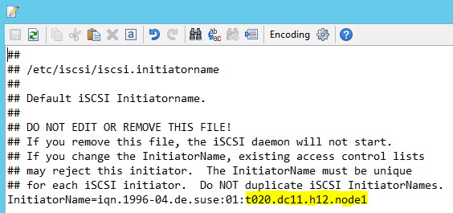

1.2 Modify */etc/iscsi/iscsid.conf*: Set *node.session.timeo.replacement_timeout=5* and *node.startup = automatic*. Modify the file on **both** the nodes.

1.3	Execute the discovery command, it shows four sessions. Run it on both the nodes.

```
iscsiadm -m discovery -t st -p <IP address provided by Service Management>:3260
```


1.4	Execute the command to log in to the iSCSI device, it shows four sessions. Run it on **both** the nodes.

```
iscsiadm -m node -l
```
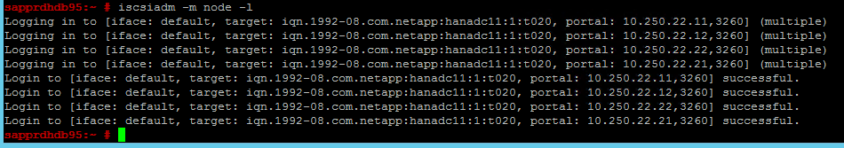

1.5 Execute the rescan script: *rescan-scsi-bus.sh*.  This script shows you the new disks created for you.  Run it on both the nodes. You should see a LUN number that is greater than zero (for example: 1, 2 etc.)

```
rescan-scsi-bus.sh
```


1.6	To get the device name run the command *fdisk –l*. Run it on both the nodes. Pick the device with the size of **178 MiB**.

```
  fdisk –l
```

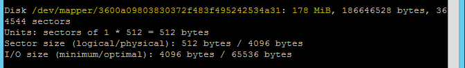

## 2.	Initialize the SBD device

2.1	Initialize the SBD device on **both** the nodes

```
sbd -d <SBD Device Name> create
```
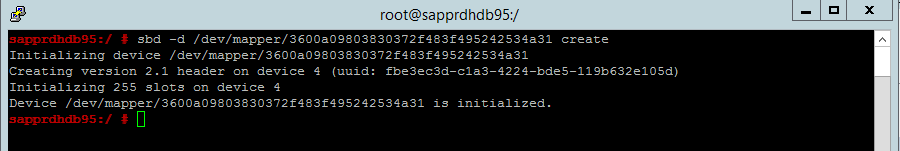

2.2	Check what has been written to the device. Do it on **both** the nodes

```
sbd -d <SBD Device Name> dump
```

## 3.	Configuring the Cluster
This section describes the steps to set up the SUSE HA cluster.
### 3.1	Package installation
3.1.1	Please check that ha_sles and SAPHanaSR-doc patterns are installed. If it is not installed, install them. Install it on **both** the nodes.
```
zypper in -t pattern ha_sles
zypper in SAPHanaSR SAPHanaSR-doc
```


### 3.2	Setting up the cluster
3.2.1	You can either use *ha-cluster-init* command, or use the yast2 wizard to set up the cluster. In this case, the yast2 wizard is used. You perform this step **only on the Primary node**.

Follow yast2> High Availability > Cluster 


Click **cancel** since the halk2 package is already installed.


Click **Continue**

Expected value=Number of nodes deployed (in this case 2)
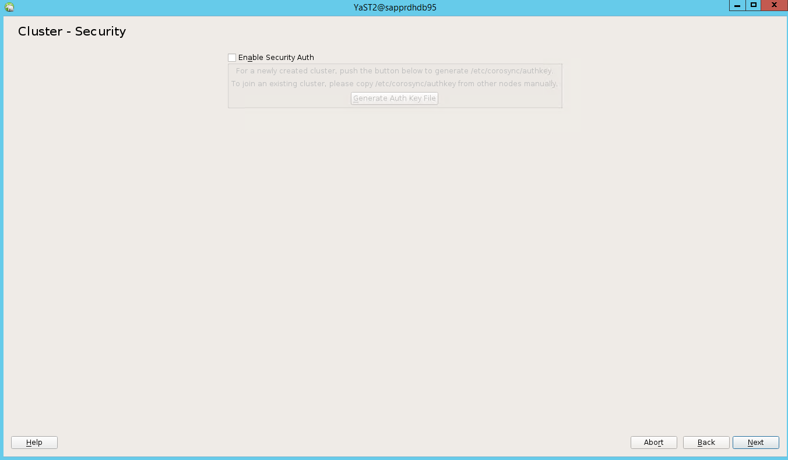
Click **Next**

Add node names and then click “Add suggested files”

Click “Turn csync2 ON”

Click “Generate Pre-Shared-Keys”, it shows below popup


Click **OK**

The authentication is performed using the IP addresses and pre-shared-keys in Csync2. The key file is generated with csync2 -k /etc/csync2/key_hagroup. The file key_hagroup should be copied to all members of the cluster manually after it's created. **Ensure to copy the file from node 1 to node2**.


Click **Next**
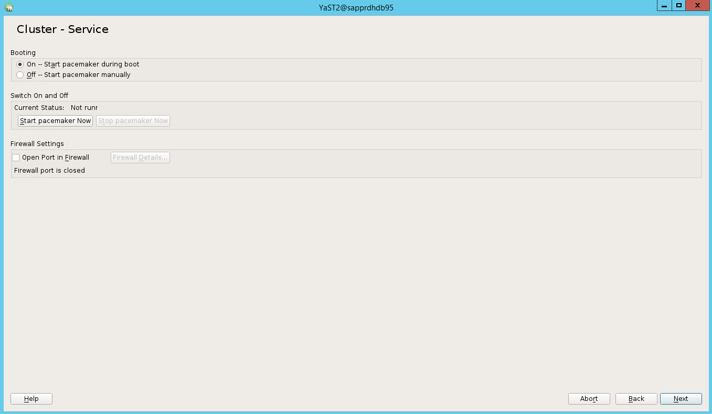

In the default option, Booting was off, change it to “on” so pacemaker is started on boot. You can make the choice based on your setup requirements.
Click **Next** and the cluster configuration is complete.

## 4.	Setting Up the Softdog Watchdog
This section describes the configuration of the watchdog (softdog).

4.1	Add the following line to */etc/init.d/boot.local* on **both** the nodes.
```
modprobe softdog
```
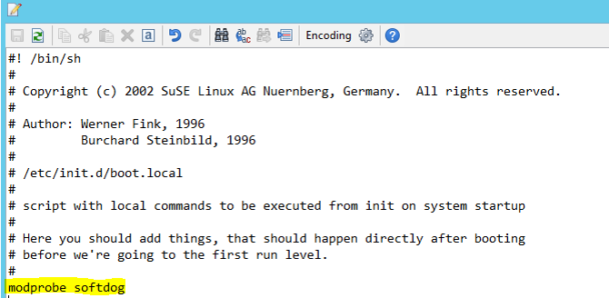

4.2	Update the file */etc/sysconfig/sbd* on **both** the nodes as following:
```
SBD_DEVICE="<SBD Device Name>"
```


4.3	Load the kernel module on **both** the nodes by running the following command
```
modprobe softdog
```


4.4	Check and ensure that softdog is running as following on **both** the nodes:
```
lsmod | grep dog
```


4.5	Start the SBD device on **both** the nodes
```
/usr/share/sbd/sbd.sh start
```


4.6	Test the SBD daemon on **both** the nodes. You see two entries after you configure it on **both** the nodes
```
sbd -d <SBD Device Name> list
```


4.7	Send a test message to **one** of your nodes
```
sbd  -d <SBD Device Name> message <node2> <message>
```


4.8	On the **Second** node (node2) you can check the message status
```
sbd  -d <SBD Device Name> list
```


4.9	To adopt the sbd config, update the file */etc/sysconfig/sbd* as following. Update the file on **both** the nodes
```
SBD_DEVICE=" <SBD Device Name>" 
SBD_WATCHDOG="yes" 
SBD_PACEMAKER="yes" 
SBD_STARTMODE="clean" 
SBD_OPTS=""
```
4.10	Start the pacemaker service on the **Primary node** (node1)
```
systemctl start pacemaker
```


If the pacemaker service *fails*, refer to *Scenario 5: Pacemaker service fails*

## 5.	Joining the cluster
This section describes on how to join the node to the cluster.

### 5.1	Add the node
Run the following command on **node2** to let node2 join the cluster.
```
ha-cluster-join
```
If you receive an *error* during joining the cluster, refer *Scenario 6: Node 2 unable to join the cluster*.

## 6.	Validating the cluster

### 6.1 Start the cluster service
To check and optionally start the cluster for the first time on **both** nodes.
```
systemctl status pacemaker
systemctl start pacemaker
```
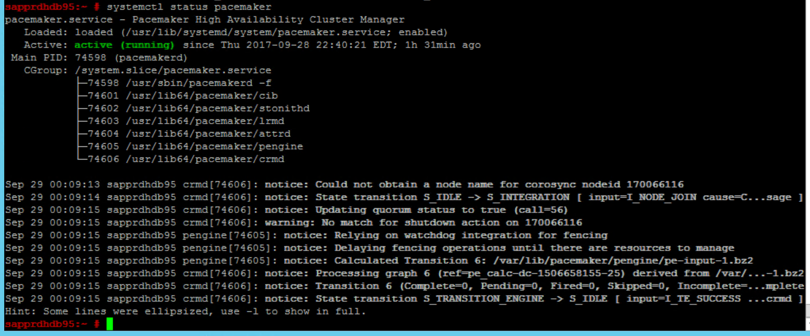
### 6.2 Monitor the status
Run the command *crm_mon* to ensure **both** the nodes are online. You can run it on **any of the nodes** of the cluster
```
crm_mon
```

You can also log in to hawk to check the cluster status *https://\<node IP>:7630*. The default user is hacluster and the password is linux. If needed, you can change the password using *passwd* command.

## 7. Configure Cluster Properties and Resources 
This section describes the steps to configure the cluster resources.
In this example, set up the following resource, the rest can be configured (if needed) by referencing the SUSE HA guide. Perform the config in **one of the nodes** only. Do on primary node.

- Cluster bootstrap
- STONITH Device
- The Virtual IP Address


### 7.1 Cluster bootstrap and more
Add cluster bootstrap. Create the file and add the text as following:
```
sapprdhdb95:~ # vi crm-bs.txt
# enter the following to crm-bs.txt
property $id="cib-bootstrap-options" \
no-quorum-policy="ignore" \
stonith-enabled="true" \
stonith-action="reboot" \
stonith-timeout="150s"
rsc_defaults $id="rsc-options" \
resource-stickiness="1000" \
migration-threshold="5000"
op_defaults $id="op-options" \
timeout="600"
```
Add the configuration to the cluster.
```
crm configure load update crm-bs.txt
```


### 7.2 STONITH device
Add resource STONITH. Create the file and add the text as following.
```
# vi crm-sbd.txt
# enter the following to crm-sbd.txt
primitive stonith-sbd stonith:external/sbd \
params pcmk_delay_max="15"
```
Add the configuration to the cluster.
```
crm configure load update crm-sbd.txt
```

### 7.3 The virtual IP address
Add resource virtual IP. Create the file and add the text as below.
```
# vi crm-vip.txt
primitive rsc_ip_HA1_HDB10 ocf:heartbeat:IPaddr2 \
operations $id="rsc_ip_HA1_HDB10-operations" \
op monitor interval="10s" timeout="20s" \
params ip="10.35.0.197"
```
Add the configuration to the cluster.
```
crm configure load update crm-vip.txt
```

### 7.4 Validate the resources

When you run command *crm_mon*, you can see the two resources there.


Also, you can see the status at *https://\<node IP address>:7630/cib/live/state*


## 8. Testing the failover process
To test the failover process, stop the pacemaker service on node1, and the resources failover to node2.
```
Service pacemaker stop
```
Now, stop the pacemaker service on **node2** and resources failed over to **node1**

**Before failover**  
  

**After failover**  
  
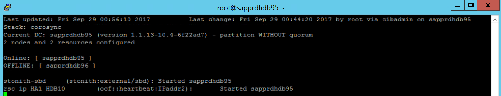  


## 9. Troubleshooting
This section describes the few failure scenarios, which can be encountered during the setup. You may not necessarily face these issues.

### Scenario 1: Cluster node not online
If any of the nodes does not show online in cluster manager, you can try following to bring it online.

Start the iSCSI service
```
service iscsid start
```

And now you should be able to log in to that iSCSI node
```
iscsiadm -m node -l
```
The expected output looks like following
```
sapprdhdb45:~ # iscsiadm -m node -l
Logging in to [iface: default, target: iqn.1992-08.com.netapp:hanadc11:1:t020, portal: 10.250.22.11,3260] (multiple)
Logging in to [iface: default, target: iqn.1992-08.com.netapp:hanadc11:1:t020, portal: 10.250.22.12,3260] (multiple)
Logging in to [iface: default, target: iqn.1992-08.com.netapp:hanadc11:1:t020, portal: 10.250.22.22,3260] (multiple)
Logging in to [iface: default, target: iqn.1992-08.com.netapp:hanadc11:1:t020, portal: 10.250.22.21,3260] (multiple)
Login to [iface: default, target: iqn.1992-08.com.netapp:hanadc11:1:t020, portal: 10.250.22.11,3260] successful.
Login to [iface: default, target: iqn.1992-08.com.netapp:hanadc11:1:t020, portal: 10.250.22.12,3260] successful.
Login to [iface: default, target: iqn.1992-08.com.netapp:hanadc11:1:t020, portal: 10.250.22.22,3260] successful.
Login to [iface: default, target: iqn.1992-08.com.netapp:hanadc11:1:t020, portal: 10.250.22.21,3260] successful.
```
### Scenario 2: yast2 does not show graphical view
The yast2 graphical screen is used to set up the High Availability cluster in this document. If yast2 does not open with the graphical window as shown and throw Qt error, perform the steps as following. If it opens with the graphical window, you can skip the steps.

**Error**


**Expected Output**


If the yast2 does not open with the graphical view, follow the steps following.

Install the required packages. You must be logged in as user “root” and have SMT set up to download/install the packages.

To install the packages, use yast>Software>Software Management>Dependencies> option “Install recommended packages…”. The following screenshot illustrates the expected screens.
>[!NOTE]
>You need to perform the steps on both the nodes, so that you can access the yast2 graphical view from both the nodes.


Under Dependencies, select "Install Recommended Packages"


Review the changes and hit OK

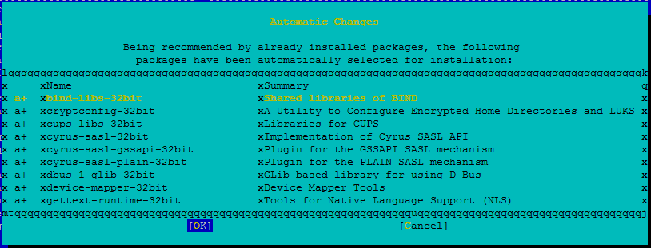

Package installation proceeds


Click Next

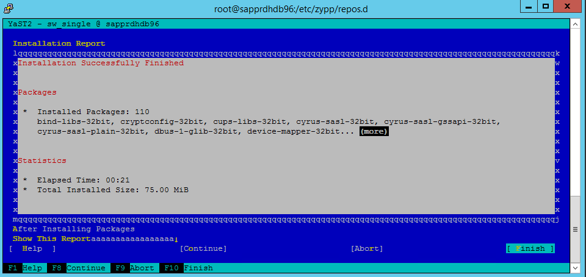

Click Finish

You also need to install the libqt4 and libyui-qt packages.
```
zypper -n install libqt4
```

```
zypper -n install libyui-qt
```


Yast2 should be able to open the graphical view now as shown here.
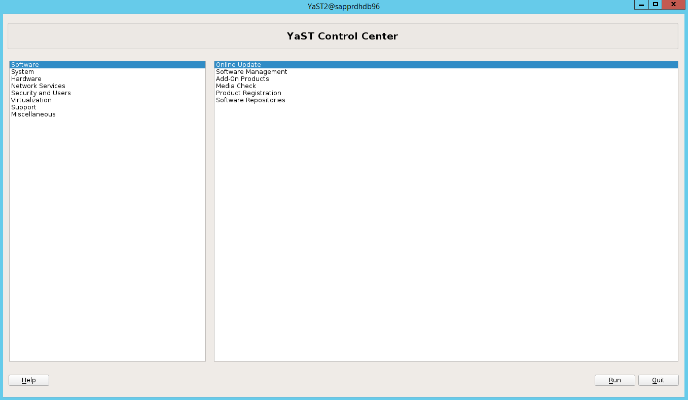

### Scenario 3: yast2 does not High Availability option
For the High Availability option to be visible on the yast2 control center, you need to install the additional packages.

Using Yast2>Software>Software management>Select the following patterns

- SAP HANA server base
- C/C++ Compiler and tools
- High availability
- SAP Application server base

The following screen shows the steps to install the patterns.

Using yast2 > Software > Software Management


Select the patterns

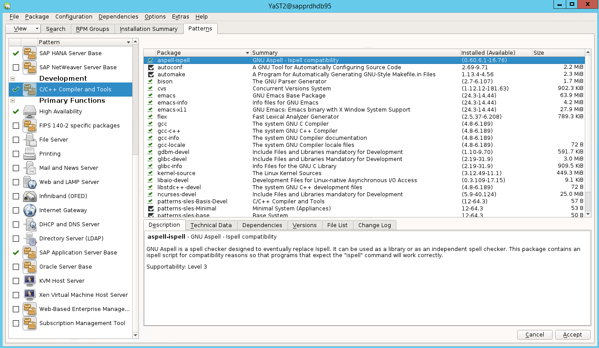


Click **Accept**


Click **Continue**


Click **Next** when the installation is complete

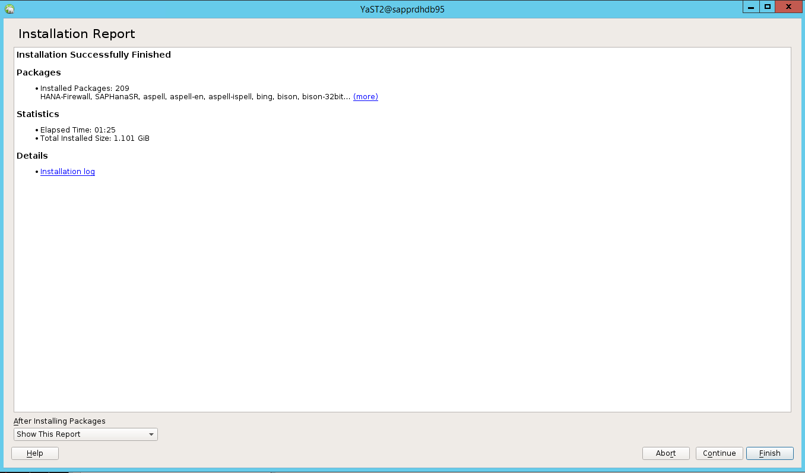

### Scenario 4: HANA Installation fails with gcc assemblies error
The HANA installation fails with following error.


To fix the issue, you need to install libraries (libgcc_sl and libstdc++6) as following.


### Scenario 5: Pacemaker service fails

The following issue occurred during the pacemaker service start.

```
sapprdhdb95:/ # systemctl start pacemaker
A dependency job for pacemaker.service failed. See 'journalctl -xn' for details.
```
```
sapprdhdb95:/ # journalctl -xn
-- Logs begin at Thu 2017-09-28 09:28:14 EDT, end at Thu 2017-09-28 21:48:27 EDT. --
Sep 28 21:48:27 sapprdhdb95 corosync[68812]: [SERV  ] Service engine unloaded: corosync configuration map
Sep 28 21:48:27 sapprdhdb95 corosync[68812]: [QB    ] withdrawing server sockets
Sep 28 21:48:27 sapprdhdb95 corosync[68812]: [SERV  ] Service engine unloaded: corosync configuration ser
Sep 28 21:48:27 sapprdhdb95 corosync[68812]: [QB    ] withdrawing server sockets
Sep 28 21:48:27 sapprdhdb95 corosync[68812]: [SERV  ] Service engine unloaded: corosync cluster closed pr
Sep 28 21:48:27 sapprdhdb95 corosync[68812]: [QB    ] withdrawing server sockets
Sep 28 21:48:27 sapprdhdb95 corosync[68812]: [SERV  ] Service engine unloaded: corosync cluster quorum se
Sep 28 21:48:27 sapprdhdb95 corosync[68812]: [SERV  ] Service engine unloaded: corosync profile loading s
Sep 28 21:48:27 sapprdhdb95 corosync[68812]: [MAIN  ] Corosync Cluster Engine exiting normally
Sep 28 21:48:27 sapprdhdb95 systemd[1]: Dependency failed for Pacemaker High Availability Cluster Manager
-- Subject: Unit pacemaker.service has failed
-- Defined-By: systemd
-- Support: https://lists.freedesktop.org/mailman/listinfo/systemd-devel
--
-- Unit pacemaker.service has failed.
--
-- The result is dependency.
```
```
sapprdhdb95:/ # tail -f /var/log/messages
2017-09-28T18:44:29.675814-04:00 sapprdhdb95 corosync[57600]:   [QB    ] withdrawing server sockets
2017-09-28T18:44:29.676023-04:00 sapprdhdb95 corosync[57600]:   [SERV  ] Service engine unloaded: corosync cluster closed process group service v1.01
2017-09-28T18:44:29.725885-04:00 sapprdhdb95 corosync[57600]:   [QB    ] withdrawing server sockets
2017-09-28T18:44:29.726069-04:00 sapprdhdb95 corosync[57600]:   [SERV  ] Service engine unloaded: corosync cluster quorum service v0.1
2017-09-28T18:44:29.726164-04:00 sapprdhdb95 corosync[57600]:   [SERV  ] Service engine unloaded: corosync profile loading service
2017-09-28T18:44:29.776349-04:00 sapprdhdb95 corosync[57600]:   [MAIN  ] Corosync Cluster Engine exiting normally
2017-09-28T18:44:29.778177-04:00 sapprdhdb95 systemd[1]: Dependency failed for Pacemaker High Availability Cluster Manager.
2017-09-28T18:44:40.141030-04:00 sapprdhdb95 systemd[1]: [/usr/lib/systemd/system/fstrim.timer:8] Unknown lvalue 'Persistent' in section 'Timer'
2017-09-28T18:45:01.275038-04:00 sapprdhdb95 cron[57995]: pam_unix(crond:session): session opened for user root by (uid=0)
2017-09-28T18:45:01.308066-04:00 sapprdhdb95 CRON[57995]: pam_unix(crond:session): session closed for user root
```

To fix it, delete the following line from the file */usr/lib/systemd/system/fstrim.timer*

```
Persistent=true
```


### Scenario 6: Node 2 unable to join the cluster

When joining the node2 to the existing cluster using *ha-cluster-join* command, the following error occurred.

```
ERROR: Can’t retrieve SSH keys from <Primary Node>
```


To fix, run the following on both the nodes

```
ssh-keygen -q -f /root/.ssh/id_rsa -C 'Cluster Internal' -N ''
cat /root/.ssh/id_rsa.pub >> /root/.ssh/authorized_keys
```


After the preceding fix, node2 should get added to the cluster

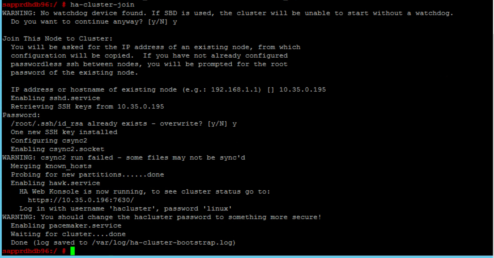

## 10. General Documentation
You can find more information on SUSE HA setup in the following articles: 

- [SAP HANA SR Performance Optimized Scenario](https://www.suse.com/docrep/documents/ir8w88iwu7/suse_linux_enterprise_server_for_sap_applications_12_sp1.pdf )
- [Storage-based fencing](https://www.suse.com/documentation/sle_ha/book_sleha/data/sec_ha_storage_protect_fencing.html)
- [Blog - Using Pacemaker Cluster for SAP HANA- Part 1](https://blogs.sap.com/2017/11/19/be-prepared-for-using-pacemaker-cluster-for-sap-hana-part-1-basics/)
- [Blog - Using Pacemaker Cluster for SAP HANA- Part 2](https://blogs.sap.com/2017/11/19/be-prepared-for-using-pacemaker-cluster-for-sap-hana-part-2-failure-of-both-nodes/)
