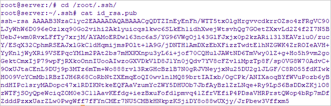
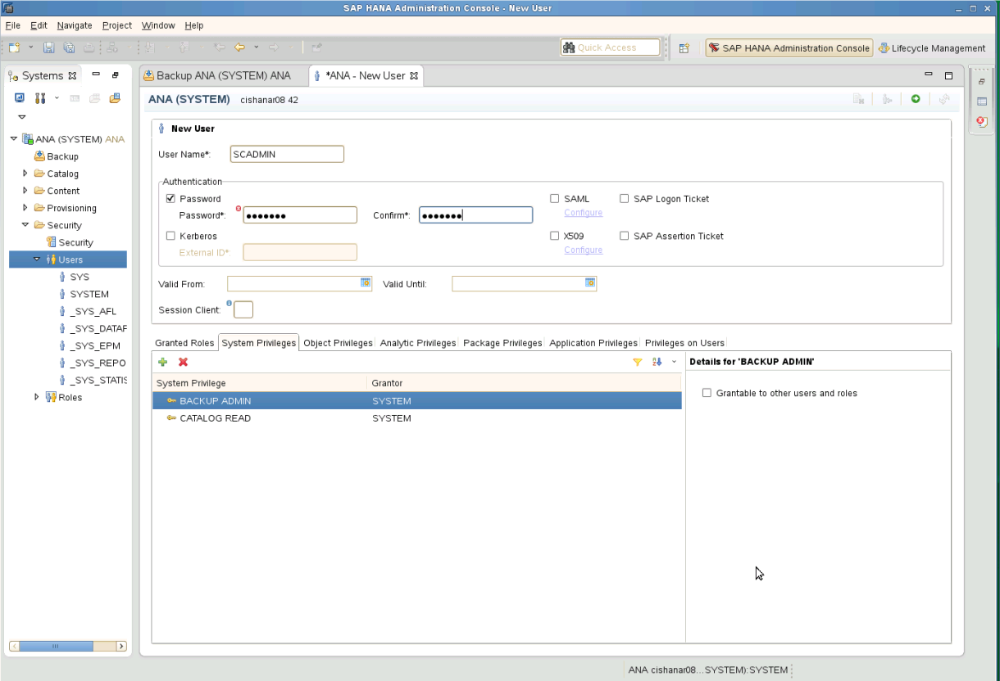
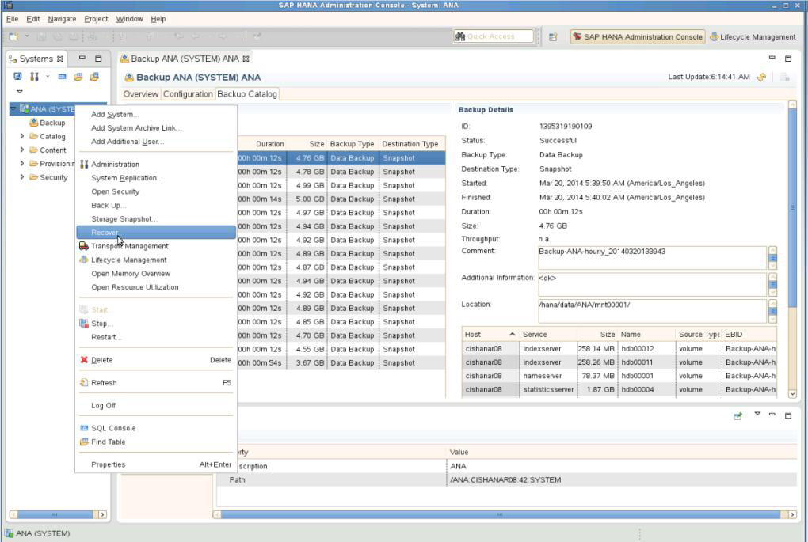
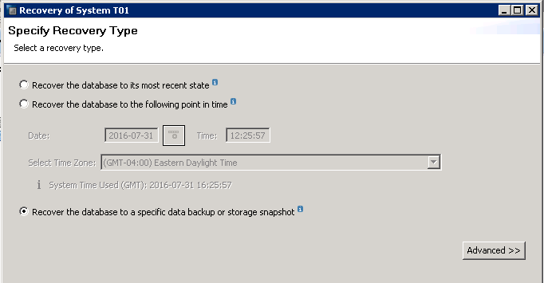
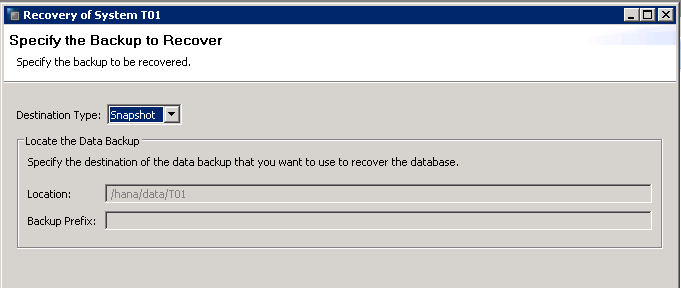
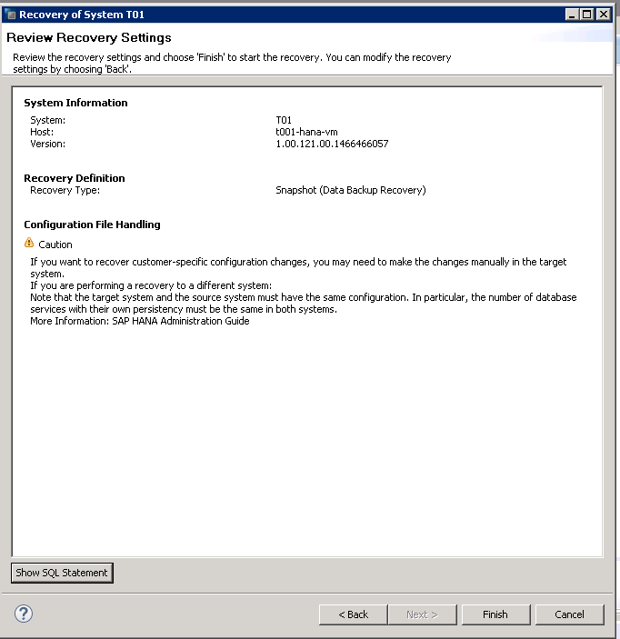
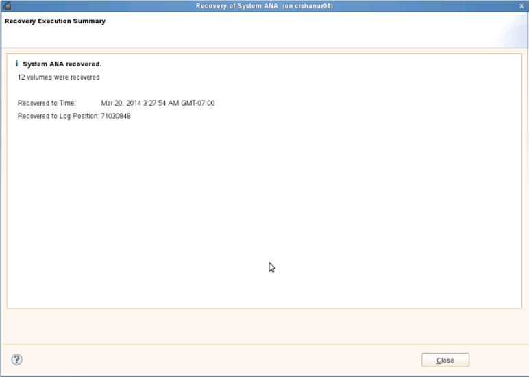
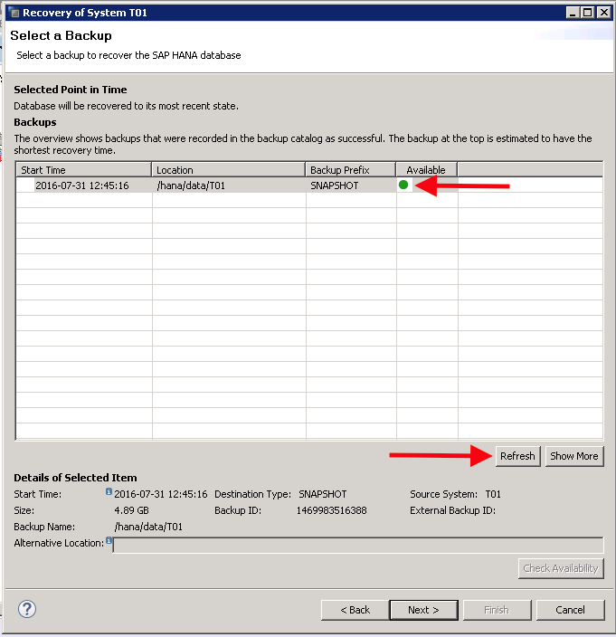
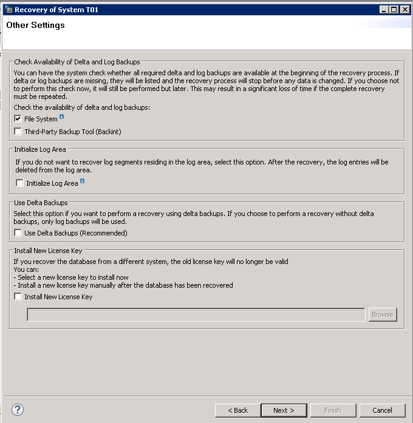

# Backup and restore

>[!IMPORTANT]
>This documentation is no replacement of the SAP HANA administration documentation or SAP Notes. It's expected that the reader has a solid understanding of and expertise in SAP HANA administration and operations, especially with the topics of backup, restore, high availability, and disaster recovery. In this documentation, screenshots from SAP HANA Studio are shown. Content, structure, and the nature of the screens of SAP administration tools and the tools themselves might change from SAP HANA release to release.

It's important that you exercise steps and processes taken in your environment and with your HANA versions and releases. Some processes described in this documentation are simplified for a better general understanding and are not meant to be used as detailed steps for eventual operation handbooks. If you want to create operation handbooks for your configurations, you need to test and exercise your processes and document the processes related to your specific configurations. 

One of the most important aspects to operating databases is to protect them from catastrophic events. The cause of these events can be anything from natural disasters to simple user errors.

Backing up a database, with the ability to restore it to any point in time (such as before someone deleted critical data), enables restoration to a state that is as close as possible to the way it was prior to the disruption.

Two types of backups must be performed for best results:

- Database backups: Full, incremental, or differential backups
- Transaction log backups

In addition to full-database backups performed at an application level, you can perform backups with storage snapshots. Storage snapshots do not replace transaction log backups. Transaction log backups remain important to restore the database to a certain point in time or to empty the logs from already committed transactions. However, storage snapshots can accelerate recovery by quickly providing a roll-forward image of the database. 

SAP HANA on Azure (Large Instances) offers two backup and restore options:

- Do-it-yourself (DIY). After you calculate to ensure there is enough disk space, perform full database and log backups by using one of the following disk backup methods. You can back up either directly to volumes attached to the HANA Large Instance units, or to Network File Shares (NFS) that are set up in an Azure virtual machine (VM). In the latter case, customers set up a Linux VM in Azure, attach Azure Storage to the VM, and share the storage through a configured NFS server in that VM. If you perform the backup against volumes that directly attach to HANA Large Instance units, you need to copy the backups to an Azure storage account (after you set up an Azure VM that exports NFS shares that are based on Azure Storage). You can also use either an Azure backup vault or Azure cold storage. 

   Another option is to use a third-party data protection tool to store the backups after they are copied to an Azure storage account. The DIY backup option might also be necessary for data that you need to store for longer periods of time for compliance and auditing purposes. In all cases, the backups are copied into NFS shares represented through a VM and Azure Storage.

- Infrastructure backup and restore functionality. You can also use the backup and restore functionality that the underlying infrastructure of SAP HANA on Azure (Large Instances) provides. This option fulfills the need for backups and fast restores. The rest of this section addresses the backup and restore functionality that's offered with HANA Large Instances. This section also covers the relationship backup and restore has to the disaster recovery functionality offered by HANA Large Instances.

>   [!NOTE]
>   The snapshot technology that is used by the underlying infrastructure of HANA Large Instances has a dependency on SAP HANA snapshots. At this point, SAP  HANA snapshots do not work in conjunction with multiple tenants of SAP HANA multitenant database containers. If only one tenant is deployed, SAP HANA snapshots do work and this method can be used.

## Using storage snapshots of SAP HANA on Azure (Large Instances)

The storage infrastructure underlying SAP HANA on Azure (Large Instances) supports storage snapshots of volumes. Both backup and restoration of volumes is supported, with the following considerations:

- Instead of full database backups, storage volume snapshots are taken on a frequent basis.
- When triggering a snapshot over /hana/data and /hana/shared (includes /usr/sap) volumes, the snapshot technology initiates an SAP HANA snapshot before it executes the storage snapshot. This SAP HANA snapshot is the setup point for eventual log restorations after recovery of the storage snapshot. For HANA snapshot to be successful you need an active HANA instance.  In HSR scenario, storage snapshot is not supported on current secondary node where HANA snapshot can’t be performed.
- After the storage snapshot has been executed successfully, the SAP HANA snapshot is deleted.
- Transaction log backups are taken frequently and are stored in the /hana/logbackups volume, or in Azure. You can trigger the /hana/logbackups volume that contains the transaction log backups to take a snapshot separately. In that case, you do not need to execute an HANA snapshot.
- If you must restore a database to a certain point in time, request that Microsoft Azure Support (for a production outage) or SAP HANA on Azure Service Management restore to a certain storage snapshot. An example is a planned restoration of a sandbox system to its original state.
- The SAP HANA snapshot that's included in the storage snapshot is an offset point for applying transaction log backups that have been executed and stored after the storage snapshot was taken.
- These transaction log backups are taken to restore the database back to a certain point in time.

You can perform storage snapshots targeting three classes of volumes:

- A combined snapshot over /hana/data, and /hana/shared (includes /usr/sap). This snapshot requires the creation of an SAP HANA snapshot as preparation for the storage snapshot. The SAP HANA snapshot makes sure that the database is in a consistent state from a storage point of view. And that for the restore process that is a point to set up on.
- A separate snapshot over /hana/logbackups.
- An operating system partition.

Get the latest snapshot scripts and documentation from [GitHub](https://github.com/Azure/hana-large-instances-self-service-scripts). When you download the snapshot script package from the [GitHub](https://github.com/Azure/hana-large-instances-self-service-scripts), you also get the PDF documentation for the scripts as part of the script package. Each script package has its own PDF documentation.

## Storage snapshot considerations

>[!NOTE]
>Storage snapshots consume storage space that has been allocated to the HANA Large Instance units. You need to consider the following aspects of scheduling storage snapshots and how many storage snapshots to keep. 

The specific mechanics of storage snapshots for SAP HANA on Azure (Large Instances) include:

- A specific storage snapshot (at the point in time when it is taken) consumes little storage.
- As data content changes and the content in SAP HANA data files change on the storage volume, the snapshot needs to store the original block content, as well as the data changes.
- As a result, the storage snapshot increases in size. The longer the snapshot exists, the larger the storage snapshot becomes.
- The more changes that are made to the SAP HANA database volume over the lifetime of a storage snapshot, the larger the space consumption of the storage snapshot.

SAP HANA on Azure (Large Instances) comes with fixed volume sizes for the SAP HANA data and log volumes. Performing snapshots of those volumes eats into your volume space. You need to determine when to schedule storage snapshots. You also need to monitor the space consumption of the storage volumes, as well as manage the number of snapshots that you store. You can disable the storage snapshots when you either import masses of data or perform other significant changes to the HANA database. 


The following sections provide information for performing these snapshots, including general recommendations:

- Though the hardware can sustain 255 snapshots per volume, you want to stay well below this number. Recommendation is 250 or less.
- Before you perform storage snapshots, monitor and keep track of free space.
- Lower the number of storage snapshots based on free space. You can lower the number of snapshots that you keep, or you can extend the volumes. You can order additional storage in 1-terabyte units.
- During activities such as moving data into SAP HANA with SAP platform migration tools (R3load) or restoring SAP HANA databases from backups, disable storage snapshots on the /hana/data volume. 
- During larger reorganizations of SAP HANA tables, storage snapshots should be avoided, if possible.
- Storage snapshots are a prerequisite to taking advantage of the disaster recovery capabilities of SAP HANA on Azure (Large Instances).

## Prerequisites for using self-service storage snapshots

To ensure that the snapshot script executes successfully, make sure that Perl is installed on the Linux operating system on the HANA Large Instances server. Perl comes pre-installed on your HANA Large Instance unit. To check the Perl version, use the following command:

`perl -v`


## Set up storage snapshots

To set up storage snapshots with HANA Large Instances, follow these steps:
1. Make sure that Perl is installed on the Linux operating system on the HANA Large Instances server.
1. Modify the /etc/ssh/ssh\_config to add the line _MACs hmac-sha1_.
1. Create an SAP HANA backup user account on the master node for each SAP HANA instance you are running, if applicable.
1. Install the SAP HANA HDB client on all the SAP HANA Large Instances servers.
1. On the first SAP HANA Large Instances server of each region, create a public key to access the underlying storage infrastructure that controls snapshot creation.
1. Copy the scripts and configuration file from [GitHub](https://github.com/Azure/hana-large-instances-self-service-scripts) to the location of **hdbsql** in the SAP HANA installation.
1. Modify the *HANABackupDetails.txt* file as necessary for the appropriate customer specifications.

Get the latest snapshot scripts and documentation from [GitHub](https://github.com/Azure/hana-large-instances-self-service-scripts). When you download the snapshot script package from the [GitHub](https://github.com/Azure/hana-large-instances-self-service-scripts), you also get the PDF documentation for the scripts as part of the script package. Each script package has its own PDF documentation.

### Consideration for MCOD scenarios
If you're running an [MCOD scenario](https://launchpad.support.sap.com/#/notes/1681092) with multiple SAP HANA instances on one HANA Large Instance unit, you have separate storage volumes provisioned for each of the SAP HANA instances. In the current version of the self-service snapshot automation, you can't initiate separate snapshots on every HANA instance system ID (SID). The functionality delivers checks for the registered SAP HANA instances of the server in the configuration file (see later in this article), and executes a simultaneous snapshot of the volumes of all the instances registered on the unit.
 

### Step 1: Install the SAP HANA HDB client

The Linux operating system installed on SAP HANA on Azure (Large Instances) includes the folders and scripts necessary to execute SAP HANA storage snapshots for backup and disaster recovery purposes. Check for more recent releases in [GitHub](https://github.com/Azure/hana-large-instances-self-service-scripts). The most recent release version of the scripts is 3.x. Different scripts might have different minor releases within the same major release.

>[!IMPORTANT]
>When moving from version 2.1 to version 3.x of the scripts, note that the structure of the configuration file and some syntax has changed. See the callouts in the specific sections. 

It is your responsibility to install the SAP HANA HDB client on the HANA Large Instance units while you are installing SAP HANA.

### Step 2: Change the /etc/ssh/ssh\_config

Change `/etc/ssh/ssh_config` by adding the _MACs hmac-sha1_ line as shown here:
```
#   RhostsRSAAuthentication no
#   RSAAuthentication yes
#   PasswordAuthentication yes
#   HostbasedAuthentication no
#   GSSAPIAuthentication no
#   GSSAPIDelegateCredentials no
#   GSSAPIKeyExchange no
#   GSSAPITrustDNS no
#   BatchMode no
#   CheckHostIP yes
#   AddressFamily any
#   ConnectTimeout 0
#   StrictHostKeyChecking ask
#   IdentityFile ~/.ssh/identity
#   IdentityFile ~/.ssh/id_rsa
#   IdentityFile ~/.ssh/id_dsa
#   Port 22
Protocol 2
#   Cipher 3des
#   Ciphers aes128-ctr,aes192-ctr,aes256-ctr,arcfour256,arcfour128,aes128-cbc,3des-cbc
#   MACs hmac-md5,hmac-sha1,umac-64@openssh.com,hmac-ripemd160
MACs hmac-sha1
#   EscapeChar ~
#   Tunnel no
#   TunnelDevice any:any
#   PermitLocalCommand no
#   VisualHostKey no
#   ProxyCommand ssh -q -W %h:%p gateway.example.com
```

### Step 3: Create a public key

To enable access to the storage snapshot interfaces of your HANA Large Instance tenant, you need to establish a sign-in procedure through a public key. On the first SAP HANA on Azure (Large Instances) server in your tenant, create a public key to be used to access the storage infrastructure. The public key ensures that a password is not required to sign in to the storage snapshot interfaces. Creating a public key also means that you do not need to maintain password credentials. In Linux on the SAP HANA Large Instances server, execute the following command to generate the public key:
```
  ssh-keygen –t dsa –b 1024
```
The new location is **_/root/.ssh/id\_dsa.pub**. Do not enter an actual password, or else you are required to enter the password each time you sign in. Instead, select **Enter** twice to remove the "enter password" requirement for signing in.

Make sure that the public key was corrected as expected by changing folders to **/root/.ssh/** and then executing the `ls` command. If the key is present, you can copy it by running the following command:



At this point, contact SAP HANA on Azure Service Management and provide them with the public key. The service representative uses the public key to register it in the underlying storage infrastructure that is carved out for your HANA Large Instance tenant.

### Step 4: Create an SAP HANA user account

To initiate the creation of SAP HANA snapshots, you need to create a user account in SAP HANA that the storage snapshot scripts can use. Create an SAP HANA user account within SAP HANA Studio for this purpose. The user must be created under the SYSTEMDB and NOT under the SID database for MDC. In the single container environment, user is setup under the tenant database. This account must have the following privileges: **Backup Admin** and **Catalog Read**. In this example, the username is **SCADMIN**. The user account name created in HANA Studio is case-sensitive. Make sure to select **No** for requiring the user to change the password on their next sign-in.



If you use MCOD deployments with multiple SAP HANA instances on one unit, you need to repeat this step for every SAP HANA instance.

### Step 5: Authorize the SAP HANA user account

In this step, you authorize the SAP HANA user account that you created, so that the scripts don't need to submit passwords at runtime. The SAP HANA command `hdbuserstore` enables the creation of an SAP HANA user key, which is stored on one or more SAP HANA nodes. The user key lets the user access SAP HANA without having to manage passwords from within the scripting process. The scripting process is discussed later in this article.

>[!IMPORTANT]
>Run the following command under the user the scripts are planned to be executed. Otherwise, the script cannot work properly.

Enter the `hdbuserstore` command as follows:

**For non-MDC HANA setup**
```
hdbuserstore set <key> <host>:<3[instance]15> <user> <password>
```

**For MDC HANA setup**
```
hdbuserstore set <key> <host>:<3[instance]13> <user> <password>
```

In the following example, the user is **SCADMIN01**, the hostname is **lhanad01**, and the instance number is **01**:
```
hdbuserstore set SCADMIN01 lhanad01:30115 <backup username> <password>
```
If you use an HANA MCOD deployment with multiple SAP HANA instances on one unit, you need to repeat the step for every SAP HANA instance and the associated backup user on the unit.

If you have an SAP HANA scale-out configuration, you need to manage all scripting from a single server. In this example, the SAP HANA key **SCADMIN01** must be altered for each host in a way that shows which host is related to the key. Amend the SAP HANA backup account with the instance number of the HANA DB. The key must have administrative privileges on the host to which it's assigned, and the backup user for scale-out configurations must have access rights to all the SAP HANA instances. Assuming the three scale-out nodes have the names **lhanad01**, **lhanad02**, and **lhanad03**, the sequence of commands looks like this:

```
hdbuserstore set SCADMIN01 lhanad01:30115 SCADMIN <password>
hdbuserstore set SCADMIN01 lhanad02:30115 SCADMIN <password>
hdbuserstore set SCADMIN01 lhanad03:30115 SCADMIN <password>
```

### Step 6: Get the snapshot scripts, configure the snapshots, and test the configuration and connectivity

Download the most recent version of the scripts from [GitHub](https://github.com/Azure/hana-large-instances-self-service-scripts). 
Copy the downloaded scripts and the text file to the working directory for **hdbsql**. For current HANA installations, this directory is in the following format: /hana/shared/D01/exe/linuxx86\_64/hdb. 
``` 
azure_hana_backup.pl 
azure_hana_replication_status.pl 
azure_hana_snapshot_details.pl 
azure_hana_snapshot_delete.pl 
testHANAConnection.pl 
testStorageSnapshotConnection.pl 
removeTestStorageSnapshot.pl
azure_hana_dr_failover.pl
azure_hana_test_dr_failover.pl 
HANABackupCustomerDetails.txt 
``` 

When dealing with Perl scripts: 

- Never modify the scripts unless instructed by Microsoft Operations.
- When asked to modify the script or a parameter file, always use the Linux text editor such as “vi,” and not a Windows editor like Notepad. Using a Windows editor might corrupt the file format.
- Always use the latest scripts. You can download the latest version from GitHub.
- Use the same version of scripts across the landscape.
- Test the scripts and get comfortable with the parameters required and the output of the script before directly using them in the production system.
- Don’t change the mount point name of the server provisioned by Microsoft Operations. These scripts rely on these standard mount points to be available for a successful execution.


The purpose of the different scripts and files is as follows:

- **azure\_hana\_backup.pl**: This script is scheduled with the Linux Cron Scheduling utility to execute storage snapshots on either the HANA data and shared volumes, the /hana/logbackups volume, or the operating system.
- **azure\_hana\_replication\_status.pl**: This script provides the basic details around the replication status from the production site to the disaster recovery site. The script monitors to ensure that the replication is taking place, and it shows the size of the items that are being replicated. It also provides guidance if a replication is taking too long or if the link is down.
- **azure\_hana\_snapshot\_details.pl**: This script provides a list of basic details about all the snapshots, per volume, that exist in your environment. This script can be run on the primary server or on a server unit in the disaster recovery location. The script provides the following information, broken down by each volume that contains snapshots:
   * The size of total snapshots in a volume
   * The following details in each snapshot in that volume: 
      - Snapshot name 
      - Create time 
      - Size of the snapshot
      - Frequency of the snapshot
      - HANA Backup ID associated with that snapshot, if relevant
- **azure\_hana\_snapshot\_delete.pl**: This script deletes a storage snapshot or a set of snapshots. You can use either the SAP HANA backup ID as found in HANA Studio, or the storage snapshot name. Currently, the backup ID is only tied to the snapshots created for the HANA data/log/shared volumes. Otherwise, if the snapshot ID is entered, it seeks all snapshots that match the entered snapshot ID.  
- **testHANAConnection.pl**: This script tests the connection to the SAP HANA instance and is required to set up the storage snapshots.
- **testStorageSnapshotConnection.pl**: This script has two purposes. First, it ensures that the HANA Large Instance unit that runs the scripts has access to the assigned storage virtual machine, and to the storage snapshot interface of your HANA Large Instances. The second purpose is to create a temporary snapshot for the HANA instance you are testing. This script should be run for every HANA instance on a server to ensure that the backup scripts function as expected.
- **removeTestStorageSnapshot.pl**: This script deletes the test snapshot created with the script **testStorageSnapshotConnection.pl**.
- **azure\_hana\_dr\_failover.pl**: This script initiates a DR failover into another region. The script needs to be executed on the HANA Large Instance unit in the DR region, or on the unit you want to fail over to. This script stops storage replication from the primary side to the secondary side, restores the latest snapshot on the DR volumes, and provides the mountpoints for the DR volumes.
- **azure\_hana\_test\_dr\_failover.pl**: This script performs a test failover into the DR site. Unlike the azure_hana_dr_failover.pl script, this execution does not interrupt the storage replication from primary to secondary. Instead, clones of the replicated storage volumes are created on the DR side, and the mountpoints of the cloned volumes are provided. 
- **HANABackupCustomerDetails.txt**: This file is a modifiable configuration file that you need to modify to adapt to your SAP HANA configuration. The *HANABackupCustomerDetails.txt* file is the control and configuration file for the script that runs the storage snapshots. Adjust the file for your purposes and setup. You receive the **Storage Backup Name** and the **Storage IP Address** from SAP HANA on Azure Service Management when your instances deploy. You cannot modify the sequence, ordering, or spacing of any of the variables in this file. If you do, the scripts do not run properly. Additionally, you receive the IP address of the scale-up node or the master node (if scale-out) from SAP HANA on Azure Service Management. You also know the HANA instance number that you get during the installation of SAP HANA. Now, you need to add a backup name to the configuration file.

For a scale-up or scale-out deployment, the configuration file would look like the following example after you fill in the server name of the HANA Large Instance unit and the server IP address. Fill in all necessary fields for each SAP HANA SID you want to back up or recover.

You can also comment out rows of instances that you don't want to back up for a period of time by adding a "#" in front of a required field. You also don't need to enter all SAP HANA Instances that are contained on a server if there is no need to back up or recover that particular instance. The format must be kept for all fields, or all scripts throw an error message and the script terminates. You can delete additional required rows of any SID information details you're not using after the last SAP HANA instance in use. All rows must be either filled in, commented out, or deleted.

>[!IMPORTANT]
>The structure of the file changed with the move from version 2.1 to version 3.x. If you want to use the 3.x version scripts, you need to adapt the configuration file structure. 


```
HANA Server Name: testing01
HANA Server IP Address: 172.18.18.50
```

For each instance that you configure on the HANA Large Instance unit, or for the scale-out configuration, you need to define the data as follows:

	
```
######***SID #1 Information***#####
SID1: h01
###Provided by Microsoft Operations###
SID1 Storage Backup Name: clt1h01backup
SID1 Storage IP Address: 172.18.18.11
######     Customer Provided    ######
SID1 HANA instance number: 00
SID1 HANA HDBuserstore Name: SCADMINH01
```
For scale-out and HANA System Replication configurations, repeat this configuration on each of the nodes. This measure makes sure that in failure cases, the backups and eventual storage replication continue to work.   

After you put all the configuration data into the *HANABackupCustomerDetails.txt* file, check whether the configurations are correct for the HANA instance data. Use the script `testHANAConnection.pl`, which is independent of an SAP HANA scale-up or scale-out configuration.

```
testHANAConnection.pl
```

If you have an SAP HANA scale-out configuration, ensure that the master HANA instance has access to all the required HANA servers and instances. There are no parameters to the test script, but you must add your data into the *HANABackupCustomerDetails.txt* configuration file for the script to run properly. Only the shell command error codes are returned, so it is not possible for the script to error check every instance. Even so, the script does provide some helpful comments for you to double-check.

To run the script, enter the following command:
```
 ./testHANAConnection.pl
```
If the script successfully obtains the status of the HANA instance, it displays a message that the HANA connection was successful.


The next test step is to check the connectivity to the storage based on the data you put into the *HANABackupCustomerDetails.txt* configuration file, and then execute a test snapshot. Before you execute the `azure_hana_backup.pl` script, you must run this test. If a volume contains no snapshots, it is impossible to determine whether the volume is empty, or if there is an SSH failure to obtain the snapshot details. For this reason, the script executes two steps:

- It verifies that the tenant's storage virtual machine and interfaces are accessible for the scripts to execute snapshots.
- It creates a test, or dummy, snapshot for each volume by HANA instance.

For this reason, the HANA instance is included as an argument. If the execution fails, it is not possible to provide error checking for the storage connection. Even if there is no error checking, the script provides helpful hints.

1. Execute the sequence of commands to perform this test:

   ```
   ssh <StorageUserName>@<StorageIP>
   ```

   Both the storage user name and the storage IP address have been provided to you at the handover of the HANA Large Instance unit.

1. Run the test script:
   ```
    ./testStorageSnapshotConnection.pl
   ```

The script tries to sign in to the storage by using the public key provided in the previous setup steps, and with the data configured in the *HANABackupCustomerDetails.txt* file. If sign-in is successful, the following content is shown:

```
**********************Checking access to Storage**********************
Storage Access successful!!!!!!!!!!!!!!
```

If problems occur in connecting to the storage console, the output looks like this:

```
**********************Checking access to Storage**********************
WARNING: Storage check status command 'volume show -type RW -fields volume' failed: 65280
WARNING: Please check the following:
WARNING: Was publickey sent to Microsoft Service Team?
WARNING: If passphrase entered while using tool, publickey must be re-created and passphrase must be left blank for both entries
WARNING: Ensure correct IP address was entered in HANABackupCustomerDetails.txt
WARNING: Ensure correct Storage backup name was entered in HANABackupCustomerDetails.txt
WARNING: Ensure that no modification in format HANABackupCustomerDetails.txt like additional lines, line numbers or spacing
WARNING: ******************Exiting Script*******************************
```

After a successful sign-in to the storage virtual machine interfaces, the script continues with phase 2 and creates a test snapshot. The output is shown here for a three-node scale-out configuration of SAP HANA:

```
**********************Creating Storage snapshot**********************
Taking snapshot testStorage.recent for hana_data_hm3_mnt00001_t020_dp ...
Snapshot created successfully.
Taking snapshot testStorage.recent for hana_data_hm3_mnt00001_t020_vol ...
Snapshot created successfully.
Taking snapshot testStorage.recent for hana_data_hm3_mnt00002_t020_dp ...
Snapshot created successfully.
Taking snapshot testStorage.recent for hana_data_hm3_mnt00002_t020_vol ...
Snapshot created successfully.
Taking snapshot testStorage.recent for hana_data_hm3_mnt00003_t020_dp ...
Snapshot created successfully.
Taking snapshot testStorage.recent for hana_data_hm3_mnt00003_t020_vol ...
Snapshot created successfully.
Taking snapshot testStorage.recent for hana_log_backups_hm3_t020_dp ...
Snapshot created successfully.
Taking snapshot testStorage.recent for hana_log_backups_hm3_t020_vol ...
Snapshot created successfully.
Taking snapshot testStorage.recent for hana_log_hm3_mnt00001_t020_vol ...
Snapshot created successfully.
Taking snapshot testStorage.recent for hana_log_hm3_mnt00002_t020_vol ...
Snapshot created successfully.
Taking snapshot testStorage.recent for hana_log_hm3_mnt00003_t020_vol ...
Snapshot created successfully.
Taking snapshot testStorage.recent for hana_shared_hm3_t020_vol ...
Snapshot created successfully.
```

If the test snapshot has been executed successfully with the script, you can proceed with configuring the actual storage snapshots. If it is not successful, investigate the problems before moving forward. The test snapshot should stay around until the first real snapshots are done.


### Step 7: Perform snapshots

When the preparation steps are finished, you can start to configure the actual storage snapshot configuration. The script to be scheduled works with SAP HANA scale-up and scale-out configurations. For periodic and regular execution of the backup script, schedule the script by using the cron utility. 

You can create three types of snapshot backups:
- **HANA**: A combined snapshot backup in which the volumes that contain /hana/data and /hana/shared (which contains /usr/sap as well) are covered by the coordinated snapshot. A single file restore is possible from this snapshot.
- **Logs**: A snapshot backup of the /hana/logbackups volume. No HANA snapshot is triggered to execute this storage snapshot. This storage volume is meant to contain the SAP HANA transaction log backups. These are performed more frequently to restrict log growth and prevent potential data loss. A single file restore is possible from this snapshot. Don't lower the frequency to under 3 minutes.
- **Boot**: A snapshot of the volume that contains the boot logical unit number (LUN) of the HANA Large Instance. This snapshot backup is possible only with the Type I SKUs of HANA Large Instances. You can't perform single file restores from the snapshot of the volume that contains the boot LUN.


>[!NOTE]
> The call syntax for these three types of snapshots changed with the move to the version 3.x scripts, which support MCOD deployments. There is no need to specify the HANA SID of an instance anymore. You need to make sure that the SAP HANA instances of a unit are configured in the configuration file *HANABackupCustomerDetails.txt*.

>[!NOTE]
> When you execute the script for the first time, it might show some unexpected errors on the multi-SID environment. Rerunning the script fixes the issue.


The new call syntax for executing storage snapshots with the script *azure_hana_backup.pl* looks like this:

```
HANA backup covering /hana/data and /hana/shared (includes/usr/sap)
./azure_hana_backup.pl hana <snapshot_prefix> <snapshot_frequency> <number of snapshots retained>

For /hana/logbackups snapshot
./azure_hana_backup.pl logs <snapshot_prefix> <snapshot_frequency> <number of snapshots retained>

For snapshot of the volume storing the boot LUN
./azure_hana_backup.pl boot <HANA Large Instance Type> <snapshot_prefix> <snapshot_frequency> <number of snapshots retained>

```

The details of the parameters are as follows: 

- The first parameter characterizes the type of the snapshot backup. The values allowed are **hana**, **logs**, and **boot**. 
- The parameter **<HANA Large Instance Type>** is necessary for boot volume backups only. There are two valid values with "TypeI" or "TypeII" dependent on the HANA Large Instance Unit. To find out what type your unit is, see [SAP HANA (Large Instances) overview and architecture on Azure](https://docs.microsoft.com/azure/virtual-machines/workloads/sap/hana-overview-architecture).  
- The parameter **<snapshot_prefix>** is a snapshot or backup label for the type of snapshot. It has two purposes: one is for you to give it a name, so that you know what these snapshots are about. The second purpose is for the script *azure\_hana\_backup.pl* to determine the number of storage snapshots that are retained under that specific label. If you schedule two storage snapshot backups of the same type (like **hana**), with two different labels, and define that 30 snapshots should be kept for each, you end up with 60 storage snapshots of the volumes affected. Only alpha numeric (“A-Z,a-z,0-9”), underscore (“_”), and dash (“-“) characters are allowed. 
- The parameter **<snapshot_frequency>** is reserved for future developments and does not have any impact. Set it to "3min" when executing backups of the type **log**, and to "15min" when executing the other backup types.
- The parameter **<number of snapshots retained>** defines the retention of the snapshots indirectly by defining the number of snapshots with the same snapshot prefix (label). This parameter is important for scheduled executions through cron. If the number of snapshots with the same snapshot_prefix exceeds the number given by this parameter, the oldest snapshot is deleted before executing a new storage snapshot.

In the case of a scale-out, the script does additional checking to ensure that you can access all HANA servers. The script also checks that all HANA instances return the appropriate status of the instances before it creates an SAP HANA snapshot. The SAP HANA snapshot is followed by a storage snapshot.

The execution of the script `azure_hana_backup.pl` creates the storage snapshot in the following three phases:

1. Executes an SAP HANA snapshot
1. Executes a storage snapshot
1. Removes the SAP HANA snapshot that was created before the execution of the storage snapshot

To execute the script, call it from the HDB executable folder to which it was copied. 

The retention period is administered with the number of snapshots that are submitted as a parameter when you execute the script. The amount of time that is covered by the storage snapshots is a function of the period of execution, and of the number of snapshots submitted as a parameter when executing the script. If the number of snapshots that are kept exceeds the number that are named as a parameter in the call of the script, the oldest storage snapshot of the same label is deleted before a new snapshot is executed. The number you give as the last parameter of the call is the number you can use to control the number of snapshots that are kept. With this number, you can also control, indirectly, the disk space used for snapshots. 

> [!NOTE]
>As soon as you change the label, the counting starts again. You need to be strict in labeling, so your snapshots are not accidentally deleted.

## Snapshot strategies
The frequency of snapshots for the different types depends on whether you use the HANA Large Instance disaster recovery functionality. This functionality relies on storage snapshots, which might require special recommendations for the frequency and execution periods of the storage snapshots. 

In the considerations and recommendations that follow, the assumption is that you do *not* use the disaster recovery functionality that HANA Large Instances offers. Instead, you use the storage snapshots to have backups and be able to provide point-in-time recovery for the last 30 days. Given the limitations of the number of snapshots and space, customers have considered the following requirements:

- The recovery time for point-in-time recovery.
- The space used.
- The recovery point and recovery time objectives for potential recovery from a disaster.
- The eventual execution of HANA full-database backups against disks. Whenever a full-database backup against disks or the **backint** interface is performed, the execution of the storage snapshots fails. If you plan to execute full-database backups on top of storage snapshots, make sure that the execution of the storage snapshots is disabled during this time.
- The number of snapshots per volume (limited to 250).


For customers who don't use the disaster recovery functionality of HANA Large Instances, the snapshot period is less frequent. In such cases, customers perform the combined snapshots on /hana/data and /hana/shared (includes /usr/sap) in 12-hour or 24-hour periods, and they keep the snapshots for a month. The same is true with the snapshots of the log backup volume. However, the execution of SAP HANA transaction log backups against the log backup volume occurs in 5-minute to 15-minute periods.

Scheduled storage snapshots are best performed by using cron. Use the same script for all backups and disaster recovery needs, and that you modify the script inputs to match the various requested backup times. These snapshots are all scheduled differently in cron depending on their execution time: hourly, 12-hour, daily, or weekly. 

The following is an example of a cron schedule in /etc/crontab:
```
00 1-23 * * * ./azure_hana_backup.pl hana hourlyhana 15min 46
10 00 * * *  ./azure_hana_backup.pl hana dailyhana 15min 28
00,05,10,15,20,25,30,35,40,45,50,55 * * * * ./azure_hana_backup.pl logs regularlogback 3min 28
22 12 * * *  ./azure_hana_backup.pl logs dailylogback 3min 28
30 00 * * *  ./azure_hana_backup.pl boot TypeI dailyboot 15min 28
```
In the previous example, there is an hourly combined snapshot that covers the volumes that contain the /hana/data and /hana/shared (includes /usr/sap) locations. Use this type of snapshot for a faster point-in-time recovery within the past two days. Additionally, there is a daily snapshot on those volumes. So, you have two days of coverage by hourly snapshots, plus four weeks of coverage by daily snapshots. Additionally, the transaction log backup volume is backed up daily. These backups are kept for four weeks as well. As you see in the third line of crontab, the backup of the HANA transaction log is scheduled to execute every 5 minutes. The start times of the different cron jobs that execute storage snapshots are staggered, so that those snapshots are not executed all at once at a certain point in time. 

In the following example, you perform a combined snapshot that covers the volumes that contain the /hana/data and /hana/shared (including /usr/sap) locations on an hourly basis. You keep these snapshots for two days. The snapshots of the transaction log backup volumes are executed on a 5-minute basis and are kept for 4 hours. As before, the backup of the HANA transaction log file is scheduled to execute every 5 minutes. The snapshot of the transaction log backup volume is performed with a 2-minute delay after the transaction log backup has started. Within those 2 minutes, the SAP HANA transaction log backup should finish under normal circumstances. As before, the volume that contains the boot LUN is backed up once per day by a storage snapshot and is kept for four weeks.

```
10 0-23 * * * ./azure_hana_backup.pl hana hourlyhana 15min 48
0,5,10,15,20,25,30,35,40,45,50,55 * * * * ./azure_hana_backup.pl logs regularlogback 3min 28
2,7,12,17,22,27,32,37,42,47,52,57 * * * *  ./azure_hana_backup.pl logs logback 3min 48
30 00 * * *  ./azure_hana_backup.pl boot TypeII dailyboot 15min 28
```

The following graphic illustrates the sequences of the previous example, excluding the boot LUN:


SAP HANA performs regular writes against the /hana/log volume to document the committed changes to the database. On a regular basis, SAP HANA writes a savepoint to the /hana/data volume. As specified in crontab, an SAP HANA transaction log backup is executed every 5 minutes. You also see that an SAP HANA snapshot is executed every hour as a result of triggering a combined storage snapshot over the /hana/data and /hana/shared volumes. After the HANA snapshot succeeds, the combined storage snapshot is executed. As instructed in crontab, the storage snapshot on the /hana/logbackup volume is executed every 5 minutes, around 2 minutes after the HANA transaction log backup.

> 

>[!IMPORTANT]
> The use of storage snapshots for SAP HANA backups is valuable only when the snapshots are performed in conjunction with SAP HANA transaction log backups. These transaction log backups need to cover the time periods between the storage snapshots. 

If you've set a commitment to users of a point-in-time recovery of 30 days, you need to:

- In extreme cases, access a combined storage snapshot over /hana/data and /hana/shared that is 30 days old.
- Have contiguous transaction log backups that cover the time between any of the combined storage snapshots. So, the oldest snapshot of the transaction log backup volume needs to be 30 days old. This is not the case if you copy the transaction log backups to another NFS share that is located on Azure storage. In that case, you might pull old transaction log backups from that NFS share.

To benefit from storage snapshots and the eventual storage replication of transaction log backups, you need to change the location to which SAP HANA writes the transaction log backups. You can make this change in HANA Studio. Though SAP HANA backs up full log segments automatically, you should specify a log backup interval to be deterministic. This is especially true when you use the disaster recovery option, because you usually want to execute log backups with a deterministic period. In the following case, 15 minutes are set as the log backup interval.


You can also choose backups that are more frequent than every 15 minutes. A more frequent setting is often used in conjunction with disaster recovery functionality of HANA Large Instances. Some customers perform transaction log backups every 5 minutes.  

If the database has never been backed up, the final step is to perform a file-based database backup to create a single backup entry that must exist within the backup catalog. Otherwise, SAP HANA cannot initiate your specified log backups.


After your first successful storage snapshots have been executed, you can delete the test snapshot that was executed in step 6. To do so, run the script `removeTestStorageSnapshot.pl`:
```
./removeTestStorageSnapshot.pl
```

The following is an example of the script output:
```
Checking Snapshot Status for h80
**********************Checking access to Storage**********************
Storage Snapshot Access successful.
**********************Getting list of volumes that match HANA instance specified**********************
Collecting set of volumes hosting HANA matching pattern *h80* ...
Volume show completed successfully.
Adding volume hana_data_h80_mnt00001_t020_vol to the snapshot list.
Adding volume hana_log_backups_h80_t020_vol to the snapshot list.
Adding volume hana_shared_h80_t020_vol to the snapshot list.
**********************Adding list of snapshots to volume list**********************
Collecting set of snapshots for each volume hosting HANA matching pattern *h80* ...
**********************Displaying Snapshots by Volume**********************
hana_data_h80_mnt00001_t020_vol
Test_HANA_Snapshot.2018-02-06_1753.3
Test_HANA_Snapshot.2018-02-06_1815.2
….
Command completed successfully.
Exiting with return code: 0
Command completed successfully.
```


### Monitoring the number and size of snapshots on the disk volume

On a specific storage volume, you can monitor the number of snapshots and the storage consumption of those snapshots. The `ls` command doesn't show the snapshot directory or files. However, the Linux OS command `du` shows details about those storage snapshots, because they are stored on the same volumes. The command can be used with the following options:

- `du –sh .snapshot`: This option provides a total of all the snapshots within the snapshot directory.
- `du –sh --max-depth=1`: This option lists all the snapshots that are saved in the **.snapshot** folder and the size of each snapshot.
- `du –hc`: This option provides the total size used by all the snapshots.

Use these commands to make sure that the snapshots that are taken and stored are not consuming all the storage on the volumes.

>[!NOTE]
>The snapshots of the boot LUN are not visible with the previous commands.

### Getting details of snapshots
To get more details on snapshots, you can also use the script `azure_hana_snapshot_details.pl`. This script can be run in either location if there is an active server in the disaster recovery location. The script provides the following output, broken down by each volume that contains snapshots: 
   * The size of total snapshots in a volume
   * The following details in each snapshot in that volume: 
      - Snapshot name 
      - Create time 
      - Size of the snapshot
      - Frequency of the snapshot
      - HANA Backup ID associated with that snapshot, if relevant

The following is an example of the script execution syntax:

```
./azure_hana_snapshot_details.pl 
```

Because the script tries to retrieve the HANA backup ID, it needs to connect to the SAP HANA instance. This connection requires the configuration file *HANABackupCustomerDetails.txt* to be correctly set. An output of two snapshots on a volume might look like the following:

```
**********************************************************
****Volume: hana_shared_SAPTSTHDB100_t020_vol       ***********
**********************************************************
Total Snapshot Size:  411.8MB
----------------------------------------------------------
Snapshot:   customer.2016-09-20_1404.0
Create Time:   "Tue Sep 20 18:08:35 2016"
Size:   2.10MB
Frequency:   customer 
HANA Backup ID:   
----------------------------------------------------------
Snapshot:   customer2.2016-09-20_1532.0
Create Time:   "Tue Sep 20 19:36:21 2016"
Size:   2.37MB
Frequency:   customer2
HANA Backup ID:   
```


### Reducing the number of snapshots on a server

As explained earlier, you can reduce the number of certain labels of snapshots that you store. The last two parameters of the command to initiate a snapshot are the label and the number of snapshots you want to retain.

```
./azure_hana_backup.pl hana dailyhana 15min 28
```

In the previous example, the snapshot label is **dailyhana** and the number of snapshots with this label to be retained is **28**. As you respond to disk space consumption, you might want to reduce the number of stored snapshots. The easy way to reduce the number of snapshots to 15, for example, is to run the script with the last parameter set to **15**:

```
./azure_hana_backup.pl hana dailyhana 15min 15
```

If you run the script with this setting, the number of snapshots, including the new storage snapshot, is 15. The 15 most recent snapshots are kept, and the 15 older snapshots are deleted.

 >[!NOTE]
 > This script reduces the number of snapshots only if there are snapshots more than 1 hour old. The script does not delete snapshots that are less than 1 hour old. These restrictions are related to the optional disaster recovery functionality offered.

If you no longer want to maintain a set of snapshots with the backup label **hanadaily** in the syntax examples, you can execute the script with **0** as the retention number. All snapshots matching that label are then removed. However, removing all snapshots can affect the capabilities of HANA Large Instances disaster recovery functionality.

A second option to delete specific snapshots is to use the script `azure_hana_snapshot_delete.pl`. This script is designed to delete a snapshot or set of snapshots either by using the HANA backup ID as found in HANA Studio, or through the snapshot name itself. Currently, the backup ID is only tied to the snapshots created for the **hana** snapshot type. Snapshot backups of the type **logs** and **boot** do not perform an SAP HANA snapshot and so there is no backup ID to be found for those snapshots. If the snapshot name is entered, it looks for all snapshots on the different volumes that match the entered snapshot name. 

Call the script you need to specify the SID of the HANA instance by using the call syntax of the script:

```
./azure_hana_snapshot_delete.pl <SID>

```

Execute the script as user **root**.

If you select a snapshot, you can delete each snapshot individually. You first supply the volume that contains the snapshot, and then you supply the snapshot name. If the snapshot exists in that volume and is more than 1 hour old, it is deleted. You can find the volume names and snapshot names by executing the `azure_hana_snapshot_details` script. 

>[!IMPORTANT]
>If there is data that only exists on the snapshot you are deleting, after the snapshot is deleted, that data is lost forever.

  
## File-level restore from a storage snapshot
For the snapshot types **hana** and **logs**, you can access the snapshots directly on the volumes in the **.snapshot** directory. There is a subdirectory for each of the snapshots. You can copy each file in the state it was in at the point of the snapshot from that subdirectory into the actual directory structure. In the current version of the script,there is **NO** restore script provided for the snapshot restore as a self-service (though snapshot restore can be performed as part of the self-service DR scripts at the DR site during failover). You must contact the Microsoft operations team by opening a service request to restore a desired snapshot from the existing available snapshots.

>[!NOTE]
>Single file restore does not work for snapshots of the boot LUN independent of the type of the HANA Large Instance units. The **.snapshot** directory is not exposed in the boot LUN. 
 

## Recover to the most recent HANA snapshot

In a production-down scenario, the process of recovering from a storage snapshot can be initiated as a customer incident with Microsoft Azure Support. It is a high-urgency matter if data was deleted in a production system, and the only way to retrieve it is to restore the production database.

In a different situation, a point-in-time recovery might be low urgency and planned days in advance. You can plan this recovery with SAP HANA on Azure Service Management instead of raising a high-priority flag. For example, you might be planning to upgrade the SAP software by applying a new enhancement package. You then need to revert to a snapshot that represents the state before the enhancement package upgrade.

Before you send the request, you need to prepare. The SAP HANA on Azure Service Management team can then handle the request and provide the restored volumes. Afterward, you restore the HANA database based on the snapshots. 

The following shows you how to prepare for the request:

>[!NOTE]
>Your user interface might vary from the following screenshots, depending on the SAP HANA release that you are using.

1. Decide which snapshot to restore. Only the hana/data volume is restored unless you instruct otherwise. 

1. Shut down the HANA instance.

 

1. Unmount the data volumes on each HANA database node. If the data volumes are still mounted to the operating system, the restoration of the snapshot fails.
 

1. Open an Azure support request and include instructions about the restoration of a specific snapshot.

 - During the restoration: SAP HANA on Azure Service Management might ask you to attend a conference call to ensure coordination, verification, and confirmation that the correct storage snapshot is restored. 

 - After the restoration: SAP HANA on Azure Service Management notifies you when the storage snapshot has been restored.

1. After the restoration process is complete, remount all the data volumes.

 

1. Select the recovery options within SAP HANA Studio, if they do not automatically come up when you reconnect to HANA DB through SAP HANA Studio. The following example shows a restoration to the last HANA snapshot. A storage snapshot embeds one HANA snapshot. If you restore to the most recent storage snapshot, it should be the most recent HANA snapshot. (If you restore to an older storage snapshot, you need to locate the HANA snapshot based on the time the storage snapshot was taken.)

 

1. Select **Recover the database to a specific data backup or storage snapshot**.

 

1. Select **Specify backup without catalog**.

 

1. In the **Destination Type** list, select **Snapshot**.

 

1. Select **Finish** to start the recovery process.

 

1. The HANA database is restored and recovered to the HANA snapshot that's included in the storage snapshot.

 

### Recover to the most recent state

The following process restores the HANA snapshot that is included in the storage snapshot. It then restores the transaction log backups to the most recent state of the database before restoring the storage snapshot.

>[!IMPORTANT]
>Before you proceed, make sure that you have a complete and contiguous chain of transaction log backups. Without these backups, you cannot restore the current state of the database.

1. Complete steps 1-6 in [Recover to the most recent HANA snapshot](#recovering-to-the-most-recent-hana-snapshot).

1. Select **Recover the database to its most recent state**.

 

1. Specify the location of the most recent HANA log backups. The location needs to contain all the HANA transaction log backups from the HANA snapshot to the most recent state.

 

1. Select a backup as a base from which to recover the database. In this example, the HANA snapshot in the screenshot is the HANA snapshot that was included in the storage snapshot. 

 

1. Clear the **Use Delta Backups** check box if deltas do not exist between the time of the HANA snapshot and the most recent state.

 

1. On the summary screen, select **Finish** to start the restoration procedure.

 

### Recover to another point in time
To recover to a point in time between the HANA snapshot (included in the storage snapshot) and one that is later than the HANA snapshot point-in-time recovery, perform the following steps:

1. Make sure that you have all the transaction log backups from the HANA snapshot for the time you want to recover to.
1. Begin the procedure under [Recover to the most recent state](#recovering-to-the-most-recent-state).
1. In step 2 of the procedure, in the **Specify Recovery Type** window, select **Recover the database to the following point in time**, and then specify the point in time. 
1. Complete steps 3-6.

## Monitor the execution of snapshots

As you use storage snapshots of HANA Large Instances, you also need to monitor the execution of those snapshots. The script that executes a storage snapshot writes output to a file, and then saves it to the same location as the Perl scripts. A separate file is written for each storage snapshot. The output of each file shows the various phases that the snapshot script executes:

1. Finds the volumes that need to create a snapshot.
1. Finds the snapshots taken from these volumes.
1. Deletes eventual existing snapshots to match the number of snapshots you specified.
1. Creates an SAP HANA snapshot.
1. Creates the storage snapshot over the volumes.
1. Deletes the SAP HANA snapshot.
1. Renames the most recent snapshot to **.0**.

The most important part of the script cab identified is this part:
```
**********************Creating HANA snapshot**********************
Creating the HANA snapshot with command: "./hdbsql -n localhost -i 01 -U SCADMIN01 "backup data create snapshot"" ...
HANA snapshot created successfully.
**********************Creating Storage snapshot**********************
Taking snapshot hourly.recent for hana_data_lhanad01_t020_vol ...
Snapshot created successfully.
Taking snapshot hourly.recent for hana_log_backup_lhanad01_t020_vol ...
Snapshot created successfully.
Taking snapshot hourly.recent for hana_log_lhanad01_t020_vol ...
Snapshot created successfully.
Taking snapshot hourly.recent for hana_shared_lhanad01_t020_vol ...
Snapshot created successfully.
Taking snapshot hourly.recent for sapmnt_lhanad01_t020_vol ...
Snapshot created successfully.
**********************Deleting HANA snapshot**********************
Deleting the HANA snapshot with command: "./hdbsql -n localhost -i 01 -U SCADMIN01 "backup data drop snapshot"" ...
HANA snapshot deletion successfully.
```
You can see from this sample how the script records the creation of the HANA snapshot. In the scale-out case, this process is initiated on the master node. The master node initiates the synchronous creation of the SAP HANA snapshots on each of the worker nodes. The storage snapshot is then taken. After the successful execution of the storage snapshots, the HANA snapshot is deleted. The deletion of the HANA snapshot is initiated from the master node.


**Next steps**
- Refer  [Disaster Recovery principles and preparation](hana-concept-preparation.md).