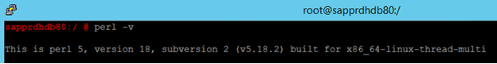
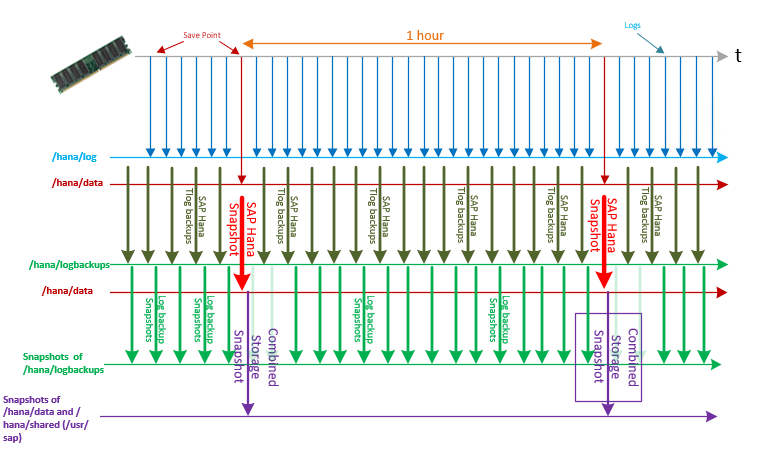
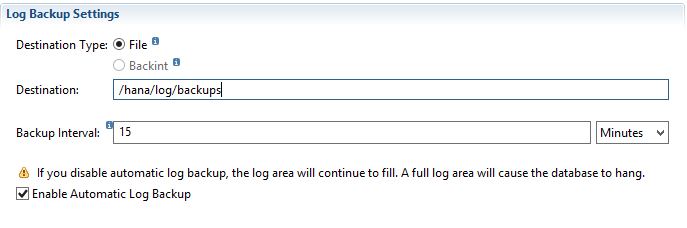
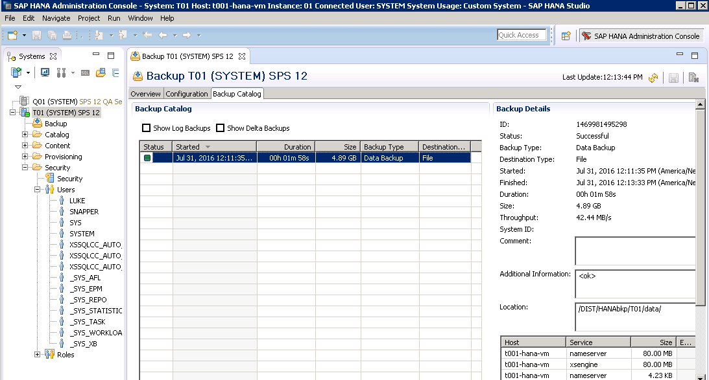
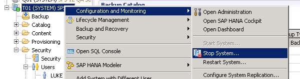
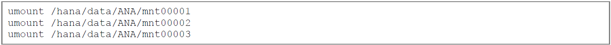
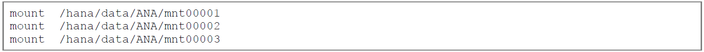

# Backup and restore

>[!IMPORTANT]
>This article isn't a replacement for the SAP HANA administration documentation or SAP Notes. We expect that you have a solid understanding of and expertise in SAP HANA administration and operations, especially for backup, restore, high availability, and disaster recovery. In this article, screenshots from SAP HANA Studio are shown. Content, structure, and the nature of the screens of SAP administration tools and the tools themselves might change from SAP HANA release to release.

It's important that you exercise steps and processes taken in your environment and with your HANA versions and releases. Some processes described in this article are simplified for a better general understanding. They aren't meant to be used as detailed steps for eventual operation handbooks. If you want to create operation handbooks for your configurations, test and exercise your processes and document the processes related to your specific configurations. 

One of the most important aspects of operating databases is to protect them from catastrophic events. The cause of these events can be anything from natural disasters to simple user errors.

Backing up a database, with the ability to restore it to any point in time, such as before someone deleted critical data, enables restoration to a state that's as close as possible to the way it was prior to the disruption.

Two types of backups must be performed to achieve the capability to restore:

- Database backups: Full, incremental, or differential backups
- Transaction log backups

In addition to full-database backups performed at an application level, you can perform backups with storage snapshots. Storage snapshots don't replace transaction log backups. Transaction log backups remain important to restore the database to a certain point in time or to empty the logs from already committed transactions. Storage snapshots can accelerate recovery by quickly providing a roll-forward image of the database. 

SAP HANA on Azure (Large Instances) offers two backup and restore options:

- **Do it yourself (DIY).** After you make sure that there's enough disk space, perform full database and log backups by using one of the following disk backup methods. You can back up either directly to volumes attached to the HANA Large Instance units or to NFS shares that are set up in an Azure virtual machine (VM). In the latter case, customers set up a Linux VM in Azure, attach Azure Storage to the VM, and share the storage through a configured NFS server in that VM. If you perform the backup against volumes that directly attach to HANA Large Instance units, copy the backups to an Azure storage account. Do this after you set up an Azure VM that exports NFS shares that are based on Azure Storage. You can also use either an Azure Backup vault or Azure cold storage. 

   Another option is to use a third-party data protection tool to store the backups after they're copied to an Azure storage account. The DIY backup option also might be necessary for data that you need to store for longer periods of time for compliance and auditing purposes. In all cases, the backups are copied into NFS shares represented through a VM and Azure Storage.

- **Infrastructure backup and restore functionality.** You also can use the backup and restore functionality that the underlying infrastructure of SAP HANA on Azure (Large Instances) provides. This option fulfills the need for backups and fast restores. The rest of this section addresses the backup and restore functionality that's offered with HANA Large Instances. This section also covers the relationship that backup and restore have to the disaster recovery functionality offered by HANA Large Instances.

> [!NOTE]
>   The snapshot technology that's used by the underlying infrastructure of HANA Large Instances has a dependency on SAP HANA snapshots. At this point, SAP HANA snapshots don't work in conjunction with multiple tenants of SAP HANA multitenant database containers. If only one tenant is deployed, SAP HANA snapshots do work and you can use this method.

## Use storage snapshots of SAP HANA on Azure (Large Instances)

The storage infrastructure underlying SAP HANA on Azure (Large Instances) supports storage snapshots of volumes. Both backup and restoration of volumes is supported, with the following considerations:

- Instead of full database backups, storage volume snapshots are taken on a frequent basis.
- When a snapshot is triggered over /hana/data and /hana/shared, which includes /usr/sap, volumes, the snapshot technology initiates an SAP HANA snapshot before it runs the storage snapshot. This SAP HANA snapshot is the setup point for eventual log restorations after recovery of the storage snapshot. For an HANA snapshot to be successful, you need an active HANA instance. In an HSR scenario, a storage snapshot isn't supported on a current secondary node where an HANA snapshot can’t be performed.
- After the storage snapshot runs successfully, the SAP HANA snapshot is deleted.
- Transaction log backups are taken frequently and stored in the /hana/logbackups volume or in Azure. You can trigger the /hana/logbackups volume that contains the transaction log backups to take a snapshot separately. In that case, you don't need to run an HANA snapshot.
- If you must restore a database to a certain point in time, for a production outage, request that Microsoft Azure Support or SAP HANA on Azure restore to a certain storage snapshot. An example is a planned restoration of a sandbox system to its original state.
- The SAP HANA snapshot that's included in the storage snapshot is an offset point for applying transaction log backups that ran and were stored after the storage snapshot was taken.
- These transaction log backups are taken to restore the database back to a certain point in time.

You can perform storage snapshots that target three classes of volumes:

- A combined snapshot over /hana/data and /hana/shared, which includes /usr/sap. This snapshot requires the creation of an SAP HANA snapshot as preparation for the storage snapshot. The SAP HANA snapshot ensures that the database is in a consistent state from a storage point of view. For the restore process, that's a point to set up on.
- A separate snapshot over /hana/logbackups.
- An operating system partition.

To get the latest snapshot scripts and documentation, see [GitHub](https://github.com/Azure/hana-large-instances-self-service-scripts/tree/master/snapshot_tools_v4.0). When you download the snapshot script package from [GitHub](https://github.com/Azure/hana-large-instances-self-service-scripts/tree/master/snapshot_tools_v4.0), you get three files. One of the files is documented in a PDF for the functionality provided. After you download the tool set, follow the instructions in "Get the snapshot tools."

## Storage snapshot considerations

>[!NOTE]
>Storage snapshots consume storage space that's allocated to the HANA Large Instance units. Consider the following aspects of scheduling storage snapshots and how many storage snapshots to keep. 

The specific mechanics of storage snapshots for SAP HANA on Azure (Large Instances) include:

- A specific storage snapshot at the point in time when it's taken consumes little storage.
- As data content changes and the content in SAP HANA data files change on the storage volume, the snapshot needs to store the original block content and the data changes.
- As a result, the storage snapshot increases in size. The longer the snapshot exists, the larger the storage snapshot becomes.
- The more changes that are made to the SAP HANA database volume over the lifetime of a storage snapshot, the larger the space consumption of the storage snapshot.

SAP HANA on Azure (Large Instances) comes with fixed volume sizes for the SAP HANA data and log volumes. Performing snapshots of those volumes eats into your volume space. You need to:

- Determine when to schedule storage snapshots.
- Monitor the space consumption of the storage volumes. 
- Manage the number of snapshots that you store. 

You can disable the storage snapshots when you either import masses of data or perform other significant changes to the HANA database. 


The following sections provide information for performing these snapshots and include general recommendations:

- Although the hardware can sustain 255 snapshots per volume, you want to stay well below this number. The recommendation is 250 or less.
- Before you perform storage snapshots, monitor and keep track of free space.
- Lower the number of storage snapshots based on free space. You can lower the number of snapshots that you keep, or you can extend the volumes. You can order additional storage in 1-terabyte units.
- During activities such as moving data into SAP HANA with SAP platform migration tools (R3load) or restoring SAP HANA databases from backups, disable storage snapshots on the /hana/data volume. 
- During larger reorganizations of SAP HANA tables, avoid storage snapshots if possible.
- Storage snapshots are a prerequisite to taking advantage of the disaster recovery capabilities of SAP HANA on Azure (Large Instances).

## Prerequisites for using self-service storage snapshots

To make sure that the snapshot script runs successfully, make sure that Perl is installed on the Linux operating system on the HANA Large Instances server. Perl comes preinstalled on your HANA Large Instance unit. To check the Perl version, use the following command:

`perl -v`




## Set up storage snapshots

To set up storage snapshots with HANA Large Instances, follow these steps.
1. Make sure that Perl is installed on the Linux operating system on the HANA Large Instances server.
1. Modify the /etc/ssh/ssh\_config to add the line _MACs hmac-sha1_.
1. Create an SAP HANA backup user account on the master node for each SAP HANA instance you run, if applicable.
1. Install the SAP HANA HDB client on all the SAP HANA Large Instances servers.
1. On the first SAP HANA Large Instances server of each region, create a public key to access the underlying storage infrastructure that controls snapshot creation.
1. Copy the scripts and configuration file from [GitHub](https://github.com/Azure/hana-large-instances-self-service-scripts/tree/master/snapshot_tools_v4.0) to the location of **hdbsql** in the SAP HANA installation.
1. Modify the *HANABackupDetails.txt* file as necessary for the appropriate customer specifications.

Get the latest snapshot scripts and documentation from [GitHub](https://github.com/Azure/hana-large-instances-self-service-scripts/tree/master/snapshot_tools_v4.0). For the steps listed previously, see [Microsoft snapshot tools for SAP HANA on Azure](https://github.com/Azure/hana-large-instances-self-service-scripts/blob/master/snapshot_tools_v4.0/Microsoft%20Snapshot%20Tools%20for%20SAP%20HANA%20on%20Azure%20v4.0.pdf).

### Consideration for MCOD scenarios
If you run an [MCOD scenario](https://launchpad.support.sap.com/#/notes/1681092) with multiple SAP HANA instances on one HANA Large Instance unit, you have separate storage volumes provisioned for each of the SAP HANA instances. For more information on MDC and other considerations, see "Important things to remember" in [Microsoft snapshot tools for SAP HANA on Azure](https://github.com/Azure/hana-large-instances-self-service-scripts/blob/master/snapshot_tools_v4.0/Microsoft%20Snapshot%20Tools%20for%20SAP%20HANA%20on%20Azure%20v4.0.pdf).
 

### Step 1: Install the SAP HANA HDB client

The Linux operating system installed on SAP HANA on Azure (Large Instances) includes the folders and scripts necessary to run SAP HANA storage snapshots for backup and disaster recovery purposes. Check for more recent releases in [GitHub](https://github.com/Azure/hana-large-instances-self-service-scripts/tree/master/snapshot_tools_v4.0). The most recent release version of the scripts is 4.0. Different scripts might have different minor releases within the same major release.

It's your responsibility to install the SAP HANA HDB client on the HANA Large Instance units while you install SAP HANA.

### Step 2: Change the /etc/ssh/ssh\_config

This step is described in "Enable communication with storage" in [Microsoft snapshot tools for SAP HANA on Azure](https://github.com/Azure/hana-large-instances-self-service-scripts/blob/master/snapshot_tools_v4.0/Microsoft%20Snapshot%20Tools%20for%20SAP%20HANA%20on%20Azure%20v4.0.pdf).


### Step 3: Create a public key

To enable access to the storage snapshot interfaces of your HANA Large Instance tenant, establish a sign-in procedure through a public key. 

On the first SAP HANA on Azure (Large Instances) server in your tenant, create a public key to access the storage infrastructure. With a public key, a password isn't required to sign in to the storage snapshot interfaces. You also don't need to maintain password credentials with a public key. 

To generate a public key, see "Enable communication with storage" in [Microsoft snapshot tools for SAP HANA on Azure](https://github.com/Azure/hana-large-instances-self-service-scripts/blob/master/snapshot_tools_v4.0/Microsoft%20Snapshot%20Tools%20for%20SAP%20HANA%20on%20Azure%20v4.0.pdf).


### Step 4: Create an SAP HANA user account

To start the creation of SAP HANA snapshots, create a user account in SAP HANA that the storage snapshot scripts can use. Create an SAP HANA user account within SAP HANA Studio for this purpose. The user must be created under the SYSTEMDB and *not* under the SID database for MDC. In the single container environment, the user is created in the tenant database. This account must have **Backup Admin** and **Catalog Read** privileges. 

To set up and use a user account, see "Enable communication with SAP HANA" in [GitHub](https://github.com/Azure/hana-large-instances-self-service-scripts/tree/master/snapshot_tools_v4.0).


### Step 5: Authorize the SAP HANA user account

In this step, you authorize the SAP HANA user account that you created so that the scripts don't need to submit passwords at runtime. The SAP HANA command `hdbuserstore` enables the creation of an SAP HANA user key. The key is stored on one or more SAP HANA nodes. The user key lets the user access SAP HANA without having to manage passwords from within the scripting process. The scripting process is discussed later in this article.

>[!IMPORTANT]
>Run these configuration commands with the same user context that the snapshot commands are run in. Otherwise, the snapshot commands won't work properly.


### Step 6: Get the snapshot scripts, configure the snapshots, and test the configuration and connectivity

Download the most recent version of the scripts from [GitHub](https://github.com/Azure/hana-large-instances-self-service-scripts/tree/master/snapshot_tools_v4.0). 
The way the scripts are installed changed with release 4.0 of the scripts. For more information, see "Enable communication with SAP HANA" in [Microsoft snapshot tools for SAP HANA on Azure](https://github.com/Azure/hana-large-instances-self-service-scripts/blob/master/snapshot_tools_v4.0/Microsoft%20Snapshot%20Tools%20for%20SAP%20HANA%20on%20Azure%20v4.0.pdf).

For the exact sequence of commands, see "Easy installation of snapshot tools (default)" in [Microsoft snapshot tools for SAP HANA on Azure](https://github.com/Azure/hana-large-instances-self-service-scripts/blob/master/snapshot_tools_v4.0/Microsoft%20Snapshot%20Tools%20for%20SAP%20HANA%20on%20Azure%20v4.0.pdf). We recommend the use of the default installation. 

To upgrade from version 3.x to 4.0, see "Upgrade an existing install" in [Microsoft snapshot tools for SAP HANA on Azure](https://github.com/Azure/hana-large-instances-self-service-scripts/blob/master/snapshot_tools_v4.0/Microsoft%20Snapshot%20Tools%20for%20SAP%20HANA%20on%20Azure%20v4.0.pdf). To uninstall the 4.0 tool set, see "Uninstallation of the snapshot tools" in [Microsoft snapshot tools for SAP HANA on Azure](https://github.com/Azure/hana-large-instances-self-service-scripts/blob/master/snapshot_tools_v4.0/Microsoft%20Snapshot%20Tools%20for%20SAP%20HANA%20on%20Azure%20v4.0.pdf).

Don't forget to run the steps described in "Complete setup of snapshot tools" in [Microsoft snapshot tools for SAP HANA on Azure](https://github.com/Azure/hana-large-instances-self-service-scripts/blob/master/snapshot_tools_v4.0/Microsoft%20Snapshot%20Tools%20for%20SAP%20HANA%20on%20Azure%20v4.0.pdf).

The purpose of the different scripts and files as they got installed is described in "What are these snapshot tools?" in [Microsoft snapshot tools for SAP HANA on Azure](https://github.com/Azure/hana-large-instances-self-service-scripts/blob/master/snapshot_tools_v4.0/Microsoft%20Snapshot%20Tools%20for%20SAP%20HANA%20on%20Azure%20v4.0.pdf).

Before you configure the snapshot tools, make sure that you also configured HANA backup locations and settings correctly. For more information, see "SAP HANA Configuration" in [Microsoft snapshot tools for SAP HANA on Azure](https://github.com/Azure/hana-large-instances-self-service-scripts/blob/master/snapshot_tools_v4.0/Microsoft%20Snapshot%20Tools%20for%20SAP%20HANA%20on%20Azure%20v4.0.pdf).

The configuration of the snapshot tool set is described in "Config file - HANABackupCustomerDetails.txt" in [Microsoft snapshot tools for SAP HANA on Azure](https://github.com/Azure/hana-large-instances-self-service-scripts/blob/master/snapshot_tools_v4.0/Microsoft%20Snapshot%20Tools%20for%20SAP%20HANA%20on%20Azure%20v4.0.pdf).

#### Test connectivity with SAP HANA

After you put all the configuration data into the *HANABackupCustomerDetails.txt* file, check whether the configurations are correct for the HANA instance data. Use the script `testHANAConnection`, which is independent of an SAP HANA scale-up or scale-out configuration.

For more information, see "Check connectivity with SAP HANA - testHANAConnection" in [Microsoft snapshot tools for SAP HANA on Azure](https://github.com/Azure/hana-large-instances-self-service-scripts/blob/master/snapshot_tools_v4.0/Microsoft%20Snapshot%20Tools%20for%20SAP%20HANA%20on%20Azure%20v4.0.pdf).

#### Test storage connectivity

The next test step is to check the connectivity to the storage based on the data you put into the *HANABackupCustomerDetails.txt* configuration file. Then run a test snapshot. Before you run the `azure_hana_backup` command, you must run this test. For the sequence of commands for this test, see "Check connectivity with storage - testStorageSnapshotConnection"" in [Microsoft snapshot tools for SAP HANA on Azure](https://github.com/Azure/hana-large-instances-self-service-scripts/blob/master/snapshot_tools_v4.0/Microsoft%20Snapshot%20Tools%20for%20SAP%20HANA%20on%20Azure%20v4.0.pdf).

After a successful sign-in to the storage virtual machine interfaces, the script continues with phase 2 and creates a test snapshot. The output is shown here for a three-node scale-out configuration of SAP HANA.

If the test snapshot runs successfully with the script, you can schedule the actual storage snapshots. If it isn't successful, investigate the problems before you move forward. The test snapshot should stay around until the first real snapshots are done.


### Step 7: Perform snapshots

When the preparation steps are finished, you can start to configure and schedule the actual storage snapshots. The script to be scheduled works with SAP HANA scale-up and scale-out configurations. For periodic and regular execution of the backup script, schedule the script by using the cron utility. 

For the exact command syntax and functionality, see "Perform snapshot backup - azure_hana_backup" in [Microsoft snapshot tools for SAP HANA on Azure](https://github.com/Azure/hana-large-instances-self-service-scripts/blob/master/snapshot_tools_v4.0/Microsoft%20Snapshot%20Tools%20for%20SAP%20HANA%20on%20Azure%20v4.0.pdf). 

When the script `azure_hana_backup` runs, it creates the storage snapshot in the following three phases:

1. It runs an SAP HANA snapshot.
1. It runs a storage snapshot.
1. It removes the SAP HANA snapshot that was created before the storage snapshot ran.

To run the script, call it from the HDB executable folder to which it was copied. 

The retention period is administered with the number of snapshots that are submitted as a parameter when you run the script. The amount of time that's covered by the storage snapshots is a function of the period of execution, and of the number of snapshots submitted as a parameter when the script runs. 

If the number of snapshots that are kept exceeds the number that are named as a parameter in the call of the script, the oldest storage snapshot of the same label is deleted before a new snapshot runs. The number you give as the last parameter of the call is the number you can use to control the number of snapshots that are kept. With this number, you also can control, indirectly, the disk space that's used for snapshots. 


## Snapshot strategies
The frequency of snapshots for the different types depends on whether you use the HANA Large Instance disaster recovery functionality. This functionality relies on storage snapshots, which might require special recommendations for the frequency and execution periods of the storage snapshots. 

In the considerations and recommendations that follow, the assumption is that you do *not* use the disaster recovery functionality that HANA Large Instances offers. Instead, you use the storage snapshots to have backups and be able to provide point-in-time recovery for the last 30 days. Given the limitations of the number of snapshots and space, consider the following requirements:

- The recovery time for point-in-time recovery.
- The space used.
- The recovery point and recovery time objectives for potential recovery from a disaster.
- The eventual execution of HANA full-database backups against disks. Whenever a full-database backup against disks or the **backint** interface is performed, the execution of the storage snapshots fails. If you plan to run full-database backups on top of storage snapshots, make sure that the execution of the storage snapshots is disabled during this time.
- The number of snapshots per volume, which is limited to 250.

<!-- backint is term for a SAP HANA interface and not a spelling error not spelling errors -->

If you don't use the disaster recovery functionality of HANA Large Instances, the snapshot period is less frequent. In such cases, perform the combined snapshots on /hana/data and /hana/shared, which includes /usr/sap, in 12-hour or 24-hour periods. Keep the snapshots for a month. The same is true for the snapshots of the log backup volume. The execution of SAP HANA transaction log backups against the log backup volume occurs in 5-minute to 15-minute periods.

Scheduled storage snapshots are best performed by using cron. Use the same script for all backups and disaster recovery needs. Modify the script inputs to match the various requested backup times. These snapshots are all scheduled differently in cron depending on their execution time. It can be hourly, every 12 hours, daily, or weekly. 

The following example shows a cron schedule in /etc/crontab:
```
00 1-23 * * * ./azure_hana_backup --type=hana --prefix=hourlyhana --frequency=15min --retention=46
10 00 * * *  ./azure_hana_backup --type=hana --prefix=dailyhana --frequency=15min --retention=28
00,05,10,15,20,25,30,35,40,45,50,55 * * * * ./azure_hana_backup --type=logs --prefix=regularlogback --frequency=3min --retention=28
22 12 * * *  ./azure_hana_backup --type=logs --prefix=dailylogback --frequncy=3min --retention=28
30 00 * * *  ./azure_hana_backup --type=boot --boottype=TypeI --prefix=dailyboot --frequncy=15min --retention=28
```
In the previous example, an hourly combined snapshot covers the volumes that contain the /hana/data and /hana/shared/SID, which includes /usr/sap, locations. Use this type of snapshot for a faster point-in-time recovery within the past two days. There's also a daily snapshot on those volumes. So, you have two days of coverage by hourly snapshots plus four weeks of coverage by daily snapshots. The transaction log backup volume also is backed up daily. These backups are kept for four weeks. 

As you see in the third line of crontab, the backup of the HANA transaction log is scheduled to run every 5 minutes. The start times of the different cron jobs that run storage snapshots are staggered. In this way, the snapshots don't run all at once at a certain point in time. 

In the following example, you perform a combined snapshot that covers the volumes that contain the /hana/data and /hana/shared/SID, which includes /usr/sap, locations on an hourly basis. You keep these snapshots for two days. The snapshots of the transaction log backup volumes run on a 5-minute basis and are kept for four hours. As before, the backup of the HANA transaction log file is scheduled to run every 5 minutes. 

The snapshot of the transaction log backup volume is performed with a 2-minute delay after the transaction log backup has started. Under normal circumstances, the SAP HANA transaction log backup finishes within those 2 minutes. As before, the volume that contains the boot LUN is backed up once per day by a storage snapshot and is kept for four weeks.

```
10 0-23 * * * ./azure_hana_backup --type=hana ==prefix=hourlyhana --frequency=15min --retention=48
0,5,10,15,20,25,30,35,40,45,50,55 * * * * ./azure_hana_backup --type=logs --prefix=regularlogback --frequency=3min --retention=28
2,7,12,17,22,27,32,37,42,47,52,57 * * * *  ./azure_hana_backup --type=logs --prefix=logback --frequency=3min --retention=48
30 00 * * *  ./azure_hana_backup --type=boot --boottype=TypeII --prefix=dailyboot --frequency=15min --retention=28
```

The following graphic illustrates the sequences of the previous example. The boot LUN is excluded.



SAP HANA performs regular writes against the /hana/log volume to document the committed changes to the database. On a regular basis, SAP HANA writes a savepoint to the /hana/data volume. As specified in crontab, an SAP HANA transaction log backup runs every 5 minutes. 

You also see that an SAP HANA snapshot runs every hour as a result of triggering a combined storage snapshot over the /hana/data and /hana/shared/SID volumes. After the HANA snapshot succeeds, the combined storage snapshot runs. As instructed in crontab, the storage snapshot on the /hana/logbackup volume runs every 5 minutes, around 2 minutes after the HANA transaction log backup.

> 

>[!IMPORTANT]
> The use of storage snapshots for SAP HANA backups is valuable only when the snapshots are performed in conjunction with SAP HANA transaction log backups. These transaction log backups need to cover the time periods between the storage snapshots. 

If you've set a commitment to users of a point-in-time recovery of 30 days, you need to:

- Access a combined storage snapshot over /hana/data and /hana/shared/SID that's 30 days old, in extreme cases. 
- Have contiguous transaction log backups that cover the time between any of the combined storage snapshots. So, the oldest snapshot of the transaction log backup volume needs to be 30 days old. This isn't the case if you copy the transaction log backups to another NFS share that's located on Azure Storage. In that case, you might pull old transaction log backups from that NFS share.

To benefit from storage snapshots and the eventual storage replication of transaction log backups, change the location to which SAP HANA writes the transaction log backups. You can make this change in HANA Studio. 

Although SAP HANA backs up full log segments automatically, specify a log backup interval to be deterministic. This is especially true when you use the disaster recovery option because you usually want to run log backups with a deterministic period. In the following case, 15 minutes is set as the log backup interval.



You also can choose backups that are more frequent than every 15 minutes. A more frequent setting is often used in conjunction with disaster recovery functionality of HANA Large Instances. Some customers perform transaction log backups every 5 minutes.

If the database has never been backed up, the final step is to perform a file-based database backup to create a single backup entry that must exist within the backup catalog. Otherwise, SAP HANA can't initiate your specified log backups.




After your first successful storage snapshots run, delete the test snapshot that ran in step 6. For more information, see "Remove test snapshots - removeTestStorageSnapshot" in [Microsoft snapshot tools for SAP HANA on Azure](https://github.com/Azure/hana-large-instances-self-service-scripts/blob/master/snapshot_tools_v4.0/Microsoft%20Snapshot%20Tools%20for%20SAP%20HANA%20on%20Azure%20v4.0.pdf). 


### Monitor the number and size of snapshots on the disk volume

On a specific storage volume, you can monitor the number of snapshots and the storage consumption of those snapshots. The `ls` command doesn't show the snapshot directory or files. The Linux OS command `du` shows details about those storage snapshots because they're stored on the same volumes. Use the command with the following options:

- `du –sh .snapshot`: This option provides a total of all the snapshots within the snapshot directory.
- `du –sh --max-depth=1`: This option lists all the snapshots that are saved in the **.snapshot** folder and the size of each snapshot.
- `du –hc`: This option provides the total size used by all the snapshots.

Use these commands to make sure that the snapshots that are taken and stored don't consume all the storage on the volumes.

>[!NOTE]
>The snapshots of the boot LUN aren't visible with the previous commands.

### Get details of snapshots
To get more details on snapshots, use the script `azure_hana_snapshot_details`. You can run this script in either location if there's an active server in the disaster recovery location. The script provides the following output, broken down by each volume that contains snapshots: 
   * The size of total snapshots in a volume
   * The following details in each snapshot in that volume: 
      - Snapshot name 
      - Create time 
      - Size of the snapshot
      - Frequency of the snapshot
      - HANA Backup ID associated with that snapshot, if relevant

For syntax of the command and outputs, see "List snapshots - azure_hana_snapshot_details" in [Microsoft snapshot tools for SAP HANA on Azure](https://github.com/Azure/hana-large-instances-self-service-scripts/blob/master/snapshot_tools_v4.0/Microsoft%20Snapshot%20Tools%20for%20SAP%20HANA%20on%20Azure%20v4.0.pdf). 


### Reduce the number of snapshots on a server

As previously explained, you can reduce the number of certain labels of snapshots that you store. The last two parameters of the command to initiate a snapshot are the label and the number of snapshots you want to retain.

```
./azure_hana_backup --type=hana --prefix=dailyhana --frequency=15min --retention=28
```

In the previous example, the snapshot label is **dailyhana**. The number of snapshots with this label to be kept is **28**. As you respond to disk space consumption, you might want to reduce the number of stored snapshots. An easy way to reduce the number of snapshots to 15, for example, is to run the script with the last parameter set to **15**:

```
./azure_hana_backup --type=hana --prefix=dailyhana --frequency=15min --retention=15
```

If you run the script with this setting, the number of snapshots, which includes the new storage snapshot, is 15. The 15 most recent snapshots are kept, and the 15 older snapshots are deleted.

 >[!NOTE]
 > This script reduces the number of snapshots only if there are snapshots more than one hour old. The script doesn't delete snapshots that are less than one hour old. These restrictions are related to the optional disaster recovery functionality offered.

If you no longer want to maintain a set of snapshots with the backup prefix **dailyhana** in the syntax examples, run the script with **0** as the retention number. All snapshots that match that label are then removed. Removing all snapshots can affect the capabilities of HANA Large Instances disaster recovery functionality.

A second option to delete specific snapshots is to use the script `azure_hana_snapshot_delete`. This script is designed to delete a snapshot or set of snapshots either by using the HANA backup ID as found in HANA Studio or through the snapshot name itself. Currently, the backup ID is only tied to the snapshots created for the **hana** snapshot type. Snapshot backups of the type **logs** and **boot** don't perform an SAP HANA snapshot, so there's no backup ID to be found for those snapshots. If the snapshot name is entered, it looks for all snapshots on the different volumes that match the entered snapshot name. 

<!-- hana, logs and boot are no spelling errors as Acrolinx indicates, but terms of parameter values -->

For more information on the script, see "Delete a snapshot - azure_hana_snapshot_delete" in [Microsoft snapshot tools for SAP HANA on Azure](https://github.com/Azure/hana-large-instances-self-service-scripts/blob/master/snapshot_tools_v4.0/Microsoft%20Snapshot%20Tools%20for%20SAP%20HANA%20on%20Azure%20v4.0.pdf).

Run the script as user **root**.

>[!IMPORTANT]
>If there's data that exists only on the snapshot you plan to delete, after the snapshot is deleted, that data is lost forever.


## File-level restore from a storage snapshot

<!-- hana, logs and boot are no spelling errors as Acrolinx indicates, but terms of parameter values -->
For the snapshot types **hana** and **logs**, you can access the snapshots directly on the volumes in the **.snapshot** directory. There's a subdirectory for each of the snapshots. Copy each file in the state it was in at the point of the snapshot from that subdirectory into the actual directory structure. 

In the current version of the script, there's *no* restore script provided for the snapshot restore as self-service. Snapshot restore can be performed as part of the self-service disaster recovery scripts at the disaster recovery site during failover. To restore a desired snapshot from the existing available snapshots, you must contact the Microsoft operations team by opening a service request.

>[!NOTE]
>Single file restore doesn't work for snapshots of the boot LUN independent of the type of the HANA Large Instance units. The **.snapshot** directory isn't exposed in the boot LUN. 
 

## Recover to the most recent HANA snapshot

In a production-down scenario, the process of recovering from a storage snapshot can be started as a customer incident with Microsoft Azure Support. It's a high-urgency matter if data was deleted in a production system and the only way to retrieve it is to restore the production database.

In a different situation, a point-in-time recovery might be low urgency and planned days in advance. You can plan this recovery with SAP HANA on Azure instead of raising a high-priority flag. For example, you might plan to upgrade the SAP software by applying a new enhancement package. You then need to revert to a snapshot that represents the state before the enhancement package upgrade.

Before you send the request, you need to prepare. The SAP HANA on Azure team can then handle the request and provide the restored volumes. Afterward, you restore the HANA database based on the snapshots.

For the possibilities for getting a snapshot restored with the new tool set, see "How to restore a snapshot" in [Manual recovery guide for SAP HANA on Azure from a storage snapshot](https://github.com/Azure/hana-large-instances-self-service-scripts/blob/master/guides/Manual%20recovery%20of%20snapshot%20with%20HANA%20Studio.pdf).

To prepare for the request, follow these steps.

1. Decide which snapshot to restore. Only the hana/data volume is restored unless you instruct otherwise. 

1. Shut down the HANA instance.

   

1. Unmount the data volumes on each HANA database node. If the data volumes are still mounted to the operating system, the restoration of the snapshot fails.

   

1. Open an Azure support request, and include instructions about the restoration of a specific snapshot:

   - During the restoration: SAP HANA on Azure Service might ask you to attend a conference call to coordinate, verify, and confirm that the correct storage snapshot is restored. 

   - After the restoration: SAP HANA on Azure Service notifies you when the storage snapshot is restored.

1. After the restoration process is complete, remount all the data volumes.

   


Another possibility for getting, for example, SAP HANA data files recovered from a storage snapshot, is documented in step 7 in [Manual recovery guide for SAP HANA on Azure from a storage snapshot](https://github.com/Azure/hana-large-instances-self-service-scripts/blob/master/guides/Manual%20recovery%20of%20snapshot%20with%20HANA%20Studio.pdf).

To restore from a snapshot backup, see [Manual recovery guide for SAP HANA on Azure from a storage snapshot](https://github.com/Azure/hana-large-instances-self-service-scripts/blob/master/guides/Manual%20recovery%20of%20snapshot%20with%20HANA%20Studio.pdf). 

>[!Note]
>If your snapshot was restored by Microsoft operations, you don't need to do step 7.


### Recover to another point in time
To restore to a certain point in time, see "Recover the database to the following point in time" in [Manual recovery guide for SAP HANA on Azure from a storage snapshot](https://github.com/Azure/hana-large-instances-self-service-scripts/blob/master/guides/Manual%20recovery%20of%20snapshot%20with%20HANA%20Studio.pdf). 


## Next steps
- See [Disaster recovery principles and preparation](hana-concept-preparation.md).
