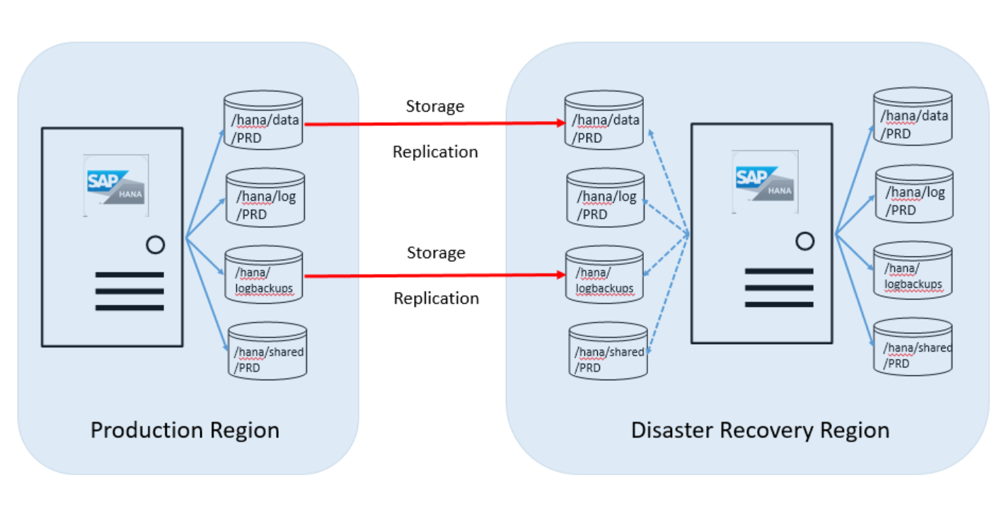
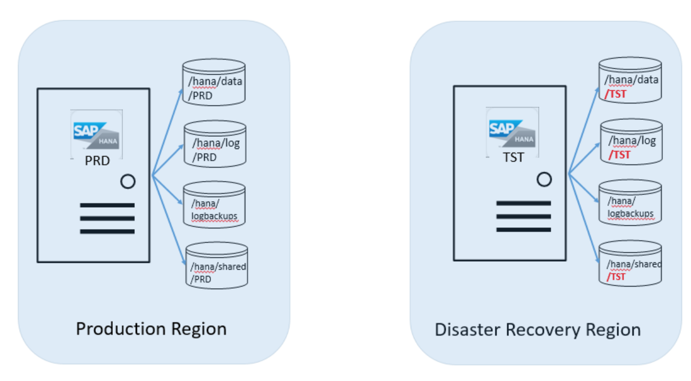
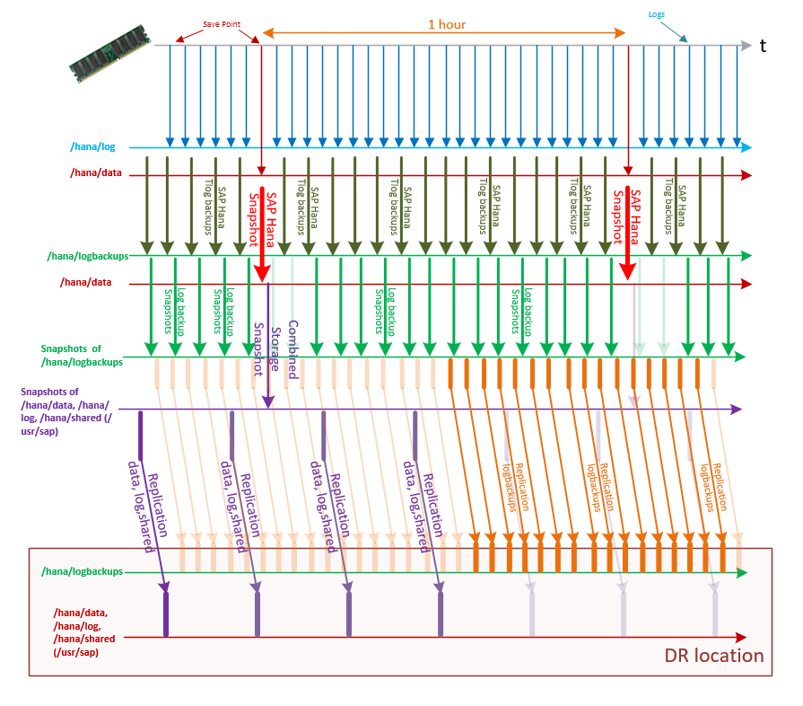
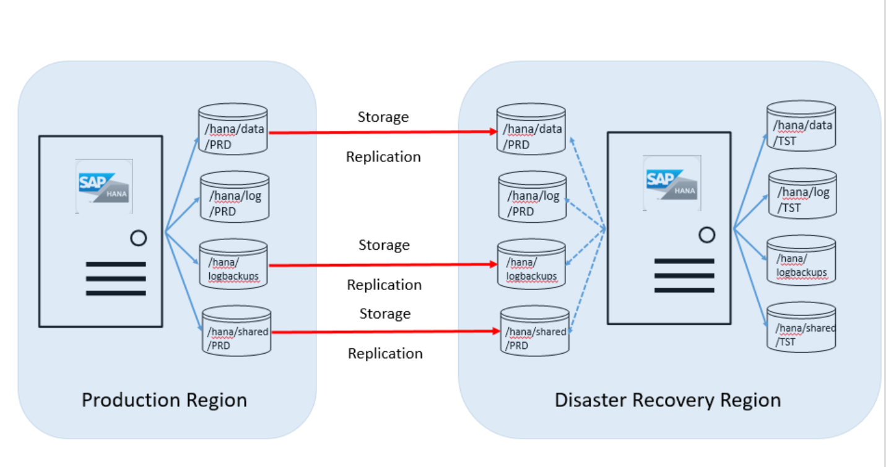

# Disaster Recovery principles

HANA Large Instances offer a disaster recovery functionality between HANA Large Instance stamps in different Azure regions. For instance, if you deploy HANA Large Instance units in the US West region of Azure, you can use the HANA Large Instance units in the US East region as disaster recovery units. As mentioned earlier, disaster recovery is not configured automatically, because it requires you to pay for another HANA Large Instance unit in the DR region. The disaster recovery setup works for scale-up as well as scale-out setups. 

In the scenarios deployed so far, customers use the unit in the DR region to run non-production systems that use an installed HANA instance. The HANA Large Instance unit needs to be of the same SKU as the SKU used for production purposes. The following image shows what the disk configuration between the server unit in the Azure production region and the disaster recovery region looks like:

As shown in this overview graphic, you then need to order a second set of disk volumes. The target disk volumes are the same size as the production volumes for the production instance in the disaster recovery units. These disk volumes are associated with the HANA Large Instance server unit in the disaster recovery site. The following volumes are replicated from the production region to the DR site:

- /hana/data
- /hana/logbackups 
- /hana/shared (includes /usr/sap)

The /hana/log volume is not replicated because the SAP HANA transaction log is not needed in the way that the restore from those volumes is done. 

The basis of the disaster recovery functionality offered is the storage replication functionality offered by the HANA Large Instance infrastructure. The functionality that is used on the storage side is not a constant stream of changes that replicate in an asynchronous manner as changes happen to the storage volume. Instead, it is a mechanism that relies on the fact that snapshots of these volumes are created on a regular basis. The delta between an already replicated snapshot and a new snapshot that is not yet replicated is then transferred to the disaster recovery site into target disk volumes.  These snapshots are stored on the volumes and, if there is a disaster recovery failover, need to be restored on those volumes.  

The first transfer of the complete data of the volume should be before the amount of data becomes smaller than the deltas between snapshots. As a result, the volumes in the DR site contain every one of the volume snapshots performed in the production site. Eventually, you can use that DR system to get to an earlier status to recover lost data, without rolling back the production system.

If there is an MCOD deployment with multiple independent SAP HANA instances on one HANA Large Instance unit, it is expected that all SAP HANA instances are getting storage replicated to the DR side.

In cases where you use HANA System Replication as high-availability functionality in your production site, and use storage-based replication for the DR site, the volumes of both the nodes from primary site to the DR instance are replicated. You must purchase additional storage (same size as of primary node) at DR site to accommodate replication from both primary and secondary to the DR. 

>[!NOTE]
>The HANA Large Instance storage replication functionality is mirroring and replicating storage snapshots. If you don't perform storage snapshots as introduced in the Backup and restore section of this article, there can't be any replication to the disaster recovery site. Storage snapshot execution is a prerequisite to storage replication to the disaster recovery site.

## Preparation of the disaster recovery scenario
In this scenario, you have a production system running on HANA Large Instances in the production Azure region. For the steps that follow, let's assume that the SID of that HANA system is "PRD," and that you have a non-production system running on HANA Large Instances in the DR Azure region. For the latter, let's assume that its SID is "TST." The following image shows this configuration:

If the server instance has not already been ordered with the additional storage volume set, SAP HANA on Azure Service Management attaches the additional set of volumes as a target for the production replica to the HANA Large Instance unit on which you're running the TST HANA instance. For that purpose, you need to provide the SID of your production HANA instance. After SAP HANA on Azure Service Management confirms the attachment of those volumes, you need to mount those volumes to the HANA Large Instance unit.

The next step is for you to install the second SAP HANA instance on the HANA Large Instance unit in the DR Azure region, where you run the TST HANA instance. The newly installed SAP HANA instance needs to have the same SID. The users created need to have the same UID and Group ID that the production instance has. Read [Backup and restore](hana-backup-restore.md) for details. If the installation succeeded, you need to:

- Execute step 2 of the storage snapshot preparation described in [Backup and restore](hana-backup-restore.md).
- Create a public key for the DR unit of HANA Large Instance unit if you have not yet done so. See step 3 of the storage snapshot preparation described in [Backup and restore](hana-backup-restore.md).
- Maintain the *HANABackupCustomerDetails.txt* with the new HANA instance and test whether connectivity into storage works correctly.  
- Stop the newly installed SAP HANA instance on the HANA Large Instance unit in the DR Azure region.
- Unmount these PRD volumes and contact SAP HANA on Azure Service Management. The volumes can't stay mounted to the unit because they can't be accessible while functioning as storage replication target.  

The operations team establishes the replication relationship between the PRD volumes in the production Azure region and the PRD volumes in the DR Azure region.

>[!IMPORTANT]
>The /hana/log volume is not replicated because it is not necessary to restore the replicated SAP HANA database to a consistent state in the disaster recovery site.

Next, set up, or adjust the storage snapshot backup schedule to get to your RTO and RPO in the disaster case. To minimize the recovery point objective, set the following replication intervals in the HANA Large Instance service:
- For the volumes covered by the combined snapshot (snapshot type **hana**), set to replicate every 15 minutes to the equivalent storage volume targets in the disaster recovery site.
- For the transaction log backup volume (snapshot type **logs**), set to replicate every 3 minutes to the equivalent storage volume targets in the disaster recovery site.

To minimize the recovery point objective, set up the following:
- Perform a **hana** type storage snapshot (see "Step 7: Perform snapshots") every 30 minutes to 1 hour.
- Perform SAP HANA transaction log backups every 5 minutes.
- Perform a **logs** type storage snapshot every 5-15 minutes. With this interval period, you achieve an RPO of around 15-25 minutes.

With this setup, the sequence of transaction log backups, storage snapshots, and the replication of the HANA transaction log backup volume and /hana/data, and /hana/shared (includes /usr/sap) might look like the data shown in this graphic:

 

To achieve an even better RPO in the disaster recovery case, you can copy the HANA transaction log backups from SAP HANA on Azure (Large Instances) to the other Azure region. To achieve this further RPO reduction, perform the following steps:

1. Back up the HANA transaction log as frequently as possible to /hana/logbackups.
1. Use rsync to copy the transaction log backups to the NFS share-hosted Azure virtual machines. The VMs are in Azure virtual networks in the Azure production region and in the DR regions. You need to connect both Azure virtual networks to the circuit connecting the production HANA Large Instances to Azure. See the graphics in the [Network considerations for disaster recovery with HANA Large Instances](#Network-considerations-for-disaster recovery-with-HANA-Large-Instances) section. 
1. Keep the transaction log backups in the region in the VM attached to the NFS exported storage.
1. In a disaster failover case, supplement the transaction log backups you find on the /hana/logbackups volume with more recently taken transaction log backups on the NFS share in the disaster recovery site. 
1. Start a transaction log backup to restore to the latest backup that might be saved over to the DR region.

When HANA Large Instance operations confirm the replication relationship setup and you start the execution storage snapshot backups, the data replication begins.

As the replication progresses, the snapshots on the PRD volumes in the DR Azure regions are not restored. They are only stored. If the volumes are mounted in such a state, they represent the state in which you unmounted those volumes after the PRD SAP HANA instance was installed in the server unit in the DR Azure region. They also represent the storage backups that are not yet restored.

If there is a failover, you also can choose to restore to an older storage snapshot instead of the latest storage snapshot.

## Next steps

- Refer [Disaster recovery failover procedure](hana-failover-procedure.md).
