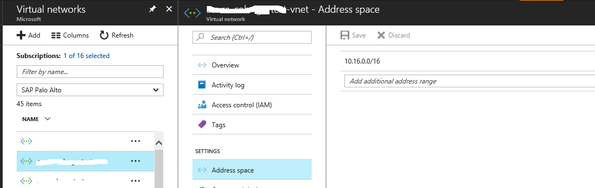
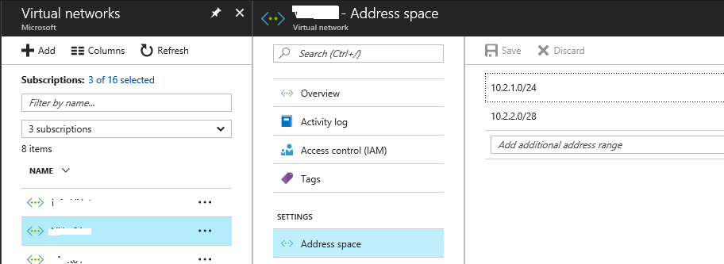
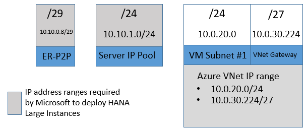

# Connecting Azure VMs to HANA Large Instances

As already mentioned in [SAP HANA (large instances) overview and architecture on Azure](https://docs.microsoft.com/azure/virtual-machines/workloads/sap/hana-overview-architecture) the minimal deployment of HANA Large Instances with the SAP application layer in Azure looks like:

Looking closer on the Azure VNet side, we realize the need for:

- The definition of an Azure VNet that is going to be used to deploy the VMs of the SAP application layer into.
- That automatically means that a default subnet in the Azure Vnet is defined that is really the one used to deploy the VMs into.
- The Azure VNet that's created needs to have at least one VM subnet and one ExpressRoute Gateway subnet. These subnets should be assigned the IP address ranges as specified and discussed in the following sections.

So, let's look a bit closer into the Azure VNet creation for HANA Large Instances

## Creating the Azure VNet for HANA Large Instances

>[!Note]
>The Azure VNet for HANA Large Instance must be created using the Azure Resource Manager deployment model. The older Azure deployment model, commonly known as classic deployment model, is not supported with the HANA Large Instance solution.

The VNet can be created using the Azure portal, PowerShell, Azure template, or Azure CLI (see [Create a virtual network using the Azure portal](../../../virtual-network/manage-virtual-network.md?toc=%2fazure%2fvirtual-machines%2flinux%2ftoc.json#create-a-virtual-network)). In the following example, we look into a VNet created through the Azure portal.

If we look into the definitions of an Azure VNet through the Azure portal, let's look into some of the definitions and how those relate to what we list of different IP address ranges. As we are talking about the **Address Space**, we mean the address space that the Azure VNet is allowed to use. This address space is also the address range that the VNet uses for BGP route propagation. This **Address Space** can be seen here:

In the case preceding, with 10.16.0.0/16, the Azure VNet was given a rather large and wide IP address range to use. Means all the IP address ranges of subsequent subnets within this VNet can have their ranges within that 'Address Space'. Usually we are not recommending such a large address range for single VNet in Azure. But getting a step further, let's look into the subnets defined in the Azure VNet:

As you can see, we look at a VNet with a first VM subnet (here called 'default') and a subnet called 'GatewaySubnet'.
In the following section, we refer to the IP address range of the subnet, which was called 'default' in the graphics as **Azure VM subnet IP address range**. In the following sections, we refer to the IP address range of the Gateway Subnet as **VNet Gateway Subnet IP address range**. 

In the case demonstrated by the two graphics above, you see that the **VNet Address Space** covers both, the **Azure VM subnet IP address range** and the **VNet Gateway Subnet IP address range**. 

In other cases where you need to conserve or be specific with your IP address ranges, you can restrict the **VNet Address Space** of a VNet to the specific ranges being used by each subnet. In this case, you can define the **VNet Address Space** of a VNet as multiple specific ranges as shown here:

In this case, the **VNet Address Space** has two spaces defined. These two spaces, are identical to the IP address ranges defined for **Azure VM subnet IP address range** and the **VNet Gateway Subnet IP address range.**

You can use any naming standard you like for these tenant subnets (VM subnets). However, **there must always be one, and only one, gateway subnet for each VNet** that connects to the SAP HANA on Azure (Large Instances) ExpressRoute circuit. And **this gateway subnet must always be named "GatewaySubnet"** to ensure proper placement of the ExpressRoute gateway.

> [!WARNING] 
> It is critical that the gateway subnet always is named "GatewaySubnet."

Multiple VM subnets may be used, even utilizing non-contiguous address ranges. But as mentioned previously, these address ranges must be covered by the **VNet Address Space** of the VNet either in aggregated form or in a list of the exact ranges of the VM subnets and the gateway subnet.

Summarizing the important fact about an Azure VNet that connects to HANA Large Instances:

- You need to submit to Microsoft the **VNet Address Space** when performing an initial deployment of HANA Large Instances. 
- The **VNet Address Space** can be one larger range that covers the range for Azure VM subnet IP address range(s) and the VNet Gateway Subnet IP address range.
- Or you can submit as **VNet Address Space** multiple ranges that cover the different IP address ranges of VM subnet IP address range(s) and the VNet Gateway Subnet IP address range.
- The defined **VNet Address Space** is used BGP routing propagation.
- The name of the Gateway subnet must be: **"GatewaySubnet."**
- The **VNet Address Space** is used as a filter on the HANA Large Instance side to allow or disallow traffic to the HANA Large Instance units from Azure. If the BGP routing information of the Azure VNet and the IP address ranges configured for filtering on the HANA Large Instance side do not match, issues in connectivity can arise.
- There are some details about the Gateway subnet that are discussed further down in Section 'Connecting a VNet to HANA Large Instance ExpressRoute'

## Different IP address ranges to be defined 

We already introduced some of the IP address ranges necessary to deploy HANA Large Instances in earlier sections. But there are some more IP address ranges, which are important. Let's go through some further details. The following IP addresses of which not all need to be submitted to Microsoft need to be defined, before sending a request for initial deployment:

- **VNet Address Space:** As already introduced earlier, is or are the IP address range(s) you have assigned (or plan to assign) to your address space parameter in the Azure Virtual Network(s) (VNet) connecting to the SAP HANA Large Instance environment. It is recommended that this Address Space parameter is a multi-line value comprised of the Azure VM Subnet range(s) and the Azure Gateway subnet range as shown in the graphics earlier. This range must NOT overlap with your on-premises or Server IP Pool or ER-P2P address ranges. How to get this or these IP address range(s)? Your corporate network team or service provider should provide one or multiple IP Address Range(s), which is or are not used inside your network. Example: If your Azure VM Subnet (see earlier) is 10.0.1.0/24, and your Azure Gateway Subnet (see following) is 10.0.2.0/28, then your Azure VNet Address Space is recommended to be two lines; 10.0.1.0/24 and 10.0.2.0/28. Although the Address Space values can be aggregated, it is recommended matching them to the subnet ranges to avoid accidental reuse of unused IP address ranges within larger address spaces in the future elsewhere in your network. **The VNET Address Space is an IP address range, which needs to be submitted to Microsoft when asking for an initial deployment**

- **Azure VM subnet IP address range:** This IP address range, as discussed earlier already, is the one you have assigned (or plan to assign) to the Azure VNet subnet parameter in your Azure VNET connecting to the SAP HANA Large Instance environment. This IP address range is used to assign IP addresses to your Azure VMs. The IP addresses out of this range are allowed to connect to your SAP HANA Large Instance server(s). If needed, multiple Azure VM subnets may be used. A /24 CIDR block is recommended by Microsoft for each Azure VM Subnet. This address range must be a part of the values used in the Azure VNet Address Space. How to get this IP address range? Your corporate network team or service provider should provide an IP Address Range, which is not currently used inside your network.

- **VNet Gateway Subnet IP address range:** Depending on the features you plan to use, the recommended size would be:
   - Ultra-performance ExpressRoute gateway: /26 address block - required for Type II class of SKUs
   - Co-existence with VPN and ExpressRoute using a High-performance ExpressRoute Gateway (or smaller): /27 address block
   - All other situations: /28 address block. This address range must be a part of the values used in the "VNet Address Space" values. This address range must be a part of the values used in the Azure VNet Address Space values that you need to submit to Microsoft. How to get this IP address range? Your corporate network team or service provider should provide an IP Address Range, which is not currently used inside your network. 

- **Address range for ER-P2P connectivity:** This range is the IP range for your SAP HANA Large Instance ExpressRoute (ER) P2P connection. This range of IP addresses must be a /29 CIDR IP address range. This range must NOT overlap with your on-premises or other Azure IP address ranges. This IP address range is used to set up the ER connectivity from your Azure VNet ExpressRoute Gateway to the SAP HANA Large Instance servers. How to get this IP address range? Your corporate network team or service provider should provide an IP Address Range, which is not currently used inside your network. **This range is an IP address range, which needs to be submitted to Microsoft when asking for an initial deployment**
  
- **Server IP Pool Address Range:** This IP address range is used to assign the individual IP address to HANA large instance servers. The recommended subnet size is a /24 CIDR block - but if needed it can be smaller to a minimum of providing 64 IP addresses. From this range, the first 30 IP addresses are reserved for use by Microsoft. Ensure this fact is accounted for when choosing the size of the range. This range must NOT overlap with your on-premises or other Azure IP addresses. How to get this IP address range? Your corporate network team or service provider should provide an IP Address Range which is not currently used inside your network. A /24 (recommended) unique CIDR block to be used for assigning the specific IP addresses needed for SAP HANA on Azure (Large Instances). **This range is an IP address range, which needs to be submitted to Microsoft when asking for an initial deployment**
 
Though you need to define and plan the IP address ranges above, not all them need to be transmitted to Microsoft. To summarize the above, the IP address ranges you are required to name to Microsoft are:

- Azure VNet Address Space(s)
- Address range for ER-P2P connectivity
- Server IP Pool Address Range

Adding additional VNets that need to connect to HANA Large Instances, requires you to submit the new Azure VNet Address Space you're adding to Microsoft. 

Following is an example of the different ranges and some example ranges as you need to configure and eventually provide to Microsoft. As you can see, the value for the Azure VNet Address Space is not aggregated in the first example, but is defined from the ranges of the first Azure VM subnet IP address range and the VNet Gateway Subnet IP address range. Using multiple VM subnets within the Azure VNet would work accordingly by configuring and submitting the additional IP address ranges of the additional VM subnet(s) as part of the Azure VNet Address Space.

You also have the possibility of aggregating the data you submit to Microsoft. In that case, the Address Space of the Azure VNet only would include one space. Using the IP address ranges used in the example earlier. This aggregated VNet Address space could look like:

As you can see above, instead of two smaller ranges that defined the address space of the Azure VNet, we have one larger range that covers 4096 IP addresses. Such a large definition of the Address Space leaves some rather large ranges unused. Since the VNet Address Space value(s) are used for BGP route propagation, usage of the unused ranges on-premises or elsewhere in your network can cause routing issues. So it's recommended to keep the Address Space tightly aligned with the actual subnet address space used. If needed, without incurring downtime on the VNet, you can always add new Address Space values later.
 
> [!IMPORTANT] 
> Each IP address range of ER-P2P, Server IP Pool, Azure VNet Address Space must **NOT** overlap with each other or any other range used somewhere else in your network; each must be discrete and as the two graphics earlier show, may not be a subnet of any other range. If overlaps occur between ranges, the Azure VNet may not connect to the ExpressRoute circuit.

## Next steps after address ranges have been defined
After the IP address ranges have been defined, the following activities need to happen:

1. Submit the IP address ranges for Azure VNet Address Space, the ER-P2P connectivity, and Server IP Pool Address Range, together with other data that has been listed at the beginning of the document. At this point in time, you also could start to create the VNet and the VM Subnets. 
2. An Express Route circuit is created by Microsoft between your Azure subscription and the HANA Large Instance stamp.
3. A tenant network is created on the Large Instance stamp by Microsoft.
4. Microsoft configures networking in the SAP HANA on Azure (Large Instances) infrastructure to accept IP addresses from your Azure VNet Address Space that communicates with HANA Large Instances.
5. Depending on the specific SAP HANA on Azure (Large Instances) SKU purchased, Microsoft assigns a compute unit in a tenant network, allocate and mount storage, and install the operating system (SUSE or Red Hat Linux). IP addresses for these units are taken out of the Server IP Pool address Range you submitted to Microsoft.

At the end of the deployment process, Microsoft delivers the following data to you:
- Information needed to connect your Azure VNet(s) to the ExpressRoute circuit that connects Azure VNets to HANA Large Instances:
     - Authorization key(s)
     - ExpressRoute PeerID
- Data to access HANA Large Instances after you established ExpressRoute circuit and Azure VNet.

You can also find the sequence of connecting HANA Large Instances in the document [End to End Setup for SAP HANA Large Instances](https://azure.microsoft.com/resources/sap-hana-on-azure-large-instances-setup/). Many of the following steps are shown in an example deployment in that document. 

**Next steps**

- Refer [Connecting a VNet to HANA Large Instance ExpressRoute](hana-connect-vnet-express-route.md).