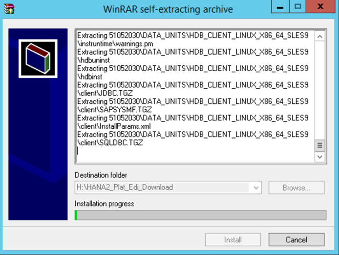
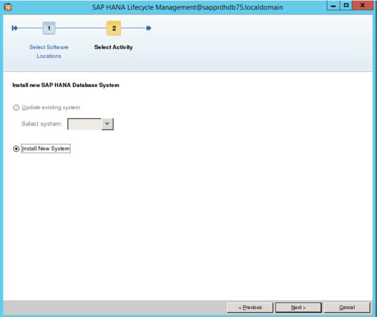
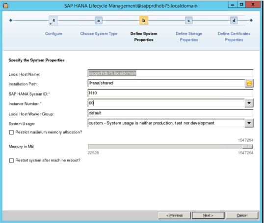
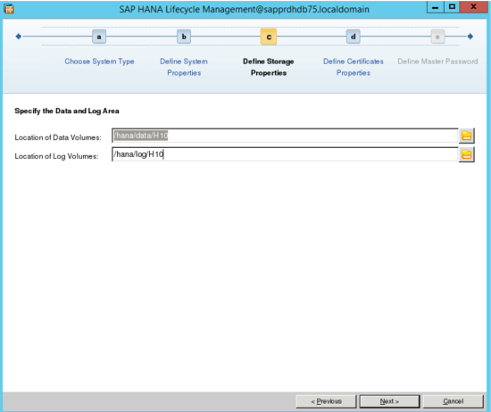
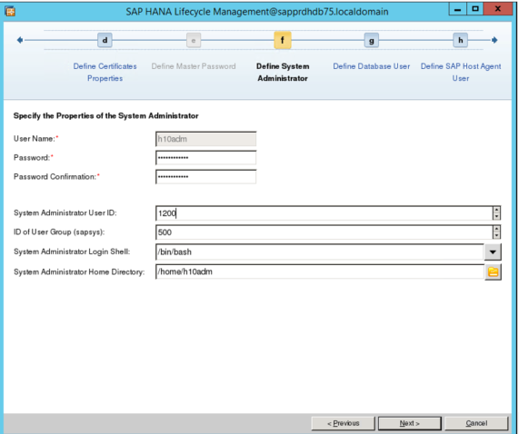

# Install HANA on SAP HANA on Azure (Large Instances)

To install HANA on SAP HANA on Azure (Large Instances), you must first do the following:
- You provide Microsoft with all the data to deploy for you on an SAP HANA Large Instance.
- You receive the SAP HANA Large Instance from Microsoft.
- You create an Azure virtual network that is connected to your on-premises network.
- You connect the ExpressRoute circuit for HANA Large Instances to the same Azure virtual network.
- You install an Azure virtual machine that you use as a jump box for HANA Large Instances.
- You ensure that you can connect from the jump box to your HANA Large Instance unit, and vice versa.
- You check whether all the necessary packages and patches are installed.
- You read the SAP notes and documentation about HANA installation on the operating system you're using. Make sure that the HANA release of choice is supported on the operating system release.

The next section shows an example of downloading the HANA installation packages to the jump box virtual machine. In this case, the operating system is Windows.

## Download the SAP HANA installation bits
The HANA Large Instance units aren't directly connected to the internet. You can't directly download the installation packages from SAP to the HANA Large Instance virtual machine. Instead, you download the packages to the jump box virtual machine.

You need an SAP S-user or other user, which allows you to access the SAP Marketplace.

1. Sign in, and go to [SAP Service Marketplace](https://support.sap.com/en/index.html). Select **Download Software** > **Installations and Upgrade** > **By Alphabetical Index**. Then select **Under H – SAP HANA Platform Edition** > **SAP HANA Platform Edition 2.0** > **Installation**. Download the files shown in the following screenshot.

   

2. In this example, we downloaded SAP HANA 2.0 installation packages. On the Azure jump box virtual machine, expand the self-extracting archives into the directory as shown below.

   

3. As the archives are extracted, copy the directory created by the extraction (in this case, 51052030). Copy the directory from the HANA Large Instance unit /hana/shared volume into a directory you created.

   > [!Important]
   > Don't copy the installation packages into the root or boot LUN, because space is limited and needs to be used by other processes as well.


## Install SAP HANA on the HANA Large Instance unit
In order to install SAP HANA, sign in as user root. Only root has enough permissions to install SAP HANA. Set permissions on the directory you copied over into /hana/shared.

```
chmod –R 744 <Installation bits folder>
```

If you want to install SAP HANA by using the graphical user interface setup, the gtk2 package needs to be installed on HANA Large Instances. To check whether it is installed, run the following command:

```
rpm –qa | grep gtk2
```

(In later steps, we show the SAP HANA setup with the graphical user interface.)

Go into the installation directory, and navigate into the sub directory HDB_LCM_LINUX_X86_64. 

Out of that directory, start:

```
./hdblcmgui 
```
At this point, you progress through a sequence of screens in which you provide the data for the installation. In this example, we are installing the SAP HANA database server and the SAP HANA client components. Therefore, our selection is **SAP HANA Database**.


On the next screen, select **Install New System**.



Next, select among several additional components that you can install.


Here, we choose the SAP HANA Client and the SAP HANA Studio. We also install a scale-up instance. Then choose **Single-Host System**. 


Next, provide some data.



> [!Important]
> As HANA System ID (SID), you must provide the same SID as you provided Microsoft when you ordered the HANA Large Instance deployment. Choosing a different SID causes the installation to fail, due to access permission problems on the different volumes.

For the installation path, use the /hana/shared directory. In the next step, you provide the locations for the HANA data files and the HANA log files.




> [!Note]
> The SID you specified when you defined system properties (two screens ago) should match the SID of the mount points. If there is a mismatch, go back and adjust the SID to the value you have on the mount points.

In the next step, review the host name and eventually correct it. 


In the next step, you also need to retrieve data you gave to Microsoft when you ordered the HANA Large Instance deployment. 



> [!Important]
> Provide the same **System Administrator User ID** and **ID of User Group** as you provided to Microsoft, as you order the unit deployment. Otherwise, the installation of SAP HANA on the HANA Large Instance unit fails.

The next two screens are not shown here. They enable you to provide the password for the SYSTEM user of the SAP HANA database, and the password for the sapadm user. The latter is used for the SAP Host Agent that gets installed as part of the SAP HANA database instance.

After defining the password, you see a confirmation screen. check all the data listed, and continue with the installation. You reach a progress screen that documents the installation progress, like this one:


As the installation finishes, you should see a screen like this one:


The SAP HANA instance should now be up and running, and ready for usage. You should be able to connect to it from SAP HANA Studio. Also make sure that you check for and apply the latest updates.


## Next steps

- [SAP HANA Large Instances high availability and disaster recovery on Azure](hana-overview-high-availability-disaster-recovery.md)

