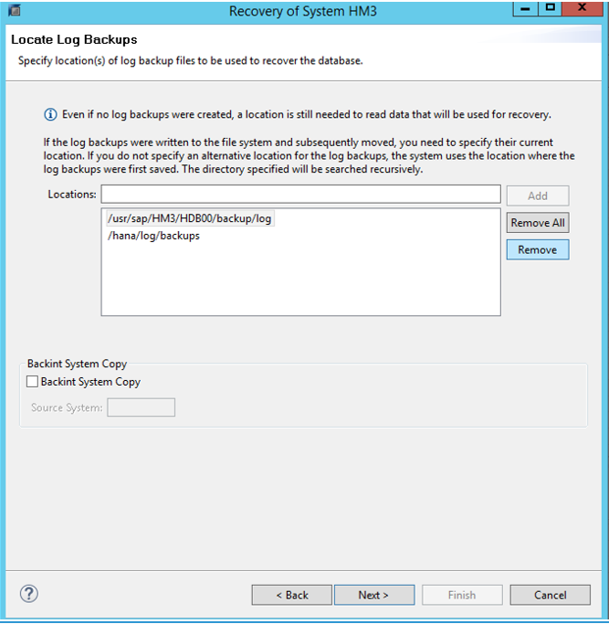
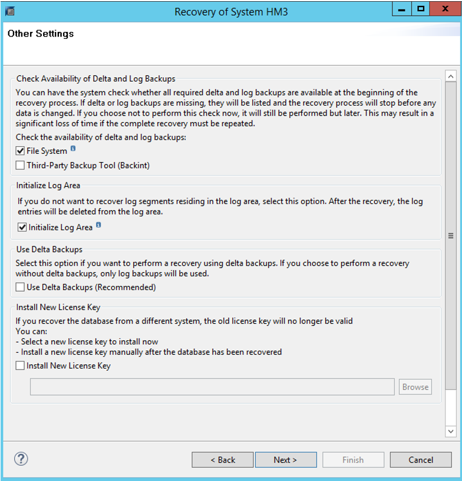
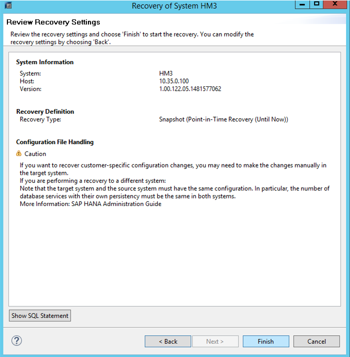
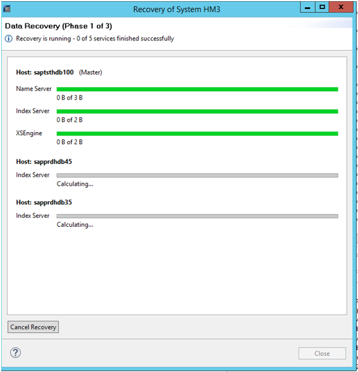

# Disaster recovery failover procedure


>[!IMPORTANT]
>This documentation is no replacement of the SAP HANA administration documentation or SAP Notes. It's expected that the reader has a solid understanding of and expertise in SAP HANA administration and operations, especially with the topics of backup, restore, high availability, and disaster recovery. In this documentation, screenshots from SAP HANA Studio are shown. Content, structure, and the nature of the screens of SAP administration tools and the tools themselves might change from SAP HANA release to release.

There are two cases to consider when failing over to the DR site:

- You need the SAP HANA database to go back to the latest status of data. In this case, there is a self-service script with which you can perform the failover without the need to contact Microsoft. However, for the failback, you need to work with Microsoft.
- You want to restore to a storage snapshot that is not the latest replicated snapshot. In this case, you need to work with Microsoft. 

>[!NOTE]
>The following steps need to be executed on the HANA Large Instance unit, which represents the DR unit. 
 
To restore to the latest replicated storage snapshots, perform the following steps: 

1. Shut down the non-production instance of HANA on the disaster recovery unit of HANA Large Instances that you're running. This is because there is a dormant HANA production instance pre-installed.
1. Make sure that no SAP HANA processes are running. Use the following command for this check: `/usr/sap/hostctrl/exe/sapcontrol –nr <HANA instance number> - function GetProcessList`. 
The output should show you the **hdbdaemon** process in a stopped state, and no other HANA processes in a running or started state.
1. On the DR site HANA Large Instance unit, execute the script *azure_hana_dr_failover.pl*. The script is asking for an SAP HANA SID to be restored. When requested, type in one or the only SAP HANA SID that has been replicated and is maintained in the *HANABackupCustomerDetails.txt* file on the HANA Large Instance unit in the DR site. 

      If you want to have multiple SAP HANA instances failed over, you need to run the script several times. When requested, type in the SAP HANA SID you want to fail over and restore. On completion, the script shows a list of mount points of the volumes that are added to the HANA Large Instance unit. This list includes the restored DR volumes as well.

1. Mount the restored disaster recovery volumes by using Linux operating system commands to the HANA Large Instance unit in the disaster recovery site. 
1. Start the dormant SAP HANA production instance.
1. If you chose to copy transaction log backup logs to reduce the RPO time, you need to merge those transaction log backups into the newly mounted DR /hana/logbackups directory. Don't overwrite existing backups. Copy newer backups that have not been replicated with the latest replication of a storage snapshot.
1. You can also restore single files out of the snapshots that have been replicated to the /hana/shared/PRD volume in the DR Azure region. 

You can test the DR failover as well without impacting the actual replication relationship. To perform a test failover, follow the preceding steps 1 and 2, and then continue with the following step 3.

>[!IMPORTANT]
>Do *not* run any production transactions on the instance that you created in the DR site through the process of **testing a failover** with the script introduced in step 3. That command creates a set of volumes that have no relationship to the primary site. As a result, synchronization back to the primary site is *not* possible. 

Step 3 for the failover test:

On the DR site HANA Large Instance unit, execute the script **azure_hana_test_dr_failover.pl**. This script is *not* stopping the replication relationship between the primary site and the DR site. Instead, this script is cloning the DR storage volumes. After the cloning process succeeds, the cloned volumes are restored to the state of the most recent snapshot and then mounted to the DR unit. The script is asking for an SAP HANA SID to be restored. Type in one or the only SAP HANA SID that has been replicated and is maintained in the *HANABackupCustomerDetails.txt* file on the HANA Large Instance unit in the DR site. 

If you want to have multiple SAP HANA instances to test, you need to run the script several times. When requested, type in the SAP HANA SID of the instance you want to test for failover. Upon completion, the script shows a list of mount points of the volumes that are added to the HANA Large Instance unit. This list includes the cloned DR volumes as well.

Continue to step 4.

   >[!NOTE]
   >If you need to fail over to the DR site to rescue some data that was deleted hours ago and needs the DR volumes to be set to an earlier snapshot, this procedure applies. 

1. Shut down the non-production instance of HANA on the disaster recovery unit of HANA Large Instances that you're running. This is because there is a dormant HANA production instance pre-installed.
1. Make sure that no SAP HANA processes are running. Use the following command for this check: `/usr/sap/hostctrl/exe/sapcontrol –nr <HANA instance number> - function GetProcessList`. 
The output should show you the **hdbdaemon** process in a stopped state and no other HANA processes in a running or started state.
1. Determine to which snapshot name or SAP HANA backup ID you want to have the disaster recovery site restored. In real disaster recovery cases, this snapshot is usually the latest snapshot. If you need to recover lost data, pick an earlier snapshot.
1. Contact Azure Support through a high-priority support request. Ask for the restore of that snapshot (with the name and date of the snapshot) or the HANA backup ID on the DR site. The default is that the operations side restores the /hana/data volume only. If you want to have the /hana/logbackups volumes as well, you need to specifically state that. *Do not restore the /hana/shared volume.* Instead, you should choose specific files like global.ini out of the **.snapshot** directory and its subdirectories after you remount the /hana/shared volume for PRD. 

   On the operations side, the following steps occur:

   a. The replication of snapshots from the production volume to the disaster recovery volumes is stopped. This disruption might have already happened if an outage at the production site is the reason you need to perform the disaster recovery procedure.
   
   b. The storage snapshot name or snapshot with the backup ID you chose is restored on the disaster recovery volumes.
   
   c. After the restore, the disaster recovery volumes are available to be mounted to the HANA Large Instance units in the disaster recovery region.
      
1. Mount the disaster recovery volumes to the HANA Large Instance unit in the disaster recovery site. 
1. Start the dormant SAP HANA production instance.
1. If you chose to copy transaction log backup logs to reduce the RPO time, you need to merge those transaction log backups into the newly mounted DR /hana/logbackups directory. Don't overwrite existing backups. Copy newer backups that have not been replicated with the latest replication of a storage snapshot.
1. You can also restore single files out of the snapshots that have been replicated to the /hana/shared/PRD volume in the DR Azure region.

The next sequence of steps involves recovering the SAP HANA production instance based on the restored storage snapshot and the transaction log backups that are available:

1. Change the backup location to **/hana/logbackups** by using SAP HANA Studio.
   

1. SAP HANA scans through the backup file locations and suggests the most recent transaction log backup to restore to. The scan can take a few minutes until a screen like the following appears:
   

1. Adjust some of the default settings:

      - Clear **Use Delta Backups**.
      - Select **Initialize Log Area**.

   

1. Select **Finish**.

   

A progress window, like the one shown here, should appear. Keep in mind that the example is of a disaster recovery restore of a three-node scale-out SAP HANA configuration.



If the restore seems to hang at the **Finish** screen and does not show the progress screen, confirm that all the SAP HANA instances on the worker nodes are running. If necessary, start the SAP HANA instances manually.


## Failback from a DR to a production site
You can fail back from a DR to a production site. Let's look at a scenario in which the failover into the disaster recovery site was caused by problems in the production Azure region, and not by your need to recover lost data. You have been running your SAP production workload for a while in the disaster recovery site. As the problems in the production site are resolved, you want to fail back to your production site. Because you can't lose data, the step back into the production site involves several steps and close cooperation with the SAP HANA on Azure operations team. It's up to you to trigger the operations team to start synchronizing back to the production site after the problems are resolved.

This is the sequence of steps to take:

1. The SAP HANA on Azure operations team gets the trigger to synchronize the production storage volumes from the disaster recovery storage volumes, which now represent the production state. In this state, the HANA Large Instance unit in the production site is shut down.
1. The SAP HANA on Azure operations team monitors the replication and makes sure that it's caught up before informing you.
1. You shut down the applications that use the production HANA Instance in the disaster recovery site. You then perform an HANA transaction log backup. Next, you stop the HANA instance running on the HANA Large Instance units in the disaster recovery site.
1. After the HANA instance running in the HANA Large Instance unit in the disaster recovery site is shut down, the operations team manually synchronizes the disk volumes again.
1. The SAP HANA on Azure operations team starts the HANA Large Instance unit in the production site again and hands it over to you. You ensure that the SAP HANA instance is in a shutdown state at the startup time of the HANA Large Instance unit.
1. You perform the same database restore steps as you did when previously failing over to the disaster recovery site.

## Monitor disaster recovery replication

You can monitor the status of your storage replication progress by executing the script `azure_hana_replication_status.pl`. This script must be run from a unit running in the disaster recovery location to function as expected. The script works regardless of whether replication is active. The script can be run for every HANA Large Instance unit of your tenant in the disaster recovery location. It cannot be used to obtain details about the boot volume.

Call the script with this command:
```
./azure_hana_replication_status.pl
```

The output is broken down, by volume, into the following sections:  

- Link status
- Current replication activity
- Latest snapshot replicated 
- Size of the latest snapshot
- Current lag time between snapshots (between the last completed snapshot replication and now)

The link status shows as **Active** unless the link between locations is down, or there's a currently ongoing failover event. The replication activity addresses whether any data is currently being replicated or is idle, or if other activities are currently happening to the link. The last snapshot replicated should only appear as `snapmirror…`. The size of the last snapshot is then displayed. Finally, the lag time is shown. The lag time represents the time from the scheduled replication to when the replication finishes. A lag time can be greater than an hour for data replication, especially in the initial replication, even though replication has started. The lag time continues to increase until the ongoing replication finishes.

The following is an example of the output:

```
hana_data_hm3_mnt00002_t020_dp
-------------------------------------------------
Link Status: Broken-Off
Current Replication Activity: Idle
Latest Snapshot Replicated: snapmirror.c169b434-75c0-11e6-9903-00a098a13ceb_2154095454.2017-04-21_051515
Size of Latest Snapshot Replicated: 244KB
Current Lag Time between snapshots: -   ***Less than 90 minutes is acceptable***
```

**Next steps**
- Refer  [Monitoring and troubleshooting from HANA side](hana-monitor-troubleshoot.md).
