# Quickstart: Manual installation of single-instance SAP HANA on Azure Virtual Machines
## Introduction
This guide helps you set up a single-instance SAP HANA on Azure Virtual Machines when you install SAP NetWeaver 7.5 and SAP HANA 1.0 SP12 manually. The focus of this guide is on how to deploy SAP HANA on Azure. It doesn't replace SAP documentation. 

> [!NOTE]
> This guide describes deployments of SAP HANA into Azure VMs. For information on how to deploy SAP HANA into HANA large instances, see [Use SAP on Azure Virtual Machines](https://docs.microsoft.com/azure/virtual-machines/workloads/sap/get-started).
 
## Prerequisites
This guide assumes that you're familiar with such infrastructure as a service (IaaS) basics as:
 * How to deploy virtual machines (VMs) or virtual networks via the Azure portal or PowerShell.
 * The Azure cross-platform command-line interface (CLI), which includes the option to use JavaScript Object Notation (JSON) templates.

This guide also assumes that you're familiar with:
* SAP HANA and SAP NetWeaver and how to install them on-premises.
* How to install and operate SAP HANA and SAP application instances on Azure.
* The following concepts and procedures:
   * Planning for SAP deployment on Azure, which includes Azure Virtual Network planning and Azure Storage usage. See [SAP NetWeaver on Azure Virtual Machines - Planning and implementation guide](https://docs.microsoft.com/azure/virtual-machines/workloads/sap/planning-guide).
   * Deployment principles and ways to deploy VMs in Azure. See [Azure Virtual Machines deployment for SAP](https://docs.microsoft.com/azure/virtual-machines/workloads/sap/deployment-guide).
   * High availability for SAP NetWeaver ABAP SAP Central Services (ASCS), SAP Central Services (SCS), and  Enqueue Replication Server (ERS) on Azure. See [High availability for SAP NetWeaver on Azure VMs](https://docs.microsoft.com/azure/virtual-machines/workloads/sap/high-availability-guide).
   * Details on how to improve efficiency in a multi-SID installation of ASCS/SCS on Azure. See [Create a SAP NetWeaver multi-SID configuration](https://docs.microsoft.com/azure/virtual-machines/workloads/sap/high-availability-multi-sid). 
   * Principles of running SAP NetWeaver based on Linux-driven VMs in Azure. See [Run SAP NetWeaver on Microsoft Azure SUSE Linux VMs](https://docs.microsoft.com/azure/virtual-machines/workloads/sap/suse-quickstart). This guide provides specific settings for Linux in Azure VMs. It also gives information on how to properly attach Azure storage disks to Linux VMs.

The Azure VM types that can be used for production scenarios are listed in the [SAP documentation for IAAS](https://www.sap.com/dmc/exp/2014-09-02-hana-hardware/enEN/iaas.html). For nonproduction scenarios, a wider variety of native Azure VM types is available.
For more information on VM configuration and operations, see [SAP HANA infrastructure configurations and operations on Azure](https://docs.microsoft.com/azure/virtual-machines/workloads/sap/hana-vm-operations).
For SAP HANA high availability, see [SAP HANA high availability for Azure Virtual Machines](https://docs.microsoft.com/azure/virtual-machines/workloads/sap/sap-hana-availability-overview).

If you want to get an SAP HANA instance or S/4HANA or BW/4HANA system deployed quickly, consider using [SAP Cloud Appliance Library](https://cal.sap.com). You can find documentation about how to deploy an S/4HANA system through SAP Cloud Appliance Library on Azure, for example, in [this guide](https://docs.microsoft.com/azure/virtual-machines/workloads/sap/cal-s4h). All you need is an Azure subscription and an SAP user who can be registered with SAP Cloud Appliance Library.

## Additional resources
### SAP HANA backup
For information on how to back up SAP HANA databases on Azure VMs, see:
* [Backup guide for SAP HANA on Azure Virtual Machines](https://docs.microsoft.com/azure/virtual-machines/workloads/sap/sap-hana-backup-guide).
* [SAP HANA Azure Backup on file level](https://docs.microsoft.com/azure/virtual-machines/workloads/sap/sap-hana-backup-file-level).
* [SAP HANA backup based on storage snapshots](https://docs.microsoft.com/azure/virtual-machines/workloads/sap/sap-hana-backup-storage-snapshots).

### SAP Cloud Appliance Library
For information on how to use SAP Cloud Appliance Library to deploy S/4HANA or BW/4HANA, see [Deploy SAP S/4HANA or BW/4HANA on Microsoft Azure](https://docs.microsoft.com/azure/virtual-machines/workloads/sap/cal-s4h).

### SAP HANA-supported operating systems
For information on SAP HANA-supported operating systems, see [SAP Note 2235581 - SAP HANA: Supported operating systems](https://launchpad.support.sap.com/#/notes/2235581/E). Azure VMs support only a subset of these operating systems. The following operating systems are supported to deploy SAP HANA on Azure: 

* SUSE Linux Enterprise Server 12.x
* Red Hat Enterprise Linux 7.2

For additional SAP documentation about SAP HANA and different Linux operating systems, see:

* [SAP Note 171356: SAP Software on Linux: General information](https://launchpad.support.sap.com/#/notes/1984787).
* [SAP Note 1944799: SAP HANA guidelines for SLES operating system installation](https://go.sap.com/documents/2016/05/e8705aae-717c-0010-82c7-eda71af511fa.html).
* [SAP Note 2205917: SAP HANA DB recommended OS settings for SLES 12 for SAP applications](https://launchpad.support.sap.com/#/notes/2205917/E).
* [SAP Note 1391070: Linux UUID solutions](https://launchpad.support.sap.com/#/notes/1391070).
* [SAP Note 2009879: SAP HANA guidelines for Red Hat Enterprise Linux (RHEL) operating system](https://launchpad.support.sap.com/#/notes/2009879).
* [SAP Note 2292690: SAP HANA DB: Recommended OS settings for RHEL 7](https://launchpad.support.sap.com/#/notes/2292690/E).

### SAP monitoring in Azure
For information about SAP monitoring in Azure:

* [SAP Note 2191498](https://launchpad.support.sap.com/#/notes/2191498/E) discusses SAP enhanced monitoring with Linux VMs on Azure. 
* [SAP Note 1102124](https://launchpad.support.sap.com/#/notes/1102124/E) discusses information about SAPOSCOL on Linux. 
* [SAP Note 2178632](https://launchpad.support.sap.com/#/notes/2178632/E) discusses key monitoring metrics for SAP on Microsoft Azure.

### Azure VM types
Azure VM types and SAP-supported workload scenarios used with SAP HANA are documented in [SAP certified IaaS platforms](https://www.sap.com/dmc/exp/2014-09-02-hana-hardware/enEN/iaas.html). 

Azure VM types that are certified by SAP for SAP NetWeaver or the S/4HANA application layer are documented in [SAP Note 1928533: SAP applications on Azure: Supported products and Azure VM types](https://launchpad.support.sap.com/#/notes/1928533/E).

> [!NOTE]
> SAP-Linux-Azure integration is supported only on Azure Resource Manager and not the classic deployment model. 

## Manual installation of SAP HANA

> [!IMPORTANT]
> Make sure that the OS you select is SAP certified for SAP HANA on the specific VM types you use. The list  of SAP HANA certified VM types and OS releases for those VM types can be looked up in [SAP HANA certified IaaS platforms](https://www.sap.com/dmc/exp/2014-09-02-hana-hardware/enEN/iaas.html#categories=Microsoft%20Azure). Make sure to click into the details of the VM type listed to get the complete list of SAP HANA-supported OS releases for the specific VM type. For the example in this document, we used a SUSE Linux Enterprise Server (SLES) OS release that's not supported by SAP for SAP HANA on M-series VMs.
>

This guide describes how to manually install SAP HANA on Azure VMs in two different ways:

* Use SAP Software Provisioning Manager (SWPM) as part of a distributed NetWeaver installation in the "install database instance" step.
* Use the SAP HANA database lifecycle manager (HDBLCM) tool, and then install NetWeaver.

You can also use SWPM to install all components, such as SAP HANA, the SAP application server, and the ASCS instance, in one single VM. The steps are described in this [SAP HANA blog announcement](https://blogs.saphana.com/2013/12/31/announcement-sap-hana-and-sap-netweaver-as-abap-deployed-on-one-server-is-generally-available/). This option isn't described in this quickstart guide, but the issues that you must consider are the same.

Before you start an installation, we recommend that you read the "Prepare Azure VMs for manual installation of SAP HANA" section later in this guide. Doing so can help prevent several basic mistakes that might occur when you use only a default Azure VM configuration.

## Key steps for SAP HANA installation when you use SAP SWPM
This section lists the key steps for a manual, single-instance SAP HANA installation when you use SAP SWPM to perform a distributed SAP NetWeaver 7.5 installation. The individual steps are explained in more detail in screenshots later in this guide.

1. Create an Azure virtual network that includes two test VMs.
2. Deploy the two Azure VMs with operating systems according to the Azure Resource Manager model. This example uses SUSE Linux Enterprise Server and SLES for SAP Applications 12 SP1. 
3. Attach two Azure standard or premium storage disks, for example, 75-GB or 500-GB disks, to the application server VM.
4. Attach premium storage disks to the HANA DB server VM. For more information, see the "Disk setup" section later in this guide.
5. Depending on size or throughput requirements, attach multiple disks. Then create striped volumes. Use either logical volume management (LVM) or a multiple-devices administration (mdadm) tool at the OS level inside the VM.
6. Create XFS file systems on the attached disks or logical volumes.
7. Mount the new XFS file systems at the OS level. Use one file system for all the SAP software. Use the other file system for the /sapmnt directory and backups, for example. On the SAP HANA DB server, mount the XFS file systems on the premium storage disks as /hana and /usr/sap. This process is necessary to prevent the root file system from filling up. The root file system isn't large on Linux Azure VMs. 
8. Enter the local IP addresses of the test VMs in the /etc/hosts file.
9. Enter the **nofail** parameter in the /etc/fstab file.
10. Set Linux kernel parameters according to the Linux OS release you use. For more information, see the SAP Notes that discuss HANA and the "Kernel parameters" section in this guide.
11. Add swap space.
12. Optionally, install a graphical desktop on the test VMs. Otherwise, use a remote SAPinst installation.
13. Download the SAP software from the SAP Service Marketplace.
14. Install the SAP ASCS instance on the app server VM.
15. Share the /sapmnt directory among the test VMs by using NFS. The application server VM is the NFS server.
16. Install the database instance, which includes HANA, by using SWPM on the DB server VM.
17. Install the primary application server (PAS) on the application server VM.
18. Start SAP Management Console (SAP MC). Connect with SAP GUI or HANA Studio, for example.

## Key steps for SAP HANA installation when you use HDBLCM
This section lists the key steps for a manual, single-instance SAP HANA installation when you use SAP HDBLCM to perform a distributed SAP NetWeaver 7.5 installation. The individual steps are explained in more detail in screenshots throughout this guide.

1. Create an Azure virtual network that includes two test VMs.
2. Deploy two Azure VMs with operating systems according to the Azure Resource Manager model. This example uses SLES and SLES for SAP Applications 12 SP1.
3. Attach two Azure standard or premium storage disks, for example, 75-GB or 500-GB disks, to the app server VM.
4. Attach premium storage disks to the HANA DB server VM. For more information, see the "Disk setup" section later in this guide.
5. Depending on size or throughput requirements, attach multiple disks. Create striped volumes by using either logical volume management or a mdadm tool at the OS level inside the VM.
6. Create XFS file systems on the attached disks or logical volumes.
7. Mount the new XFS file systems at the OS level. Use one file system for all the SAP software. Use the other file system for the /sapmnt directory and backups, for example. On the SAP HANA DB server, mount the XFS file systems on the premium storage disks as /hana and /usr/sap. This process is necessary to help prevent the root file system from filling up. The root file system isn't large on Linux Azure VMs.
8. Enter the local IP addresses of the test VMs in the /etc/hosts file.
9. Enter the **nofail** parameter in the /etc/fstab file.
10. Set kernel parameters according to the Linux OS release you use. For more information, see the SAP Notes that discuss HANA and the "Kernel parameters" section in this guide.
11. Add swap space.
12. Optionally, install a graphical desktop on the test VMs. Otherwise, use a remote SAPinst installation.
13. Download the SAP software from the SAP Service Marketplace.
14. Create a group, sapsys, with group ID 1001, on the HANA DB server VM.
15. Install SAP HANA on the DB server VM by using HANA database lifecycle manager.
16. Install the SAP ASCS instance on the app server VM.
17. Share the /sapmnt directory among the test VMs by using NFS. The application server VM is the NFS server.
18. Install the database instance, which includes HANA, by using SWPM on the HANA DB server VM.
19. Install the primary application server on the application server VM.
20. Start SAP MC. Connect through SAP GUI or HANA Studio.

## Prepare Azure VMs for a manual installation of SAP HANA
This section covers the following topics:

* OS updates
* Disk setup
* Kernel parameters
* File systems
* The /etc/hosts file
* The /etc/fstab file

### OS updates
Check for Linux OS updates and fixes before you install additional software. By installing a patch, you might avoid a call to the support desk.

Make sure that you use:
* SUSE Linux Enterprise Server for SAP Applications.
* Red Hat Enterprise Linux for SAP Applications or Red Hat Enterprise Linux for SAP HANA. 

If you haven't done so already, register the OS deployment with your Linux subscription from the Linux vendor. SUSE has OS images for SAP applications that already include services, and which are registered automatically.

Here's an example of how to check for available patches for SUSE Linux by using the **zypper** command:

 `sudo zypper list-patches`

Depending on the kind of issue, patches are classified by category and severity. Commonly used values for category are: 
- Security
- Recommended
- Optional
- Feature
- Document
- Yast

Commonly used values for severity are:

- Critical
- Important
- Moderate
- Low
- Unspecified

The **zypper** command looks only for the updates that your installed packages need. For example, you can use this command:

`sudo zypper patch  --category=security,recommended --severity=critical,important`

You can add the parameter `--dry-run` to test the update without actually updating the system.

### Disk setup
The root file system in a Linux VM on Azure has a size limitation. So, you need to attach additional disk space to an Azure VM to run SAP. For SAP application server Azure VMs, the use of Azure standard storage disks might be enough. For SAP HANA DBMS Azure VMs, the use of Azure premium storage disks for production and nonproduction implementations is mandatory.

Based on the [SAP HANA TDI storage requirements](https://www.sap.com/documents/2015/03/74cdb554-5a7c-0010-82c7-eda71af511fa.html), the following Azure premium storage configuration is suggested: 

| VM SKU | RAM |  /hana/data and /hana/log   striped with LVM or mdadm | /hana/shared | /root volume | /usr/sap |
| --- | --- | --- | --- | --- | --- |
| GS5 | 448 GB | 2 x P30 | 1 x P20 | 1 x P10 | 1 x P10 | 

In the suggested disk configuration, the HANA data volume and log volume are placed on the same set of Azure premium storage disks that are striped with LVM or mdadm. It isn't necessary to define any RAID redundancy level because Azure premium storage keeps three images of the disks for redundancy. 

To make sure that you configure enough storage, see [SAP HANA TDI storage requirements](https://www.sap.com/documents/2015/03/74cdb554-5a7c-0010-82c7-eda71af511fa.html) and [SAP HANA server installation and update guide](https://help.sap.com/saphelp_hanaplatform/helpdata/en/4c/24d332a37b4a3caad3e634f9900a45/frameset.htm). Also consider the different virtual hard disk (VHD) throughput volumes of the different Azure premium storage disks as documented in [High-performance premium storage and managed disks for VMs](../../windows/disks-types.md). 

You can add more premium storage disks to the HANA DBMS VMs to store database or transaction log backups.

For more information about the two main tools used to configure striping, see:

* [Configure software RAID on Linux](../../linux/configure-raid.md?toc=%2fazure%2fvirtual-machines%2flinux%2ftoc.json).
* [Configure LVM on a Linux VM in Azure](../../linux/configure-lvm.md?toc=%2fazure%2fvirtual-machines%2flinux%2ftoc.json).

For more information on how to attach disks to Azure VMs that run Linux as a guest OS, see [Add a disk to a Linux VM](../../linux/add-disk.md?toc=%2fazure%2fvirtual-machines%2flinux%2ftoc.json).

With Azure premium SSDs, you can define disk caching modes. For the striped set that holds /hana/data and /hana/log, disable disk caching. For the other volumes, that is, disks, set the caching mode to **ReadOnly**.

To find sample JSON templates to use to create VMs, see the [Azure quickstart templates](https://github.com/Azure/azure-quickstart-templates).
The vm-simple-sles template is a basic template. It includes a storage section, with an additional 100-GB data disk. Use this template as a base. You can adapt the template to your specific configuration.

> [!NOTE]
> It's important to attach the Azure storage disk by using a UUID as documented in [Run SAP NetWeaver on Microsoft Azure SUSE Linux VMs](suse-quickstart.md?toc=%2fazure%2fvirtual-machines%2flinux%2ftoc.json).

In the test environment, two Azure standard storage disks are attached to the SAP app server VM, as shown in the following screenshot. One disk stores all the SAP software, such as NetWeaver 7.5, SAP GUI, and SAP HANA, for installation. The second disk ensures that enough free space is available for additional requirements. For example, backup and test data and the /sapmnt directory, that is, SAP profiles, need to be shared among all VMs that belong to the same SAP landscape.

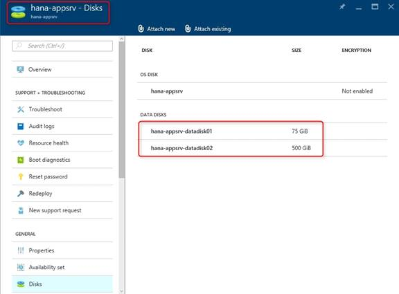

### Kernel parameters
SAP HANA requires specific Linux kernel settings. These kernel settings aren't part of the standard Azure gallery images and must be set manually. Depending on whether you use SUSE or Red Hat, the parameters might be different. The SAP Notes listed previously give information about those parameters. In the screenshots shown, SUSE Linux 12 SP1 was used. 

SLES for SAP Applications 12 general availability and SLES for SAP Applications 12 SP1 have a new tool, **tuned-adm**, that replaces the old **sapconf** tool. A special SAP HANA profile is available for **tuned-adm**. To tune the system for SAP HANA, enter the following profile as a root user:

   `tuned-adm profile sap-hana`

For more information about **tuned-adm**, see the [SUSE documentation
about tuned-adm](https://www.suse.com/documentation/sles-for-sap-12/pdfdoc/sles-for-sap-12-sp1.zip).

In the following screenshot, you can see how **tuned-adm** changed the `transparent_hugepage` and `numa_balancing` values, according to the required SAP HANA settings:

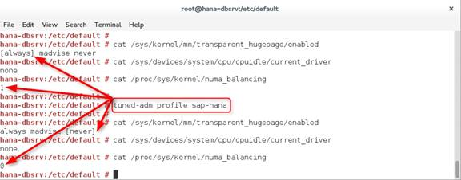

To make the SAP HANA kernel settings permanent, use **grub2** on SLES 12. For more information about **grub2**, see the [Configuration file structure](https://www.suse.com/documentation/sles-for-sap-12/pdfdoc/sles-for-sap-12-sp1.zip) section of the SUSE documentation.

The following screenshot shows how the kernel settings were changed in the configuration file and then compiled by using **grub2-mkconfig**:

Another option is to change the settings by using YaST and the **Boot Loader** > **Kernel Parameters** settings:

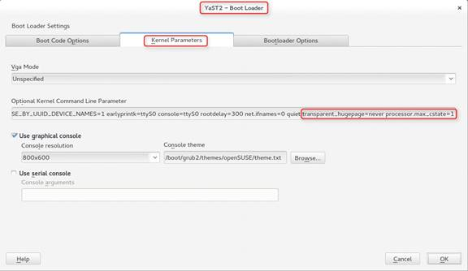

### File systems
The following screenshot shows two file systems that were created on the SAP app server VM on top of the two attached Azure standard storage disks. Both file systems are of the type XFS and are mounted to /sapdata and /sapsoftware.

It isn't mandatory to structure your file systems this way. You have other options for how to structure the disk space. The most important consideration is to prevent the root file system from running out of free space.

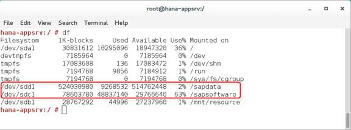

For the SAP HANA DB VM, during a database installation, when you use SAPinst with SWPM and the **typical** installation option, everything is installed under /hana and /usr/sap. The default location for the SAP HANA log backup is under /usr/sap. Again, it's important to prevent the root file system from running out of storage space. Make sure that there's enough free space under /hana and /usr/sap before you install SAP HANA by using SWPM.

For a description of the standard file-system layout of SAP HANA, see the [SAP HANA server installation and update guide](https://help.sap.com/saphelp_hanaplatform/helpdata/en/4c/24d332a37b4a3caad3e634f9900a45/frameset.htm).

When you install SAP NetWeaver on a standard SLES/SLES for SAP Applications 12 Azure gallery image, a message displays that says there's no swap space, as shown in the following screenshot. To dismiss this message, you can manually add a swap file by using **dd**, **mkswap**, and **swapon**. To learn how, search for "Adding a swap file manually" in the [Using the YaST partitioner](https://www.suse.com/documentation/sles-for-sap-12/pdfdoc/sles-for-sap-12-sp1.zip) section of the SUSE documentation.

Another option is to configure swap space by using the Linux VM agent. For more information, see the [Azure Linux Agent user guide](../../extensions/agent-linux.md).

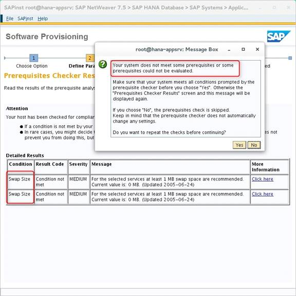

### The /etc/hosts file
Before you start to install SAP, make sure you include the host names and IP addresses of the SAP VMs in the /etc/hosts file. Deploy all the SAP VMs within one Azure virtual network. Then use the internal IP addresses, as shown here:

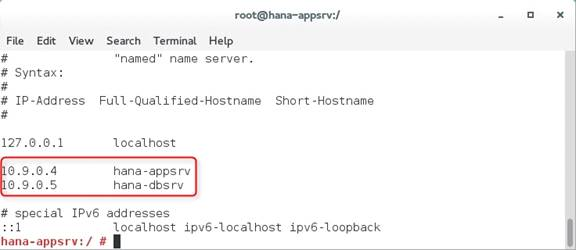

### The /etc/fstab file

It's helpful to add the **nofail** parameter to the fstab file. This way, if something goes wrong with the disks, the VM doesn't stop responding in the boot process. But remember that additional disk space might not be available, and processes might fill up the root file system. If /hana is missing, SAP HANA won't start.

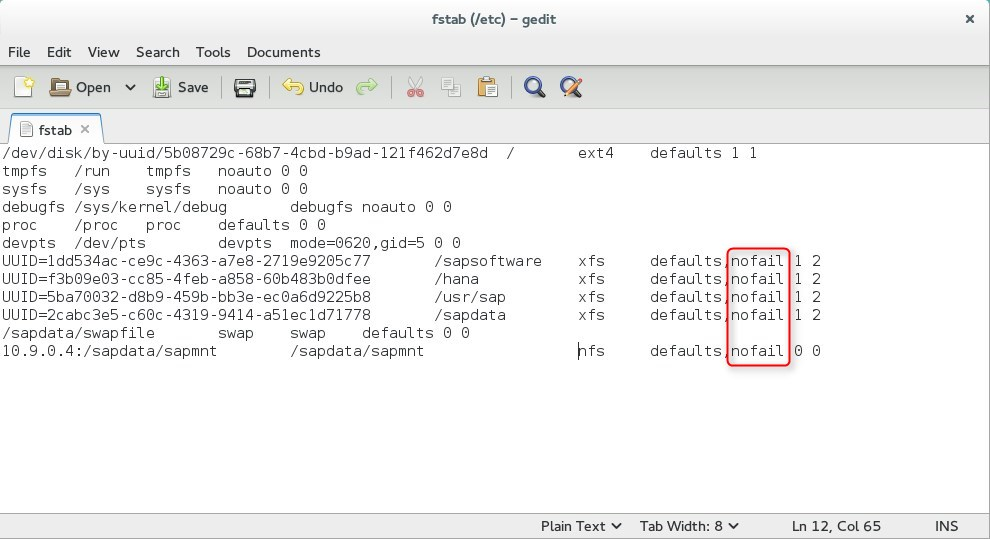

## Graphical GNOME desktop on SLES 12/SLES for SAP Applications 12
This section explains how to:

* Install the GNOME desktop and xrdp on SLES 12/SLES for SAP Applications 12.
* Run Java-based SAP MC by using Firefox on SLES 12/SLES for SAP Applications 12.

You also can use alternatives such as Xterminal or VNC, which aren't described in this guide.

### Install the GNOME desktop and xrdp on SLES 12/SLES for SAP Applications 12
If you have a Windows background, you can easily use a graphical desktop directly within the SAP Linux VMs to run Firefox, SAPinst, SAP GUI, SAP MC, or HANA Studio. Then you can connect to the VM through the Remote Desktop Protocol (RDP) from a Windows computer. Depending on your company policies about adding GUIs to production and nonproduction Linux-based systems, you might want to install GNOME on your server. Follow these steps to install the GNOME desktop on an Azure SLES 12/SLES for SAP Applications 12 VM.

1. Install the GNOME desktop by entering the following command, for example, in a PuTTY window:

   `zypper in -t pattern gnome-basic`

2. Install xrdp to allow a connection to the VM through RDP:

   `zypper in xrdp`

3. Edit /etc/sysconfig/windowmanager, and set the default window manager to GNOME:

   `DEFAULT_WM="gnome"`

4. Run **chkconfig** to make sure that xrdp starts automatically after a reboot:

   `chkconfig -level 3 xrdp on`

5. If you have an issue with the RDP connection, try to restart, for example, from a PuTTY window:

   `/etc/xrdp/xrdp.sh restart`

6. If an xrdp restart mentioned in the previous step doesn't work, check for a .pid file:

   `check /var/run` 

   Look for `xrdp.pid`. If you find it, remove it, and try to restart again.

### Start SAP MC
After you install the GNOME desktop, start the graphical Java-based SAP MC from Firefox. If it runs in an Azure SLES 12/SLES for SAP Applications 12 VM, it might display an error. The error occurs because of the missing Java browser plug-in.

The URL to start the SAP MC is `<server>:5<instance_number>13`.

For more information, see [Starting the web-based SAP Management Console](https://help.sap.com/saphelp_nwce10/helpdata/en/48/6b7c6178dc4f93e10000000a42189d/frameset.htm).

The following screenshot shows the error message that displays when the Java-browser plug-in is missing:

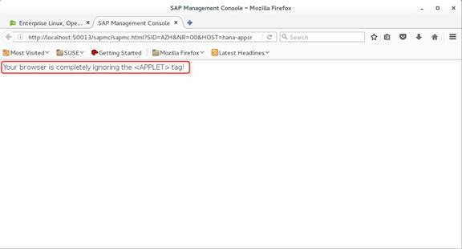

One way to solve the problem is to install the missing plug-in by using YaST, as shown in the following screenshot:

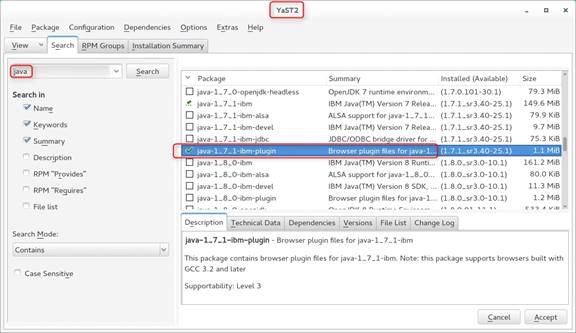

When you reenter the SAP Management Console URL, you're asked to activate the plug-in:

You might also receive an error message about a missing file, javafx.properties. It relates to the requirement of Oracle Java 1.8 for SAP GUI 7.4. For more information, see [SAP Note 2059429](https://launchpad.support.sap.com/#/notes/2059424).
The IBM Java version and the openjdk package that's delivered with SLES/SLES for SAP Applications 12 don't include the needed javafx.properties file. The solution is to download and install Java SE 8 from Oracle.

For information about a similar issue with openjdk on openSUSE, see the discussion thread [SAPGui 7.4 Java for openSUSE 42.1 Leap](https://scn.sap.com/thread/3908306).

## Manual installation of SAP HANA: SWPM
The series of screenshots in this section shows the key steps for how to install SAP NetWeaver 7.5 and SAP HANA SP12 when you use SWPM with SAPinst. As part of a NetWeaver 7.5 installation, SWPM also can install the HANA database as a single instance.

In a sample test environment, we installed one Advanced Business Application Programming (ABAP) app server. As shown in the following screenshot, we used the **Distributed System** option to install the ASCS and primary application server instances in one Azure VM. We used SAP HANA as the database system in another Azure VM.

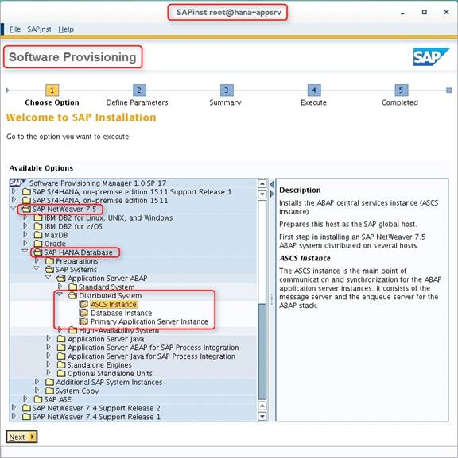

After the ASCS instance is installed on the app server VM, it's identified by a green icon in the SAP Management Console. The /sapmnt directory, which includes the SAP profile directory, must be shared with the SAP HANA DB server VM. The DB installation step needs access to this information. The best way to provide access is to use NFS, which can be configured by using YaST.

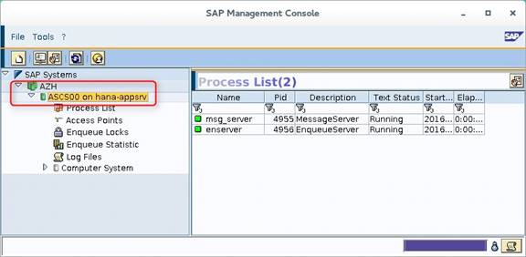

On the app server VM, the /sapmnt directory is shared via NFS by using the **rw** and **no_root_squash** options. The defaults are **ro** and **root_squash**, which might lead to problems when you install the database instance.

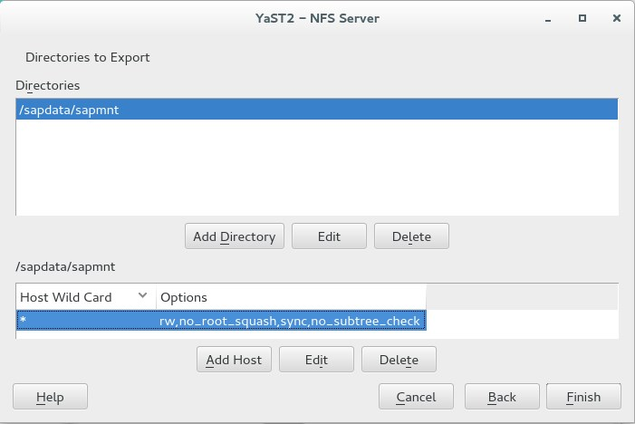

As the next screenshot shows, the /sapmnt share from the app server VM must be configured on the SAP HANA DB server VM by using **NFS Client** and YaST:

To perform a distributed NetWeaver 7.5 installation, that is, a **Database Instance**, sign in to the SAP HANA DB server VM and start SWPM:

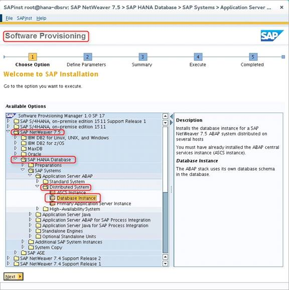

After you select **typical** installation and the path to the installation media, enter a DB SID, the host name, the instance number, and the DB system administrator password:

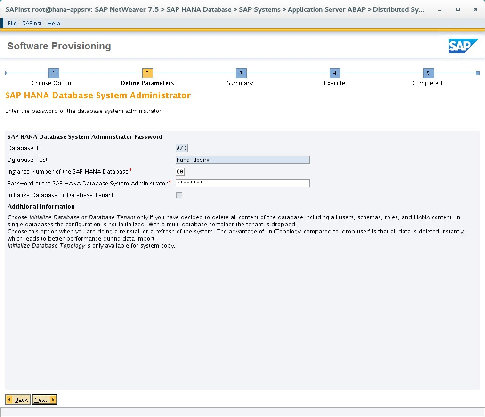

Enter the password for the DBACOCKPIT schema:

Enter a question for the SAPABAP1 schema password:

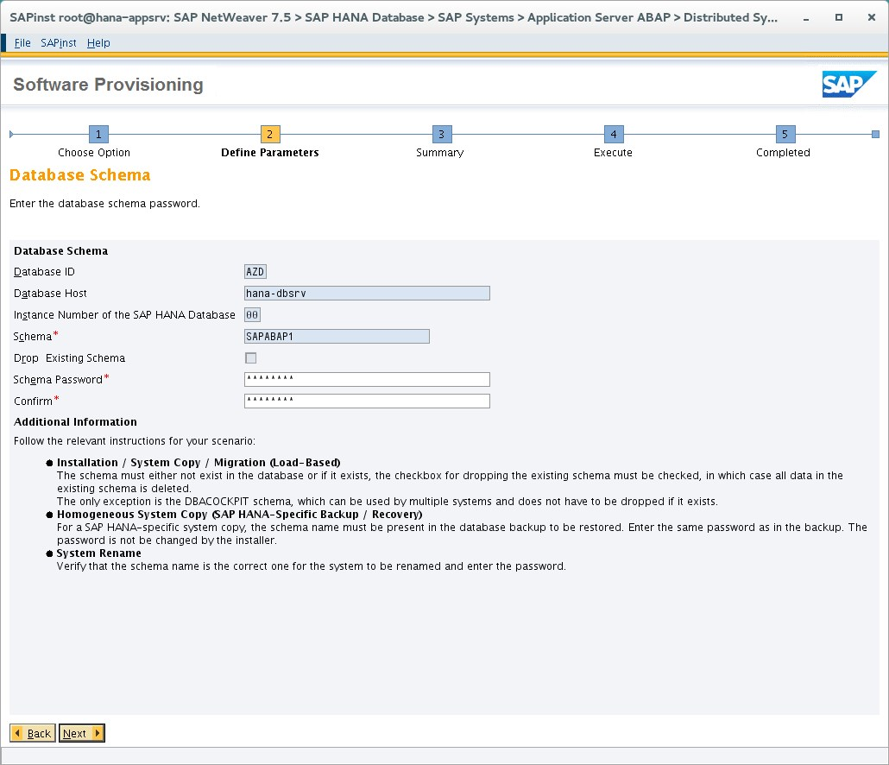

After each task is completed, a green check mark is displayed next to each phase of the DB installation process. The message "Execution of ... Database Instance has completed" is displayed.

After successful installation, the SAP Management Console also shows the DB instance with a green icon. It displays the full list of SAP HANA processes, such as hdbindexserver and hdbcompileserver.

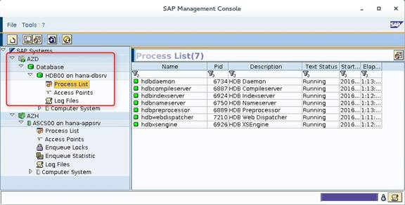

The following screenshot shows the parts of the file structure under the /hana/shared directory that SWPM created during the HANA installation. Because there's no option to specify a different path, it's important to mount additional disk space under the /hana directory before the SAP HANA installation by using SWPM. This step prevents the root file system from running out of free space.

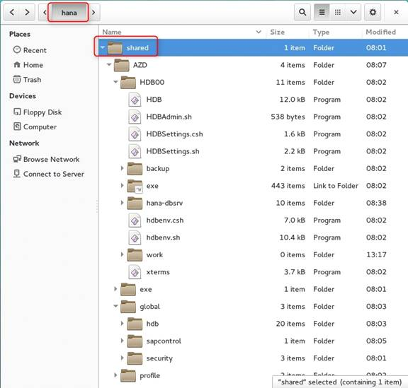

This screenshot shows the file structure of the /usr/sap directory:

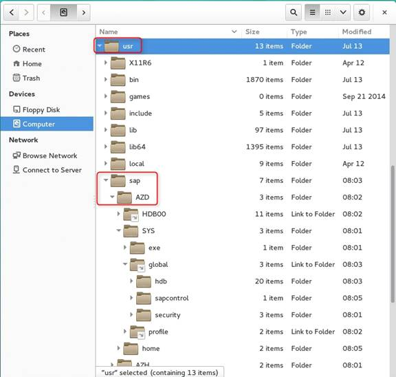

The last step of the distributed ABAP installation is to install the primary application server instance:

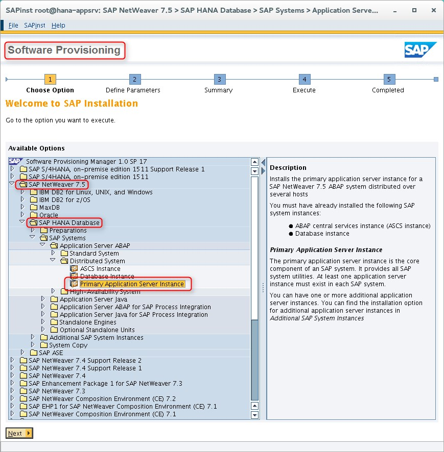

After the primary application server instance and SAP GUI are installed, use the **DBA Cockpit** transaction to confirm that the SAP HANA installation finished correctly:

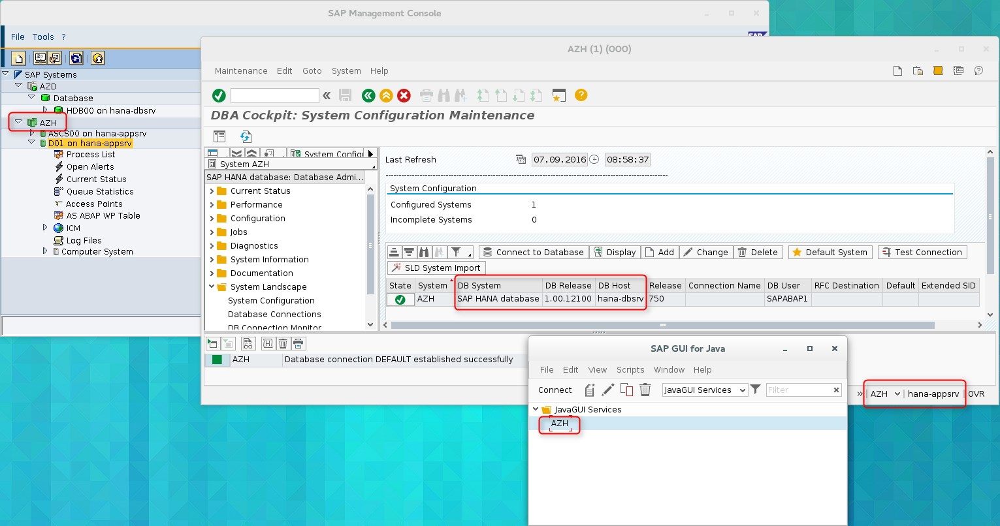

As a final step, you might want to first install HANA Studio in the SAP app server VM. Then connect to the SAP HANA instance that's running on the DB server VM.

## Manual installation of SAP HANA: HDBLCM
In addition to installing SAP HANA as part of a distributed installation by using SWPM, you can install the HANA standalone first, by using HDBLCM. You can then install SAP NetWeaver 7.5, for example. The screenshots in this section show how this process works.

For more information about the HANA HDBLCM tool, see:

* [Choose the correct SAP HANA HDBLCM for your task](https://help.sap.com/saphelp_hanaplatform/helpdata/en/68/5cff570bb745d48c0ab6d50123ca60/content.htm).
* [SAP HANA lifecycle management tools](https://www.tutorialspoint.com/sap_hana_administration/sap_hana_administration_lifecycle_management.htm).
* [SAP HANA server installation and update guide](https://help.sap.com/hana/SAP_HANA_Server_Installation_Guide_en.pdf).

You want to avoid problems with a default group ID setting for the `\<HANA SID\>adm user`, which is created by the HDBLCM tool. Before you install SAP HANA via HDBLCM, define a new group called `sapsys` by using group ID `1001`:

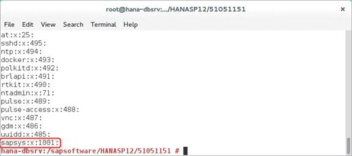

When you start HDBLCM for the first time, a simple start menu displays. Select item 1, **Install new system**:

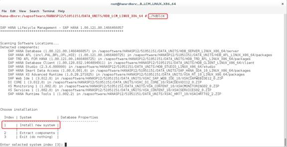

The following screenshot displays all the key options that you selected previously.

> [!IMPORTANT]
> Directories that are named for HANA log and data volumes, and the installation path, which is /hana/shared in this sample, and /usr/sap must not be part of the root file system. These directories belong to the Azure data disks that were attached to the VM. For more information, see the "Disk setup" section. 

This approach helps prevent the root file system from running out of space. Notice that the HANA system administrator has user ID `1005` and is part of the `sapsys` group, with ID `1001`, that was defined before the installation.

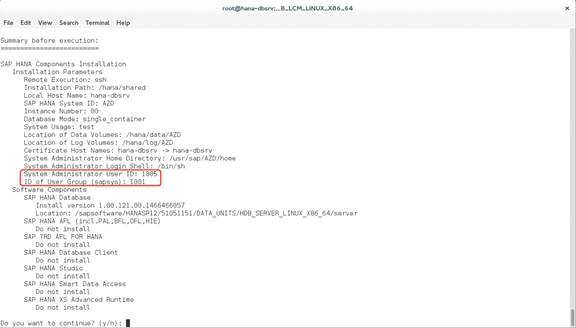

Check the `\<HANA SID\>adm user` details in the /etc/passwd directory. Look for `azdadm`, as shown in the following screenshot:

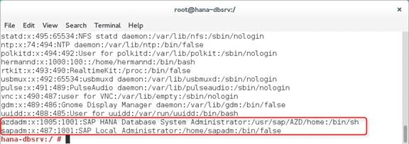

After you install SAP HANA by using HDBLCM, you can see the file structure in SAP HANA Studio, as shown in the following screenshot. The SAPABAP1 schema, which includes all the SAP NetWeaver tables, isn't available yet.

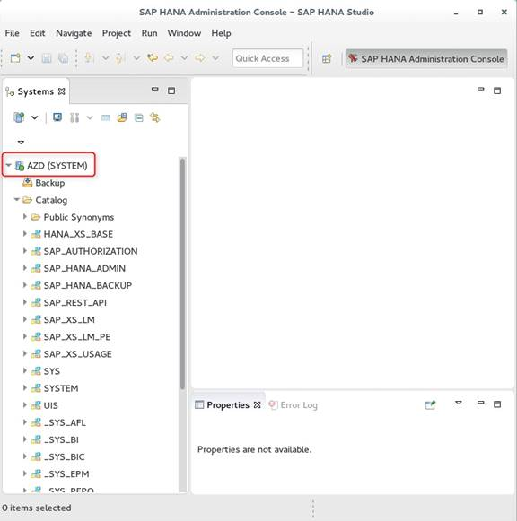

After you install SAP HANA, you can install SAP NetWeaver on top of it. As shown in the following screenshot, the installation was performed as a distributed installation by using SWPM. This process is described in the previous section. When you install the database instance by using SWPM, you enter the same data by using HDBLCM. For example, you enter the host name, HANA SID, and instance number. SWPM then uses the existing HANA installation and adds more schemas.

The following screenshot shows the SWPM installation step where you enter data about the DBACOCKPIT schema:

Enter data about the SAPABAP1 schema:

After the SWPM database instance installation is finished, you can see the SAPABAP1 schema in SAP HANA Studio:

Finally, after the SAP app server and SAP GUI installations are finished, verify the HANA DB instance by using the **DBA Cockpit** transaction:

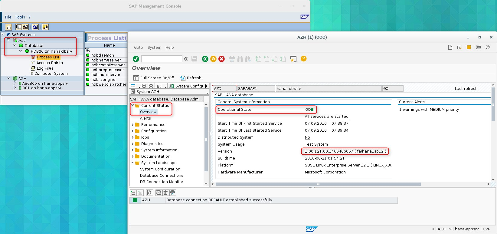

## SAP software downloads
You can download software from the SAP Service Marketplace, as shown in the following screenshots.

Download NetWeaver 7.5 for Linux/HANA:

 

Download HANA SP12 Platform Edition:

 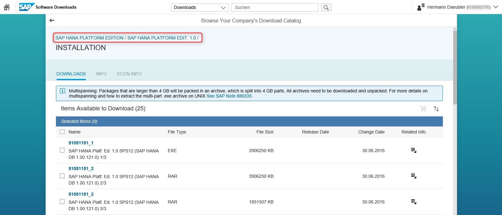

