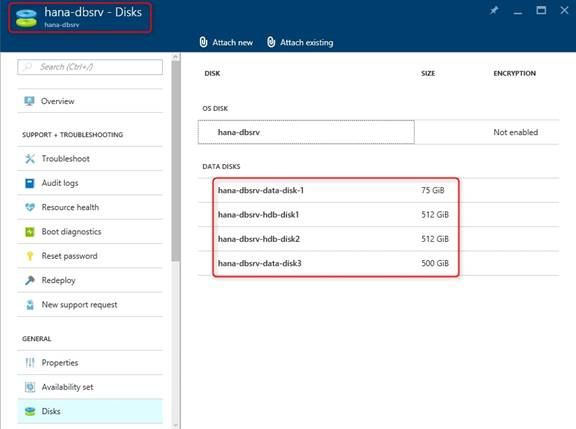

# Quick-start guide: Manual installation of single-instance SAP HANA on Azure VMs
## Introduction
This quick-start guide helps you set up a single-instance SAP HANA prototype or demo system on Azure virtual machines (VMs) when you install SAP NetWeaver 7.5 and SAP HANA SP12 manually.

The guide assumes that you are familiar with such Azure IaaS basics as:
 * How to deploy virtual machines or virtual networks via either the Azure portal or PowerShell.
 * The Azure cross-platform command-line tool (CLI), including the option to use JavaScript Object Notification (JSON) templates.

The guide also assumes that you are familiar with SAP HANA and SAP NetWeaver, and how to install them on-premises.

Additionally, you should be aware of the SAP Azure documentation that's mentioned in the "General information" section at the end of the guide.

Because the guide's content is restricted to non-production systems, it does not cover topics such as high availability (HA), backup, disaster recovery (DR), high performance, or special security considerations.

SAP-Linux-Azure is supported only on Azure Resource Manager and not the classic deployment model. Consequently, we performed a sample setup using two virtual machines to accomplish a distributed SAP NetWeaver installation through the Azure Resource Manager model. For more information about Resource Manager, see the "General information" section at the end of the guide.

For the sample installation, we used the following two test VMs:

* hana-appsrv (type DS3) to host the NetWeaver 7.5 ABAP SAP Central Services (ASCS) instance + PAS
* hana-dbsrv (type GS4) to host HANA SP12

Both VMs belonged to one Azure virtual network (azure-hana-test-vnet), and the OS in both cases was SLES 12 SP1.

As of July 2016, SAP HANA is fully supported only for OLAP (BW) production systems on Azure VM type GS5. For testing purposes, if you are not expecting official SAP support, it's fine to use something smaller, such as GS4. For SAP HANA on Azure, always use Azure premium storage for HANA data and log files (see the "Disk setup" section later in the guide). For more information about which SAP products are supported on Azure, see the "General information" section at the end of the guide.

The guide describes how to manually install SAP HANA on Azure VMs in two different ways:

* By using SAP Software Provisioning Manager (SWPM) as part of a distributed NetWeaver installation in the "install database instance" step.
* By using the HANA lifecycle management tool hdblcm and then installing NetWeaver afterward.

You can also use SWPM and install all components (SAP HANA, SAP application server, ASCS instance, SAP GUI) in one single VM. This option isn't described in the guide, but the items that must be considered are the same.

Before you start an installation, be sure to read "Prepare Azure VMs for manual installation of SAP HANA," which comes immediately after the two checklists for SAP HANA installation. Doing so can help prevent several basic mistakes that might occur when you use only a default Azure VM configuration.

## Checklist for SAP HANA installation using SAP SWPM
This section lists the key steps for a manual, single-instance SAP HANA installation for demo or prototyping purposes when you use SAP SWPM to perform a distributed SAP NetWeaver 7.5 installation. The individual items are explained in more detail in screenshots that are shown throughout the guide.

* Create an Azure virtual network that includes the two test VMs.
* Deploy two Azure VMs with OS SLES/SLES-for-SAP Applications 12 SP1 according to the Azure Resource Manager model.
* Attach two standard storage disks to the app server VM (for example, 75-GB or 500-GB disks).
* Attach four disks to the HANA DB server VM: two standard storage disks (like those for the app server VM) plus two premium storage disks (for example, two 512-GB disks).
* Depending on size or throughput requirements, attach multiple disks and create striped volumes by using either logical volume management (LVM) or a multiple-devices administration utility (mdadm) at the OS level inside the VM.
* Create XFS file systems on the attached disks/logical volumes.
* Mount the new XFS file systems at the OS level. Use one file system to keep all the SAP software, and use the other one for, for example, the /sapmnt directory and maybe backups. On the SAP HANA DB server, mount the XFS file systems on the premium storage disks as /hana and /usr/sap. This process is necessary to prevent the root file system, which isn't large on Linux Azure VMs, from filling up.
* Enter the local IP addresses of the test VMs in /etc/hosts.
* Enter the nofail parameter in /etc/fstab.
* Set kernel parameters according to the HANA-SLES-12 SAP note. For more information, see the "Kernel parameters" section.
* Add swap space.
* Optionally, install a graphical desktop on the test VMs. Otherwise, use a remote SAPinst installation.
* Download the SAP software from the SAP service marketplace.
* Install the SAP ASCS instance on the app server VM.
* Share the /sapmnt directory among the test VMs by using NFS. The app server VM is the NFS server.
* Install the database instance, including HANA, by using SWPM on the DB server VM.
* Install the primary application server (PAS) on the app server VM.
* Start SAP management console (MC) and connect with, for example, SAP GUI/HANA Studio.

## Checklist for SAP HANA installation using hdblcm
This section lists the key steps for a manual, single-instance SAP HANA installation for demo or prototyping purposes when you use SAP hdblcm to perform a distributed SAP NetWeaver 7.5 installation. The individual items are explained in more detail in screenshots that are shown throughout the guide.

* Create an Azure virtual network that includes the two test VMs.
* Deploy two Azure VMs with OS SLES/SLES-for-SAP Applications 12 SP1 according to the Azure Resource Manager model.
* Attach two standard storage disks to the app server VM (for example, 75-GB or 500-GB disks).
* Attach four disks to the HANA DB server VM: Two standard storage disks (like those for the app server VM) plus two premium storage disks (for example, two 512-GB disks).
* Depending on size or throughput requirements, attach multiple disks and create striped volumes by using either logical volume management (LVM) or a multiple-devices administration utility (mdadm) at the OS level inside the VM.
* Create XFS file systems on the attached disks/logical volumes.
* Mount the new XFS file systems at the OS level. Use one file system to keep all the SAP software, and use the other one for, for example, the /sapmnt directory and maybe backups. On the SAP HANA DB server, mount the XFS file systems on the premium storage disks as /hana and /usr/sap. This process is necessary to help prevent the root file system, which isn't large on Linux Azure VMs, from filling up.
* Enter the local IP addresses of the test VMs in /etc/hosts.
* Enter the nofail parameter in /etc/fstab.
* Set kernel parameters according to the HANA-SLES-12 SAP note. For more information, see the "Kernel parameters" section.
* Add swap space.
* Optionally, install a graphical desktop on the test VMs. Otherwise, use a remote SAPinst installation.
* Download the SAP software from the SAP service marketplace.
* Create a group, "sapsys," with group ID 1001 on the HANA DB server VM.
* Install SAP HANA on the DB server VM by using HANA database lifecycle manager (HDBLCM).
* Install the SAP ASCS instance on the app server VM.
* Share the /sapmnt directory among the test VMs by using NFS. The app server VM is the NFS server.
* Install the database instance, including HANA, by using SWPM on the HANA DB server VM.
* Install the primary application server (PAS) on the app server VM.
* Start SAP MC and connect through SAP GUI/HANA Studio.

## Prepare Azure VMs for a manual installation of SAP HANA
This section covers the following topics:

* OS Updates
* Disk setup
* Kernel parameters
* File systems
* /etc/hosts
* /etc/fstab

### OS Updates
As SUSE provides updates and fixes for the OS which help to maintain security and smooth operation it is wise to check if there are updates availabe before installing additional software.
Many times a support call could be avoided, if the system is at the actual patch level.

The Azure on-demand images are automatically connected to the SUSE update infrastructure where additional software and updates are available.
The BYOS images need to be registered with the SUSE Customer Center ( https://scc.suse.com )

Simply check the available patches with:

 `sudo zypper list-patches`

Depending on the kind of defect, patches are classified by category and severity.

Commonly used values for category are: security, recommended, optional, feature, document or yast.

Commonly used values for severity are: critical, important, moderate, low or unspecified.

zypper will only look for the needed updates for your installed packages.

So an example command could be:

`sudo zypper patch  --category=security,recommended --severity=critical,important`

If you add the parameter *--dry-run* you can test the update, but it does not actually update the system.

### Disk setup
The root file system in a Linux VM on Azure is of limited size. Therefore, it's necessary to attach additional disk space to a VM for running SAP. If the SAP app server VM is used in a pure prototype or demo environment, it's fine to use Azure standard storage disks. For SAP HANA DB data and log files, use Azure premium storage disks even in a non-production landscape.

For more information, see [how to attach disks to a Linux VM](../../linux/add-disk.md?toc=%2fazure%2fvirtual-machines%2flinux%2ftoc.json).

For Azure disk caching, enter **None** for disks that are to be used to store the
HANA transaction logs. For HANA data files, it's OK to use read caching. Because HANA is an in-memory database, how much the read cache on Azure disk level might improve performance (for example, starting HANA and reading data from the disk into memory) depends on the overall usage pattern.

For more information, see [Premium Storage: High-performance storage for Azure Virtual Machine workloads](../../../storage/storage-premium-storage.md).

To find sample JSON templates for creating VMs, go to [Azure Quickstart Templates](https://github.com/Azure/azure-quickstart-templates).
The "vm-simple-sles" template shows a basic template, which includes a storage section with an additional 100-GB data disk.

For information about how to find a SUSE image by using PowerShell or CLI, and to understand the importance of attaching a disk by using UUID, see [Running SAP NetWeaver on Microsoft Azure SUSE Linux VMs](suse-quickstart.md?toc=%2fazure%2fvirtual-machines%2flinux%2ftoc.json).

Depending on the size or throughput requirements of the system, you might need to attach multiple disks instead of one and, later, create a stripe set across the disks at the OS level. You'll create a stripe set across multiple Azure disks for two reasons:

* You can increase throughput.
* You need a single file system that's greater than 1 TB, because the current Azure disk-size limit is 1 TB (as of July 2016).

For more information about the two main tools for configuring striping, see the following articles:

* [Configure software RAID on Linux](../../linux/configure-raid.md?toc=%2fazure%2fvirtual-machines%2flinux%2ftoc.json)
* [Configure LVM on a Linux VM in Azure](../../linux/configure-lvm.md?toc=%2fazure%2fvirtual-machines%2flinux%2ftoc.json)

In the test environment, two Azure standard storage disks were attached to the SAP app server VM, as shown in the following screenshot. One disk stored all the SAP software for installation (that is, NetWeaver 7.5, SAP GUI, SAP HANA, and so forth). The second disk ensured that enough free space would be available for additional requirements (for example, backup and test data) and the /sapmnt directory (that is, SAP profiles) to be shared among all VMs that belong to the same SAP landscape.

Unlike the app server VM scenario, four disks were attached to the SAP HANA server VM, as shown in the following screenshot. Two disks were used to store the SAP software (you can also share the SAP software disk by using NFS) and make enough free space available (for backup, for example). The additional two disks were Azure premium storage disks to store SAP HANA data and log files and the /usr/sap directory.

### Kernel parameters
SAP HANA requires specific Linux kernel settings, which are not part of the standard Azure gallery images and must be set manually. An SAP HANA note describes the recommended OS settings for SLES 12/SLES for SAP Applications 12: [SAP Note 2205917](https://launchpad.support.sap.com/#/notes/2205917).

SLES-for-SAP Applications 12 GA and SP1 have a new tool that replaces the old sapconf utility. It's called tuned-adm, and a special SAP HANA profile is available for it. To tune the system for SAP HANA simply type as root user:
   'tuned-adm profile sap-hana'

For more information about tuned-adm, see the SUSE documentation at:

* [SLES-for-SAP Applications 12 SP1 documentation about tuned-adm profile sap-hana.](https://www.suse.com/documentation/sles-for-sap-12/pdfdoc/sles-for-sap-12-sp1.zip)

In the following screenshot, you can see how tuned-adm changed the transparent_hugepage and numa_balancing values, according to the required SAP HANA settings.

To make the SAP HANA kernel settings permanent, use grub2 on SLES 12. For more information about grub2, go to the ["Configuration File Structure" section of SUSE documentation](https://www.suse.com/documentation/sles-for-sap-12/pdfdoc/sles-for-sap-12-sp1.zip).

The following screenshot shows how the kernel settings were changed in the config file and then compiled by using grub2-mkconfig.

Another option might be to change the settings by using YaST and the **Boot Loader** > **Kernel Parameters** settings.

### File systems
The following screenshot shows two file systems that were created on the SAP app server VM on top of the two attached Azure standard storage disks. Both file systems are of type XFS and mounted to /sapdata and /sapsoftware.

It is not mandatory to structure your file systems in this way. You have other options for structuring the disk space. The most important consideration is to prevent the root file system from running out of free space.

Regarding the SAP HANA DB VM, it's important to know that during a database installation, when you use SAPinst (SWPM) and the simple "typical" installation option, it installs everything by default under /hana and /usr/sap. The default setting for SAP HANA log backup is under /usr/sap. Again, because it's important to prevent the root file system from running out of storage space, make sure that there is enough free space under /hana and /usr/sap before you install SAP HANA by using SWPM.

For a description of the standard file-system layout of SAP HANA, see the [SAP HANA Server Installation and Update Guide](http://help.sap.com/saphelp_hanaplatform/helpdata/en/4c/24d332a37b4a3caad3e634f9900a45/frameset.htm).

When you install SAP NetWeaver on a standard SLES/SLES-for-SAP Applications 12 Azure gallery image, a message is displayed that says that there is no swap space. To dismiss this message, you can manually add a swap file by using dd, mkswap, and swapon. To learn how, search for "Adding a Swap File Manually" in the ["Using the YaST Partitioner" section of SUSE documentation](https://www.suse.com/documentation/sles-for-sap-12/pdfdoc/sles-for-sap-12-sp1.zip).

Another option is to configure swap space by using the Linux VM agent. For more information, see the [Azure Linux Agent User Guide](../../linux/agent-user-guide.md?toc=%2fazure%2fvirtual-machines%2flinux%2ftoc.json).

### /etc/hosts
Another important thing to keep in mind before you start to install SAP is to include host names and IP addresses of the SAP VMs in the /etc/hosts file. Deploy all the SAP VMs within one Azure virtual network, and then use the internal IP addresses.

### /etc/fstab

During the testing phase, we found it a good idea to add the nofail parameter to fstab. If something goes wrong with the disks, the VM still comes up and does not hang in the boot process. But pay close attention, because, as in this scenario, the additional disk space might not be available and processes might fill up the root file system. If /hana is missing, SAP HANA won't start.

## Install graphical Gnome desktop on SLES 12/SLES-for-SAP Applications 12
This section covers the following topics:

* Installing Gnome desktop and xrdp on SLES 12/SLES-for-SAP Applications 12
* Running Java-based SAP MC by using Firefox on SLES 12/SLES-for-SAP Applications 12

You can also use alternatives such as Xterminal or VNC but, as of September 2016, the guide describes only xrdp.

### Installing Gnome desktop and xrdp on SLES 12/SLES-for-SAP Applications 12
If you have a Microsoft Windows background, you can easily use a graphical desktop directly within the SAP Linux VMs to run Firefox, Sapinst, SAP GUI, SAP MC, or HANA Studio and connect to the VM through RDP from a Windows computer. Although the procedure might not be appropriate for a production database server, it's OK for a pure prototype/demo environment. Here is how to install Gnome desktop on an Azure SLES 12/SLES-for-SAP Applications 12 VM:

Install the gnome desktop by entering the following command (for example, in a putty window):

`zypper in -t pattern gnome-basic`

Install xrdp to allow a connection to the VM through RDP:

`zypper in xrdp`

Edit /etc/sysconfig/windowmanager, and set the default windows manager to Gnome:

`DEFAULT_WM="gnome"`

Run chkconfig to make sure that xrdp starts automatically after a reboot:

`chkconfig -level 3 xrdp on`

If you have an issue with the RDP connection, try to restart (maybe from a putty window):

`/etc/xrdp/xrdp.sh restart`

If xrdp restart as mentioned previously doesn't work, check whether there is a .pid file and remove it:

`check /var/run` and look for `xrdp.pid`

Remove it and then try the restart again.

### SAP MC
After you install the Gnome desktop, starting the graphical Java-based SAP MC from Firefox running in an Azure SLES 12/SLES-for-SAP Applications 12 VM might display an error because of the missing Java-browser plug-in.

The URL to start the SAP MC is <server>:5<instance_number>13.

For more information, see [Starting the Web-Based SAP Management Console](https://help.sap.com/saphelp_nwce10/helpdata/en/48/6b7c6178dc4f93e10000000a42189d/frameset.htm).

The following screenshot shows the error message that's displayed when the Java-browser plug-in is missing.

One way to solve the problem is simply to install the missing plug-in by using YaST, as shown in the following screenshot.

Repeating the SAP Management Console URL displays a dialog box that asks you to activate the plug-in.

One additional issue that might occur is an error message about a missing file, javafx.properties. This is related to the requirement of Oracle Java 1.8 for SAP GUI 7.4. [see SAP Note 2059429](https://launchpad.support.sap.com/#/notes/2059424)
The IBM Java version nor the openjdk package delivered with SLES/SLES-for-SAP Applications 12 include the needed javafx. The solution is to download and install Java SE8 from Oracle.

An article which talks about a similar issue on openSUSE with openjdk can be found at [SAPGui 7.4 Java for openSUSE 42.1 Leap](https://scn.sap.com/thread/3908306).

## Install SAP HANA manually by using SWPM as part of a NetWeaver 7.5 installation
The series of screenshots in this section shows the key steps for installing SAP NetWeaver 7.5 and SAP HANA SP12 when you use SWPM (SAPinst). As part of a NetWeaver 7.5 installation, SWPM can also install the HANA database as a single instance.

In the sample test environment, we installed just one Advanced Business Application Programming (ABAP) app server. As shown in the following screenshot, we used the "Distributed System" option to install the ASCS and primary application server instances in one Azure VM and SAP HANA as the database system in another Azure VM.

After the ASCS instance is installed on the app server VM and is set to "green" in the SAP Management Console, the /sapmnt directory (including the SAP profile directory) must be shared with the SAP HANA DB server VM. The DB installation step needs access to this information. The best way to provide access is to use NFS, which can be configured by using YaST.

On the app server VM, the /sapmnt directory should be shared via NFS by using the **rw** and **no_root_squash** options. The defaults are "ro" and "root_squash," which might lead to problems when you install the database instance.

As the next screenshot shows, the /sapmnt share from the app server VM must be configured on the SAP HANA DB server VM by using **NFS Client** (with the help of YaST).

To perform a distributed NetWeaver 7.5 installation, **Database Instance**, as shown in the following screenshot, sign in to the SAP HANA DB server VM and start SWPM.

After you select a "typical" installation and the path to the installation media, enter a DB SID, the host name, the instance number, and the DB System Administrator password.

Enter the password for the DBACOCKPIT schema.

Enter a question for the SAPABAP1 schema password.

After the task is completed, a green checkmark is displayed next to each phase of the DB installation process. A Message Box window should display a message that says, "Execution of ... Database Instance has completed."

After the successful installation, the SAP Management Console should also show the DB instance as "green" and display the full list of SAP HANA processes (hdbindexserver, hdbcompileserver, and so forth).

The following screenshot shows the parts of the file structure under /hana/shared that SWPM created during the HANA installation. Because there was no option to specify a different path, it's important to mount additional disk space under /hana before the SAP HANA installation by using SWPM to prevent the root file system from running out of free space.

This screenshot shows the file structure of the /usr/sap directory.

The last step of the distributed ABAP installation is the "Primary Application Server Instance."

After the Primary Application Server Instance and SAP GUI are installed, use the transaction "dbacockpit" to confirm that the SAP HANA installation has completed correctly.

As a final step, you might want to first install SAP HANA Studio in the SAP app server VM and then connect to the SAP HANA instance that's running on the DB server VM.

## Install SAP HANA manually by using the HANA lifecycle management tool (hdblcm)
In addition to installing SAP HANA as part of a distributed installation by using SWPM, you can install HANA standalone first by using hdblcm. Afterward, you can install, for example, SAP NetWeaver 7.5. The following screenshots show how this process works.

Here are three sources of information about the HANA hdblcm tool:

* [Choosing the Correct SAP HANA HDBLCM for Your Task](https://help.sap.com/saphelp_hanaplatform/helpdata/en/68/5cff570bb745d48c0ab6d50123ca60/content.htm)
* [SAP HANA Lifecycle Management Tools](http://saphanatutorial.com/sap-hana-lifecycle-management-tools/)
* [SAP HANA Server Installation and Update Guide](http://help.sap.com/hana/SAP_HANA_Server_Installation_Guide_en.pdf)

To avoid problems with a default group ID setting for the \<HANA SID\>adm user (created by the hdblcm tool), define a new group called "sapsys" by using group ID 1001 before you install SAP HANA via hdblcm.

When you start hdblcm the first time, a simple start menu is displayed. Select item 1, **Install new system**, as shown in the following screenshot.

The following screenshot displays all the key options that you selected previously.

> [!IMPORTANT]
> Directories that are named for HANA log and data volumes, as well as the installation path (/hana/shared in this sample) and /usr/sap, should not be part of the root file system. The directories belong to the Azure data disks that were attached to the VM, as described in the Azure VM setup section. This approach will help avoid the risk of having the root file system run out of space. You can also see that the HANA admin has user ID 1005 and is part of the sapsys group (ID 1001) that was defined before the installation.

You can check the HANA \<HANA SID\>adm (azdadm in the following screenshot) user details in /etc/passwd.

After you install SAP HANA by using hdblcm, you can see the file structure in SAP HANA Studio. The SAPABAP1 schema, which includes all the SAP NetWeaver tables, isn't available yet.

After you install SAP HANA, you can install SAP NetWeaver on top of it. As shown in this screenshot, the installation was performed as a "distributed installation" by using SWPM (as described in the previous section). When you install the database instance by using SWPM, you enter the same data by using hdblcm (for example, host name, HANA SID, and instance number). SWPM then uses the existing HANA installation and adds more schemas.

The following screenshot shows the SWPM installation step where you enter data about the DBACOCKPIT schema.

Enter data about the SAPABAP1 schema.

After the SWPM database instance installation is completed, you can see the SAPABAP1 schema in SAP HANA Studio.

Finally, after the SAP app server and SAP GUI installation is completed, you can verify the HANA DB instance by using the "dbacockpit" transaction.

## About SAP Azure certifications and running SAP HANA on Azure
For more information, see the following documentation:
* General SAP Azure information about running SAP on Azure with Windows OS in classic mode: [Using SAP on Windows virtual machines in Azure](../../virtual-machines-windows-classic-sap-get-started.md?toc=%2fazure%2fvirtual-machines%2fwindows%2fclassic%2ftoc.json).
* Information about existing SAP templates for customer use: [Azure Quickstart Templates for SAP](https://blogs.msdn.microsoft.com/saponsqlserver/2016/05/16/azure-quickstart-templates-for-sap/).
* General SAP Azure information about running SAP on Azure with Linux OS in Azure Resource Manager model: [Using SAP on Linux virtual machines (VMs)](get-started.md?toc=%2fazure%2fvirtual-machines%2flinux%2ftoc.json).
* Certified SAP HANA hardware directory, which lists which Azure VM types are supported for production: [Certified SAP HANA® Hardware Directory](https://global.sap.com/community/ebook/2014-09-02-hana-hardware/enEN/iaas.html).
* Information about virtual machine sizes especially for Linux workloads: [Sizes for virtual machines in Azure](../../linux/sizes.md?toc=%2fazure%2fvirtual-machines%2flinux%2ftoc.json).
* SAP Note that lists all supported SAP products on Azure and supported Azure VM types for SAP: [SAP Note 1928533](https://launchpad.support.sap.com/#/notes/1928533/E).
* SAP Note about SAP "enhanced monitoring" with Linux VMs on Azure: [SAP Note 2191498](https://launchpad.support.sap.com/#/notes/2191498/E).
* SAP HANA offering on Azure "Large Instances." It's important to understand that this information is not about running SAP HANA on Azure VMs. It's about a hybrid environment where the SAP app servers run in Azure VMs but SAP HANA runs on bare-metal servers: [SAP Note 2316233](https://launchpad.support.sap.com/#/notes/2316233/E).
* SAP Note with information about SAPOSCOL on Linux: [SAP Note 1102124](https://launchpad.support.sap.com/#/notes/1102124/E).
* Key monitoring metrics for SAP on Microsoft Azure: [SAP Note 2178632](https://launchpad.support.sap.com/#/notes/2178632/E).
* Information about Azure Resource Manager: [Azure Resource Manager overview](../../../azure-resource-manager/resource-group-overview.md).
* Information about deploying Linux VMs by using templates: [Deploy and manage virtual machines by using Azure Resource Manager templates and the Azure CLI](../../linux/cli-deploy-templates.md?toc=%2fazure%2fvirtual-machines%2flinux%2ftoc.json).
* Comparison of Azure Resource Manager and classic deployment models: [Azure Resource Manager vs. classic deployment: Understand deployment models and the state of your resources](../../../resource-manager-deployment-model.md).

## SAP software downloads
You can download software from the SAP Service Marketplace, as shown in the following screenshots.

* Download NetWeaver 7.5 for Linux/HANA:

 
* Download HANA SP12 Platform Edition:

 

