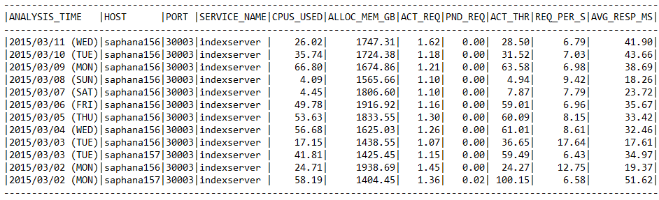

# Monitoring and troubleshooting from HANA side

In order to effectively analyze problems related to SAP HANA on Azure (Large Instances), it is useful to narrow down the root cause of a problem. SAP has published a large amount of documentation to help you.

Applicable FAQs related to SAP HANA performance can be found in the following SAP Notes:

- [SAP Note #2222200 – FAQ: SAP HANA Network](https://launchpad.support.sap.com/#/notes/2222200)
- [SAP Note #2100040 – FAQ: SAP HANA CPU](https://launchpad.support.sap.com/#/notes/0002100040)
- [SAP Note #199997 – FAQ: SAP HANA Memory](https://launchpad.support.sap.com/#/notes/2177064)
- [SAP Note #200000 – FAQ: SAP HANA Performance Optimization](https://launchpad.support.sap.com/#/notes/2000000)
- [SAP Note #199930 – FAQ: SAP HANA I/O Analysis](https://launchpad.support.sap.com/#/notes/1999930)
- [SAP Note #2177064 – FAQ: SAP HANA Service Restart and Crashes](https://launchpad.support.sap.com/#/notes/2177064)

## SAP HANA Alerts

As a first step, check the current SAP HANA alert logs. In SAP HANA Studio, go to **Administration Console: Alerts: Show: all alerts**. This tab will show all SAP HANA alerts for specific values (free physical memory, CPU utilization, etc.) that fall outside of the set minimum and maximum thresholds. By default, checks are auto-refreshed every 15 minutes.

## CPU

For an alert triggered due to improper threshold setting, a resolution is to reset to the default value or a more reasonable threshold value.

The following alerts may indicate CPU resource problems:

- Host CPU Usage (Alert 5)
- Most recent savepoint operation (Alert 28)
- Savepoint duration (Alert 54)

You may notice high CPU consumption on your SAP HANA database from one of the following:

- Alert 5 (Host CPU usage) is raised for current or past CPU usage
- The displayed CPU usage on the overview screen

The Load graph might show high CPU consumption, or high consumption in the past:

An alert triggered due to high CPU utilization could be caused by several reasons, including, but not limited to: execution of certain transactions, data loading, jobs that are not responding, long running SQL statements, and bad query performance (for example, with BW on HANA cubes).

Refer to the [SAP HANA Troubleshooting: CPU Related Causes and Solutions](https://help.sap.com/saphelp_hanaplatform/helpdata/en/4f/bc915462db406aa2fe92b708b95189/content.htm?frameset=/en/db/6ca50424714af8b370960c04ce667b/frameset.htm&amp;current_toc=/en/85/d132c3f05e40a2b20c25aa5fd6331b/plain.htm&amp;node_id=46&amp;show_children=false) site for detailed troubleshooting steps.

## Operating System

One of the most important checks for SAP HANA on Linux is to make sure that Transparent Huge Pages are disabled, see [SAP Note #2131662 – Transparent Huge Pages (THP) on SAP HANA Servers](https://launchpad.support.sap.com/#/notes/2131662).

- You can check if Transparent Huge Pages are enabled through the following Linux command:
**cat /sys/kernel/mm/transparent\_hugepage/enabled**
- If _always_ is enclosed in brackets as below, it means that the Transparent Huge Pages are enabled: [always] madvise never; if _never_ is enclosed in brackets as below, it means that the Transparent Huge Pages are disabled: always madvise [never]

The following Linux command should return nothing: **rpm -qa | grep ulimit.** If it appears _ulimit_ is installed, uninstall it immediately.

## Memory

You may observe that the amount of memory allocated by the SAP HANA database is higher than expected. The following alerts indicate issues with high memory usage:

- Host physical memory usage (Alert 1)
- Memory usage of name server (Alert 12)
- Total memory usage of Column Store tables (Alert 40)
- Memory usage of services (Alert 43)
- Memory usage of main storage of Column Store tables (Alert 45)
- Runtime dump files (Alert 46)

Refer to the [SAP HANA Troubleshooting: Memory Problems](https://help.sap.com/saphelp_hanaplatform/helpdata/en/db/6ca50424714af8b370960c04ce667b/content.htm?frameset=/en/59/5eaa513dde43758b51378ab3315ebb/frameset.htm&amp;current_toc=/en/85/d132c3f05e40a2b20c25aa5fd6331b/plain.htm&amp;node_id=26&amp;show_children=false) site for detailed troubleshooting steps.

## Network

Refer to [SAP Note #2081065 – Troubleshooting SAP HANA Network](https://launchpad.support.sap.com/#/notes/2081065) and perform the network troubleshooting steps in this SAP Note.

1. Analyzing round-trip time between server and client.
  A. Run the SQL script [_HANA\_Network\_Clients_](https://launchpad.support.sap.com/#/notes/1969700)_._
  
2. Analyze internode communication.
  A. Run SQL script [_HANA\_Network\_Services_](https://launchpad.support.sap.com/#/notes/1969700)_._

3. Run Linux command **ifconfig** (the output shows if any packet losses are occurring).
4. Run Linux command **tcpdump**.

Also, use the open source [IPERF](https://iperf.fr/) tool (or similar) to measure real application network performance.

Refer to the [SAP HANA Troubleshooting: Networking Performance and Connectivity Problems](https://help.sap.com/saphelp_hanaplatform/helpdata/en/a3/ccdff1aedc4720acb24ed8826938b6/content.htm?frameset=/en/dc/6ff98fa36541e997e4c719a632cbd8/frameset.htm&amp;current_toc=/en/85/d132c3f05e40a2b20c25aa5fd6331b/plain.htm&amp;node_id=142&amp;show_children=false) site for detailed troubleshooting steps.

## Storage

From an end-user perspective, an application (or the system as a whole) runs sluggishly, is unresponsive, or can even seem to stop responding if there are issues with I/O performance. In the **Volumes** tab in SAP HANA Studio, you can see the attached volumes, and what volumes are used by each service.

Attached volumes in the lower part of the screen you can see details of the volumes, such as files and I/O statistics.

Refer to the [SAP HANA Troubleshooting: I/O Related Root Causes and Solutions](https://help.sap.com/saphelp_hanaplatform/helpdata/en/dc/6ff98fa36541e997e4c719a632cbd8/content.htm?frameset=/en/47/4cb08a715c42fe9f7cc5efdc599959/frameset.htm&amp;current_toc=/en/85/d132c3f05e40a2b20c25aa5fd6331b/plain.htm&amp;node_id=55&amp;show_children=false) and [SAP HANA Troubleshooting: Disk Related Root Causes and Solutions](https://help.sap.com/saphelp_hanaplatform/helpdata/en/47/4cb08a715c42fe9f7cc5efdc599959/content.htm?frameset=/en/44/3e1db4f73d42da859008df4f69e37a/frameset.htm&amp;current_toc=/en/85/d132c3f05e40a2b20c25aa5fd6331b/plain.htm&amp;node_id=53&amp;show_children=false) site for detailed troubleshooting steps.

## Diagnostic Tools

Perform an SAP HANA Health Check through HANA\_Configuration\_Minichecks. This tool returns potentially critical technical issues that should have already been raised as alerts in SAP HANA Studio.

Refer to [SAP Note #1969700 – SQL statement collection for SAP HANA](https://launchpad.support.sap.com/#/notes/1969700) and download the SQL Statements.zip file attached to that note. Store this .zip file on the local hard drive.

In SAP HANA Studio, on the **System Information** tab, right-click in the **Name** column and select **Import SQL Statements**.

Select the SQL Statements.zip file stored locally, and a folder with the corresponding SQL statements will be imported. At this point, the many different diagnostic checks can be run with these SQL statements.

For example, to test SAP HANA System Replication bandwidth requirements, right-click the **Bandwidth** statement under **Replication: Bandwidth** and select **Open** in SQL Console.

The complete SQL statement opens allowing input parameters (modification section) to be changed and then executed.

Another example is right-clicking on the statements under **Replication: Overview**. Select **Execute** from the context menu:

This results in information that helps with troubleshooting:

Do the same for HANA\_Configuration\_Minichecks and check for any _X_ marks in the _C_ (Critical) column.

Sample outputs:

**HANA\_Configuration\_MiniChecks\_Rev102.01+1** for general SAP HANA checks.

**HANA\_Services\_Overview** for an overview of what SAP HANA services are currently running.

**HANA\_Services\_Statistics** for SAP HANA service information (CPU, memory, etc.).

**HANA\_Configuration\_Overview\_Rev110+** for general information on the SAP HANA instance.

**HANA\_Configuration\_Parameters\_Rev70+** to check SAP HANA parameters.

**Next steps**

- Refer [High availability set up in SUSE using the STONITH](ha-setup-with-stonith.md).