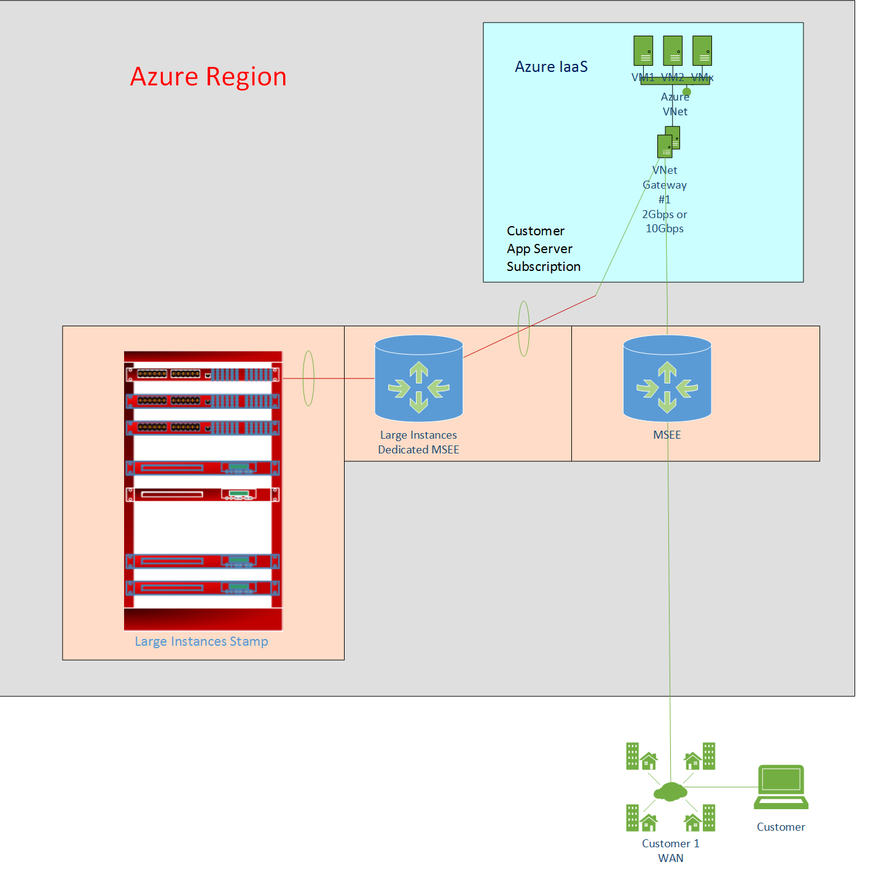
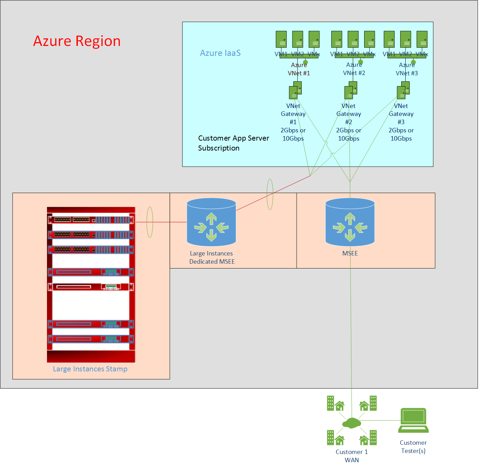
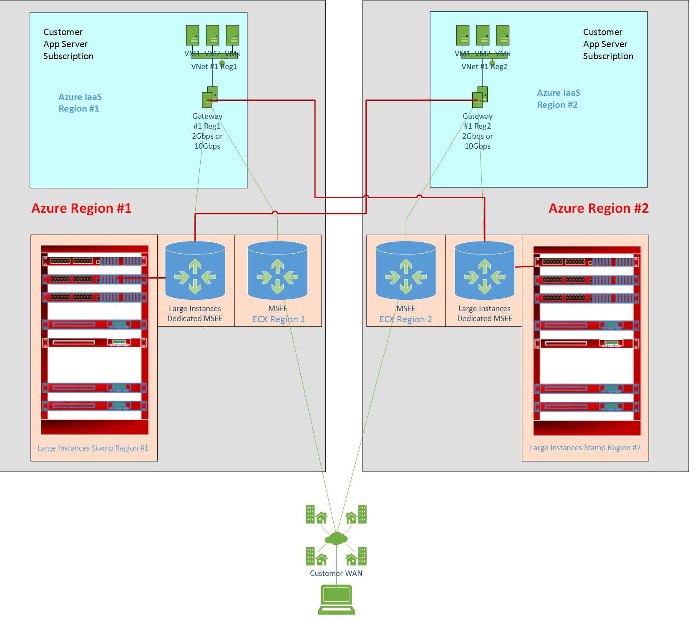

# SAP HANA (Large Instances) network architecture

The architecture of Azure network services is a key component of the successful deployment of SAP applications on HANA Large Instance. Typically, SAP HANA on Azure (Large Instances) deployments have a larger SAP landscape with several different SAP solutions with varying sizes of databases, CPU resource consumption, and memory utilization. It's likely that not all those SAP systems are based on SAP HANA. Your SAP landscape is probably a hybrid that uses:

- Deployed SAP systems on-premises. Due to their sizes, these systems currently can't be hosted in Azure. An example is a production SAP ERP system that runs on SQL Server (as the database) and requires more CPU or memory resources than VMs can provide.
- Deployed SAP HANA-based SAP systems on-premises.
- Deployed SAP systems in VMs. These systems can be development, testing, sandbox, or production instances for any of the SAP NetWeaver-based applications that can successfully deploy in Azure (on VMs), based on resource consumption and memory demand. These systems also can be based on databases such as SQL Server. For more information, see [SAP Support Note #1928533 – SAP applications on Azure: Supported products and Azure VM types](https://launchpad.support.sap.com/#/notes/1928533/E). And these systems can be based on databases such as SAP HANA. For more information, see [SAP HANA certified IaaS platforms](http://global.sap.com/community/ebook/2014-09-02-hana-hardware/enEN/iaas.html).
- Deployed SAP application servers in Azure (on VMs) that leverage SAP HANA on Azure (Large Instances) in Azure Large Instance stamps.

A hybrid SAP landscape with four or more different deployment scenarios is typical. There also are many customer cases of complete SAP landscapes that run in Azure. As VMs become more powerful, the number of customers that move all their SAP solutions on Azure increases.

Azure networking in the context of SAP systems deployed in Azure isn't complicated. It's based on the following principles:

- Azure virtual networks must be connected to the ExpressRoute circuit that connects to an on-premises network.
- An ExpressRoute circuit that connects on-premises to Azure usually should have a bandwidth of 1 Gbps or higher. This minimal bandwidth allows adequate bandwidth for the transfer of data between on-premises systems and systems that run on VMs. It also allows adequate bandwidth for connection to Azure systems from on-premises users.
- All SAP systems in Azure must be set up in virtual networks to communicate with each other.
- Active Directory and DNS hosted on-premises are extended into Azure through ExpressRoute from on-premises.

> [!NOTE] 
> From a billing point of view, only one Azure subscription can be linked to only one tenant in a Large Instance stamp in a specific Azure region. Conversely, a single Large Instance stamp tenant can be linked to only one Azure subscription. This requirement is consistent with other billable objects in Azure.

If SAP HANA on Azure (Large Instances) is deployed in multiple different Azure regions, a separate tenant is deployed in the Large Instance stamp. You can run both under the same Azure subscription as long as these instances are part of the same SAP landscape. 

> [!IMPORTANT] 
> Only the Azure Resource Manager deployment is supported with SAP HANA on Azure (Large Instances).

 

## Additional virtual network information

To connect a virtual network to ExpressRoute, an Azure gateway must be created. For more information, see [About virtual network gateways for ExpressRoute](../../../expressroute/expressroute-about-virtual-network-gateways.md?toc=%2fazure%2fvirtual-machines%2flinux%2ftoc.json). 

An Azure gateway can be used with ExpressRoute to an infrastructure outside of Azure or to an Azure Large Instance stamp. An Azure gateway also can be used to connect between virtual networks. For more information, see [Configure a network-to-network connection for Resource Manager by using PowerShell](../../../vpn-gateway/vpn-gateway-vnet-vnet-rm-ps.md?toc=%2fazure%2fvirtual-machines%2flinux%2ftoc.json). You can connect the Azure gateway to a maximum of four different ExpressRoute connections as long as those connections come from different Microsoft enterprise edge routers. For more information, see [SAP HANA (Large Instances) infrastructure and connectivity on Azure](hana-overview-infrastructure-connectivity.md?toc=%2fazure%2fvirtual-machines%2flinux%2ftoc.json). 

> [!NOTE] 
> The throughput an Azure gateway provides is different for both use cases. For more information, see [About VPN Gateway](../../../vpn-gateway/vpn-gateway-about-vpngateways.md?toc=%2fazure%2fvirtual-machines%2flinux%2ftoc.json). The maximum throughput you can achieve with a virtual network gateway is 10 Gbps by using an ExpressRoute connection. Copying files between a VM that resides in a virtual network and a system on-premises (as a single copy stream) doesn't achieve the full throughput of the different gateway SKUs. To leverage the complete bandwidth of the virtual network gateway, use multiple streams. Or you must copy different files in parallel streams of a single file.

## Networking architecture for HANA Large Instance
The networking architecture for HANA Large Instance can be separated into four different parts:

- On-premises networking and ExpressRoute connection to Azure. This part is the customer's domain and is connected to Azure through ExpressRoute. See the lower right in the following figure.
- Azure network services, as previously discussed, with virtual networks, which again have gateways. This part is an area where you need to find the appropriate designs for your application requirements, security, and compliance requirements. Whether you use HANA Large Instance is another point to consider in terms of the number of virtual networks and Azure gateway SKUs to choose from. See the upper right in the figure.
- Connectivity of HANA Large Instance through ExpressRoute technology into Azure. This part is deployed and handled by Microsoft. All you need to do is provide some IP address ranges after the deployment of your assets in HANA Large Instance connect the ExpressRoute circuit to the virtual networks. For more information, see [SAP HANA (Large Instances) infrastructure and connectivity on Azure](hana-overview-infrastructure-connectivity.md?toc=%2fazure%2fvirtual-machines%2flinux%2ftoc.json). 
- Networking in HANA Large Instance, which is mostly transparent for you.

The requirement that your on-premises assets must connect through ExpressRoute to Azure doesn't change because you use HANA Large Instance. The requirement to have one or multiple virtual networks that run the VMs, which host the application layer that connects to the HANA instances hosted in HANA Large Instance units, also doesn't change. 

The differences to SAP deployments in Azure are:

- The HANA Large Instance units of your customer tenant are connected through another ExpressRoute circuit into your virtual networks. To separate load conditions, the on-premises to virtual networks ExpressRoute links and the links between virtual networks and HANA Large Instance don't share the same routers.
- The workload profile between the SAP application layer and the HANA Large Instance is of a different nature, with many small requests and bursts like data transfers (result sets) from SAP HANA into the application layer.
- The SAP application architecture is more sensitive to network latency than typical scenarios where data is exchanged between on-premises and Azure.
- The virtual network gateway has at least two ExpressRoute connections. Both connections share the maximum bandwidth for incoming data of the virtual network gateway.

The network latency experienced between VMs and HANA Large Instance units can be higher than a typical VM-to-VM network round-trip latency. Dependent on the Azure region, the values measured can exceed the 0.7-ms round-trip latency classified as below average in [SAP Note #1100926 - FAQ: Network performance](https://launchpad.support.sap.com/#/notes/1100926/E). Dependent on Azure Region and tool to measure network round-trip latency between an Azure VM and HANA Large Instance unit, the measured latency can be up to and around 2 milliseconds. Nevertheless, customers deploy SAP HANA-based production SAP applications successfully on SAP HANA Large Instance. Make sure you test your business processes thoroughly in Azure HANA Large Instance.
 
To provide deterministic network latency between VMs and HANA Large Instance, the choice of the virtual network gateway SKU is essential. Unlike the traffic patterns between on-premises and VMs, the traffic pattern between VMs and HANA Large Instance can develop small but high bursts of requests and data volumes to be transmitted. To handle such bursts well, we highly recommend the use of the UltraPerformance gateway SKU. For the Type II class of HANA Large Instance SKUs, the use of the UltraPerformance gateway SKU as a virtual network gateway is mandatory.

> [!IMPORTANT] 
> Given the overall network traffic between the SAP application and database layers, only the HighPerformance or UltraPerformance gateway SKUs for virtual networks are supported for connecting to SAP HANA on Azure (Large Instances). For HANA Large Instance Type II SKUs, only the UltraPerformance gateway SKU is supported as a virtual network gateway.

## Single SAP system

The on-premises infrastructure previously shown is connected through ExpressRoute into Azure. The ExpressRoute circuit connects into an enterprise edge router. For more information, see [ExpressRoute technical overview](../../../expressroute/expressroute-introduction.md?toc=%2fazure%2fvirtual-machines%2flinux%2ftoc.json). After the route is established, it connects into the Azure backbone, and all Azure regions are accessible.

> [!NOTE] 
> To run SAP landscapes in Azure, connect to the enterprise edge router closest to the Azure region in the SAP landscape. Azure Large Instance stamps are connected through dedicated enterprise edge router devices to minimize network latency between VMs in Azure IaaS and Large Instance stamps.

The virtual network gateway for the VMs that host SAP application instances is connected to the ExpressRoute circuit. The same virtual network is connected to a separate enterprise edge router dedicated to connecting to Large Instance stamps.

This system is a straightforward example of a single SAP system. The SAP application layer is hosted in Azure. The SAP HANA database runs on SAP HANA on Azure (Large Instances). The assumption is that the virtual network gateway bandwidth of 2-Gbps or 10-Gbps throughput doesn't represent a bottleneck.

## Multiple SAP systems or large SAP systems

If multiple SAP systems or large SAP systems are deployed to connect to SAP HANA on Azure (Large Instances), the throughput of the virtual network gateway might become a bottleneck. In such a case, split the application layers into multiple virtual networks. You also might create a special virtual network that connects to HANA Large Instance for cases such as:

- Performing backups directly from the HANA instances in HANA Large Instance to a VM in Azure that hosts NFS shares.
- Copying large backups or other files from HANA Large Instance units to disk space managed in Azure.

Use a separate virtual network to host VMs that manage storage. This arrangement avoids the effects of large file or data transfer from HANA Large Instance to Azure on the virtual network gateway that serves the VMs that run the SAP application layer. 

For a more scalable network architecture:

- Leverage multiple virtual networks for a single, larger SAP application layer.
- Deploy one separate virtual network for each SAP system deployed, compared to combining these SAP systems in separate subnets under the same virtual network.

 A more scalable networking architecture for SAP HANA on Azure (Large Instances):

The figure shows the SAP application layer, or components, deployed over multiple virtual networks. This configuration introduced unavoidable latency overhead that occurred during communication between the applications hosted in those virtual networks. By default, the network traffic between VMs located in different virtual networks route through the enterprise edge routers in this configuration. The way to optimize and cut down the latency in communication between two virtual networks is by peering virtual networks within the same region. This method works even if those virtual networks are in different subscriptions. With virtual network peering, the communication between VMs in two different virtual networks can use the Azure network backbone to directly communicate with each other. Latency shows as if the VMs are in the same virtual network. Traffic that addresses IP address ranges that are connected through the Azure virtual network gateway is routed through the individual virtual network gateway of the virtual network. 

For more information about virtual network peering, see [Virtual network peering](https://docs.microsoft.com/azure/virtual-network/virtual-network-peering-overview).

## Routing in Azure

Three network routing considerations are important for SAP HANA on Azure (Large Instances):

* SAP HANA on Azure (Large Instances) can be accessed only through VMs and the dedicated ExpressRoute connection, not directly from on-premises. Direct access from on-premises to the HANA Large Instance units, as delivered by Microsoft to you, isn't possible immediately. The transitive routing restrictions are due to the current Azure network architecture used for SAP HANA Large Instance. Some administration clients and any applications that need direct access, such as SAP Solution Manager running on-premises, can't connect to the SAP HANA database.

* If you have HANA Large Instance units deployed in two different Azure regions for disaster recovery, the same transient routing restrictions apply. In other words, IP addresses of a HANA Large Instance unit in one region (for example, US West) are not routed to a HANA Large Instance unit deployed in another region (for example, US East). This restriction is independent of the use of Azure network peering across regions or cross-connecting the ExpressRoute circuits that connect HANA Large Instance units to virtual networks. For a graphic representation, see the figure in the section "Use HANA Large Instance units in multiple regions." This restriction, which comes with the deployed architecture, prohibits the immediate use of HANA System Replication as disaster recovery functionality.

* SAP HANA on Azure (Large Instances) units have an assigned IP address from the server IP pool address range that you submitted. For more information, see [SAP HANA (Large Instances) infrastructure and connectivity on Azure](hana-overview-infrastructure-connectivity.md?toc=%2fazure%2fvirtual-machines%2flinux%2ftoc.json). This IP address is accessible through the Azure subscriptions and ExpressRoute that connects virtual networks to HANA on Azure (Large Instances). The IP address assigned out of that server IP pool address range is directly assigned to the hardware unit. It's *not* assigned through NAT anymore, as was the case in the first deployments of this solution. 

> [!NOTE] 
> To overcome the restriction in transient routing as explained in the first two list items, use additional components for routing. Components that can be used to overcome the restriction can be:

> * A reverse-proxy to route data, to and from. For example, F5 BIG-IP, NGINX with Traffic Manager deployed in Azure as a virtual firewall/traffic routing solution.
> * Using [IPTables rules](http://www.linuxhomenetworking.com/wiki/index.php/Quick_HOWTO_%3a_Ch14_%3a_Linux_Firewalls_Using_iptables#.Wkv6tI3rtaQ) in a Linux VM to enable routing between on-premises locations and HANA Large Instance units, or between HANA Large Instance units in different regions.

> Be aware that implementation and support for custom solutions involving third-party network appliances or IPTables isn't provided by Microsoft. Support must be provided by the vendor of the component used or the integrator. 

## Internet connectivity of HANA Large Instance
HANA Large Instance does *not* have direct internet connectivity. As an example, this limitation might restrict your ability to register the OS image directly with the OS vendor. You might need to work with your local SUSE Linux Enterprise Server Subscription Management Tool server or Red Hat Enterprise Linux Subscription Manager.

## Data encryption between VMs and HANA Large Instance
Data transferred between HANA Large Instance and VMs is not encrypted. However, purely for the exchange between the HANA DBMS side and JDBC/ODBC-based applications, you can enable encryption of traffic. For more information, see [this documentation by SAP](http://help-legacy.sap.com/saphelp_hanaplatform/helpdata/en/db/d3d887bb571014bf05ca887f897b99/content.htm?frameset=/en/dd/a2ae94bb571014a48fc3b22f8e919e/frameset.htm&current_toc=/en/de/ec02ebbb57101483bdf3194c301d2e/plain.htm&node_id=20&show_children=false).

## Use HANA Large Instance units in multiple regions

You might have reasons to deploy SAP HANA on Azure (Large Instances) in multiple Azure regions other than for disaster recovery. Perhaps you want to access HANA Large Instance from each of the VMs deployed in the different virtual networks in the regions. The IP addresses assigned to the different HANA Large Instance units aren't propagated beyond the virtual networks that are directly connected through their gateway to the instances. As a result, a slight change is introduced to the virtual network design. A virtual network gateway can handle four different ExpressRoute circuits out of different enterprise edge routers. Each virtual network that is connected to one of the Large Instance stamps can be connected to the Large Instance stamp in another Azure region.

The figure shows how the different virtual networks in both regions are connected to two different ExpressRoute circuits that are used to connect to SAP HANA on Azure (Large Instances) in both Azure regions. The newly introduced connections are the rectangular red lines. With these connections, out of the virtual networks, the VMs running in one of those virtual networks can access each of the different HANA Large Instance units deployed in the two regions. As the figure shows, it's assumed that you have two ExpressRoute connections from on-premises to the two Azure regions. This arrangement is recommended for disaster recovery reasons.

> [!IMPORTANT] 
> If you used multiple ExpressRoute circuits, AS Path prepending and Local Preference BGP settings should be used to ensure proper routing of traffic.

**Next steps**
- Refer [SAP HANA (Large Instances) storage architecture](hana-storage-architecture.md)