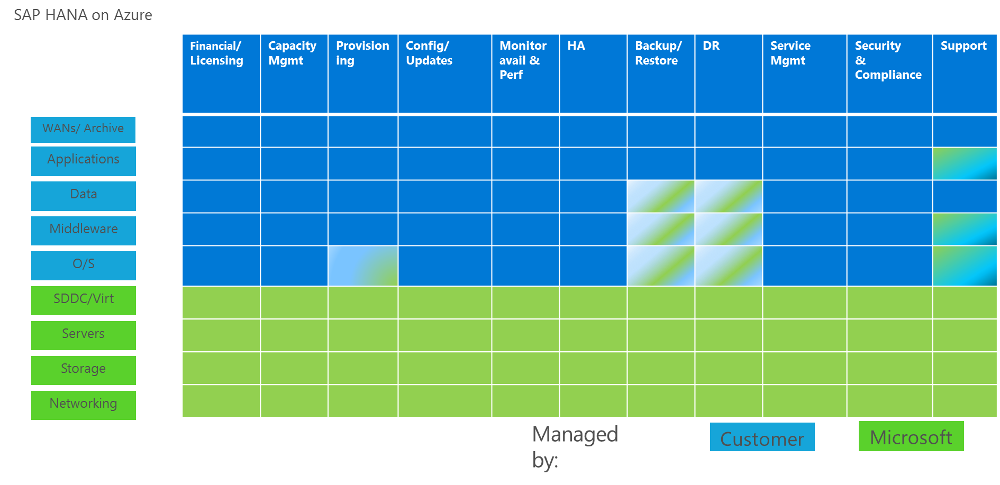

# SAP HANA (Large Instances) overview and architecture on Azure

## What is SAP HANA on Azure (Large Instances)?

SAP HANA on Azure (Large Instance) is a unique solution to Azure. In addition to providing Azure Virtual Machines for the purpose of deploying and running SAP HANA, Azure offers you the possibility to run and deploy SAP HANA on bare-metal servers that are dedicated to you as a customer. The SAP HANA on Azure (Large Instances) solution builds on non-shared host/server bare-metal hardware that is assigned to you as a customer. The server hardware is embedded in larger stamps that contain compute/server, networking, and storage infrastructure. Which, as a combination is HANA TDI certified. The service offer of SAP HANA on Azure (Large Instances) offers various different server SKUs or sizes starting with units that have 72 CPUs and 768 GB memory to units that have 960 CPUs and 20 TB memory.

The customer isolation within the infrastructure stamp is performed in tenants, which in detail looks like:

- Networking: Isolation of customers within infrastructure stack through virtual networks per customer assigned tenant. A tenant is assigned to a single customer. A customer can have multiple tenants. The network isolation of tenants prohibits network communication between tenants in the infrastructure stamp level. Even if tenants belong to the same customer.
- Storage components: Isolation through storage virtual machines that have storage volumes assigned to it. Storage volumes can be assigned to one storage virtual machine only. A storage virtual machine is assigned exclusively to one single tenant in the SAP HANA TDI certified infrastructure stack. As a result storage volumes assigned to a storage virtual machine can be accessed in one specific and related tenant only. And are not visible between the different deployed tenants.
- Server or host: A server or host unit is not shared between customers or tenants. A server or host deployed to a customer, is an atomic bare-metal compute unit that is assigned to one single tenant. **No** hardware-partitioning or soft-partitioning is used that could result in you, as a customer, sharing a host or a server with another customer. Storage volumes that are assigned to the storage virtual machine of the specific tenant are mounted to such a server. A tenant can have one to many server units of different SKUs exclusively assigned.
- Within an SAP HANA on Azure (Large Instance) infrastructure stamp, many different tenants are deployed and isolated against each other through the tenant concepts on networking, storage, and compute level. 

These bare-metal server units are supported to run SAP HANA only. The SAP application layer or workload middle-ware layer is running in Microsoft Azure Virtual Machines. The infrastructure stamps running the SAP HANA on Azure (Large Instance) units are connected to the Azure Network backbones, so, that low latency connectivity between SAP HANA on Azure (Large Instance) units and Azure Virtual Machines is provided.

This document is one of five documents, which cover the topic of SAP HANA on Azure (Large Instance). In this document, we go through the basic architecture, responsibilities, services provided, and on a high-level through capabilities of the solution. For most of the areas, like networking and connectivity, the other four documents are covering details and drill downs. The documentation of SAP HANA on Azure (Large Instance) does not cover aspects of SAP NetWeaver installation or deployments of SAP NetWeaver in Azure VMs. This topic is covered in separate documentation found in the same documentation container. 

The five parts of this guide cover the following topics:

- [SAP HANA (large Instance) Overview and Architecture on Azure](hana-overview-architecture.md?toc=%2fazure%2fvirtual-machines%2flinux%2ftoc.json)
- [SAP HANA (large instances) Infrastructure and connectivity on Azure](hana-overview-infrastructure-connectivity.md?toc=%2fazure%2fvirtual-machines%2flinux%2ftoc.json)
- [How to install and configure SAP HANA (large instances) on Azure](hana-installation.md?toc=%2fazure%2fvirtual-machines%2flinux%2ftoc.json)
- [SAP HANA (large instances) High Availability and Disaster Recovery on Azure](hana-overview-high-availability-disaster-recovery.md?toc=%2fazure%2fvirtual-machines%2flinux%2ftoc.json)
- [SAP HANA (large instances) Troubleshooting and monitoring on Azure](troubleshooting-monitoring.md?toc=%2fazure%2fvirtual-machines%2flinux%2ftoc.json)

## Definitions

Several common definitions are widely used in the Architecture and Technical Deployment Guide. Note the following terms and their meanings:

- **IaaS:** Infrastructure as a Service
- **PaaS:** Platform as a Service
- **SaaS:** Software as a Service
- **SAP Component:** An individual SAP application, such as ECC, BW, Solution Manager, or EP. SAP components can be based on traditional ABAP or Java technologies or a non-NetWeaver based application such as Business Objects.
- **SAP Environment:** One or more SAP components logically grouped to perform a business function, such as Development, QAS, Training, DR, or Production.
- **SAP Landscape:** Refers to the entire SAP assets in your IT landscape. The SAP landscape includes all production and non-production environments.
- **SAP System:** The combination of DBMS layer and application layer of an SAP ERP development system, SAP BW test system, SAP CRM production system, etc. Azure deployments do not support dividing these two layers between on-premises and Azure. Means an SAP system is either deployed on-premises, or it is deployed in Azure. However, you can deploy the different systems of an SAP landscape into either Azure or on-premises. For example, you could deploy the SAP CRM development and test systems in Azure, while deploying the SAP CRM production system on-premises. For SAP HANA on Azure (Large Instances), it is intended that you host the SAP application layer of SAP systems in Azure VMs and the related SAP HANA instance on a unit in the HANA Large Instance stamp.
- **Large Instance stamp:** A hardware infrastructure stack that is SAP HANA TDI certified and dedicated to run SAP HANA instances within Azure.
- **SAP HANA on Azure (Large Instances):** Official name for the offer in Azure to run HANA instances in on SAP HANA TDI certified hardware that is deployed in Large Instance stamps in different Azure regions. The related term **HANA Large Instance** is short for SAP HANA on Azure (Large Instances) and is widely used this technical deployment guide.
- **Cross-Premises:** Describes a scenario where VMs are deployed to an Azure subscription that has site-to-site, multi-site, or ExpressRoute connectivity between the on-premises datacenter(s) and Azure. In common Azure documentation, these kinds of deployments are also described as Cross-Premises scenarios. The reason for the connection is to extend on-premises domains, on-premises Active Directory/OpenLDAP, and on-premises DNS into Azure. The on-premises landscape is extended to the Azure assets of the Azure  subscription(s). Having this extension, the VMs can be part of the on-premises domain. Domain users of the on-premises domain can access the servers and can run services on those VMs (like DBMS services). Communication and name resolution between VMs deployed on-premises and Azure deployed VMs is possible. Such is the typical scenario in which most SAP assets are deployed. See the guides of  [Planning and design for VPN Gateway](../../../vpn-gateway/vpn-gateway-plan-design.md?toc=%2fazure%2fvirtual-machines%2flinux%2ftoc.json) and [Create a VNet with a Site-to-Site connection using the Azure portal](../../../vpn-gateway/vpn-gateway-howto-site-to-site-resource-manager-portal.md?toc=%2fazure%2fvirtual-machines%2flinux%2ftoc.json) for more detailed information.
- **Tenant:** A customer deployed in HANA Large Instances stamp gets isolated into a "tenant." A tenant is isolated in the networking, storage, and compute layer from other tenants. So, that storage and compute units assigned to the different tenants cannot see each other or communicate with each other on the HANA Large Instance stamp level. A customer can choose to have deployments into different tenants. Even then, there is no communication between tenants on the HANA Large Instance stamp level.

There are a variety of additional resources that have been published on the topic of deploying SAP workload on Microsoft Azure public cloud. It is highly recommended that anyone planning and executing a deployment of SAP HANA in Azure is experienced and aware of the principals of Azure IaaS, and the deployment of SAP workloads on Azure IaaS. The following resources provide more information and should be referenced before continuing:

- [Using SAP solutions on Microsoft Azure virtual machines](get-started.md?toc=%2fazure%2fvirtual-machines%2flinux%2ftoc.json)

## Certification

Besides the NetWeaver certification, SAP requires a special certification for SAP HANA to support SAP HANA on certain infrastructures, such as Azure IaaS.

The core SAP Note on NetWeaver, and to a degree SAP HANA certification, is [SAP Note #1928533 – SAP Applications on Azure: Supported Products and Azure VM types](https://launchpad.support.sap.com/#/notes/1928533).

This [SAP Note #2316233 - SAP HANA on Microsoft Azure (Large Instances)](https://launchpad.support.sap.com/#/notes/2316233/E) is also significant. It covers the solution described in this guide. Additionally, you are supported to run SAP HANA in the GS5 VM type of Azure. [Information for this case is published on the SAP website](http://global.sap.com/community/ebook/2014-09-02-hana-hardware/enEN/iaas.html).

The SAP HANA on Azure (Large Instances) solution referred to in SAP Note #2316233 provides Microsoft and SAP customers the ability to deploy large SAP Business Suite, SAP Business Warehouse (BW), S/4 HANA, BW/4HANA, or other SAP HANA workloads in Azure. The solution is based on the SAP-HANA certified dedicated hardware stamp ([SAP HANA Tailored Datacenter Integration – TDI](https://scn.sap.com/docs/DOC-63140)). Running as an SAP HANA TDI configured solution provides you with the confidence of knowing that all SAP HANA-based applications (including SAP Business Suite on SAP HANA, SAP Business Warehouse (BW) on SAP HANA, S4/HANA and BW4/HANA) are going to work on the hardware infrastructure.

Compared to running SAP HANA in Azure Virtual Machines this solution has a benefit—it provides for much larger memory volumes. If you want to enable this solution, there are some key aspects to understand:

- The SAP application layer and non-SAP applications run in Azure Virtual Machines (VMs) that are hosted in the usual Azure hardware stamps.
- Customer on-premises infrastructure, data centers, and application deployments are connected to the Microsoft Azure cloud platform through Azure ExpressRoute (recommended) or Virtual Private Network (VPN). Active Directory (AD) and DNS are also extended into Azure.
- The SAP HANA database instance for HANA workload runs on SAP HANA on Azure (Large Instances). The Large Instance stamp is connected into Azure networking, so software running in Azure VMs can interact with the HANA instance running in HANA Large Instances.
- Hardware of SAP HANA on Azure (Large Instances) is dedicated hardware provided in an Infrastructure as a Service (IaaS) with SUSE Linux Enterprise Server, or Red Hat Enterprise Linux, pre-installed. As with Azure Virtual Machines, further updates and maintenance to the operating system is your responsibility.
- Installation of HANA or any additional components necessary to run SAP HANA on units of HANA Large instances is your responsibility, as is all respective ongoing operations and administrations of SAP HANA on Azure.
- In addition to the solutions described here, you can install other components in your Azure subscription that connects to SAP HANA on Azure (Large Instances).  For example, components that enable communication with and/or directly to the SAP HANA database (jump servers, RDP servers, SAP HANA Studio, SAP Data Services for SAP BI scenarios, or network monitoring solutions).
- As in Azure, HANA Large Instances offer supporting High Availability and Disaster Recovery functionality.

## Architecture

At a high-level, the SAP HANA on Azure (Large Instances) solution has the SAP application layer residing in Azure VMs and the database layer residing on SAP TDI configured hardware located in a Large Instance stamp in the same Azure Region that is connected to Azure IaaS.

> [!NOTE]
> You need to deploy the SAP application layer in the same Azure Region as the SAP DBMS layer. This rule is well-documented in published information about SAP workload on Azure. 

The overall architecture of SAP HANA on Azure (Large Instances) provides an SAP TDI certified hardware configuration (non-virtualized, bare metal, high-performance server for the SAP HANA database), and the ability and flexibility of Azure to scale resources for the SAP application layer to meet your needs.

The architecture shown is divided into three sections:

- **Right:** An on-premises infrastructure running different applications in datacenters with end users accessing LOB applications (like SAP). Ideally, this on-premises infrastructure is then connected to Azure with Azure [ExpressRoute](https://azure.microsoft.com/services/expressroute/).

- **Center:** Shows Azure IaaS and, in this case, use of Azure VMs to host SAP or other applications that use SAP HANA as a DBMS system. Smaller HANA instances that function with the memory Azure VMs provide are deployed in Azure VMs together with their application layer. Find out more about [Virtual Machines](https://azure.microsoft.com/services/virtual-machines/).
 Azure Networking is used to group SAP systems together with other applications into Azure Virtual Networks (VNets). These VNets connect to on-premises systems as well as to SAP HANA on Azure (Large Instances).
 For SAP NetWeaver applications and databases that are supported to run in Microsoft Azure, see [SAP Support Note #1928533 – SAP Applications on Azure: Supported Products and Azure VM types](https://launchpad.support.sap.com/#/notes/1928533). For documentation on deploying SAP solutions on Azure review:

  -  [Using SAP on Windows virtual machines (VMs)](../../virtual-machines-windows-sap-get-started.md?toc=%2fazure%2fvirtual-machines%2flinux%2ftoc.json)
  -  [Using SAP solutions on Microsoft Azure virtual machines](get-started.md?toc=%2fazure%2fvirtual-machines%2flinux%2ftoc.json)

- **Left:** Shows the SAP HANA TDI certified hardware in the Azure Large Instance stamp. The HANA Large Instance units are connected to the Azure VNets of your subscription using the same technology as the connectivity from on-premises into Azure.

The Azure Large Instance stamp itself combines the following components:

- **Computing:**  Servers that are based on Intel Xeon E7-8890v3 or Intel Xeon E7-8890v4 processors that provide the necessary computing capability and are SAP HANA certified.
- **Network:**  A unified high-speed network fabric that interconnects the computing, storage, and LAN components.
- **Storage:**  A storage infrastructure that is accessed through a unified network fabric. Specific storage capacity is provided depending on the specific SAP HANA on Azure (Large Instances) configuration being deployed (more storage capacity is available at an additional monthly cost).

Within the multi-tenant infrastructure of the Large Instance stamp, customers are deployed as isolated tenants. At deployment of the tenant, you need to name an Azure subscription within your Azure enrollment. This going to be the Azure subscription, the HANA Large Instance(s) is going to be billed against. These tenants have a 1:1 relationship to the Azure subscription. Network wise it is possible to access a HANA large Instance unit deployed in one tenant in one Azure Region from different Azure VNets, which belong to different Azure subscriptions. Though those Azure subscriptions need to belong to the same Azure enrollment. 

As with Azure VMs, SAP HANA on Azure (Large Instances) is offered in multiple Azure regions. In order to offer Disaster Recovery capabilities, you can choose to opt in. Different Large Instance stamps within one geo-political region are connected to each other. For example, HANA Large Instance Stamps in US West and US East are connected through a dedicated network link for the purpose of DR replication. 

Just as you can choose between different VM types with Azure Virtual Machines, you can choose from different SKUs of HANA Large Instances that are tailored for different workload types of SAP HANA. SAP applies memory to processor socket ratios for varying workloads based on the Intel processor generations—there are four different SKU types offered:

As of July 2017, SAP HANA on Azure (Large Instances) is available in several configurations in the Azure Regions of US West and US East, Australia East, Australia Southeast, West Europe, and North Europe:

| SAP Solution | CPU | Memory | Storage | Availability |
| --- | --- | --- | --- | --- |
| Optimized for OLAP: SAP BW, BW/4HANA  or SAP HANA for generic OLAP workload | SAP HANA on Azure S72  – 2 x Intel® Xeon® Processor E7-8890 v3  36 CPU cores and 72 CPU threads |  768 GB |  3 TB | Available |
| --- | SAP HANA on Azure S144  – 4 x Intel® Xeon® Processor E7-8890 v3  72 CPU cores and 144 CPU threads |  1.5 TB |  6 TB | Not offered anymore |
| --- | SAP HANA on Azure S192  – 4 x Intel® Xeon® Processor E7-8890 v4  96 CPU cores and 192 CPU threads |  2.0 TB |  8 TB | Available |
| --- | SAP HANA on Azure S384  – 8 x Intel® Xeon® Processor E7-8890 v4  192 CPU cores and 384 CPU threads |  4.0 TB |  16 TB | Ready to Order |
| Optimized for OLTP: SAP Business Suite  on SAP HANA or S/4HANA (OLTP),  generic OLTP | SAP HANA on Azure S72m  – 2 x Intel® Xeon® Processor E7-8890 v3  36 CPU cores and 72 CPU threads |  1.5 TB |  6 TB | Available |
|---| SAP HANA on Azure S144m  – 4 x Intel® Xeon® Processor E7-8890 v3  72 CPU cores and 144 CPU threads |  3.0 TB |  12 TB | Not offered anymore |
|---| SAP HANA on Azure S192m  – 4 x Intel® Xeon® Processor E7-8890 v4  96 CPU cores and 192 CPU threads  |  4.0 TB |  16 TB | Available |
|---| SAP HANA on Azure S384m  – 8 x Intel® Xeon® Processor E7-8890 v4  192 CPU cores and 384 CPU threads |  6.0 TB |  18 TB | Ready to Order |
|---| SAP HANA on Azure S384xm  – 8 x Intel® Xeon® Processor E7-8890 v4  192 CPU cores and 384 CPU threads |  8.0 TB |  22 TB |  Ready to Order |
|---| SAP HANA on Azure S576  – 12 x Intel® Xeon® Processor E7-8890 v4  288 CPU cores and 576 CPU threads |  12.0 TB |  28 TB | Ready to Order |
|---| SAP HANA on Azure S768  – 16 x Intel® Xeon® Processor E7-8890 v4  384 CPU cores and 768 CPU threads |  16.0 TB |  36 TB | Ready to Order |
|---| SAP HANA on Azure S960  – 20 x Intel® Xeon® Processor E7-8890 v4  480 CPU cores and 960 CPU threads |  20.0 TB |  46 TB | Ready to Order |

- CPU cores = sum of non-hyper-threaded CPU cores of the sum of the processors of the server unit.
- CPU threads = sum of compute threads provided by hyper-threaded CPU cores of the sum of the processors of the server unit. All units are configured by default to use Hyper-Threading.

The different configurations above which are Available or are 'Not offered anymore' are referenced in [SAP Support Note #2316233 – SAP HANA on Microsoft Azure (Large Instances)](https://launchpad.support.sap.com/#/notes/2316233/E). The configurations, which are marked  as 'Ready to Order' will find their entry into the SAP Note soon. Though, those instance SKUs can be ordered already for the six different Azure regions the HANA Large Instance service is available.

The specific configurations chosen are dependent on workload, CPU resources, and desired memory. It is possible for OLTP workload to use the SKUs that are optimized for OLAP workload. 

The hardware base for all the offers are SAP HANA TDI certified. However, we distinguish between two different classes of hardware, which divides the SKUs into:

- S72, S72m, S144, S144m, S192, and S192m, which we refer to as the 'Type I class' of SKUs.
- S384, S384m, S384xm, S576, S768, and S960, which we refer to as the 'Type II class' of SKUs.

It is important to note that a complete HANA Large Instance stamp is not exclusively allocated for a single customer&#39;s use. This fact applies to the racks of compute and storage resources connected through a network fabric deployed in Azure as well. HANA Large Instances infrastructure, like Azure, deploys different customer &quot;tenants&quot; that are isolated from one another in the following three levels:

- Network: Isolation through virtual networks within the HANA Large Instance stamp.
- Storage: Isolation through storage virtual machines that have storage volumes assigned and isolate storage volumes between tenants.
- Compute: Dedicated assignment of server units to a single tenant. No hard or soft-partitioning of server units. No sharing of a single server or host unit between tenants. 

As such, the deployments of HANA Large Instances units between different tenants are not visible to each other. Nor can HANA Large Instance Units deployed in different tenants communicate directly with each other on the HANA Large Instance stamp level. Only HANA Large Instance Units within one tenant can communicate to each other on the HANA Large Instance stamp level.
A deployed tenant in the Large Instance stamp is assigned billing wise to one Azure subscription. However, network wise it can be accessed from Azure VNets of other Azure subscriptions within the same Azure enrollment. If you deploy with another Azure subscription in the same Azure region, you also can choose to ask for a separated HANA Large Instance tenant.

There are significant differences between running SAP HANA on HANA Large Instances and SAP HANA running on Azure VMs deployed in Azure:

- There is no virtualization layer for SAP HANA on Azure (Large Instances). You get the performance of the underlying bare-metal hardware.
- Unlike Azure, the SAP HANA on Azure (Large Instances) server is dedicated to a specific customer. There is no possibility that a server unit or host is hard or soft-partitioned. As a result, a HANA Large Instance unit is used as assigned as a whole to a tenant and with that to you as a customer. A reboot or shutdown of the server does not lead automatically to the operating system and SAP HANA being deployed on another server. (For Type I class SKUs, the only exception is if a server might encounter issues and redeployment needs to be performed on another server.)
- Unlike Azure, where host processor types are selected for the best price/performance ratio, the processor types chosen for SAP HANA on Azure (Large Instances) are the highest performing of the Intel E7v3 and E7v4 processor line.

### Running multiple SAP HANA instances on one HANA Large Instance unit
It is possible to host more than one active SAP HANA instance on the HANA Large Instance units. In order to still provide the capabilities of Storage Snapshots and Disaster recovery, such a configuration requires a volume set per instance. As of now, the HANA Large Instance units can be subdivided as follows:

- S72, S72m, S144, S192: In increments of 256 GB with 256 GB the smallest starting unit. Different increments like 256 GB, 512 GB, and so on, can be combined to the maximum of the memory of the unit.
- S144m and S192m: In increments of 256 GB with 512 GB the smallest unit. Different increments like 512 GB, 768 GB, and so on, can be combined to the maximum of the memory of the unit.
- Type II class: In increments of 512 GB with the smallest starting unit of 2 TB. Different increments like 512 GB, 1 TB, 1.5 TB, and so on, can be combined to the maximum of the memory of the unit.

Some examples of running multiple SAP HANA instances could look like:

| SKU | Memory Size | Storage Size | Sizes with multiple databases |
| --- | --- | --- | --- |
| S72 | 768 GB | 3 TB | 1x768 GB HANA Instance  or 1x512 GB Instance + 1x256 GB Instance  or 3x256 GB Instances | 
| S72m | 768 GB | 3 TB | 3x512GB HANA Instances or 1x512 GB Instance + 1x1 TB Instance or 6x256 GB Instances or 1x1.5 TB instance | 
| S192m | 4 TB | 16 TB | 8x512 GB Instances or 4x1 TB Instances or 4x512 GB Instances + 2x1 TB Instances or 4x768 GB Instances + 2x512 GB Instances or 1x4 TB Instance |
| S384xm | 8 TB | 22 TB | 4x2 TB Instances or 2x4 TB Instances or 2x3 TB Instances + 1x2 TB Instances or 2x2.5 TB Instances + 1x3 TB Instances or 1x8 TB Instance |

You get the idea. There certainly are other variations as well. 

### Using SAP HANA Data Tiering and Extension nodes
SAP supports a Data Tiering model for SAP BW of different SAP NetWeaver releases and SAP BW/4HANA. Details regarding to the Data Tiering model can be found in this document and blog referenced in this document by SAP:
[SAP BW/4HANA AND SAP BW ON HANA WITH SAP HANA EXTENSION NODES](https://www.sap.com/documents/2017/05/ac051285-bc7c-0010-82c7-eda71af511fa.html#).
With HANA Large Instances, you can use option-1 configuration of SAP HANA Extension Nodes as detailed in this FAQ and SAP blog documents. Option-2 configurations can be set up with the following HANA Large Instance SKUs: S72m, S192, S192m, S384, and S384m.  
Looking at the documentation the advantage might not be visible immediately. But looking into the SAP sizing guidelines, you can see an advantage by using option-1 and option-2 SAP HANA extension nodes. Here an example:

- SAP HANA sizing guidelines usually require double the amount of data volume as memory. So, when you are running your SAP HANA instance with the hot data, you only have 50% or less of the memory filled with data. The remainder of the memory is ideally held for SAP HANA doing its work.
- That means in a HANA Large Instance S192 unit with 2 TB of memory, running an SAP BW database, you only have 1 TB as data volume.
- If you use an additional SAP HANA Extension Node of option-1, also a S192 HANA Large Instance SKU, it would give you an additional 2 TB capacity for data volume. In the option-2 configuration even and additional 4 TB for warm data volume. Compared to the hot node, the full memory capacity of the 'warm' extension node can be used for data storing for option-1 and double the memory can be used for data volume in option-2 SAP HANA extension node configuration.
- As a result you end up with a capacity of 3 TB for your data and a hot-to-warm ratio of 1:2 for option-1 and 5 TB of data and a 1:4 ratio in option-2 extension node configuration.

However, the higher the data volume compared to the memory, the higher the chances are that the warm data you are asking for is stored on disk storage.

## Operations model and responsibilities

The service provided with SAP HANA on Azure (Large Instances) is aligned with Azure IaaS services. You get an HANA Large Instances instance with an installed operating system that is optimized for SAP HANA. As with Azure IaaS VMs, most of the tasks of hardening the OS, installing additional software you need, installing HANA, operating the OS and HANA, and updating the OS and HANA is your responsibility. Microsoft does not force OS updates or HANA updates on you.

As you can see in the diagram above, SAP HANA on Azure (Large Instances) is a multi-tenant Infrastructure as a Service offer. And as a result, the division of responsibility is at the OS-Infrastructure boundary, for the most part. Microsoft is responsible for all aspects of the service below the line of the operating system and you are responsible above the line, including the operating system. So most current on-premises methods you may be employing for compliance, security, application management, basis, and OS management can continue to be used. The systems appear as if they are in your network in all regards.

However, this service is optimized for SAP HANA, so there are areas where you and Microsoft need to work together to use the underlying infrastructure capabilities for best results.

The following list provides more detail on each of the layers and your responsibilities:

**Networking:** All the internal networks for the Large Instance stamp running SAP HANA, its access to the storage, connectivity between the instances (for scale-out and other functions), connectivity to the landscape, and connectivity to Azure where the SAP application layer is hosted in Azure Virtual Machines. It also includes WAN connectivity between Azure Data Centers for Disaster Recovery purposes replication. All networks are partitioned by the tenant and have QOS applied.

**Storage:** The virtualized partitioned storage for all volumes needed by the SAP HANA servers, as well as for snapshots. 

**Servers:** The dedicated physical servers to run the SAP HANA DBs assigned to tenants. The servers of the Type I class of SKUs are hardware abstracted. With these types of servers, the server configuration is collected and maintained in profiles, which can be moved from one physical hardware to another physical hardware. Such a (manual) move of a profile by operations can be compared a bit to Azure Service healing. The servers of the Type II class SKUs are not offering such a capability.

**SDDC:** The management software that is used to manage data centers as software defined entities. It allows Microsoft to pool resources for scale, availability, and performance reasons.

**O/S:** The OS you choose (SUSE Linux or Red Hat Linux) that is running on the servers. The OS images you are provided are the images provided by the individual Linux vendor to Microsoft for the purpose of running SAP HANA. You are required to have a subscription with the Linux vendor for the specific SAP HANA-optimized image. Your responsibilities include registering the images with the OS vendor. From the point of handover by Microsoft, you are also responsible for any further patching of the Linux operating system. This patching also includes additional packages that might be necessary for a successful SAP HANA installation (refer to SAP's HANA installation documentation and SAP Notes) and which have not been included by the specific Linux vendor in their SAP HANA optimized OS images. The responsibility of the customer also includes patching of the OS that is related to malfunction/optimization of the OS and its drivers related to the specific server hardware. Or any security or functional patching of the OS. Customer's responsibility is as well monitoring and capacity-planning of:

- CPU resource consumption
- Memory consumption
- Disk volumes related to free space, IOPS, and latency
- Network volume traffic between HANA Large Instance and SAP application layer

The underlying infrastructure of HANA Large Instances provides functionality for backup and restore of the OS volume. Using this functionality is also your responsibility.

**Middleware:** The SAP HANA Instance, primarily. Administration, operations, and monitoring are your responsibility. There is functionality provided that enables you to use storage snapshots for backup/restore and Disaster Recovery purposes. These capabilities are provided by the infrastructure. However, your responsibilities also include designing High Availability or Disaster Recovery with these capabilities, leveraging them, and monitoring that storage snapshots have been executed successfully.

**Data:** Your data managed by SAP HANA, and other data such as backups files located on volumes or file shares. Your responsibilities include monitoring disk free space and managing the content on the volumes, and monitoring the successful execution of backups of disk volumes and storage snapshots. However, successful execution of data replication to DR sites is the responsibility of Microsoft.

**Applications:** The SAP application instances or, in case of non-SAP applications, the application layer of those applications. Your responsibilities include deployment, administration, operations, and monitoring of those applications related to capacity planning of CPU resource consumption, memory consumption, Azure Storage consumption and network bandwidth consumption within Azure VNets, and from Azure VNets to SAP HANA on Azure (Large Instances).

**WANs:** The connections you establish from on-premises to Azure deployments for workloads. All our customers with HANA Large Instances use Azure ExpressRoute for connectivity. This connection is not part of the SAP HANA on Azure (Large Instances) solution, so you are responsible for the setup of this connection.

**Archive:** You might prefer to archive copies of data using your own methods in storage accounts. Archiving requires management, compliance, costs, and operations. You are responsible for generating archive copies and backups on Azure, and storing them in a compliant way.

See the [SLA for SAP HANA on Azure (Large Instances)](https://azure.microsoft.com/support/legal/sla/sap-hana-large/v1_0/).

## Sizing

Sizing for HANA Large Instances is no different than sizing for HANA in general. For existing and deployed systems, you want to move from other RDBMS to HANA, SAP provides a number of reports that run on your existing SAP systems. If the database is moved to HANA, these reports check the data and calculate  memory requirements for the HANA instance. Read the following SAP Notes to get more information on how to run these reports, and how to obtain their most recent patches/versions:

- [SAP Note #1793345 - Sizing for SAP Suite on HANA](https://launchpad.support.sap.com/#/notes/1793345)
- [SAP Note #1872170 - Suite on HANA and S/4 HANA sizing report](https://launchpad.support.sap.com/#/notes/1872170)
- [SAP Note #2121330 - FAQ: SAP BW on HANA Sizing Report](https://launchpad.support.sap.com/#/notes/2121330)
- [SAP Note #1736976 - Sizing Report for BW on HANA](https://launchpad.support.sap.com/#/notes/1736976)
- [SAP Note #2296290 - New Sizing Report for BW on HANA](https://launchpad.support.sap.com/#/notes/2296290)

For green field implementations, SAP Quick Sizer is available to calculate memory requirements of the implementation of SAP software on top of HANA.

Memory requirements for HANA are increasing as data volume grows, so you want to be aware of the memory consumption now and be able to predict what it is going to be in the future. Based on the memory requirements, you can then map your demand into one of the HANA Large Instance SKUs.

## Requirements

This list assembles requirements for running SAP HANA on Azure (Larger Instances).

**Microsoft Azure:**

- An Azure subscription that can be linked to SAP HANA on Azure (Large Instances).
- Microsoft Premier Support Contract. See [SAP Support Note #2015553 – SAP on Microsoft Azure: Support Prerequisites](https://launchpad.support.sap.com/#/notes/2015553) for specific information related to running SAP in Azure. Using HANA large instance units with 384 and more CPUs, you also need to extend the Premier Support contract to include Azure Rapid Response (ARR).
- Awareness of the HANA large instances SKUs you need after performing a sizing exercise with SAP.

**Network Connectivity:**

- Azure ExpressRoute between on-premises to Azure: To connect your on-premises datacenter to Azure, make sure to order at least a 1 Gbps connection from your ISP. 

**Operating System:**

- Licenses for SUSE Linux Enterprise Server 12 for SAP Applications.

> [!NOTE] 
> The Operating System delivered by Microsoft is not registered with SUSE, nor is it connected with an SMT instance.

- SUSE Linux Subscription Management Tool (SMT) deployed in Azure on an Azure VM. This
provides the ability for SAP HANA on Azure (Large Instances) to be registered and respectively updated by SUSE (as there is no internet access within HANA Large Instances data center). 
- Licenses for Red Hat Enterprise Linux 6.7 or 7.2 for SAP HANA.

> [!NOTE]
> The Operating System delivered by Microsoft is not registered with Red Hat, nor is it connected to a Red Hat Subscription Manager Instance.

- Red Hat Subscription Manager deployed in Azure on an Azure VM. The Red Hat Subscription Manager provides the ability for SAP HANA on Azure (Large Instances) to be registered and respectively updated by Red Hat (as there is no direct internet access from within the tenant deployed on the Azure Large Instance stamp).
- SAP requires you to have a support contract with your Linux provider as well. This requirement is not erased by the solution of HANA Large Instances or the fact that your run Linux in Azure. Unlike with some of the Linux Azure gallery images, the service fee is NOT included in the solution offer of HANA Large Instances. It is on you as a customer to fulfill the requirements of SAP regarding support contracts with the Linux distributor.   
   - For SUSE Linux, look up the requirements of support contract in [SAP Note #1984787 - SUSE LINUX Enterprise Server 12: Installation notes](https://launchpad.support.sap.com/#/notes/1984787) and [SAP Note #1056161 - SUSE Priority Support for SAP applications](https://launchpad.support.sap.com/#/notes/1056161).
   - For Red Hat Linux, you need to have the correct subscription levels that include support and service (updates to the operating systems of HANA Large Instances. Red Hat recommends getting an "RHEL for SAP Business Applications" subscription. Regarding support and services, check [SAP Note #2002167 - Red Hat Enterprise Linux 7.x: Installation and Upgrade](https://launchpad.support.sap.com/#/notes/2002167) and [SAP Note #1496410 - Red Hat Enterprise Linux 6.x: Installation and Upgrade](https://launchpad.support.sap.com/#/notes/1496410) for details.

**Database:**

- Licenses and software installation components for SAP HANA (platform or enterprise edition).

**Applications:**

- Licenses and software installation components for any SAP applications connecting to SAP HANA and related SAP support contracts.
- Licenses and software installation components for any non-SAP applications used in relation to SAP HANA on Azure (Large Instances) environment and related support contracts.

**Skills:**

- Experience and knowledge on Azure IaaS and its components.
- Experience and knowledge on deploying SAP workload in Azure.
- SAP HANA Installation certified personal.
- SAP architect skills to design High Availability and Disaster Recovery around SAP HANA.

**SAP:**

- Expectation is that you are an SAP customer and have a support contract with SAP
- Especially for implementations on the Type II class of HANA Large Instance SKUs, it is highly recommended to consult with SAP on versions of SAP HANA and eventual configurations on large sized scale-up hardware.

## Storage

The storage layout for SAP HANA on Azure (Large Instances) is configured by SAP HANA on Azure Service Management through SAP recommended guidelines, documented in the [SAP HANA Storage Requirements](http://go.sap.com/documents/2015/03/74cdb554-5a7c-0010-82c7-eda71af511fa.html) white paper.

The HANA Large Instances of the Type I class come with four times the memory volume as storage volume. For the type II class of HANA Large Instance units, the storage is not going to be four times more. The units come with a volume, which is intended for storing HANA transaction log backups. Find more details in [How to install and configure SAP HANA (large instances) on Azure](hana-installation.md?toc=%2fazure%2fvirtual-machines%2flinux%2ftoc.json)

See the following table in terms of storage allocation. The table lists roughly the capacity for the different volumes provided with the different HANA Large Instance units.

| HANA Large Instance SKU | hana/data | hana/log | hana/shared | hana/log/backup |
| --- | --- | --- | --- | --- |
| S72 | 1280 GB | 512 GB | 768 GB | 512 GB |
| S72m | 3328 GB | 768 GB |1280 GB | 768 GB |
| S192 | 4608 GB | 1024 GB | 1536 GB | 1024 GB |
| S192m | 11,520 GB | 1536 GB | 1792 GB | 1536 GB |
| S384 | 11,520 GB | 1536 GB | 1792 GB | 1536 GB |
| S384m | 12,000 GB | 2050 GB | 2050 GB | 2040 GB |
| S384xm | 16,000 GB | 2050 GB | 2050 GB | 2040 GB |
| S576 | 20,000 GB | 3100 GB | 2050 GB | 3100 GB |
| S768 | 28,000 GB | 3100 GB | 2050 GB | 3100 GB |
| S960 | 36,000 GB | 4100 GB | 2050 GB | 4100 GB |

Actual deployed volumes may vary a bit based on deployment and tool that is used to show the volume sizes.

If you subdivide a HANA Large Instance SKU, a few examples of possible division pieces would look like:

| Memory partition in GB | hana/data | hana/log | hana/shared | hana/log/backup |
| --- | --- | --- | --- | --- |
| 256 | 400 GB | 160 GB | 304 GB | 160 GB |
| 512 | 768 GB | 384 GB | 512 GB | 384 GB |
| 768 | 1280 GB | 512 GB | 768 GB | 512 GB |
| 1024 | 1792 GB | 640 GB | 1024 GB | 640 GB |
| 1536 | 3328 GB | 768 GB | 1280 GB | 768 GB |

These sizes are rough volume numbers that can vary slightly based on deployment and tools used to look at the volumes. There also are other partition sizes thinkable, like 2.5 TB. These storage sizes would be calculated with a similar formula as used for the partitions above. The term 'partitions' does not indicate that the operating system, memory, or CPU resources are in any way partitioned. It just indicates storage partitions for the different HANA instances you might want to deploy on one single HANA Large Instance unit. 

You as a customer might have need for more storage, you have the possibility to add storage to purchase additional storage in 1 TB units. This additional storage can be added as additional volume or can be used to extend one or more of the existing volumes. It is not possible to decrease the sizes of the volumes as originally deployed and mostly documented by the table(s) above. It is also not possible to change the names of the volumes or mount names. The storage volumes as described above are attached to the HANA Large Instance units as NFS4 volumes.

You as a customer can choose to use storage snapshots for backup/restore and disaster recovery purposes. More details on this topic are detailed in [SAP HANA (large instances) High Availability and Disaster Recovery on Azure](hana-overview-high-availability-disaster-recovery.md?toc=%2fazure%2fvirtual-machines%2flinux%2ftoc.json).

### Encryption of data at rest
The storage used for HANA Large Instances allows a transparent encryption of the data as it is stored on the disks. At deployment time of a HANA Large Instance Unit, you have the option to have this kind of encryption enabled. You also can choose to change to encrypted volumes after the deployment already. The move from non-encrypted to encrypted volumes is transparent and does not require a downtime. 

With the Type I class SKUs, the volume the boot LUN is stored on, is encrypted. In case of the type II class of  SKUs of HANA Large Instances, you need to encrypt the boot LUN with OS methods. 

## Networking

The architecture of Azure Networking is a key component to successful deployment of SAP applications on HANA Large Instances. Typically, SAP HANA on Azure (Large Instances) deployments have a larger SAP landscape with several different SAP solutions with varying sizes of databases, CPU resource consumption, and memory utilization. Likely not all of those SAP systems are based on SAP HANA, so your SAP landscape would probably be a hybrid that uses:

- Deployed SAP systems on-premises. Due to their sizes, these systems cannot currently be hosted in Azure; a classic example would be a production SAP ERP system running on Microsoft SQL Server (as the database) which requires more CPU or memory resources Azure VMs can provide.
- Deployed SAP HANA-based SAP systems on-premises.
- Deployed SAP systems in Azure VMs. These systems could be development, testing, sandbox, or production instances for any of the SAP NetWeaver-based applications that can successfully deploy in Azure (on VMs), based on resource consumption and memory demand. These systems also could be based on databases like SQL Server (see [SAP Support Note #1928533 – SAP Applications on Azure: Supported Products and Azure VM types](https://launchpad.support.sap.com/#/notes/1928533/E)) or SAP HANA (see [SAP HANA Certified IaaS Platforms](http://global.sap.com/community/ebook/2014-09-02-hana-hardware/enEN/iaas.html)).
- Deployed SAP application servers in Azure (on VMs) that leverage SAP HANA on Azure (Large Instance) in Azure Large Instance stamps.

While a hybrid SAP landscape (with four or more different deployment scenarios) is typical, there are many customer cases of complete SAP landscape running in Azure. As Microsoft Azure VMs are becoming more powerful, the number of customers moving all their SAP solutions on Azure is increasing.

Azure networking in the context of SAP systems deployed in Azure is not complicated. It is based on the following principles:

- Azure Virtual Networks (VNets) need to be connected to the Azure ExpressRoute circuit that connects to on-premises network.
- An ExpressRoute circuit connecting on-premise to Azure usually should have a bandwidth of 1 Gbps or higher. This minimal bandwidth allows adequate bandwidth for transferring data between on-premises systems and systems running on Azure VMs (as well as connection to Azure systems from end users on-premises).
- All SAP systems in Azure need to be set up in Azure VNets to communicate with each other.
- Active Directory and DNS hosted on-premises are extended into Azure through ExpressRoute from on-premise.

> [!NOTE] 
> From a billing point of view, only a single Azure subscription can be linked only to one single tenant in a Large Instance stamp in a specific Azure region, and conversely a single Large Instance stamp tenant can be linked only to one Azure subscription. This fact is not different to any other billable objects in Azure

Deploying SAP HANA on Azure (Large Instances) in multiple different Azure regions, results in a separate tenant to be deployed in the Large Instance stamp. However, you can run both under the same Azure subscription as long as these instances are part of the same SAP landscape. 

> [!IMPORTANT] 
> Only Azure Resource Management deployment is supported with SAP HANA on Azure (Large Instances).

 

### Additional Azure VNet information

In order to connect an Azure VNet to ExpressRoute, an Azure gateway must be created (see [About virtual network gateways for ExpressRoute](../../../expressroute/expressroute-about-virtual-network-gateways.md?toc=%2fazure%2fvirtual-machines%2flinux%2ftoc.json)). An Azure gateway can be used either with ExpressRoute to an infrastructure outside of Azure (or to an Azure Large instance stamp), or to connect between Azure VNets (see [Configure a VNet-to-VNet connection for Resource Manager using PowerShell](../../../vpn-gateway/vpn-gateway-vnet-vnet-rm-ps.md?toc=%2fazure%2fvirtual-machines%2flinux%2ftoc.json)). You can connect the Azure gateway to a maximum of four different ExpressRoute connections as long as those connections are coming from different MS Enterprise Edges (MSEE) routers.  For more information, see [SAP HANA (large instances) Infrastructure and connectivity on Azure](hana-overview-infrastructure-connectivity.md?toc=%2fazure%2fvirtual-machines%2flinux%2ftoc.json). 

> [!NOTE] 
> The throughput an Azure gateway provides is different for both use cases (see [About VPN Gateway](../../../vpn-gateway/vpn-gateway-about-vpngateways.md?toc=%2fazure%2fvirtual-machines%2flinux%2ftoc.json)). The maximum throughput we can achieve with a VNet gateway is 10 Gbps, using an ExpressRoute connection. Keep in mind that copying files between an Azure VM residing in an Azure VNet and a system on-premises (as a single copy stream) does not achieve the full throughput of the different gateway SKUs. To leverage the complete bandwidth of the VNet gateway, you must use multiple streams, or copy different files in parallel streams of a single file.

### Networking Architecture for HANA Large Instances
The networking architecture for HANA Large Instances as shown below, can be separated in four different parts:

- On-premise networking and ExpressRoute connection to Azure. This part is the customers domain and connected to Azure through ExpressRoute. This is the part in the lower right of the graphics below.
- Azure Networking as briefly discussed above with Azure VNets, which again have gateways. This is an area where you need to find the appropriate designs for your applications requirements, security, and compliance requirements. Using HANA Large Instances is another point of consideration in terms of number of VNets and Azure gateway SKUs to choose from. This is the part in the upper right of the graphics.
- Connectivity of HANA Large Instances through ExpressRoute technology into Azure. This part is deployed and handled by Microsoft. All you need to do as a customer is to provide some IP address ranges and after the deployment of your assets in HANA Large Instances connecting the ExpressRoute circuit to the Azure VNet(s) (see [SAP HANA (large instances) Infrastructure and connectivity on Azure](hana-overview-infrastructure-connectivity.md?toc=%2fazure%2fvirtual-machines%2flinux%2ftoc.json)). 
- Networking in HANA Large Instances, which is mostly transparent for you as a customer.

The fact that you use HANA Large instances does not change the requirement to get your on-premise assets connected through ExpressRoute to Azure. It also does not change the requirement for having one or multiple VNets that run the Azure VMs which host the application layer that connects to the HANA instances hosted in HANA Large Instance units. 

The difference to SAP deployments in pure Azure, comes with the facts that:

- The HANA Large Instance units of your customer tenant are connected through another ExpressRoute circuit into your Azure VNet(s). In order to separate load conditions, the on-premise to Azure VNets ExpressRoute links and links between Azure VNets and HANA Large instances do not share the same routers.
- The workload profile between the SAP application layer and the HANA Instance is a different nature of many small requests and burst like data transfers (result sets) from SAP HANA into the application layer.
- The SAP application architecture is more sensitive to network latency than typical scenarios where data gets exchanged between on-premise and Azure.
- The VNet gateway has at least two ExpressRoute connections, and both connections  share the maximum bandwidth for incoming data of the VNet gateway.

The network latency experienced between Azure VMs and HANA Large instance units can be higher than a typical VM-to-VM network round-trip latency. Dependent on the Azure region, the values measured can exceed the 0.7 ms round-trip latency classified as below average in [SAP Note #1100926 - FAQ: Network performance](https://launchpad.support.sap.com/#/notes/1100926/E). Nevertheless customers deployed SAP HANA-based production SAP applications very successfully on SAP HANA Large Instances. The customers who deployed reported great improvements by running their SAP applications on SAP HANA using HANA Large Instance units. Nevertheless you should test your business processes thoroughly in Azure HANA Large Instances.
 
In order to provide deterministic network latency between Azure VMs and HANA Large Instance, the choice of the Azure VNet Gateway SKU is essential. Unlike the traffic patterns between on-premise and Azure VMs, the traffic pattern between Azure VMs and HANA Large Instances can develop small but high bursts of requests and data volumes to be transmitted. In order to have such bursts handled well, we highly recommend the usage of the UltraPerformance Gateway SKU. For the Type II class of HANA Large Instance SKUs, the usage of the UltraPerformance gateway SKU as Azure VNet Gateway is mandatory.  

> [!IMPORTANT] 
> Given the overall network traffic between the SAP application and database layers, only the HighPerformance or UltraPerformance gateway SKUs for VNets is supported for connecting to SAP HANA on Azure (Large Instances). For HANA Large instance Type II SKUs, only the UltraPerformance Gateway SKU is supported as Azure VNet Gateway.

### Single SAP system

The on-premises infrastructure shown above is connected through ExpressRoute into Azure, and the ExpressRoute circuit connects into a Microsoft Enterprise Edge Router (MSEE) (see [ExpressRoute technical overview](../../../expressroute/expressroute-introduction.md?toc=%2fazure%2fvirtual-machines%2flinux%2ftoc.json)). Once established, that route connects into the Microsoft Azure backbone, and all Azure regions are accessible.

> [!NOTE] 
> For running SAP landscapes in Azure, connect to the MSEE closest to the Azure region in the SAP landscape. Azure Large Instance stamps are connected through dedicated MSEE devices to minimize network latency between Azure VMs in Azure IaaS and Large Instance stamps.

The VNet gateway for the Azure VMs, hosting SAP application instances, is connected to that ExpressRoute circuit, and the same VNet is connected to a separate MSEE Router dedicated to connecting to Large Instance stamps.

This is a straightforward example of a single SAP system, where the SAP application layer is hosted in Azure and the SAP HANA database runs on SAP HANA on Azure (Large Instances). The assumption is that the VNet gateway bandwidth of 2 Gbps or 10 Gbps throughput does not represent a bottleneck.

### Multiple SAP systems or large SAP systems

If multiple SAP systems or large SAP systems are deployed connecting to SAP HANA on Azure (Large Instances), it&#39;s reasonable to assume the throughput of the VNet gateway may become a bottleneck. In such a case, you need to split the application layers into multiple Azure VNets. It also might be recommendable to create special VNets that connect to HANA Large Instances for cases like:

- Performing backups directly from the HANA Instances in HANA Large Instances to a VM in Azure that hosts NFS shares
- Copying large backups or other files from HANA Large Instance units to disk space managed in Azure.

Using separate VNets that host VMs that manage the storage avoids impact by large file or data transfer from HANA Large Instances to Azure on the VNet Gateway that serves the VMs running the SAP application layer. 

For a more scalable network architecture:

- Leverage multiple Azure VNets for a single, larger SAP application layer.
- Deploy one separate Azure VNet for each SAP system deployed, compared to combining these SAP systems in separate subnets under the same VNet.

 A more scalable networking architecture for SAP HANA on Azure (Large Instances):

Deploying the SAP application layer, or components, over multiple Azure VNets as shown above, introduced unavoidable latency overhead that occurred during communication between the applications hosted in those Azure VNets. By default, the network traffic between Azure VMs located in different VNets route through the MSEE routers in this configuration. However, since September 2016 this routing can be optimized. The way to optimize and cut down the latency in communication between two VNets is by peering Azure VNets within the same region. Even if those VNets are in different subscriptions. Using Azure VNet peering, the communication between VMs in two different Azure VNets can use the Azure network backbone to directly communicate with each other. Thereby showing similar latency as if the VMs would be in the same VNet. Whereas traffic, addressing IP address ranges that are connected through the Azure VNet gateway, is routed through the individual VNet gateway of the VNet. You can get details about Azure VNet peering in the article [VNet peering](https://docs.microsoft.com/azure/virtual-network/virtual-network-peering-overview).

### Routing in Azure

There are two important network routing considerations for SAP HANA on Azure (Large Instances):

1. SAP HANA on Azure (Large Instances) can only be accessed by Azure VMs in the dedicated ExpressRoute connection; not directly from on-premises. Some administration clients and any applications needing direct access, such as SAP Solution Manager running on-premises, cannot connect to the SAP HANA database.

2. SAP HANA on Azure (Large Instances) units have an assigned IP address from the Server IP Pool address range you as the customer submitted (see [SAP HANA (large instances) Infrastructure and connectivity on Azure](hana-overview-infrastructure-connectivity.md?toc=%2fazure%2fvirtual-machines%2flinux%2ftoc.json) for details).  This IP address is accessible through the Azure subscriptions and ExpressRoute that connects Azure VNets to HANA on Azure (Large Instances). The IP address assigned out of that Server IP Pool address range is directly assigned to the hardware unit and is NOT NAT'ed anymore as this was the case in the first deployments of this solution. 

> [!NOTE] 
> If you need to connect to SAP HANA on Azure (Large Instances) in a _data warehouse_ scenario, where applications and/or end users need to connect to the SAP HANA database (running directly), another networking component must be used: a reverse-proxy to route data, to and from. For example, F5 BIG-IP, NGINX with Traffic Manager deployed in Azure as a virtual firewall/traffic routing solution.

### Internet connectivity of HANA Large Instances
HANA Large Instances do NOT have direct internet connectivity. This is restricting your abilities to, for example register the OS image directly with the OS vendor. Hence you might need to work with local SLES SMT server or RHEL Subscription Manager

### Data encryption between Azure VMs and HANA Large Instances
Data transferred between HANA Large Instances and Azure VMs is not encrypted. However, purely for the exchange between the HANA DBMS side and JDBC/ODBC based applications you can enable encryption of traffic. Reference [this documentation by SAP](http://help-legacy.sap.com/saphelp_hanaplatform/helpdata/en/db/d3d887bb571014bf05ca887f897b99/content.htm?frameset=/en/dd/a2ae94bb571014a48fc3b22f8e919e/frameset.htm&current_toc=/en/de/ec02ebbb57101483bdf3194c301d2e/plain.htm&node_id=20&show_children=false)

### Using HANA Large Instance Units in multiple regions

You might have other reasons to deploy SAP HANA on Azure (Large Instances) in multiple Azure regions, besides disaster recovery. Perhaps you want to access HANA Large Instances from each of the VMs deployed in the different VNets in the regions. Since the IP addresses assigned to the different HANA Large Instances units are not propagated beyond the Azure VNets (that are directly connected through their gateway to the instances), there is a slight change to the VNet design introduced above: an Azure VNet gateway can handle four different ExpressRoute circuits out of different MSEEs, and each VNet that is connected to one of the Large Instance stamps can be connected to the Large Instance stamp in another Azure region.

The above figure shows how the different Azure VNets in both regions are connected to two different ExpressRoute circuits that are used to connect to SAP HANA on Azure (Large Instances) in both Azure regions. The newly introduced connections are the rectangular red lines. With these connections, out of the Azure VNets, the VMs running in one of those VNets can access each of the different HANA Large Instances units deployed in the two regions. As you see in the graphics above, it is assumed that you have two ExpressRoute connections from on-premises to the two Azure regions; recommended for Disaster Recovery reasons.

> [!IMPORTANT] 
> If multiple ExpressRoute circuits are used, AS Path prepending and Local Preference BGP settings should be used to ensure proper routing of traffic.

