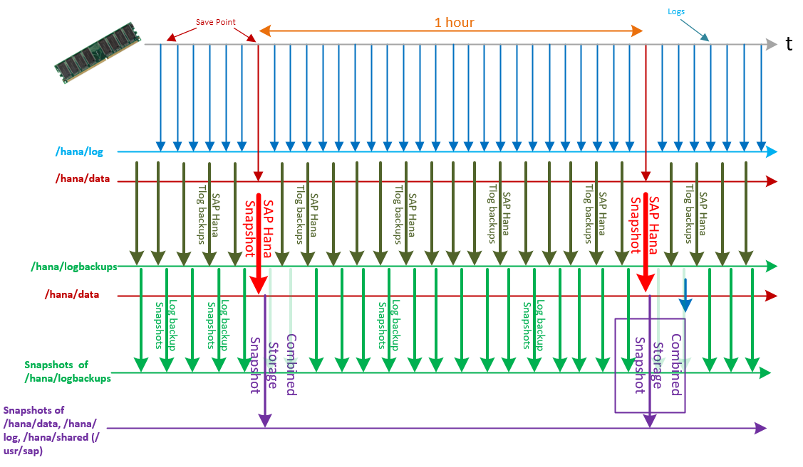

# SAP HANA Large Instances high availability and disaster recovery on Azure 

High availability and disaster recovery (DR) are important aspects of running your mission-critical SAP HANA on Azure (Large Instances) server. It's important to work with SAP, your system integrator, or Microsoft to properly architect and implement the right high-availability and disaster-recovery strategy. It is also important to consider the recovery point objective (RPO) and the recovery time objective, which are specific to your environment.

Microsoft supports some SAP HANA high-availability methods out of the box with HANA Large Instances. These include:

- **Storage replication**: The storage system's ability to replicate all data to another HANA Large Instance stamp in another Azure region. SAP HANA operates independently of this method.
- **HANA system replication**: The replication of all data in SAP HANA to a separate SAP HANA system. The recovery time objective is minimized through data replication at regular intervals. SAP HANA supports asynchronous, synchronous in-memory, and synchronous modes. Synchronous mode is recommended only for SAP HANA systems that are within the same datacenter or less than 100 km apart. In the current design of HANA large-instance stamps, HANA system replication can be used for high availability only. Currently, HANA system replication requires a third-party reverse-proxy component for disaster-recovery configurations into another Azure region. 
- **Host auto-failover**: A local fault-recovery solution for SAP HANA to use as an alternative to HANA system replication. If the master node becomes unavailable, you configure one or more standby SAP HANA nodes in scale-out mode, and SAP HANA automatically fails over to a standby node.

SAP HANA on Azure (Large Instances) is offered in two Azure regions that cover three different geopolitical regions (US, Australia, and Europe). Two different regions that host HANA Large Instance stamps are connected to separate dedicated network circuits that are used for replicating storage snapshots to provide disaster-recovery methods. The replication is not established by default. It is set up for customers that ordered disaster-recovery functionality. Storage replication is dependent on the usage of storage snapshots for HANA Large Instances. It is not possible to choose an Azure region as a DR region that is in a different geopolitical area. 

The following table shows the currently supported high-availability and disaster-recovery methods and combinations:

| Scenario supported in HANA Large Instances | High-availability option | Disaster-recovery option | Comments |
| --- | --- | --- | --- |
| Single node | Not available. | Dedicated DR setup.<br /> Multipurpose DR setup. | |
| Host auto-failover: N+m<br /> including 1+1 | Possible with the standby taking the active role.<br /> HANA controls the role switch. | Dedicated DR setup.<br /> Multipurpose DR setup.<br /> DR synchronization by using storage replication. | HANA volume sets are attached to all the nodes (n+m).<br /> DR site must have the same number of nodes. |
| HANA system replication | Possible with primary or secondary setup.<br /> Secondary moves to primary role in a failover case.<br /> HANA system replication and OS control failover. | Dedicated DR setup.<br /> Multipurpose DR setup.<br /> DR synchronization by using storage replication.<br /> DR by using HANA system replication is not yet possible without third-party components. | Separate set of disk volumes are attached to each node.<br /> Only disk volumes of secondary replica in the production site get replicated to the DR location.<br /> One set of volumes is required at the DR site. | 

A dedicated DR setup is where the HANA Large Instance unit in the DR site is not used for running any other workload or non-production system. The unit is passive and is deployed only if a disaster failover executes. So far, we don't have a single customer with this configuration.

A multipurpose DR setup is where the HANA Large Instance unit on the DR site runs a non-production workload. In case of disaster, you shut down the non-production system, you mount the storage-replicated (additional) volume sets, and then you start the production HANA instance. So far, all customers that use the HANA Large Instance disaster-recovery functionality use this configuration alternative. 


You can find more information on SAP HANA high availability in the following SAP articles: 

- [SAP HANA High Availability Whitepaper](http://go.sap.com/documents/2016/05/f8e5eeba-737c-0010-82c7-eda71af511fa.html)
- [SAP HANA Administration Guide](http://help.sap.com/hana/SAP_HANA_Administration_Guide_en.pdf)
- [SAP Academy Video on SAP HANA System Replication](http://scn.sap.com/community/hana-in-memory/blog/2015/05/19/sap-hana-system-replication)
- [SAP Support Note #1999880 – FAQ on SAP HANA System Replication](https://bcs.wdf.sap.corp/sap/support/notes/1999880)
- [SAP Support Note #2165547 – SAP HANA Back up and Restore within SAP HANA System Replication Environment](https://websmp230.sap-ag.de/sap(bD1lbiZjPTAwMQ==)/bc/bsp/sno/ui_entry/entry.htm?param=69765F6D6F64653D3030312669765F7361706E6F7465735F6E756D6265723D3231363535343726)
- [SAP Support Note #1984882 – Using SAP HANA System Replication for Hardware Exchange with Minimum/Zero Downtime](https://websmp230.sap-ag.de/sap(bD1lbiZjPTAwMQ==)/bc/bsp/sno/ui_entry/entry.htm?param=69765F6D6F64653D3030312669765F7361706E6F7465735F6E756D6265723D3139383438383226)

## Network considerations for disaster recovery with HANA Large Instances

To take advantage of the disaster-recovery functionality of HANA Large Instances, you need to design network connectivity to the two different Azure regions. You need an Azure ExpressRoute circuit connection from on-premises in your main Azure region and another circuit connection from on-premises to your disaster-recovery region. This measure covers a situation where there is a problem in an Azure region, including a Microsoft Enterprise Edge Router (MSEE) location.

As a second measure, you can connect all Azure virtual networks that connect to SAP HANA on Azure (Large Instances) in one of the regions to an ExpressRoute circuit that connects HANA Large Instances in the other region. With this *cross connect*, services running on an Azure virtual network in Region #1, can connect to HANA Large Instance units in Region #2 and the other way around. This measure addresses a case where only one of the MSEE locations that connects to your on-premises location with Azure goes offline.

The following graphic illustrates a resilient configuration for disaster recovery:


## Other requirements when you use HANA Large Instances storage replication for disaster recovery

Additional requirements for a disaster-recovery setup with HANA Large Instances are:

- You must order SAP HANA on Azure (Large Instances) SKUs of the same size as your production SKUs and deploy them in the disaster-recovery region. In the current customer deployments, these instances are used to run non-production HANA instances. We refer to them as *multipurpose DR setups*.   
- You must order additional storage on the DR site for each of your SAP HANA on Azure (Large Instances) SKUs that you want to recover in the disaster-recovery site. Buying additional storage lets you allocate the storage volumes. You can allocate the volumes that are the target of the storage replication from your production Azure region into the disaster-recovery Azure region.
 

## Backup and restore

One of the most important aspects to operating databases is to protect them make from various catastrophic events. The cause of these events can be anything from natural disasters to simple user errors.

Backing up a database, with the ability to restore it to any point in time, such as before someone deleted critical data, enables restoration to a state that is as close as possible to the way it was prior to the disruption.

Two types of backups must be performed for best results:

- Database backups: full, incremental, or differential backups
- Transaction-log backups

In addition to full-database backups performed at an application level, you can perform backups with storage snapshots. Storage snapshots do not replace transaction-log backups. Transaction-log backups remain important to restore the database to a certain point in time or to empty the logs from already committed transactions. However, storage snapshots can accelerate recovery by quickly providing a roll-forward image of the database. 

SAP HANA on Azure (Large Instances) offers two backup and restore options:

- Do it yourself (DIY). After you calculate to ensure there is enough disk space, perform full database and log backups by using disk backup methods. You can back up either directly to volumes attached to the HANA Large Instance units or to Network File Shares (NFS) set up in an Azure virtual machine (VM). In the latter case, customers set up a Linux VM in Azure, attach Azure Storage to the VM, and share the storage through a configured NFS server in that VM. If you perform the backup against volumes that directly attach to HANA Large Instance units, you need to copy the backups to an Azure storage account (after you set up an Azure VM that exports NFS shares that are based on Azure Storage), or use either an Azure backup vault or Azure cold storage. 

   Another option is to use a third-party data protection tool to store the backups after they are copied to an Azure storage account. The DIY backup option might also be necessary for data that you need to store for longer periods of time for compliance and auditing purposes. In all cases, the backups are copied into NFS shares represented through a VM and Azure storage.

- Use the backup and restore functionality that the underlying infrastructure of SAP HANA on Azure (Large Instances) provides. This option fulfills the need for backups and fast restores. The rest of this section addresses the backup and restore functionality that's offered with HANA Large Instances. This section also covers the relationship backup and restore has to the disaster-recovery functionality offered by HANA Large Instances.

> [!NOTE]
> The snapshot technology that is used by the underlying infrastructure of HANA Large Instances has a dependency on SAP HANA snapshots. At this point, SAP HANA snapshots do not work in conjunction with multiple tenants of SAP HANA multitenant database containers. Thus, this method of back up cannot be used when you deploy multiple tenants in SAP HANA multitenant database containers. SAP HANA snapshots do work if only one tenant is deployed.

### Using storage snapshots of SAP HANA on Azure (Large Instances)

The storage infrastructure underlying SAP HANA on Azure (Large Instances) supports storage snapshots of volumes. Both back up and restoration of volumes is supported, with the following considerations:

- Instead of full-database backups, storage volume snapshots are taken on a frequent basis.
- When triggering a snapshot over /hana/data, hana/log, and /hana/shared (includes /usr/sap) volumes, the storage snapshot initiates an SAP HANA snapshot before it executes the storage snapshot. This SAP HANA snapshot is the setup point for eventual log restorations after recovery of the storage snapshot.
- After the point where the storage snapshot has executed successfully, the SAP HANA snapshot is deleted.
- Transaction-log backups are taken frequently and are stored in the /hana/logbackups volume or in Azure. You can trigger the /hana/logbackups volume that contains the transaction-log backups to take a snapshot separately. In that case, you do not need to execute a HANA snapshot.
- If you must restore a database to a certain point in time, request Microsoft Azure Support (for a production outage) or SAP HANA on Azure Service Management to restore to a certain storage snapshot. An example would be a planned restoration of a sandbox system to its original state.
- The SAP HANA snapshot that's included in the storage snapshot is an offset point for applying transaction-log backups that have been executed and stored after the storage snapshot was taken.
- These transaction-log backups are taken to restore the database back to a certain point in time.

You can perform storage snapshots targeting three different classes of volumes:

- A combined snapshot over /hana/data, /hana/log, and /hana/shared (includes /usr/sap). This snapshot requires the execution of an SAP HANA snapshot.
- A separate snapshot over /hana/logbackups.
- An OS partition (only for Type I of HANA Large Instances).


### Storage snapshot considerations

>[!NOTE]
>Storage snapshots consume storage space that has been allocated to the HANA Large Instance units. Therefore, you need to consider the following aspects in terms of scheduling storage snapshots and how many to keep. 

The specific mechanics of storage snapshots for SAP HANA on Azure (Large Instances) include:

- A specific storage snapshot (at the point in time when it is taken) consumes little storage.
- As data content changes and the content in SAP HANA data files change on the storage volume, the snapshot needs to store the original block content, as well as the data changes.
- As a result, the storage snapshot increases in size. The longer the snapshot exists, the larger the storage snapshot becomes.
- The more changes that are made to the SAP HANA database volume over the lifetime of a storage snapshot, the larger the space consumption of the storage snapshot.

SAP HANA on Azure (Large Instances) comes with fixed volume sizes for the SAP HANA data and log volumes. Performing snapshots of those volumes eats into your volume space. You need to determine when to schedule storage snapshots, and you need to monitor the space consumption of the storage volumes, as well as manage the number of snapshots you store. You can disable the storage snapshots when you either import masses of data or perform other significant changes to the HANA database. 


The following sections provide information for performing these snapshots, including general recommendations:

- Though the hardware can sustain 255 snapshots per volume, we highly recommend that you stay well below this number.
- Before you perform storage snapshots, monitor and keep track of free space.
- Lower the number of storage snapshots based on free space. You can lower the number of snapshots that you keep, or you can extend the volumes. You can order additional storage in 1-terabyte units.
- During activities, such as moving data into SAP HANA with SAP platform migration tools (R3load) or restoring SAP HANA databases from backups, you need to disable storage snapshots on the /hana/data volume. 
- During larger reorganizations of SAP HANA tables, storage snapshots should be avoided, if possible.
- Storage snapshots are a prerequisite to taking advantage of the disaster-recovery capabilities of SAP HANA on Azure (Large Instances).

### Setting up storage snapshots

The steps to set up storage snapshots with HANA Large Instances are as follows:
1. Make sure that Perl is installed on the Linux operating system on the HANA Large Instances server.
2. Modify the /etc/ssh/ssh\_config to add the line _MACs hmac-sha1_.
3. Create an SAP HANA backup user account on the master node for each SAP HANA instance you are running, if applicable.
4. Install the SAP HANA HDB client on all the SAP HANA Large Instances servers.
5. On the first SAP HANA Large Instances server of each region, create a public key to access the underlying storage infrastructure that controls snapshot creation.
6. Copy the scripts and configuration file from [GitHub](https://github.com/Azure/hana-large-instances-self-service-scripts) to the location of **hdbsql** in the SAP HANA installation.
7. Modify the HANABackupDetails.txt file as necessary for the appropriate customer specifications.

### Step 1: Install the SAP HANA HDB client

The Linux operating system installed on SAP HANA on Azure (Large Instances) includes the folders and scripts necessary to execute SAP HANA storage snapshots for backup and disaster-recovery purposes. Check for more recent releases in [GitHub](https://github.com/Azure/hana-large-instances-self-service-scripts). The most recent release version of the scripts is 2.0.
However, it is your responsibility to install the SAP HANA HDB client on the HANA Large Instance units while you are installing SAP HANA. (Microsoft does not install the HDB client or SAP HANA.)

### Step 2: Change the /etc/ssh/ssh\_config

Change `/etc/ssh/ssh_config` by adding the _MACs hmac-sha1_ line as shown here:
```
#   RhostsRSAAuthentication no
#   RSAAuthentication yes
#   PasswordAuthentication yes
#   HostbasedAuthentication no
#   GSSAPIAuthentication no
#   GSSAPIDelegateCredentials no
#   GSSAPIKeyExchange no
#   GSSAPITrustDNS no
#   BatchMode no
#   CheckHostIP yes
#   AddressFamily any
#   ConnectTimeout 0
#   StrictHostKeyChecking ask
#   IdentityFile ~/.ssh/identity
#   IdentityFile ~/.ssh/id_rsa
#   IdentityFile ~/.ssh/id_dsa
#   Port 22
Protocol 2
#   Cipher 3des
#   Ciphers aes128-ctr,aes192-ctr,aes256-ctr,arcfour256,arcfour128,aes128-cbc,3des-cbc
#   MACs hmac-md5,hmac-sha1,umac-64@openssh.com,hmac-ripemd160
MACs hmac-sha1
#   EscapeChar ~
#   Tunnel no
#   TunnelDevice any:any
#   PermitLocalCommand no
#   VisualHostKey no
#   ProxyCommand ssh -q -W %h:%p gateway.example.com
```

### Step 3: Create a public key

To enable access to the storage snapshot interfaces of your HANA Large Instance tenant, you need to establish a sign in through a public key. On the first SAP HANA on Azure (Large Instances) server in your tenant, create a public key to be used to access the storage infrastructure so you can create snapshots. The public key ensures that a password is not required to sign in to the storage snapshot interfaces. Creating a public key also means that you do not need to maintain password credentials. In Linux on the SAP HANA Large Instances server, execute the following command to generate the public key:
```
  ssh-keygen –t dsa –b 1024
```
The new location is **_/root/.ssh/id\_dsa.pub**. Do not enter an actual password, or else you will be required to enter the password each time you sign in. Instead, select **Enter** twice to remove the "enter password" requirement for signing in.

Check to make sure that the public key was corrected as expected by changing folders to **/root/.ssh/** and then executing the `ls` command. If the key is present, you can copy it by running the following command:


At this point, contact SAP HANA on Azure Service Management and provide them with the public key. The service representative uses the public key to register it in the underlying storage infrastructure that is carved out for your HANA Large Instance tenant.

### Step 4: Create an SAP HANA user account

To initiate the creation of SAP HANA snapshots, you need to create a user account in SAP HANA that the storage snapshot scripts can use. Create an SAP HANA user account within SAP HANA Studio for this purpose. This account must have the following privileges: **Backup Admin** and **Catalog Read**. In this example, the username is **SCADMIN**. The user account name created in HANA Studio is case-sensitive. Make sure to select **No** for requiring the user to change the password on the next sign-in.


### Step 5: Authorize the SAP HANA user account

In this step, you authorize the SAP HANA user account that you created, so that the scripts don't need to submit passwords at run time. The SAP HANA command `hdbuserstore` enables the creation of an SAP HANA user key, which is stored on one or more SAP HANA nodes. The user key lets the user access SAP HANA without having to manage passwords from within the scripting process. The scripting process is discussed later.

>[!IMPORTANT]
>Run the following command as `root`. Otherwise, the script cannot work properly.

Enter the `hdbuserstore` command as follows:


In the following example, the user is **SCADMIN01**, the hostname is **lhanad01**, and the instance number is **01**:
```
hdbuserstore set SCADMIN01 lhanad01:30115 <backup username> <password>
```
If you have an SAP HANA scale-out configuration, you should manage all scripting from a single server. In this example, the SAP HANA key **SCADMIN01** must be altered for each host in a way that reflects which host is related to the key. You need to amend the SAP HANA backup account with the instance number of the HANA DB. The key must have administrative privileges on the host it is assigned to, and the backup user for scale out must have access rights to all the SAP HANA instances. Assuming the three scale-out nodes have the names **lhanad01**, **lhanad02**, and **lhanad03**, the sequence of commands looks like this:

```
hdbuserstore set SCADMIN01 lhanad01:30115 SCADMIN <password>
hdbuserstore set SCADMIN02 lhanad02:30215 SCADMIN <password>
hdbuserstore set SCADMIN03 lhanad03:30315 SCADMIN <password>
```

### Step 6: Get the snapshot scripts, configure the snapshots, and test the configuration and connectivity

Download the most recent version of the scripts from [GitHub](https://github.com/Azure/hana-large-instances-self-service-scripts). 
Copy the downloaded scripts and the text file to the working directory for **hdbsql**. For current HANA installations, this directory is like /hana/shared/D01/exe/linuxx86\_64/hdb. 
``` 
azure_hana_backup.pl 
azure_hana_replication_status.pl 
azure_hana_snapshot_details.pl 
azure_hana_snapshot_delete.pl 
testHANAConnection.pl 
testStorageSnapshotConnection.pl 
removeTestStorageSnapshot.pl 
HANABackupCustomerDetails.txt 
``` 


Here is the purpose of the different scripts and files:

- **azure\_hana\_backup.pl**: Schedule this script with cron to execute storage snapshots on either the HANA data/log/shared volumes, the /hana/logbackups volume, or the OS (on Type I SKUs of HANA Large Instances).
- **azure\_hana\_replication\_status.pl**: This script provides the basic details around the replication status from the production site to the disaster-recovery site. The script monitors to ensure that the replication is taking place and it shows the size of the items that are being replicated. It also provides guidance if a replication is taking too long or if the link is down.
- **azure\_hana\_snapshot\_details.pl**: This script provides a list of basic details about all the snapshots, per volume, that exist in your environment. This script can be run on the primary server or on a server unit in the disaster-recovery location. The script provides the following information broken down by each volume that contains snapshots:
   * Size of total snapshots in a volume
   * Each snapshot in that volume includes the following details: 
      - Snapshot name 
      - Create time 
      - Size of the snapshot
      - Frequency of the snapshot
      - HANA Backup ID associated with that snapshot, if relevant
- **azure\_hana\_snapshot\_delete.pl**: This script deletes a storage snapshot or a set of snapshots. You can use either the SAP HANA backup ID as found in HANA Studio or the storage snapshot name. Currently, the backup ID is only tied to the snapshots created for the HANA data/log/shared volumes. Otherwise, if the snapshot ID is entered, it seeks all snapshots that match the entered snapshot ID.  
- **testHANAConnection.pl**: This script tests the connection to the SAP HANA instance and is required to set up the storage snapshots.
- **testStorageSnapshotConnection.pl**: This script has two purposes. First, to ensure that the HANA Large Instance unit that runs the scripts has access to the assigned storage virtual machine and to the storage snapshot interface of your HANA Large Instances. The second purpose is to create a temporary snapshot for the HANA instance you are testing. This script should be run for every HANA instance on a server to ensure that the backup scripts function as expected.
- **removeTestStorageSnapshot.pl**: This script deletes the test snapshot as created with the script **testStorageSnapshotConnection.pl**. 
- **HANABackupCustomerDetails.txt**: This is a modifiable configuration file that you need to modify to adapt to your SAP HANA configuration.

 
The HANABackupCustomerDetails.txt file is the control and configuration file for the script that runs the storage snapshots. You need to adjust the file for your purposes and setup. You should have received the **Storage Backup Name** and **Storage IP Address** from SAP HANA on Azure Service Management when your instances were deployed. You cannot modify the sequence, ordering, or spacing of any of the variables in this file. Otherwise, the scripts will not run properly. Additionally, you received the IP address of the scale-up node or the master node (if scale out) from SAP HANA on Azure Service Management. You also know the HANA instance number that you got during the install of SAP HANA. Now you need to add a backup name to the configuration file.

For a scale-up or scale-out deployment, the configuration file would look like the following example after you filled in the storage backup name and the storage IP address. You also need to fill in the following data in the configuration file:
- Single node or master node IP address
- HANA instance number
- Backup name 
	
```
#Provided by Microsoft Service Management
Storage Backup Name: client1hm3backup
Storage IP Address: 10.240.20.31
#Node IP addresses, instance numbers, and HANA backup name
#provided by customer.  HANA backup name created using
#hdbuserstore utility.
Node 1 IP Address: 
Node 1 HANA instance number:
Node 1 HANA Backup Name:
```

>[!NOTE]
>Currently, only Node 1 details are used in the actual HANA storage snapshot script. We recommend that you test access to or from all HANA nodes so that, if the master backup node ever changes, you have already ensured that any other node can take its place by modifying the details in Node 1.

After putting all the configuration data into the HANABackupCustomerDetails.txt file, you need to check whether the configurations are correct regarding the HANA instance data. Use the script `testHANAConnection.pl`. This script is independent of an SAP HANA scale-up or scale-out configuration.

```
testHANAConnection.pl
```

If you have an SAP HANA scale-out configuration, ensure that the master HANA instance has access to all the required HANA servers and instances. There are no parameters to the test script, but you must add your data into the HANABackupCustomerDetails.txt configuration file for the script to run properly. Only the shell command error codes are returned, so it is not possible for the script to error check every instance. Even so, the script does provide some helpful comments for you to double-check.

To run the script, enter the following command:
```
 ./testHANAConnection.pl
```
If the script successfully obtains the status of the HANA instance, it displays a message that the HANA connection was successful.


The next test step is to check the connectivity to the storage based on the data you put into the HANABackupCustomerDetails.txt configuration file, and then execute a test snapshot. Before you execute the `azure\_hana\_backup.pl` script, you must execute this test. If a volume contains no snapshots, it is impossible to determine whether the volume is empty or if there is an SSH failure to obtain the snapshot details. For this reason, the script executes two steps:

- It verifies that the tenant's storage virtual machine and interfaces are accessible for the scripts to execute snapshots.
- It creates a test, or dummy, snapshot for each volume by HANA instance.

For this reason, the HANA instance is included as an argument. If the execution fails, it is not possible to provide error checking for the storage connection. Even if there is no error checking, the script provides helpful hints.

The script is run as:
```
 ./testStorageSnapshotConnection.pl <HANA SID>
```
Next, the script tries to sign in to the storage by using the public key provided in the previous setup steps and with the data configured in the HANABackupCustomerDetails.txt file. If sign-in is successful, the following content is shown:

```
**********************Checking access to Storage**********************
Storage Access successful!!!!!!!!!!!!!!
```

If problems occur connecting to the storage console, the output would look like:

```
**********************Checking access to Storage**********************
WARNING: Storage check status command 'volume show -type RW -fields volume' failed: 65280
WARNING: Please check the following:
WARNING: Was publickey sent to Microsoft Service Team?
WARNING: If passphrase entered while using tool, publickey must be re-created and passphrase must be left blank for both entries
WARNING: Ensure correct IP address was entered in HANABackupCustomerDetails.txt
WARNING: Ensure correct Storage backup name was entered in HANABackupCustomerDetails.txt
WARNING: Ensure that no modification in format HANABackupCustomerDetails.txt like additional lines, line numbers or spacing
WARNING: ******************Exiting Script*******************************
```

After a successful sign-in to the storage virtual machine interfaces, the script continues with phase #2 and creates a test snapshot. The output is shown here for a three-node scale-out configuration of SAP HANA:

```
**********************Creating Storage snapshot**********************
Taking snapshot testStorage.recent for hana_data_hm3_mnt00001_t020_dp ...
Snapshot created successfully.
Taking snapshot testStorage.recent for hana_data_hm3_mnt00001_t020_vol ...
Snapshot created successfully.
Taking snapshot testStorage.recent for hana_data_hm3_mnt00002_t020_dp ...
Snapshot created successfully.
Taking snapshot testStorage.recent for hana_data_hm3_mnt00002_t020_vol ...
Snapshot created successfully.
Taking snapshot testStorage.recent for hana_data_hm3_mnt00003_t020_dp ...
Snapshot created successfully.
Taking snapshot testStorage.recent for hana_data_hm3_mnt00003_t020_vol ...
Snapshot created successfully.
Taking snapshot testStorage.recent for hana_log_backups_hm3_t020_dp ...
Snapshot created successfully.
Taking snapshot testStorage.recent for hana_log_backups_hm3_t020_vol ...
Snapshot created successfully.
Taking snapshot testStorage.recent for hana_log_hm3_mnt00001_t020_vol ...
Snapshot created successfully.
Taking snapshot testStorage.recent for hana_log_hm3_mnt00002_t020_vol ...
Snapshot created successfully.
Taking snapshot testStorage.recent for hana_log_hm3_mnt00003_t020_vol ...
Snapshot created successfully.
Taking snapshot testStorage.recent for hana_shared_hm3_t020_vol ...
Snapshot created successfully.
```

If the test snapshot has been executed successfully with the script, you can proceed with configuring the actual storage snapshots. If it is not successful, investigate the problems before going ahead. The test snapshot should stay around until the first real snapshots have been done.


### Step 7: Perform snapshots

As all the preparation steps are finished, you can start to configure the actual storage snapshot configuration. The script to be scheduled works with SAP HANA scale-up and scale-out configurations. You should schedule the execution of the scripts via cron. 

There are three types of snapshot backups that can be created:
- HANA: Combined snapshot backup in which the volumes that contain /hana/data, /hana/log, and /hana/shared (which contains /usr/sap as well) are covered by the coordinated snapshot. A single file restore is possible from this snapshot.
- Logs: Snapshot backup of the /hana/logbackups volume. No HANA snapshot is triggered to execute this storage snapshot. This storage volume is the volume meant to contain the SAP HANA transaction-log backups. SAP HANA transaction-log backups are performed more frequently to restrict log growth and prevent potential data loss. A single file restore is possible from this snapshot. You should not lower the frequency to under five minutes.
- Boot: Snapshot of the volume that contains the boot logical unit number (LUN) of the HANA Large Instance. This snapshot backup is only possible with the Type I SKUs of HANA Large Instances. You can't perform single file restores from the snapshot of the volume that contains the boot LUN.  


The call syntax for these three different types of snapshots look like:
```
HANA backup covering /hana/data, /hana/log, /hana/shared (includes/usr/sap)
./azure_hana_backup.pl hana <HANA SID> manual 30

For /hana/logbackups snapshot
./azure_hana_backup.pl logs <HANA SID> manual 30

For snapshot of the volume storing the boot LUN
./azure_hana_backup.pl boot manual 30

```

The following parameters need to be specified:

- The first parameter characterizes the type of the snapshot backup. The values allowed are **hana**, **logs**, and **boot**.
- The second value is the HANA SID (like HM3). This parameter is not needed to perform a backup of the boot volume.
- The third parameter is a snapshot of the backup label for the type of snapshot. It is expected that it stays the same for scheduled snapshots of a specific type or frequency.
- The fourth parameter defines the retention of the snapshots indirectly, by defining the number of snapshots of with the same snapshot prefix (label) to be kept. This parameter is important for a scheduled execution through cron. 

In the case of a scale-out, the script does some additional checking to ensure that you can access all the HANA servers. The script also checks that all HANA instances return the appropriate status of the instances, before it creates an SAP HANA snapshot. The SAP HANA snapshot is followed by a storage snapshot.

The execution of the script `azure_hana_backup.pl` creates the storage snapshot in the following three distinct phases:

1. Executes an SAP HANA snapshot.
2. Executes a storage snapshot.
3. Removes the SAP HANA snapshot that was created before execution of the storage snapshot.

To execute the script, you call it from the HDB executable folder that it was copied to. 

The retention period is administered with the number of snapshots that are submitted as a parameter when you execute the script (such as **30**, shown previously). So, the amount of time that is covered by the storage snapshots is a function of two things: the period of execution and the number of snapshots submitted as a parameter when executing the script. If the number of snapshots that are kept exceeds the number that are named as a parameter in the call of the script, the oldest storage snapshot of the same label (in our previous case, **manual**) is deleted before a new snapshot executes. The number you give as the last parameter of the call is the number you can use to control the number of snapshots that are kept. With this number, you can also control, indirectly, the disk space used for snapshots. 

> [!NOTE]
>As soon as you change the label, the counting starts again. This means you need to be strict in labeling so your snapshots are not accidentally deleted.

### Snapshot strategies
The frequency of snapshots for the different types is dependent on whether you use the HANA Large Instance disaster-recovery functionality or not. The disaster-recovery functionality of HANA Large Instances relies on storage snapshots. Relying on storage snapshots might require some special recommendations in terms of the frequency and execution periods of the storage snapshots. 

In the considerations and recommendations that follow, we assume that you do *not* use the disaster-recovery functionality HANA Large Instances offers. Instead, you use the storage snapshots as a way to have backups and be able to provide point-in-time recovery for the last 30 days. Given the limitations of the number of snapshots and space, customers have considered the following requirements:

- The recovery time for point-in-time recovery.
- The space used.
- The recovery point objective and the recovery time objective for potential disaster recovery.
- The eventual execution of HANA full-database backups against disks. Whenever a full-database backup against disks, or **backint** interface, is performed, the execution of the storage snapshots fails. If you plan to execute full-database backups on top of storage snapshots, make sure that the execution of the storage snapshots is disabled during this time.
- The number of snapshots per volume is limited to 255.


For customers who don't use the disaster-recovery functionality of HANA Large Instances, the snapshot period is less frequent. In such cases, we see customers performing the combined snapshots on /hana/data, /hana/log, and /hana/shared (includes /usr/sap) in 12-hour or 24-hour periods and they keep the snapshots to cover a whole month. The same is true with the snapshots of the log backup volume. However, the execution of SAP HANA transaction-log backups against the log backup volume executes in 5-minute to 15-minute periods.

We encourage you to perform scheduled storage snapshots by using cron. We also recommend that you use the same script for all backups and disaster-recovery needs. You need to modify the script inputs to match the various requested backup times. These snapshots are all scheduled differently in cron depending on their execution time: hourly, 12-hour, daily, or weekly. 

An example of a cron schedule in /etc/crontab might look like:
```
00 1-23 * * * ./azure_hana_backup.pl hana HM3 hourlyhana 46
10 00 * * *  ./azure_hana_backup.pl hana HM3 dailyhana 28
00,05,10,15,20,25,30,35,40,45,50,55 * * * *  Perform SAP HANA transaction log backup
22 12 * * *  ./azure_hana_backup.pl log HM3 dailylogback 28
30 00 * * *  ./azure_hana_backup.pl boot dailyboot 28
```
In the previous example, there is an hourly combined snapshot that covers the volumes that contain the /hana/data, /hana/log, and /hana/shared (includes /usr/sap) locations. This type of snapshot would be used for a faster point-in-time recovery within the past two days. Additionally, there is a daily snapshot on those volumes. So, you have two days of coverage by hourly snapshots, plus four weeks of coverage by daily snapshots. Additionally, the transaction-log backup volume is backed up once every day. These backups are kept for four weeks as well. As you see in the third line of crontab, the backup of the HANA transaction log is scheduled to execute every five minutes. The start minutes of the different cron jobs that execute storage snapshots are staggered, so that those snapshots are not executed all at once at a certain point in time. 

In the following example, you perform a combined snapshot that covers the volumes that contain the /hana/data, /hana/log, and /hana/shared (including /usr/sap) locations on an hourly basis. You keep these snapshots for two days. The snapshots of the transaction-log backup volumes are executed on a five-minute basis and are kept for four hours. As before, the backup of the HANA transaction log file is scheduled to execute every five minutes. The snapshot of the transaction-log backup volume is performed with a two-minute delay after the transaction-log backup has started. Within those two minutes, the SAP HANA transaction-log backup should finish under normal circumstances. As before, the volume that contains the boot LUN is backed up once per day by a storage snapshot and is kept for four weeks.

```
10 0-23 * * * ./azure_hana_backup.pl hana HM3 hourlyhana 48
0,5,10,15,20,25,30,35,40,45,50,55 * * * *  Perform SAP HANA transaction log backup
2,7,12,17,22,27,32,37,42,47,52,57 * * * *  ./azure_hana_backup.pl log HM3 logback 48
30 00 * * *  ./azure_hana_backup.pl boot dailyboot 28
```

The following graphic illustrates the sequences of the previous example, excluding the boot LUN:



SAP HANA performs regular writes against the /hana/log volume to document the committed changes to the database. On a regular basis, SAP HANA writes a savepoint to the /hana/data volume. As specified in crontab, an SAP HANA transaction-log backup executes every five minutes. You also see that an SAP HANA snapshot executes every hour as a result of triggering a combined storage snapshot over the /hana/data, /hana/log, and /hana/shared volumes. After the HANA snapshot succeeds, the combined storage snapshot gets executed. As instructed in crontab, the storage snapshot on the /hana/logbackup volume gets executed every five minutes, around two minutes after the HANA transaction-log backup.


>[!IMPORTANT]
> The use of storage snapshots for SAP HANA backups is valuable only when the snapshots are performed in conjunction with SAP HANA transaction-log backups. These transaction-log backups need to be able to cover the time periods between the storage snapshots. 

If you've set a commitment to users of a point-in-time recovery of 30 days, you need do the following:

- In extreme cases, you need to have the ability to access a combined storage snapshot over/hana/data, /hana/log, and /hana/shared that is 30 days old.
- Have contiguous transaction-log backups that cover the time between any of the combined storage snapshots. So, the oldest snapshot of the transaction-log backup volume needs to be 30 days old. This would not be the case if you copy the transaction-log backups to another NFS share that is located on Azure storage. In that case, you might pull old transaction-log backups from that NFS share.

To benefit from storage snapshots and the eventual storage replication of transaction-log backups, you need to change the location the SAP HANA writes the transaction-log backups to. This change can be done in HANA Studio.  Though SAP HANA backs up full log segments automatically, you should specify a log backup interval to be deterministic. This is especially true when you use the disaster-recovery option, because you usually want to execute log backups with a deterministic period. In the following case, we took 15 minutes as the log backup interval.


You can choose backups that are more frequent than every 15 minutes. This is frequently done in conjunction with disaster recovery. Some customers perform transaction-log backups every five minutes.  

If the database has never been backed up, the final step is to perform a file-based database backup to create a single backup entry that must exist within the backup catalog. Otherwise, SAP HANA cannot initiate your specified log backups.


After your first successful storage snapshots have been executed, you can also delete the test snapshot that was executed in step 6. To do so, you need to run the script `removeTestStorageSnapshot.pl`:
```
./removeTestStorageSnapshot.pl <hana instance>
```

### Monitoring the number and size of snapshots on the disk volume

On a particular storage volume, you can monitor the number of snapshots and the storage consumption of those snapshots. The `ls` command doesn't show the snapshot directory or files. However, the Linux OS command `du` shows details about those storage snapshots, because they are stored on the same volumes. The command can be used with the following options:

- `du –sh .snapshot`: Provides a total of all the snapshots within the snapshot directory.
- `du –sh --max-depth=1`: Lists all the snapshots that are saved in the **.snapshot** folder and the size of each snapshot.
- `du –hc`: Provides the total size used by all the snapshots.

Use these commands to make sure that the snapshots that are taken and stored are not consuming all the storage on the volumes.

>[!NOTE]
>The snapshots of the boot LUN are not visible with the previous commands.

### Getting details of snapshots
To get more details on snapshots, you can also use the script `azure\_hana\_snapshot\_details.pl`. This script can be run in either location if there is an active server in the disaster-recovery location. The script provides the following output, broken down by each volume that contains snapshots: 
   * Size of total snapshots in a volume
   * Each snapshot in that volume includes the following details: 
      - Snapshot name 
      - Create time 
      - Size of the snapshot
      - Frequency of the snapshot
      - HANA Backup ID associated with that snapshot, if relevant

 The execution syntax of the script looks like:

```
./azure_hana_snapshot_details.pl 
```

Because the script tries to retrieve the HANA backup ID, it needs to connect to the SAP HANA instance. This connection requires the configuration file HANABackupCustomerDetails.txt to be correctly set. An output of two snapshots on a volume might look like:

```
**********************************************************
****Volume: hana_shared_SAPTSTHDB100_t020_vol       ***********
**********************************************************
Total Snapshot Size:  411.8MB
----------------------------------------------------------
Snapshot:   customer.2016-09-20_1404.0
Create Time:   "Tue Sep 20 18:08:35 2016"
Size:   2.10MB
Frequency:   customer 
HANA Backup ID:   
----------------------------------------------------------
Snapshot:   customer2.2016-09-20_1532.0
Create Time:   "Tue Sep 20 19:36:21 2016"
Size:   2.37MB
Frequency:   customer2
HANA Backup ID:   
```


### File-level restore from a storage snapshot
For the snapshot types hana and logs, you are able to access the snapshots directly on the volumes in the **.snapshot** directory. There is a subdirectory for each of the snapshots. You should be able to copy each file that is covered by the snapshot in the state it had at the point of the snapshot from that subdirectory into the actual directory structure.

>[!NOTE]
>Single file restore does not work for snapshots of the boot LUN. The **.snapshot** directory is not exposed in the boot LUN. 


### Reducing the number of snapshots on a server

As explained earlier, you can reduce the number of certain labels of snapshots that you store. The last two parameters of the command to initiate a snapshot are the label and the number of snapshots you want to retain.

```
./azure_hana_backup.pl hana HM3 hanadaily 30
```

In the previous example, the snapshot label is **customer** and the number of snapshots with this label to be retained is **30**. As you respond to disk space consumption, you might want to reduce the number of stored snapshots. The easy way to reduce the number of snapshots to, for example 15, is to run the script with the last parameter set to **15**:

```
./azure_hana_backup.pl hana HM3 hanadaily 15
```

If you run the script with this setting, the number of snapshots, including the new storage snapshot, is 15. The 15 most recent snapshots are kept, whereas the 15 older snapshots are deleted.

 >[!NOTE]
 > This script reduces the number of snapshots only if there are snapshots that are more than one hour old. The script does not delete snapshots that are less than one hour old. These restrictions are related to the optional disaster-recovery functionality offered.

If you no longer want to maintain a set of snapshots with a specific backup label **hanadaily** in the syntax examples, you can execute the script with **0** as the retention number. This removes all snapshots matching that label. However, removing all snapshots can affect the capabilities of disaster recovery.

A second possibility to delete specific snapshots is to use the script `azure\_hana\_snapshot\_delete.pl`. This script is designed to delete a snapshot or set of snapshots either by using the HANA backup ID as found in HANA Studio or through the snapshot name itself. Currently, the backup ID is only tied to the snapshots created for the **hana** snapshot type. Snapshot backups of the type **logs** and **boot** do not perform an SAP HANA snapshot. Therefore, there is no backup ID to be found for those snapshots. If the snapshot name is entered, it looks for all snapshots on the different volumes that match the entered snapshot name. The call syntax of the script is:

```
./azure_hana_snapshot_delete.pl 

```

You need to execute the script as user **root**.

If you select a snapshot, you have the ability to delete each snapshot individually. You first supply the volume that contains the snapshot, and then you supply the snapshot name. If the snapshot exists in that volume and is more than one hour old, it is deleted. You can find the volume names and snapshot names by executing the `azure_hana_snapshot_details` script. 

>[!IMPORTANT]
>If there is data that only exists on the snapshot that you are deleting, then if you execute of the deletion, the data is lost forever.

   

### Recovering to the most recent HANA snapshot

If you experience a production-down scenario, the process of recovering from a storage snapshot can be initiated as a customer incident with Microsoft Azure Support. It is a high-urgency matter if data was deleted in a production system and the only way to retrieve the data is to restore the production database.

In a different situation, a point-in-time recovery might be low urgency and planned days in advance. You can plan this recovery with SAP HANA on Azure Service Management instead of raising a high-priority problem. For example, you might be planning to upgrade the SAP software by applying a new enhancement package, and you then need to revert to a snapshot that represents the state before the enhancement package upgrade.

Before you send the request, you need to do preparation. The SAP HANA on Azure Service Management team can then handle the request and provide the restored volumes. Afterward, it is up to you to restore the HANA database based on the snapshots. Here is how to prepare for the request:

>[!NOTE]
>Your user interface might vary from the following screenshots, depending on the SAP HANA release that you are using.

1. Decide which snapshot to restore. Only the hana/data volume is restored unless you instruct otherwise. 

2. Shut down the HANA instance.

 

3. Unmount the data volumes on each HANA database node. If the data volumes are still mounted to the operating system, the restoration of the snapshot fails.
 

4. Open an Azure support request to instruct them about the restoration of a specific snapshot.

 - During the restoration: SAP HANA on Azure Service Management might ask you to attend a conference call to ensure coordination, verification, and confirmation that the correct storage snapshot gets restored. 

 - After the restoration: SAP HANA on Azure Service Management notifies you when the storage snapshot has been restored.

5. After the restoration process is complete, remount all the data volumes.

 

6. Select the recovery options within SAP HANA Studio, if they do not automatically come up when you reconnect to HANA DB through SAP HANA Studio. The following example shows a restoration to the last HANA snapshot. A storage snapshot embeds one HANA snapshot, and if you restore to the most recent storage snapshot, it should be the most recent HANA snapshot. (If you restore to an older storage snapshot, you need to locate the HANA snapshot based on the time the storage snapshot was taken.)

 

7. Select **Recover the database to a specific data backup or storage snapshot**.

 

8. Select **Specify backup without catalog**.

 

9. In the **Destination Type** list, select **Snapshot**.

 

10. Select **Finish** to start the recovery process.

 

11. The HANA database is restored and recovered to the HANA snapshot that's included in the storage snapshot.

 

### Recovering to the most recent state

The following process restores the HANA snapshot that is included in the storage snapshot. It then restores the transaction-log backups to the most recent state of the database before restoring the storage snapshot.

>[!IMPORTANT]
>Before you proceed, make sure that you have a complete and contiguous chain of transaction-log backups. Without these backups, you cannot restore the current state of the database.

1. Complete steps 1-6 of from [Recovering to the most recent HANA snapshot](#recovering-to-the-most-recent-hana-snapshot).

2. Select **Recover the database to its most recent state**.

 

3. Specify the location of the most recent HANA log backups. The location needs to contain all the HANA transaction-log backups from the HANA snapshot to the most recent state.

 

4. Select a backup as a base from which to recover the database. In our example, the HANA snapshot in the screenshot is the HANA snapshot that was included in the storage snapshot. 

 

5. Clear the **Use Delta Backups** check box if deltas do not exist between the time of the HANA snapshot and the most recent state.

 

6. On the summary screen, select **Finish** to start the restoration procedure.

 

### Recovering to another point in time
To recover to a point in time between the HANA snapshot (included in the storage snapshot) and one that is later than the HANA snapshot point-in-time recovery, do the following:

1. Make sure that you have all the transaction-log backups from the HANA snapshot to the time you want to recover to.
2. Begin the procedure under [Recovering to the most recent state](#recovering-to-the-most-recent-state).
3. In step 2 of the procedure, in the **Specify Recovery Type** window, select **Recover the database to the following point in time**, specify the point in time, and then complete steps 3-6.

### Monitoring the execution of snapshots

As you use storage snapshots of HANA Large Instances, you also need to monitor the execution of those storage snapshots. The script that executes a storage snapshot writes output to a file and then saves it to the same location as the Perl scripts. A separate file is written for each storage snapshot. The output of each file clearly shows the various phases that the snapshot script executes:

1. Find the volumes that need to create a snapshot.
2. Find the snapshots taken from these volumes.
3. Delete eventual existing snapshots to match the number of snapshots you specified.
4. Create an SAP HANA snapshot.
5. Create the storage snapshot over the volumes.
6. Delete the SAP HANA snapshot.
7. Rename the most recent snapshot to **.0**.

The most important part of the script cab identified is this part:
```
**********************Creating HANA snapshot**********************
Creating the HANA snapshot with command: "./hdbsql -n localhost -i 01 -U SCADMIN01 "backup data create snapshot"" ...
HANA snapshot created successfully.
**********************Creating Storage snapshot**********************
Taking snapshot hourly.recent for hana_data_lhanad01_t020_vol ...
Snapshot created successfully.
Taking snapshot hourly.recent for hana_log_backup_lhanad01_t020_vol ...
Snapshot created successfully.
Taking snapshot hourly.recent for hana_log_lhanad01_t020_vol ...
Snapshot created successfully.
Taking snapshot hourly.recent for hana_shared_lhanad01_t020_vol ...
Snapshot created successfully.
Taking snapshot hourly.recent for sapmnt_lhanad01_t020_vol ...
Snapshot created successfully.
**********************Deleting HANA snapshot**********************
Deleting the HANA snapshot with command: "./hdbsql -n localhost -i 01 -U SCADMIN01 "backup data drop snapshot"" ...
HANA snapshot deletion successfully.
```
You can see from this sample how the script records the creation of the HANA snapshot. In the scale-out case, this process is initiated on the master node. The master node initiates the synchronous creation of the SAP HANA snapshots on each of the worker nodes. Then, the storage snapshot is taken. After the successful execution of the storage snapshots, the HANA snapshot is deleted. The deletion of the HANA snapshot is initiated from the master node.


## Disaster recovery principles
With HANA Large Instances, we offer a disaster-recovery functionality between HANA Large Instance stamps in different Azure regions. For instance, if you deploy HANA Large Instance units in the US West region of Azure, you can use the HANA Large Instance units in the US East region as disaster-recovery units. As mentioned earlier, disaster recovery is not configured automatically, because it requires you to pay for another HANA Large Instance unit in the DR region. The disaster-recovery setup works for scale-up as well as scale-out setups. 

In the scenarios deployed so far, our customers use the unit in the DR region to run non-production systems that use an installed HANA instance. The HANA Large Instance unit needs to be of the same SKU as the SKU used for production purposes. The disk configuration is between the server unit in the Azure production region and the disaster recovery region is looking like:


As shown in this overview graphics, you then need to order a second set of disk volumes. The target disk volumes are the same size as the production volumes for the production instance in the disaster recovery units. These disk volumes get associated with the HANA Large Instance server unit in the disaster recovery site. The volumes that are replicatedfrom the production region to the DR site are the following:

- /hana/data
- /hana/logbackups 
- /hana/shared (includes /usr/sap)

The /hana/log volume is not replicated since the SAP HANA transaction log is not needed in the way the restore from those volumes are done. 

The basis of the disaster-recovery functionality offered is the storage-replication functionality offered by the HANA Large Instance infrastructure. The functionality that is used on the storage side is not a constant stream of changes that replicate in an asynchronous manner as changes happen to the storage volume. Instead, it is a mechanism that relies on the fact that snapshots of these volumes are created on a regular basis. The delta between an already replicated snapshot and a new snapshot that is not yet replicated is then transferred to the disaster-recovery site into target disk volumes.  These snapshots get stored on the volumes and in case of a disaster recovery failover, need to get restored on those volumes.  

The first transfer of the complete data of the volume should be before the amount of data becomes smaller than the deltas between snapshots. As a result, the volumes in the DR site contain every one of the volume snapshots performed in the production site. This fact enables you to eventually use that DR system to get to an earlier status in order to recover lost data, without rolling back the production system.

In cases where you use HANA System Replication as high-availability functionality in your production site, only the volumes of the Tier 2 (or replica) instance are replicated. This configuration might lead to a delay in storage replication to the DR site if you maintain or take down the secondary replica (Tier 2) server unit or SAP HANA instance in this unit. 

>[!IMPORTANT]
>As with multitier HANA System Replication, a shutdown of the Tier 2 HANA instance or server unit blocks replication to the disaster-recovery site when you use the HANA Large Instance disaster-recovery functionality.


>[!NOTE]
>The HANA Large Instance storage-replication functionality is mirroring and replicating storage snapshots. Therefore, if you do not perform storage snapshots as introduced in the backup section of this document, there cannot be any replication to the disaster-recovery site. Storage snapshot execution is a prerequisite to storage replication to the disaster-recovery site.


## Preparation of the Disaster Recovery scenario
We assume that you have a production system running on HANA Large Instances in the production Azure region. For the documetation following, let's assume that the SID of that HANA system is 'PRD'. We also assume that you have a non-production system running on HANA Large Instances running in the disaster recovery Azure region. for the documentation w assume that its SID is 'TST'. So the the configurations looks like shown here.


If the server instance has not been ordered already with the additional storage volume set, the SAP HANA on Azure Service Management will attach the additional set of volumes as target for the production replica to the HANA Large Instance unit you are running the 'TST' HANA instance on. For that purpose, you need to provide the Service Management the SID of your production HANA instance. After the SAP HANA on Azure Service Management confirm the attachment of those volumes, you need to mount those volumes in to the HANA Large instance unit.


The next step for you is to install the second SAP HANA instance on the HANA Large Instance unit in the disaster recovery Azure region, where you run the 'TST' HANA instance on. The newly installed SAP HANA instance needs to have the same SID. The users created need to have the same UID and Group ID as the production instance has. If the installation succeeded, you need to:
- Stop the newly installed SAP HANA instance on the HANA large Instance unit in the disaser recovery Azure region.
- Unmount these 'PRD' volumes and contact the SAP HANA on Azure Service Management. The volumes can't stay mounted to the unit since they can't be accessible while functioning as storage replication target.  


The operations team will then establish the replication relationship between the 'PRD' volumes in the production Azure region and the 'PRD' volumes in the disaster recovery Azure region.

>[!IMPORTANT]
>The /hana/log volume will not be replicated since it is not necessary to restore the replicated HANA instance a consistent state in the disaster recovery site.

The next step for you is to setup or adjust the storage snapshot backup schedule to get to your RTO and RPO in the disaster case. To minimize the recovery point objective, set the following replication intervals in the HANA Large Instance service:
- The volumes that are covered by the combined snapshot (snapshot type = **hana**) replicate every 15 minutes to the equivalent storage volume targets in the disaster-recovery site.
- The transaction-log backup volume (snapshot type = **logs**) replicates every three minutes to the equivalent storage volume targets in the disaster-recovery site.

To minimize the recovery point objective, set up the following:
- Perform a **hana** type storage snapshot (see Step 7: Perform snapshots) every 30 minutes to 1 hour.
- Perform SAP HANA transaction-log backups every 5 minutes.
- Perform a **logs** type storage snapshot every 5-15 minutes. With this interval period, you should be able to achieve an RPO of around 15-25 minutes.

With this setup, the sequence of transaction-log backups, storage snapshots, and the replication of the HANA transaction-log backup volume and /hana/data, and /hana/shared (includes /usr/sap) might look like the data shown in this graphic:

 

To achieve an even better RPO in the disaster-recovery case, you can copy the HANA transaction-log backups from SAP HANA on Azure (Large Instances) to the other Azure region. To achieve this further RPO reduction, perform the following rough steps:

1. Back up the HANA transaction log as frequently as possible to /hana/logbackups.
2. Use rsync to copy the transaction-log backups to the NFS share hosted Azure virtual machines. The VMs are in Azure virtual networks in the Azure production region and in the DR regions. You need to connect both Azure virtual networks to the circuit connecting the production HANA Large Instances to Azure. See the graphics in the [Network considerations for disaster recovery with HANA Large Instances](#Network-considerations-for-disaster-recovery-with-HANA-Large-Instances) section. 
3. Keep the transaction-log backups in the region in the VM attached to the NFS exported storage.
4. In a disaster-failover case, supplement the transaction-log backups you find on the /hana/logbackups volume with more recently taken transaction-log backups on the NFS share in the disaster-recovery site. 
5. Now you can start a transaction-log backup to restore to the latest backup that might be saved over to the DR region.

As HANA Large Instance operations confirms having the replication relationship set up and you start the execution storage snapshot backups, the data will be replicated.


As the replication progresses, the snapshots on the 'PRD" volumes in the disaster recovery Azure regions are not restored!. They are only stored. this means if the volumes would get mounted in such a state, they would represent the state you unmounted those volumes after the 'PRD" SAP HANA instance got installed in the server unit in the disaster recovery Azure region. Plus the storage backups that are not yet restored.

In case of a failover, you also could choose not to restore to the latest storage snapshot, but choose an older snapshot.

## Disaster-recovery failover procedure
In case you want or need to failover to the DR site, you need to interact with the SAP HANA on Azure operations team. In rough steps, the process so far looks like:

- Because you are running a non-production instance of HANA on the disaster-recovery unit of HANA Large Instances, you need to shut down this instance. We assume that there is a dormant HANA production instance pre-installed.
- You need to make sure that no SAP HANA processes are running. You can do this check with the following command: `/usr/sap/hostctrl/exe/sapcontrol –nr <HANA instance number> - function GetProcessList`. 
The output should show you the **hdbdaemon** process in a stopped state and no other HANA processes in a running or started state.
- Now, you need to determine which snapshot name or SAP HANA backup ID you want to have the disaster-recovery site restored. In real disaster-recovery cases, this snapshot is usually the latest snapshot. However, you might be in a situation where you need to recover lost data. If you need to recover lost data, you need to pick an earlier snapshot.
- You need to contact Azure support through a high-priority support request and ask for the restore of that snapshot (name and date of the snapshot) or HANA backup ID on the DR site. The default is that operations would restore the /hana/data volume only. If you want to have the /hana/logbackups volumes as well, you need to specifically state so. **We are not recommending to restore the /hana/shared volume.** Instead, you should pick specific files, like global.ini out of the '.snapshot' directory and its subdirectories once the /hana/shared volume for 'PRD' is remounted by you. On the operations side, the following steps are going to happen:
	- The replication of snapshots from the production volume to the disaster-recovery volumes is stopped. This might have already happened if an outage at the production site is the reason you need a DR.
	- The storage snapshot name or snapshot with the backup ID you chose gets restored on the disaster-recovery volumes.
	- After the restore, the disaster-recovery volumes are available to be mounted to the HANA Large Instance units in the disaster-recovery region.
- The next step for you is to mount the disaster-recovery volumes to the HANA Large Instance unit in the disaster-recovery site. 
- Then you can start the so far dormant SAP HANA production instance.
- If you chose to copy transaction-log backup logs additionally to reduce the RPO time, you need to merge those transaction-log backups in to the newly mounted DR /hana/logbackups directory. Don't overwrite existing backups. Just copy newer backups that have not been replicated with the latest replication of a storage snapshot.
- You also can restore single files out of the snapshots that have been replicated to the /hana/shared/PRD volume in the disaster recovery Azure region.

The next sequence of steps involves recovering the SAP HANA production instance based on the restored storage snapshot and the transaction-log backups that are available. The steps look like:

   1. Change the backup location to **/hana/logbackups** by using SAP HANA Studio.
 

   2. SAP HANA scans through the backup file locations and suggests the most recent transaction-log backup to restore to. The scan can take a few minutes until a screen like the following appears:
 

   3. Adjust some of the default settings:

      - Clear **Use Delta Backups**.
      - Select **Initialize Log Area**.

 

   4. Select **Finish**.

 

A progress window, like the one shown here, should appear. Keep in mind that the example is of a disaster-recovery restore of a 3-node scale-out SAP HANA configuration.

 

In cases where the restore seems to hang at the **Finish** screen and does not come up with the progress screen, check to confirm that all the SAP HANA instances on the worker nodes are running. If necessary, start the SAP HANA instances manually.


### Failback from DR to a production site
You can fail back from a DR to a production site. Let's look at the case that the failover into the disaster-recovery site was caused by problems in the production Azure region and not by your need to get back lost data. This means you have been running your SAP production workload for a while in the disaster-recovery site. As the problems in the production site are resolved, you want to fail back to your production site. Because you can't lose data, the step back into the production site involves several steps and close cooperation with the SAP HANA on Azure operations team. It is up to you to trigger the operations team to start synchronizing back to the production site after the problems are resolved.

The sequence of steps looks like:

   1. The SAP HANA on Azure operations team gets the trigger to synchronize the production storage volumes from the disaster-recovery storage volumes, which are now representing the production state. In this state, the HANA Large Instance unit in the production site is shut down.
   2. The SAP HANA on Azure operations team monitors the replication and makes sure that a catch-up is achieved before informing you as a customer.
   3. You need to shut down the applications that use the production HANA Instance in the disaster-recovery site. You then need to perform a HANA transaction-log backup. Then you need to stop the HANA instance running on the HANA Large Instance units in the disaster-recovery site.
   4. After the HANA instance running in the HANA Large Instance unit in the disaster-recovery site is shut down, the operations team needs to manually synchronize the disk volumes again.
   5. The SAP HANA on Azure operations team starts the HANA Large Instance unit in the production site again and hands it over to you. Make sure that the SAP HANA instance is in a shutdown state at the start-up time of the HANA Large Instance unit.
   6. Now you need to perform the same database restore steps as you did when failing over to the disaster-recovery site previously.

### Monitoring disaster recovery replication

You can monitor the status of your storage replication progress by executing the script `azure\_hana\_replication\_status.pl`. This script must be run from a unit running in the disaster-recovery location. Otherwise, it will not function as expected. The script works regardless of whether or not replication is active. The script can be run for every HANA Large Instance unit of your tenant in the disaster-recovery location. It cannot be used to obtain details about the boot volume.

Call the script like:
```
./replication_status.pl <HANA SID>
```

The output is broken down, by volume, into the following sections:  

- Link status
- Current replication activity
- Latest snapshot replicated 
- Size of the latest snapshot
- Current lag time between snapshots--the last completed snapshot replication and now  

The link status shows as **Active** unless the link between locations is down or a failover event is currently ongoing. The replication activity addresses whether any data is currently being replicated, is idle, or if other activities are currently happening to the link. The last snapshot replicated should only appear as `snapmirror…`. The size of the last snapshot is then displayed. Finally, the lag time is shown. The lag time represents the time from the scheduled replication time to when the replication finishes. A lag time can be greater than an hour for data replication, especially in the initial replication, even though replication has started. The lag time is going to continue to increase until the ongoing replication finishes.

An example of an output can look like:

```
hana_data_hm3_mnt00002_t020_dp
-------------------------------------------------
Link Status: Broken-Off
Current Replication Activity: Idle
Latest Snapshot Replicated: snapmirror.c169b434-75c0-11e6-9903-00a098a13ceb_2154095454.2017-04-21_051515
Size of Latest Snapshot Replicated: 244KB
Current Lag Time between snapshots: -   ***Less than 90 minutes is acceptable***
```


